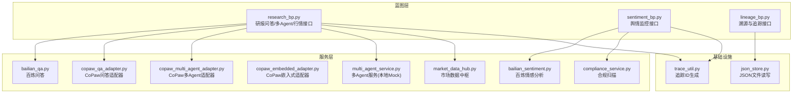
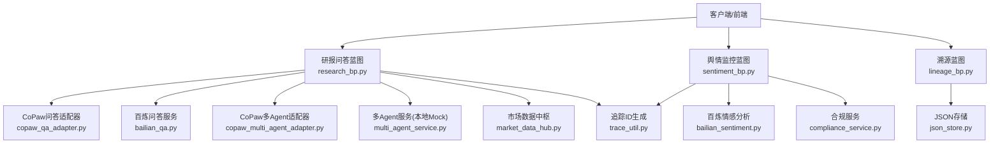
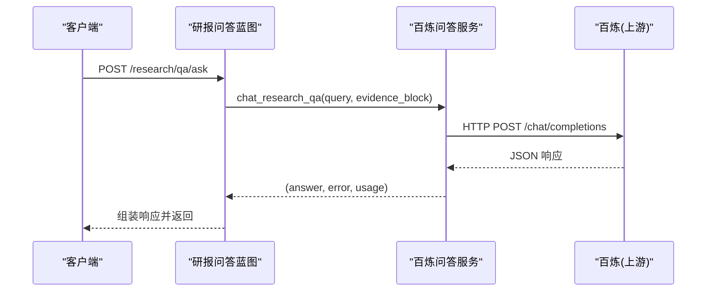
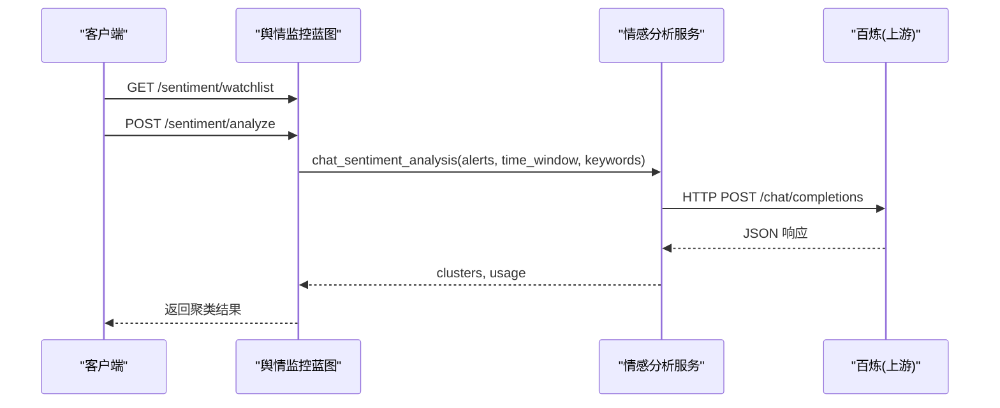
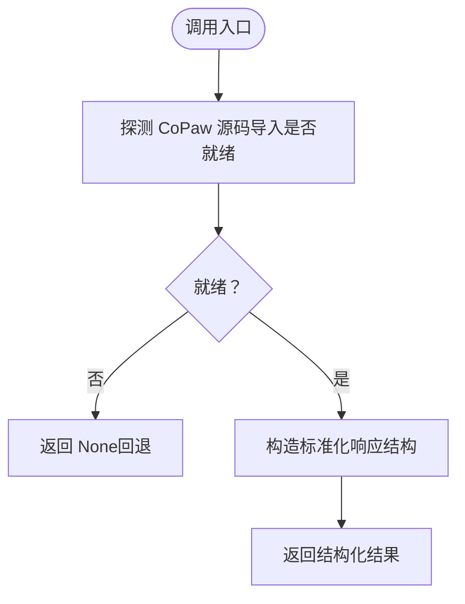
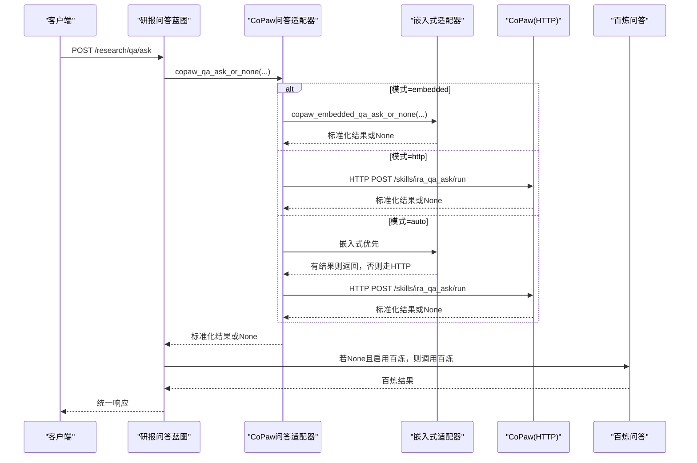
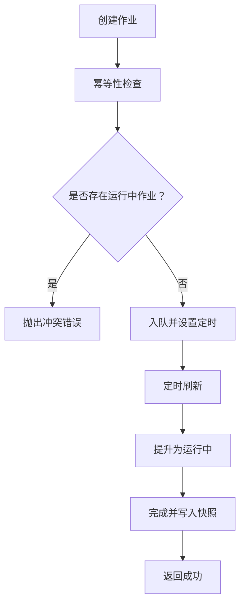
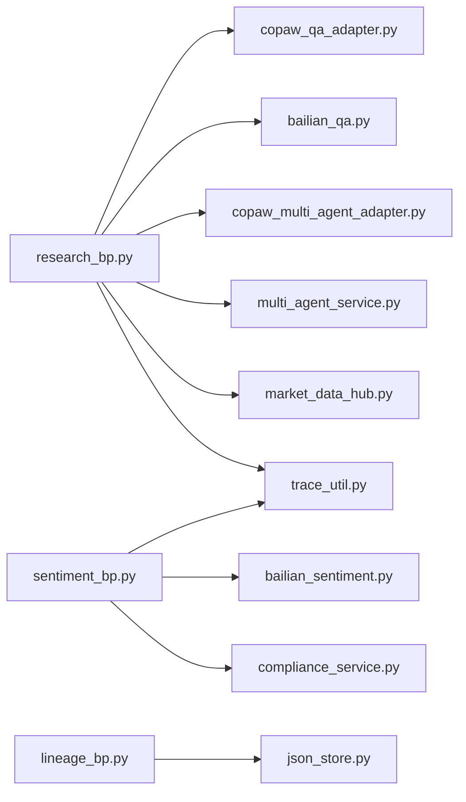

# 服务层架构

<cite>
**本文引用的文件**
- [main-project/backend/app/services/bailian_qa.py](file://main-project/backend/app/services/bailian_qa.py)
- [main-project/backend/app/services/bailian_sentiment.py](file://main-project/backend/app/services/bailian_sentiment.py)
- [main-project/backend/app/services/compliance_service.py](file://main-project/backend/app/services/compliance_service.py)
- [main-project/backend/app/services/copaw_embedded_adapter.py](file://main-project/backend/app/services/copaw_embedded_adapter.py)
- [main-project/backend/app/services/copaw_multi_agent_adapter.py](file://main-project/backend/app/services/copaw_multi_agent_adapter.py)
- [main-project/backend/app/services/copaw_qa_adapter.py](file://main-project/backend/app/services/copaw_qa_adapter.py)
- [main-project/backend/app/services/market_data_hub.py](file://main-project/backend/app/services/market_data_hub.py)
- [main-project/backend/app/services/multi_agent_service.py](file://main-project/backend/app/services/multi_agent_service.py)
- [main-project/backend/app/blueprints/research_bp.py](file://main-project/backend/app/blueprints/research_bp.py)
- [main-project/backend/app/blueprints/sentiment_bp.py](file://main-project/backend/app/blueprints/sentiment_bp.py)
- [main-project/backend/app/blueprints/lineage_bp.py](file://main-project/backend/app/blueprints/lineage_bp.py)
- [main-project/backend/app/trace_util.py](file://main-project/backend/app/trace_util.py)
- [main-project/backend/app/json_store.py](file://main-project/backend/app/json_store.py)
- [main-project/backend/scripts/copaw_embedded_adapter_smoke.py](file://main-project/backend/scripts/copaw_embedded_adapter_smoke.py)
- [specs/copaw-repowiki/content/项目概述/项目概述.md](file://specs/copaw-repowiki/content/项目概述/项目概述.md)
</cite>

## 目录
1. [简介](#简介)
2. [项目结构](#项目结构)
3. [核心组件](#核心组件)
4. [架构总览](#架构总览)
5. [详细组件分析](#详细组件分析)
6. [依赖分析](#依赖分析)
7. [性能考虑](#性能考虑)
8. [故障排查指南](#故障排查指南)
9. [结论](#结论)
10. [附录](#附录)

## 简介
本文件面向服务层架构，系统化阐述服务层的设计模式与架构原则，重点解析适配器模式在外部系统集成中的应用，以及多Agent编排、合规与风险控制、市场数据中枢等模块的职责边界与交互方式。文档同时给出服务间通信机制、数据转换与错误处理策略、服务发现与容错回退、扩展与性能优化建议，并提供可落地的集成架构图与代码示例路径。

## 项目结构
服务层位于 main-project/backend/app 下，采用“蓝图 + 服务模块”的分层组织方式：
- 蓝图层：对外暴露 REST 接口，负责参数校验、路由分发与响应封装。
- 服务层：封装业务能力与外部系统集成，提供稳定契约与可插拔适配。
- 工具与基础设施：追踪工具、JSON 存储、配置读取等。

**图表来源**
- [main-project/backend/app/blueprints/research_bp.py:1-403](file://main-project/backend/app/blueprints/research_bp.py#L1-L403)
- [main-project/backend/app/blueprints/sentiment_bp.py:1-46](file://main-project/backend/app/blueprints/sentiment_bp.py#L1-L46)
- [main-project/backend/app/blueprints/lineage_bp.py:1-53](file://main-project/backend/app/blueprints/lineage_bp.py#L1-L53)
- [main-project/backend/app/services/bailian_qa.py:1-97](file://main-project/backend/app/services/bailian_qa.py#L1-L97)
- [main-project/backend/app/services/bailian_sentiment.py:1-104](file://main-project/backend/app/services/bailian_sentiment.py#L1-L104)
- [main-project/backend/app/services/compliance_service.py:1-19](file://main-project/backend/app/services/compliance_service.py#L1-L19)
- [main-project/backend/app/services/copaw_embedded_adapter.py:1-126](file://main-project/backend/app/services/copaw_embedded_adapter.py#L1-L126)
- [main-project/backend/app/services/copaw_multi_agent_adapter.py:1-59](file://main-project/backend/app/services/copaw_multi_agent_adapter.py#L1-L59)
- [main-project/backend/app/services/copaw_qa_adapter.py:1-232](file://main-project/backend/app/services/copaw_qa_adapter.py#L1-L232)
- [main-project/backend/app/services/market_data_hub.py:1-323](file://main-project/backend/app/services/market_data_hub.py#L1-L323)
- [main-project/backend/app/services/multi_agent_service.py:1-150](file://main-project/backend/app/services/multi_agent_service.py#L1-L150)
- [main-project/backend/app/trace_util.py:1-6](file://main-project/backend/app/trace_util.py#L1-L6)
- [main-project/backend/app/json_store.py:1-29](file://main-project/backend/app/json_store.py#L1-L29)

**章节来源**
- [main-project/backend/app/blueprints/research_bp.py:1-403](file://main-project/backend/app/blueprints/research_bp.py#L1-L403)
- [main-project/backend/app/blueprints/sentiment_bp.py:1-46](file://main-project/backend/app/blueprints/sentiment_bp.py#L1-L46)
- [main-project/backend/app/blueprints/lineage_bp.py:1-53](file://main-project/backend/app/blueprints/lineage_bp.py#L1-L53)
- [main-project/backend/app/services/bailian_qa.py:1-97](file://main-project/backend/app/services/bailian_qa.py#L1-L97)
- [main-project/backend/app/services/bailian_sentiment.py:1-104](file://main-project/backend/app/services/bailian_sentiment.py#L1-L104)
- [main-project/backend/app/services/compliance_service.py:1-19](file://main-project/backend/app/services/compliance_service.py#L1-L19)
- [main-project/backend/app/services/copaw_embedded_adapter.py:1-126](file://main-project/backend/app/services/copaw_embedded_adapter.py#L1-L126)
- [main-project/backend/app/services/copaw_multi_agent_adapter.py:1-59](file://main-project/backend/app/services/copaw_multi_agent_adapter.py#L1-L59)
- [main-project/backend/app/services/copaw_qa_adapter.py:1-232](file://main-project/backend/app/services/copaw_qa_adapter.py#L1-L232)
- [main-project/backend/app/services/market_data_hub.py:1-323](file://main-project/backend/app/services/market_data_hub.py#L1-L323)
- [main-project/backend/app/services/multi_agent_service.py:1-150](file://main-project/backend/app/services/multi_agent_service.py#L1-L150)
- [main-project/backend/app/trace_util.py:1-6](file://main-project/backend/app/trace_util.py#L1-L6)
- [main-project/backend/app/json_store.py:1-29](file://main-project/backend/app/json_store.py#L1-L29)

## 核心组件
- 百炼问答服务：封装阿里云百炼（DashScope）OpenAI 兼容接口，提供研报问答能力，支持环境变量配置与错误兜底。
- 情感分析服务：基于百炼模型进行结构化舆情聚类与风险评估，输出标准化 JSON。
- 合规服务：轻量规则扫描，支持高风险话术识别与标注。
- CoPaw 嵌入式适配器：在不改变现有 HTTP 适配器与路由逻辑的前提下，直接调用 CoPaw 源码组件，验证“老项目内嵌新能力”的可行性。
- 多Agent 适配器：在不破坏外部契约的前提下，优先尝试 CoPaw 多 Agent 编排；不可用时回退本地 Mock 编排。
- 市场数据中枢：统一行情数据来源与作业调度，提供 Mock 数据与异步作业管理。
- 多Agent 服务：本地 Mock 的多 Agent 对话与合规编排，用于 Workshop 演示与测试。
- 蓝图层：研报问答、多Agent、行情与舆情监控接口；溯源与追踪接口。
- 基础设施：追踪 ID 生成、JSON 文件读写。

**章节来源**
- [main-project/backend/app/services/bailian_qa.py:1-97](file://main-project/backend/app/services/bailian_qa.py#L1-L97)
- [main-project/backend/app/services/bailian_sentiment.py:1-104](file://main-project/backend/app/services/bailian_sentiment.py#L1-L104)
- [main-project/backend/app/services/compliance_service.py:1-19](file://main-project/backend/app/services/compliance_service.py#L1-L19)
- [main-project/backend/app/services/copaw_embedded_adapter.py:1-126](file://main-project/backend/app/services/copaw_embedded_adapter.py#L1-L126)
- [main-project/backend/app/services/copaw_multi_agent_adapter.py:1-59](file://main-project/backend/app/services/copaw_multi_agent_adapter.py#L1-L59)
- [main-project/backend/app/services/copaw_qa_adapter.py:1-232](file://main-project/backend/app/services/copaw_qa_adapter.py#L1-L232)
- [main-project/backend/app/services/market_data_hub.py:1-323](file://main-project/backend/app/services/market_data_hub.py#L1-L323)
- [main-project/backend/app/services/multi_agent_service.py:1-150](file://main-project/backend/app/services/multi_agent_service.py#L1-L150)
- [main-project/backend/app/blueprints/research_bp.py:1-403](file://main-project/backend/app/blueprints/research_bp.py#L1-L403)
- [main-project/backend/app/blueprints/sentiment_bp.py:1-46](file://main-project/backend/app/blueprints/sentiment_bp.py#L1-L46)
- [main-project/backend/app/blueprints/lineage_bp.py:1-53](file://main-project/backend/app/blueprints/lineage_bp.py#L1-L53)
- [main-project/backend/app/trace_util.py:1-6](file://main-project/backend/app/trace_util.py#L1-L6)
- [main-project/backend/app/json_store.py:1-29](file://main-project/backend/app/json_store.py#L1-L29)

## 架构总览
服务层采用“适配器 + 多提供者 + 可插拔”的设计，通过 CoPaw 问答与多Agent适配器实现对外契约不变的“可替换执行引擎”。蓝图层统一入口，服务层负责能力封装与外部系统集成，基础设施提供追踪与持久化。

**图表来源**
- [main-project/backend/app/blueprints/research_bp.py:1-403](file://main-project/backend/app/blueprints/research_bp.py#L1-L403)
- [main-project/backend/app/blueprints/sentiment_bp.py:1-46](file://main-project/backend/app/blueprints/sentiment_bp.py#L1-L46)
- [main-project/backend/app/blueprints/lineage_bp.py:1-53](file://main-project/backend/app/blueprints/lineage_bp.py#L1-L53)
- [main-project/backend/app/services/copaw_qa_adapter.py:1-232](file://main-project/backend/app/services/copaw_qa_adapter.py#L1-L232)
- [main-project/backend/app/services/bailian_qa.py:1-97](file://main-project/backend/app/services/bailian_qa.py#L1-L97)
- [main-project/backend/app/services/copaw_multi_agent_adapter.py:1-59](file://main-project/backend/app/services/copaw_multi_agent_adapter.py#L1-L59)
- [main-project/backend/app/services/multi_agent_service.py:1-150](file://main-project/backend/app/services/multi_agent_service.py#L1-L150)
- [main-project/backend/app/services/market_data_hub.py:1-323](file://main-project/backend/app/services/market_data_hub.py#L1-L323)
- [main-project/backend/app/services/bailian_sentiment.py:1-104](file://main-project/backend/app/services/bailian_sentiment.py#L1-L104)
- [main-project/backend/app/services/compliance_service.py:1-19](file://main-project/backend/app/services/compliance_service.py#L1-L19)
- [main-project/backend/app/trace_util.py:1-6](file://main-project/backend/app/trace_util.py#L1-L6)
- [main-project/backend/app/json_store.py:1-29](file://main-project/backend/app/json_store.py#L1-L29)

## 详细组件分析

### 百炼问答服务（bailian_qa）
- 设计要点：通过环境变量配置 API Key、模型与基础地址，统一 OpenAI 兼容接口调用；对网络异常、HTTP 错误与空响应进行显式错误返回。
- 数据结构：输入用户查询与证据块，输出答案文本、错误信息与用量元数据。
- 错误处理：区分“上游禁用”“网络异常”“HTTP 错误”“空响应”等场景，保障服务可用性优先。

**图表来源**
- [main-project/backend/app/blueprints/research_bp.py:73-172](file://main-project/backend/app/blueprints/research_bp.py#L73-L172)
- [main-project/backend/app/services/bailian_qa.py:46-97](file://main-project/backend/app/services/bailian_qa.py#L46-L97)

**章节来源**
- [main-project/backend/app/services/bailian_qa.py:1-97](file://main-project/backend/app/services/bailian_qa.py#L1-L97)
- [main-project/backend/app/blueprints/research_bp.py:73-172](file://main-project/backend/app/blueprints/research_bp.py#L73-L172)

### 情感分析服务（bailian_sentiment）
- 设计要点：基于百炼模型进行结构化舆情聚类与风险评估，输出固定 JSON 结构；对空响应与解析失败进行兜底。
- 数据结构：输入告警列表、时间窗口与关键词，输出聚类数组与用量元数据。
- 错误处理：HTTP 非 200 直接抛错，确保调用方感知上游异常。

**图表来源**
- [main-project/backend/app/blueprints/sentiment_bp.py:24-46](file://main-project/backend/app/blueprints/sentiment_bp.py#L24-L46)
- [main-project/backend/app/services/bailian_sentiment.py:49-104](file://main-project/backend/app/services/bailian_sentiment.py#L49-L104)

**章节来源**
- [main-project/backend/app/services/bailian_sentiment.py:1-104](file://main-project/backend/app/services/bailian_sentiment.py#L1-L104)
- [main-project/backend/app/blueprints/sentiment_bp.py:1-46](file://main-project/backend/app/blueprints/sentiment_bp.py#L1-L46)

### 合规服务（compliance_service）
- 设计要点：最小规则扫描，支持高风险话术识别与标注，便于在生成链路中快速拦截。
- 数据结构：输入文本与规则集，输出命中项列表。

**章节来源**
- [main-project/backend/app/services/compliance_service.py:1-19](file://main-project/backend/app/services/compliance_service.py#L1-L19)

### CoPaw 嵌入式适配器（copaw_embedded_adapter）
- 设计要点：在不改变现有 HTTP 适配器与路由逻辑的前提下，直接导入并调用 CoPaw 源码组件，验证“内嵌可行性”；提供探测与状态查询。
- 数据结构：返回标准化答案、证据引用、风险等级、模型元数据与合规信息。
- 错误处理：导入失败或探测失败返回 None，便于上层回退。

**图表来源**
- [main-project/backend/app/services/copaw_embedded_adapter.py:37-126](file://main-project/backend/app/services/copaw_embedded_adapter.py#L37-L126)

**章节来源**
- [main-project/backend/app/services/copaw_embedded_adapter.py:1-126](file://main-project/backend/app/services/copaw_embedded_adapter.py#L1-L126)
- [main-project/backend/scripts/copaw_embedded_adapter_smoke.py:1-34](file://main-project/backend/scripts/copaw_embedded_adapter_smoke.py#L1-L34)

### 多Agent 适配器（copaw_multi_agent_adapter）
- 设计要点：在不破坏外部契约前提下，优先尝试 CoPaw 多 Agent 编排；不可用时回退本地 Mock。
- 数据结构：期望返回合并文本、讨论记录、Agent 列表、消息轨迹、合规信息等。

**章节来源**
- [main-project/backend/app/services/copaw_multi_agent_adapter.py:1-59](file://main-project/backend/app/services/copaw_multi_agent_adapter.py#L1-L59)
- [main-project/backend/app/blueprints/research_bp.py:279-333](file://main-project/backend/app/blueprints/research_bp.py#L279-L333)

### CoPaw 问答适配器（copaw_qa_adapter）
- 设计要点：在不破坏现有 `/research/qa/ask` 外部契约的前提下，将“生成答案/证据/风控字段”替换为由 CoPaw 执行的结果；支持 off/http/embedded/auto 多模式。
- 数据结构：统一 pick 策略兼容不同 Agent 返回字段，输出标准化结构。
- 错误处理：HTTP 异常、非 200、非 JSON、空答案均回退至现有逻辑。

**图表来源**
- [main-project/backend/app/blueprints/research_bp.py:73-172](file://main-project/backend/app/blueprints/research_bp.py#L73-L172)
- [main-project/backend/app/services/copaw_qa_adapter.py:175-232](file://main-project/backend/app/services/copaw_qa_adapter.py#L175-L232)
- [main-project/backend/app/services/copaw_embedded_adapter.py:77-126](file://main-project/backend/app/services/copaw_embedded_adapter.py#L77-L126)

**章节来源**
- [main-project/backend/app/services/copaw_qa_adapter.py:1-232](file://main-project/backend/app/services/copaw_qa_adapter.py#L1-L232)
- [main-project/backend/app/blueprints/research_bp.py:73-172](file://main-project/backend/app/blueprints/research_bp.py#L73-L172)

### 市场数据中枢（market_data_hub）
- 设计要点：统一行情数据来源与作业调度，支持 Mock 数据与异步作业管理；提供作业创建、刷新、快照查询等能力。
- 数据结构：作业对象包含状态、统计、上游信息与市场快照；快照对象包含报价与来源信息。
- 错误处理：幂等性检查、运行中冲突检测、远程拉取失败回退到 Mock 默认值。

**图表来源**
- [main-project/backend/app/services/market_data_hub.py:179-323](file://main-project/backend/app/services/market_data_hub.py#L179-L323)

**章节来源**
- [main-project/backend/app/services/market_data_hub.py:1-323](file://main-project/backend/app/services/market_data_hub.py#L1-L323)

### 多Agent 服务（multi_agent_service）
- 设计要点：本地 Mock 的多 Agent 对话与合规编排，用于 Workshop 演示与测试；生成标准化讨论记录、Agent 卡片与合并文本。
- 数据结构：包含编排轨迹、子轨迹、Agent 列表、讨论记录、消息轨迹、合并文本与合规信息。

**章节来源**
- [main-project/backend/app/services/multi_agent_service.py:1-150](file://main-project/backend/app/services/multi_agent_service.py#L1-L150)
- [main-project/backend/app/blueprints/research_bp.py:279-333](file://main-project/backend/app/blueprints/research_bp.py#L279-L333)

### 蓝图层与追踪（research_bp、sentiment_bp、lineage_bp）
- 研报问答蓝图：统一处理研报问答、股票分析、多Agent运行与历史查询；支持 X-Spec-Version 协议版本控制与追踪记录。
- 舆情监控蓝图：提供观察清单增删查与分析入口。
- 溯源蓝图：提供按 trace_id 查询与全文检索接口，配合 JSON 存储实现轻量追踪。

**章节来源**
- [main-project/backend/app/blueprints/research_bp.py:1-403](file://main-project/backend/app/blueprints/research_bp.py#L1-L403)
- [main-project/backend/app/blueprints/sentiment_bp.py:1-46](file://main-project/backend/app/blueprints/sentiment_bp.py#L1-L46)
- [main-project/backend/app/blueprints/lineage_bp.py:1-53](file://main-project/backend/app/blueprints/lineage_bp.py#L1-L53)
- [main-project/backend/app/json_store.py:1-29](file://main-project/backend/app/json_store.py#L1-L29)
- [main-project/backend/app/trace_util.py:1-6](file://main-project/backend/app/trace_util.py#L1-L6)

## 依赖分析
- 低耦合高内聚：蓝图层仅依赖服务层接口，服务层内部通过统一的错误返回与数据结构屏蔽外部差异。
- 适配器模式：CoPaw 问答与多Agent适配器通过统一接口与回退策略，实现“可插拔执行引擎”。
- 外部依赖：百炼问答/情感分析依赖 DashScope 兼容接口；CoPaw 适配器依赖 HTTP 或源码嵌入；市场数据中枢依赖 Mock API。
- 内部依赖：蓝图层依赖追踪工具与 JSON 存储，确保可观测与可审计。

**图表来源**
- [main-project/backend/app/blueprints/research_bp.py:1-403](file://main-project/backend/app/blueprints/research_bp.py#L1-L403)
- [main-project/backend/app/blueprints/sentiment_bp.py:1-46](file://main-project/backend/app/blueprints/sentiment_bp.py#L1-L46)
- [main-project/backend/app/blueprints/lineage_bp.py:1-53](file://main-project/backend/app/blueprints/lineage_bp.py#L1-L53)
- [main-project/backend/app/services/copaw_qa_adapter.py:1-232](file://main-project/backend/app/services/copaw_qa_adapter.py#L1-L232)
- [main-project/backend/app/services/bailian_qa.py:1-97](file://main-project/backend/app/services/bailian_qa.py#L1-L97)
- [main-project/backend/app/services/copaw_multi_agent_adapter.py:1-59](file://main-project/backend/app/services/copaw_multi_agent_adapter.py#L1-L59)
- [main-project/backend/app/services/multi_agent_service.py:1-150](file://main-project/backend/app/services/multi_agent_service.py#L1-L150)
- [main-project/backend/app/services/market_data_hub.py:1-323](file://main-project/backend/app/services/market_data_hub.py#L1-L323)
- [main-project/backend/app/services/bailian_sentiment.py:1-104](file://main-project/backend/app/services/bailian_sentiment.py#L1-L104)
- [main-project/backend/app/services/compliance_service.py:1-19](file://main-project/backend/app/services/compliance_service.py#L1-L19)
- [main-project/backend/app/trace_util.py:1-6](file://main-project/backend/app/trace_util.py#L1-L6)
- [main-project/backend/app/json_store.py:1-29](file://main-project/backend/app/json_store.py#L1-L29)

**章节来源**
- [main-project/backend/app/blueprints/research_bp.py:1-403](file://main-project/backend/app/blueprints/research_bp.py#L1-L403)
- [main-project/backend/app/blueprints/sentiment_bp.py:1-46](file://main-project/backend/app/blueprints/sentiment_bp.py#L1-L46)
- [main-project/backend/app/blueprints/lineage_bp.py:1-53](file://main-project/backend/app/blueprints/lineage_bp.py#L1-L53)
- [main-project/backend/app/services/copaw_qa_adapter.py:1-232](file://main-project/backend/app/services/copaw_qa_adapter.py#L1-L232)
- [main-project/backend/app/services/bailian_qa.py:1-97](file://main-project/backend/app/services/bailian_qa.py#L1-L97)
- [main-project/backend/app/services/copaw_multi_agent_adapter.py:1-59](file://main-project/backend/app/services/copaw_multi_agent_adapter.py#L1-L59)
- [main-project/backend/app/services/multi_agent_service.py:1-150](file://main-project/backend/app/services/multi_agent_service.py#L1-L150)
- [main-project/backend/app/services/market_data_hub.py:1-323](file://main-project/backend/app/services/market_data_hub.py#L1-L323)
- [main-project/backend/app/services/bailian_sentiment.py:1-104](file://main-project/backend/app/services/bailian_sentiment.py#L1-L104)
- [main-project/backend/app/services/compliance_service.py:1-19](file://main-project/backend/app/services/compliance_service.py#L1-L19)
- [main-project/backend/app/trace_util.py:1-6](file://main-project/backend/app/trace_util.py#L1-L6)
- [main-project/backend/app/json_store.py:1-29](file://main-project/backend/app/json_store.py#L1-L29)

## 性能考虑
- 超时与重试：百炼调用设置合理超时；适配器层对 HTTP 异常进行快速失败与回退，避免阻塞主线程。
- Mock 降级：市场数据中枢在上游不可用时回退到 Mock 默认值，保障前端体验。
- 幂等与去重：作业系统通过幂等键与运行中检测避免重复与竞态。
- 轻量存储：JSON 文件读写带锁，适合原型与小规模并发；生产建议迁移到数据库或分布式 KV。
- 追踪开销：追踪 ID 生成与 JSON 追加成本较低，建议在关键路径打点，避免过度埋点。

[本节为通用指导，无需特定文件引用]

## 故障排查指南
- 百炼禁用或配置错误：检查环境变量是否正确；若未配置 API Key，服务会返回禁用错误，蓝图层将降级到占位回答。
- CoPaw 适配器不可用：检查模式配置与依赖；embedded 模式需确保源码路径可导入；http 模式需确认 URL 与鉴权。
- 上游 HTTP 异常：查看适配器返回 None 的分支，确认网络连通性与超时设置。
- 作业冲突：若出现“作业已在运行”或“幂等回放”，检查幂等键与历史作业状态。
- 追溯查询：通过溯源蓝图按 trace_id 或关键字检索，定位问题根因。

**章节来源**
- [main-project/backend/app/services/bailian_qa.py:52-97](file://main-project/backend/app/services/bailian_qa.py#L52-L97)
- [main-project/backend/app/services/copaw_qa_adapter.py:41-67](file://main-project/backend/app/services/copaw_qa_adapter.py#L41-L67)
- [main-project/backend/app/services/market_data_hub.py:179-323](file://main-project/backend/app/services/market_data_hub.py#L179-L323)
- [main-project/backend/app/blueprints/lineage_bp.py:21-53](file://main-project/backend/app/blueprints/lineage_bp.py#L21-L53)

## 结论
服务层通过适配器模式实现了“外部契约不变、内部可替换”的架构目标，既可无缝接入 CoPaw 的多Agent与问答能力，又能在不可用时回退到百炼与本地 Mock，确保系统可用性与可演进性。蓝图层统一入口、服务层专注能力、基础设施提供可观测与持久化，形成清晰的分层与职责边界。建议在生产环境中引入服务发现与负载均衡、完善熔断与重试策略，并将 JSON 存储替换为更可靠的持久化方案。

[本节为总结，无需特定文件引用]

## 附录
- 代码示例路径
  - 百炼问答调用：[main-project/backend/app/services/bailian_qa.py:46-97](file://main-project/backend/app/services/bailian_qa.py#L46-L97)
  - 情感分析调用：[main-project/backend/app/services/bailian_sentiment.py:49-104](file://main-project/backend/app/services/bailian_sentiment.py#L49-L104)
  - CoPaw 嵌入式适配器探测与调用：[main-project/backend/app/services/copaw_embedded_adapter.py:37-126](file://main-project/backend/app/services/copaw_embedded_adapter.py#L37-L126)
  - CoPaw 问答适配器分发策略：[main-project/backend/app/services/copaw_qa_adapter.py:175-232](file://main-project/backend/app/services/copaw_qa_adapter.py#L175-L232)
  - 多Agent 适配器与回退：[main-project/backend/app/services/copaw_multi_agent_adapter.py:38-59](file://main-project/backend/app/services/copaw_multi_agent_adapter.py#L38-L59)
  - 市场数据中枢作业与快照：[main-project/backend/app/services/market_data_hub.py:179-323](file://main-project/backend/app/services/market_data_hub.py#L179-L323)
  - 蓝图层研报问答与多Agent运行：[main-project/backend/app/blueprints/research_bp.py:73-333](file://main-project/backend/app/blueprints/research_bp.py#L73-L333)
  - 舆情监控与合规扫描：[main-project/backend/app/blueprints/sentiment_bp.py:1-46](file://main-project/backend/app/blueprints/sentiment_bp.py#L1-L46)
  - 溯源与追踪：[main-project/backend/app/blueprints/lineage_bp.py:1-53](file://main-project/backend/app/blueprints/lineage_bp.py#L1-L53)
  - 追踪ID生成：[main-project/backend/app/trace_util.py:4-6](file://main-project/backend/app/trace_util.py#L4-L6)
  - JSON 文件读写：[main-project/backend/app/json_store.py:13-29](file://main-project/backend/app/json_store.py#L13-L29)
  - CoPaw 架构概览（参考）：[specs/copaw-repowiki/content/项目概述/项目概述.md:101-126](file://specs/copaw-repowiki/content/项目概述/项目概述.md#L101-L126)

[本节为附录，无需特定文件引用]