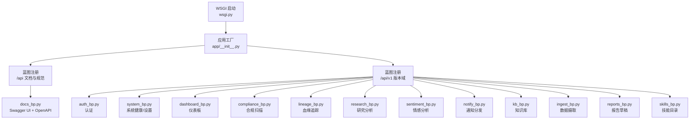
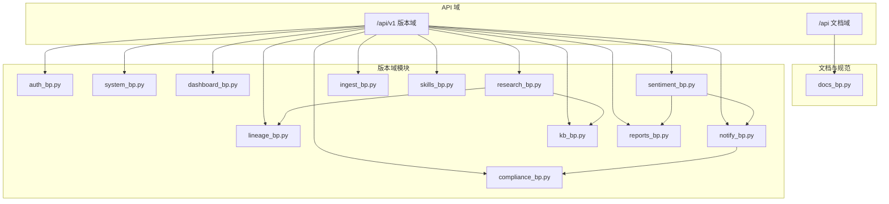
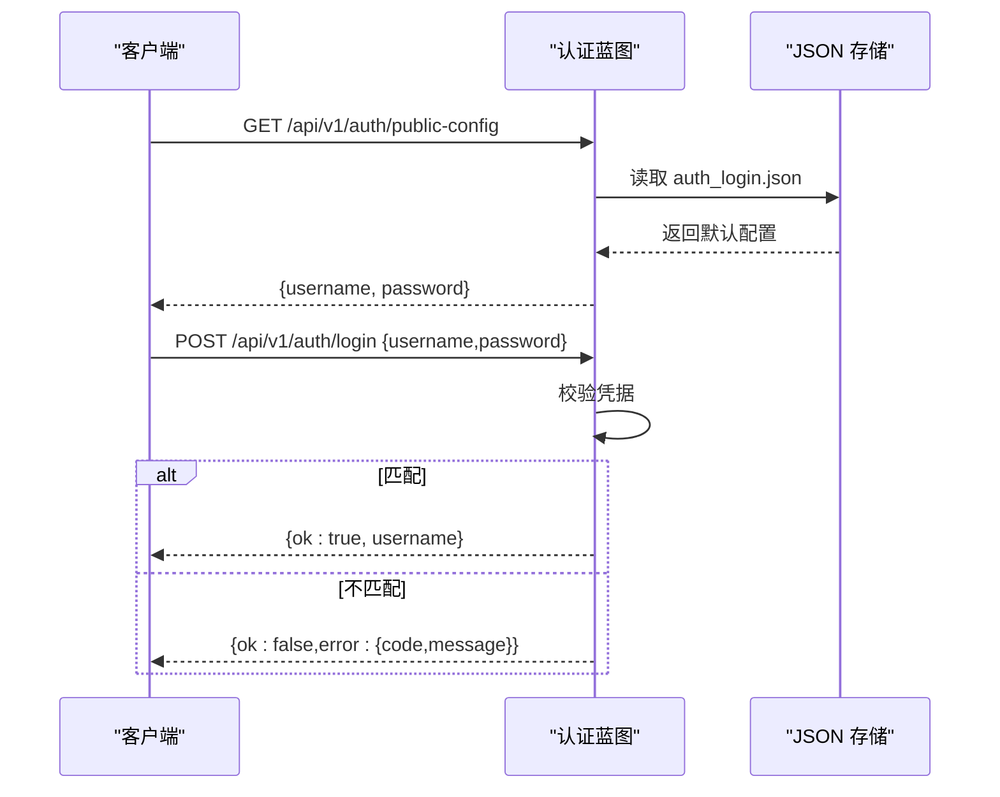
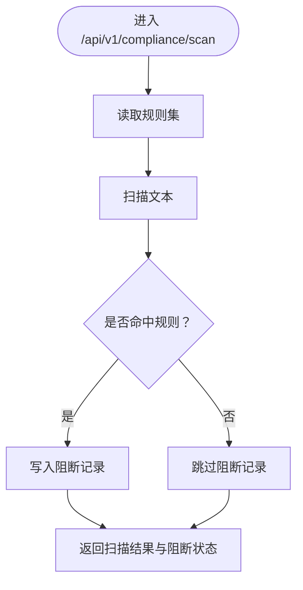
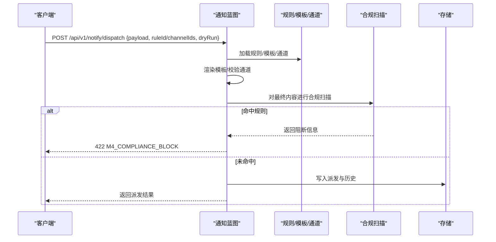
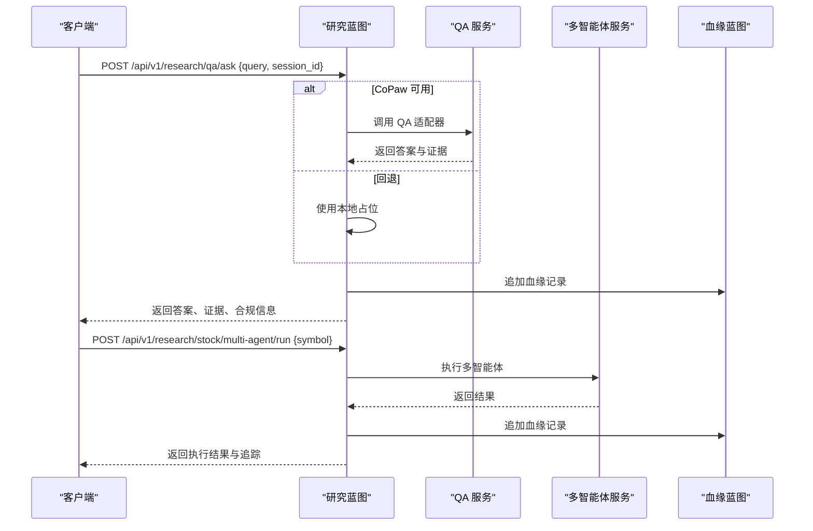
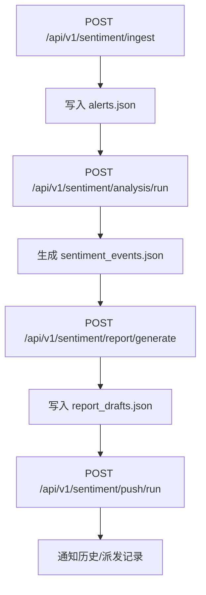
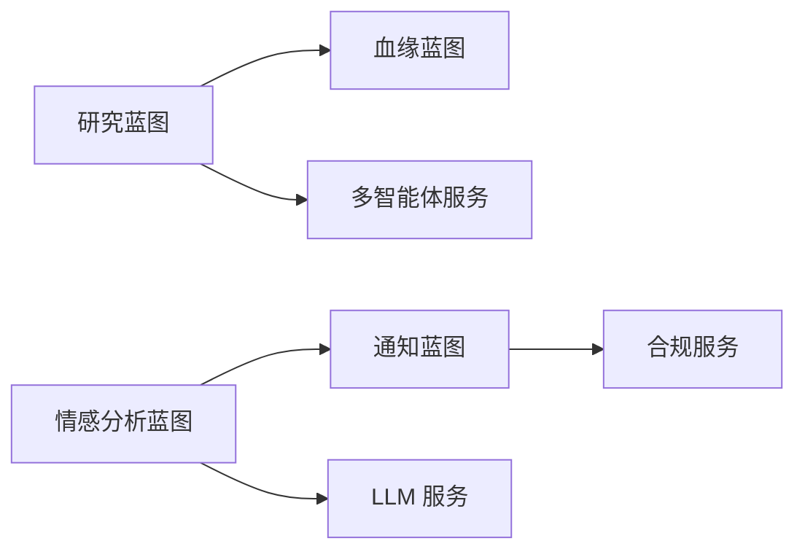

# 蓝图系统设计

<cite>
**本文档引用的文件**
- [main-project/backend/app/__init__.py](file://main-project/backend/app/__init__.py)
- [main-project/backend/wsgi.py](file://main-project/backend/wsgi.py)
- [main-project/backend/app/blueprints/__init__.py](file://main-project/backend/app/blueprints/__init__.py)
- [main-project/backend/app/blueprints/auth_bp.py](file://main-project/backend/app/blueprints/auth_bp.py)
- [main-project/backend/app/blueprints/compliance_bp.py](file://main-project/backend/app/blueprints/compliance_bp.py)
- [main-project/backend/app/blueprints/dashboard_bp.py](file://main-project/backend/app/blueprints/dashboard_bp.py)
- [main-project/backend/app/blueprints/docs_bp.py](file://main-project/backend/app/blueprints/docs_bp.py)
- [main-project/backend/app/blueprints/ingest_bp.py](file://main-project/backend/app/blueprints/ingest_bp.py)
- [main-project/backend/app/blueprints/kb_bp.py](file://main-project/backend/app/blueprints/kb_bp.py)
- [main-project/backend/app/blueprints/lineage_bp.py](file://main-project/backend/app/blueprints/lineage_bp.py)
- [main-project/backend/app/blueprints/notify_bp.py](file://main-project/backend/app/blueprints/notify_bp.py)
- [main-project/backend/app/blueprints/reports_bp.py](file://main-project/backend/app/blueprints/reports_bp.py)
- [main-project/backend/app/blueprints/research_bp.py](file://main-project/backend/app/blueprints/research_bp.py)
- [main-project/backend/app/blueprints/sentiment_bp.py](file://main-project/backend/app/blueprints/sentiment_bp.py)
- [main-project/backend/app/blueprints/skills_bp.py](file://main-project/backend/app/blueprints/skills_bp.py)
- [main-project/backend/app/blueprints/system_bp.py](file://main-project/backend/app/blueprints/system_bp.py)
</cite>

## 目录
1. [简介](#简介)
2. [项目结构](#项目结构)
3. [核心组件](#核心组件)
4. [架构总览](#架构总览)
5. [详细组件分析](#详细组件分析)
6. [依赖关系分析](#依赖关系分析)
7. [性能考量](#性能考量)
8. [故障排查指南](#故障排查指南)
9. [结论](#结论)
10. [附录](#附录)

## 简介
本文件面向蓝图系统设计，围绕 Flask 蓝图的组织方式与路由分层原则，系统梳理各蓝图模块的功能职责、业务边界、数据流与接口设计，并给出 URL 前缀分配规则、冲突规避策略、扩展指南与最佳实践。蓝图覆盖认证、合规管理、仪表板、文档管理、知识库、数据摄取、血缘关系、通知、报告、研究分析、情感分析、技能管理、系统管理等主题，形成统一的 API 命名与版本化入口。

## 项目结构
后端采用 Flask 应用工厂模式创建应用实例，蓝图在应用初始化时集中注册，按 URL 前缀进行分层，形成清晰的 API 版本与领域隔离。

图表来源
- [main-project/backend/wsgi.py:1-7](file://main-project/backend/wsgi.py#L1-L7)
- [main-project/backend/app/__init__.py:21-79](file://main-project/backend/app/__init__.py#L21-L79)

章节来源
- [main-project/backend/app/__init__.py:21-79](file://main-project/backend/app/__init__.py#L21-L79)
- [main-project/backend/wsgi.py:1-7](file://main-project/backend/wsgi.py#L1-L7)

## 核心组件
- 应用工厂与蓝图注册：集中注册各蓝图并按前缀划分 API 域，统一处理跨域与追踪头。
- 文档蓝图：提供 Swagger UI 与 OpenAPI 规范，便于联调与自动化客户端生成。
- 认证蓝图：提供公开配置查询与登录接口，支持从配置文件与环境变量加载凭据。
- 系统蓝图：系统健康状态、运行概览、设置与偏好管理。
- 仪表板蓝图：待办事项、KPI、近期会话等数据聚合。
- 合规蓝图：规则读取、文本扫描、阻断记录。
- 血缘蓝图：追踪记录的检索与搜索。
- 研究蓝图：QA 对话、文件上传、股票分析、多智能体执行与评审。
- 情感分析蓝图：监控清单、采集、分析流水线、事件与报表生成、推送。
- 通知蓝图：通道管理、模板管理、规则管理、派发与历史、推送兼容接口。
- 知识库蓝图：索引状态、文档列表。
- 数据摄取蓝图：健康检查、数据源与作业管理。
- 报告蓝图：报告草稿的增删改查。
- 技能蓝图：技能目录解析与校验。

章节来源
- [main-project/backend/app/blueprints/__init__.py:1-2](file://main-project/backend/app/blueprints/__init__.py#L1-L2)
- [main-project/backend/app/blueprints/docs_bp.py:1-46](file://main-project/backend/app/blueprints/docs_bp.py#L1-L46)
- [main-project/backend/app/blueprints/auth_bp.py:1-43](file://main-project/backend/app/blueprints/auth_bp.py#L1-L43)
- [main-project/backend/app/blueprints/system_bp.py:1-94](file://main-project/backend/app/blueprints/system_bp.py#L1-L94)
- [main-project/backend/app/blueprints/dashboard_bp.py:1-29](file://main-project/backend/app/blueprints/dashboard_bp.py#L1-L29)
- [main-project/backend/app/blueprints/compliance_bp.py:1-54](file://main-project/backend/app/blueprints/compliance_bp.py#L1-L54)
- [main-project/backend/app/blueprints/lineage_bp.py:1-53](file://main-project/backend/app/blueprints/lineage_bp.py#L1-L53)
- [main-project/backend/app/blueprints/research_bp.py:1-403](file://main-project/backend/app/blueprints/research_bp.py#L1-L403)
- [main-project/backend/app/blueprints/sentiment_bp.py:1-853](file://main-project/backend/app/blueprints/sentiment_bp.py#L1-L853)
- [main-project/backend/app/blueprints/notify_bp.py:1-465](file://main-project/backend/app/blueprints/notify_bp.py#L1-L465)
- [main-project/backend/app/blueprints/kb_bp.py:1-22](file://main-project/backend/app/blueprints/kb_bp.py#L1-L22)
- [main-project/backend/app/blueprints/ingest_bp.py:1-95](file://main-project/backend/app/blueprints/ingest_bp.py#L1-L95)
- [main-project/backend/app/blueprints/reports_bp.py:1-46](file://main-project/backend/app/blueprints/reports_bp.py#L1-L46)
- [main-project/backend/app/blueprints/skills_bp.py:1-110](file://main-project/backend/app/blueprints/skills_bp.py#L1-L110)

## 架构总览
蓝图体系通过统一的前缀与模块化路由，实现领域解耦与版本演进。下图展示关键蓝图之间的交互与数据流。

图表来源
- [main-project/backend/app/__init__.py:65-77](file://main-project/backend/app/__init__.py#L65-L77)
- [main-project/backend/app/blueprints/docs_bp.py:38-45](file://main-project/backend/app/blueprints/docs_bp.py#L38-L45)
- [main-project/backend/app/blueprints/research_bp.py:160-171](file://main-project/backend/app/blueprints/research_bp.py#L160-L171)
- [main-project/backend/app/blueprints/sentiment_bp.py:289-316](file://main-project/backend/app/blueprints/sentiment_bp.py#L289-L316)
- [main-project/backend/app/blueprints/notify_bp.py:353-356](file://main-project/backend/app/blueprints/notify_bp.py#L353-L356)

## 详细组件分析

### 认证蓝图（auth_bp）
- 功能职责
  - 提供公开配置查询，便于前端展示默认账号与密码。
  - 提供登录接口，校验用户名与密码，支持从配置文件与环境变量覆盖。
- 关键接口
  - GET /api/v1/auth/public-config
  - POST /api/v1/auth/login
- 实现要点
  - 从仓库根目录下的配置文件读取默认凭据，支持环境变量覆盖。
  - 登录成功返回用户名，失败返回标准化错误码与消息。
- 错误处理
  - 使用统一错误响应格式，返回 INVALID_CREDENTIALS 等错误码。

图表来源
- [main-project/backend/app/blueprints/auth_bp.py:27-42](file://main-project/backend/app/blueprints/auth_bp.py#L27-L42)

章节来源
- [main-project/backend/app/blueprints/auth_bp.py:1-43](file://main-project/backend/app/blueprints/auth_bp.py#L1-L43)

### 合规蓝图（compliance_bp）
- 功能职责
  - 读取规则集，对文本进行扫描，记录阻断项。
- 关键接口
  - GET /api/v1/compliance/rules
  - POST /api/v1/compliance/scan
  - GET /api/v1/compliance/blocks/recent
- 处理流程
  - 读取规则集 → 扫描输入文本 → 写入阻断记录 → 返回扫描结果与阻断状态。

图表来源
- [main-project/backend/app/blueprints/compliance_bp.py:22-47](file://main-project/backend/app/blueprints/compliance_bp.py#L22-L47)

章节来源
- [main-project/backend/app/blueprints/compliance_bp.py:1-54](file://main-project/backend/app/blueprints/compliance_bp.py#L1-L54)

### 仪表板蓝图（dashboard_bp）
- 功能职责
  - 提供待办事项、KPI、近期会话等聚合数据。
- 关键接口
  - GET /api/v1/dashboard/todos
  - GET /api/v1/dashboard/kpi
  - GET /api/v1/sessions/recent

章节来源
- [main-project/backend/app/blueprints/dashboard_bp.py:1-29](file://main-project/backend/app/blueprints/dashboard_bp.py#L1-L29)

### 文档蓝图（docs_bp）
- 功能职责
  - 提供 Swagger UI 页面与 OpenAPI JSON 规范。
- 关键接口
  - GET /api/docs
  - GET /api/v1/openapi.json

章节来源
- [main-project/backend/app/blueprints/docs_bp.py:1-46](file://main-project/backend/app/blueprints/docs_bp.py#L1-L46)

### 知识库蓝图（kb_bp）
- 功能职责
  - 查询索引状态与文档列表。
- 关键接口
  - GET /api/v1/kb/index/status
  - GET /api/v1/kb/documents

章节来源
- [main-project/backend/app/blueprints/kb_bp.py:1-22](file://main-project/backend/app/blueprints/kb_bp.py#L1-L22)

### 数据摄取蓝图（ingest_bp）
- 功能职责
  - 健康检查、数据源查询、作业创建与同步、作业详情刷新。
- 关键接口
  - GET /api/v1/ingest/health
  - GET /api/v1/ingest/sources
  - GET /api/v1/ingest/sources/{source_id}
  - POST /api/v1/ingest/jobs
  - GET /api/v1/ingest/jobs
  - POST /api/v1/ingest/sources/{source_id}/sync
  - GET /api/v1/ingest/jobs/{job_id}
- 错误处理
  - 统一返回 VALIDATION_ERROR、NOT_FOUND、INVALID_STATE、M2_IDEMPOTENCY_REPLAY、M2_JOB_ALREADY_RUNNING 等错误码。

章节来源
- [main-project/backend/app/blueprints/ingest_bp.py:1-95](file://main-project/backend/app/blueprints/ingest_bp.py#L1-L95)

### 血缘蓝图（lineage_bp）
- 功能职责
  - 追踪记录的查询与全文检索。
- 关键接口
  - GET /api/v1/lineage/traces/{trace_id}
  - GET /api/v1/lineage/search?q=&limit=
- 数据结构
  - 追踪记录存储于 traces.json，支持按 trace_id、摘要、市场快照 ID 等字段检索。

章节来源
- [main-project/backend/app/blueprints/lineage_bp.py:1-53](file://main-project/backend/app/blueprints/lineage_bp.py#L1-L53)

### 通知蓝图（notify_bp）
- 功能职责
  - 通道管理、模板管理、规则管理、派发与历史、推送兼容接口。
- 关键接口
  - 通道：GET/PUT /api/v1/notify/channels
  - 测试：POST /api/v1/notify/channels/{type}/test
  - 模板：GET/POST/PATCH/DELETE /api/v1/notify/templates[/...]
  - 规则：GET/POST/PATCH/DELETE /api/v1/notify/rules[/...]
  - 派发：POST /api/v1/notify/dispatch
  - 历史：GET /api/v1/notify/history
  - 推送：POST /api/v1/notify/push
- 处理流程
  - 解析规则与模板 → 渲染内容 → 合规扫描 → 记录派发与历史 → 返回派发结果。

图表来源
- [main-project/backend/app/blueprints/notify_bp.py:309-395](file://main-project/backend/app/blueprints/notify_bp.py#L309-L395)
- [main-project/backend/app/blueprints/notify_bp.py:418-464](file://main-project/backend/app/blueprints/notify_bp.py#L418-L464)

章节来源
- [main-project/backend/app/blueprints/notify_bp.py:1-465](file://main-project/backend/app/blueprints/notify_bp.py#L1-L465)

### 报告蓝图（reports_bp）
- 功能职责
  - 报告草稿的列表与单个草稿的查询/更新。
- 关键接口
  - GET /api/v1/reports/drafts
  - GET/PATCH /api/v1/reports/drafts/{draft_id}

章节来源
- [main-project/backend/app/blueprints/reports_bp.py:1-46](file://main-project/backend/app/blueprints/reports_bp.py#L1-L46)

### 研究蓝图（research_bp）
- 功能职责
  - QA 对话、文件上传、股票分析、多智能体执行与评审。
- 关键接口
  - POST /api/v1/research/qa/ask
  - POST /api/v1/research/qa/upload
  - POST /api/v1/research/stock/analysis
  - GET /api/v1/research/stock/quote
  - POST /api/v1/research/stock/multi-agent/run
  - GET /api/v1/research/stock/multi-agent/runs
  - PATCH /api/v1/research/stock/multi-agent/runs/{trace_id}/review
- 数据流
  - QA 对话 → 血缘记录 → 合规与证据引用。
  - 多智能体执行 → 运行记录 → 血缘记录 → 评审闭环。

图表来源
- [main-project/backend/app/blueprints/research_bp.py:73-172](file://main-project/backend/app/blueprints/research_bp.py#L73-L172)
- [main-project/backend/app/blueprints/research_bp.py:279-333](file://main-project/backend/app/blueprints/research_bp.py#L279-L333)
- [main-project/backend/app/blueprints/research_bp.py:160-171](file://main-project/backend/app/blueprints/research_bp.py#L160-L171)

章节来源
- [main-project/backend/app/blueprints/research_bp.py:1-403](file://main-project/backend/app/blueprints/research_bp.py#L1-L403)

### 情感分析蓝图（sentiment_bp）
- 功能职责
  - 监控清单管理、采集、分析流水线、事件与报表生成、推送。
- 关键接口
  - 监控：GET/POST/DELETE /api/v1/sentiment/watchlist
  - 采集：POST /api/v1/sentiment/ingest
  - 分析：POST /api/v1/sentiment/analysis/run
  - 事件：GET /api/v1/sentiment/events
  - 报表：POST /api/v1/sentiment/report/generate
  - 推送：POST /api/v1/sentiment/push/run
  - 计划任务：GET /api/v1/sentiment/cron/jobs
  - 一次性执行：POST /api/v1/sentiment/cron/jobs/run-once
- 数据流
  - 采集 → 分析流水线 → 事件 → 报表草稿 → 推送（合规扫描）。

图表来源
- [main-project/backend/app/blueprints/sentiment_bp.py:55-82](file://main-project/backend/app/blueprints/sentiment_bp.py#L55-L82)
- [main-project/backend/app/blueprints/sentiment_bp.py:85-214](file://main-project/backend/app/blueprints/sentiment_bp.py#L85-L214)
- [main-project/backend/app/blueprints/sentiment_bp.py:231-270](file://main-project/backend/app/blueprints/sentiment_bp.py#L231-L270)
- [main-project/backend/app/blueprints/sentiment_bp.py:273-316](file://main-project/backend/app/blueprints/sentiment_bp.py#L273-L316)

章节来源
- [main-project/backend/app/blueprints/sentiment_bp.py:1-853](file://main-project/backend/app/blueprints/sentiment_bp.py#L1-L853)

### 技能蓝图（skills_bp）
- 功能职责
  - 解析项目与个人技能目录，校验技能元数据。
- 关键接口
  - GET /api/v1/skills/catalog
- 数据结构
  - 从 .claude/skills 与用户家目录解析 SKILL.md 的 frontmatter 与正文，生成技能条目。

章节来源
- [main-project/backend/app/blueprints/skills_bp.py:1-110](file://main-project/backend/app/blueprints/skills_bp.py#L1-L110)

### 系统蓝图（system_bp）
- 功能职责
  - 系统健康检查、运行概览、设置与偏好管理。
- 关键接口
  - GET /api/v1/system/health
  - GET /api/v1/system/ops/summary
  - GET /api/v1/system/settings
  - PUT /api/v1/system/preferences

章节来源
- [main-project/backend/app/blueprints/system_bp.py:1-94](file://main-project/backend/app/blueprints/system_bp.py#L1-L94)

## 依赖关系分析
- 蓝图间依赖
  - 研究蓝图依赖血缘蓝图追加追踪记录。
  - 情感分析蓝图依赖通知蓝图进行合规扫描与历史记录。
  - 通知蓝图依赖合规服务进行内容扫描。
- 外部依赖
  - 研究蓝图依赖多智能体服务与 QA 适配器。
  - 情感分析蓝图依赖 LLM 服务与规则聚类回退。
- 数据存储
  - 各蓝图通过 JSON 存储模块读写本地数据文件，路径位于应用配置的 DATA_DIR 下。

图表来源
- [main-project/backend/app/blueprints/research_bp.py:160-171](file://main-project/backend/app/blueprints/research_bp.py#L160-L171)
- [main-project/backend/app/blueprints/sentiment_bp.py:289-316](file://main-project/backend/app/blueprints/sentiment_bp.py#L289-L316)
- [main-project/backend/app/blueprints/notify_bp.py:353-356](file://main-project/backend/app/blueprints/notify_bp.py#L353-L356)

## 性能考量
- 路由与前缀
  - 将文档与规范置于 /api，版本域置于 /api/v1，避免路径冲突并利于演进。
- 资源访问
  - CORS 在 /api/* 范围内开放，允许常见方法与必要头部，生产环境建议限制来源与方法。
- 数据访问
  - 各蓝图通过统一 JSON 存储读写，注意大列表查询时的分页与限制参数（如 limit）。
- 服务回退
  - 研究与情感分析在外部服务不可用时采用本地占位，保障演示可用性。

## 故障排查指南
- 认证失败
  - 检查 /api/v1/auth/public-config 获取默认凭据，确认环境变量覆盖是否生效。
- 合规阻断
  - 查看 /api/v1/compliance/blocks/recent 与扫描接口返回的命中规则，调整规则或内容。
- 通知派发失败
  - 检查 /api/v1/notify/channels 与 /api/v1/notify/rules，确认通道存在且规则启用；查看合规扫描返回的阻断信息。
- 数据摄取异常
  - 使用 /api/v1/ingest/health 检查模块状态，确认 sourceId 有效且启用；关注幂等与并发状态。
- 血缘查询不到
  - 使用 /api/v1/lineage/search 结合关键字与 limit 参数检索；确认追踪记录是否已写入。
- 研究分析异常
  - 检查 /api/v1/system/health 与 LLM 配置；确认多智能体执行来源与市场快照 ID。
- 情感分析无事件
  - 确认 /api/v1/sentiment/ingest 已写入数据；检查分析流水线是否成功生成事件。

章节来源
- [main-project/backend/app/blueprints/auth_bp.py:27-42](file://main-project/backend/app/blueprints/auth_bp.py#L27-L42)
- [main-project/backend/app/blueprints/compliance_bp.py:50-53](file://main-project/backend/app/blueprints/compliance_bp.py#L50-L53)
- [main-project/backend/app/blueprints/notify_bp.py:309-395](file://main-project/backend/app/blueprints/notify_bp.py#L309-L395)
- [main-project/backend/app/blueprints/ingest_bp.py:18-20](file://main-project/backend/app/blueprints/ingest_bp.py#L18-L20)
- [main-project/backend/app/blueprints/lineage_bp.py:21-27](file://main-project/backend/app/blueprints/lineage_bp.py#L21-L27)
- [main-project/backend/app/blueprints/system_bp.py:21-39](file://main-project/backend/app/blueprints/system_bp.py#L21-L39)

## 结论
本蓝图体系通过统一的前缀与模块化路由，实现了认证、合规、仪表板、文档、知识库、数据摄取、血缘、通知、报告、研究分析、情感分析、技能与系统管理的清晰分层。配合 JSON 存储与必要的外部服务回退机制，既满足教学演示场景，也为后续扩展与演进提供了稳定基础。

## 附录

### URL 前缀分配规则与路由冲突解决方案
- 前缀分配
  - /api：文档与 OpenAPI 规范。
  - /api/v1：版本化业务域。
- 冲突规避
  - 同一蓝图内使用不同 HTTP 方法区分同一资源的不同操作（如 GET/POST/PATCH）。
  - 使用路径参数与查询参数明确资源定位与过滤条件（如 /api/v1/notify/rules/{rule_id}、/api/v1/lineage/search?q=&limit=）。
  - 避免重复注册相同路径前缀与端点，确保蓝图注册顺序与前缀唯一性。

章节来源
- [main-project/backend/app/__init__.py:65-77](file://main-project/backend/app/__init__.py#L65-L77)

### 蓝图扩展指南与最佳实践
- 新增蓝图
  - 在 app/blueprints 下新增模块，定义 Blueprint 实例与路由。
  - 在应用工厂中导入并注册蓝图，选择合适的 URL 前缀。
- 接口设计
  - 统一使用 JSON 请求/响应，错误使用统一错误响应格式。
  - 使用查询参数与路径参数进行筛选与定位，提供 limit 与分页游标字段。
- 数据存储
  - 使用统一 JSON 存储模块读写本地数据文件，避免硬编码路径。
- 安全与合规
  - 对敏感操作增加鉴权与审计；对推送与扫描增加合规检查。
- 版本演进
  - 通过 /api/v1 等前缀承载稳定接口，新增能力以新前缀或新端点形式提供，避免破坏性变更。

章节来源
- [main-project/backend/app/blueprints/__init__.py:1-2](file://main-project/backend/app/blueprints/__init__.py#L1-L2)
- [main-project/backend/app/blueprints/notify_bp.py:353-356](file://main-project/backend/app/blueprints/notify_bp.py#L353-L356)