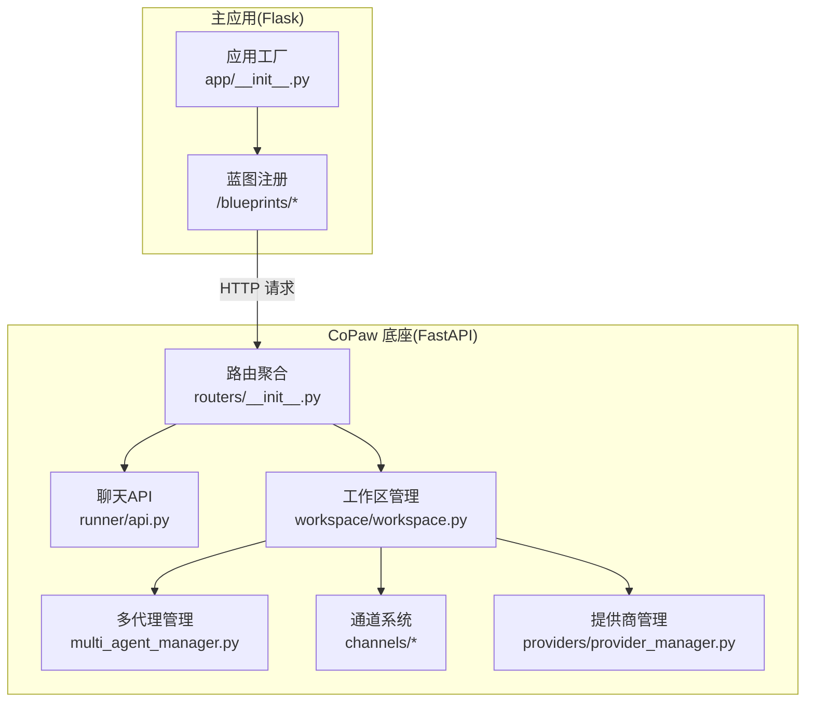
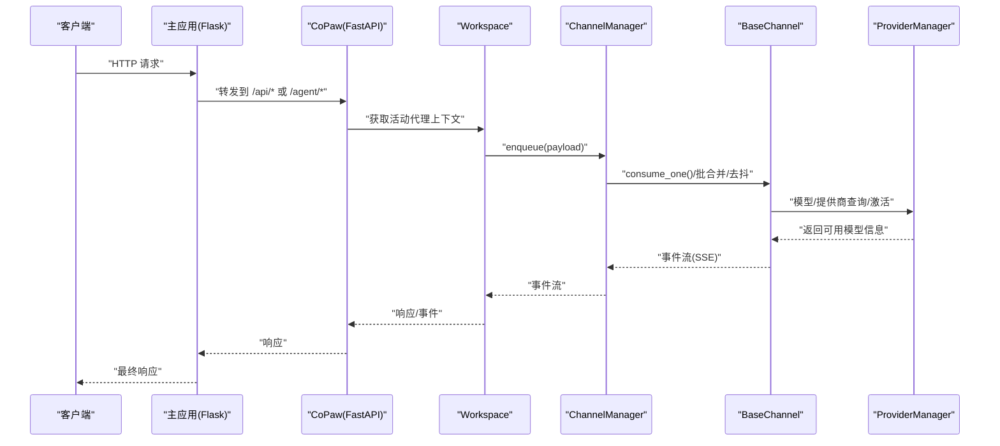
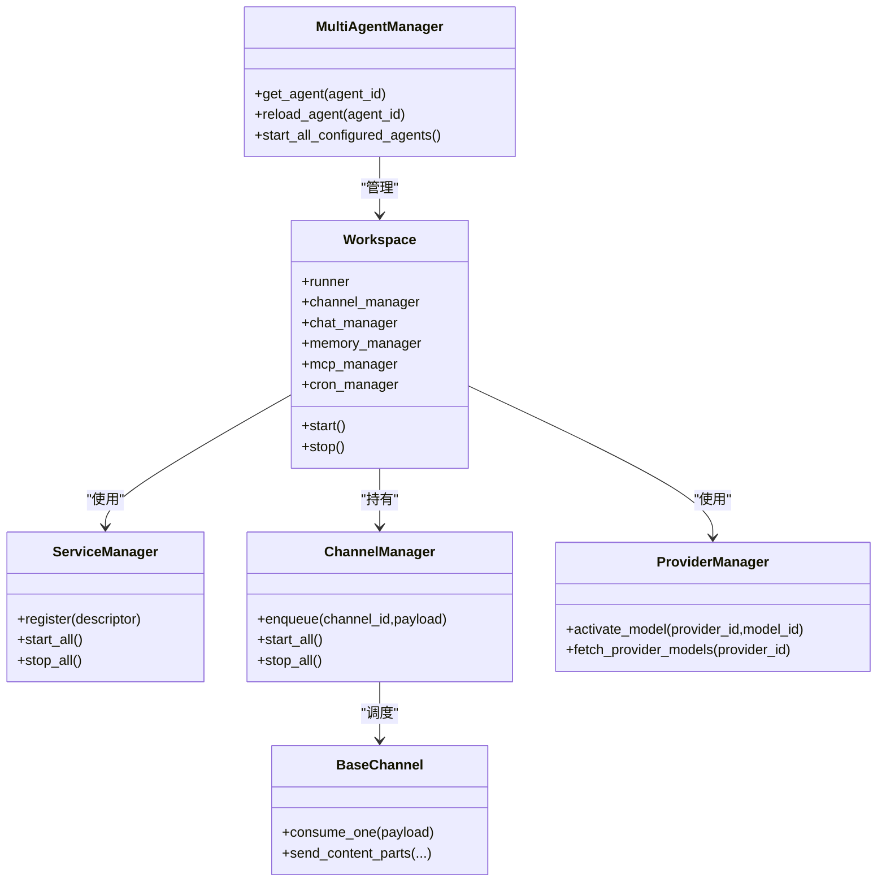
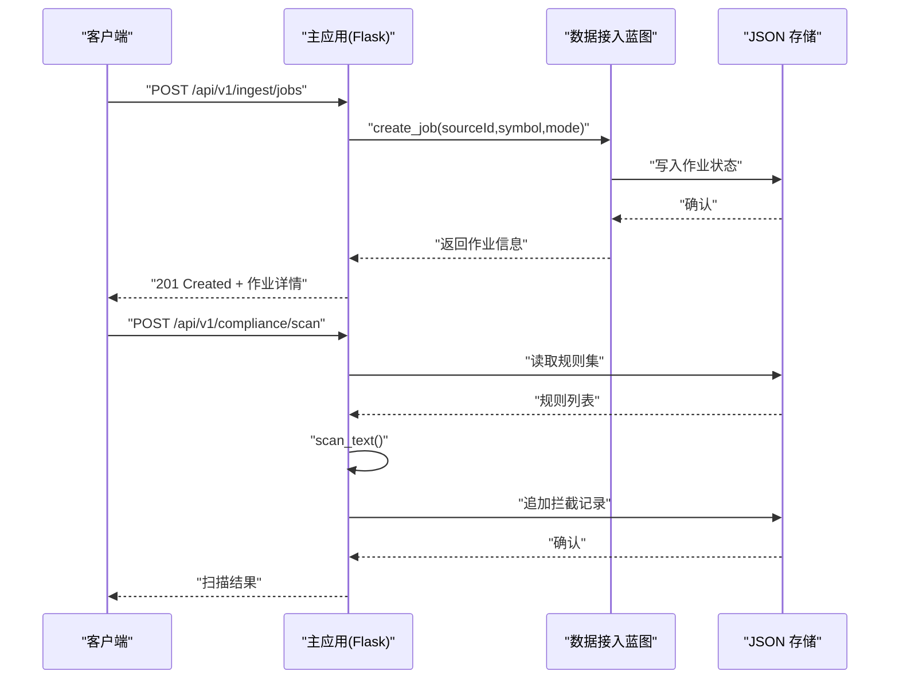
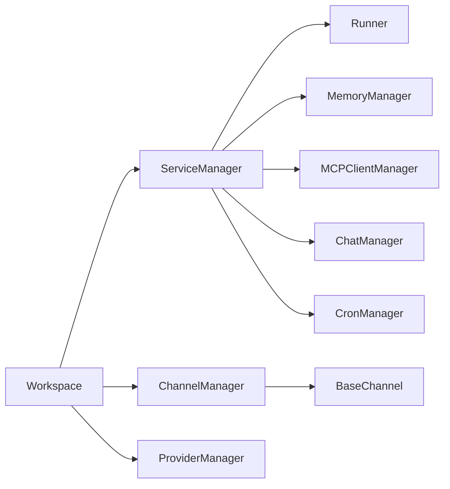

# 系统集成

<cite>
**本文引用的文件**
- [copaw/src/copaw/app/routers/__init__.py](file://copaw/src/copaw/app/routers/__init__.py)
- [copaw/src/copaw/app/routers/agent.py](file://copaw/src/copaw/app/routers/agent.py)
- [copaw/src/copaw/app/runner/api.py](file://copaw/src/copaw/app/runner/api.py)
- [copaw/src/copaw/app/workspace/workspace.py](file://copaw/src/copaw/app/workspace/workspace.py)
- [copaw/src/copaw/app/workspace/service_manager.py](file://copaw/src/copaw/app/workspace/service_manager.py)
- [copaw/src/copaw/app/multi_agent_manager.py](file://copaw/src/copaw/app/multi_agent_manager.py)
- [copaw/src/copaw/app/channels/base.py](file://copaw/src/copaw/app/channels/base.py)
- [copaw/src/copaw/app/channels/manager.py](file://copaw/src/copaw/app/channels/manager.py)
- [copaw/src/copaw/providers/provider_manager.py](file://copaw/src/copaw/providers/provider_manager.py)
- [main-project/backend/app/__init__.py](file://main-project/backend/app/__init__.py)
- [main-project/backend/app/blueprints/ingest_bp.py](file://main-project/backend/app/blueprints/ingest_bp.py)
- [main-project/backend/app/blueprints/compliance_bp.py](file://main-project/backend/app/blueprints/compliance_bp.py)
</cite>

## 目录
1. [引言](#引言)
2. [项目结构](#项目结构)
3. [核心组件](#核心组件)
4. [架构总览](#架构总览)
5. [详细组件分析](#详细组件分析)
6. [依赖分析](#依赖分析)
7. [性能考虑](#性能考虑)
8. [故障排查指南](#故障排查指南)
9. [结论](#结论)
10. [附录](#附录)

## 引言
本技术文档面向系统集成工程师与平台运维人员，围绕主应用与 CoPaw 底座的集成进行深入解析。重点涵盖：
- 主应用与 CoPaw 的集成架构与数据流
- 适配器模式在系统集成中的应用（嵌入式适配器、多代理适配器、问答适配器）
- 外部系统集成最佳实践（市场数据 Hub 与合规服务）
- 服务发现、负载均衡与故障转移策略
- API 网关与微服务通信配置指南
- 集成测试与监控告警实施方案
- 系统管理员的部署与运维管理指导

## 项目结构
本仓库包含两个主要子项目：
- 主应用（Python/Flask）：提供后端服务、API 蓝图与业务模块（合规、数据接入等）
- CoPaw 底座（Python/FastAPI）：提供多代理运行时、通道系统、模型提供商管理与工作区生命周期管理

图表来源
- [main-project/backend/app/__init__.py:21-80](file://main-project/backend/app/__init__.py#L21-L80)
- [copaw/src/copaw/app/routers/__init__.py:1-60](file://copaw/src/copaw/app/routers/__init__.py#L1-L60)
- [copaw/src/copaw/app/runner/api.py:1-241](file://copaw/src/copaw/app/runner/api.py#L1-L241)
- [copaw/src/copaw/app/workspace/workspace.py:1-389](file://copaw/src/copaw/app/workspace/workspace.py#L1-L389)
- [copaw/src/copaw/app/multi_agent_manager.py:1-462](file://copaw/src/copaw/app/multi_agent_manager.py#L1-L462)
- [copaw/src/copaw/app/channels/base.py:1-1171](file://copaw/src/copaw/app/channels/base.py#L1-L1171)
- [copaw/src/copaw/providers/provider_manager.py:1-1157](file://copaw/src/copaw/providers/provider_manager.py#L1-L1157)

章节来源
- [main-project/backend/app/__init__.py:21-80](file://main-project/backend/app/__init__.py#L21-L80)
- [copaw/src/copaw/app/routers/__init__.py:1-60](file://copaw/src/copaw/app/routers/__init__.py#L1-L60)

## 核心组件
- 工作区（Workspace）：封装单个代理的完整运行时，包含 Runner、ChannelManager、MemoryManager、MCPClientManager、CronManager 等服务，通过 ServiceManager 统一注册与生命周期管理。
- 多代理管理器（MultiAgentManager）：支持按需懒加载、零停机热重载、并发启动与优雅停止。
- 通道系统（Channels）：统一消息入队、去抖、批合并与消费；支持多种渠道（微信、钉钉、飞书等），具备任务跟踪与取消能力。
- 提供商管理（ProviderManager）：统一管理内置与自定义模型提供商，支持动态激活、探测与持久化。
- 主应用蓝图：提供合规扫描、市场数据接入等业务接口。

章节来源
- [copaw/src/copaw/app/workspace/workspace.py:47-389](file://copaw/src/copaw/app/workspace/workspace.py#L47-L389)
- [copaw/src/copaw/app/workspace/service_manager.py:74-421](file://copaw/src/copaw/app/workspace/service_manager.py#L74-L421)
- [copaw/src/copaw/app/multi_agent_manager.py:17-462](file://copaw/src/copaw/app/multi_agent_manager.py#L17-L462)
- [copaw/src/copaw/app/channels/base.py:70-1171](file://copaw/src/copaw/app/channels/base.py#L70-L1171)
- [copaw/src/copaw/app/channels/manager.py:68-711](file://copaw/src/copaw/app/channels/manager.py#L68-L711)
- [copaw/src/copaw/providers/provider_manager.py:567-1157](file://copaw/src/copaw/providers/provider_manager.py#L567-L1157)
- [main-project/backend/app/blueprints/compliance_bp.py:1-54](file://main-project/backend/app/blueprints/compliance_bp.py#L1-L54)
- [main-project/backend/app/blueprints/ingest_bp.py:1-95](file://main-project/backend/app/blueprints/ingest_bp.py#L1-L95)

## 架构总览
主应用通过 HTTP 接口调用 CoPaw 的 FastAPI 路由，实现多代理运行时的统一入口。CoPaw 内部以工作区为中心，通过服务管理器装配各子系统，通道系统负责消息编排与去抖合并，提供商管理负责模型选择与能力探测。

图表来源
- [main-project/backend/app/__init__.py:51-79](file://main-project/backend/app/__init__.py#L51-L79)
- [copaw/src/copaw/app/routers/__init__.py:25-60](file://copaw/src/copaw/app/routers/__init__.py#L25-L60)
- [copaw/src/copaw/app/channels/manager.py:349-711](file://copaw/src/copaw/app/channels/manager.py#L349-L711)
- [copaw/src/copaw/app/channels/base.py:659-800](file://copaw/src/copaw/app/channels/base.py#L659-L800)
- [copaw/src/copaw/providers/provider_manager.py:620-770](file://copaw/src/copaw/providers/provider_manager.py#L620-L770)

## 详细组件分析

### 适配器模式在系统集成中的应用
- 嵌入式适配器：主应用作为“外部系统”，通过 HTTP 蓝图对接 CoPaw 的 FastAPI 路由，形成“嵌入式”集成。主应用负责认证、CORS、追踪头注入，CoPaw 负责代理执行与事件流。
- 多代理适配器：通过 MultiAgentManager 按需加载与热重载，实现“多代理”场景下的统一入口与隔离。
- 问答适配器：通过 Workspace 的 Runner 与 ChatManager，将用户输入转换为 AgentRequest 并驱动模型生成，输出标准化事件流。

图表来源
- [copaw/src/copaw/app/multi_agent_manager.py:17-462](file://copaw/src/copaw/app/multi_agent_manager.py#L17-L462)
- [copaw/src/copaw/app/workspace/workspace.py:47-389](file://copaw/src/copaw/app/workspace/workspace.py#L47-L389)
- [copaw/src/copaw/app/workspace/service_manager.py:74-421](file://copaw/src/copaw/app/workspace/service_manager.py#L74-L421)
- [copaw/src/copaw/app/channels/manager.py:68-711](file://copaw/src/copaw/app/channels/manager.py#L68-L711)
- [copaw/src/copaw/app/channels/base.py:70-1171](file://copaw/src/copaw/app/channels/base.py#L70-L1171)
- [copaw/src/copaw/providers/provider_manager.py:567-1157](file://copaw/src/copaw/providers/provider_manager.py#L567-L1157)

章节来源
- [copaw/src/copaw/app/multi_agent_manager.py:17-462](file://copaw/src/copaw/app/multi_agent_manager.py#L17-L462)
- [copaw/src/copaw/app/workspace/workspace.py:47-389](file://copaw/src/copaw/app/workspace/workspace.py#L47-L389)
- [copaw/src/copaw/app/workspace/service_manager.py:74-421](file://copaw/src/copaw/app/workspace/service_manager.py#L74-L421)
- [copaw/src/copaw/app/channels/manager.py:68-711](file://copaw/src/copaw/app/channels/manager.py#L68-L711)
- [copaw/src/copaw/app/channels/base.py:70-1171](file://copaw/src/copaw/app/channels/base.py#L70-L1171)
- [copaw/src/copaw/providers/provider_manager.py:567-1157](file://copaw/src/copaw/providers/provider_manager.py#L567-L1157)

### 外部系统集成最佳实践：市场数据 Hub 与合规服务
- 市场数据 Hub：主应用提供 /api/v1/ingest/* 接口，支持列出数据源、创建/同步采集作业、查询作业状态。采用幂等键与错误码规范化处理重复提交与并发冲突。
- 合规服务：主应用提供 /api/v1/compliance/* 接口，支持规则读取、文本扫描与最近拦截记录查询，扫描结果写入本地 JSON 存储并返回命中规则摘要。

图表来源
- [main-project/backend/app/blueprints/ingest_bp.py:37-95](file://main-project/backend/app/blueprints/ingest_bp.py#L37-L95)
- [main-project/backend/app/blueprints/compliance_bp.py:22-54](file://main-project/backend/app/blueprints/compliance_bp.py#L22-L54)

章节来源
- [main-project/backend/app/blueprints/ingest_bp.py:1-95](file://main-project/backend/app/blueprints/ingest_bp.py#L1-L95)
- [main-project/backend/app/blueprints/compliance_bp.py:1-54](file://main-project/backend/app/blueprints/compliance_bp.py#L1-L54)

### 服务发现、负载均衡与故障转移策略
- 服务发现：主应用通过蓝图集中注册与前缀路由（/api、/api/v1），CoPaw 通过路由器聚合（/agent、/chats 等）实现清晰边界。
- 负载均衡：多代理场景下，MultiAgentManager 支持并发启动与按优先级顺序初始化，结合 ChannelManager 的统一队列与批合并，降低上游压力。
- 故障转移：ChannelManager 在 enqueue 时设置超时保护；通道消费循环捕获异常并记录日志；工作区停止时通过 ServiceManager 分批关闭，避免资源泄漏。

章节来源
- [copaw/src/copaw/app/channels/manager.py:302-348](file://copaw/src/copaw/app/channels/manager.py#L302-L348)
- [copaw/src/copaw/app/workspace/service_manager.py:330-421](file://copaw/src/copaw/app/workspace/service_manager.py#L330-L421)
- [copaw/src/copaw/app/multi_agent_manager.py:313-362](file://copaw/src/copaw/app/multi_agent_manager.py#L313-L362)

### API 网关与微服务通信配置指南
- CORS 与追踪头：主应用在应用工厂中启用 CORS，并注入 X-Trace-Id 追踪头，便于链路追踪。
- 路由前缀与蓝图：主应用蓝图统一挂载到 /api 与 /api/v1 前缀；CoPaw 路由器聚合到 /agent、/chats 等前缀。
- 事件流：通道系统通过 SSE 输出事件，客户端需正确处理事件流格式。

章节来源
- [main-project/backend/app/__init__.py:21-50](file://main-project/backend/app/__init__.py#L21-L50)
- [main-project/backend/app/__init__.py:51-79](file://main-project/backend/app/__init__.py#L51-L79)
- [copaw/src/copaw/app/routers/__init__.py:25-60](file://copaw/src/copaw/app/routers/__init__.py#L25-L60)
- [copaw/src/copaw/app/channels/base.py:467-535](file://copaw/src/copaw/app/channels/base.py#L467-L535)

### 集成测试与监控告警实施方案
- 集成测试：建议在主应用与 CoPaw 之间建立端到端测试，覆盖以下场景：
  - 多代理热重载：验证旧实例任务完成后平滑切换新实例
  - 通道去抖与批合并：验证语音转文本与图片消息的合并行为
  - 提供商模型探测：验证模型能力自动探测与缓存
  - 数据接入幂等：验证重复提交与并发冲突处理
- 监控告警：建议采集以下指标并设置阈值告警：
  - 通道队列长度与积压
  - 任务跟踪活跃任务数与平均耗时
  - 提供商调用成功率与延迟
  - 数据接入作业状态与失败率
  - 合规扫描命中率与延迟

章节来源
- [copaw/src/copaw/app/multi_agent_manager.py:83-179](file://copaw/src/copaw/app/multi_agent_manager.py#L83-L179)
- [copaw/src/copaw/app/channels/base.py:659-758](file://copaw/src/copaw/app/channels/base.py#L659-L758)
- [copaw/src/copaw/providers/provider_manager.py:783-800](file://copaw/src/copaw/providers/provider_manager.py#L783-L800)
- [main-project/backend/app/blueprints/ingest_bp.py:37-95](file://main-project/backend/app/blueprints/ingest_bp.py#L37-L95)
- [main-project/backend/app/blueprints/compliance_bp.py:22-54](file://main-project/backend/app/blueprints/compliance_bp.py#L22-L54)

### 系统管理员部署与运维管理指导
- 部署建议：
  - 使用容器编排（如 ECS/Compose）分别部署主应用与 CoPaw，通过反向代理暴露统一入口
  - 将数据存储（JSON 文件）挂载为持久卷，确保合规与作业状态不丢失
- 运维要点：
  - 监控通道队列与任务跟踪，及时发现阻塞与异常
  - 定期检查提供商模型探测与缓存一致性
  - 对多代理实例执行零停机热重载，避免业务中断
  - 合规扫描规则定期更新，拦截记录定期清理

章节来源
- [copaw/src/copaw/app/multi_agent_manager.py:200-312](file://copaw/src/copaw/app/multi_agent_manager.py#L200-L312)
- [copaw/src/copaw/app/workspace/service_manager.py:171-229](file://copaw/src/copaw/app/workspace/service_manager.py#L171-L229)
- [main-project/backend/app/blueprints/compliance_bp.py:16-54](file://main-project/backend/app/blueprints/compliance_bp.py#L16-L54)

## 依赖分析
CoPaw 内部组件通过 ServiceManager 解耦，工作区启动时按优先级顺序初始化；通道系统通过统一队列与批合并提升吞吐；提供商管理器集中维护模型能力与配置。

图表来源
- [copaw/src/copaw/app/workspace/service_manager.py:74-421](file://copaw/src/copaw/app/workspace/service_manager.py#L74-L421)
- [copaw/src/copaw/app/workspace/workspace.py:142-289](file://copaw/src/copaw/app/workspace/workspace.py#L142-L289)
- [copaw/src/copaw/app/channels/manager.py:68-711](file://copaw/src/copaw/app/channels/manager.py#L68-L711)
- [copaw/src/copaw/app/channels/base.py:70-1171](file://copaw/src/copaw/app/channels/base.py#L70-L1171)
- [copaw/src/copaw/providers/provider_manager.py:567-1157](file://copaw/src/copaw/providers/provider_manager.py#L567-L1157)

章节来源
- [copaw/src/copaw/app/workspace/service_manager.py:74-421](file://copaw/src/copaw/app/workspace/service_manager.py#L74-L421)
- [copaw/src/copaw/app/workspace/workspace.py:142-289](file://copaw/src/copaw/app/workspace/workspace.py#L142-L289)
- [copaw/src/copaw/app/channels/manager.py:68-711](file://copaw/src/copaw/app/channels/manager.py#L68-L711)
- [copaw/src/copaw/app/channels/base.py:70-1171](file://copaw/src/copaw/app/channels/base.py#L70-L1171)
- [copaw/src/copaw/providers/provider_manager.py:567-1157](file://copaw/src/copaw/providers/provider_manager.py#L567-L1157)

## 性能考虑
- 批合并与去抖：通道系统对同会话消息进行时间去抖与内容合并，减少下游压力与重复计算。
- 并发初始化：ServiceManager 按优先级分组并发启动，缩短冷启动时间。
- 队列容量与超时：统一队列最大长度与入队超时，防止内存膨胀与阻塞。
- 模型探测与缓存：自动探测多模态能力并缓存，避免重复探测开销。

章节来源
- [copaw/src/copaw/app/channels/base.py:128-282](file://copaw/src/copaw/app/channels/base.py#L128-L282)
- [copaw/src/copaw/app/channels/manager.py:302-348](file://copaw/src/copaw/app/channels/manager.py#L302-L348)
- [copaw/src/copaw/app/workspace/service_manager.py:171-229](file://copaw/src/copaw/app/workspace/service_manager.py#L171-L229)
- [copaw/src/copaw/providers/provider_manager.py:783-800](file://copaw/src/copaw/providers/provider_manager.py#L783-L800)

## 故障排查指南
- 通道队列积压：检查队列长度与消费者日志，确认批合并逻辑是否生效。
- 任务被取消：通道系统在任务取消时记录日志，检查 TaskTracker 与会话状态。
- 提供商不可用：通过 ProviderManager 列举与探测模型，核对配置与网络连通性。
- 数据接入重复：利用幂等键避免重复提交，关注重复回放错误码。

章节来源
- [copaw/src/copaw/app/channels/base.py:515-535](file://copaw/src/copaw/app/channels/base.py#L515-L535)
- [copaw/src/copaw/app/channels/manager.py:362-446](file://copaw/src/copaw/app/channels/manager.py#L362-L446)
- [copaw/src/copaw/providers/provider_manager.py:685-708](file://copaw/src/copaw/providers/provider_manager.py#L685-L708)
- [main-project/backend/app/blueprints/ingest_bp.py:47-63](file://main-project/backend/app/blueprints/ingest_bp.py#L47-L63)

## 结论
本方案通过“嵌入式适配器 + 多代理适配器 + 问答适配器”的组合，实现了主应用与 CoPaw 底座的高内聚低耦合集成。借助统一的工作区、通道系统与提供商管理，系统在可扩展性、可观测性与运维效率方面均具备良好基础。配合主应用的合规与数据接入能力，可快速构建面向生产的智能体平台。

## 附录
- 关键 API 路由
  - 主应用：/api/*、/api/v1/*（合规、数据接入等）
  - CoPaw：/agent/*（代理文件与语言）、/chats/*（聊天历史与状态）
- 关键流程
  - 多代理热重载：原子替换 + 延迟清理
  - 通道入队与批合并：统一队列 + 时间去抖
  - 提供商模型激活与探测：异步后台探测