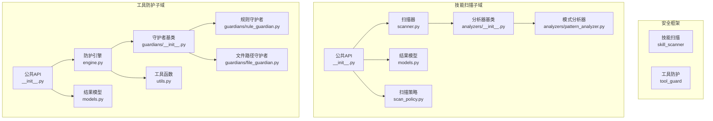
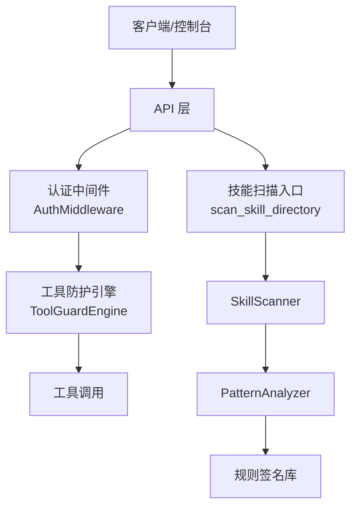
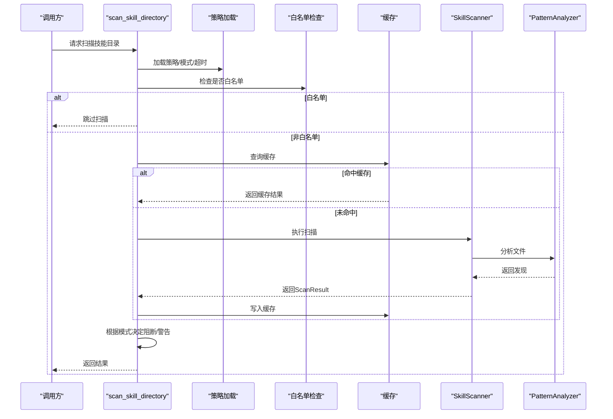
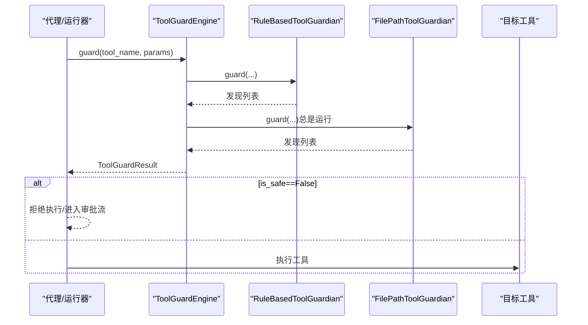
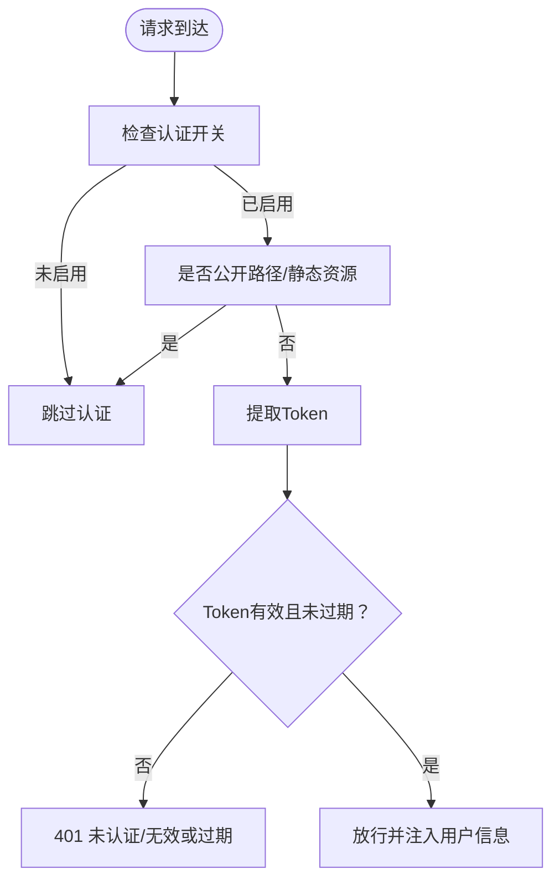
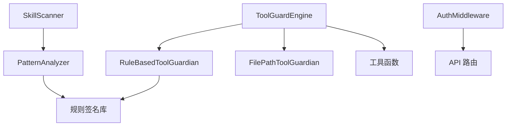

# 安全系统

<cite>
**本文引用的文件**
- [copaw/src/copaw/security/__init__.py](file://copaw/src/copaw/security/__init__.py)
- [copaw/src/copaw/security/skill_scanner/__init__.py](file://copaw/src/copaw/security/skill_scanner/__init__.py)
- [copaw/src/copaw/security/skill_scanner/models.py](file://copaw/src/copaw/security/skill_scanner/models.py)
- [copaw/src/copaw/security/skill_scanner/scan_policy.py](file://copaw/src/copaw/security/skill_scanner/scan_policy.py)
- [copaw/src/copaw/security/skill_scanner/scanner.py](file://copaw/src/copaw/security/skill_scanner/scanner.py)
- [copaw/src/copaw/security/skill_scanner/analyzers/__init__.py](file://copaw/src/copaw/security/skill_scanner/analyzers/__init__.py)
- [copaw/src/copaw/security/skill_scanner/analyzers/pattern_analyzer.py](file://copaw/src/copaw/security/skill_scanner/analyzers/pattern_analyzer.py)
- [copaw/src/copaw/security/tool_guard/__init__.py](file://copaw/src/copaw/security/tool_guard/__init__.py)
- [copaw/src/copaw/security/tool_guard/engine.py](file://copaw/src/copaw/security/tool_guard/engine.py)
- [copaw/src/copaw/security/tool_guard/models.py](file://copaw/src/copaw/security/tool_guard/models.py)
- [copaw/src/copaw/security/tool_guard/guardians/__init__.py](file://copaw/src/copaw/security/tool_guard/guardians/__init__.py)
- [copaw/src/copaw/security/tool_guard/guardians/rule_guardian.py](file://copaw/src/copaw/security/tool_guard/guardians/rule_guardian.py)
- [copaw/src/copaw/security/tool_guard/guardians/file_guardian.py](file://copaw/src/copaw/security/tool_guard/guardians/file_guardian.py)
- [copaw/src/copaw/security/tool_guard/utils.py](file://copaw/src/copaw/security/tool_guard/utils.py)
- [copaw/src/copaw/app/auth.py](file://copaw/src/copaw/app/auth.py)
- [copaw/src/copaw/config/config.py](file://copaw/src/copaw/config/config.py)
</cite>

## 目录
1. [简介](#简介)
2. [项目结构](#项目结构)
3. [核心组件](#核心组件)
4. [架构总览](#架构总览)
5. [详细组件分析](#详细组件分析)
6. [依赖分析](#依赖分析)
7. [性能考虑](#性能考虑)
8. [故障排查指南](#故障排查指南)
9. [结论](#结论)
10. [附录](#附录)

## 简介
本文件面向安全管理员与开发人员，系统化梳理 CoPaw 安全框架：技能扫描系统（威胁检测与策略配置）、工具防护系统（审批流程与危险命令检测）、认证与授权机制（实现细节与访问控制策略），并提供安全配置最佳实践、常见风险防范、安全审计与日志记录、异常检测实施方案，以及与核心功能的集成方式与性能影响评估。

## 项目结构
安全子系统位于 copaw/src/copaw/security，按职责划分为两大子域：
- 技能扫描（skill_scanner）：对技能包进行静态分析，识别潜在威胁（如硬编码密钥、命令注入、数据外泄等）
- 工具防护（tool_guard）：在工具调用前对参数进行规则匹配与敏感路径检查，阻断高危行为

图表来源
- [copaw/src/copaw/security/__init__.py:1-17](file://copaw/src/copaw/security/__init__.py#L1-L17)
- [copaw/src/copaw/security/skill_scanner/__init__.py:1-505](file://copaw/src/copaw/security/skill_scanner/__init__.py#L1-L505)
- [copaw/src/copaw/security/skill_scanner/scanner.py:1-319](file://copaw/src/copaw/security/skill_scanner/scanner.py#L1-L319)
- [copaw/src/copaw/security/skill_scanner/analyzers/pattern_analyzer.py:1-393](file://copaw/src/copaw/security/skill_scanner/analyzers/pattern_analyzer.py#L1-L393)
- [copaw/src/copaw/security/tool_guard/__init__.py:1-59](file://copaw/src/copaw/security/tool_guard/__init__.py#L1-L59)
- [copaw/src/copaw/security/tool_guard/engine.py:1-238](file://copaw/src/copaw/security/tool_guard/engine.py#L1-L238)
- [copaw/src/copaw/security/tool_guard/guardians/rule_guardian.py:1-383](file://copaw/src/copaw/security/tool_guard/guardians/rule_guardian.py#L1-L383)
- [copaw/src/copaw/security/tool_guard/guardians/file_guardian.py:1-342](file://copaw/src/copaw/security/tool_guard/guardians/file_guardian.py#L1-L342)

章节来源
- [copaw/src/copaw/security/__init__.py:1-17](file://copaw/src/copaw/security/__init__.py#L1-L17)
- [copaw/src/copaw/security/skill_scanner/__init__.py:1-505](file://copaw/src/copaw/security/skill_scanner/__init__.py#L1-L505)
- [copaw/src/copaw/security/tool_guard/__init__.py:1-59](file://copaw/src/copaw/security/tool_guard/__init__.py#L1-L59)

## 核心组件
- 技能扫描系统
  - 扫描器：遍历技能目录，发现文件，调用注册的分析器，聚合结果
  - 分析器：默认使用模式分析器（基于 YAML 规则的正则签名），可扩展
  - 策略：组织级策略（ScanPolicy），支持规则禁用、严重性覆盖、文档路径跳过、文件分类等
  - 公共 API：提供扫描入口、白名单、历史记录、缓存与超时控制
- 工具防护系统
  - 引擎：统一编排多个守护者，按配置决定是否拦截、拒绝或仅记录
  - 守护者：规则守护者（基于 YAML 规则的正则匹配）、文件路径守护者（敏感路径阻断）
  - 工具函数：解析受保护/拒绝工具集合、结构化日志输出
- 认证与授权
  - 基于环境变量开关的单用户注册与登录；密码哈希存储于 SECRET_DIR；JWT 签名验证；FastAPI 中间件统一鉴权

章节来源
- [copaw/src/copaw/security/skill_scanner/scanner.py:76-319](file://copaw/src/copaw/security/skill_scanner/scanner.py#L76-L319)
- [copaw/src/copaw/security/skill_scanner/analyzers/pattern_analyzer.py:236-393](file://copaw/src/copaw/security/skill_scanner/analyzers/pattern_analyzer.py#L236-L393)
- [copaw/src/copaw/security/skill_scanner/scan_policy.py:156-476](file://copaw/src/copaw/security/skill_scanner/scan_policy.py#L156-L476)
- [copaw/src/copaw/security/skill_scanner/__init__.py:415-505](file://copaw/src/copaw/security/skill_scanner/__init__.py#L415-L505)
- [copaw/src/copaw/security/tool_guard/engine.py:53-238](file://copaw/src/copaw/security/tool_guard/engine.py#L53-L238)
- [copaw/src/copaw/security/tool_guard/guardians/rule_guardian.py:280-383](file://copaw/src/copaw/security/tool_guard/guardians/rule_guardian.py#L280-L383)
- [copaw/src/copaw/security/tool_guard/guardians/file_guardian.py:161-342](file://copaw/src/copaw/security/tool_guard/guardians/file_guardian.py#L161-L342)
- [copaw/src/copaw/app/auth.py:1-410](file://copaw/src/copaw/app/auth.py#L1-L410)

## 架构总览
下图展示安全系统与应用核心的交互：技能扫描在安装/激活前执行；工具防护在每次工具调用前执行；认证中间件保护 API 路由。

图表来源
- [copaw/src/copaw/app/auth.py:340-410](file://copaw/src/copaw/app/auth.py#L340-L410)
- [copaw/src/copaw/security/tool_guard/engine.py:169-226](file://copaw/src/copaw/security/tool_guard/engine.py#L169-L226)
- [copaw/src/copaw/security/skill_scanner/__init__.py:415-505](file://copaw/src/copaw/security/skill_scanner/__init__.py#L415-L505)
- [copaw/src/copaw/security/skill_scanner/scanner.py:148-242](file://copaw/src/copaw/security/skill_scanner/scanner.py#L148-L242)
- [copaw/src/copaw/security/skill_scanner/analyzers/pattern_analyzer.py:265-347](file://copaw/src/copaw/security/skill_scanner/analyzers/pattern_analyzer.py#L265-L347)

## 详细组件分析

### 技能扫描系统
- 设计要点
  - 可插拔分析器：通过 BaseAnalyzer 接口扩展新引擎（如 LLM 判决）
  - 策略驱动：ScanPolicy 支持规则禁用、严重性覆盖、文档路径跳过、文件类型分类、阈值控制
  - 缓存与超时：基于目录 mtime 的轻量缓存，避免重复扫描；支持超时返回
  - 白名单与历史：支持按技能名与内容哈希的白名单；记录被阻断/警告的历史
- 关键流程（扫描技能目录）

图表来源
- [copaw/src/copaw/security/skill_scanner/__init__.py:415-505](file://copaw/src/copaw/security/skill_scanner/__init__.py#L415-L505)
- [copaw/src/copaw/security/skill_scanner/scanner.py:148-242](file://copaw/src/copaw/security/skill_scanner/scanner.py#L148-L242)
- [copaw/src/copaw/security/skill_scanner/analyzers/pattern_analyzer.py:265-347](file://copaw/src/copaw/security/skill_scanner/analyzers/pattern_analyzer.py#L265-L347)

- 数据模型与严重性
  - Finding/ScanResult：封装发现、严重性、文件位置、规则来源、时间戳等
  - Severity：CRITICAL/HIGH/MEDIUM/LOW/INFO/SAFE
  - ThreatCategory：涵盖提示词注入、命令注入、数据外泄、未授权工具使用、硬编码密钥、供应链攻击等

- 策略配置（ScanPolicy）
  - 隐藏文件处理、规则作用域（仅脚本/仅代码/文档跳过）、凭证抑制、文件分类（惰性/结构化/归档/代码）、文件数量/大小限制、最小置信度与最大规则长度
  - 支持从 YAML 合并默认策略，便于组织定制

- 白名单与历史
  - is_skill_whitelisted：支持按技能名与内容哈希双重匹配
  - 阻断历史持久化：记录技能名、时间、最高严重性、发现列表、内容哈希、动作（阻断/警告）

章节来源
- [copaw/src/copaw/security/skill_scanner/models.py:19-235](file://copaw/src/copaw/security/skill_scanner/models.py#L19-L235)
- [copaw/src/copaw/security/skill_scanner/scan_policy.py:156-476](file://copaw/src/copaw/security/skill_scanner/scan_policy.py#L156-L476)
- [copaw/src/copaw/security/skill_scanner/__init__.py:141-302](file://copaw/src/copaw/security/skill_scanner/__init__.py#L141-L302)

### 工具防护系统
- 设计要点
  - 受保护工具集与拒绝工具集：支持环境变量、配置文件与默认集合
  - 多守护者协同：规则守护者（正则签名）、文件路径守护者（敏感路径阻断）
  - 结构化日志：对高危发现输出结构化日志，便于审计与告警
- 关键流程（工具调用前防护）

图表来源
- [copaw/src/copaw/security/tool_guard/engine.py:169-226](file://copaw/src/copaw/security/tool_guard/engine.py#L169-L226)
- [copaw/src/copaw/security/tool_guard/guardians/rule_guardian.py:329-382](file://copaw/src/copaw/security/tool_guard/guardians/rule_guardian.py#L329-L382)
- [copaw/src/copaw/security/tool_guard/guardians/file_guardian.py:290-341](file://copaw/src/copaw/security/tool_guard/guardians/file_guardian.py#L290-L341)

- 规则守护者
  - 从 YAML 文件加载规则，支持工具/参数选择、正则模式与排除模式、描述与修复建议
  - 对 shell 命令参数提取路径并进行敏感路径检查
- 文件路径守护者
  - 将相对路径解析到工作区根，阻断对敏感目录/文件的访问
  - 对 shell 命令中的重定向操作进行提取与校验
- 审批与拒绝
  - 受保护工具集与拒绝工具集可通过环境变量或配置动态调整
  - 高危发现触发拒绝标记，便于上层模块清理与提示

章节来源
- [copaw/src/copaw/security/tool_guard/models.py:25-185](file://copaw/src/copaw/security/tool_guard/models.py#L25-L185)
- [copaw/src/copaw/security/tool_guard/utils.py:63-126](file://copaw/src/copaw/security/tool_guard/utils.py#L63-L126)
- [copaw/src/copaw/security/tool_guard/guardians/rule_guardian.py:153-382](file://copaw/src/copaw/security/tool_guard/guardians/rule_guardian.py#L153-L382)
- [copaw/src/copaw/security/tool_guard/guardians/file_guardian.py:161-342](file://copaw/src/copaw/security/tool_guard/guardians/file_guardian.py#L161-L342)

### 认证与授权机制
- 登录与注册
  - 通过环境变量 COPAW_AUTH_ENABLED 控制是否启用认证
  - 单用户注册：首次启动时通过 Web 注册流程创建账户；也可通过 COPAW_AUTH_USERNAME/COPAW_AUTH_PASSWORD 自动注册
  - 密码采用盐值 SHA-256 哈希，存储于 SECRET_DIR 下的 auth.json，并设置严格权限
- 令牌与中间件
  - 使用 HMAC-SHA256 签名的 JWT，包含 sub、iat、exp；过期时间 7 天
  - FastAPI 中间件 AuthMiddleware 统一校验 Bearer Token，跳过公开路径与本地回环请求
- 访问控制策略
  - 公开路径集合（无需认证）
  - 仅保护 /api/ 路由；非 API 路由默认放行
  - 本地主机（127.0.0.1/::1）请求免认证，便于 CLI 本地调试

图表来源
- [copaw/src/copaw/app/auth.py:340-410](file://copaw/src/copaw/app/auth.py#L340-L410)

章节来源
- [copaw/src/copaw/app/auth.py:1-410](file://copaw/src/copaw/app/auth.py#L1-L410)

## 依赖分析
- 组件内聚与耦合
  - 技能扫描与工具防护各自独立，通过各自的公共 API 与模型解耦
  - 分析器与守护者均通过抽象基类实现插件化，降低耦合
- 外部依赖与集成点
  - YAML 规则文件用于签名与规则加载
  - 配置系统（config.py）提供策略与受保护工具集的集中式配置
  - 日志系统用于结构化输出与审计

图表来源
- [copaw/src/copaw/security/skill_scanner/scanner.py:148-242](file://copaw/src/copaw/security/skill_scanner/scanner.py#L148-L242)
- [copaw/src/copaw/security/skill_scanner/analyzers/pattern_analyzer.py:265-347](file://copaw/src/copaw/security/skill_scanner/analyzers/pattern_analyzer.py#L265-L347)
- [copaw/src/copaw/security/tool_guard/engine.py:169-226](file://copaw/src/copaw/security/tool_guard/engine.py#L169-L226)
- [copaw/src/copaw/security/tool_guard/guardians/rule_guardian.py:329-382](file://copaw/src/copaw/security/tool_guard/guardians/rule_guardian.py#L329-L382)
- [copaw/src/copaw/security/tool_guard/guardians/file_guardian.py:290-341](file://copaw/src/copaw/security/tool_guard/guardians/file_guardian.py#L290-L341)
- [copaw/src/copaw/app/auth.py:340-410](file://copaw/src/copaw/app/auth.py#L340-L410)

## 性能考虑
- 技能扫描
  - 缓存：以目录与文件 mtime 为键，LRU 限制最多 64 条，显著减少重复扫描成本
  - 限流：文件数量与大小上限、规则最大长度限制、文档路径跳过，降低误报与性能损耗
  - 并发：扫描在单线程池中串行执行，避免竞争与资源争用
- 工具防护
  - 规则守护者：正则匹配按需加载与编译，支持排除模式减少误报
  - 文件路径守护者：路径提取与规范化在必要时进行，避免对非路径字符串的过度处理
- 认证中间件
  - 仅对受保护路由生效，本地回环请求免认证，减少不必要的 Token 校验

[本节为通用性能讨论，不直接分析具体文件]

## 故障排查指南
- 技能扫描
  - 超时：若扫描超时，返回 None；检查目录规模、文件大小与规则复杂度
  - 缓存问题：删除缓存条目或重启服务以刷新缓存
  - 白名单误判：核对技能名与内容哈希，确保白名单条目正确
  - 历史记录：查看阻断历史文件，定位被阻断原因与修复建议
- 工具防护
  - 规则未生效：确认受保护工具集、规则文件加载与禁用规则列表
  - 结构化日志：关注高危严重性的日志摘要，定位具体规则与匹配值
  - 敏感路径：检查敏感文件配置与工作区根解析逻辑
- 认证与授权
  - 401/无效 Token：检查 Token 是否过期、签名是否正确、请求头格式
  - 公开路径：确认路径是否在公开集合内，或是否为本地回环请求

章节来源
- [copaw/src/copaw/security/skill_scanner/__init__.py:471-486](file://copaw/src/copaw/security/skill_scanner/__init__.py#L471-L486)
- [copaw/src/copaw/security/tool_guard/utils.py:128-162](file://copaw/src/copaw/security/tool_guard/utils.py#L128-L162)
- [copaw/src/copaw/app/auth.py:340-410](file://copaw/src/copaw/app/auth.py#L340-L410)

## 结论
该安全系统通过“静态扫描+动态防护+认证授权”的组合，形成从技能入库到工具执行的全链路安全控制。策略化配置与插件化设计使得组织能够灵活适配自身安全基线；严格的日志与历史记录为审计与应急响应提供支撑。建议在生产环境中启用认证、最小化受保护工具集、定期更新规则与策略，并建立告警与应急处置流程。

[本节为总结性内容，不直接分析具体文件]

## 附录

### 安全配置最佳实践
- 技能扫描
  - 使用 ScanPolicy 合并默认策略，仅覆盖差异项
  - 为文档路径与示例文件配置跳过规则，减少误报
  - 设置合理的文件数量/大小阈值，避免大目录导致扫描耗时
  - 对硬编码密钥等高危规则启用严重性覆盖
- 工具防护
  - 明确受保护工具集，优先阻断高危工具（如 shell 执行）
  - 配置敏感文件集合，结合工作区根解析确保路径一致性
  - 定期审查规则文件，关闭不再需要的规则，新增针对性规则
- 认证与授权
  - 启用认证并设置强口令；定期轮换 JWT 秘钥
  - 限制公开路径范围，仅暴露必要接口
  - 在 CI/CD 中通过环境变量自动注册管理员账号，避免明文密码

[本节为通用指导，不直接分析具体文件]