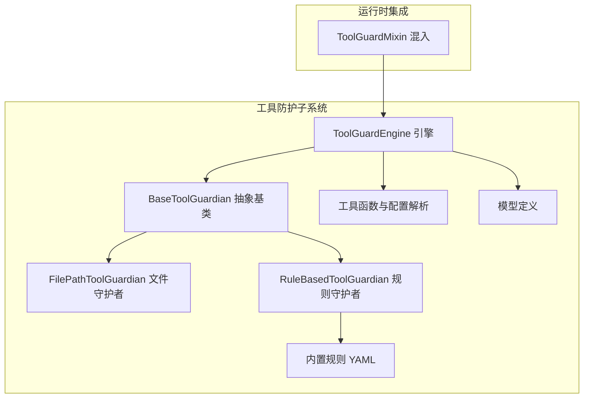
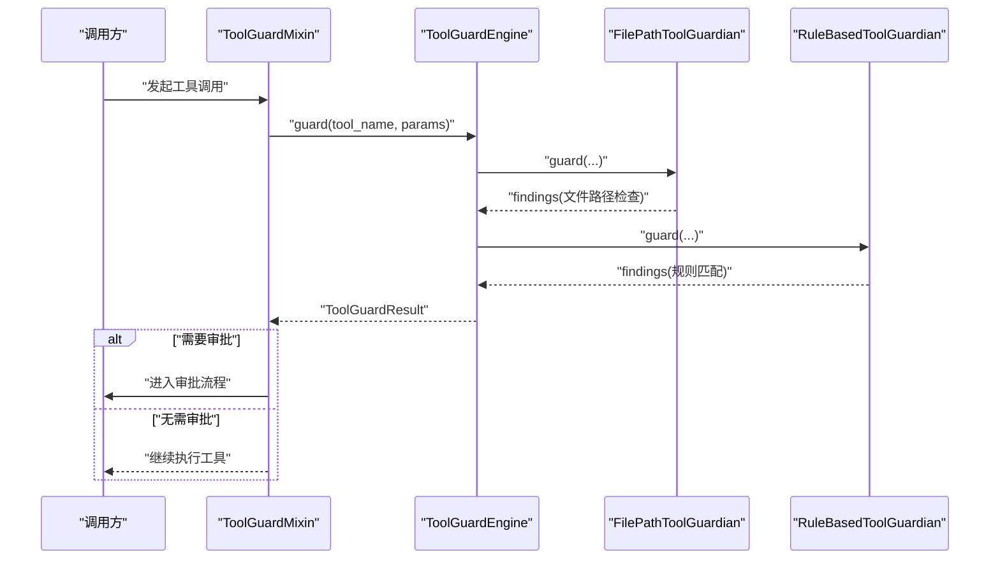
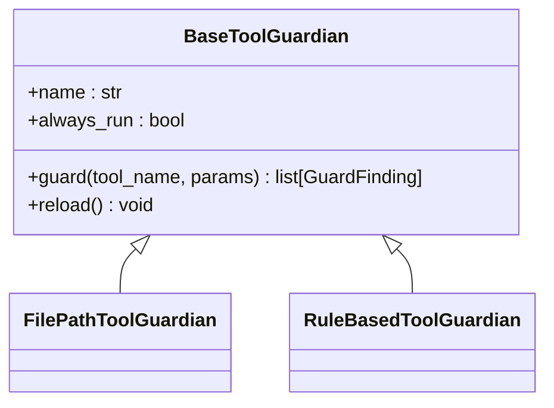
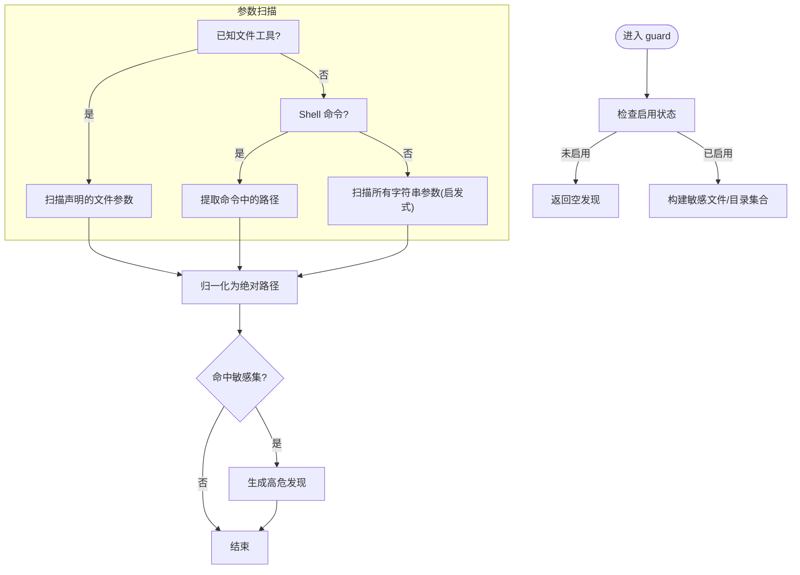
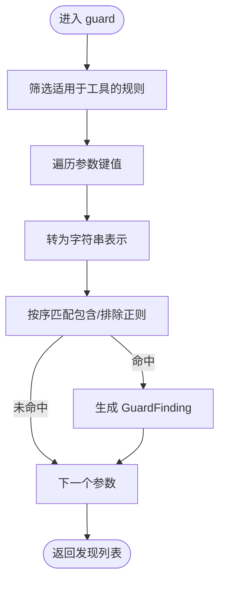
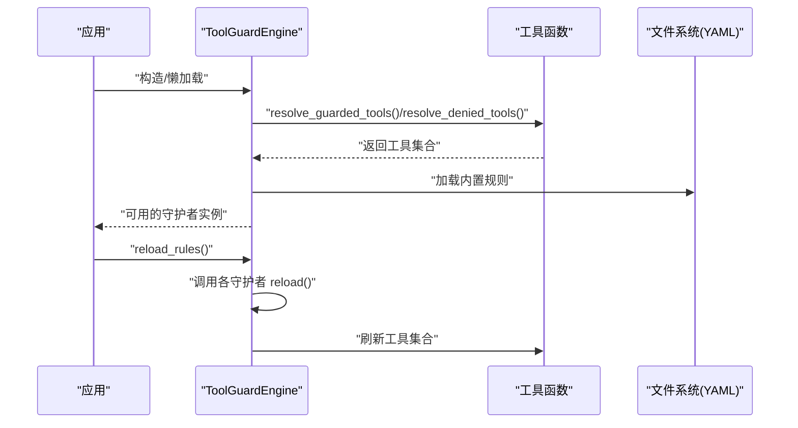
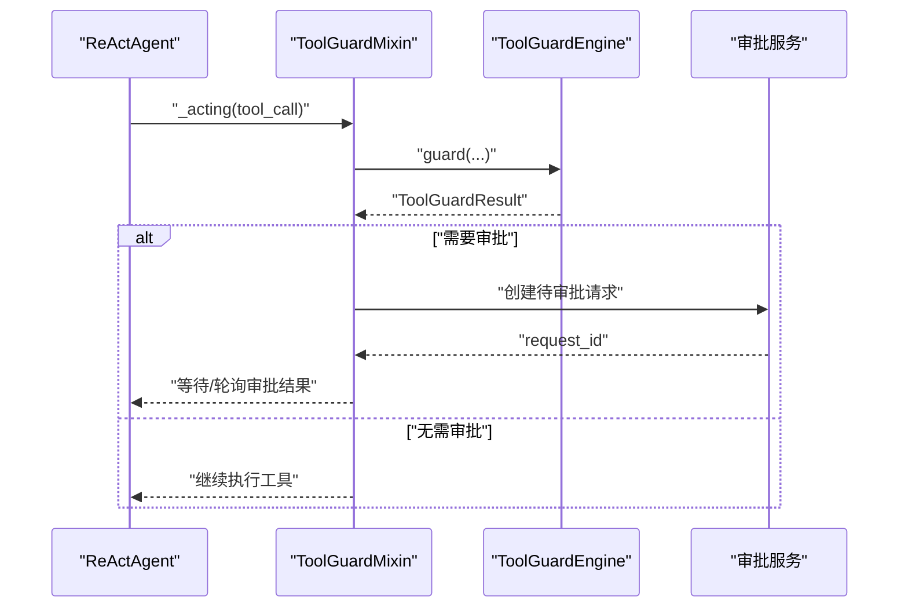
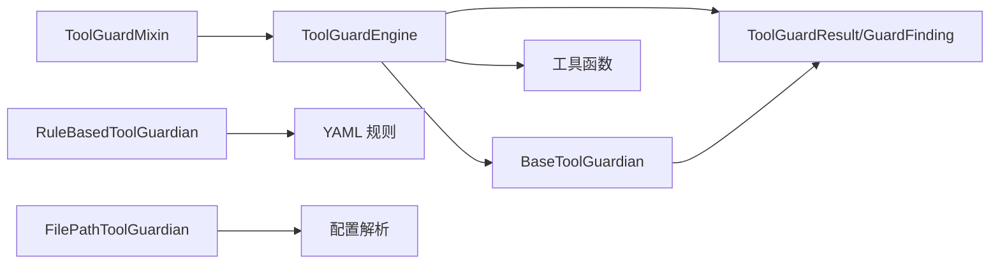

# 守护者组件

<cite>
**本文引用的文件**
- [engine.py](file://copaw/src/copaw/security/tool_guard/engine.py)
- [file_guardian.py](file://copaw/src/copaw/security/tool_guard/guardians/file_guardian.py)
- [rule_guardian.py](file://copaw/src/copaw/security/tool_guard/guardians/rule_guardian.py)
- [__init__.py（守护者抽象基类）](file://copaw/src/copaw/security/tool_guard/guardians/__init__.py)
- [models.py](file://copaw/src/copaw/security/tool_guard/models.py)
- [utils.py](file://copaw/src/copaw/security/tool_guard/utils.py)
- [dangerous_shell_commands.yaml](file://copaw/src/copaw/security/tool_guard/rules/dangerous_shell_commands.yaml)
- [tool_guard_mixin.py](file://copaw/src/copaw/agents/tool_guard_mixin.py)
- [__init__.py（工具防护导出）](file://copaw/src/copaw/security/tool_guard/__init__.py)
- [useToolGuard.ts](file://copaw/console/src/pages/Settings/Security/useToolGuard.ts)
- [index.tsx（前端设置页）](file://copaw/console/src/pages/Settings/Security/index.tsx)
</cite>

## 目录
1. [简介](#简介)
2. [项目结构](#项目结构)
3. [核心组件](#核心组件)
4. [架构总览](#架构总览)
5. [详细组件分析](#详细组件分析)
6. [依赖关系分析](#依赖关系分析)
7. [性能考量](#性能考量)
8. [故障排查指南](#故障排查指南)
9. [结论](#结论)
10. [附录](#附录)

## 简介
本文件面向“工具防护守护者”组件，系统化阐述其设计理念、接口规范与实现细节，覆盖以下主题：
- BaseToolGuardian 基类的设计原则与最小接口契约
- 文件守护者 FilePathToolGuardian 的路径验证与访问控制策略
- 规则守护者 RuleBasedToolGuardian 的规则引擎与威胁检测算法
- 守护者的注册、生命周期与动态加载机制
- 配置方法、自定义规则编写与扩展开发指南
- 性能评估、错误处理与调试技巧

## 项目结构
守护者子系统位于 copaw/src/copaw/security/tool_guard 下，采用“抽象基类 + 多个具体守护者 + 引擎编排 + 工具函数”的分层设计。前端控制台提供可视化配置入口。

**图表来源**
- [engine.py:53-238](file://copaw/src/copaw/security/tool_guard/engine.py#L53-L238)
- [file_guardian.py:161-342](file://copaw/src/copaw/security/tool_guard/guardians/file_guardian.py#L161-L342)
- [rule_guardian.py:280-383](file://copaw/src/copaw/security/tool_guard/guardians/rule_guardian.py#L280-L383)
- [__init__.py（守护者抽象基类）:17-62](file://copaw/src/copaw/security/tool_guard/guardians/__init__.py#L17-L62)
- [models.py:1-185](file://copaw/src/copaw/security/tool_guard/models.py#L1-L185)
- [utils.py:1-163](file://copaw/src/copaw/security/tool_guard/utils.py#L1-L163)
- [dangerous_shell_commands.yaml:1-183](file://copaw/src/copaw/security/tool_guard/rules/dangerous_shell_commands.yaml#L1-L183)
- [tool_guard_mixin.py:45-200](file://copaw/src/copaw/agents/tool_guard_mixin.py#L45-L200)

**章节来源**
- [__init__.py（工具防护导出）:1-59](file://copaw/src/copaw/security/tool_guard/__init__.py#L1-L59)

## 核心组件
- 抽象基类 BaseToolGuardian：定义守护者统一接口，强调可插拔性与最小契约，便于扩展新的检测引擎（如 LLM 判决、语义分析等）。
- 文件守护者 FilePathToolGuardian：基于敏感文件/目录白名单与路径归一化策略，对文件路径进行严格校验；支持从配置动态加载敏感路径集。
- 规则守护者 RuleBasedToolGuardian：基于 YAML 规则的正则签名匹配，扫描工具参数字符串表示，快速识别命令注入、权限提升、系统破坏等高危模式。
- 引擎 ToolGuardEngine：负责守护者注册、动态启用/禁用、工具范围解析、结果聚合与异常隔离，提供懒加载单例。
- 工具函数与模型：提供工具集解析、日志输出、结果模型与严重级别排序等支撑能力。
- 运行时混入 ToolGuardMixin：在 ReActAgent 中拦截工具调用，执行预检、审批流与回放队列管理。

**章节来源**
- [__init__.py（守护者抽象基类）:17-62](file://copaw/src/copaw/security/tool_guard/guardians/__init__.py#L17-L62)
- [file_guardian.py:161-342](file://copaw/src/copaw/security/tool_guard/guardians/file_guardian.py#L161-L342)
- [rule_guardian.py:280-383](file://copaw/src/copaw/security/tool_guard/guardians/rule_guardian.py#L280-L383)
- [engine.py:53-238](file://copaw/src/copaw/security/tool_guard/engine.py#L53-L238)
- [models.py:1-185](file://copaw/src/copaw/security/tool_guard/models.py#L1-L185)
- [utils.py:1-163](file://copaw/src/copaw/security/tool_guard/utils.py#L1-L163)
- [tool_guard_mixin.py:45-200](file://copaw/src/copaw/agents/tool_guard_mixin.py#L45-L200)

## 架构总览
守护者体系遵循“引擎编排 + 多守护者并行扫描 + 审批流”的整体架构。引擎负责：
- 解析启用状态与工具范围
- 注册/注销守护者
- 调用各守护者执行扫描
- 聚合结果并记录耗时
- 提供重载规则与工具集的能力

**图表来源**
- [engine.py:169-227](file://copaw/src/copaw/security/tool_guard/engine.py#L169-L227)
- [file_guardian.py:290-342](file://copaw/src/copaw/security/tool_guard/guardians/file_guardian.py#L290-L342)
- [rule_guardian.py:329-383](file://copaw/src/copaw/security/tool_guard/guardians/rule_guardian.py#L329-L383)
- [tool_guard_mixin.py:260-365](file://copaw/src/copaw/agents/tool_guard_mixin.py#L260-L365)

## 详细组件分析

### BaseToolGuardian 抽象基类
- 设计理念
  - 最小接口：仅要求实现 guard 方法，返回 GuardFinding 列表
  - 可插拔：允许新增不同检测范式的守护者（正则、LLM、语义）
  - 明确职责：每个守护者专注特定维度的安全检查
- 关键属性
  - name：守护者名称，用于结果溯源
  - always_run：是否在非受保护工具上也执行（如文件路径检查）
- 接口规范
  - guard(tool_name, params) -> list[GuardFinding]
  - 可选实现 reload() 以支持动态重载

**图表来源**
- [__init__.py（守护者抽象基类）:17-62](file://copaw/src/copaw/security/tool_guard/guardians/__init__.py#L17-L62)
- [file_guardian.py:161-170](file://copaw/src/copaw/security/tool_guard/guardians/file_guardian.py#L161-L170)
- [rule_guardian.py:280-298](file://copaw/src/copaw/security/tool_guard/guardians/rule_guardian.py#L280-L298)

**章节来源**
- [__init__.py（守护者抽象基类）:17-62](file://copaw/src/copaw/security/tool_guard/guardians/__init__.py#L17-L62)

### 文件守护者 FilePathToolGuardian
- 路径验证机制
  - 归一化：相对路径基于当前工作区根目录解析为绝对路径，避免路径逃逸
  - 敏感集：支持文件与目录两类敏感项；目录以斜杠结尾或目录对象均视为目录约束
  - 命中判定：若目标路径属于敏感文件或位于任一敏感目录内，则触发高危发现
- 访问控制策略
  - 启用开关：由配置项决定是否启用
  - 配置来源：支持从配置文件加载敏感路径列表，默认保护密钥目录
  - 动态更新：支持运行时重载敏感路径集
- 参数扫描策略
  - 已知文件工具：仅扫描声明的文件路径参数
  - Shell 命令：使用安全分词提取命令中的候选路径，处理重定向与分离/附加操作符
  - 其他工具：对所有字符串参数进行启发式路径识别
- 发现生成
  - 使用统一 GuardFinding 模型，标注高危严重级别与修复建议

**图表来源**
- [file_guardian.py:290-342](file://copaw/src/copaw/security/tool_guard/guardians/file_guardian.py#L290-L342)
- [file_guardian.py:161-225](file://copaw/src/copaw/security/tool_guard/guardians/file_guardian.py#L161-L225)

**章节来源**
- [file_guardian.py:161-342](file://copaw/src/copaw/security/tool_guard/guardians/file_guardian.py#L161-L342)
- [utils.py:63-126](file://copaw/src/copaw/security/tool_guard/utils.py#L63-L126)

### 规则守护者 RuleBasedToolGuardian
- 规则引擎实现
  - 规则来源：内置 YAML 文件与配置注入的自定义规则；支持禁用规则 ID
  - 规则加载：支持指定目录与文件列表，自动过滤无效条目
  - 规则对象：GuardRule 封装工具/参数适用范围、严重级别、类别、正则与排除正则，并预编译正则表达式
- 威胁检测算法
  - 适用性判断：先筛选适用于当前工具的规则
  - 参数扫描：将参数值转为字符串后逐条匹配
  - 匹配逻辑：先检查排除正则，再按顺序匹配包含正则；命中后截取上下文片段作为摘要
  - 发现生成：填充统一模型字段，包含规则 ID、类别、严重级别、修复建议等
- 动态重载
  - reload() 重新合并内置/自定义/额外规则并剔除禁用项

**图表来源**
- [rule_guardian.py:329-383](file://copaw/src/copaw/security/tool_guard/guardians/rule_guardian.py#L329-L383)
- [rule_guardian.py:153-231](file://copaw/src/copaw/security/tool_guard/guardians/rule_guardian.py#L153-L231)
- [dangerous_shell_commands.yaml:1-183](file://copaw/src/copaw/security/tool_guard/rules/dangerous_shell_commands.yaml#L1-L183)

**章节来源**
- [rule_guardian.py:280-383](file://copaw/src/copaw/security/tool_guard/guardians/rule_guardian.py#L280-L383)
- [dangerous_shell_commands.yaml:1-183](file://copaw/src/copaw/security/tool_guard/rules/dangerous_shell_commands.yaml#L1-L183)

### 引擎与生命周期管理
- 启用与禁用
  - 优先级：环境变量 > 配置文件 > 默认开启
- 工具范围解析
  - 受保护工具集：支持通配、空/关闭、逗号分隔等格式解析
  - 直接拒绝工具集：不受审批流程影响，直接阻断
- 注册与注销
  - register_guardian/unregister_guardian 支持运行时增删守护者
- 结果聚合
  - ToolGuardResult 聚合发现、耗时、失败守护者列表
- 动态重载
  - reload_rules() 调用各守护者 reload 并刷新工具集

**图表来源**
- [engine.py:65-154](file://copaw/src/copaw/security/tool_guard/engine.py#L65-L154)
- [utils.py:63-126](file://copaw/src/copaw/security/tool_guard/utils.py#L63-L126)
- [rule_guardian.py:311-314](file://copaw/src/copaw/security/tool_guard/guardians/rule_guardian.py#L311-L314)

**章节来源**
- [engine.py:53-238](file://copaw/src/copaw/security/tool_guard/engine.py#L53-L238)
- [utils.py:18-126](file://copaw/src/copaw/security/tool_guard/utils.py#L18-L126)

### 运行时拦截与审批流程
- 拦截点
  - 在 ReActAgent 的 _acting/_reasoning 中插入 ToolGuardMixin，拦截工具调用
- 决策流程
  - 若工具在拒绝列表，直接生成阻断结果
  - 若工具在受保护范围且存在一次性预审批，直接放行
  - 否则调用引擎 guard，按 always_run 策略选择守护者
  - 存在发现且有会话 ID 时，进入审批流程
- 并发与回放
  - 决策阶段加锁保证状态一致性，实际执行在锁外并行
  - 支持强制工具调用注入、兄弟工具调用提取与剩余队列回放

**图表来源**
- [tool_guard_mixin.py:260-365](file://copaw/src/copaw/agents/tool_guard_mixin.py#L260-L365)
- [engine.py:169-227](file://copaw/src/copaw/security/tool_guard/engine.py#L169-L227)

**章节来源**
- [tool_guard_mixin.py:45-200](file://copaw/src/copaw/agents/tool_guard_mixin.py#L45-L200)
- [tool_guard_mixin.py:260-587](file://copaw/src/copaw/agents/tool_guard_mixin.py#L260-L587)

## 依赖关系分析
- 组件耦合
  - 引擎对守护者采用组合与多态，耦合度低，便于扩展
  - 守护者之间无直接依赖，各自独立扫描
- 外部依赖
  - 规则守护者依赖 YAML 解析与正则编译
  - 文件守护者依赖配置解析与路径归一化
  - 引擎依赖配置解析与工具函数
- 循环依赖
  - 未见循环导入；工具函数被引擎与守护者共同使用

**图表来源**
- [engine.py:25-28](file://copaw/src/copaw/security/tool_guard/engine.py#L25-L28)
- [rule_guardian.py:38-44](file://copaw/src/copaw/security/tool_guard/guardians/rule_guardian.py#L38-L44)
- [file_guardian.py:13-16](file://copaw/src/copaw/security/tool_guard/guardians/file_guardian.py#L13-L16)
- [models.py:103-185](file://copaw/src/copaw/security/tool_guard/models.py#L103-L185)
- [tool_guard_mixin.py:57-70](file://copaw/src/copaw/agents/tool_guard_mixin.py#L57-L70)

**章节来源**
- [engine.py:25-28](file://copaw/src/copaw/security/tool_guard/engine.py#L25-L28)
- [rule_guardian.py:38-44](file://copaw/src/copaw/security/tool_guard/guardians/rule_guardian.py#L38-L44)
- [file_guardian.py:13-16](file://copaw/src/copaw/security/tool_guard/guardians/file_guardian.py#L13-L16)
- [models.py:103-185](file://copaw/src/copaw/security/tool_guard/models.py#L103-L185)
- [tool_guard_mixin.py:57-70](file://copaw/src/copaw/agents/tool_guard_mixin.py#L57-L70)

## 性能考量
- 扫描复杂度
  - 文件守护者：路径归一化 O(n)，目录包含判断按敏感目录数量线性扫描
  - 规则守护者：对每个适用规则与参数执行正则匹配，复杂度取决于规则数量与参数大小
- 优化建议
  - 预编译正则表达式，减少重复开销
  - 对大参数采用分段扫描或阈值短路
  - 控制规则数量与正则复杂度，避免过度匹配
  - 并行执行 always_run 的轻量守护者，非受保护工具仅运行必要检查
- 资源与并发
  - 决策阶段加锁，执行阶段释放锁，确保状态一致与高吞吐

[本节为通用指导，不直接分析具体文件]

## 故障排查指南
- 常见问题
  - 守护者未生效：检查 COPAW_TOOL_GUARD_ENABLED 与配置文件中的 enabled 字段
  - 工具未受保护：确认 COPAW_TOOL_GUARD_TOOLS 或 guarded_tools 设置
  - 规则未加载：检查 rules 目录与文件名，确认自定义规则格式正确
  - 路径误判：核对敏感文件列表与工作区根目录解析
- 日志与诊断
  - 使用 log_findings 输出结构化日志，按严重级别区分
  - 查看 ToolGuardResult 的守护者失败列表定位异常守护者
- 调试技巧
  - 临时关闭非关键守护者以缩小问题范围
  - 逐步增加规则，观察性能与误报变化
  - 使用最小化参数复现问题，便于定位规则或路径问题

**章节来源**
- [utils.py:128-163](file://copaw/src/copaw/security/tool_guard/utils.py#L128-L163)
- [engine.py:214-226](file://copaw/src/copaw/security/tool_guard/engine.py#L214-L226)

## 结论
该守护者组件通过“引擎编排 + 多守护者扫描 + 审批流”的架构，实现了对工具调用前的安全拦截。BaseToolGuardian 的最小接口设计保证了高度可扩展性；FilePathToolGuardian 提供稳健的路径校验；RuleBasedToolGuardian 以 YAML 规则实现快速、可维护的威胁检测。配合运行时混入与动态重载，系统在安全性与灵活性之间取得良好平衡。

[本节为总结性内容，不直接分析具体文件]

## 附录

### 配置方法与最佳实践
- 启用/禁用
  - 环境变量：COPAW_TOOL_GUARD_ENABLED
  - 配置文件：security.tool_guard.enabled
- 工具范围
  - 受保护工具：COPAW_TOOL_GUARD_TOOLS 或 security.tool_guard.guarded_tools
  - 直接拒绝：COPAW_TOOL_GUARD_DENIED_TOOLS 或 security.tool_guard.denied_tools
- 文件守护
  - security.file_guard.enabled
  - security.file_guard.sensitive_files（默认保护密钥目录）

**章节来源**
- [engine.py:35-51](file://copaw/src/copaw/security/tool_guard/engine.py#L35-L51)
- [utils.py:63-126](file://copaw/src/copaw/security/tool_guard/utils.py#L63-L126)
- [file_guardian.py:54-80](file://copaw/src/copaw/security/tool_guard/guardians/file_guardian.py#L54-L80)

### 自定义规则编写指南
- 规则字段
  - id、tools/params、category、severity、patterns、exclude_patterns、description、remediation
- 编写步骤
  - 在 rules 目录下新增 YAML 文件，按内置规则格式编写
  - 通过 security.tool_guard.custom_rules 注入自定义规则
  - 使用 security.tool_guard.disabled_rules 禁用不需要的内置规则
- 前端配置
  - 控制台提供开关与编辑界面，支持增删改查与保存

**章节来源**
- [rule_guardian.py:69-116](file://copaw/src/copaw/security/tool_guard/guardians/rule_guardian.py#L69-L116)
- [dangerous_shell_commands.yaml:1-183](file://copaw/src/copaw/security/tool_guard/rules/dangerous_shell_commands.yaml#L1-L183)
- [useToolGuard.ts:1-124](file://copaw/console/src/pages/Settings/Security/useToolGuard.ts#L1-L124)
- [index.tsx（前端设置页）:258-287](file://copaw/console/src/pages/Settings/Security/index.tsx#L258-L287)

### 扩展开发指南
- 新增守护者
  - 继承 BaseToolGuardian，实现 guard 与可选 reload
  - 在构造时决定 name 与 always_run
  - 通过 ToolGuardEngine.register_guardian 注册
- 新增规则
  - 在 YAML 中定义规则，或通过配置注入
  - 使用 exclude_patterns 过滤误报
- 集成审批
  - ToolGuardMixin 已内置审批流程；确保会话 ID 可用以触发审批

**章节来源**
- [__init__.py（守护者抽象基类）:17-62](file://copaw/src/copaw/security/tool_guard/guardians/__init__.py#L17-L62)
- [engine.py:108-118](file://copaw/src/copaw/security/tool_guard/engine.py#L108-L118)
- [tool_guard_mixin.py:260-587](file://copaw/src/copaw/agents/tool_guard_mixin.py#L260-L587)