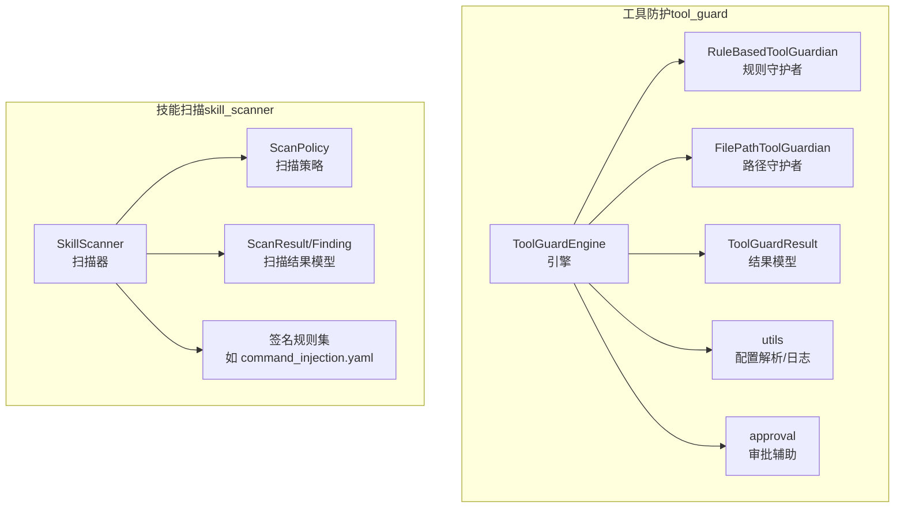
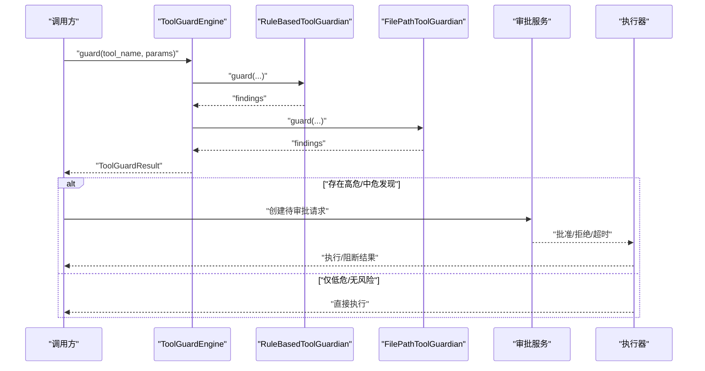
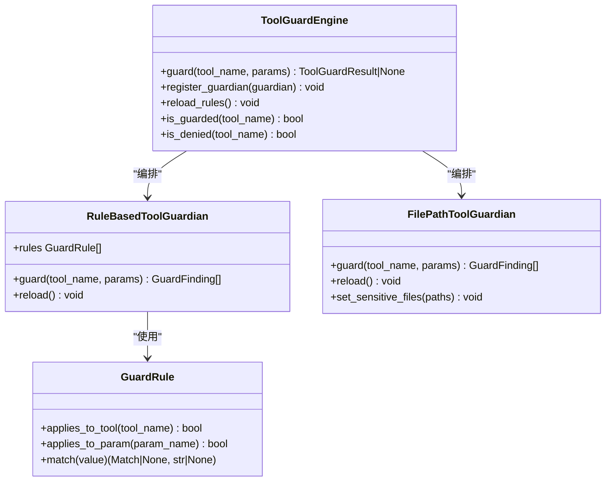
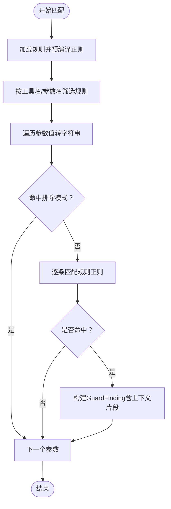
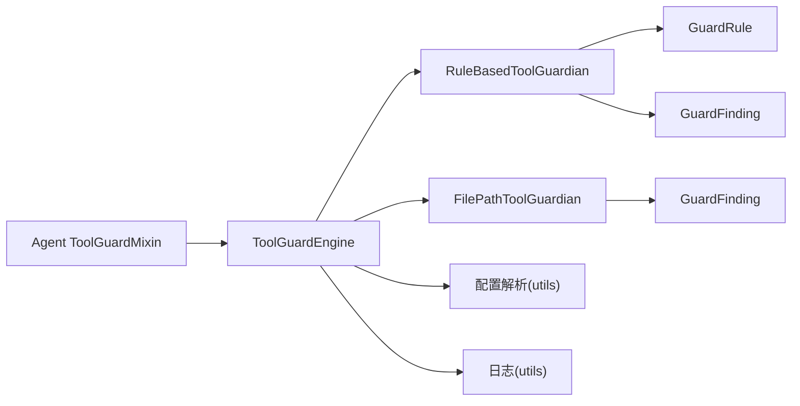

# 安全规则

<cite>
**本文引用的文件**
- [engine.py](file://copaw/src/copaw/security/tool_guard/engine.py)
- [models.py](file://copaw/src/copaw/security/tool_guard/models.py)
- [utils.py](file://copaw/src/copaw/security/tool_guard/utils.py)
- [approval.py](file://copaw/src/copaw/security/tool_guard/approval.py)
- [rule_guardian.py](file://copaw/src/copaw/security/tool_guard/guardians/rule_guardian.py)
- [file_guardian.py](file://copaw/src/copaw/security/tool_guard/guardians/file_guardian.py)
- [dangerous_shell_commands.yaml](file://copaw/src/copaw/security/tool_guard/rules/dangerous_shell_commands.yaml)
- [scanner.py](file://copaw/src/copaw/security/skill_scanner/scanner.py)
- [models.py](file://copaw/src/copaw/security/skill_scanner/models.py)
- [default_policy.yaml](file://copaw/src/copaw/security/skill_scanner/data/default_policy.yaml)
- [scan_policy.py](file://copaw/src/copaw/security/skill_scanner/scan_policy.py)
- [command_injection.yaml](file://copaw/src/copaw/security/skill_scanner/rules/signatures/command_injection.yaml)
- [data_exfiltration.yaml](file://copaw/src/copaw/security/skill_scanner/rules/signatures/data_exfiltration.yaml)
- [tool_guard_mixin.py](file://copaw/src/copaw/agents/tool_guard_mixin.py)
</cite>

## 目录
1. [简介](#简介)
2. [项目结构](#项目结构)
3. [核心组件](#核心组件)
4. [架构总览](#架构总览)
5. [详细组件分析](#详细组件分析)
6. [依赖分析](#依赖分析)
7. [性能考虑](#性能考虑)
8. [故障排查指南](#故障排查指南)
9. [结论](#结论)
10. [附录](#附录)

## 简介
本文件面向“工具防护安全规则”主题，系统化梳理规则引擎的架构设计、威胁检测算法、危险shell命令规则的定义与匹配机制、规则文件格式与配置选项、加载与动态更新流程，并提供自定义规则编写指南、测试方法与性能优化建议，以及规则维护最佳实践与版本管理策略。

## 项目结构
围绕“工具防护安全规则”，核心代码位于 copaw/src/copaw/security/tool_guard 与 copaw/src/copaw/security/skill_scanner 两大子系统：
- 工具防护（tool_guard）：负责对工具调用参数进行前置安全检查，支持规则驱动的正则匹配与敏感路径拦截，提供可插拔守护者扩展点。
- 技能扫描（skill_scanner）：负责对技能包进行静态安全扫描，基于签名规则与策略配置识别潜在威胁。

**图表来源**
- [engine.py:53-238](file://copaw/src/copaw/security/tool_guard/engine.py#L53-L238)
- [rule_guardian.py:280-383](file://copaw/src/copaw/security/tool_guard/guardians/rule_guardian.py#L280-L383)
- [file_guardian.py:161-342](file://copaw/src/copaw/security/tool_guard/guardians/file_guardian.py#L161-L342)
- [scanner.py:76-319](file://copaw/src/copaw/security/skill_scanner/scanner.py#L76-L319)
- [scan_policy.py:156-476](file://copaw/src/copaw/security/skill_scanner/scan_policy.py#L156-L476)

**章节来源**
- [engine.py:1-238](file://copaw/src/copaw/security/tool_guard/engine.py#L1-L238)
- [scanner.py:1-319](file://copaw/src/copaw/security/skill_scanner/scanner.py#L1-L319)

## 核心组件
- 规则引擎与守护者
  - ToolGuardEngine：统一编排守护者集合，聚合结果，支持动态启用/禁用、受保护工具集合与直接拒绝工具集合解析、规则热重载。
  - RuleBasedToolGuardian：从YAML加载规则，按工具名与参数名筛选后进行正则匹配，生成GuardFinding。
  - FilePathToolGuardian：基于配置的敏感文件/目录白名单，对路径进行规范化与归一化，支持从shell命令中提取候选路径。
- 数据模型
  - ToolGuardResult/GuardFinding：封装一次工具调用的检测结果、严重级别、威胁类别、修复建议等。
  - ScanResult/Finding：技能扫描结果模型，用于技能级威胁检测。
- 扫描策略与规则
  - ScanPolicy：组织化的扫描策略，支持隐藏文件、规则作用域、凭证占位符、文件分类、阈值与严重度覆盖等。
  - 签名规则：如 command_injection.yaml、data_exfiltration.yaml 等，提供针对不同威胁类型的正则签名。

**章节来源**
- [engine.py:53-238](file://copaw/src/copaw/security/tool_guard/engine.py#L53-L238)
- [rule_guardian.py:280-383](file://copaw/src/copaw/security/tool_guard/guardians/rule_guardian.py#L280-L383)
- [file_guardian.py:161-342](file://copaw/src/copaw/security/tool_guard/guardians/file_guardian.py#L161-L342)
- [models.py:103-185](file://copaw/src/copaw/security/tool_guard/models.py#L103-L185)
- [scanner.py:76-319](file://copaw/src/copaw/security/skill_scanner/scanner.py#L76-L319)
- [models.py:168-235](file://copaw/src/copaw/security/skill_scanner/models.py#L168-L235)
- [scan_policy.py:156-476](file://copaw/src/copaw/security/skill_scanner/scan_policy.py#L156-L476)

## 架构总览
工具防护与技能扫描分别承担“运行时工具调用防护”和“静态技能包安全扫描”的职责。两者共享相似的“规则-模型-策略”范式，但前者强调低延迟、可插拔守护者与审批集成，后者强调可配置策略与去重、阈值控制。

**图表来源**
- [engine.py:169-226](file://copaw/src/copaw/security/tool_guard/engine.py#L169-L226)
- [rule_guardian.py:329-383](file://copaw/src/copaw/security/tool_guard/guardians/rule_guardian.py#L329-L383)
- [file_guardian.py:290-342](file://copaw/src/copaw/security/tool_guard/guardians/file_guardian.py#L290-L342)
- [tool_guard_mixin.py:260-365](file://copaw/src/copaw/agents/tool_guard_mixin.py#L260-L365)

## 详细组件分析

### 规则引擎与守护者类图

**图表来源**
- [engine.py:53-238](file://copaw/src/copaw/security/tool_guard/engine.py#L53-L238)
- [rule_guardian.py:280-383](file://copaw/src/copaw/security/tool_guard/guardians/rule_guardian.py#L280-L383)
- [file_guardian.py:161-342](file://copaw/src/copaw/security/tool_guard/guardians/file_guardian.py#L161-L342)

**章节来源**
- [engine.py:53-238](file://copaw/src/copaw/security/tool_guard/engine.py#L53-L238)
- [rule_guardian.py:52-146](file://copaw/src/copaw/security/tool_guard/guardians/rule_guardian.py#L52-L146)
- [file_guardian.py:161-342](file://copaw/src/copaw/security/tool_guard/guardians/file_guardian.py#L161-L342)

### 危险shell命令规则定义与匹配机制
- 规则来源：dangerous_shell_commands.yaml 提供针对execute_shell_command的正则签名，涵盖破坏性、规避与提权等场景。
- 匹配流程：
  - RuleBasedToolGuardian 加载规则，预编译正则表达式。
  - 对工具参数字符串进行扫描，先过滤排除模式，再按顺序匹配规则，命中后生成GuardFinding并附带上下文片段。
- 威胁类别与严重度：规则文件中明确类别与严重度，便于后续审批与阻断决策。

**图表来源**
- [rule_guardian.py:304-383](file://copaw/src/copaw/security/tool_guard/guardians/rule_guardian.py#L304-L383)
- [dangerous_shell_commands.yaml:1-183](file://copaw/src/copaw/security/tool_guard/rules/dangerous_shell_commands.yaml#L1-L183)

**章节来源**
- [dangerous_shell_commands.yaml:1-183](file://copaw/src/copaw/security/tool_guard/rules/dangerous_shell_commands.yaml#L1-L183)
- [rule_guardian.py:304-383](file://copaw/src/copaw/security/tool_guard/guardians/rule_guardian.py#L304-L383)

### 规则文件格式规范与语法结构
- 文件类型：YAML（.yaml/.yml），每条规则为字典项。
- 字段说明（示例字段，以dangerous_shell_commands.yaml为准）：
  - id：规则唯一标识。
  - tools/params：目标工具名与参数名（支持空表示全部），用于快速筛选。
  - category：威胁类别（如command_injection、data_exfiltration等）。
  - severity：严重度（CRITICAL/HIGH/MEDIUM/LOW/INFO）。
  - patterns：正则表达式列表（大小写不敏感）。
  - exclude_patterns：可选，命中排除模式时跳过该规则。
  - description/remediation：描述与修复建议。
- 自定义规则与禁用规则：可通过配置加载额外规则与禁用ID集合。

**章节来源**
- [dangerous_shell_commands.yaml:1-183](file://copaw/src/copaw/security/tool_guard/rules/dangerous_shell_commands.yaml#L1-L183)
- [rule_guardian.py:239-273](file://copaw/src/copaw/security/tool_guard/guardians/rule_guardian.py#L239-L273)

### 规则加载、验证与动态更新
- 加载路径：
  - 内置规则目录：默认加载 rules/dangerous_shell_commands.yaml。
  - 自定义目录：可指定自定义规则目录，加载其中所有 *.yaml/*.yml。
  - 配置注入：从配置中读取 custom_rules 与 disabled_rules，合并内置与额外规则并过滤禁用ID。
- 验证与容错：
  - 正则表达式预编译，非法正则记录警告并跳过。
  - 非法规则项记录警告并跳过。
- 动态更新：
  - ToolGuardEngine.reload_rules() 调用各守护者的reload，重新加载规则与工具集合。

**章节来源**
- [rule_guardian.py:153-232](file://copaw/src/copaw/security/tool_guard/guardians/rule_guardian.py#L153-L232)
- [rule_guardian.py:311-314](file://copaw/src/copaw/security/tool_guard/guardians/rule_guardian.py#L311-L314)
- [engine.py:148-154](file://copaw/src/copaw/security/tool_guard/engine.py#L148-L154)

### 工具调用拦截与审批集成
- 工具拦截流程：
  - 判断工具是否在 denied_tools 中，若是则直接拒绝。
  - 若在受保护范围且存在一次性预批准，则放行；否则进入守护者检查。
  - 对非受保护工具，仅运行 always_run 的守护者（如路径守护者）。
  - 存在高危/中危发现时进入审批流程；低危或无风险则直接执行。
- 日志与摘要：
  - 使用 log_findings 输出结构化日志。
  - format_findings_summary 生成审批摘要文本。

**章节来源**
- [tool_guard_mixin.py:260-365](file://copaw/src/copaw/agents/tool_guard_mixin.py#L260-L365)
- [utils.py:128-163](file://copaw/src/copaw/security/tool_guard/utils.py#L128-L163)
- [approval.py:20-38](file://copaw/src/copaw/security/tool_guard/approval.py#L20-L38)

### 技能扫描与规则体系对比
- 技能扫描采用 PatternAnalyzer 与 ScanPolicy 驱动，规则位于 skill_scanner/rules/signatures 下，如 command_injection.yaml、data_exfiltration.yaml。
- 策略层面支持：
  - 隐藏文件白名单、规则作用域（仅文档/仅代码）、文档路径/文件名模式。
  - 凭证占位符自动抑制、文件分类（惰性/结构化/归档/代码）。
  - 文件数量/大小限制、正则长度阈值、严重度覆盖、禁用规则。
- 扫描器负责文件发现、去重、聚合结果与耗时统计。

**章节来源**
- [scanner.py:76-319](file://copaw/src/copaw/security/skill_scanner/scanner.py#L76-L319)
- [default_policy.yaml:1-243](file://copaw/src/copaw/security/skill_scanner/data/default_policy.yaml#L1-L243)
- [scan_policy.py:156-476](file://copaw/src/copaw/security/skill_scanner/scan_policy.py#L156-L476)
- [command_injection.yaml:1-195](file://copaw/src/copaw/security/skill_scanner/rules/signatures/command_injection.yaml#L1-L195)
- [data_exfiltration.yaml:1-142](file://copaw/src/copaw/security/skill_scanner/rules/signatures/data_exfiltration.yaml#L1-L142)

## 依赖分析
- 组件耦合
  - ToolGuardEngine 依赖守护者接口（BaseToolGuardian），通过注册机制扩展能力。
  - RuleBasedToolGuardian 依赖 GuardRule 与 GuardFinding 模型，依赖 YAML 解析与正则编译。
  - FilePathToolGuardian 依赖配置与常量，路径解析与shell命令词法分析。
  - 审批与执行链路通过 mixin 与引擎交互，形成“检查-审批-执行”的闭环。
- 外部依赖
  - YAML 解析、正则表达式、配置加载（config.load_config）。

**图表来源**
- [engine.py:53-238](file://copaw/src/copaw/security/tool_guard/engine.py#L53-L238)
- [rule_guardian.py:280-383](file://copaw/src/copaw/security/tool_guard/guardians/rule_guardian.py#L280-L383)
- [file_guardian.py:161-342](file://copaw/src/copaw/security/tool_guard/guardians/file_guardian.py#L161-L342)
- [utils.py:63-163](file://copaw/src/copaw/security/tool_guard/utils.py#L63-L163)
- [tool_guard_mixin.py:260-365](file://copaw/src/copaw/agents/tool_guard_mixin.py#L260-L365)

**章节来源**
- [engine.py:53-238](file://copaw/src/copaw/security/tool_guard/engine.py#L53-L238)
- [rule_guardian.py:280-383](file://copaw/src/copaw/security/tool_guard/guardians/rule_guardian.py#L280-L383)
- [file_guardian.py:161-342](file://copaw/src/copaw/security/tool_guard/guardians/file_guardian.py#L161-L342)
- [utils.py:63-163](file://copaw/src/copaw/security/tool_guard/utils.py#L63-L163)
- [tool_guard_mixin.py:260-365](file://copaw/src/copaw/agents/tool_guard_mixin.py#L260-L365)

## 性能考虑
- 规则加载与编译
  - 预编译正则表达式，避免重复编译开销；长正则与非法正则会被跳过并记录警告。
  - 仅加载必要规则文件，减少IO与内存占用。
- 参数扫描
  - 将参数值转换为字符串进行扫描，避免复杂对象开销；空值与空字符串直接跳过。
- 路径提取
  - FilePathToolGuardian 使用 shlex 分割shell命令，最长优先匹配重定向操作符，降低误报与提升准确性。
- 引擎与守护者
  - 守护者失败不影响整体流程，记录失败守护者信息以便诊断。
  - always_run 守护者（如路径守护者）在非受保护工具调用时仍执行，确保基础安全边界。

**章节来源**
- [rule_guardian.py:96-116](file://copaw/src/copaw/security/tool_guard/guardians/rule_guardian.py#L96-L116)
- [rule_guardian.py:343-357](file://copaw/src/copaw/security/tool_guard/guardians/rule_guardian.py#L343-L357)
- [file_guardian.py:111-159](file://copaw/src/copaw/security/tool_guard/guardians/file_guardian.py#L111-L159)
- [engine.py:214-224](file://copaw/src/copaw/security/tool_guard/engine.py#L214-L224)

## 故障排查指南
- 规则加载失败
  - 现象：规则文件未被加载或部分规则被跳过。
  - 排查：检查规则文件路径、YAML格式、正则表达式合法性；查看日志中的警告信息。
- 守护者异常
  - 现象：某个守护者执行失败导致结果缺失。
  - 排查：关注 ToolGuardEngine 在调用守护者时的异常捕获与记录，确认守护者实现与依赖。
- 审批流程卡住
  - 现象：高危发现后无法进入审批或执行。
  - 排查：确认审批服务可用、会话状态正确、预批准逻辑与守护者结果一致。
- 路径误判
  - 现象：合法路径被判定为敏感。
  - 排查：核对敏感文件配置、路径规范化逻辑与shell命令词法分析结果。

**章节来源**
- [rule_guardian.py:153-185](file://copaw/src/copaw/security/tool_guard/guardians/rule_guardian.py#L153-L185)
- [engine.py:214-224](file://copaw/src/copaw/security/tool_guard/engine.py#L214-L224)
- [file_guardian.py:290-342](file://copaw/src/copaw/security/tool_guard/guardians/file_guardian.py#L290-L342)
- [utils.py:128-163](file://copaw/src/copaw/security/tool_guard/utils.py#L128-L163)

## 结论
工具防护安全规则通过“规则引擎 + 可插拔守护者 + 审批集成”的架构，在运行时对工具调用进行高效、可配置的威胁检测。危险shell命令规则以YAML签名形式提供，具备良好的可维护性与扩展性；结合配置解析与动态重载，满足生产环境的持续演进需求。技能扫描体系则提供了静态规则与策略的补充，共同构成完整的安全护栏。

## 附录

### 自定义规则编写指南
- 规则文件位置
  - 内置：rules/dangerous_shell_commands.yaml
  - 自定义：通过配置注入 custom_rules 或指定 rules_dir 加载额外文件
- 编写步骤
  - 明确威胁类别与严重度，选择合适的 category 与 severity。
  - 设计 patterns 与 exclude_patterns，确保最小误报与最大检出率。
  - 提供清晰的 description 与 remediation，便于审批与修复。
  - 使用 id 唯一标识规则，便于禁用与审计。
- 测试建议
  - 使用真实命令样例与边界情况构造测试用例，验证命中与排除效果。
  - 对比不同参数组合（如路径、重定向、编码等）下的行为。
  - 在受控环境中逐步上线，观察日志与审批通过率。

**章节来源**
- [dangerous_shell_commands.yaml:1-183](file://copaw/src/copaw/security/tool_guard/rules/dangerous_shell_commands.yaml#L1-L183)
- [rule_guardian.py:239-273](file://copaw/src/copaw/security/tool_guard/guardians/rule_guardian.py#L239-L273)

### 规则测试方法
- 单元测试
  - 针对 RuleBasedToolGuardian 的 guard 方法，构造不同参数值与规则组合，断言 findings 数量与严重度。
- 集成测试
  - 通过 ToolGuardEngine.guard 覆盖多守护者场景，验证审批流程与日志输出。
- 回归测试
  - 对新增规则进行回归，确保不破坏现有规则集的稳定性。

**章节来源**
- [rule_guardian.py:329-383](file://copaw/src/copaw/security/tool_guard/guardians/rule_guardian.py#L329-L383)
- [engine.py:169-226](file://copaw/src/copaw/security/tool_guard/engine.py#L169-L226)

### 规则维护最佳实践
- 版本管理
  - 规则文件纳入版本控制，变更记录清晰，遵循变更评审流程。
- 兼容性处理
  - 通过 ScanPolicy 的 severity_overrides 与 disabled_rules 实现向后兼容与灰度发布。
- 性能优化
  - 控制正则长度与数量，避免过长正则影响匹配性能；定期清理无效规则。
- 运维监控
  - 结构化日志与告警联动，关注高危发现趋势与守护者失败率。

**章节来源**
- [scan_policy.py:183-193](file://copaw/src/copaw/security/skill_scanner/scan_policy.py#L183-L193)
- [utils.py:128-163](file://copaw/src/copaw/security/tool_guard/utils.py#L128-L163)