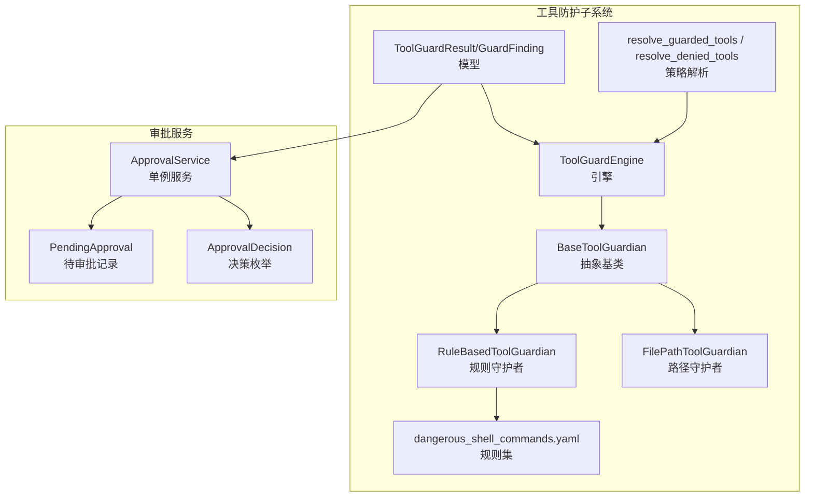
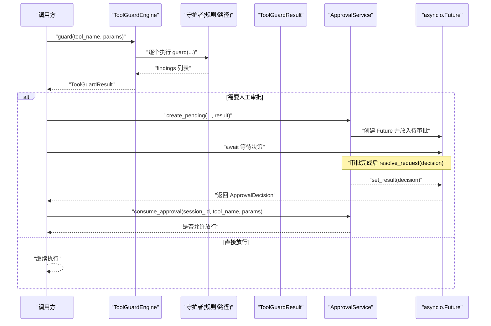
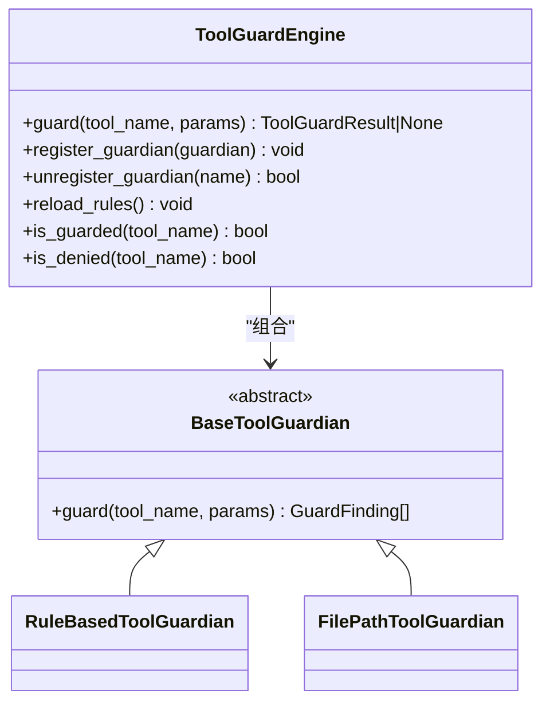
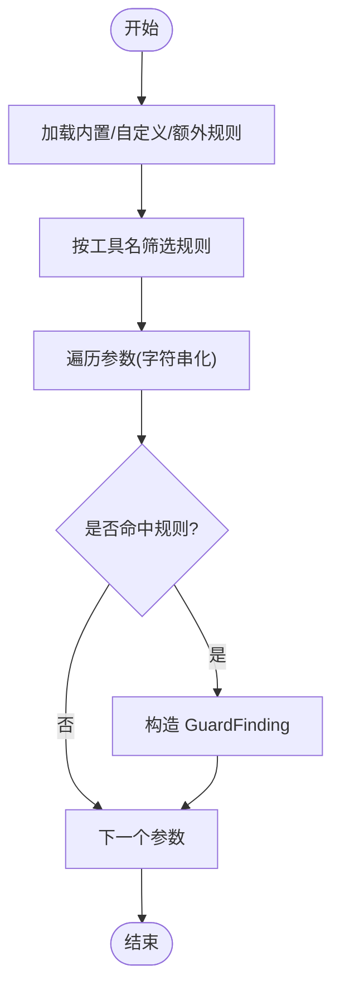
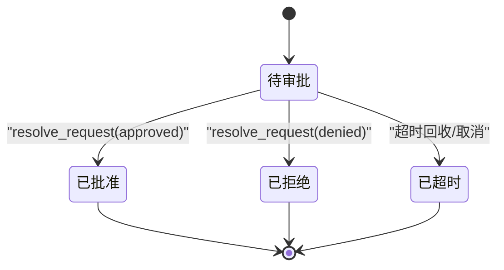
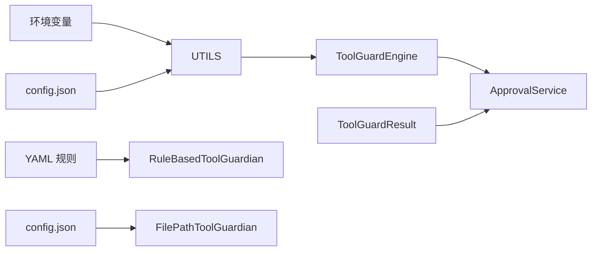

# 审批系统

<cite>
**本文引用的文件**
- [approval.py](file://copaw/src/copaw/security/tool_guard/approval.py)
- [engine.py](file://copaw/src/copaw/security/tool_guard/engine.py)
- [models.py](file://copaw/src/copaw/security/tool_guard/models.py)
- [service.py](file://copaw/src/copaw/app/approvals/service.py)
- [__init__.py（守护者基类）](file://copaw/src/copaw/security/tool_guard/guardians/__init__.py)
- [file_guardian.py](file://copaw/src/copaw/security/tool_guard/guardians/file_guardian.py)
- [rule_guardian.py](file://copaw/src/copaw/security/tool_guard/guardians/rule_guardian.py)
- [utils.py](file://copaw/src/copaw/security/tool_guard/utils.py)
- [dangerous_shell_commands.yaml](file://copaw/src/copaw/security/tool_guard/rules/dangerous_shell_commands.yaml)
</cite>

## 目录
1. [简介](#简介)
2. [项目结构](#项目结构)
3. [核心组件](#核心组件)
4. [架构总览](#架构总览)
5. [组件详解](#组件详解)
6. [依赖关系分析](#依赖关系分析)
7. [性能与可靠性](#性能与可靠性)
8. [故障排查指南](#故障排查指南)
9. [结论](#结论)
10. [附录：配置与集成](#附录配置与集成)

## 简介
本文件面向“工具防护审批系统”，围绕审批流程设计、权限控制、审批请求生成与处理、多级审批与决策逻辑、状态管理与超时恢复、策略配置与审批人权限设置、审批历史记录以及系统集成接口与最佳实践进行系统化技术说明。该系统通过“工具调用前置安全检查”触发“审批请求”，并以“异步等待+超时回收”的方式实现可控执行，确保高风险工具在获得授权后才被执行。

## 项目结构
审批系统位于 copaw 子模块中，核心由“工具防护引擎 + 审批服务 + 守护者（规则/路径）”构成，并通过配置与环境变量驱动策略与范围。

图示来源
- [engine.py:53-238](file://copaw/src/copaw/security/tool_guard/engine.py#L53-L238)
- [__init__.py（守护者基类）:17-62](file://copaw/src/copaw/security/tool_guard/guardians/__init__.py#L17-L62)
- [rule_guardian.py:280-383](file://copaw/src/copaw/security/tool_guard/guardians/rule_guardian.py#L280-L383)
- [file_guardian.py:161-342](file://copaw/src/copaw/security/tool_guard/guardians/file_guardian.py#L161-L342)
- [models.py:103-185](file://copaw/src/copaw/security/tool_guard/models.py#L103-L185)
- [utils.py:63-126](file://copaw/src/copaw/security/tool_guard/utils.py#L63-L126)
- [dangerous_shell_commands.yaml:1-183](file://copaw/src/copaw/security/tool_guard/rules/dangerous_shell_commands.yaml#L1-L183)
- [service.py:58-341](file://copaw/src/copaw/app/approvals/service.py#L58-L341)
- [approval.py:12-38](file://copaw/src/copaw/security/tool_guard/approval.py#L12-L38)

章节来源
- [engine.py:1-238](file://copaw/src/copaw/security/tool_guard/engine.py#L1-L238)
- [service.py:1-341](file://copaw/src/copaw/app/approvals/service.py#L1-L341)

## 核心组件
- 工具防护引擎（ToolGuardEngine）
  - 聚合多个守护者，对工具参数进行扫描，输出聚合结果 ToolGuardResult。
  - 支持按配置/环境变量启用/禁用、限定受保护工具集合、直接拒绝工具集合。
- 守护者体系
  - 规则守护者：基于 YAML 规则的正则匹配，覆盖命令注入、危险命令等威胁类别。
  - 路径守护者：针对敏感文件/目录访问进行阻断，支持从 shell 命令中提取路径。
- 审批服务（ApprovalService）
  - 维护待审批与已完成审批记录，支持按会话 FIFO 消费、参数一致性校验、超时回收与垃圾清理。
  - 提供异步 Future 用于阻塞式等待审批决策。
- 数据模型与决策
  - ToolGuardResult/GuardFinding：封装发现、严重级别、分类、修复建议等。
  - ApprovalDecision：批准/拒绝/超时三态。

章节来源
- [engine.py:53-238](file://copaw/src/copaw/security/tool_guard/engine.py#L53-L238)
- [rule_guardian.py:280-383](file://copaw/src/copaw/security/tool_guard/guardians/rule_guardian.py#L280-L383)
- [file_guardian.py:161-342](file://copaw/src/copaw/security/tool_guard/guardians/file_guardian.py#L161-L342)
- [models.py:103-185](file://copaw/src/copaw/security/tool_guard/models.py#L103-L185)
- [service.py:58-341](file://copaw/src/copaw/app/approvals/service.py#L58-L341)
- [approval.py:12-38](file://copaw/src/copaw/security/tool_guard/approval.py#L12-L38)

## 架构总览
审批系统采用“前置检查 + 异步审批 + 执行放行”的闭环设计。当工具调用进入安全检查阶段，若发现高危或需要人工确认的场景，则创建待审批记录并阻塞执行，直到审批服务返回决策（批准/拒绝/超时），随后进行参数一致性校验与后续处理。

图示来源
- [engine.py:169-227](file://copaw/src/copaw/security/tool_guard/engine.py#L169-L227)
- [service.py:80-136](file://copaw/src/copaw/app/approvals/service.py#L80-L136)
- [service.py:217-262](file://copaw/src/copaw/app/approvals/service.py#L217-L262)

## 组件详解

### 工具防护引擎（ToolGuardEngine）
- 职责
  - 注册/卸载守护者，按需执行，聚合结果。
  - 解析受保护工具与直接拒绝工具集合，支持环境变量与配置覆盖。
  - 提供懒加载单例入口。
- 关键点
  - always_run 守护者（如路径守护者）始终参与检查，保证路径层面的安全性。
  - 对每个守护者的失败进行记录，不影响整体结果聚合。
  - 结果包含最高严重级别、发现计数、耗时等，便于日志与审计。

图示来源
- [engine.py:53-238](file://copaw/src/copaw/security/tool_guard/engine.py#L53-L238)
- [__init__.py（守护者基类）:17-62](file://copaw/src/copaw/security/tool_guard/guardians/__init__.py#L17-L62)
- [rule_guardian.py:280-383](file://copaw/src/copaw/security/tool_guard/guardians/rule_guardian.py#L280-L383)
- [file_guardian.py:161-342](file://copaw/src/copaw/security/tool_guard/guardians/file_guardian.py#L161-L342)

章节来源
- [engine.py:53-238](file://copaw/src/copaw/security/tool_guard/engine.py#L53-L238)
- [utils.py:63-126](file://copaw/src/copaw/security/tool_guard/utils.py#L63-L126)

### 守护者：规则守护者（RuleBasedToolGuardian）
- 职责
  - 加载 YAML 规则文件，按工具名/参数名筛选适用规则，对字符串化参数值进行正则匹配。
  - 支持自定义规则与禁用规则 ID，支持热重载。
- 规则示例
  - 危险命令检测（如 rm/mv、格式化/擦除块设备、fork bomb、管道到 shell、反向连接、特权提升、重启/关机、服务管理、进程终止、危险权限变更等）。

图示来源
- [rule_guardian.py:280-383](file://copaw/src/copaw/security/tool_guard/guardians/rule_guardian.py#L280-L383)
- [dangerous_shell_commands.yaml:1-183](file://copaw/src/copaw/security/tool_guard/rules/dangerous_shell_commands.yaml#L1-L183)

章节来源
- [rule_guardian.py:280-383](file://copaw/src/copaw/security/tool_guard/guardians/rule_guardian.py#L280-L383)
- [dangerous_shell_commands.yaml:1-183](file://copaw/src/copaw/security/tool_guard/rules/dangerous_shell_commands.yaml#L1-L183)

### 守护者：路径守护者（FilePathToolGuardian）
- 职责
  - 基于配置敏感文件/目录列表阻断访问；支持从 shell 命令中提取路径并识别重定向操作。
  - 默认保护密钥目录，可通过配置扩展。
- 关键点
  - 总是运行（always_run=True），确保路径层面的最小安全边界。
  - 对命中敏感路径的参数生成高危发现。

章节来源
- [file_guardian.py:161-342](file://copaw/src/copaw/security/tool_guard/guardians/file_guardian.py#L161-L342)

### 审批服务（ApprovalService）
- 职责
  - 创建/解析待审批请求，维护内存中的待审批与已完成队列。
  - 提供按会话 FIFO 获取、参数一致性校验、超时回收与垃圾清理。
  - 通过 asyncio.Future 实现阻塞式等待审批决策。
- 决策与状态
  - 审批决策三态：批准、拒绝、超时。
  - 待审批记录包含会话标识、用户标识、渠道、工具名、摘要、发现数量、附加信息等。

图示来源
- [service.py:35-51](file://copaw/src/copaw/app/approvals/service.py#L35-L51)
- [service.py:116-136](file://copaw/src/copaw/app/approvals/service.py#L116-L136)
- [service.py:268-326](file://copaw/src/copaw/app/approvals/service.py#L268-L326)

章节来源
- [service.py:58-341](file://copaw/src/copaw/app/approvals/service.py#L58-L341)
- [approval.py:12-38](file://copaw/src/copaw/security/tool_guard/approval.py#L12-L38)

### 数据模型与辅助
- ToolGuardResult/GuardFinding
  - 封装一次工具调用的安全检查结果，包含最高严重级别、发现统计、耗时、失败守护者列表等。
- ApprovalDecision
  - 审批三态枚举，用于 Future 的结果设置与后续处理分支。

章节来源
- [models.py:103-185](file://copaw/src/copaw/security/tool_guard/models.py#L103-L185)
- [approval.py:12-38](file://copaw/src/copaw/security/tool_guard/approval.py#L12-L38)

## 依赖关系分析
- 松耦合
  - 守护者通过抽象基类解耦，新增检测能力无需修改引擎。
  - 规则守护者与规则文件解耦，支持热加载与禁用。
- 中心化
  - 审批服务作为单例，集中管理待审批与已完成记录，避免跨模块状态分散。
- 配置优先级
  - 环境变量 > 配置文件 > 内置默认，保障灵活部署与快速回退。

图示来源
- [utils.py:63-126](file://copaw/src/copaw/security/tool_guard/utils.py#L63-L126)
- [engine.py:53-238](file://copaw/src/copaw/security/tool_guard/engine.py#L53-L238)
- [rule_guardian.py:280-383](file://copaw/src/copaw/security/tool_guard/guardians/rule_guardian.py#L280-L383)
- [file_guardian.py:161-342](file://copaw/src/copaw/security/tool_guard/guardians/file_guardian.py#L161-L342)
- [service.py:58-341](file://copaw/src/copaw/app/approvals/service.py#L58-L341)

## 性能与可靠性
- 性能特性
  - 正则规则匹配在字符串化参数上进行，复杂度与参数长度线性相关；建议限制高危规则数量与模式复杂度。
  - 路径提取采用分词与最长前缀匹配，避免误报与漏报。
- 可靠性与健壮性
  - 守护者异常被隔离记录，不影响其他守护者执行。
  - 审批服务内部使用锁保护并发访问，Future 未完成时统一设置超时结果。
  - 垃圾回收策略：按时间与数量上限清理过期/溢出记录，防止内存膨胀。

章节来源
- [engine.py:209-224](file://copaw/src/copaw/security/tool_guard/engine.py#L209-L224)
- [service.py:268-326](file://copaw/src/copaw/app/approvals/service.py#L268-L326)

## 故障排查指南
- 审批未生效
  - 检查工具是否在受保护集合内；确认环境变量或配置项是否正确。
  - 确认审批服务已初始化且通道管理器可用。
- 超时频繁
  - 调整超时阈值与队列容量；检查审批流程是否卡顿。
- 参数不一致导致拒绝
  - 确保审批后执行的参数与审批记录一致；避免因重放导致的参数漂移。
- 规则误报/漏报
  - 检查规则文件与禁用规则 ID；必要时添加/调整正则表达式。

章节来源
- [utils.py:63-126](file://copaw/src/copaw/security/tool_guard/utils.py#L63-L126)
- [service.py:174-216](file://copaw/src/copaw/app/approvals/service.py#L174-L216)
- [rule_guardian.py:153-232](file://copaw/src/copaw/security/tool_guard/guardians/rule_guardian.py#L153-L232)

## 结论
该审批系统通过“前置安全检查 + 异步审批 + 参数校验 + 超时回收”的闭环设计，在保障高风险工具可控执行的同时，提供了可扩展的规则体系与稳定的内存审批存储。配合灵活的配置与环境变量，可在不同环境中快速落地并持续演进。

## 附录：配置与集成

### 审批策略配置
- 受保护工具集合
  - 优先级：构造函数 > 环境变量 > 配置文件 > 内置默认。
  - 环境变量键：COPAW_TOOL_GUARD_TOOLS（支持 * 或 all 全量保护，none/off/false/0 关闭）。
  - 配置文件键：security.tool_guard.guarded_tools。
- 直接拒绝工具集合
  - 环境变量键：COPAW_TOOL_GUARD_DENIED_TOOLS（逗号分隔）。
  - 配置文件键：security.tool_guard.denied_tools。
- 工具防护开关
  - 环境变量键：COPAW_TOOL_GUARD_ENABLED（true/1/yes 启用）。
  - 配置文件键：security.tool_guard.enabled。
- 路径守护开关与敏感文件
  - 配置文件键：security.file_guard.enabled 与 sensitive_files。
  - 默认保护密钥目录，空列表时回退至默认目录。

章节来源
- [utils.py:63-126](file://copaw/src/copaw/security/tool_guard/utils.py#L63-L126)
- [file_guardian.py:54-80](file://copaw/src/copaw/security/tool_guard/guardians/file_guardian.py#L54-L80)

### 审批人权限与集成
- 渠道通知
  - 审批服务可绑定通道管理器以推送审批提醒；具体渠道实现由外部模块提供。
- 会话与参数一致性
  - consume_approval 支持对最近一次批准进行一次性放行，并校验参数一致性，防止滥用。
- API 使用要点
  - 创建审批：create_pending(session_id, user_id, channel, tool_name, result, extra)。
  - 解析审批：resolve_request(request_id, decision)。
  - 查询状态：get_request(request_id)、get_pending_by_session(session_id)。
  - 参数校验：consume_approval(session_id, tool_name, tool_params)。

章节来源
- [service.py:80-136](file://copaw/src/copaw/app/approvals/service.py#L80-L136)
- [service.py:137-173](file://copaw/src/copaw/app/approvals/service.py#L137-L173)
- [service.py:217-262](file://copaw/src/copaw/app/approvals/service.py#L217-L262)

### 最佳实践
- 规则维护
  - 分类管理规则文件，定期评估误报率与漏报率，动态调整正则与排除规则。
- 队列治理
  - 合理设置超时阈值与队列容量，结合告警监控待审批积压。
- 参数校验
  - 在审批后严格比对参数，避免重放攻击与参数漂移。
- 日志与审计
  - 使用结构化日志记录发现摘要与严重级别，便于审计与回溯。