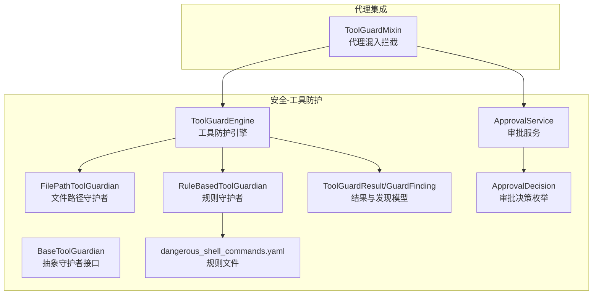
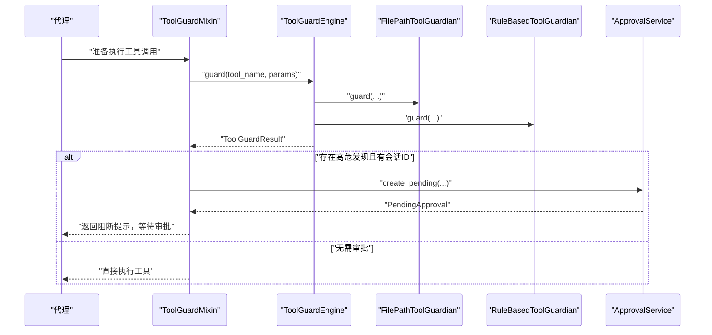
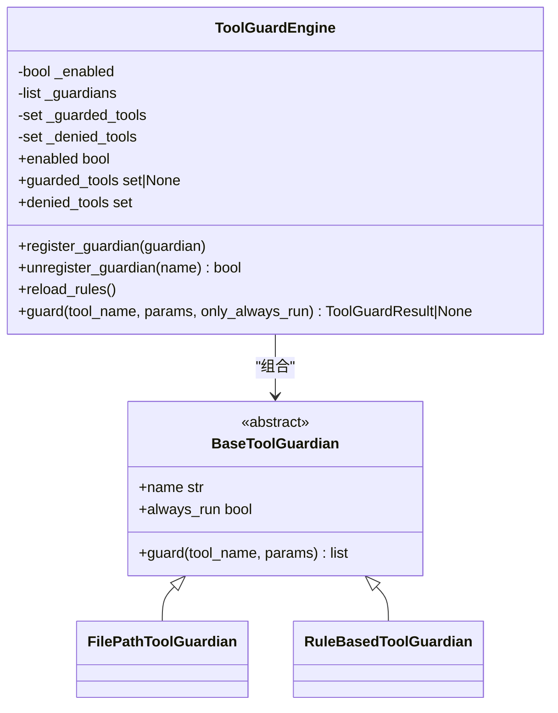
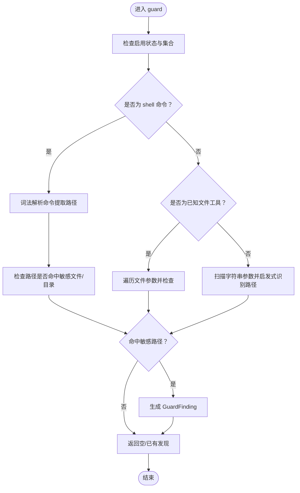
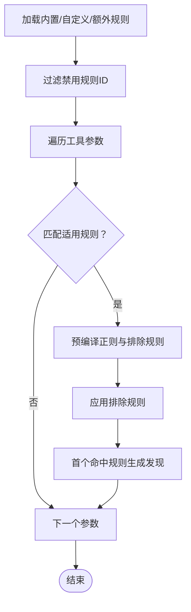
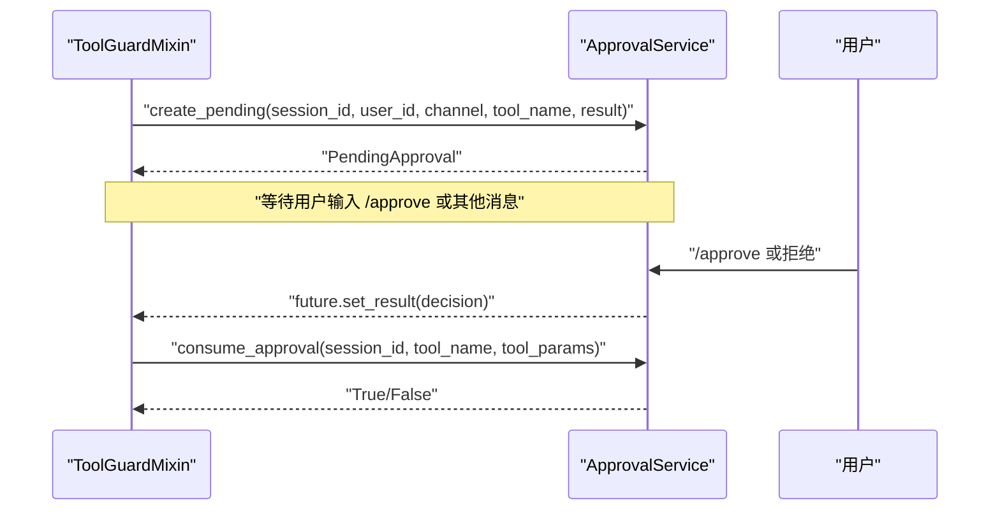
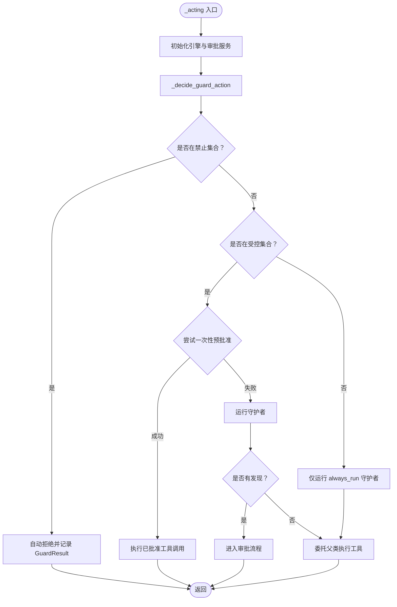
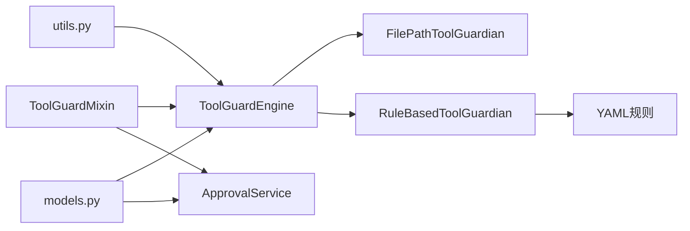

# 工具防护系统

<cite>
**本文引用的文件**
- [__init__.py](file://copaw/src/copaw/security/tool_guard/__init__.py)
- [engine.py](file://copaw/src/copaw/security/tool_guard/engine.py)
- [models.py](file://copaw/src/copaw/security/tool_guard/models.py)
- [utils.py](file://copaw/src/copaw/security/tool_guard/utils.py)
- [file_guardian.py](file://copaw/src/copaw/security/tool_guard/guardians/file_guardian.py)
- [rule_guardian.py](file://copaw/src/copaw/security/tool_guard/guardians/rule_guardian.py)
- [dangerous_shell_commands.yaml](file://copaw/src/copaw/security/tool_guard/rules/dangerous_shell_commands.yaml)
- [approval.py](file://copaw/src/copaw/security/tool_guard/approval.py)
- [service.py](file://copaw/src/copaw/app/approvals/service.py)
- [tool_guard_mixin.py](file://copaw/src/copaw/agents/tool_guard_mixin.py)
- [command_handler.py](file://copaw/src/copaw/agents/command_handler.py)
</cite>

## 目录
1. [简介](#简介)
2. [项目结构](#项目结构)
3. [核心组件](#核心组件)
4. [架构总览](#架构总览)
5. [详细组件分析](#详细组件分析)
6. [依赖分析](#依赖分析)
7. [性能考量](#性能考量)
8. [故障排查指南](#故障排查指南)
9. [结论](#结论)
10. [附录](#附录)

## 简介
本技术文档面向“工具防护系统”，聚焦于工具调用前的安全验证与审批流程设计，涵盖以下关键主题：
- 工具调用拦截与安全验证：在代理执行工具前对参数进行扫描，识别高危模式并生成告警。
- 审批系统：基于会话的待审批队列与决策模型，支持自动批准与人工审批。
- 文件与规则守护者：路径级敏感文件阻断与基于YAML签名的规则引擎。
- 危险命令检测：以正则签名为主的规则集，覆盖破坏性、滥用与越权等威胁类别。
- 权限控制与多级审核：通过配置与运行时环境变量实现灵活的受控范围与不可审批项。
- 日志记录与异常处理：结构化日志输出与容错处理，确保系统稳健性。
- 集成与性能：与技能/工具系统无缝集成，最小化对推理与执行的性能影响。

## 项目结构
工具防护系统位于安全子模块下，采用“引擎-守护者-审批服务-混入式拦截”的分层设计，核心文件如下：
- 引擎与模型：工具调用拦截与结果聚合
- 守护者：文件路径阻断与规则匹配
- 规则：YAML签名规则集
- 审批：审批服务与审批决策
- 集成：与代理的混入式拦截逻辑

图表来源
- [engine.py:53-238](file://copaw/src/copaw/security/tool_guard/engine.py#L53-L238)
- [guardians/__init__.py:17-62](file://copaw/src/copaw/security/tool_guard/guardians/__init__.py#L17-L62)
- [file_guardian.py:161-342](file://copaw/src/copaw/security/tool_guard/guardians/file_guardian.py#L161-L342)
- [rule_guardian.py:280-383](file://copaw/src/copaw/security/tool_guard/guardians/rule_guardian.py#L280-L383)
- [models.py:60-185](file://copaw/src/copaw/security/tool_guard/models.py#L60-L185)
- [service.py:58-341](file://copaw/src/copaw/app/approvals/service.py#L58-L341)
- [approval.py:12-38](file://copaw/src/copaw/security/tool_guard/approval.py#L12-L38)
- [dangerous_shell_commands.yaml:1-183](file://copaw/src/copaw/security/tool_guard/rules/dangerous_shell_commands.yaml#L1-L183)
- [tool_guard_mixin.py:45-821](file://copaw/src/copaw/agents/tool_guard_mixin.py#L45-L821)

章节来源
- [__init__.py:1-59](file://copaw/src/copaw/security/tool_guard/__init__.py#L1-L59)
- [engine.py:1-238](file://copaw/src/copaw/security/tool_guard/engine.py#L1-L238)
- [models.py:1-185](file://copaw/src/copaw/security/tool_guard/models.py#L1-L185)
- [utils.py:1-163](file://copaw/src/copaw/security/tool_guard/utils.py#L1-L163)
- [file_guardian.py:1-342](file://copaw/src/copaw/security/tool_guard/guardians/file_guardian.py#L1-L342)
- [rule_guardian.py:1-383](file://copaw/src/copaw/security/tool_guard/guardians/rule_guardian.py#L1-L383)
- [dangerous_shell_commands.yaml:1-183](file://copaw/src/copaw/security/tool_guard/rules/dangerous_shell_commands.yaml#L1-L183)
- [approval.py:1-38](file://copaw/src/copaw/security/tool_guard/approval.py#L1-L38)
- [service.py:1-341](file://copaw/src/copaw/app/approvals/service.py#L1-L341)
- [tool_guard_mixin.py:1-821](file://copaw/src/copaw/agents/tool_guard_mixin.py#L1-L821)

## 核心组件
- 工具防护引擎（ToolGuardEngine）
  - 负责注册与调度守护者，聚合结果，暴露启用开关与受控工具集合。
  - 支持按环境变量与配置动态启用/禁用，支持重载规则与受控工具集。
- 抽象守护者接口（BaseToolGuardian）
  - 统一的守护者接口，便于扩展新的检测引擎（如语义分析、LLM判断）。
- 文件路径守护者（FilePathToolGuardian）
  - 基于配置的敏感文件/目录阻断；支持从shell命令中提取路径并检查。
- 规则守护者（RuleBasedToolGuardian）
  - 加载YAML规则，对参数字符串表示进行正则匹配，支持排除规则。
- 结果与发现模型（ToolGuardResult/GuardFinding）
  - 统一的发现与结果结构，包含严重级别、威胁类别、修复建议等。
- 审批服务（ApprovalService）
  - 待审批请求的创建、消费、超时清理与参数一致性校验。
- 审批决策（ApprovalDecision）
  - 审批结果枚举：批准、拒绝、超时。
- 代理混入（ToolGuardMixin）
  - 在代理执行工具前进行拦截，按策略决定自动拒绝、预批准或进入审批流程。

章节来源
- [engine.py:53-238](file://copaw/src/copaw/security/tool_guard/engine.py#L53-L238)
- [guardians/__init__.py:17-62](file://copaw/src/copaw/security/tool_guard/guardians/__init__.py#L17-L62)
- [file_guardian.py:161-342](file://copaw/src/copaw/security/tool_guard/guardians/file_guardian.py#L161-L342)
- [rule_guardian.py:280-383](file://copaw/src/copaw/security/tool_guard/guardians/rule_guardian.py#L280-L383)
- [models.py:60-185](file://copaw/src/copaw/security/tool_guard/models.py#L60-L185)
- [service.py:58-341](file://copaw/src/copaw/app/approvals/service.py#L58-L341)
- [approval.py:12-38](file://copaw/src/copaw/security/tool_guard/approval.py#L12-L38)
- [tool_guard_mixin.py:45-821](file://copaw/src/copaw/agents/tool_guard_mixin.py#L45-L821)

## 架构总览
工具防护系统在代理执行工具前进行拦截，依据配置与规则判定是否需要审批，并在审批完成后决定是否放行。审批服务负责维护待审批队列与历史记录，确保参数一致性与超时清理。

图表来源
- [tool_guard_mixin.py:260-310](file://copaw/src/copaw/agents/tool_guard_mixin.py#L260-L310)
- [engine.py:169-227](file://copaw/src/copaw/security/tool_guard/engine.py#L169-L227)
- [file_guardian.py:290-342](file://copaw/src/copaw/security/tool_guard/guardians/file_guardian.py#L290-L342)
- [rule_guardian.py:329-383](file://copaw/src/copaw/security/tool_guard/guardians/rule_guardian.py#L329-L383)
- [service.py:80-115](file://copaw/src/copaw/app/approvals/service.py#L80-L115)

## 详细组件分析

### 工具防护引擎（ToolGuardEngine）
- 启用控制
  - 优先级：环境变量 > 配置文件 > 默认开启。
  - 提供全局开关与受控工具集合解析，支持“全部”“空集合”“默认高危集合”等语义。
- 守护者注册与调度
  - 默认包含文件路径守护者与规则守护者；支持动态注册/注销。
  - 受控工具集合为空时代表对所有工具生效；非受控工具仅运行“总是运行”的守护者（如文件路径检查）。
- 结果聚合
  - 记录使用过的守护者、失败的守护者、耗时与时间戳；提供最大严重级别与计数等便捷属性。
- 规则与配置重载
  - 支持重载规则与受控/禁止工具集，保证运行期热更新。

图表来源
- [engine.py:53-238](file://copaw/src/copaw/security/tool_guard/engine.py#L53-L238)
- [guardians/__init__.py:17-62](file://copaw/src/copaw/security/tool_guard/guardians/__init__.py#L17-L62)
- [file_guardian.py:161-342](file://copaw/src/copaw/security/tool_guard/guardians/file_guardian.py#L161-L342)
- [rule_guardian.py:280-383](file://copaw/src/copaw/security/tool_guard/guardians/rule_guardian.py#L280-L383)

章节来源
- [engine.py:35-238](file://copaw/src/copaw/security/tool_guard/engine.py#L35-L238)
- [utils.py:63-126](file://copaw/src/copaw/security/tool_guard/utils.py#L63-L126)

### 文件路径守护者（FilePathToolGuardian）
- 功能要点
  - 读取配置中的敏感文件/目录集合，默认保护密钥目录。
  - 对shell命令进行词法解析，提取重定向与路径参数，识别潜在敏感路径。
  - 对已知文件类工具（读写/编辑/发送文件）的参数进行严格检查。
  - 对未知工具的字符串参数进行启发式路径识别，避免误报（排除URL/MIME等）。
- 路径规范化与目录阻断
  - 将相对路径解析到工作区根目录，支持目录后缀“/”作为目录阻断标记。
  - 使用is_relative_to判断是否命中目录阻断。
- 发现与修复建议
  - 生成高严重级别的敏感文件访问发现，附带修复建议与已解析路径元数据。

图表来源
- [file_guardian.py:290-342](file://copaw/src/copaw/security/tool_guard/guardians/file_guardian.py#L290-L342)
- [file_guardian.py:111-159](file://copaw/src/copaw/security/tool_guard/guardians/file_guardian.py#L111-L159)
- [file_guardian.py:226-235](file://copaw/src/copaw/security/tool_guard/guardians/file_guardian.py#L226-L235)

章节来源
- [file_guardian.py:54-80](file://copaw/src/copaw/security/tool_guard/guardians/file_guardian.py#L54-L80)
- [file_guardian.py:111-159](file://copaw/src/copaw/security/tool_guard/guardians/file_guardian.py#L111-L159)
- [file_guardian.py:226-342](file://copaw/src/copaw/security/tool_guard/guardians/file_guardian.py#L226-L342)

### 规则守护者（RuleBasedToolGuardian）
- 规则加载
  - 默认从内置规则目录加载；支持自定义规则目录与额外规则注入。
  - 支持从配置中加载自定义规则与禁用规则ID，合并后过滤禁用项。
- 匹配逻辑
  - 针对每个工具参数的字符串表示进行匹配；支持工具维度与参数维度的筛选。
  - 正则表达式预编译，支持排除规则；命中后生成上下文片段与修复建议。
- 规则示例
  - 内置规则覆盖破坏性命令（rm/mv）、低层格式化/块设备操作、fork炸弹、管道下载执行、反连/隧道、凭证与计划任务、权限变更、混淆执行、系统重启/服务管理、进程终止、提权等。

图表来源
- [rule_guardian.py:153-232](file://copaw/src/copaw/security/tool_guard/guardians/rule_guardian.py#L153-L232)
- [rule_guardian.py:239-273](file://copaw/src/copaw/security/tool_guard/guardians/rule_guardian.py#L239-L273)
- [rule_guardian.py:329-383](file://copaw/src/copaw/security/tool_guard/guardians/rule_guardian.py#L329-L383)
- [dangerous_shell_commands.yaml:1-183](file://copaw/src/copaw/security/tool_guard/rules/dangerous_shell_commands.yaml#L1-L183)

章节来源
- [rule_guardian.py:153-232](file://copaw/src/copaw/security/tool_guard/guardians/rule_guardian.py#L153-L232)
- [rule_guardian.py:239-273](file://copaw/src/copaw/security/tool_guard/guardians/rule_guardian.py#L239-L273)
- [rule_guardian.py:329-383](file://copaw/src/copaw/security/tool_guard/guardians/rule_guardian.py#L329-L383)
- [dangerous_shell_commands.yaml:1-183](file://copaw/src/copaw/security/tool_guard/rules/dangerous_shell_commands.yaml#L1-L183)

### 审批系统（ApprovalService）
- 数据模型
  - PendingApproval：待审批记录，包含会话ID、用户ID、渠道、工具名、创建/解决时间、未来对象等。
- 生命周期
  - 创建：生成唯一请求ID，放入待审批队列，触发通知。
  - 解决：根据审批决策移至已完成队列，设置future结果。
  - 查询：支持按ID查询、按会话获取首个/全部待审批。
  - 清理：过期与溢出清理，保证内存占用可控。
- 参数一致性
  - consume_approval在复用审批时对比参数，防止“批准rm foo.txt”被用于执行“rm -rf /”。

图表来源
- [tool_guard_mixin.py:393-416](file://copaw/src/copaw/agents/tool_guard_mixin.py#L393-L416)
- [service.py:80-136](file://copaw/src/copaw/app/approvals/service.py#L80-L136)
- [service.py:217-263](file://copaw/src/copaw/app/approvals/service.py#L217-L263)

章节来源
- [service.py:58-341](file://copaw/src/copaw/app/approvals/service.py#L58-L341)
- [approval.py:12-38](file://copaw/src/copaw/security/tool_guard/approval.py#L12-L38)

### 代理混入（ToolGuardMixin）
- 拦截策略
  - 若工具在“禁止集合”，直接自动拒绝并记录。
  - 若工具在“受控集合”，先尝试一次性预批准，否则运行所有守护者；若发现高危，进入审批流程。
  - 对非受控工具，仅运行“总是运行”的守护者（如文件路径检查）。
- 记忆与回放
  - 自动清理被拦截的系统消息与后续解释消息，避免对话历史污染。
  - 支持强制回放队列与兄弟工具调用链的恢复，保持并行工具调用的正确顺序。
- 并发与锁
  - 决策过程在互斥锁内执行，避免并行工具调用导致的状态竞争；实际工具执行在锁外进行，保证并行度。

图表来源
- [tool_guard_mixin.py:260-366](file://copaw/src/copaw/agents/tool_guard_mixin.py#L260-L366)
- [tool_guard_mixin.py:367-392](file://copaw/src/copaw/agents/tool_guard_mixin.py#L367-L392)
- [tool_guard_mixin.py:442-491](file://copaw/src/copaw/agents/tool_guard_mixin.py#L442-L491)
- [tool_guard_mixin.py:492-610](file://copaw/src/copaw/agents/tool_guard_mixin.py#L492-L610)

章节来源
- [tool_guard_mixin.py:57-70](file://copaw/src/copaw/agents/tool_guard_mixin.py#L57-L70)
- [tool_guard_mixin.py:311-366](file://copaw/src/copaw/agents/tool_guard_mixin.py#L311-L366)
- [tool_guard_mixin.py:367-416](file://copaw/src/copaw/agents/tool_guard_mixin.py#L367-L416)
- [tool_guard_mixin.py:442-610](file://copaw/src/copaw/agents/tool_guard_mixin.py#L442-L610)

### 危险命令检测与白名单机制
- 规则引擎
  - 基于YAML的签名规则，支持工具维度与参数维度筛选，正则忽略大小写，支持排除规则。
  - 内置规则覆盖破坏性、滥用、越权、混淆、系统控制、网络滥用等威胁类别。
- 白名单机制
  - 通过“受控工具集合”与“禁止工具集合”实现白/黑名单控制；支持环境变量与配置覆盖。
  - 对未在受控集合内的工具，仍可运行“总是运行”的守护者（如文件路径检查），确保基础安全。

章节来源
- [dangerous_shell_commands.yaml:1-183](file://copaw/src/copaw/security/tool_guard/rules/dangerous_shell_commands.yaml#L1-L183)
- [utils.py:63-126](file://copaw/src/copaw/security/tool_guard/utils.py#L63-L126)
- [rule_guardian.py:153-232](file://copaw/src/copaw/security/tool_guard/guardians/rule_guardian.py#L153-L232)

### 审批系统的权限控制与多级审核
- 会话驱动的审批
  - 依赖会话ID进行审批队列管理，支持按会话获取首个/全部待审批。
  - 支持取消过期/重复的待审批记录，避免孤儿记录。
- 参数一致性校验
  - 复用审批时严格比对工具参数，防止参数漂移导致的滥用。
- 多级审核
  - 当前实现为单通道审批；可通过扩展审批服务的数据模型与路由策略实现多级审核（例如：初审/复审角色分离）。

章节来源
- [service.py:144-173](file://copaw/src/copaw/app/approvals/service.py#L144-L173)
- [service.py:174-216](file://copaw/src/copaw/app/approvals/service.py#L174-L216)
- [service.py:217-263](file://copaw/src/copaw/app/approvals/service.py#L217-L263)

### 拦截机制、日志记录与异常处理
- 拦截机制
  - 在代理的“acting/reasoning”阶段插入拦截点，按策略决定自动拒绝、预批准或进入审批。
- 日志记录
  - 结构化日志输出每条发现与汇总信息，区分高/低严重级别。
- 异常处理
  - 守护者执行异常被吞并并记录警告，不影响主流程；审批服务内部使用互斥锁保证线程安全。

章节来源
- [utils.py:128-163](file://copaw/src/copaw/security/tool_guard/utils.py#L128-L163)
- [engine.py:214-224](file://copaw/src/copaw/security/tool_guard/engine.py#L214-L224)
- [service.py:268-301](file://copaw/src/copaw/app/approvals/service.py#L268-L301)

### 防护策略配置、自定义规则编写与测试验证
- 配置项
  - 工具防护启用：环境变量 COPAW_TOOL_GUARD_ENABLED
  - 受控工具集合：环境变量 COPAW_TOOL_GUARD_TOOLS 或配置 security.tool_guard.guarded_tools
  - 禁止工具集合：环境变量 COPAW_TOOL_GUARD_DENIED_TOOLS 或配置 security.tool_guard.denied_tools
  - 文件守护启用与敏感文件：security.file_guard.enabled 与 security.file_guard.sensitive_files
- 自定义规则
  - 在自定义规则目录或配置中添加规则条目，支持工具/参数筛选、正则模式与排除模式。
- 测试验证
  - 建议通过构造不同参数组合的工具调用场景，验证规则命中与排除效果；结合审批服务的参数一致性测试，确保预批准不会被滥用。

章节来源
- [engine.py:35-51](file://copaw/src/copaw/security/tool_guard/engine.py#L35-L51)
- [utils.py:63-126](file://copaw/src/copaw/security/tool_guard/utils.py#L63-L126)
- [rule_guardian.py:239-273](file://copaw/src/copaw/security/tool_guard/guardians/rule_guardian.py#L239-L273)

### 与技能系统的集成方式与性能影响评估
- 集成方式
  - 通过 ToolGuardMixin 与代理生命周期钩子集成，不侵入工具实现；引擎与守护者遵循“懒加载/单例”模式，减少初始化开销。
- 性能影响
  - 规则匹配与文件路径解析均为轻量级操作；引擎记录耗时并提供短路逻辑（非受控工具仅运行always_run守护者）。
  - 审批服务采用异步Future与互斥锁，避免阻塞主线程；内存清理策略控制队列规模。

章节来源
- [tool_guard_mixin.py:277-310](file://copaw/src/copaw/agents/tool_guard_mixin.py#L277-L310)
- [engine.py:169-227](file://copaw/src/copaw/security/tool_guard/engine.py#L169-L227)
- [service.py:66-75](file://copaw/src/copaw/app/approvals/service.py#L66-L75)

## 依赖分析
- 组件耦合
  - ToolGuardEngine 与守护者之间为组合关系，解耦良好；守护者接口简单，便于扩展。
  - ToolGuardMixin 依赖引擎与审批服务，形成“拦截-审批-执行”的闭环。
- 外部依赖
  - 配置加载（security.*）与会话上下文（session_id/channel/user_id）来自上层模块。
  - 日志框架与异步事件循环用于结构化输出与并发控制。

图表来源
- [engine.py:53-238](file://copaw/src/copaw/security/tool_guard/engine.py#L53-L238)
- [file_guardian.py:161-342](file://copaw/src/copaw/security/tool_guard/guardians/file_guardian.py#L161-L342)
- [rule_guardian.py:280-383](file://copaw/src/copaw/security/tool_guard/guardians/rule_guardian.py#L280-L383)
- [tool_guard_mixin.py:57-70](file://copaw/src/copaw/agents/tool_guard_mixin.py#L57-L70)
- [service.py:58-341](file://copaw/src/copaw/app/approvals/service.py#L58-L341)
- [utils.py:63-126](file://copaw/src/copaw/security/tool_guard/utils.py#L63-L126)
- [models.py:60-185](file://copaw/src/copaw/security/tool_guard/models.py#L60-L185)

章节来源
- [engine.py:53-238](file://copaw/src/copaw/security/tool_guard/engine.py#L53-L238)
- [tool_guard_mixin.py:57-70](file://copaw/src/copaw/agents/tool_guard_mixin.py#L57-L70)
- [service.py:58-341](file://copaw/src/copaw/app/approvals/service.py#L58-L341)

## 性能考量
- 规则匹配
  - 正则预编译与排除规则短路，避免无效匹配；建议合理组织规则顺序，将高频命中规则靠前。
- 文件路径解析
  - 词法解析与去重策略降低重复扫描成本；建议将敏感目录置于配置顶层，减少路径解析次数。
- 审批队列
  - 过期与溢出清理策略控制内存占用；建议根据业务峰值调整阈值。
- 并发与锁
  - 决策阶段加锁，执行阶段释放，兼顾一致性与并行度。

## 故障排查指南
- 工具被错误拦截
  - 检查受控工具集合与禁止集合配置；确认规则是否误命中，必要时添加排除规则。
- 审批未生效
  - 确认会话ID是否存在；检查审批服务的队列状态与future结果；核对参数一致性校验。
- 守护者异常
  - 查看引擎日志中“守护者执行异常”的警告；检查规则正则合法性与配置加载情况。
- 日志与审计
  - 使用结构化日志定位具体工具、参数与规则ID；关注高危发现的汇总信息。

章节来源
- [engine.py:214-224](file://copaw/src/copaw/security/tool_guard/engine.py#L214-L224)
- [utils.py:128-163](file://copaw/src/copaw/security/tool_guard/utils.py#L128-L163)
- [service.py:268-301](file://copaw/src/copaw/app/approvals/service.py#L268-L301)

## 结论
工具防护系统通过“引擎-守护者-审批服务-混入式拦截”的架构，在代理执行工具前实现了可配置、可扩展、可观测的安全验证与审批流程。文件路径守护者与规则守护者分别覆盖了路径级敏感文件阻断与签名规则检测两大场景；审批服务提供了会话驱动的待审批队列与参数一致性保障。整体设计在保证安全性的同时，尽量降低对推理与执行的性能影响，并具备良好的扩展性与可维护性。

## 附录
- 关键配置项
  - COPAW_TOOL_GUARD_ENABLED：工具防护启用开关
  - COPAW_TOOL_GUARD_TOOLS：受控工具集合（支持“*”“all”“none/off/false/0”等语义）
  - COPAW_TOOL_GUARD_DENIED_TOOLS：禁止工具集合
  - security.file_guard.enabled：文件守护启用
  - security.file_guard.sensitive_files：敏感文件/目录列表
  - security.tool_guard.guarded_tools / denied_tools：受控/禁止工具集合（配置文件）
  - security.tool_guard.disabled_rules / custom_rules：禁用规则ID与自定义规则（配置文件）

章节来源
- [engine.py:35-51](file://copaw/src/copaw/security/tool_guard/engine.py#L35-L51)
- [utils.py:63-126](file://copaw/src/copaw/security/tool_guard/utils.py#L63-L126)
- [file_guardian.py:54-80](file://copaw/src/copaw/security/tool_guard/guardians/file_guardian.py#L54-L80)
- [rule_guardian.py:239-273](file://copaw/src/copaw/security/tool_guard/guardians/rule_guardian.py#L239-L273)