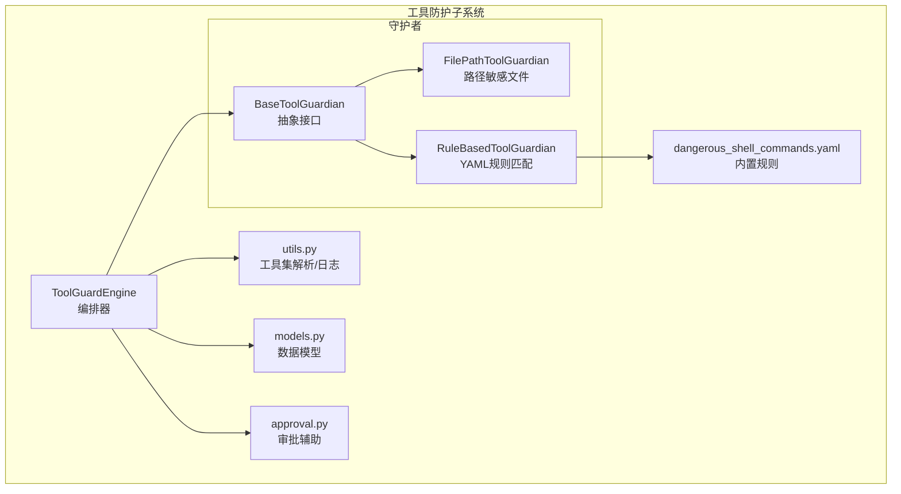
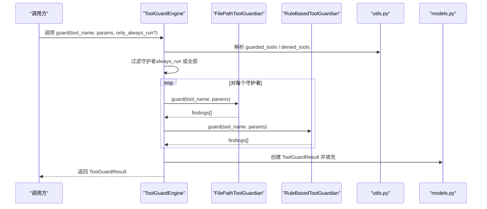
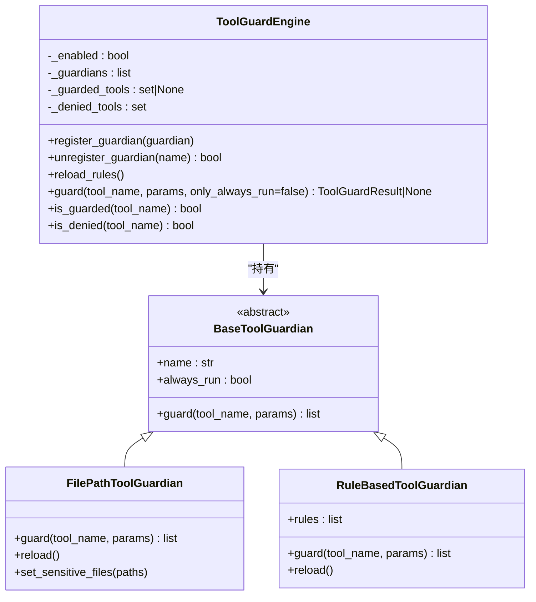
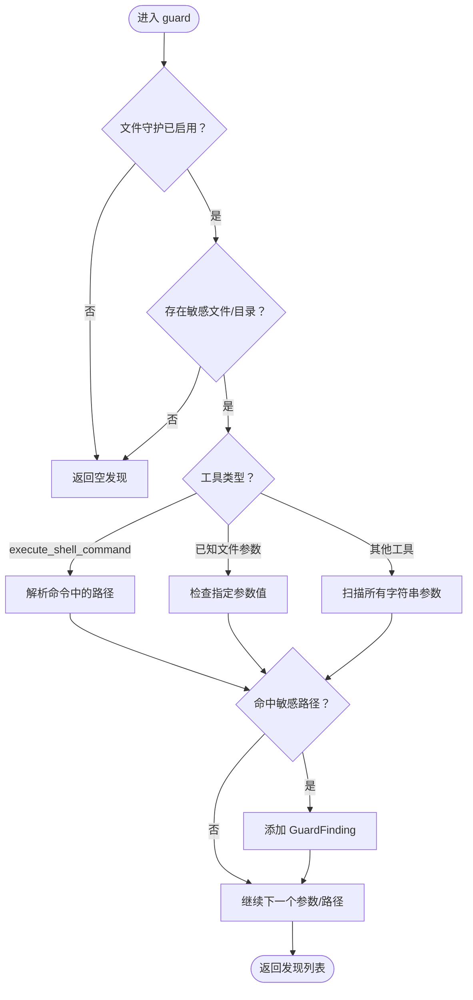
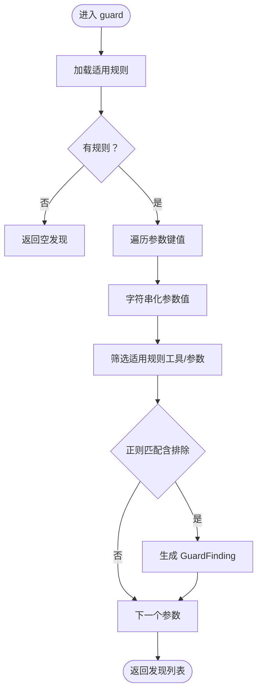
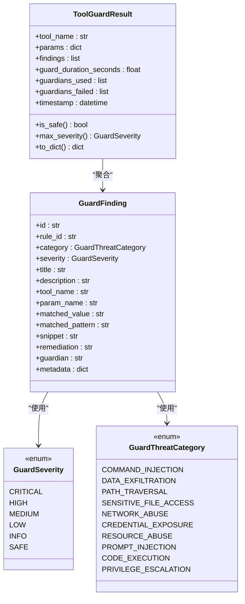
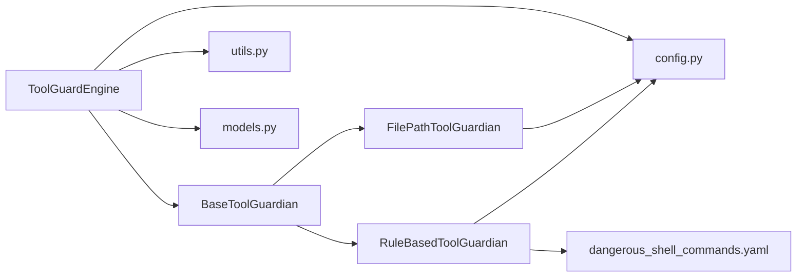

# 防护引擎

<cite>
**本文引用的文件**
- [engine.py](file://copaw/src/copaw/security/tool_guard/engine.py)
- [__init__.py（工具防护框架导出）](file://copaw/src/copaw/security/tool_guard/__init__.py)
- [models.py](file://copaw/src/copaw/security/tool_guard/models.py)
- [utils.py](file://copaw/src/copaw/security/tool_guard/utils.py)
- [guardians/__init__.py](file://copaw/src/copaw/security/tool_guard/guardians/__init__.py)
- [file_guardian.py](file://copaw/src/copaw/security/tool_guard/guardians/file_guardian.py)
- [rule_guardian.py](file://copaw/src/copaw/security/tool_guard/guardians/rule_guardian.py)
- [approval.py](file://copaw/src/copaw/security/tool_guard/approval.py)
- [config.py（配置模型）](file://copaw/src/copaw/config/config.py)
- [dangerous_shell_commands.yaml](file://copaw/src/copaw/security/tool_guard/rules/dangerous_shell_commands.yaml)
</cite>

## 目录
1. [简介](#简介)
2. [项目结构](#项目结构)
3. [核心组件](#核心组件)
4. [架构总览](#架构总览)
5. [详细组件分析](#详细组件分析)
6. [依赖分析](#依赖分析)
7. [性能考虑](#性能考虑)
8. [故障排查指南](#故障排查指南)
9. [结论](#结论)
10. [附录：配置与运行时参数](#附录配置与运行时参数)

## 简介
本文件面向“工具防护引擎”（ToolGuardEngine），系统性阐述其核心架构与工作原理，覆盖以下主题：
- 单例模式实现与延迟初始化
- 守护者注册机制与扩展点
- 工具调用拦截流程与参数扫描
- 引擎初始化、配置加载与状态管理
- 结果聚合、严重级别判定与日志输出
- 与守护者的协作模式、异常处理与性能监控
- 引擎配置项、环境变量与运行时参数
- 最佳实践与性能优化建议

## 项目结构
工具防护子系统位于安全模块下，采用“编排器 + 多守护者 + 规则/路径检查”的分层设计。核心文件如下：
- 编排器：ToolGuardEngine（负责编排、聚合、计时）
- 守护者接口：BaseToolGuardian（抽象基类）
- 内置守护者：FilePathToolGuardian（路径敏感文件检查）、RuleBasedToolGuardian（YAML规则正则匹配）
- 数据模型：ToolGuardResult、GuardFinding、枚举（严重级别、威胁类别）
- 工具函数：工具集解析、拒绝工具集解析、结构化日志
- 配置模型：ToolGuardConfig、FileGuardConfig、SecurityConfig
- 规则文件：YAML规则（默认危险命令检测）

图表来源
- [engine.py:53-238](file://copaw/src/copaw/security/tool_guard/engine.py#L53-L238)
- [guardians/__init__.py:17-62](file://copaw/src/copaw/security/tool_guard/guardians/__init__.py#L17-L62)
- [file_guardian.py:161-342](file://copaw/src/copaw/security/tool_guard/guardians/file_guardian.py#L161-L342)
- [rule_guardian.py:280-383](file://copaw/src/copaw/security/tool_guard/guardians/rule_guardian.py#L280-L383)
- [utils.py:63-163](file://copaw/src/copaw/security/tool_guard/utils.py#L63-L163)
- [models.py:103-185](file://copaw/src/copaw/security/tool_guard/models.py#L103-L185)
- [dangerous_shell_commands.yaml:1-183](file://copaw/src/copaw/security/tool_guard/rules/dangerous_shell_commands.yaml#L1-L183)

章节来源
- [engine.py:1-238](file://copaw/src/copaw/security/tool_guard/engine.py#L1-L238)
- [__init__.py（工具防护框架导出）:1-59](file://copaw/src/copaw/security/tool_guard/__init__.py#L1-L59)

## 核心组件
- ToolGuardEngine：单例编排器，负责守护开关、工具集范围、拒绝工具集、守护者注册与执行、结果聚合与计时。
- BaseToolGuardian：守护者抽象接口，定义统一的 guard(tool_name, params) 方法。
- FilePathToolGuardian：路径级敏感文件/目录阻断，支持从配置加载敏感列表、重载、always_run。
- RuleBasedToolGuardian：基于YAML规则的正则匹配，支持自定义规则、禁用规则、重载。
- ToolGuardResult/GuardFinding：结果聚合、严重级别计算、结构化输出。
- 工具函数：resolve_guarded_tools/resolve_denied_tools、log_findings。
- 配置模型：ToolGuardConfig/FileGuardConfig/SecurityConfig。

章节来源
- [engine.py:53-238](file://copaw/src/copaw/security/tool_guard/engine.py#L53-L238)
- [guardians/__init__.py:17-62](file://copaw/src/copaw/security/tool_guard/guardians/__init__.py#L17-L62)
- [file_guardian.py:161-342](file://copaw/src/copaw/security/tool_guard/guardians/file_guardian.py#L161-L342)
- [rule_guardian.py:280-383](file://copaw/src/copaw/security/tool_guard/guardians/rule_guardian.py#L280-L383)
- [models.py:103-185](file://copaw/src/copaw/security/tool_guard/models.py#L103-L185)
- [utils.py:63-163](file://copaw/src/copaw/security/tool_guard/utils.py#L63-L163)
- [config.py（配置模型）:1003-1072](file://copaw/src/copaw/config/config.py#L1003-L1072)

## 架构总览
ToolGuardEngine 采用“懒加载单例 + 可插拔守护者”的架构。初始化时根据优先级解析启用状态与工具集范围；运行时对每个工具调用参数进行扫描，收集各守护者的发现并汇总为 ToolGuardResult，同时记录耗时与失败守护者信息。

图表来源
- [engine.py:169-227](file://copaw/src/copaw/security/tool_guard/engine.py#L169-L227)
- [utils.py:63-126](file://copaw/src/copaw/security/tool_guard/utils.py#L63-L126)
- [models.py:103-177](file://copaw/src/copaw/security/tool_guard/models.py#L103-L177)

## 详细组件分析

### ToolGuardEngine：编排器与单例
- 单例实现：通过全局变量与延迟初始化函数实现懒加载单例。
- 启用控制：优先级（环境变量 > 配置 > 默认开启）决定是否执行守护。
- 工具集范围：支持“全部”“空集”“显式列表”，并可从环境变量或配置覆盖。
- 拒绝工具集：不可有条件批准，直接阻断。
- 守护者管理：支持注册/注销守护者，暴露名称列表；支持重载规则与刷新工具集。
- 执行策略：支持仅执行 always_run 的守护者（用于非受控工具的路径级检查）。
- 结果聚合：收集每个守护者的发现、失败守护者、耗时，并生成 ToolGuardResult。

图表来源
- [engine.py:53-238](file://copaw/src/copaw/security/tool_guard/engine.py#L53-L238)
- [guardians/__init__.py:17-62](file://copaw/src/copaw/security/tool_guard/guardians/__init__.py#L17-L62)
- [file_guardian.py:161-342](file://copaw/src/copaw/security/tool_guard/guardians/file_guardian.py#L161-L342)
- [rule_guardian.py:280-383](file://copaw/src/copaw/security/tool_guard/guardians/rule_guardian.py#L280-L383)

章节来源
- [engine.py:53-238](file://copaw/src/copaw/security/tool_guard/engine.py#L53-L238)

### BaseToolGuardian：守护者抽象接口
- 职责：定义统一的 guard 接口，确保不同守护者（规则、路径、语义等）可无缝替换与组合。
- 关键属性：name（人类可读名称）、always_run（是否始终执行）。
- 设计要点：接口最小化，便于扩展新的检测引擎（如 LLM-as-a-judge）。

章节来源
- [guardians/__init__.py:17-62](file://copaw/src/copaw/security/tool_guard/guardians/__init__.py#L17-L62)

### FilePathToolGuardian：路径敏感文件阻断
- 功能：阻断对敏感文件/目录的访问；支持从配置加载敏感列表、动态增删、重载。
- 路径解析：规范化绝对路径，区分文件与目录；对 shell 命令提取候选路径。
- 触发条件：当工具名命中已知文件参数或在 shell 命令中识别到路径时触发。
- 结果：构造 GuardFinding，标注高危严重级别与修复建议。

图表来源
- [file_guardian.py:290-342](file://copaw/src/copaw/security/tool_guard/guardians/file_guardian.py#L290-L342)

章节来源
- [file_guardian.py:161-342](file://copaw/src/copaw/security/tool_guard/guardians/file_guardian.py#L161-L342)

### RuleBasedToolGuardian：YAML规则匹配
- 规则来源：默认规则目录下的 YAML 文件；支持从配置注入自定义规则与禁用规则。
- 匹配逻辑：对每个工具参数做字符串化后按规则匹配，支持排除模式；命中后生成 GuardFinding。
- 性能：预编译正则表达式；仅对适用工具/参数执行匹配。
- 重载：支持重新加载规则与禁用列表。

图表来源
- [rule_guardian.py:329-383](file://copaw/src/copaw/security/tool_guard/guardians/rule_guardian.py#L329-L383)

章节来源
- [rule_guardian.py:280-383](file://copaw/src/copaw/security/tool_guard/guardians/rule_guardian.py#L280-L383)
- [dangerous_shell_commands.yaml:1-183](file://copaw/src/copaw/security/tool_guard/rules/dangerous_shell_commands.yaml#L1-L183)

### 数据模型与结果聚合
- GuardSeverity/GuardThreatCategory：标准化严重级别与威胁类别。
- GuardFinding：单条发现，包含规则ID、类别、严重级别、标题、描述、参数名、匹配值/模式、片段、修复建议、元数据等。
- ToolGuardResult：聚合一次工具调用的发现、耗时、使用/失败守护者、时间戳；提供 is_safe/max_severity/findings_count 等便捷属性与序列化方法。
- 日志：log_findings 输出结构化日志，按严重级别选择日志级别。

图表来源
- [models.py:25-185](file://copaw/src/copaw/security/tool_guard/models.py#L25-L185)

章节来源
- [models.py:103-185](file://copaw/src/copaw/security/tool_guard/models.py#L103-L185)
- [utils.py:128-163](file://copaw/src/copaw/security/tool_guard/utils.py#L128-L163)

### 审批辅助与摘要
- ApprovalDecision：审批决策（批准/拒绝/超时）。
- format_findings_summary：将发现摘要格式化为简洁的 Markdown 文本，便于用户理解风险。

章节来源
- [approval.py:12-38](file://copaw/src/copaw/security/tool_guard/approval.py#L12-L38)

## 依赖分析
- 组件耦合：Engine 依赖守护者接口与工具函数；守护者依赖抽象接口；规则守护者依赖 YAML 规则文件；模型独立于业务逻辑。
- 配置耦合：Engine 与守护者均通过配置模块读取安全相关设置；utils 提供配置解析能力。
- 外部依赖：YAML 解析、正则表达式、路径解析、日志记录。

图表来源
- [engine.py:53-238](file://copaw/src/copaw/security/tool_guard/engine.py#L53-L238)
- [rule_guardian.py:280-383](file://copaw/src/copaw/security/tool_guard/guardians/rule_guardian.py#L280-L383)
- [file_guardian.py:161-342](file://copaw/src/copaw/security/tool_guard/guardians/file_guardian.py#L161-L342)
- [utils.py:63-163](file://copaw/src/copaw/security/tool_guard/utils.py#L63-L163)
- [config.py（配置模型）:1003-1072](file://copaw/src/copaw/config/config.py#L1003-L1072)

章节来源
- [engine.py:53-238](file://copaw/src/copaw/security/tool_guard/engine.py#L53-L238)
- [rule_guardian.py:280-383](file://copaw/src/copaw/security/tool_guard/guardians/rule_guardian.py#L280-L383)
- [file_guardian.py:161-342](file://copaw/src/copaw/security/tool_guard/guardians/file_guardian.py#L161-L342)
- [utils.py:63-163](file://copaw/src/copaw/security/tool_guard/utils.py#L63-L163)
- [config.py（配置模型）:1003-1072](file://copaw/src/copaw/config/config.py#L1003-L1072)

## 性能考虑
- 正则预编译：规则守护者在初始化时预编译正则，避免重复编译开销。
- 早停策略：对不适用的工具/参数跳过匹配，减少无效扫描。
- 字符串化扫描：将参数值统一转为字符串进行扫描，兼顾覆盖率与性能。
- 计时与失败隔离：记录每个守护者耗时与失败原因，便于定位性能瓶颈。
- always_run：对非受控工具仍执行路径级检查，避免漏检但可能增加开销，可通过 only_always_run 控制。

## 故障排查指南
- 守护未生效
  - 检查环境变量 COPAW_TOOL_GUARD_ENABLED 是否被设置为 true-like 值。
  - 检查配置 security.tool_guard.enabled 是否为 True。
  - 若两者都未设置，引擎默认启用。
- 工具未被守护
  - 检查 COPAW_TOOL_GUARD_TOOLS 或 security.tool_guard.guarded_tools 的设置，确认工具名大小写与白名单一致。
  - 使用 only_always_run 仅执行 always_run 的守护者，验证路径级检查是否正常。
- 规则未生效
  - 检查 rules 目录是否存在且可读；确认 YAML 文件语法正确。
  - 检查 security.tool_guard.disabled_rules 是否误禁用目标规则。
  - 调用 reload_rules 刷新规则缓存。
- 路径检查异常
  - 确认 security.file_guard.enabled 与 sensitive_files 设置。
  - 检查路径是否被规范化为绝对路径，目录需以斜杠结尾以启用目录阻断。
- 结果聚合异常
  - 查看 ToolGuardResult.guardians_failed 中的错误详情。
  - 使用 log_findings 的结构化日志定位高危发现。

章节来源
- [engine.py:35-51](file://copaw/src/copaw/security/tool_guard/engine.py#L35-L51)
- [utils.py:63-126](file://copaw/src/copaw/security/tool_guard/utils.py#L63-L126)
- [rule_guardian.py:311-314](file://copaw/src/copaw/security/tool_guard/guardians/rule_guardian.py#L311-L314)
- [file_guardian.py:221-225](file://copaw/src/copaw/security/tool_guard/guardians/file_guardian.py#L221-L225)
- [utils.py:128-163](file://copaw/src/copaw/security/tool_guard/utils.py#L128-L163)

## 结论
ToolGuardEngine 通过“编排器 + 可插拔守护者 + 规则/路径检查”的架构，在工具调用前对参数进行快速扫描与聚合，提供可配置、可观测、可扩展的安全防护能力。结合审批辅助与结构化日志，可在保证安全性的同时维持良好的用户体验。

## 附录：配置与运行时参数

### 配置项与优先级
- 启用开关
  - 环境变量：COPAW_TOOL_GUARD_ENABLED（true-like 优先）
  - 配置：security.tool_guard.enabled（若环境变量未设置则生效）
  - 默认：True
- 工具集范围
  - 环境变量：COPAW_TOOL_GUARD_TOOLS
    - 支持通配符 "*" 表示全部；"*" 或 "all" 表示全部；空/none/off/false/0 表示关闭
    - 其他为逗号分隔的工具名列表
  - 配置：security.tool_guard.guarded_tools（None 表示使用内置高危集合）
  - 默认：内置高危工具集合（如 execute_shell_command、read_file、write_file 等）
- 拒绝工具集
  - 环境变量：COPAW_TOOL_GUARD_DENIED_TOOLS（逗号分隔）
  - 配置：security.tool_guard.denied_tools（不可有条件批准）
  - 默认：空集
- 规则与自定义
  - 配置：security.tool_guard.custom_rules、security.tool_guard.disabled_rules
  - 规则文件：rules/*.yaml（默认包含危险命令规则）
- 路径守护
  - 配置：security.file_guard.enabled、security.file_guard.sensitive_files
  - 默认：敏感目录（如密钥目录）

章节来源
- [engine.py:35-51](file://copaw/src/copaw/security/tool_guard/engine.py#L35-L51)
- [utils.py:63-126](file://copaw/src/copaw/security/tool_guard/utils.py#L63-L126)
- [config.py（配置模型）:1003-1072](file://copaw/src/copaw/config/config.py#L1003-L1072)
- [dangerous_shell_commands.yaml:1-183](file://copaw/src/copaw/security/tool_guard/rules/dangerous_shell_commands.yaml#L1-L183)

### 运行时参数与方法
- ToolGuardEngine
  - 构造参数：guardians（可选，默认内置守护者）、enabled（可选，覆盖开关）
  - 方法：register_guardian/unregister_guardian/reload_rules/is_guarded/is_denied/guard
  - 属性：enabled/guardian_names/guarded_tools/denied_tools
- RuleBasedToolGuardian
  - 构造参数：rules_dir（可选）、extra_rules（可选）
  - 方法：reload（重载规则）、rules（只读视图）
- FilePathToolGuardian
  - 构造参数：sensitive_files（可选）
  - 方法：set_sensitive_files/add_sensitive_file/remove_sensitive_file/reload
- 工具函数
  - resolve_guarded_tools/user_defined/环境变量/配置/默认集合
  - resolve_denied_tools/user_defined/环境变量/配置/默认空集
  - log_findings(result)

章节来源
- [engine.py:65-164](file://copaw/src/copaw/security/tool_guard/engine.py#L65-L164)
- [rule_guardian.py:292-324](file://copaw/src/copaw/security/tool_guard/guardians/rule_guardian.py#L292-L324)
- [file_guardian.py:164-225](file://copaw/src/copaw/security/tool_guard/guardians/file_guardian.py#L164-L225)
- [utils.py:63-126](file://copaw/src/copaw/security/tool_guard/utils.py#L63-L126)
- [models.py:103-177](file://copaw/src/copaw/security/tool_guard/models.py#L103-L177)

### 最佳实践与性能优化建议
- 最小化规则集：仅保留必要的规则，减少匹配开销；通过 disabled_rules 精准禁用无关规则。
- 合理使用 always_run：对非受控工具启用路径级检查，但注意可能增加耗时。
- 分层治理：通过 guarded_tools/denied_tools 实现分层控制，优先拒绝高危工具。
- 规则质量：保持正则简洁、明确，避免过度宽泛导致误报与性能下降。
- 监控与告警：利用 log_findings 与 ToolGuardResult.guard_duration_seconds 监控性能与异常。
- 配置热更新：通过 reload_rules 与引擎重载工具集，避免重启服务。