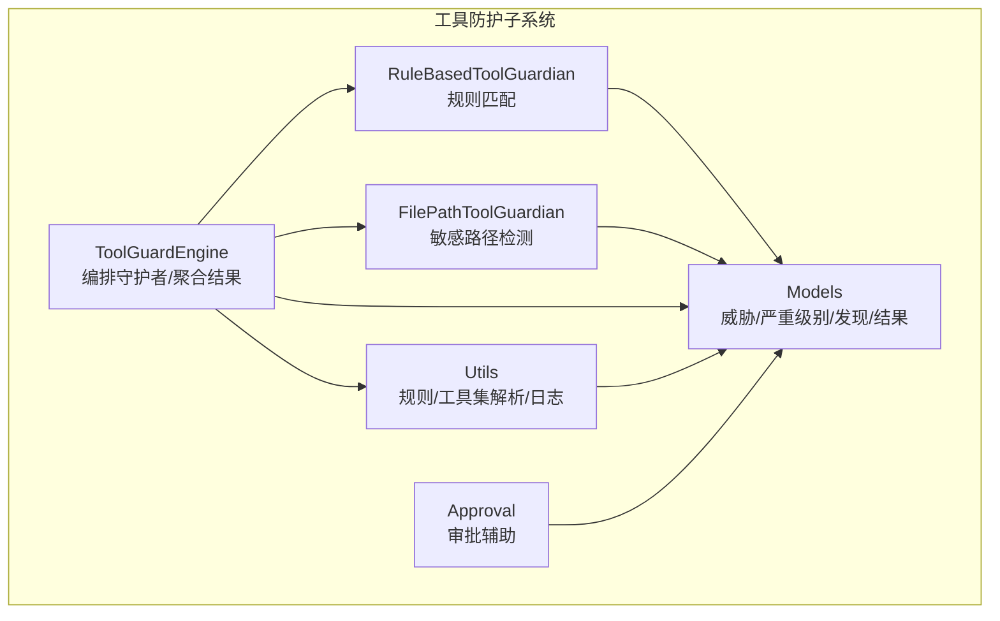
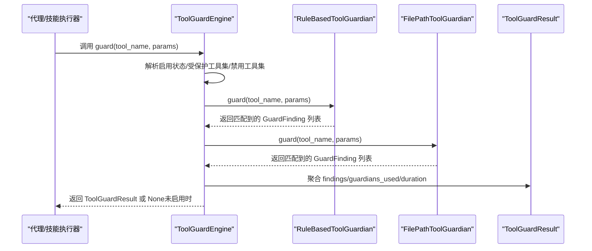
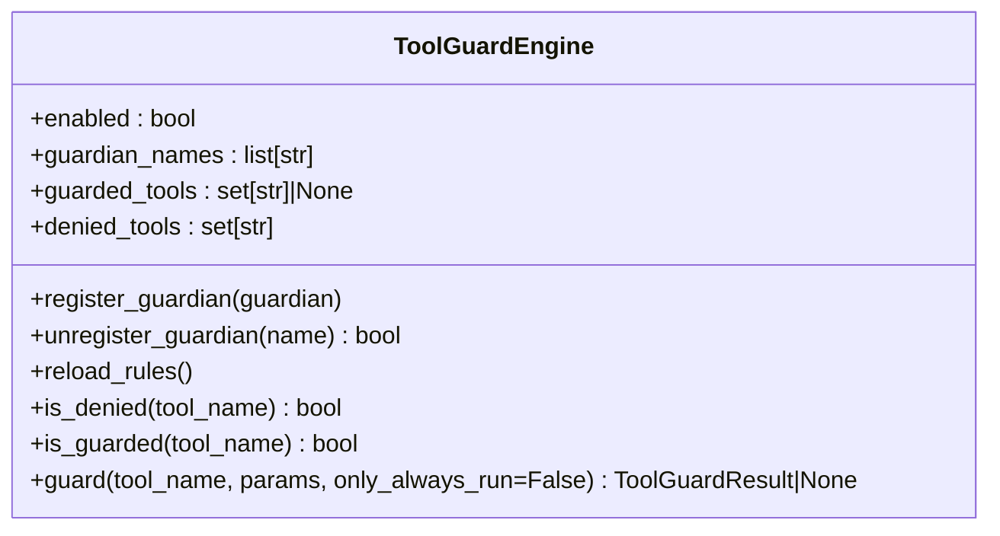
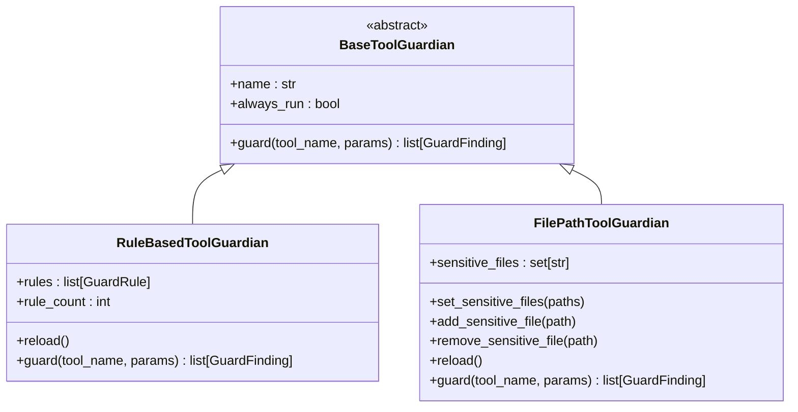
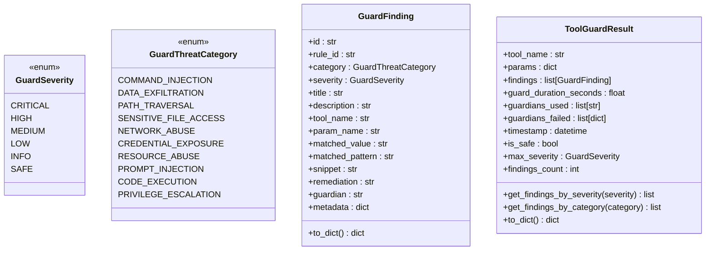
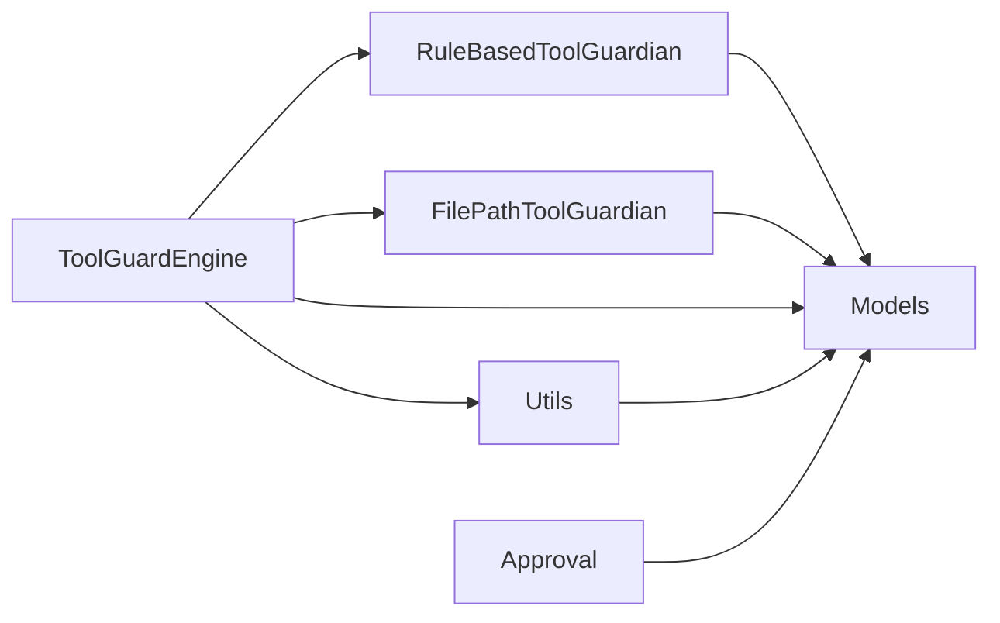
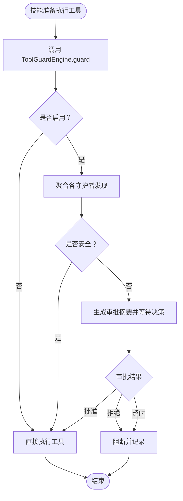

# 集成指南

<cite>
**本文引用的文件**
- [copaw/src/copaw/security/tool_guard/__init__.py](file://copaw/src/copaw/security/tool_guard/__init__.py)
- [copaw/src/copaw/security/tool_guard/engine.py](file://copaw/src/copaw/security/tool_guard/engine.py)
- [copaw/src/copaw/security/tool_guard/models.py](file://copaw/src/copaw/security/tool_guard/models.py)
- [copaw/src/copaw/security/tool_guard/utils.py](file://copaw/src/copaw/security/tool_guard/utils.py)
- [copaw/src/copaw/security/tool_guard/guardians/__init__.py](file://copaw/src/copaw/security/tool_guard/guardians/__init__.py)
- [copaw/src/copaw/security/tool_guard/guardians/rule_guardian.py](file://copaw/src/copaw/security/tool_guard/guardians/rule_guardian.py)
- [copaw/src/copaw/security/tool_guard/guardians/file_guardian.py](file://copaw/src/copaw/security/tool_guard/guardians/file_guardian.py)
- [copaw/src/copaw/security/tool_guard/approval.py](file://copaw/src/copaw/security/tool_guard/approval.py)
- [copaw/src/copaw/config/config.py](file://copaw/src/copaw/config/config.py)
- [copaw/src/copaw/constant.py](file://copaw/src/copaw/constant.py)
</cite>

## 目录
1. [简介](#简介)
2. [项目结构](#项目结构)
3. [核心组件](#核心组件)
4. [架构总览](#架构总览)
5. [详细组件分析](#详细组件分析)
6. [依赖分析](#依赖分析)
7. [性能考虑](#性能考虑)
8. [故障排查指南](#故障排查指南)
9. [结论](#结论)
10. [附录](#附录)

## 简介
本指南面向需要在CoPaw框架中集成“工具防护系统”的开发者，目标是帮助你：
- 明确工具防护系统与CoPaw框架的集成方式与接口规范
- 确定工具调用的拦截点与集成步骤
- 掌握配置文件与环境变量的设置方法
- 理解工具防护与技能系统的协作机制与数据流转
- 提供集成测试方法、调试技巧与常见问题解决方案
- 给出完整集成示例、最佳实践与性能优化建议

工具防护系统（Tool Guard）在工具调用前对参数进行扫描，识别潜在危险模式（如命令注入、敏感文件访问等），并以统一的数据模型输出结果，便于后续审批或阻断。

## 项目结构
工具防护系统位于安全子模块下，采用“引擎 + 多守护者 + 规则/配置解析”的分层设计：
- 引擎负责编排所有守护者、聚合结果、加载配置与规则
- 守护者实现具体检测逻辑（默认包含基于规则的检测与路径敏感文件检测）
- 模型定义统一的威胁分类、严重级别、检测发现与结果对象
- 工具函数负责规则集与受保护工具集的解析、日志格式化
- 配置与常量提供环境变量与默认行为

图表来源
- [copaw/src/copaw/security/tool_guard/engine.py:53-238](file://copaw/src/copaw/security/tool_guard/engine.py#L53-L238)
- [copaw/src/copaw/security/tool_guard/guardians/rule_guardian.py:280-383](file://copaw/src/copaw/security/tool_guard/guardians/rule_guardian.py#L280-L383)
- [copaw/src/copaw/security/tool_guard/guardians/file_guardian.py:161-342](file://copaw/src/copaw/security/tool_guard/guardians/file_guardian.py#L161-L342)
- [copaw/src/copaw/security/tool_guard/models.py:25-185](file://copaw/src/copaw/security/tool_guard/models.py#L25-L185)
- [copaw/src/copaw/security/tool_guard/utils.py:63-163](file://copaw/src/copaw/security/tool_guard/utils.py#L63-L163)
- [copaw/src/copaw/security/tool_guard/approval.py:12-38](file://copaw/src/copaw/security/tool_guard/approval.py#L12-L38)

章节来源
- [copaw/src/copaw/security/tool_guard/__init__.py:1-59](file://copaw/src/copaw/security/tool_guard/__init__.py#L1-L59)
- [copaw/src/copaw/security/tool_guard/engine.py:1-238](file://copaw/src/copaw/security/tool_guard/engine.py#L1-L238)
- [copaw/src/copaw/security/tool_guard/models.py:1-185](file://copaw/src/copaw/security/tool_guard/models.py#L1-L185)
- [copaw/src/copaw/security/tool_guard/utils.py:1-163](file://copaw/src/copaw/security/tool_guard/utils.py#L1-L163)
- [copaw/src/copaw/security/tool_guard/guardians/__init__.py:1-62](file://copaw/src/copaw/security/tool_guard/guardians/__init__.py#L1-L62)
- [copaw/src/copaw/security/tool_guard/guardians/rule_guardian.py:1-383](file://copaw/src/copaw/security/tool_guard/guardians/rule_guardian.py#L1-L383)
- [copaw/src/copaw/security/tool_guard/guardians/file_guardian.py:1-342](file://copaw/src/copaw/security/tool_guard/guardians/file_guardian.py#L1-L342)
- [copaw/src/copaw/security/tool_guard/approval.py:1-38](file://copaw/src/copaw/security/tool_guard/approval.py#L1-L38)

## 核心组件
- 引擎（ToolGuardEngine）
  - 单例懒加载，支持注册/注销守护者、按需重载规则、解析受保护工具集与禁用工具集
  - 提供guard接口，在工具调用前扫描参数，返回ToolGuardResult
- 守护者（BaseToolGuardian及其子类）
  - RuleBasedToolGuardian：基于YAML规则的正则匹配
  - FilePathToolGuardian：针对敏感文件/目录的路径阻断
- 数据模型（Models）
  - 威胁类别、严重级别枚举；GuardFinding、ToolGuardResult
- 工具函数（Utils）
  - 解析受保护工具集、禁用工具集、规则重载、结构化日志
- 审批辅助（Approval）
  - 审批决策枚举、风险摘要格式化

章节来源
- [copaw/src/copaw/security/tool_guard/engine.py:53-238](file://copaw/src/copaw/security/tool_guard/engine.py#L53-L238)
- [copaw/src/copaw/security/tool_guard/guardians/__init__.py:17-62](file://copaw/src/copaw/security/tool_guard/guardians/__init__.py#L17-L62)
- [copaw/src/copaw/security/tool_guard/guardians/rule_guardian.py:280-383](file://copaw/src/copaw/security/tool_guard/guardians/rule_guardian.py#L280-L383)
- [copaw/src/copaw/security/tool_guard/guardians/file_guardian.py:161-342](file://copaw/src/copaw/security/tool_guard/guardians/file_guardian.py#L161-L342)
- [copaw/src/copaw/security/tool_guard/models.py:25-185](file://copaw/src/copaw/security/tool_guard/models.py#L25-L185)
- [copaw/src/copaw/security/tool_guard/utils.py:63-163](file://copaw/src/copaw/security/tool_guard/utils.py#L63-L163)
- [copaw/src/copaw/security/tool_guard/approval.py:12-38](file://copaw/src/copaw/security/tool_guard/approval.py#L12-L38)

## 架构总览
工具防护系统与CoPaw框架的集成点主要在“工具调用”阶段之前，通过统一的guard接口进行拦截与评估。整体流程如下：

图表来源
- [copaw/src/copaw/security/tool_guard/engine.py:169-226](file://copaw/src/copaw/security/tool_guard/engine.py#L169-L226)
- [copaw/src/copaw/security/tool_guard/guardians/rule_guardian.py:329-382](file://copaw/src/copaw/security/tool_guard/guardians/rule_guardian.py#L329-L382)
- [copaw/src/copaw/security/tool_guard/guardians/file_guardian.py:290-341](file://copaw/src/copaw/security/tool_guard/guardians/file_guardian.py#L290-L341)
- [copaw/src/copaw/security/tool_guard/models.py:103-177](file://copaw/src/copaw/security/tool_guard/models.py#L103-L177)

## 详细组件分析

### 引擎（ToolGuardEngine）
- 启用控制
  - 优先级：环境变量 > 配置文件 > 默认开启
  - 支持动态关闭/开启
- 受保护工具集与禁用工具集
  - 支持从环境变量、配置文件、默认高危集合解析
  - 支持仅运行always_run的守护者（用于非受保护工具的路径检查）
- 规则重载
  - 支持守护者reload与工具集刷新
- 结果聚合
  - 记录使用的守护者、失败的守护者、耗时、最高严重级别

图表来源
- [copaw/src/copaw/security/tool_guard/engine.py:53-238](file://copaw/src/copaw/security/tool_guard/engine.py#L53-L238)

章节来源
- [copaw/src/copaw/security/tool_guard/engine.py:35-164](file://copaw/src/copaw/security/tool_guard/engine.py#L35-L164)
- [copaw/src/copaw/security/tool_guard/engine.py:169-226](file://copaw/src/copaw/security/tool_guard/engine.py#L169-L226)

### 守护者（BaseToolGuardian）
- 抽象接口
  - 所有守护者必须实现guard方法，返回GuardFinding列表
  - always_run标记用于强制在非受保护工具上也执行（如路径检查）
- RuleBasedToolGuardian
  - 加载YAML规则，按工具名/参数名匹配，正则命中生成发现
  - 支持自定义规则与禁用规则ID
- FilePathToolGuardian
  - 对敏感文件/目录进行阻断
  - 支持从配置加载敏感文件列表，默认保护密钥目录
  - 支持从shell命令中提取路径令牌

图表来源
- [copaw/src/copaw/security/tool_guard/guardians/__init__.py:17-62](file://copaw/src/copaw/security/tool_guard/guardians/__init__.py#L17-L62)
- [copaw/src/copaw/security/tool_guard/guardians/rule_guardian.py:280-383](file://copaw/src/copaw/security/tool_guard/guardians/rule_guardian.py#L280-L383)
- [copaw/src/copaw/security/tool_guard/guardians/file_guardian.py:161-342](file://copaw/src/copaw/security/tool_guard/guardians/file_guardian.py#L161-L342)

章节来源
- [copaw/src/copaw/security/tool_guard/guardians/__init__.py:17-62](file://copaw/src/copaw/security/tool_guard/guardians/__init__.py#L17-L62)
- [copaw/src/copaw/security/tool_guard/guardians/rule_guardian.py:52-383](file://copaw/src/copaw/security/tool_guard/guardians/rule_guardian.py#L52-L383)
- [copaw/src/copaw/security/tool_guard/guardians/file_guardian.py:161-342](file://copaw/src/copaw/security/tool_guard/guardians/file_guardian.py#L161-L342)

### 数据模型（Models）
- 威胁类别与严重级别
  - 覆盖命令注入、数据外泄、路径遍历、敏感文件访问、网络滥用、凭据暴露、资源滥用、提示注入、代码执行、权限提升等
- GuardFinding
  - 包含规则ID、类别、严重级别、标题、描述、工具名、参数名、匹配值、片段、修复建议、元数据等
- ToolGuardResult
  - 聚合findings、守护者使用情况、失败守护者、耗时、时间戳；提供安全判断与最高严重级别计算

图表来源
- [copaw/src/copaw/security/tool_guard/models.py:25-185](file://copaw/src/copaw/security/tool_guard/models.py#L25-L185)

章节来源
- [copaw/src/copaw/security/tool_guard/models.py:25-185](file://copaw/src/copaw/security/tool_guard/models.py#L25-L185)

### 工具函数（Utils）
- 受保护工具集解析
  - 优先级：构造参数 > 环境变量 > 配置文件 > 内置高危集合
- 禁用工具集解析
  - 优先级：构造参数 > 环境变量 > 配置文件 > 空集合
- 规则重载与日志
  - 结构化日志输出，区分高/低严重级别

章节来源
- [copaw/src/copaw/security/tool_guard/utils.py:63-163](file://copaw/src/copaw/security/tool_guard/utils.py#L63-L163)

### 审批辅助（Approval）
- 审批决策枚举：批准、拒绝、超时
- 风险摘要格式化：将findings转为简洁Markdown摘要

章节来源
- [copaw/src/copaw/security/tool_guard/approval.py:12-38](file://copaw/src/copaw/security/tool_guard/approval.py#L12-L38)

## 依赖分析
- 引擎依赖守护者与工具函数，输出统一模型
- 守护者依赖模型与工具函数（规则加载、敏感文件配置）
- 配置与常量为工具集解析与默认行为提供支撑

图表来源
- [copaw/src/copaw/security/tool_guard/engine.py:53-238](file://copaw/src/copaw/security/tool_guard/engine.py#L53-L238)
- [copaw/src/copaw/security/tool_guard/guardians/rule_guardian.py:280-383](file://copaw/src/copaw/security/tool_guard/guardians/rule_guardian.py#L280-L383)
- [copaw/src/copaw/security/tool_guard/guardians/file_guardian.py:161-342](file://copaw/src/copaw/security/tool_guard/guardians/file_guardian.py#L161-L342)
- [copaw/src/copaw/security/tool_guard/models.py:25-185](file://copaw/src/copaw/security/tool_guard/models.py#L25-L185)
- [copaw/src/copaw/security/tool_guard/utils.py:63-163](file://copaw/src/copaw/security/tool_guard/utils.py#L63-L163)
- [copaw/src/copaw/security/tool_guard/approval.py:12-38](file://copaw/src/copaw/security/tool_guard/approval.py#L12-L38)

## 性能考虑
- 规则匹配成本
  - 正则匹配在字符串参数上进行，建议：
    - 控制规则数量与复杂度
    - 使用精确的工具/参数范围限定
    - 合理拆分规则文件，避免一次性加载过多规则
- 路径提取与去重
  - shell命令路径提取采用分词与去重策略，注意输入规模
- 日志与异常
  - 守护者异常会被记录但不影响整体流程，建议监控日志与失败守护者列表
- 启用控制
  - 在生产环境谨慎开启，必要时通过环境变量快速关闭

[本节为通用指导，无需列出章节来源]

## 故障排查指南
- 现象：工具调用被阻断
  - 检查是否命中敏感文件规则（FilePathToolGuardian）
  - 检查规则匹配（RuleBasedToolGuardian）
  - 查看ToolGuardResult的findings与最高严重级别
- 现象：规则不生效
  - 确认规则文件存在且可读
  - 确认已调用reload_rules或触发配置变更
  - 检查工具/参数范围是否正确
- 现象：日志缺失
  - 确认日志级别设置
  - 使用log_findings输出结构化日志
- 现象：性能下降
  - 减少规则数量或范围
  - 仅在必要工具上启用always_run守护者
  - 关闭不必要的守护者

章节来源
- [copaw/src/copaw/security/tool_guard/engine.py:214-223](file://copaw/src/copaw/security/tool_guard/engine.py#L214-L223)
- [copaw/src/copaw/security/tool_guard/utils.py:128-163](file://copaw/src/copaw/security/tool_guard/utils.py#L128-L163)

## 结论
工具防护系统通过“引擎 + 多守护者 + 统一模型”的设计，提供了灵活、可扩展的工具调用前安全拦截能力。结合配置与环境变量，可在不同场景下快速启用/禁用、调整规则与工具范围，并与审批流程协同工作。建议在集成时遵循“最小可用原则”，逐步完善规则与工具集，确保安全与性能平衡。

[本节为总结性内容，无需列出章节来源]

## 附录

### 集成步骤（概要）
- 在你的工具调用入口处插入guard调用
  - 获取引擎实例并调用guard
  - 若返回None表示未启用；否则根据is_safe与max_severity决定放行或阻断
- 如需审批，使用Approval辅助生成摘要并推进审批流程
- 动态调整规则与工具集
  - 通过环境变量或配置文件修改受保护工具集与禁用工具集
  - 调用reload_rules以热更新规则

章节来源
- [copaw/src/copaw/security/tool_guard/engine.py:169-226](file://copaw/src/copaw/security/tool_guard/engine.py#L169-L226)
- [copaw/src/copaw/security/tool_guard/approval.py:20-38](file://copaw/src/copaw/security/tool_guard/approval.py#L20-L38)

### 配置与环境变量
- 工具防护启用开关
  - 环境变量：COPAW_TOOL_GUARD_ENABLED
  - 配置文件：security.tool_guard.enabled
  - 默认：开启
- 受保护工具集
  - 环境变量：COPAW_TOOL_GUARD_TOOLS（逗号分隔；支持*表示全部；none/false/0表示空集）
  - 配置文件：security.tool_guard.guarded_tools
  - 默认：内置高危工具集合
- 禁用工具集
  - 环境变量：COPAW_TOOL_GUARD_DENIED_TOOLS（逗号分隔）
  - 配置文件：security.tool_guard.denied_tools
  - 默认：空集
- 审批超时
  - 环境变量：COPAW_TOOL_GUARD_APPROVAL_TIMEOUT_SECONDS（秒）
- 工作目录与密钥目录
  - COPAW_WORKING_DIR、COPAW_SECRET_DIR（由常量模块解析）

章节来源
- [copaw/src/copaw/security/tool_guard/engine.py:35-51](file://copaw/src/copaw/security/tool_guard/engine.py#L35-L51)
- [copaw/src/copaw/security/tool_guard/utils.py:63-126](file://copaw/src/copaw/security/tool_guard/utils.py#L63-L126)
- [copaw/src/copaw/constant.py:248-258](file://copaw/src/copaw/constant.py#L248-L258)

### 与技能系统的协作机制
- 技能系统在执行工具前调用ToolGuardEngine.guard
- 若发现高危或致命风险，可阻断执行并记录ToolGuardResult
- 可将结果转换为审批摘要，交由人工或自动化流程处理
- 审批通过后，可再次执行工具或回放历史

图表来源
- [copaw/src/copaw/security/tool_guard/engine.py:169-226](file://copaw/src/copaw/security/tool_guard/engine.py#L169-L226)
- [copaw/src/copaw/security/tool_guard/approval.py:20-38](file://copaw/src/copaw/security/tool_guard/approval.py#L20-L38)

### 集成测试方法与调试技巧
- 测试方法
  - 编写针对高危参数的单元测试，验证规则命中与发现字段
  - 验证FilePathToolGuardian对敏感路径的阻断
  - 验证工具集解析与禁用工具集的优先级
- 调试技巧
  - 使用log_findings输出结构化日志
  - 临时关闭非必要守护者以定位问题
  - 通过only_always_run选项仅运行路径检查守护者
  - 检查ToolGuardResult的guardians_failed以定位异常守护者

章节来源
- [copaw/src/copaw/security/tool_guard/utils.py:128-163](file://copaw/src/copaw/security/tool_guard/utils.py#L128-L163)
- [copaw/src/copaw/security/tool_guard/engine.py:169-226](file://copaw/src/copaw/security/tool_guard/engine.py#L169-L226)

### 最佳实践
- 最小化规则集：仅保留必要的规则，避免误报与性能损耗
- 明确工具范围：仅对高风险工具启用严格规则
- 分层治理：使用always_run守护者保障路径安全，其他规则按需启用
- 审批流程：对高危发现引入人工审批，低危可自动降级
- 监控与告警：关注guardians_failed与高严重级别发现

[本节为通用指导，无需列出章节来源]