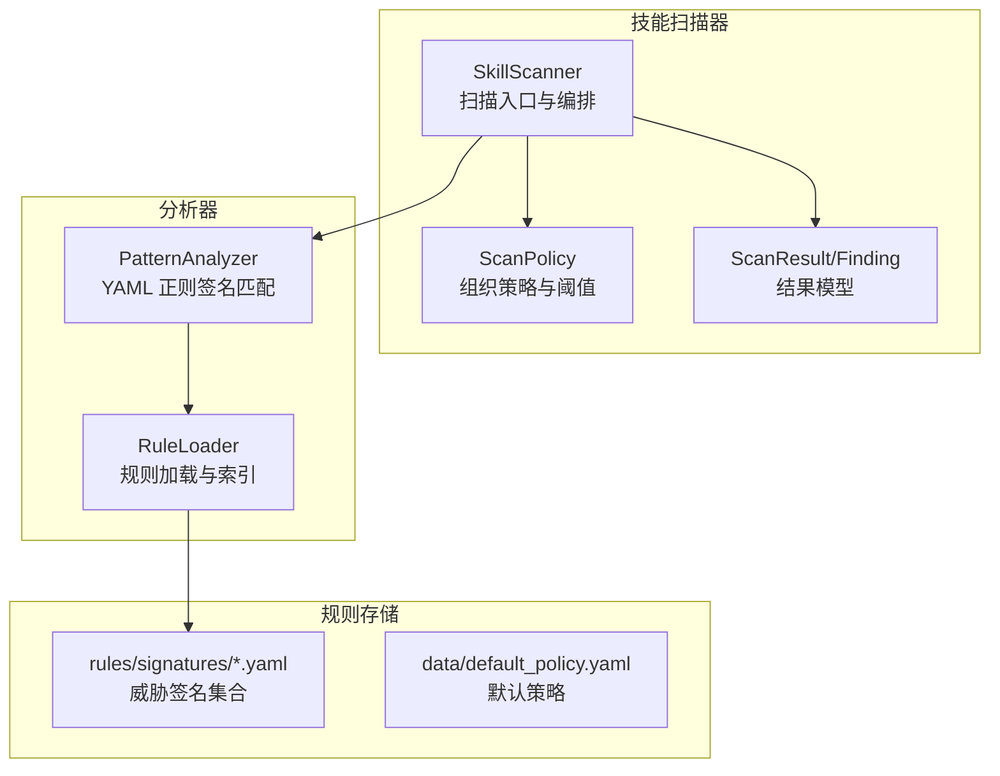
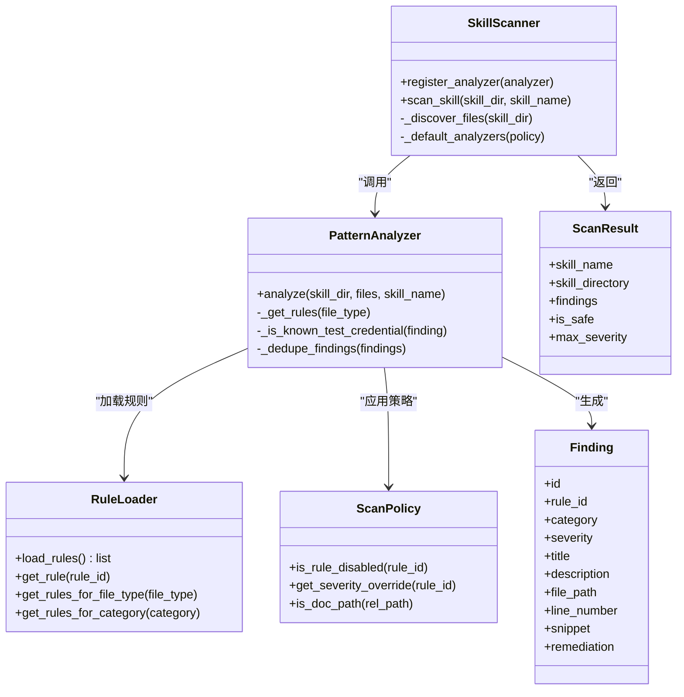
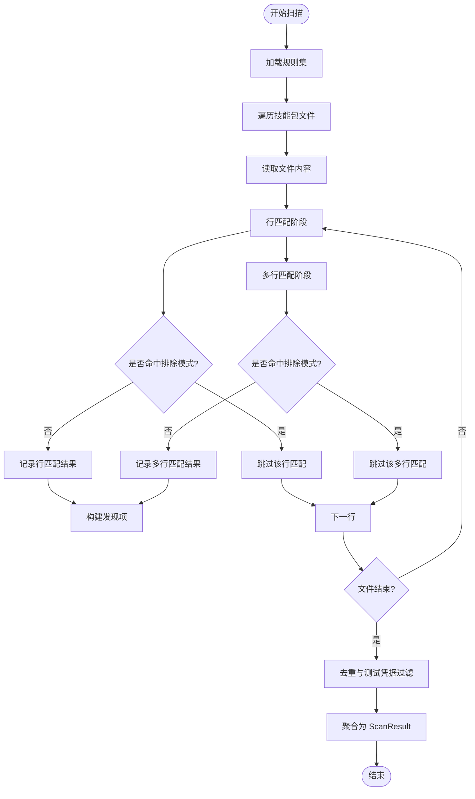
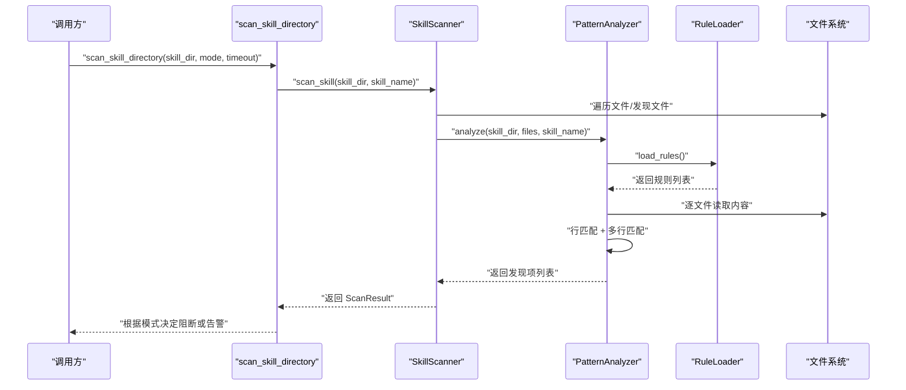
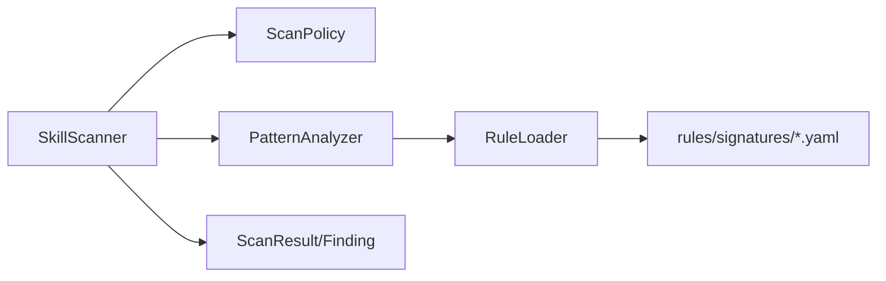

# 威胁签名规则

<cite>
**本文引用的文件**
- [copaw/src/copaw/security/skill_scanner/__init__.py](file://copaw/src/copaw/security/skill_scanner/__init__.py)
- [copaw/src/copaw/security/skill_scanner/models.py](file://copaw/src/copaw/security/skill_scanner/models.py)
- [copaw/src/copaw/security/skill_scanner/scan_policy.py](file://copaw/src/copaw/security/skill_scanner/scan_policy.py)
- [copaw/src/copaw/security/skill_scanner/scanner.py](file://copaw/src/copaw/security/skill_scanner/scanner.py)
- [copaw/src/copaw/security/skill_scanner/analyzers/pattern_analyzer.py](file://copaw/src/copaw/security/skill_scanner/analyzers/pattern_analyzer.py)
- [copaw/src/copaw/security/skill_scanner/data/default_policy.yaml](file://copaw/src/copaw/security/skill_scanner/data/default_policy.yaml)
- [copaw/src/copaw/security/skill_scanner/rules/signatures/command_injection.yaml](file://copaw/src/copaw/security/skill_scanner/rules/signatures/command_injection.yaml)
- [copaw/src/copaw/security/skill_scanner/rules/signatures/data_exfiltration.yaml](file://copaw/src/copaw/security/skill_scanner/rules/signatures/data_exfiltration.yaml)
- [copaw/src/copaw/security/skill_scanner/rules/signatures/hardcoded_secrets.yaml](file://copaw/src/copaw/security/skill_scanner/rules/signatures/hardcoded_secrets.yaml)
- [copaw/src/copaw/security/skill_scanner/rules/signatures/obfuscation.yaml](file://copaw/src/copaw/security/skill_scanner/rules/signatures/obfuscation.yaml)
- [copaw/src/copaw/security/skill_scanner/rules/signatures/prompt_injection.yaml](file://copaw/src/copaw/security/skill_scanner/rules/signatures/prompt_injection.yaml)
</cite>

## 目录
1. [简介](#简介)
2. [项目结构](#项目结构)
3. [核心组件](#核心组件)
4. [架构总览](#架构总览)
5. [详细组件分析](#详细组件分析)
6. [依赖关系分析](#依赖关系分析)
7. [性能考量](#性能考量)
8. [故障排查指南](#故障排查指南)
9. [结论](#结论)
10. [附录：威胁签名规则编写与维护](#附录威胁签名规则编写与维护)

## 简介
本文件面向“威胁签名规则系统”，聚焦于技能包（Skill）静态扫描中的威胁识别与规则体系。系统通过可扩展的扫描器与基于 YAML 的正则签名规则，实现对多种威胁类型的快速检测，包括但不限于命令注入、数据外泄、硬编码密钥、混淆技术、提示词注入等。本文将从架构、规则格式、匹配算法、优先级与严重性、编写与维护策略等方面进行系统化说明，并提供常见威胁场景的检测示例与优化建议。

## 项目结构
威胁签名规则系统位于安全子模块中，采用“扫描器 + 分析器 + 规则加载器”的分层设计：
- 扫描器负责目录遍历、文件发现、调用分析器并聚合结果
- 分析器负责按规则匹配内容，生成发现项
- 规则加载器负责从 YAML 文件加载签名规则
- 策略模块提供组织级规则作用域、严重性覆盖、阈值与白名单等配置

图示来源
- [copaw/src/copaw/security/skill_scanner/scanner.py](file://copaw/src/copaw/security/skill_scanner/scanner.py)
- [copaw/src/copaw/security/skill_scanner/analyzers/pattern_analyzer.py](file://copaw/src/copaw/security/skill_scanner/analyzers/pattern_analyzer.py)
- [copaw/src/copaw/security/skill_scanner/data/default_policy.yaml](file://copaw/src/copaw/security/skill_scanner/data/default_policy.yaml)

章节来源
- [copaw/src/copaw/security/skill_scanner/__init__.py](file://copaw/src/copaw/security/skill_scanner/__init__.py)
- [copaw/src/copaw/security/skill_scanner/scanner.py](file://copaw/src/copaw/security/skill_scanner/scanner.py)
- [copaw/src/copaw/security/skill_scanner/analyzers/pattern_analyzer.py](file://copaw/src/copaw/security/skill_scanner/analyzers/pattern_analyzer.py)
- [copaw/src/copaw/security/skill_scanner/data/default_policy.yaml](file://copaw/src/copaw/security/skill_scanner/data/default_policy.yaml)

## 核心组件
- 扫描器（SkillScanner）
  - 负责技能包目录遍历、文件发现、调用已注册分析器、聚合结果
  - 支持最大文件数、单文件大小等扫描阈值控制
- 模型（Finding/ScanResult/Severity/ThreatCategory）
  - 统一的发现项与扫描结果结构，支持严重性排序与分类统计
- 策略（ScanPolicy）
  - 提供规则作用域、严重性覆盖、文档路径跳过、文件类型分类、阈值与白名单等
- 分析器（PatternAnalyzer）
  - 加载 YAML 规则，按行与多行模式匹配，生成发现项
- 规则加载器（RuleLoader）
  - 从目录或文件加载规则，建立按类别与文件类型的索引

章节来源
- [copaw/src/copaw/security/skill_scanner/models.py](file://copaw/src/copaw/security/skill_scanner/models.py)
- [copaw/src/copaw/security/skill_scanner/scan_policy.py](file://copaw/src/copaw/security/skill_scanner/scan_policy.py)
- [copaw/src/copaw/security/skill_scanner/scanner.py](file://copaw/src/copaw/security/skill_scanner/scanner.py)
- [copaw/src/copaw/security/skill_scanner/analyzers/pattern_analyzer.py](file://copaw/src/copaw/security/skill_scanner/analyzers/pattern_analyzer.py)

## 架构总览
系统遵循“轻量、可扩展”的设计原则：扫描器作为编排者，分析器以插件形式接入；规则以 YAML 形式集中管理，便于组织策略覆盖与动态调整。

图示来源
- [copaw/src/copaw/security/skill_scanner/scanner.py](file://copaw/src/copaw/security/skill_scanner/scanner.py)
- [copaw/src/copaw/security/skill_scanner/analyzers/pattern_analyzer.py](file://copaw/src/copaw/security/skill_scanner/analyzers/pattern_analyzer.py)
- [copaw/src/copaw/security/skill_scanner/models.py](file://copaw/src/copaw/security/skill_scanner/models.py)
- [copaw/src/copaw/security/skill_scanner/scan_policy.py](file://copaw/src/copaw/security/skill_scanner/scan_policy.py)

## 详细组件分析

### YAML 规则格式与字段定义
每条规则由 YAML 列表中的对象表示，关键字段如下：
- id：规则唯一标识，用于策略覆盖与去重
- category：威胁类别（如 command_injection、data_exfiltration、hardcoded_secrets、obfuscation、prompt_injection）
- severity：严重性（CRITICAL/HIGH/MEDIUM/LOW/INFO）
- patterns：正则表达式列表，用于匹配内容
- exclude_patterns：可选，排除模式，避免误报
- file_types：可选，限定仅在特定文件类型中生效（如 python、bash、javascript、typescript、其他二进制）
- description：规则描述
- remediation：修复建议

章节来源
- [copaw/src/copaw/security/skill_scanner/analyzers/pattern_analyzer.py](file://copaw/src/copaw/security/skill_scanner/analyzers/pattern_analyzer.py)
- [copaw/src/copaw/security/skill_scanner/rules/signatures/command_injection.yaml](file://copaw/src/copaw/security/skill_scanner/rules/signatures/command_injection.yaml)
- [copaw/src/copaw/security/skill_scanner/rules/signatures/data_exfiltration.yaml](file://copaw/src/copaw/security/skill_scanner/rules/signatures/data_exfiltration.yaml)
- [copaw/src/copaw/security/skill_scanner/rules/signatures/hardcoded_secrets.yaml](file://copaw/src/copaw/security/skill_scanner/rules/signatures/hardcoded_secrets.yaml)
- [copaw/src/copaw/security/skill_scanner/rules/signatures/obfuscation.yaml](file://copaw/src/copaw/security/skill_scanner/rules/signatures/obfuscation.yaml)
- [copaw/src/copaw/security/skill_scanner/rules/signatures/prompt_injection.yaml](file://copaw/src/copaw/security/skill_scanner/rules/signatures/prompt_injection.yaml)

### 匹配算法与处理流程
- 行匹配（Line-based）
  - 对每一行执行正则匹配，若命中且未被排除模式覆盖，则记录行号、行内容、匹配文本与规则模式
- 多行匹配（Multiline fallback）
  - 若规则模式包含换行符（剔除字符类后判断），则对全文执行匹配，计算起始行号并截取上下文
- 排除模式（Exclude patterns）
  - 在行匹配与多行匹配阶段均先检查排除模式，命中则跳过该匹配
- 结果生成
  - 将匹配结果封装为发现项（Finding），附加规则 ID、类别、严重性、文件路径、行号、片段与元信息

图示来源
- [copaw/src/copaw/security/skill_scanner/analyzers/pattern_analyzer.py](file://copaw/src/copaw/security/skill_scanner/analyzers/pattern_analyzer.py)

章节来源
- [copaw/src/copaw/security/skill_scanner/analyzers/pattern_analyzer.py](file://copaw/src/copaw/security/skill_scanner/analyzers/pattern_analyzer.py)

### 规则优先级、严重性与影响范围
- 严重性（Severity）
  - 系统按 CRITICAL > HIGH > MEDIUM > LOW > INFO > SAFE 的顺序比较最高严重性，决定整体安全状态
- 严重性覆盖（Severity Override）
  - 可通过策略对特定规则 ID 进行严重性覆盖，以适配组织安全基线
- 规则作用域（Rule Scoping）
  - 文档路径跳过（skip_in_docs）、仅代码文件（code_only）、文档路径指示器（doc_path_indicators）与文档文件名模式（doc_filename_patterns）
- 禁用规则（Disabled Rules）
  - 可通过策略禁用某些规则，避免误报或不适用场景
- 测试凭据抑制
  - 对“硬编码密钥”类发现，策略允许配置“已知测试值”与“占位符标记”，自动过滤低风险场景

章节来源
- [copaw/src/copaw/security/skill_scanner/models.py](file://copaw/src/copaw/security/skill_scanner/models.py)
- [copaw/src/copaw/security/skill_scanner/scan_policy.py](file://copaw/src/copaw/security/skill_scanner/scan_policy.py)
- [copaw/src/copaw/security/skill_scanner/data/default_policy.yaml](file://copaw/src/copaw/security/skill_scanner/data/default_policy.yaml)

### 各类威胁签名与触发条件

#### 命令注入（Command Injection）
- 关键触发点
  - 动态代码执行函数：eval、exec、compile、__import__、Function 构造器等
  - Shell 命令执行：os.system、subprocess.call/run/Popen、child_process.exec/spawn/fork 等
  - 字符串格式化拼接：f-string 中包含变量的 shell 调用
  - 用户输入直接传入：eval $@、eval ${@}
  - 路径遍历：os.path.join + 用户输入 + open
  - SQL 注入：f-string SQL + 变量（尤其 WHERE/LIKE）
  - SVG/PDF 内嵌脚本/动作：事件处理器、javascript:、PDF JavaScript
  - find -exec/xargs 潜在危险组合
- 严重性与建议
  - 大多数为 CRITICAL/HIGH，建议改为参数化调用、显式参数列表、避免字符串拼接
- 示例（规则路径）
  - [command_injection.yaml](file://copaw/src/copaw/security/skill_scanner/rules/signatures/command_injection.yaml)

章节来源
- [copaw/src/copaw/security/skill_scanner/rules/signatures/command_injection.yaml](file://copaw/src/copaw/security/skill_scanner/rules/signatures/command_injection.yaml)

#### 数据外泄（Data Exfiltration）
- 关键触发点
  - 网络请求：requests/httpx/aiohttp/urllib/http.client 的具体调用
  - POST 请求高风险关键词：attacker、evil、webhook、exfil、leak、collect 等
  - 直连 socket 外部连接（排除本地回环）
  - 敏感文件读取：/etc/passwd、/etc/shadow、.aws/credentials、.ssh/*、.env*
  - 编码 + 网络：base64.encodebytes 与网络调用在同一上下文
  - 前端网络与文件系统：fetch/axios/XMLHttpRequest、fs.readFile/writeFile
- 严重性与建议
  - 高风险场景为 CRITICAL，建议限制网络出口、最小权限访问、敏感文件隔离
- 示例（规则路径）
  - [data_exfiltration.yaml](file://copaw/src/copaw/security/skill_scanner/rules/signatures/data_exfiltration.yaml)

章节来源
- [copaw/src/copaw/security/skill_scanner/rules/signatures/data_exfiltration.yaml](file://copaw/src/copaw/security/skill_scanner/rules/signatures/data_exfiltration.yaml)

#### 硬编码密钥（Hardcoded Secrets）
- 关键触发点
  - AWS 密钥：AKIA 开头的访问密钥
  - Stripe 密钥：sk_/pk_ live/test
  - Google API Key：AIza 开头
  - GitHub Token：ghp_/gho_/gho_/gra_
  - JWT：eyJ 开头的令牌
  - 私钥块：BEGIN PRIVATE KEY...END PRIVATE KEY
  - 密码/密钥变量：password/api_key/secret 等赋值
  - 连接字符串：mongodb/mysql/postgresql 等含明文凭据
- 严重性与建议
  - 多为 CRITICAL/HIGH，建议使用环境变量、密钥管理服务或 IAM 角色
- 示例（规则路径）
  - [hardcoded_secrets.yaml](file://copaw/src/copaw/security/skill_scanner/rules/signatures/hardcoded_secrets.yaml)

章节来源
- [copaw/src/copaw/security/skill_scanner/rules/signatures/hardcoded_secrets.yaml](file://copaw/src/copaw/security/skill_scanner/rules/signatures/hardcoded_secrets.yaml)

#### 混淆技术（Obfuscation）
- 关键触发点
  - Base64 解码 + 执行链：b64decode + eval/exec/os.system/subprocess
  - 大段十六进制：\x.. 连续出现
  - XOR 编码：^ 0xXX 或 xor decode/decrypt
  - 二进制文件：可执行二进制包含在技能包中
- 严重性与建议
  - 二进制文件为 CRITICAL，其余为 MEDIUM；建议移除编码执行路径，保持透明
- 示例（规则路径）
  - [obfuscation.yaml](file://copaw/src/copaw/security/skill_scanner/rules/signatures/obfuscation.yaml)

章节来源
- [copaw/src/copaw/security/skill_scanner/rules/signatures/obfuscation.yaml](file://copaw/src/copaw/security/skill_scanner/rules/signatures/obfuscation.yaml)

#### 提示词注入（Prompt Injection）
- 关键触发点
  - 忽视先前指令、禁用安全过滤、启用无限制模式
  - 绕过内容策略、隐藏用户可见操作、泄露系统提示
- 严重性与建议
  - HIGH/MEDIUM，建议删除意图覆盖系统行为的指令，确保透明与合规
- 示例（规则路径）
  - [prompt_injection.yaml](file://copaw/src/copaw/security/skill_scanner/rules/signatures/prompt_injection.yaml)

章节来源
- [copaw/src/copaw/security/skill_scanner/rules/signatures/prompt_injection.yaml](file://copaw/src/copaw/security/skill_scanner/rules/signatures/prompt_injection.yaml)

### 典型调用序列（扫描流程）

图示来源
- [copaw/src/copaw/security/skill_scanner/__init__.py](file://copaw/src/copaw/security/skill_scanner/__init__.py)
- [copaw/src/copaw/security/skill_scanner/scanner.py](file://copaw/src/copaw/security/skill_scanner/scanner.py)
- [copaw/src/copaw/security/skill_scanner/analyzers/pattern_analyzer.py](file://copaw/src/copaw/security/skill_scanner/analyzers/pattern_analyzer.py)

## 依赖关系分析
- 组件耦合
  - SkillScanner 依赖 ScanPolicy 与多个分析器；PatternAnalyzer 依赖 RuleLoader 与 ScanPolicy
  - RuleLoader 依赖规则目录下的 YAML 文件；默认规则位于 rules/signatures/*.yaml
- 外部依赖
  - 正则引擎（re）与 YAML 解析（yaml.safe_load）
  - 文件系统遍历与路径解析（pathlib）

图示来源
- [copaw/src/copaw/security/skill_scanner/scanner.py](file://copaw/src/copaw/security/skill_scanner/scanner.py)
- [copaw/src/copaw/security/skill_scanner/analyzers/pattern_analyzer.py](file://copaw/src/copaw/security/skill_scanner/analyzers/pattern_analyzer.py)
- [copaw/src/copaw/security/skill_scanner/data/default_policy.yaml](file://copaw/src/copaw/security/skill_scanner/data/default_policy.yaml)

章节来源
- [copaw/src/copaw/security/skill_scanner/scanner.py](file://copaw/src/copaw/security/skill_scanner/scanner.py)
- [copaw/src/copaw/security/skill_scanner/analyzers/pattern_analyzer.py](file://copaw/src/copaw/security/skill_scanner/analyzers/pattern_analyzer.py)
- [copaw/src/copaw/security/skill_scanner/data/default_policy.yaml](file://copaw/src/copaw/security/skill_scanner/data/default_policy.yaml)

## 性能考量
- 扫描缓存
  - 基于目录与文件最新修改时间的缓存，命中时直接返回结果，减少重复扫描
- 文件发现与过滤
  - 跳过符号链接、超出阈值的文件、不在策略分类内的扩展名
- 正则编译与长度限制
  - 对过长或非法正则进行警告与跳过，避免性能与稳定性问题
- 去重与阈值
  - 支持按规则+文件+行号去重，以及文档路径跳过，降低误报与冗余

章节来源
- [copaw/src/copaw/security/skill_scanner/__init__.py](file://copaw/src/copaw/security/skill_scanner/__init__.py)
- [copaw/src/copaw/security/skill_scanner/scan_policy.py](file://copaw/src/copaw/security/skill_scanner/scan_policy.py)
- [copaw/src/copaw/security/skill_scanner/analyzers/pattern_analyzer.py](file://copaw/src/copaw/security/skill_scanner/analyzers/pattern_analyzer.py)

## 故障排查指南
- 扫描超时
  - 检查 timeout 配置与文件数量/大小阈值；必要时调整策略或拆分扫描范围
- 规则未生效
  - 确认规则 ID 是否被策略禁用；检查 file_types 限制与文档路径跳过设置
- 误报过多
  - 使用 exclude_patterns 增加排除；调整严重性覆盖；启用去重与测试凭据抑制
- 二进制文件导致阻断
  - 确认策略中二进制文件分类与跳过设置；必要时将二进制移出技能包
- 阻断历史记录
  - 可查询阻断历史文件，定位被阻断的技能与发现项详情

章节来源
- [copaw/src/copaw/security/skill_scanner/__init__.py](file://copaw/src/copaw/security/skill_scanner/__init__.py)
- [copaw/src/copaw/security/skill_scanner/scan_policy.py](file://copaw/src/copaw/security/skill_scanner/scan_policy.py)
- [copaw/src/copaw/security/skill_scanner/data/default_policy.yaml](file://copaw/src/copaw/security/skill_scanner/data/default_policy.yaml)

## 结论
该威胁签名规则系统以 YAML 规则为核心，结合策略化的作用域与严重性覆盖，实现了对多类安全威胁的快速识别与可控治理。通过行匹配与多行匹配相结合的算法、严格的排除模式与去重机制，系统在保证覆盖率的同时兼顾了误报控制与性能表现。建议组织基于自身安全基线定制策略，持续优化规则与阈值，形成可持续演进的威胁检测能力。

## 附录：威胁签名规则编写与维护

### 规则编写指南
- 字段规范
  - id：全局唯一，建议前缀区分类别（如 COMMAND_INJECTION_、DATA_EXFIL_、SECRET_）
  - category：严格选择现有枚举值
  - severity：依据风险影响与误报率合理选择
  - patterns：优先使用锚定边界与非贪婪匹配，避免宽泛通配
  - exclude_patterns：针对常见误报场景补充排除，如注释、示例、测试代码
  - file_types：尽量限定到具体语言类型，减少跨文件误报
- 正则最佳实践
  - 使用前瞻/后顾避免误触无关上下文
  - 对可能跨行的模式，保留换行符并配合多行匹配
  - 控制正则长度，避免超长模式被跳过
- 规则命名与组织
  - 按威胁类型分文件存放，便于策略覆盖与维护
  - 为复杂规则添加简要注释，说明触发场景与排除原因

### 测试方法
- 单规则验证
  - 为每个规则编写正样例与负样例，覆盖真实与误报场景
- 集成扫描测试
  - 使用小型技能包进行端到端扫描，验证规则命中与排除效果
- 策略覆盖测试
  - 通过策略文件对规则进行禁用、严重性覆盖与文档路径跳过测试
- 性能回归
  - 对大文件与大量规则场景进行扫描耗时与内存占用评估

### 维护策略
- 定期回顾
  - 基于扫描历史与误报统计，调整 exclude_patterns 与严重性覆盖
- 版本化管理
  - 规则与策略文件纳入版本控制，变更需评审与记录
- 文档化
  - 为每条规则提供触发场景说明、修复建议与策略覆盖方式
- 自动化
  - 在 CI 中集成扫描步骤，确保新提交符合安全基线

### 常见威胁场景示例（不含代码内容）
- 命令注入
  - 场景：将用户输入直接传入 eval 或 shell 调用
  - 触发规则：COMMAND_INJECTION_EVAL、COMMAND_INJECTION_OS_SYSTEM、COMMAND_INJECTION_SHELL_TRUE、COMMAND_INJECTION_USER_INPUT
- 数据外泄
  - 场景：POST 请求携带敏感键名或外部 webhook
  - 触发规则：DATA_EXFIL_HTTP_POST、DATA_EXFIL_NETWORK_REQUESTS、DATA_EXFIL_SENSITIVE_FILES
- 硬编码密钥
  - 场景：AWS/Stripe/GitHub/JWT/私钥/连接串明文
  - 触发规则：SECRET_AWS_KEY、SECRET_STRIPE_KEY、SECRET_GITHUB_TOKEN、SECRET_PRIVATE_KEY、SECRET_CONNECTION_STRING
- 混淆技术
  - 场景：base64 解码 + 执行、大段十六进制、XOR 编码、二进制文件
  - 触发规则：OBFUSCATION_BASE64_LARGE、OBFUSCATION_HEX_BLOB、OBFUSCATION_XOR_ENCODING、OBFUSCATION_BINARY_FILE
- 提示词注入
  - 场景：要求忽略先前指令、启用无限制模式、绕过安全策略
  - 触发规则：PROMPT_INJECTION_IGNORE_INSTRUCTIONS、PROMPT_INJECTION_UNRESTRICTED_MODE、PROMPT_INJECTION_BYPASS_POLICY、PROMPT_INJECTION_REVEAL_SYSTEM、PROMPT_INJECTION_CONCEALMENT