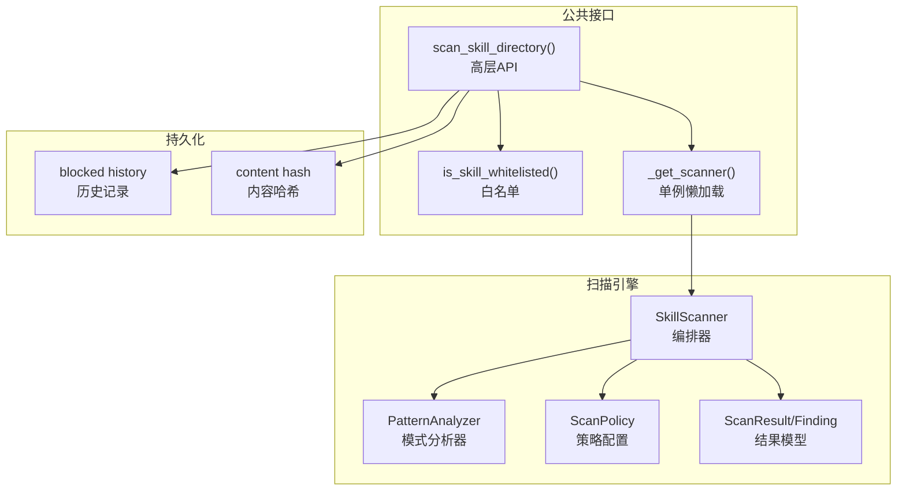
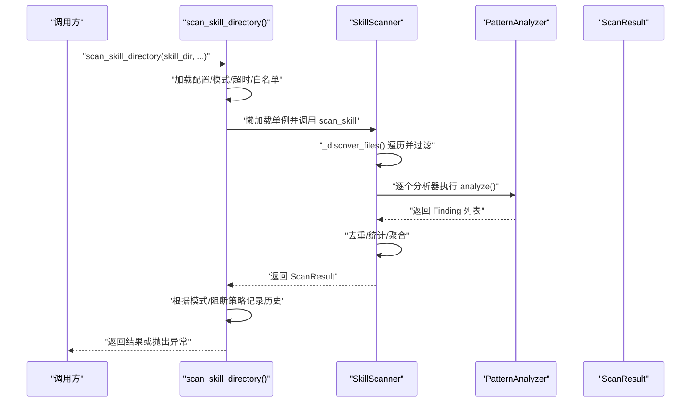
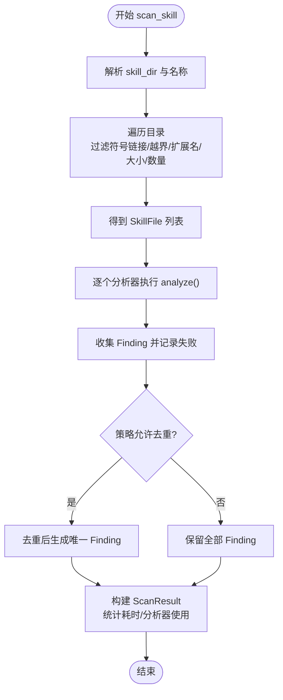
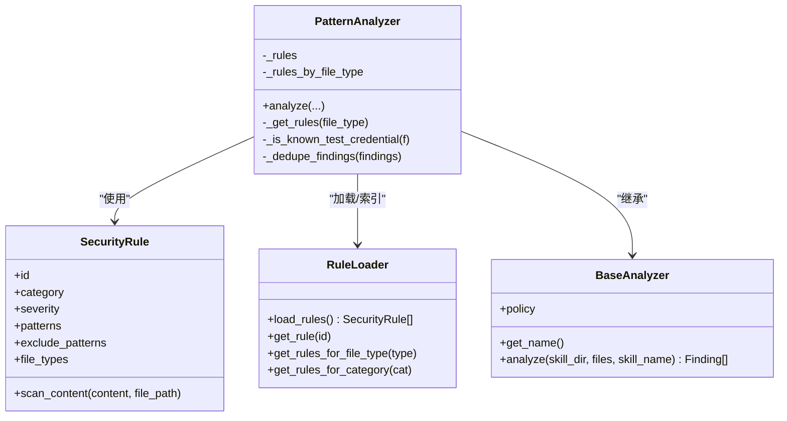
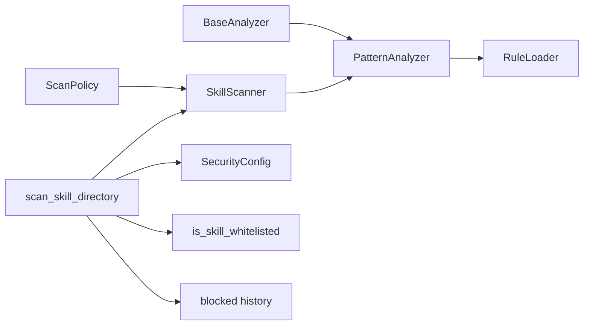

# 扫描引擎核心

<cite>
**本文引用的文件**
- [scanner.py](file://copaw/src/copaw/security/skill_scanner/scanner.py)
- [models.py](file://copaw/src/copaw/security/skill_scanner/models.py)
- [scan_policy.py](file://copaw/src/copaw/security/skill_scanner/scan_policy.py)
- [__init__.py](file://copaw/src/copaw/security/skill_scanner/__init__.py)
- [pattern_analyzer.py](file://copaw/src/copaw/security/skill_scanner/analyzers/pattern_analyzer.py)
- [__init__.py](file://copaw/src/copaw/security/skill_scanner/analyzers/__init__.py)
- [default_policy.yaml](file://copaw/src/copaw/security/skill_scanner/data/default_policy.yaml)
- [config.py](file://copaw/src/copaw/config/config.py)
- [command_injection.yaml](file://copaw/src/copaw/security/skill_scanner/rules/signatures/command_injection.yaml)
- [hardcoded_secrets.yaml](file://copaw/src/copaw/security/skill_scanner/rules/signatures/hardcoded_secrets.yaml)
</cite>

## 目录
1. [简介](#简介)
2. [项目结构](#项目结构)
3. [核心组件](#核心组件)
4. [架构总览](#架构总览)
5. [详细组件分析](#详细组件分析)
6. [依赖分析](#依赖分析)
7. [性能考虑](#性能考虑)
8. [故障排查指南](#故障排查指南)
9. [结论](#结论)
10. [附录](#附录)

## 简介
本文件面向扫描引擎核心组件，聚焦 SkillScanner 类的实现原理与工作流程，涵盖文件发现机制、分析器协调、结果聚合、扫描参数配置、结果数据结构与状态判断、性能优化策略、内存管理与异常处理，以及使用示例、配置选项与调试方法。目标是帮助读者在不深入源码的前提下，理解并高效使用扫描引擎。

## 项目结构
扫描引擎位于安全子系统中，采用“编排器 + 分析器插件”的轻量架构：
- 编排器：SkillScanner 负责文件发现、参数解析、分析器调度、结果聚合与缓存。
- 分析器：PatternAnalyzer 基于 YAML 规则进行正则匹配；接口 BaseAnalyzer 支持未来扩展其他分析器。
- 策略层：ScanPolicy 提供组织级规则范围、阈值、分类与覆盖项。
- 结果模型：Finding、ScanResult、枚举 Severity、ThreatCategory 统一输出格式。
- 公共入口：__init__.py 暴露 scan_skill_directory 等高层 API，并提供缓存、白名单、历史记录等辅助能力。

图表来源
- [scanner.py:76-319](file://copaw/src/copaw/security/skill_scanner/scanner.py#L76-L319)
- [pattern_analyzer.py:236-393](file://copaw/src/copaw/security/skill_scanner/analyzers/pattern_analyzer.py#L236-L393)
- [scan_policy.py:156-476](file://copaw/src/copaw/security/skill_scanner/scan_policy.py#L156-L476)
- [__init__.py:415-505](file://copaw/src/copaw/security/skill_scanner/__init__.py#L415-L505)

章节来源
- [scanner.py:1-319](file://copaw/src/copaw/security/skill_scanner/scanner.py#L1-L319)
- [__init__.py:1-505](file://copaw/src/copaw/security/skill_scanner/__init__.py#L1-L505)

## 核心组件
- SkillScanner：扫描编排器，负责文件发现、参数解析、分析器执行、结果聚合与缓存。
- PatternAnalyzer：基于 YAML 规则的正则签名匹配分析器，支持行内与跨行模式。
- ScanPolicy：组织级策略，控制规则范围、阈值、分类、覆盖与禁用规则。
- 结果模型：Finding、ScanResult、Severity、ThreatCategory，统一输出结构与状态判断。
- 公共入口：scan_skill_directory 提供阻断/告警模式、超时控制、缓存与白名单集成。

章节来源
- [scanner.py:76-319](file://copaw/src/copaw/security/skill_scanner/scanner.py#L76-L319)
- [pattern_analyzer.py:236-393](file://copaw/src/copaw/security/skill_scanner/analyzers/pattern_analyzer.py#L236-L393)
- [scan_policy.py:156-476](file://copaw/src/copaw/security/skill_scanner/scan_policy.py#L156-L476)
- [models.py:19-235](file://copaw/src/copaw/security/skill_scanner/models.py#L19-L235)
- [__init__.py:415-505](file://copaw/src/copaw/security/skill_scanner/__init__.py#L415-L505)

## 架构总览
SkillScanner 的工作流由“文件发现 → 分析器执行 → 结果聚合 → 状态判断 → 缓存/持久化”构成。默认启用 PatternAnalyzer，可按需注册更多分析器。策略 ScanPolicy 决定文件分类、规则范围、阈值与覆盖。

图表来源
- [__init__.py:415-505](file://copaw/src/copaw/security/skill_scanner/__init__.py#L415-L505)
- [scanner.py:148-242](file://copaw/src/copaw/security/skill_scanner/scanner.py#L148-L242)
- [pattern_analyzer.py:265-347](file://copaw/src/copaw/security/skill_scanner/analyzers/pattern_analyzer.py#L265-L347)

## 详细组件分析

### SkillScanner 类
- 文件发现：递归遍历技能目录，过滤符号链接、越界路径、跳过扩展名、大小限制与数量上限，生成 SkillFile 列表。
- 分析器执行：依次调用各分析器的 analyze，收集 Finding 并记录失败分析器。
- 结果聚合：按策略去重、计算最大严重级别、统计分析器使用情况与耗时。
- 参数来源：优先构造函数显式参数，其次策略中的 file_limits，最后硬编码回退值。
- 跳过扩展名：以策略的 inert_extensions/archive_extensions 合集为主，若为空则回落到内置集合，再合并用户自定义集合。

图表来源
- [scanner.py:148-242](file://copaw/src/copaw/security/skill_scanner/scanner.py#L148-L242)
- [scanner.py:248-299](file://copaw/src/copaw/security/skill_scanner/scanner.py#L248-L299)

章节来源
- [scanner.py:76-319](file://copaw/src/copaw/security/skill_scanner/scanner.py#L76-L319)

### PatternAnalyzer 类
- 规则加载：从默认 signatures 目录或指定路径加载 YAML 规则，按类别与文件类型索引。
- 匹配策略：先按行匹配，再对含换行的模式进行全文匹配，支持排除模式。
- 结果生成：将匹配转换为 Finding，应用策略覆盖的严重级别与去重。
- 凭证过滤：对“硬编码凭据”类威胁，依据策略中的测试值与占位符进行抑制。

图表来源
- [pattern_analyzer.py:236-393](file://copaw/src/copaw/security/skill_scanner/analyzers/pattern_analyzer.py#L236-L393)
- [__init__.py:21-90](file://copaw/src/copaw/security/skill_scanner/analyzers/__init__.py#L21-L90)

章节来源
- [pattern_analyzer.py:236-393](file://copaw/src/copaw/security/skill_scanner/analyzers/pattern_analyzer.py#L236-L393)

### ScanPolicy 与默认策略
- 策略结构：隐藏文件、规则范围、凭证、文件分类、文件阈值、分析阈值、严重级别覆盖、禁用规则。
- 默认策略：内置 default_policy.yaml，提供常见扩展分类、文档路径指示、规则范围与阈值。
- 动态加载：支持 from_yaml 合并默认策略，to_yaml 导出策略以便编辑。

章节来源
- [scan_policy.py:156-476](file://copaw/src/copaw/security/skill_scanner/scan_policy.py#L156-L476)
- [default_policy.yaml:1-243](file://copaw/src/copaw/security/skill_scanner/data/default_policy.yaml#L1-L243)

### 结果数据结构与状态判断
- Finding：统一字段（id、rule_id、category、severity、title、description、file_path、line_number、snippet、remediation、analyzer、metadata），支持 to_dict。
- ScanResult：包含 findings、is_safe、max_severity、耗时、分析器使用/失败列表、时间戳等；提供按严重级别与威胁类别筛选。
- is_safe：当不存在 CRITICAL 或 HIGH 时为真；max_severity 按 CRITICAL→HIGH→MEDIUM→LOW→INFO→SAFE 排序取最高者。

章节来源
- [models.py:19-235](file://copaw/src/copaw/security/skill_scanner/models.py#L19-L235)

### 公共入口与辅助能力
- scan_skill_directory：高层 API，负责模式选择、超时、白名单、缓存命中、阻断/告警与历史记录。
- 白名单：按技能名与内容哈希匹配，支持空哈希表示任意内容通过。
- 历史记录：记录被阻断/警告的扫描结果，带 UTC 时间戳与取证信息。
- 单例懒加载：内部使用线程锁保证 SkillScanner 单例初始化线程安全。
- 结果缓存：基于目录 mtime 的简单缓存，LRU 控制最大条目。

章节来源
- [__init__.py:415-505](file://copaw/src/copaw/security/skill_scanner/__init__.py#L415-L505)

## 依赖分析
- SkillScanner 依赖 ScanPolicy 与分析器接口 BaseAnalyzer，默认依赖 PatternAnalyzer。
- PatternAnalyzer 依赖 RuleLoader 加载规则，依赖 ScanPolicy 进行规则过滤与覆盖。
- 公共入口依赖配置系统加载 security.skill_scanner 设置，结合白名单与历史记录。

图表来源
- [scanner.py:100-134](file://copaw/src/copaw/security/skill_scanner/scanner.py#L100-L134)
- [pattern_analyzer.py:249-260](file://copaw/src/copaw/security/skill_scanner/analyzers/pattern_analyzer.py#L249-L260)
- [__init__.py:415-505](file://copaw/src/copaw/security/skill_scanner/__init__.py#L415-L505)
- [config.py:1039-1062](file://copaw/src/copaw/config/config.py#L1039-L1062)

章节来源
- [scanner.py:100-134](file://copaw/src/copaw/security/skill_scanner/scanner.py#L100-L134)
- [pattern_analyzer.py:249-260](file://copaw/src/copaw/security/skill_scanner/analyzers/pattern_analyzer.py#L249-L260)
- [__init__.py:415-505](file://copaw/src/copaw/security/skill_scanner/__init__.py#L415-L505)
- [config.py:1039-1062](file://copaw/src/copaw/config/config.py#L1039-L1062)

## 性能考虑
- 文件发现与过滤
  - 使用 rglob 遍历，严格过滤符号链接与越界路径，避免路径穿越风险。
  - 以策略/内置集合快速跳过 inert/archive 扩展名，减少 IO。
  - 以 max_file_size 与 max_files 限制扫描规模，防止大目录导致资源耗尽。
- 正则匹配
  - 行内匹配优先，跨行仅对含换行的模式触发，降低复杂度。
  - 规则按文件类型缓存索引，避免重复计算。
- 结果聚合
  - 去重策略可选，按策略开关决定是否启用。
  - 仅在需要时进行内容读取（SkillFile.read_content），避免不必要的解码。
- 缓存与并发
  - 目录 mtime 缓存避免重复扫描。
  - ThreadPoolExecutor(max_workers=1) 串行执行扫描，避免竞争条件与资源争用。
- 内存管理
  - 逐文件读取内容，避免一次性加载整个目录。
  - 缓存条目上限固定，超出后淘汰最旧条目。
- 异常处理
  - 遍历与读取异常静默跳过，保证扫描鲁棒性。
  - 分析器异常记录并继续执行其他分析器。

章节来源
- [scanner.py:248-299](file://copaw/src/copaw/security/skill_scanner/scanner.py#L248-L299)
- [pattern_analyzer.py:265-347](file://copaw/src/copaw/security/skill_scanner/analyzers/pattern_analyzer.py#L265-L347)
- [__init__.py:347-380](file://copaw/src/copaw/security/skill_scanner/__init__.py#L347-L380)

## 故障排查指南
- 扫描未生效
  - 检查模式：环境变量 COPAW_SKILL_SCAN_MODE 或配置 security.skill_scanner.mode 是否为 off。
  - 检查超时：security.skill_scanner.timeout 是否过短，导致提前返回 None。
  - 检查白名单：is_skill_whitelisted 返回 True 会跳过扫描。
- 阻断与告警
  - 模式为 block 且 ScanResult.is_safe 为 False 时抛出 SkillScanError。
  - 模式为 warn 时记录告警历史，但不阻断。
- 结果为空
  - 可能命中 max_files/max_file_size 或跳过扩展名过多。
  - 检查策略 file_limits 与 file_classification。
- 历史记录
  - 查看 blocked history 文件位置与内容，确认阻断/告警记录。
- 日志
  - 关注扫描日志与分析器错误日志，定位具体失败原因。

章节来源
- [__init__.py:415-505](file://copaw/src/copaw/security/skill_scanner/__init__.py#L415-L505)
- [scanner.py:188-242](file://copaw/src/copaw/security/skill_scanner/scanner.py#L188-L242)

## 结论
SkillScanner 通过清晰的职责分离与策略驱动，实现了可扩展、可配置、可审计的安全扫描能力。PatternAnalyzer 提供高效的规则匹配，ScanPolicy 提供组织级定制，公共入口统一了阻断/告警与缓存/白名单等横切关注点。遵循本文的配置与优化建议，可在保障性能的同时提升扫描的准确性与可维护性。

## 附录

### 扫描参数配置与作用
- 模式（mode）
  - block：发现 CRITICAL/HIGH 时阻断并抛出异常。
  - warn：仅记录告警，不阻断。
  - off：关闭扫描。
- 超时（timeout）
  - 单次扫描最大等待秒数，超时返回 None。
- 白名单（whitelist）
  - 按技能名与内容哈希匹配，支持任意内容通过。
- 文件限制（file_limits）
  - max_file_count：最大扫描文件数。
  - max_file_size_bytes：单文件最大字节数。
- 文件分类（file_classification）
  - inert_extensions/archive_extensions/code_extensions/structured_extensions：决定扫描范围与跳过策略。
- 规则范围（rule_scoping）
  - code_only/skip_in_docs/doc_path_indicators/doc_filename_patterns：控制规则适用范围。
- 严重级别覆盖（severity_overrides）
  - 对特定规则进行严重级别调整。
- 禁用规则（disabled_rules）
  - 显式禁用某些规则。

章节来源
- [__init__.py:95-114](file://copaw/src/copaw/security/skill_scanner/__init__.py#L95-L114)
- [__init__.py:415-505](file://copaw/src/copaw/security/skill_scanner/__init__.py#L415-L505)
- [scan_policy.py:156-476](file://copaw/src/copaw/security/skill_scanner/scan_policy.py#L156-L476)
- [default_policy.yaml:217-243](file://copaw/src/copaw/security/skill_scanner/data/default_policy.yaml#L217-L243)

### 使用示例与调试方法
- 使用示例
  - 直接调用 scan_skill_directory，传入技能目录路径与可选参数（如 skill_name、block、timeout）。
  - 若返回 None：可能是模式为 off、命中白名单、缓存命中或超时。
  - 若抛出 SkillScanError：说明阻断模式下存在 CRITICAL/HIGH 问题。
- 调试方法
  - 提升日志级别，观察扫描日志与分析器错误。
  - 临时将模式设为 warn，导出 ScanResult 详情。
  - 检查 blocked history 文件，核对阻断记录。
  - 通过 ScanPolicy.to_yaml 导出策略，针对性调整规则范围与阈值。

章节来源
- [__init__.py:415-505](file://copaw/src/copaw/security/skill_scanner/__init__.py#L415-L505)
- [config.py:1039-1062](file://copaw/src/copaw/config/config.py#L1039-L1062)