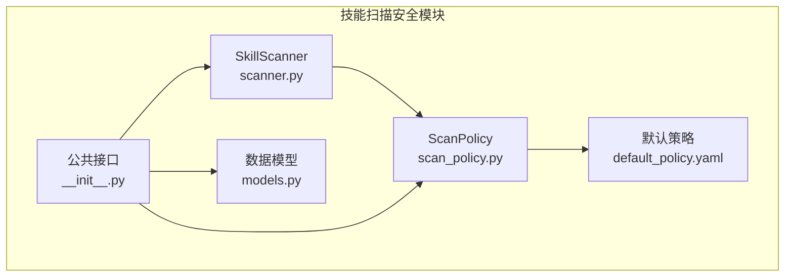
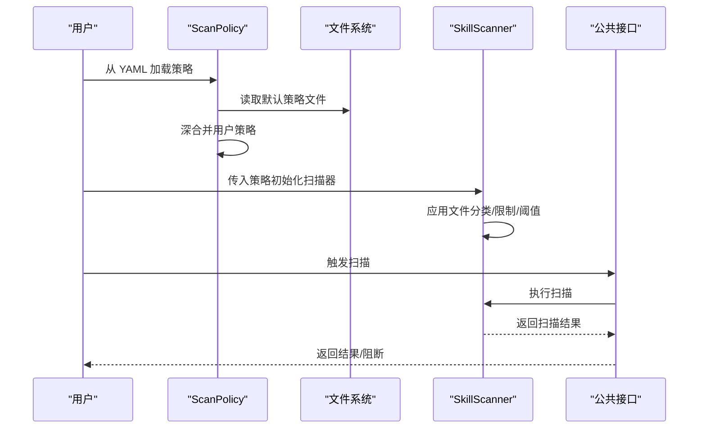
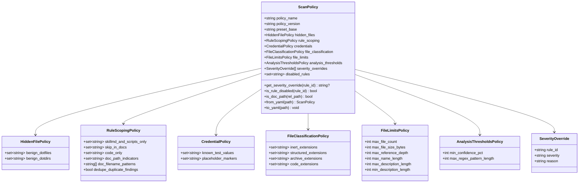
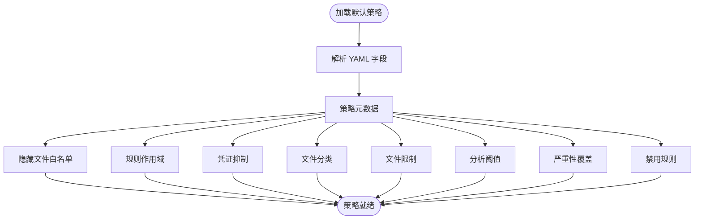
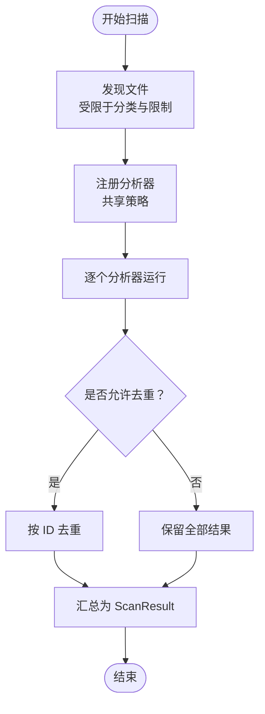
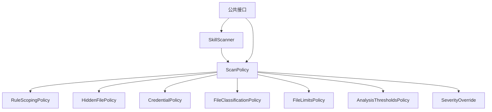

# 扫描策略配置

<cite>
**本文引用的文件**
- [scan_policy.py](file://copaw/src/copaw/security/skill_scanner/scan_policy.py)
- [default_policy.yaml](file://copaw/src/copaw/security/skill_scanner/data/default_policy.yaml)
- [scanner.py](file://copaw/src/copaw/security/skill_scanner/scanner.py)
- [models.py](file://copaw/src/copaw/security/skill_scanner/models.py)
- [__init__.py](file://copaw/src/copaw/security/skill_scanner/__init__.py)
- [安全配置.md](file://specs/copaw-repowiki/content/配置管理/安全配置.md)
- [技能扫描器.md](file://specs/copaw-repowiki/content/安全系统/技能扫描器.md)
- [配置系统架构.md](file://specs/copaw-repowiki/content/配置管理/配置系统架构.md)
- [配置管理API.md](file://specs/copaw-repowiki/content/API参考/REST API/配置管理API.md)
</cite>

## 目录
1. [引言](#引言)
2. [项目结构](#项目结构)
3. [核心组件](#核心组件)
4. [架构总览](#架构总览)
5. [详细组件分析](#详细组件分析)
6. [依赖分析](#依赖分析)
7. [性能考虑](#性能考虑)
8. [故障排查指南](#故障排查指南)
9. [结论](#结论)
10. [附录](#附录)

## 引言
本文件面向扫描策略配置系统，深入解析 ScanPolicy 类的设计架构与策略加载机制，详解默认策略文件的结构与各配置项的作用（文件分类、文件限制、规则作用域、严重性覆盖等），并说明如何自定义策略文件、配置组织结构与优先级规则。文档还涵盖策略继承与覆盖机制、动态配置更新、最佳实践、常见配置示例与故障排除方法。

## 项目结构
扫描策略配置相关的核心代码位于安全子系统下的技能扫描模块，主要文件包括：
- 策略定义与加载：scan_policy.py
- 默认策略文件：data/default_policy.yaml
- 扫描器集成：scanner.py
- 数据模型：models.py
- 公共接口与缓存：__init__.py
- 文档与架构说明：安全配置.md、技能扫描器.md、配置系统架构.md、配置管理API.md

**图表来源**
- [scan_policy.py:1-476](file://copaw/src/copaw/security/skill_scanner/scan_policy.py#L1-L476)
- [default_policy.yaml:1-243](file://copaw/src/copaw/security/skill_scanner/data/default_policy.yaml#L1-L243)
- [scanner.py:1-319](file://copaw/src/copaw/security/skill_scanner/scanner.py#L1-L319)
- [models.py:1-235](file://copaw/src/copaw/security/skill_scanner/models.py#L1-L235)
- [__init__.py:1-505](file://copaw/src/copaw/security/skill_scanner/__init__.py#L1-L505)

**章节来源**
- [scan_policy.py:1-476](file://copaw/src/copaw/security/skill_scanner/scan_policy.py#L1-L476)
- [default_policy.yaml:1-243](file://copaw/src/copaw/security/skill_scanner/data/default_policy.yaml#L1-L243)
- [scanner.py:1-319](file://copaw/src/copaw/security/skill_scanner/scanner.py#L1-L319)
- [models.py:1-235](file://copaw/src/copaw/security/skill_scanner/models.py#L1-L235)
- [__init__.py:1-505](file://copaw/src/copaw/security/skill_scanner/__init__.py#L1-L505)

## 核心组件
- ScanPolicy：组织策略的顶层对象，包含策略元数据与各子策略域，并提供从 YAML 加载、深合并、导出等功能。
- 子策略域：
  - HiddenFilePolicy：受保护的点文件/点目录白名单
  - RuleScopingPolicy：规则作用域（仅在文档/代码文件触发、文档路径排除、去重）
  - CredentialPolicy：测试凭证与占位符自动抑制
  - FileClassificationPolicy：文件扩展分类（惰性/结构化/归档/代码）
  - FileLimitsPolicy：文件数量、大小、名称/描述长度等阈值
  - AnalysisThresholdsPolicy：最小置信度、正则长度上限
  - SeverityOverride：按规则ID覆盖严重性
  - disabled_rules：禁用规则集合
- SkillScanner：扫描器，接收 ScanPolicy 并据此执行文件发现、规则匹配与结果聚合。
- 公共接口：提供懒加载扫描器、缓存、白名单、阻断历史记录等能力。

**章节来源**
- [scan_policy.py:74-178](file://copaw/src/copaw/security/skill_scanner/scan_policy.py#L74-L178)
- [scanner.py:76-138](file://copaw/src/copaw/security/skill_scanner/scanner.py#L76-L138)
- [__init__.py:57-75](file://copaw/src/copaw/security/skill_scanner/__init__.py#L57-L75)

## 架构总览
策略加载与应用的关键流程如下：
- 默认策略从内置 YAML 文件加载
- 用户策略文件与默认策略进行深合并，生成最终策略树
- 扫描器读取策略，驱动文件发现与规则匹配
- 公共接口提供缓存、白名单与阻断历史记录

**图表来源**
- [scan_policy.py:261-282](file://copaw/src/copaw/security/skill_scanner/scan_policy.py#L261-L282)
- [scanner.py:100-134](file://copaw/src/copaw/security/skill_scanner/scanner.py#L100-L134)
- [__init__.py:415-504](file://copaw/src/copaw/security/skill_scanner/__init__.py#L415-L504)

## 详细组件分析

### ScanPolicy 类设计与策略加载机制
- 设计要点
  - 使用 dataclass 组织策略域，类型明确、序列化/反序列化友好
  - 提供默认策略加载、预设策略加载、从 YAML 加载、导出 YAML 等方法
  - 深合并策略：用户策略覆盖默认策略，列表/集合采用覆盖而非累加
- 关键方法
  - default()/from_preset()/from_yaml()：策略加载入口
  - to_yaml()：导出完整策略供编辑
  - get_severity_override()/is_rule_disabled()：查询严重性覆盖与禁用规则
  - is_doc_path()：基于路径指示器与正则判断文档路径
- 深合并实现
  - 递归合并字典，列表/集合以用户策略为准
  - 保证用户只需覆盖变更项，提升可维护性

**图表来源**
- [scan_policy.py:74-178](file://copaw/src/copaw/security/skill_scanner/scan_policy.py#L74-L178)
- [scan_policy.py:236-282](file://copaw/src/copaw/security/skill_scanner/scan_policy.py#L236-L282)

**章节来源**
- [scan_policy.py:74-178](file://copaw/src/copaw/security/skill_scanner/scan_policy.py#L74-L178)
- [scan_policy.py:236-282](file://copaw/src/copaw/security/skill_scanner/scan_policy.py#L236-L282)
- [scan_policy.py:317-334](file://copaw/src/copaw/security/skill_scanner/scan_policy.py#L317-L334)

### 默认策略文件结构与配置项详解
- 策略元数据
  - policy_name/policy_version/preset_base：策略标识与基线
- 受保护的点文件/点目录（hidden_files）
  - benign_dotfiles/benign_dotdirs：白名单集合
- 规则作用域（rule_scoping）
  - skillmd_and_scripts_only/skip_in_docs/code_only：按规则名集合限定触发范围
  - doc_path_indicators/doc_filename_patterns：文档路径/文件名识别
  - dedupe_duplicate_findings：去重开关
- 凭证抑制（credentials）
  - known_test_values/placeholder_markers：测试值与占位符集合
- 文件分类（file_classification）
  - inert_extensions/structured_extensions/archive_extensions/code_extensions：扩展分类集合
- 文件限制（file_limits）
  - max_file_count/max_file_size_bytes/max_reference_depth/max_name_length/max_description_length/min_description_length：数值阈值
- 分析阈值（analysis_thresholds）
  - min_confidence_pct/max_regex_pattern_length：置信度与正则长度上限
- 严重性覆盖（severity_overrides）
  - 规则ID到严重性的映射列表
- 禁用规则（disabled_rules）
  - 规则ID集合

**图表来源**
- [default_policy.yaml:9-243](file://copaw/src/copaw/security/skill_scanner/data/default_policy.yaml#L9-L243)

**章节来源**
- [default_policy.yaml:9-243](file://copaw/src/copaw/security/skill_scanner/data/default_policy.yaml#L9-L243)

### 自定义策略文件、组织结构与优先级规则
- 组织结构
  - 用户策略文件仅需包含要覆盖的字段，未指定字段沿用默认策略
  - 支持预设策略（当前为平衡基线），可基于默认策略进行增量覆盖
- 优先级规则
  - 默认策略（内置）为基线
  - 用户策略文件覆盖默认策略
  - 运行时参数可进一步覆盖策略（例如扫描器构造时传入显式阈值）
- 深合并策略
  - 字典递归合并，列表/集合以用户策略为准，便于窄化/扩展集合
  - 正则模式长度与编译错误有安全防护（超长/非法正则被跳过并记录警告）

**章节来源**
- [scan_policy.py:261-282](file://copaw/src/copaw/security/skill_scanner/scan_policy.py#L261-L282)
- [scan_policy.py:317-334](file://copaw/src/copaw/security/skill_scanner/scan_policy.py#L317-L334)
- [scan_policy.py:49-67](file://copaw/src/copaw/security/skill_scanner/scan_policy.py#L49-L67)

### 策略继承、覆盖机制与动态配置更新
- 策略继承与覆盖
  - 通过深合并实现“默认基线 + 用户覆盖”的策略树
  - 列表/集合覆盖策略简化了集合变更的维护成本
- 动态配置更新
  - 技能扫描器本身不直接监听策略文件变化
  - 公共接口提供扫描缓存（基于目录 mtime）与白名单/阻断历史持久化
  - 配置管理 API 支持运行时更新安全配置（技能扫描器与工具守卫），可配合重启或热重载机制实现动态生效

**章节来源**
- [scan_policy.py:317-334](file://copaw/src/copaw/security/skill_scanner/scan_policy.py#L317-L334)
- [__init__.py:327-380](file://copaw/src/copaw/security/skill_scanner/__init__.py#L327-L380)
- [配置管理API.md:351-392](file://specs/copaw-repowiki/content/API参考/REST API/配置管理API.md#L351-L392)

### 策略在扫描器中的应用
- 文件发现阶段
  - 使用 file_classification 的惰性/归档扩展集合决定跳过文件
  - 使用 file_limits 的阈值限制文件数量与大小
- 规则匹配阶段
  - 使用 rule_scoping 控制规则触发范围与去重
  - 使用 credentials 与 severity_overrides 影响结果呈现
- 结果聚合阶段
  - 依据 models 中的枚举与数据结构输出统一结果

**图表来源**
- [scanner.py:148-242](file://copaw/src/copaw/security/skill_scanner/scanner.py#L148-L242)
- [models.py:129-235](file://copaw/src/copaw/security/skill_scanner/models.py#L129-L235)

**章节来源**
- [scanner.py:100-134](file://copaw/src/copaw/security/skill_scanner/scanner.py#L100-L134)
- [scanner.py:148-242](file://copaw/src/copaw/security/skill_scanner/scanner.py#L148-L242)
- [models.py:19-54](file://copaw/src/copaw/security/skill_scanner/models.py#L19-L54)

### 最佳实践
- 仅覆盖必要字段，保持策略文件简洁
- 使用 doc_path_indicators 与 doc_filename_patterns 精确识别文档路径，避免误报
- 合理设置 analysis_thresholds 的正则长度上限，兼顾性能与安全性
- 通过 severity_overrides 与 disabled_rules 实现精细化规则治理
- 在开发/生产环境采用不同的扫描模式（block/warn/off），并通过环境变量或配置 API 动态切换

**章节来源**
- [安全配置.md:469-483](file://specs/copaw-repowiki/content/配置管理/安全配置.md#L469-L483)
- [__init__.py:95-114](file://copaw/src/copaw/security/skill_scanner/__init__.py#L95-L114)

### 常见配置示例
- 企业合规：提高 min_confidence_pct，启用严格规则集，开启审批流程
- 开发环境：扫描模式 warn，扩大受保护工具集，保留告警日志
- 低风险技能：通过白名单与内容哈希快速放行，减少重复扫描
- 危险命令拦截：在工具守卫中增加拒绝集，如格式化磁盘、反向连接等

**章节来源**
- [安全配置.md:469-483](file://specs/copaw-repowiki/content/配置管理/安全配置.md#L469-L483)

## 依赖分析
- 模块耦合
  - ScanPolicy 与各子策略域解耦，通过 dataclass 组合
  - SkillScanner 依赖 ScanPolicy 的规则与阈值，耦合度适中
  - 公共接口依赖 ScanPolicy 与 SkillScanner，提供缓存与持久化能力
- 外部依赖
  - YAML 解析与正则编译的安全防护
  - 环境变量与配置 API 的运行时注入与更新

**图表来源**
- [scan_policy.py:74-178](file://copaw/src/copaw/security/skill_scanner/scan_policy.py#L74-L178)
- [scanner.py:76-138](file://copaw/src/copaw/security/skill_scanner/scanner.py#L76-L138)
- [__init__.py:57-75](file://copaw/src/copaw/security/skill_scanner/__init__.py#L57-L75)

**章节来源**
- [scan_policy.py:74-178](file://copaw/src/copaw/security/skill_scanner/scan_policy.py#L74-L178)
- [scanner.py:76-138](file://copaw/src/copaw/security/skill_scanner/scanner.py#L76-L138)
- [__init__.py:57-75](file://copaw/src/copaw/security/skill_scanner/__init__.py#L57-L75)

## 性能考虑
- 正则编译与长度限制：防止超长/非法正则导致性能问题
- 缓存机制：基于目录 mtime 的扫描结果缓存，减少重复扫描开销
- 文件发现剪枝：基于扩展分类与大小/数量阈值提前跳过文件
- 去重策略：可选的按 ID 去重，降低重复结果带来的处理成本

**章节来源**
- [scan_policy.py:49-67](file://copaw/src/copaw/security/skill_scanner/scan_policy.py#L49-L67)
- [__init__.py:327-380](file://copaw/src/copaw/security/skill_scanner/__init__.py#L327-L380)
- [scanner.py:248-299](file://copaw/src/copaw/security/skill_scanner/scanner.py#L248-L299)

## 故障排查指南
- 策略加载失败
  - 检查策略文件路径是否存在，确认 YAML 语法正确
  - 查看深合并过程中的字段覆盖情况
- 正则相关问题
  - 超长或非法正则会被跳过并记录警告，检查正则长度与合法性
- 扫描结果异常
  - 检查 file_classification 是否正确覆盖扩展集合
  - 调整 analysis_thresholds 的阈值，特别是正则长度上限
- 动态配置更新
  - 通过配置管理 API 更新安全配置后，结合缓存与白名单策略验证效果
  - 如需立即生效，可清理缓存或重启相关服务

**章节来源**
- [scan_policy.py:261-282](file://copaw/src/copaw/security/skill_scanner/scan_policy.py#L261-L282)
- [scan_policy.py:49-67](file://copaw/src/copaw/security/skill_scanner/scan_policy.py#L49-L67)
- [__init__.py:327-380](file://copaw/src/copaw/security/skill_scanner/__init__.py#L327-L380)
- [配置管理API.md:351-392](file://specs/copaw-repowiki/content/API参考/REST API/配置管理API.md#L351-L392)

## 结论
ScanPolicy 通过清晰的数据结构与深合并机制，提供了灵活、可维护的策略配置能力。默认策略文件定义了合理的基线，用户策略文件仅需覆盖变更项即可实现定制化。结合 SkillScanner 的应用与公共接口的缓存/持久化能力，系统在保证安全性的同时兼顾了性能与可运维性。建议在实际部署中遵循最小覆盖原则、合理设置阈值，并利用配置 API 实现动态更新与灰度发布。

## 附录
- 策略类图与关系图参见“详细组件分析”
- 架构与配置层次结构参见“架构总览”与“配置系统架构.md”