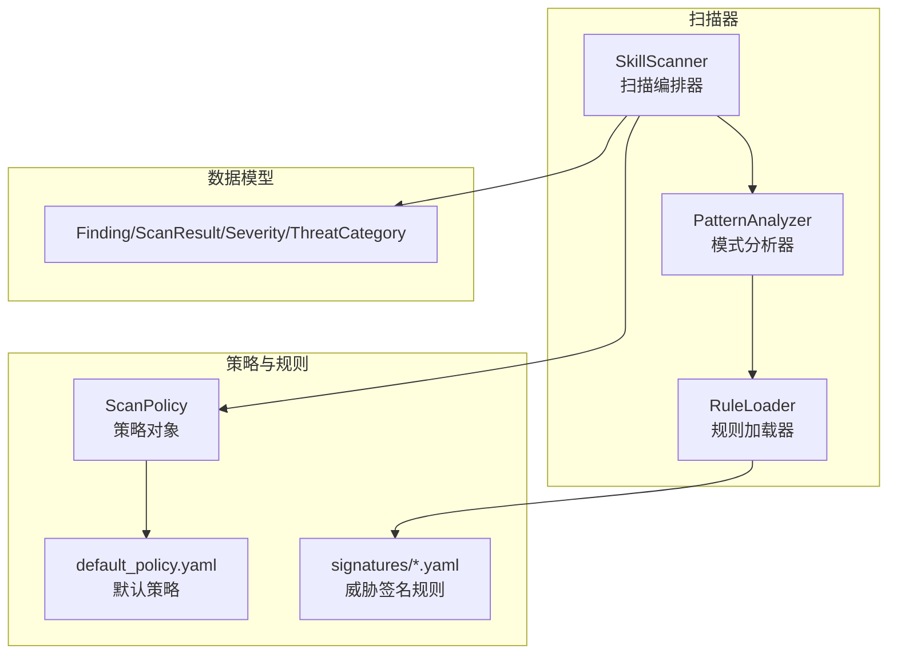
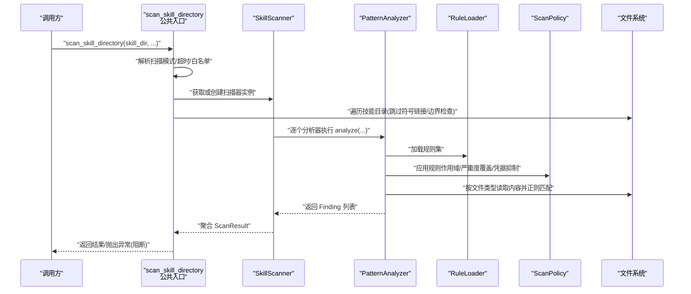
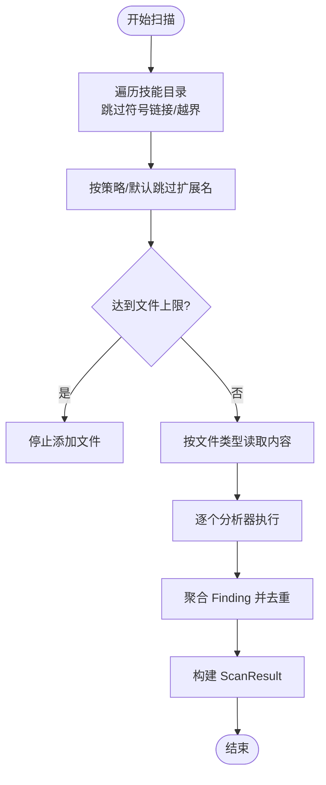
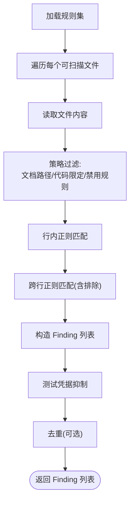
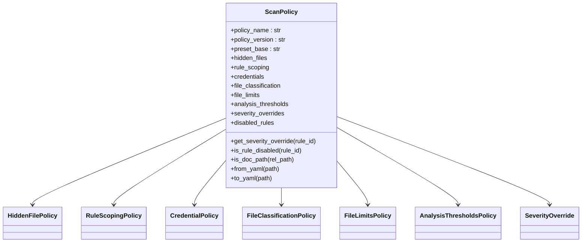
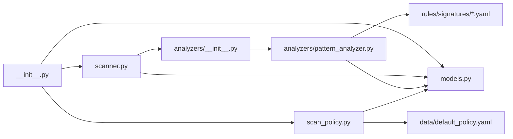
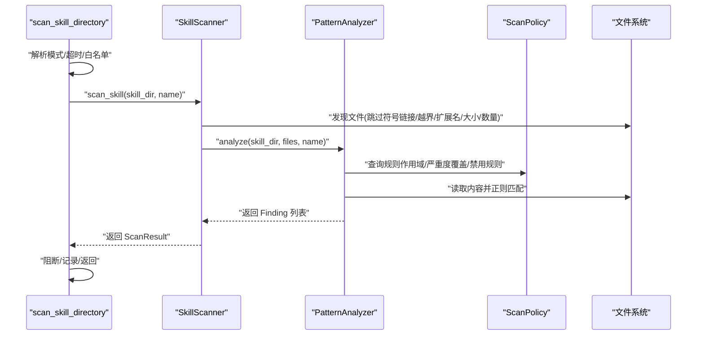

# 技能扫描系统

<cite>
**本文引用的文件**
- [copaw/src/copaw/security/skill_scanner/__init__.py](file://copaw/src/copaw/security/skill_scanner/__init__.py)
- [copaw/src/copaw/security/skill_scanner/scanner.py](file://copaw/src/copaw/security/skill_scanner/scanner.py)
- [copaw/src/copaw/security/skill_scanner/models.py](file://copaw/src/copaw/security/skill_scanner/models.py)
- [copaw/src/copaw/security/skill_scanner/scan_policy.py](file://copaw/src/copaw/security/skill_scanner/scan_policy.py)
- [copaw/src/copaw/security/skill_scanner/analyzers/__init__.py](file://copaw/src/copaw/security/skill_scanner/analyzers/__init__.py)
- [copaw/src/copaw/security/skill_scanner/analyzers/pattern_analyzer.py](file://copaw/src/copaw/security/skill_scanner/analyzers/pattern_analyzer.py)
- [copaw/src/copaw/security/skill_scanner/data/default_policy.yaml](file://copaw/src/copaw/security/skill_scanner/data/default_policy.yaml)
- [copaw/src/copaw/security/skill_scanner/rules/signatures/command_injection.yaml](file://copaw/src/copaw/security/skill_scanner/rules/signatures/command_injection.yaml)
- [copaw/src/copaw/security/skill_scanner/rules/signatures/hardcoded_secrets.yaml](file://copaw/src/copaw/security/skill_scanner/rules/signatures/hardcoded_secrets.yaml)
- [copaw/src/copaw/security/skill_scanner/rules/signatures/data_exfiltration.yaml](file://copaw/src/copaw/security/skill_scanner/rules/signatures/data_exfiltration.yaml)
- [copaw/src/copaw/security/skill_scanner/rules/signatures/prompt_injection.yaml](file://copaw/src/copaw/security/skill_scanner/rules/signatures/prompt_injection.yaml)
- [copaw/src/copaw/security/skill_scanner/rules/signatures/obfuscation.yaml](file://copaw/src/copaw/security/skill_scanner/rules/signatures/obfuscation.yaml)
- [copaw/src/copaw/security/skill_scanner/rules/signatures/unauthorized_tool_use.yaml](file://copaw/src/copaw/security/skill_scanner/rules/signatures/unauthorized_tool_use.yaml)
- [copaw/src/copaw/security/skill_scanner/rules/signatures/social_engineering.yaml](file://copaw/src/copaw/security/skill_scanner/rules/signatures/social_engineering.yaml)
- [copaw/src/copaw/security/skill_scanner/rules/signatures/supply_chain.yaml](file://copaw/src/copaw/security/skill_scanner/rules/signatures/supply_chain.yaml)
</cite>

## 目录
1. [简介](#简介)
2. [项目结构](#项目结构)
3. [核心组件](#核心组件)
4. [架构总览](#架构总览)
5. [详细组件分析](#详细组件分析)
6. [依赖分析](#依赖分析)
7. [性能考虑](#性能考虑)
8. [故障排查指南](#故障排查指南)
9. [结论](#结论)
10. [附录](#附录)

## 简介
本文件面向技能扫描系统，围绕“威胁检测机制”“安全策略配置”“模式分析器实现原理”“默认策略与自定义策略编写”“各类威胁签名规则与触发条件”“扫描引擎工作流与性能优化”“扫描结果解读与告警响应”等方面进行系统化技术说明。目标读者包括安全工程师、平台维护者与策略制定者。

## 项目结构
技能扫描系统位于 copaw 安全子模块中，采用“扫描编排器 + 分析器插件 + 策略与规则”的分层设计。关键目录与文件如下：
- 扫描编排器：scanner.py
- 模式分析器：analyzers/pattern_analyzer.py
- 数据模型：models.py
- 策略加载与合并：scan_policy.py
- 默认策略：data/default_policy.yaml
- 威胁签名规则：rules/signatures/*.yaml
- 公共入口与运行时配置：__init__.py

图示来源
- [copaw/src/copaw/security/skill_scanner/scanner.py:76-319](file://copaw/src/copaw/security/skill_scanner/scanner.py#L76-L319)
- [copaw/src/copaw/security/skill_scanner/analyzers/pattern_analyzer.py:236-393](file://copaw/src/copaw/security/skill_scanner/analyzers/pattern_analyzer.py#L236-L393)
- [copaw/src/copaw/security/skill_scanner/scan_policy.py:156-476](file://copaw/src/copaw/security/skill_scanner/scan_policy.py#L156-L476)
- [copaw/src/copaw/security/skill_scanner/data/default_policy.yaml:1-243](file://copaw/src/copaw/security/skill_scanner/data/default_policy.yaml#L1-L243)
- [copaw/src/copaw/security/skill_scanner/models.py:19-235](file://copaw/src/copaw/security/skill_scanner/models.py#L19-L235)

章节来源
- [copaw/src/copaw/security/skill_scanner/__init__.py:1-505](file://copaw/src/copaw/security/skill_scanner/__init__.py#L1-L505)
- [copaw/src/copaw/security/skill_scanner/scanner.py:1-319](file://copaw/src/copaw/security/skill_scanner/scanner.py#L1-L319)
- [copaw/src/copaw/security/skill_scanner/analyzers/pattern_analyzer.py:1-393](file://copaw/src/copaw/security/skill_scanner/analyzers/pattern_analyzer.py#L1-L393)
- [copaw/src/copaw/security/skill_scanner/scan_policy.py:1-476](file://copaw/src/copaw/security/skill_scanner/scan_policy.py#L1-L476)
- [copaw/src/copaw/security/skill_scanner/models.py:1-235](file://copaw/src/copaw/security/skill_scanner/models.py#L1-L235)
- [copaw/src/copaw/security/skill_scanner/data/default_policy.yaml:1-243](file://copaw/src/copaw/security/skill_scanner/data/default_policy.yaml#L1-L243)

## 核心组件
- 扫描编排器（SkillScanner）
  - 负责发现技能包中的可扫描文件、注册并调用分析器、聚合结果、记录失败分析器信息。
  - 支持文件数量上限、单文件大小上限、跳过扩展名集合等安全阈值。
- 模式分析器（PatternAnalyzer）
  - 基于 YAML 规则的正则匹配，支持行内匹配与跨行匹配，支持排除模式与按文件类型过滤。
  - 提供规则去重、测试凭据自动抑制、严重度覆盖等功能。
- 策略系统（ScanPolicy）
  - 组织级策略对象，支持隐藏文件白名单、规则作用域、凭据抑制、文件分类、阈值、严重度覆盖、禁用规则等。
  - 支持从 YAML 加载与深度合并默认策略。
- 数据模型（Finding/ScanResult/Severity/ThreatCategory）
  - 统一的扫描结果与威胁分类模型，便于跨分析器聚合与外部集成。
- 规则签名（rules/signatures/*.yaml）
  - 针对命令注入、数据泄露、硬编码密钥、提示词注入、混淆、未授权工具使用、社交工程、供应链攻击等威胁类别提供具体规则。

章节来源
- [copaw/src/copaw/security/skill_scanner/scanner.py:76-319](file://copaw/src/copaw/security/skill_scanner/scanner.py#L76-L319)
- [copaw/src/copaw/security/skill_scanner/analyzers/pattern_analyzer.py:236-393](file://copaw/src/copaw/security/skill_scanner/analyzers/pattern_analyzer.py#L236-L393)
- [copaw/src/copaw/security/skill_scanner/scan_policy.py:156-476](file://copaw/src/copaw/security/skill_scanner/scan_policy.py#L156-L476)
- [copaw/src/copaw/security/skill_scanner/models.py:19-235](file://copaw/src/copaw/security/skill_scanner/models.py#L19-L235)

## 架构总览
下图展示了从入口函数到规则匹配与结果聚合的整体流程。

图示来源
- [copaw/src/copaw/security/skill_scanner/__init__.py:415-505](file://copaw/src/copaw/security/skill_scanner/__init__.py#L415-L505)
- [copaw/src/copaw/security/skill_scanner/scanner.py:148-242](file://copaw/src/copaw/security/skill_scanner/scanner.py#L148-L242)
- [copaw/src/copaw/security/skill_scanner/analyzers/pattern_analyzer.py:265-347](file://copaw/src/copaw/security/skill_scanner/analyzers/pattern_analyzer.py#L265-L347)
- [copaw/src/copaw/security/skill_scanner/scan_policy.py:261-304](file://copaw/src/copaw/security/skill_scanner/scan_policy.py#L261-L304)

## 详细组件分析

### 扫描编排器（SkillScanner）
- 文件发现与安全过滤
  - 遍历技能目录，跳过符号链接与越界路径；按策略/默认集合跳过扩展名；限制最大文件数与单文件大小。
- 分析器执行
  - 顺序调用已注册分析器，捕获异常并记录失败分析器；聚合 Finding 并去重（由策略控制）。
- 结果封装
  - 生成 ScanResult，包含最高严重度、是否安全、耗时、使用的分析器列表等。

图示来源
- [copaw/src/copaw/security/skill_scanner/scanner.py:248-299](file://copaw/src/copaw/security/skill_scanner/scanner.py#L248-L299)
- [copaw/src/copaw/security/skill_scanner/scanner.py:188-242](file://copaw/src/copaw/security/skill_scanner/scanner.py#L188-L242)

章节来源
- [copaw/src/copaw/security/skill_scanner/scanner.py:76-319](file://copaw/src/copaw/security/skill_scanner/scanner.py#L76-L319)

### 模式分析器（PatternAnalyzer）
- 规则加载
  - 从目录或单文件加载 YAML 规则，构建 SecurityRule 对象索引（按 ID、类别、文件类型）。
- 匹配流程
  - 行内匹配（快速）+ 跨行匹配（仅当存在换行模式时）；支持排除模式；按策略过滤（文档路径、代码文件限定、禁用规则、严重度覆盖）。
- 输出
  - 生成 Finding，包含规则 ID、类别、严重度、文件路径、行号、片段、元数据等；自动去除测试凭据类 Finding；可选去重。

图示来源
- [copaw/src/copaw/security/skill_scanner/analyzers/pattern_analyzer.py:163-229](file://copaw/src/copaw/security/skill_scanner/analyzers/pattern_analyzer.py#L163-L229)
- [copaw/src/copaw/security/skill_scanner/analyzers/pattern_analyzer.py:265-347](file://copaw/src/copaw/security/skill_scanner/analyzers/pattern_analyzer.py#L265-L347)

章节来源
- [copaw/src/copaw/security/skill_scanner/analyzers/pattern_analyzer.py:236-393](file://copaw/src/copaw/security/skill_scanner/analyzers/pattern_analyzer.py#L236-L393)

### 策略系统（ScanPolicy）
- 结构化策略
  - 隐藏文件、规则作用域、凭据抑制、文件分类、文件限制、分析阈值、严重度覆盖、禁用规则等。
- 加载与合并
  - 默认策略来自内置 YAML；用户策略通过 from_yaml 加载并深度合并到默认策略之上。
- 运行期应用
  - 规则加载阶段与分析阶段均会查询策略以决定规则生效范围、严重度与抑制逻辑。

图示来源
- [copaw/src/copaw/security/skill_scanner/scan_policy.py:156-476](file://copaw/src/copaw/security/skill_scanner/scan_policy.py#L156-L476)
- [copaw/src/copaw/security/skill_scanner/data/default_policy.yaml:1-243](file://copaw/src/copaw/security/skill_scanner/data/default_policy.yaml#L1-L243)

章节来源
- [copaw/src/copaw/security/skill_scanner/scan_policy.py:1-476](file://copaw/src/copaw/security/skill_scanner/scan_policy.py#L1-L476)
- [copaw/src/copaw/security/skill_scanner/data/default_policy.yaml:1-243](file://copaw/src/copaw/security/skill_scanner/data/default_policy.yaml#L1-L243)

### 数据模型（Finding/ScanResult/Severity/ThreatCategory）
- Severity：严重度等级（CRITICAL/HIGH/MEDIUM/LOW/INFO/SAFE）
- ThreatCategory：威胁类别（命令注入、数据泄露、硬编码密钥、提示词注入、混淆、未授权工具使用、社交工程、供应链攻击等）
- Finding：一次检测发现，包含规则 ID、类别、严重度、标题、描述、文件路径、行号、片段、修复建议、元数据等
- ScanResult：扫描结果聚合，包含技能名称、目录、Findings、扫描耗时、使用的分析器、失败分析器、时间戳等

章节来源
- [copaw/src/copaw/security/skill_scanner/models.py:19-235](file://copaw/src/copaw/security/skill_scanner/models.py#L19-L235)

### 威胁签名与检测规则
以下为关键威胁类别与其典型规则要点（基于 YAML 规则文件）：

- 命令注入（command_injection.yaml）
  - 危险执行函数：eval/exec/compile 等
  - Shell 执行：os.system/subprocess 使用字符串且含格式化变量
  - 用户输入驱动：eval $@/* 等
  - 路径遍历：os.path.join + open + 用户输入
  - SQL 注入：f-string 拼接 SQL
  - SVG/PDF 内嵌脚本/动作
  - find -exec 与 xargs 组合
  - Node 子进程与动态函数构造
  - 触发条件：正则命中 + 排除模式不匹配 + 文件类型匹配 + 策略允许

- 数据泄露（data_exfiltration.yaml）
  - 网络请求：requests/httpx/aiohttp/urllib/socket
  - POST 高风险：关键词 attacker/exfil/webhook 等
  - 敏感文件访问：/etc/passwd、.aws/credentials、.ssh/*、.env
  - 编码+网络：base64.encodebytes + 网络调用
  - JS 网络与文件系统：fetch/axios/fs.readFile 等

- 硬编码密钥（hardcoded_secrets.yaml）
  - AWS 密钥、Stripe 密钥、Google API Key、GitHub Token
  - JWT、私钥块（含 BEGIN/END）、连接串含凭据
  - 触发条件：正则命中 + 排除测试占位符 + 文件类型匹配

- 提示词注入（prompt_injection.yaml）
  - 忽视/覆盖系统指令、启用无限制模式、绕过安全策略、泄露系统提示、隐藏操作
  - 触发条件：多语言关键词 + 文件类型（markdown）

- 混淆（obfuscation.yaml）
  - base64 解码+执行链、大段十六进制、XOR 编码、二进制文件
  - 触发条件：组合模式优先 + 文件类型（binary）

- 未授权工具使用（unauthorized_tool_use.yaml）
  - 系统包安装（sudo apt/yum/dnf/brew/pip）、从非可信源安装、系统修改（权限、服务、内核、防火墙）
  - 触发条件：sudo/系统级命令 + 文件类型（bash/python）

- 社交工程（social_engineering.yaml）
  - 描述过于模糊、品牌冒用
  - 触发条件：描述长度/关键词 + manifest 类型

- 供应链攻击（supply_chain.yaml）
  - 隐藏文件含可执行代码（.py/.sh 等）
  - 触发条件：路径匹配 + 文件类型

章节来源
- [copaw/src/copaw/security/skill_scanner/rules/signatures/command_injection.yaml:1-195](file://copaw/src/copaw/security/skill_scanner/rules/signatures/command_injection.yaml#L1-L195)
- [copaw/src/copaw/security/skill_scanner/rules/signatures/data_exfiltration.yaml:1-142](file://copaw/src/copaw/security/skill_scanner/rules/signatures/data_exfiltration.yaml#L1-L142)
- [copaw/src/copaw/security/skill_scanner/rules/signatures/hardcoded_secrets.yaml:1-150](file://copaw/src/copaw/security/skill_scanner/rules/signatures/hardcoded_secrets.yaml#L1-L150)
- [copaw/src/copaw/security/skill_scanner/rules/signatures/prompt_injection.yaml:1-80](file://copaw/src/copaw/security/skill_scanner/rules/signatures/prompt_injection.yaml#L1-L80)
- [copaw/src/copaw/security/skill_scanner/rules/signatures/obfuscation.yaml:1-47](file://copaw/src/copaw/security/skill_scanner/rules/signatures/obfuscation.yaml#L1-L47)
- [copaw/src/copaw/security/skill_scanner/rules/signatures/unauthorized_tool_use.yaml:1-60](file://copaw/src/copaw/security/skill_scanner/rules/signatures/unauthorized_tool_use.yaml#L1-L60)
- [copaw/src/copaw/security/skill_scanner/rules/signatures/social_engineering.yaml:1-28](file://copaw/src/copaw/security/skill_scanner/rules/signatures/social_engineering.yaml#L1-L28)
- [copaw/src/copaw/security/skill_scanner/rules/signatures/supply_chain.yaml:1-12](file://copaw/src/copaw/security/skill_scanner/rules/signatures/supply_chain.yaml#L1-L12)

## 依赖分析
- 组件耦合
  - SkillScanner 依赖 ScanPolicy 与 BaseAnalyzer 接口，便于后续扩展新分析器。
  - PatternAnalyzer 依赖 RuleLoader 与 ScanPolicy，规则加载与策略应用解耦。
  - __init__.py 将扫描器、策略、模型、分析器统一导出，并提供运行时配置与缓存/历史记录能力。
- 外部依赖
  - YAML 解析、正则表达式、并发线程池、文件系统遍历与统计。

图示来源
- [copaw/src/copaw/security/skill_scanner/__init__.py:43-54](file://copaw/src/copaw/security/skill_scanner/__init__.py#L43-L54)
- [copaw/src/copaw/security/skill_scanner/scanner.py:24-27](file://copaw/src/copaw/security/skill_scanner/scanner.py#L24-L27)
- [copaw/src/copaw/security/skill_scanner/analyzers/pattern_analyzer.py:17-19](file://copaw/src/copaw/security/skill_scanner/analyzers/pattern_analyzer.py#L17-L19)

章节来源
- [copaw/src/copaw/security/skill_scanner/__init__.py:1-505](file://copaw/src/copaw/security/skill_scanner/__init__.py#L1-L505)
- [copaw/src/copaw/security/skill_scanner/scanner.py:1-319](file://copaw/src/copaw/security/skill_scanner/scanner.py#L1-L319)
- [copaw/src/copaw/security/skill_scanner/analyzers/pattern_analyzer.py:1-393](file://copaw/src/copaw/security/skill_scanner/analyzers/pattern_analyzer.py#L1-L393)
- [copaw/src/copaw/security/skill_scanner/scan_policy.py:1-476](file://copaw/src/copaw/security/skill_scanner/scan_policy.py#L1-L476)
- [copaw/src/copaw/security/skill_scanner/models.py:1-235](file://copaw/src/copaw/security/skill_scanner/models.py#L1-L235)

## 性能考虑
- 并发与超时
  - 公共入口使用线程池执行扫描，支持超时控制，避免长时间阻塞。
- 缓存与去重
  - 目录 mtime 基础的扫描结果缓存，限制最大缓存条目，降低重复扫描成本。
- 文件发现与阈值
  - 文件数量上限、单文件大小上限、扩展名跳过集合，有效控制 IO 与内存占用。
- 正则匹配优化
  - 行内快速匹配 + 跨行匹配（仅在存在换行模式时），减少不必要的全文扫描。
- 去重与抑制
  - 基于规则 ID/文件/行号的去重；测试凭据自动抑制，减少噪音。

章节来源
- [copaw/src/copaw/security/skill_scanner/__init__.py:327-380](file://copaw/src/copaw/security/skill_scanner/__init__.py#L327-L380)
- [copaw/src/copaw/security/skill_scanner/scanner.py:116-127](file://copaw/src/copaw/security/skill_scanner/scanner.py#L116-L127)
- [copaw/src/copaw/security/skill_scanner/analyzers/pattern_analyzer.py:370-380](file://copaw/src/copaw/security/skill_scanner/analyzers/pattern_analyzer.py#L370-L380)

## 故障排查指南
- 常见问题
  - 扫描超时：调整超时参数或缩小扫描范围；检查文件数量/大小阈值。
  - 结果为空：确认规则目录是否存在、规则是否被策略禁用、文件类型是否匹配。
  - 白名单误判：检查 content_hash 是否匹配当前目录内容。
  - 历史记录写入失败：确认工作目录权限。
- 调试建议
  - 启用更详细的日志级别，观察“发现文件数”“分析器失败列表”“最高严重度”等字段。
  - 使用 ScanPolicy.to_yaml 导出策略，定位规则作用域与严重度覆盖。
  - 通过 ScanResult.to_dict 输出结构化结果，便于二次处理。
- 响应策略
  - 阻断模式下出现 CRITICAL/HIGH：立即阻止上线，修复后重新扫描。
  - 警告模式下出现高危：记录并跟踪，限期整改。

章节来源
- [copaw/src/copaw/security/skill_scanner/__init__.py:393-505](file://copaw/src/copaw/security/skill_scanner/__init__.py#L393-L505)
- [copaw/src/copaw/security/skill_scanner/scan_policy.py:283-304](file://copaw/src/copaw/security/skill_scanner/scan_policy.py#L283-L304)
- [copaw/src/copaw/security/skill_scanner/models.py:220-235](file://copaw/src/copaw/security/skill_scanner/models.py#L220-L235)

## 结论
技能扫描系统通过“策略驱动 + 规则签名 + 可插拔分析器”的架构，在保证高性能的同时提供了可定制的安全基线。默认策略与规则覆盖了主流威胁面，组织可通过策略文件精细化调整规则范围、严重度与抑制项，满足不同合规与风险偏好。

## 附录

### 默认策略结构与自定义策略编写
- 默认策略位置：data/default_policy.yaml
- 关键字段
  - hidden_files：隐式文件/目录白名单
  - rule_scoping：规则作用域（仅代码/文档路径/文档文件名模式/去重）
  - credentials：测试凭据与占位符抑制
  - file_classification：扩展名分类（惰性/结构化/归档/代码）
  - file_limits：文件数量、大小、名称/描述长度等阈值
  - analysis_thresholds：最小置信度、正则最大长度
  - severity_overrides/disabled_rules：按规则覆盖严重度/禁用规则
- 自定义策略编写步骤
  - 仅覆盖需要变更的字段，其余沿用默认策略
  - 使用 ScanPolicy.from_yaml 加载；或通过公共入口的配置项传入
  - 通过 ScanPolicy.to_yaml 导出策略以便审阅与版本管理

章节来源
- [copaw/src/copaw/security/skill_scanner/data/default_policy.yaml:1-243](file://copaw/src/copaw/security/skill_scanner/data/default_policy.yaml#L1-L243)
- [copaw/src/copaw/security/skill_scanner/scan_policy.py:261-304](file://copaw/src/copaw/security/skill_scanner/scan_policy.py#L261-L304)

### 扫描引擎工作流程（代码级）

图示来源
- [copaw/src/copaw/security/skill_scanner/__init__.py:415-505](file://copaw/src/copaw/security/skill_scanner/__init__.py#L415-L505)
- [copaw/src/copaw/security/skill_scanner/scanner.py:148-242](file://copaw/src/copaw/security/skill_scanner/scanner.py#L148-L242)
- [copaw/src/copaw/security/skill_scanner/analyzers/pattern_analyzer.py:265-347](file://copaw/src/copaw/security/skill_scanner/analyzers/pattern_analyzer.py#L265-L347)

### 扫描结果解读与告警机制
- 结果字段
  - is_safe：是否存在 CRITICAL/HIGH
  - max_severity：最高严重度
  - findings：按严重度/类别分组
  - analyzers_used/analyzers_failed：分析器使用情况
- 告警与阻断
  - 阻断模式：出现 CRITICAL/HIGH 时抛出异常并记录
  - 警告模式：记录但不阻断
  - 历史记录：记录每次阻断/警告的技能、严重度、Findings、内容哈希与时间

章节来源
- [copaw/src/copaw/security/skill_scanner/models.py:186-219](file://copaw/src/copaw/security/skill_scanner/models.py#L186-L219)
- [copaw/src/copaw/security/skill_scanner/__init__.py:393-505](file://copaw/src/copaw/security/skill_scanner/__init__.py#L393-L505)