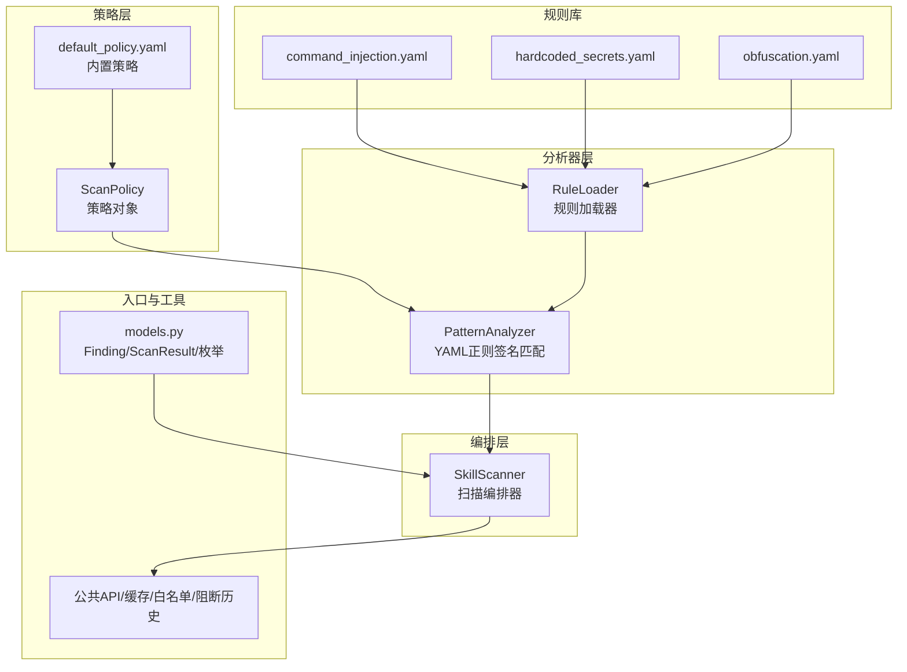
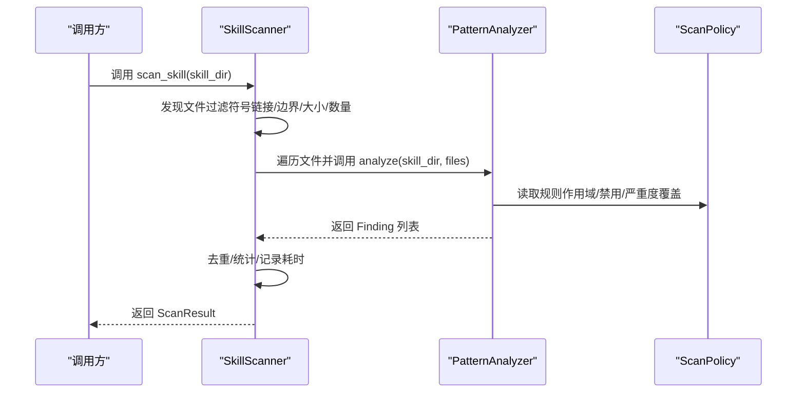
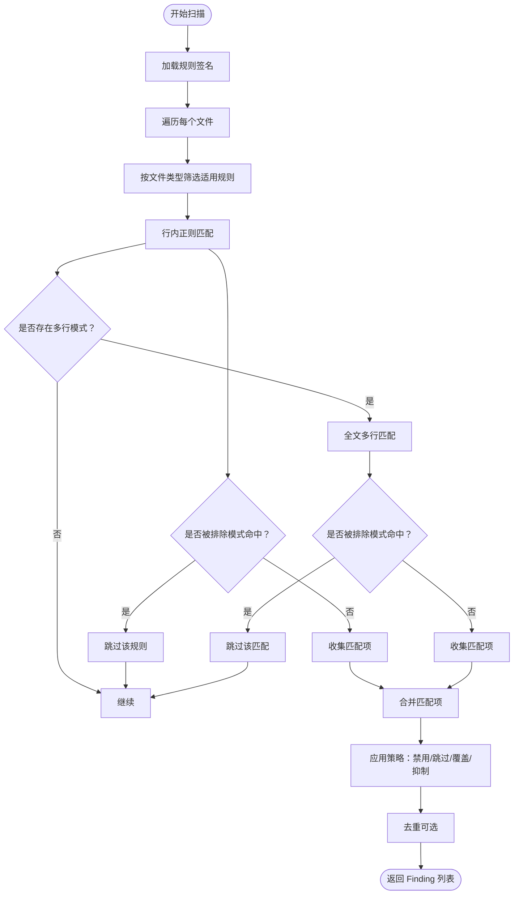
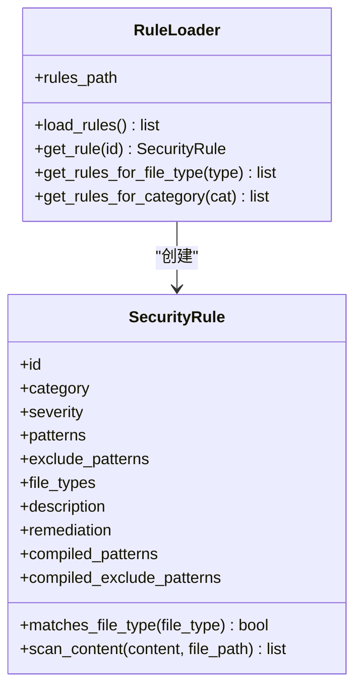
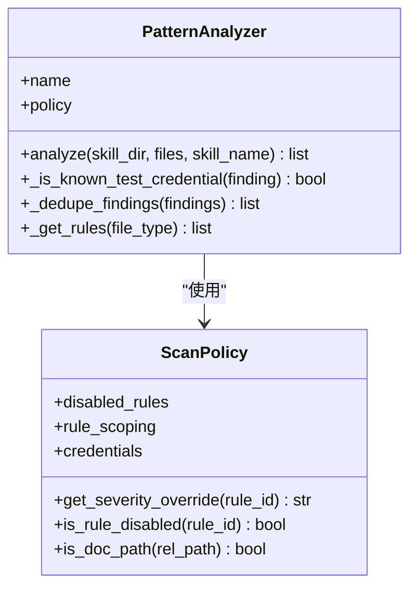
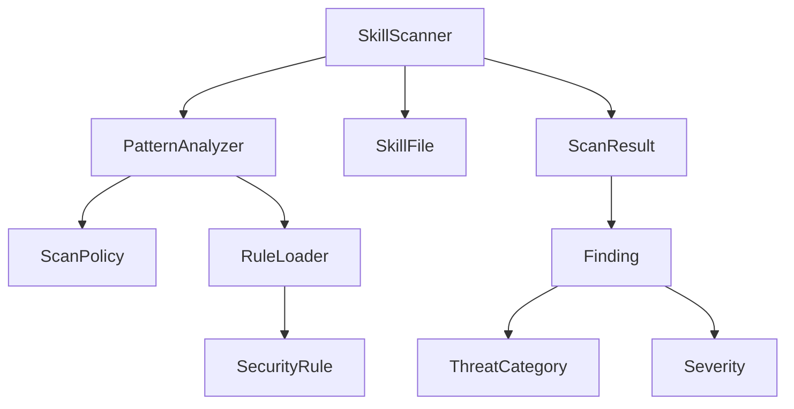

# 模式分析器

<cite>
**本文引用的文件**
- [pattern_analyzer.py](file://copaw/src/copaw/security/skill_scanner/analyzers/pattern_analyzer.py)
- [scanner.py](file://copaw/src/copaw/security/skill_scanner/scanner.py)
- [models.py](file://copaw/src/copaw/security/skill_scanner/models.py)
- [scan_policy.py](file://copaw/src/copaw/security/skill_scanner/scan_policy.py)
- [default_policy.yaml](file://copaw/src/copaw/security/skill_scanner/data/default_policy.yaml)
- [command_injection.yaml](file://copaw/src/copaw/security/skill_scanner/rules/signatures/command_injection.yaml)
- [hardcoded_secrets.yaml](file://copaw/src/copaw/security/skill_scanner/rules/signatures/hardcoded_secrets.yaml)
- [obfuscation.yaml](file://copaw/src/copaw/security/skill_scanner/rules/signatures/obfuscation.yaml)
</cite>

## 目录
1. [简介](#简介)
2. [项目结构](#项目结构)
3. [核心组件](#核心组件)
4. [架构总览](#架构总览)
5. [详细组件分析](#详细组件分析)
6. [依赖关系分析](#依赖关系分析)
7. [性能考量](#性能考量)
8. [故障排查指南](#故障排查指南)
9. [结论](#结论)
10. [附录](#附录)

## 简介
本文件面向模式分析器组件（PatternAnalyzer），提供深入的技术文档，涵盖威胁检测算法、正则表达式匹配机制、支持的威胁类型与规则、性能优化与缓存策略、自定义规则编写方法、正则语法与调试技巧，以及配置示例、误报处理与规则更新方法。目标读者包括安全工程师、平台开发者与需要理解静态规则扫描实现的工程人员。

## 项目结构
模式分析器位于安全子模块的技能扫描器中，采用“策略驱动 + 分析器插件化”的轻量设计：
- 策略层：ScanPolicy 统一管理规则范围、严重度覆盖、文件分类与阈值
- 分析器层：PatternAnalyzer 负责基于 YAML 正则签名的匹配
- 编排层：SkillScanner 负责文件发现、并发执行分析器并聚合结果
- 规则库：rules/signatures 下按威胁类型组织的 YAML 规则

**图表来源**
- [scanner.py:36-76](file://copaw/src/copaw/security/skill_scanner/scanner.py#L36-L76)
- [pattern_analyzer.py:163-229](file://copaw/src/copaw/security/skill_scanner/analyzers/pattern_analyzer.py#L163-L229)

**章节来源**
- [scanner.py:36-76](file://copaw/src/copaw/security/skill_scanner/scanner.py#L36-L76)
- [pattern_analyzer.py:163-229](file://copaw/src/copaw/security/skill_scanner/analyzers/pattern_analyzer.py#L163-L229)

## 核心组件
- PatternAnalyzer：基于 YAML 规则的正则签名匹配器，支持行内快速匹配与多行模式回退、排除模式、策略过滤与去重
- RuleLoader：从目录或单文件加载 YAML 规则，构建 SecurityRule 对象并按 ID/类别/文件类型索引
- ScanPolicy：组织策略配置，提供规则禁用、严重度覆盖、文档路径跳过、仅代码规则、测试凭证抑制、去重等能力
- SkillScanner：扫描编排器，负责文件发现、并发执行分析器并聚合结果
- 数据模型：Finding、ScanResult、ThreatCategory、Severity 等

**章节来源**
- [pattern_analyzer.py:236-393](file://copaw/src/copaw/security/skill_scanner/analyzers/pattern_analyzer.py#L236-L393)
- [scanner.py:76-319](file://copaw/src/copaw/security/skill_scanner/scanner.py#L76-L319)
- [models.py:19-235](file://copaw/src/copaw/security/skill_scanner/models.py#L19-L235)
- [scan_policy.py:156-476](file://copaw/src/copaw/security/skill_scanner/scan_policy.py#L156-L476)

## 架构总览
模式分析器在扫描流程中的位置与交互如下：

**图表来源**
- [scanner.py:148-242](file://copaw/src/copaw/security/skill_scanner/scanner.py#L148-L242)
- [pattern_analyzer.py:265-347](file://copaw/src/copaw/security/skill_scanner/analyzers/pattern_analyzer.py#L265-L347)

## 详细组件分析

### PatternAnalyzer 工作流与匹配算法
- 规则加载：从 rules/signatures 目录加载 YAML 规则，构建 SecurityRule 对象并按类别/文件类型索引
- 匹配逻辑：
  - 先按行匹配，再对含换行的模式进行多行匹配
  - 支持排除模式（exclude_patterns），命中即跳过
- 策略集成：
  - 根据策略过滤规则（禁用、文档路径跳过、仅代码文件）
  - 严重度覆盖、测试凭证抑制、去重
- 凭证过滤：对硬编码密钥类发现，结合策略中的测试值与占位符标记进行二次过滤
- 去重：按 rule_id + file_path + line_number 去除重复

**图表来源**
- [pattern_analyzer.py:163-347](file://copaw/src/copaw/security/skill_scanner/analyzers/pattern_analyzer.py#L163-L347)
- [scan_policy.py:183-231](file://copaw/src/copaw/security/skill_scanner/scan_policy.py#L183-L231)

**章节来源**
- [pattern_analyzer.py:163-347](file://copaw/src/copaw/security/skill_scanner/analyzers/pattern_analyzer.py#L163-L347)
- [scan_policy.py:156-231](file://copaw/src/copaw/security/skill_scanner/scan_policy.py#L156-L231)

### SecurityRule 与 RuleLoader
- SecurityRule：封装单条规则的 id、类别、严重度、patterns、exclude_patterns、file_types、描述与修复建议，并预编译正则
- RuleLoader：从目录或单文件加载 YAML 列表，构建 SecurityRule 对象，建立按 ID、类别、文件类型的索引

**图表来源**
- [pattern_analyzer.py:38-229](file://copaw/src/copaw/security/skill_scanner/analyzers/pattern_analyzer.py#L38-L229)

**章节来源**
- [pattern_analyzer.py:38-229](file://copaw/src/copaw/security/skill_scanner/analyzers/pattern_analyzer.py#L38-L229)

### PatternAnalyzer 类与内部机制
- analyze：遍历文件，按策略过滤规则，调用 SecurityRule.scan_content 执行匹配，构造 Finding 并应用策略后处理
- _is_known_test_credential：对硬编码密钥类发现进行二次过滤（测试值与占位符）
- _dedupe_findings：按 rule_id + file_path + line_number 去重
- _get_rules：按文件类型缓存规则集合

**图表来源**
- [pattern_analyzer.py:236-393](file://copaw/src/copaw/security/skill_scanner/analyzers/pattern_analyzer.py#L236-L393)
- [scan_policy.py:156-231](file://copaw/src/copaw/security/skill_scanner/scan_policy.py#L156-L231)

**章节来源**
- [pattern_analyzer.py:236-393](file://copaw/src/copaw/security/skill_scanner/analyzers/pattern_analyzer.py#L236-L393)
- [scan_policy.py:156-231](file://copaw/src/copaw/security/skill_scanner/scan_policy.py#L156-L231)

### 支持的威胁类型与检测规则
- 命令注入（command_injection）
  - 危险函数调用：eval、exec、compile 等
  - Shell 命令执行：os.system、subprocess、child_process 等
  - 路径遍历：os.path.join + 用户输入 + open
  - SQL 注入：f-string 拼接 SQL
  - SVG/PDF 内嵌脚本/脚本动作
  - find -exec 潜在危险模式
- 数据泄露（hardcoded_secrets）
  - 云服务密钥：AWS、Stripe、Google API
  - 私钥块：BEGIN PRIVATE KEY 至 END PRIVATE KEY
  - 密码/密钥变量：password、api_key、secret 等
  - 连接字符串：mongodb/mysql/postgresql 等协议 + 用户名密码
- 混淆代码（obfuscation）
  - base64 解码+执行链
  - 大段十六进制编码
  - XOR 编码与解码上下文
  - 二进制文件包含

**章节来源**
- [command_injection.yaml:1-195](file://copaw/src/copaw/security/skill_scanner/rules/signatures/command_injection.yaml#L1-L195)
- [hardcoded_secrets.yaml:1-150](file://copaw/src/copaw/security/skill_scanner/rules/signatures/hardcoded_secrets.yaml#L1-L150)
- [obfuscation.yaml:1-47](file://copaw/src/copaw/security/skill_scanner/rules/signatures/obfuscation.yaml#L1-L47)

### 正则表达式匹配机制与性能优化
- 匹配阶段
  - 行内快速匹配：逐行扫描，命中即收集，避免大文件全量扫描开销
  - 多行模式回退：对包含换行的模式进行全文匹配，但通过字符类剔除辅助判断减少不必要的全量扫描
- 排除模式：在行内与多行匹配前均进行排除模式检查，命中即跳过
- 缓存策略
  - 按文件类型缓存规则集合：_get_rules(file_type)
  - 文档路径正则懒加载与组合：_compiled_doc_filename_re
  - 正则长度限制与非法模式警告：_safe_compile
- 性能要点
  - 预编译正则：SecurityRule 在初始化时编译 patterns 与 exclude_patterns
  - 早停策略：遇到符号链接、越界路径、超大文件、禁用规则、仅文档/仅代码规则时提前跳过
  - 去重：双重去重（分析器内与编排器内）

**章节来源**
- [pattern_analyzer.py:93-155](file://copaw/src/copaw/security/skill_scanner/analyzers/pattern_analyzer.py#L93-L155)
- [pattern_analyzer.py:386-393](file://copaw/src/copaw/security/skill_scanner/analyzers/pattern_analyzer.py#L386-L393)
- [scan_policy.py:49-67](file://copaw/src/copaw/security/skill_scanner/scan_policy.py#L49-L67)
- [scanner.py:248-299](file://copaw/src/copaw/security/skill_scanner/scanner.py#L248-L299)

### 自定义威胁规则编写方法
- 规则字段
  - id：唯一标识，建议使用 UPPER_SNAKE_CASE
  - category：威胁类别（ThreatCategory 枚举值）
  - severity：严重度（Severity 枚举值）
  - patterns：正则表达式列表
  - exclude_patterns：排除模式列表（可选）
  - file_types：适用文件类型列表（可选，留空表示全部）
  - description：规则描述
  - remediation：修复建议
- 编写步骤
  - 在 rules/signatures/ 下新增 YAML 文件或复用现有文件
  - 使用安全的正则表达式，避免过长与回溯陷阱
  - 优先提供行内匹配模式，必要时添加多行模式
  - 提供 exclude_patterns 以降低误报
  - 选择合适的 severity 与 category
  - 通过 ScanPolicy 的 severity_overrides 与 disabled_rules 进行运行期调整
- 正则语法与调试技巧
  - 使用原子分组与前瞻/后顾减少回溯
  - 将常见模式前置，利用正则引擎短路特性
  - 使用字符类与锚点提升匹配效率
  - 在本地小样本上验证 exclude_patterns
  - 参考内置规则的 patterns/exclude_patterns 设计思路

**章节来源**
- [pattern_analyzer.py:54-84](file://copaw/src/copaw/security/skill_scanner/analyzers/pattern_analyzer.py#L54-L84)
- [scan_policy.py:183-193](file://copaw/src/copaw/security/skill_scanner/scan_policy.py#L183-L193)

### 配置示例与误报处理
- 配置示例
  - 默认策略：default_policy.yaml 提供内置策略，可通过 ScanPolicy.from_yaml 覆盖
  - 关键配置项
    - rule_scoping：skip_in_docs、code_only、doc_path_indicators、doc_filename_patterns、dedupe_duplicate_findings
    - credentials：known_test_values、placeholder_markers
    - file_classification：inert_extensions、structured_extensions、archive_extensions、code_extensions
    - file_limits：max_file_count、max_file_size_bytes 等
    - analysis_thresholds：max_regex_pattern_length、min_confidence_pct
    - severity_overrides：按规则 ID 覆盖严重度
    - disabled_rules：禁用特定规则
- 误报处理
  - 添加 exclude_patterns：针对误报场景增加排除模式
  - 使用策略：将规则加入 disabled_rules 或设置 severity_overrides 为较低级别
  - 测试凭证抑制：在 credentials 中添加 known_test_values 与 placeholder_markers
  - 文档路径跳过：通过 doc_path_indicators 与 doc_filename_patterns 将规则限制在代码文件
- 规则更新方法
  - 新增规则：在 rules/signatures/ 下新增 YAML 条目
  - 修改规则：调整 patterns/exclude_patterns 后重新加载
  - 策略覆盖：通过 ScanPolicy 的 severity_overrides 与 disabled_rules 实现组织级治理

**章节来源**
- [default_policy.yaml:1-243](file://copaw/src/copaw/security/skill_scanner/data/default_policy.yaml#L1-L243)
- [scan_policy.py:261-304](file://copaw/src/copaw/security/skill_scanner/scan_policy.py#L261-L304)

## 依赖关系分析
- PatternAnalyzer 依赖 ScanPolicy 进行规则过滤与策略控制
- RuleLoader 依赖 YAML 解析与正则编译
- SkillScanner 依赖 PatternAnalyzer 与其他分析器，负责文件发现与结果聚合
- models.py 提供 Finding、ScanResult、ThreatCategory、Severity 等数据模型

**图表来源**
- [pattern_analyzer.py:236-393](file://copaw/src/copaw/security/skill_scanner/analyzers/pattern_analyzer.py#L236-L393)
- [scanner.py:76-319](file://copaw/src/copaw/security/skill_scanner/scanner.py#L76-L319)
- [models.py:19-235](file://copaw/src/copaw/security/skill_scanner/models.py#L19-L235)

**章节来源**
- [pattern_analyzer.py:236-393](file://copaw/src/copaw/security/skill_scanner/analyzers/pattern_analyzer.py#L236-L393)
- [scanner.py:76-319](file://copaw/src/copaw/security/skill_scanner/scanner.py#L76-L319)
- [models.py:19-235](file://copaw/src/copaw/security/skill_scanner/models.py#L19-L235)

## 性能考量
- 时间复杂度
  - 行内匹配：O(N_lines × N_patterns_per_line)，在大文件中优先命中排除模式可显著降低开销
  - 多行匹配：仅对包含换行的模式执行，且通过字符类剔除辅助判断，避免全量扫描
- 空间复杂度
  - 预编译正则占用内存，但可复用；按文件类型缓存规则集合减少重复计算
- 优化建议
  - 控制正则长度与复杂度，避免回溯陷阱
  - 合理使用 exclude_patterns，减少无效匹配
  - 利用策略限制规则作用域（仅代码、文档路径跳过）
  - 启用去重以减少重复输出

[本节为通用性能讨论，不直接分析具体文件]

## 故障排查指南
- 常见问题
  - 规则未生效：检查 ScanPolicy 的 disabled_rules 与 severity_overrides 是否覆盖
  - 误报过多：为规则添加更严格的 exclude_patterns，或在 credentials 中补充 known_test_values
  - 多行匹配未触发：确认 patterns 中包含换行，且未被排除模式命中
  - 性能过慢：检查 file_limits 与 file_classification 设置，确保只扫描必要文件类型
- 调试步骤
  - 查看日志：PatternAnalyzer 与 ScanPolicy 在加载与编译阶段会输出警告信息
  - 验证正则：在本地小样本上测试 patterns 与 exclude_patterns
  - 检查策略：导出当前策略 to_yaml 并核对各配置项

**章节来源**
- [pattern_analyzer.py:67-83](file://copaw/src/copaw/security/skill_scanner/analyzers/pattern_analyzer.py#L67-L83)
- [scan_policy.py:49-67](file://copaw/src/copaw/security/skill_scanner/scan_policy.py#L49-L67)

## 结论
PatternAnalyzer 通过“策略驱动 + 规则签名 + 正则匹配”的方式，提供了可扩展、可配置、可优化的静态威胁检测能力。其行内快速匹配与多行回退相结合、排除模式与策略过滤共同作用，既保证了覆盖率又兼顾了性能。通过合理的规则设计与策略配置，可以有效降低误报并提升检测精度。

[本节为总结性内容，不直接分析具体文件]

## 附录
- 威胁分类与严重度
  - 威胁分类：prompt_injection、command_injection、data_exfiltration、unauthorized_tool_use、obfuscation、hardcoded_secrets、social_engineering、resource_abuse、policy_violation、malware、harmful_content、skill_discovery_abuse、transitive_trust_abuse、autonomy_abuse、tool_chaining_abuse、unicode_steganography、supply_chain_attack
  - 严重度：CRITICAL、HIGH、MEDIUM、LOW、INFO、SAFE

**章节来源**
- [models.py:30-54](file://copaw/src/copaw/security/skill_scanner/models.py#L30-L54)
- [models.py:19-28](file://copaw/src/copaw/security/skill_scanner/models.py#L19-L28)