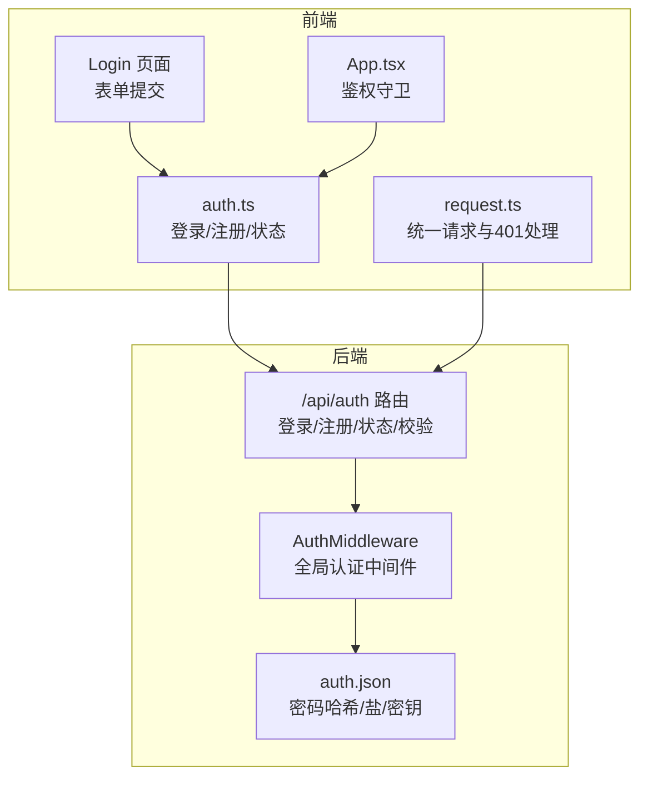
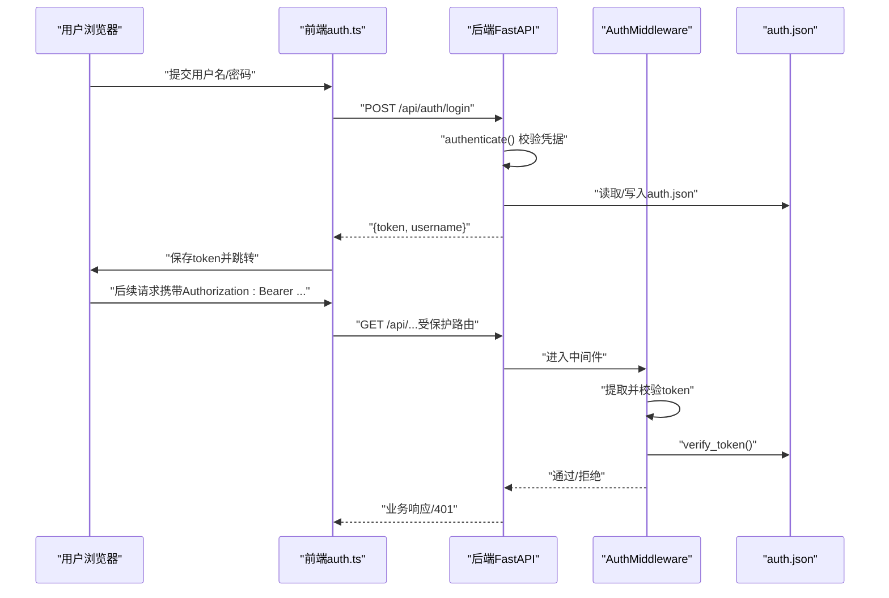
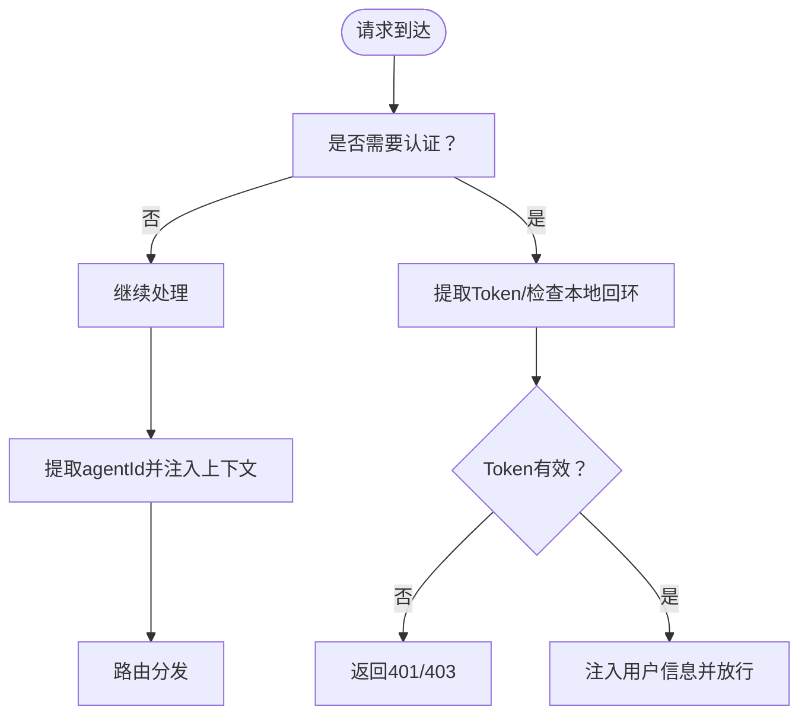
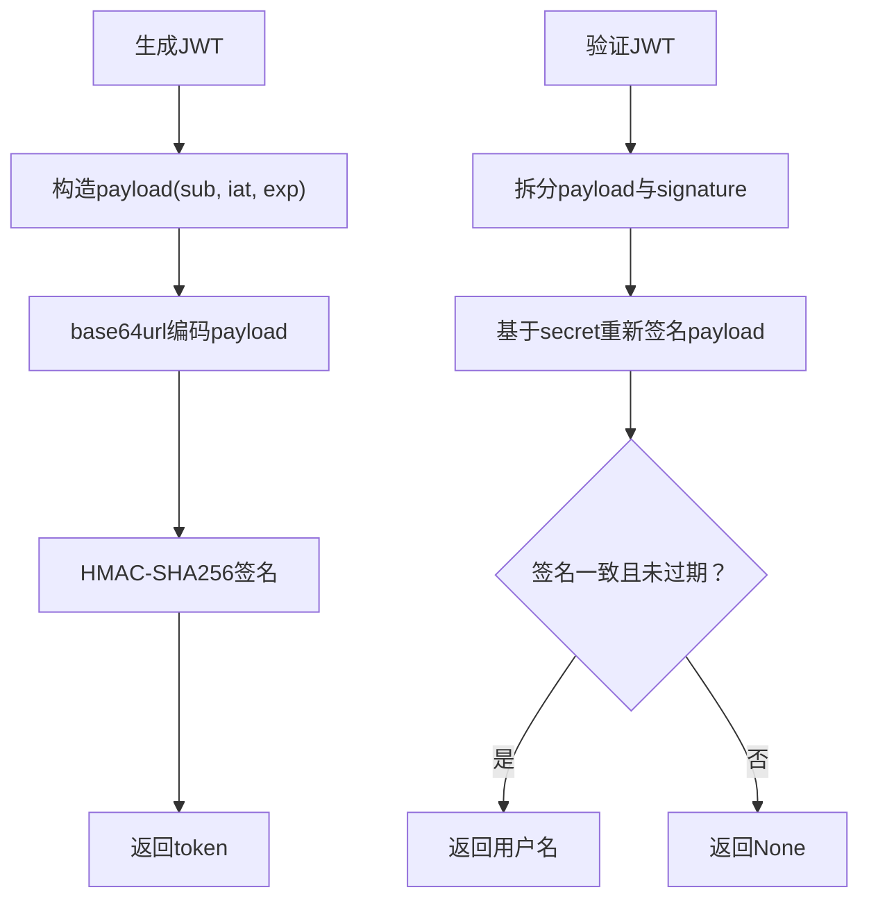
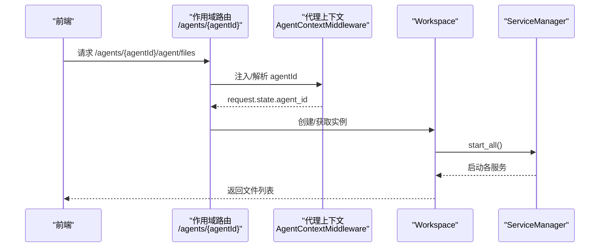
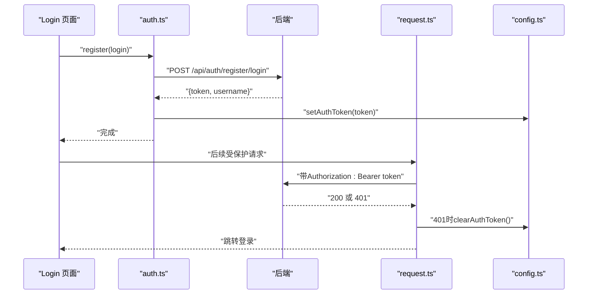
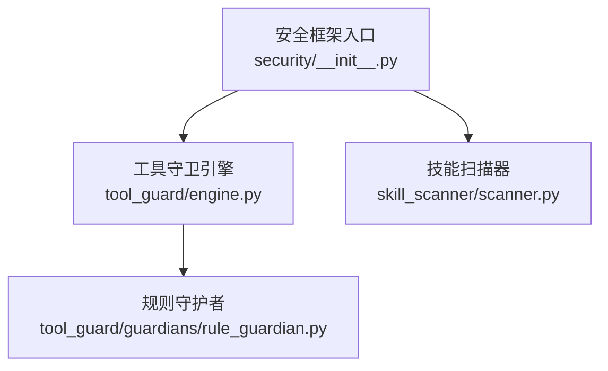
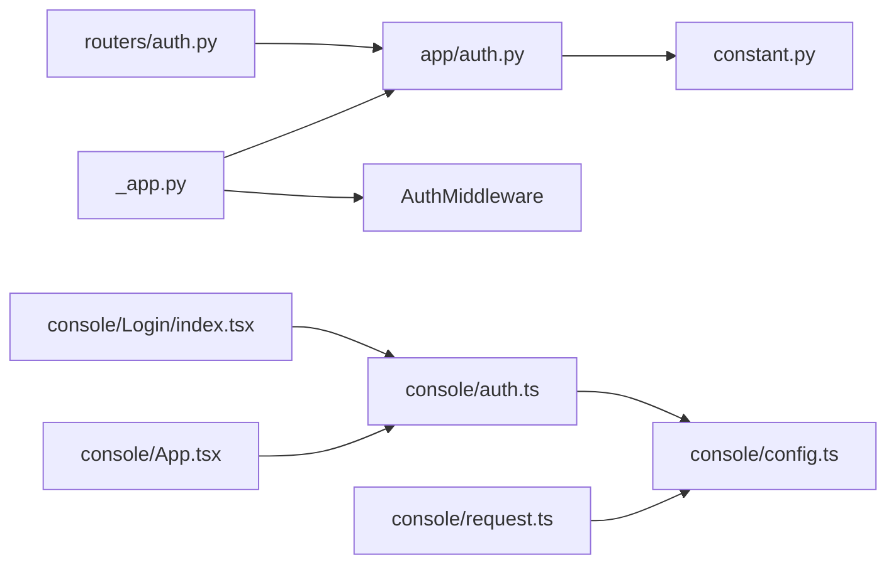

# 认证与授权

<cite>
**本文引用的文件**
- [认证与授权.md](file://specs/copaw-repowiki/content/安全系统/认证与授权.md)
- [REST API/认证API.md](file://specs/copaw-repowiki/content/API参考/REST API/认证API.md)
- [应用核心架构.md](file://specs/copaw-repowiki/content/系统架构/应用核心架构.md)
- [工作空间配置.md](file://specs/copaw-repowiki/content/配置管理/工作空间配置.md)
- [auth.py](file://copaw/src/copaw/app/auth.py)
- [auth.py（路由）](file://copaw/src/copaw/app/routers/auth.py)
- [constant.py](file://copaw/src/copaw/constant.py)
- [request.ts](file://copaw/console/src/api/request.ts)
- [config.ts](file://copaw/console/src/api/config.ts)
- [auth.ts](file://copaw/console/src/api/modules/auth.ts)
- [App.tsx](file://copaw/console/src/App.tsx)
- [Login/index.tsx](file://copaw/console/src/pages/Login/index.tsx)
- [agent_scoped.py](file://copaw/src/copaw/app/routers/agent_scoped.py)
- [workspace.py](file://copaw/src/copaw/app/workspace/workspace.py)
- [__init__.py（安全框架）](file://copaw/src/copaw/security/__init__.py)
</cite>

## 目录
1. [简介](#简介)
2. [项目结构](#项目结构)
3. [核心组件](#核心组件)
4. [架构总览](#架构总览)
5. [详细组件分析](#详细组件分析)
6. [依赖关系分析](#依赖关系分析)
7. [性能考量](#性能考量)
8. [故障排查指南](#故障排查指南)
9. [结论](#结论)
10. [附录](#附录)

## 简介
本文件面向认证与授权系统，系统性阐述用户身份验证的实现机制、认证流程设计、授权策略与访问控制模型、JWT 令牌的生成与验证、多租户（工作空间）隔离与角色分配思路、认证中间件与会话管理、与 API 网关及前端应用的集成方式、以及安全最佳实践与性能优化策略。文档同时提供可视化图示与分层说明，帮助不同背景读者快速理解与落地。

## 项目结构
认证与授权体系由“后端 FastAPI 应用 + 认证中间件 + 前端控制台”构成，核心文件分布如下：
- 后端
  - 认证路由：/api/auth/*（登录、注册、状态、校验、更新资料）
  - 认证中间件：全局拦截受保护路径，校验 Authorization 头中的 Bearer 令牌
  - 认证数据持久化：auth.json（位于 SECRET_DIR），存储密码哈希、盐值与 JWT 密钥
- 前端
  - 控制台通过 auth.ts 封装登录/注册/状态查询
  - 统一请求层 request.ts 对 401 进行统一处理（清空令牌并跳转登录）
  - 登录页 Login 页面负责首次注册与后续登录
  - App.tsx 中的鉴权守卫先检查状态，再通过 /auth/verify 确认令牌有效性

**图表来源**
- [REST API/认证API.md:48-67](file://specs/copaw-repowiki/content/API参考/REST API/认证API.md#L48-L67)
- [auth.py（路由）:19-175](file://copaw/src/copaw/app/routers/auth.py#L19-L175)
- [auth.py:340-410](file://copaw/src/copaw/app/auth.py#L340-L410)
- [auth.ts:14-49](file://copaw/console/src/api/modules/auth.ts#L14-L49)
- [request.ts:60-117](file://copaw/console/src/api/request.ts#L60-L117)
- [Login/index.tsx:11-176](file://copaw/console/src/pages/Login/index.tsx#L11-L176)
- [App.tsx:49-104](file://copaw/console/src/App.tsx#L49-L104)

**章节来源**
- [REST API/认证API.md:37-67](file://specs/copaw-repowiki/content/API参考/REST API/认证API.md#L37-L67)
- [应用核心架构.md:190-223](file://specs/copaw-repowiki/content/系统架构/应用核心架构.md#L190-L223)

## 核心组件
- 后端认证核心
  - 密码哈希与校验：使用标准库实现盐值 SHA-256 哈希与恒时比较，避免泄漏
  - JWT 令牌：HMAC-SHA256 签名，负载包含 sub、iat、exp，有效期 7 天
  - 认证数据持久化：auth.json 存于 SECRET_DIR，权限严格限制为 600
  - 自动注册：支持从环境变量一次性创建管理员账户（仅在未注册且启用认证时生效）
  - 更新凭证：支持更新用户名与密码，更改密码会轮换 JWT 密钥以使旧会话失效
- 认证中间件
  - 仅对 /api/ 路由生效，跳过 OPTIONS 与静态资源
  - 支持本地回环地址免认证（便于 CLI）
  - 提取 Authorization 头或 WebSocket 查询参数中的 Bearer Token
  - 返回 401/403/404 明确失败原因
- 前端认证客户端与会话管理
  - auth.ts：login/register/getStatus
  - request.ts：统一 fetch 封装，401 自动清理 localStorage 中的 token 并跳转登录
  - config.ts：token 存取（localStorage 优先，否则构建时常量）
  - 登录页与鉴权守卫：先 getStatus，再根据 token 调用 /auth/verify 确认有效性

**章节来源**
- [auth.py:104-160](file://copaw/src/copaw/app/auth.py#L104-L160)
- [auth.py:184-190](file://copaw/src/copaw/app/auth.py#L184-L190)
- [auth.py:242-272](file://copaw/src/copaw/app/auth.py#L242-L272)
- [auth.py:274-309](file://copaw/src/copaw/app/auth.py#L274-L309)
- [auth.py:340-410](file://copaw/src/copaw/app/auth.py#L340-L410)
- [auth.py（路由）:42-114](file://copaw/src/copaw/app/routers/auth.py#L42-L114)
- [auth.ts:14-49](file://copaw/console/src/api/modules/auth.ts#L14-L49)
- [request.ts:60-117](file://copaw/console/src/api/request.ts#L60-L117)
- [config.ts:23-41](file://copaw/console/src/api/config.ts#L23-L41)
- [App.tsx:49-104](file://copaw/console/src/App.tsx#L49-L104)
- [Login/index.tsx:21-72](file://copaw/console/src/pages/Login/index.tsx#L21-L72)

## 架构总览
认证系统遵循“后端路由 + 中间件 + 前端客户端”的分层设计。后端通过 /api/auth/* 提供认证能力，并由 AuthMiddleware 统一拦截校验；前端通过统一请求层与鉴权守卫实现会话生命周期管理。

**图表来源**
- [REST API/认证API.md:118-138](file://specs/copaw-repowiki/content/API参考/REST API/认证API.md#L118-L138)
- [auth.py（路由）:42-114](file://copaw/src/copaw/app/routers/auth.py#L42-L114)
- [auth.py:340-410](file://copaw/src/copaw/app/auth.py#L340-L410)
- [auth.ts:14-49](file://copaw/console/src/api/modules/auth.ts#L14-L49)
- [request.ts:60-117](file://copaw/console/src/api/request.ts#L60-L117)

## 详细组件分析

### 认证流程与中间件
- 认证流程
  - 登录：前端调用 /api/auth/login，后端校验凭据并签发 JWT
  - 校验：前端或后端调用 /api/auth/verify，验证令牌有效性
  - 注册：仅在认证启用且无用户时允许，注册成功后签发令牌
  - 更新资料：要求当前密码正确，支持更新用户名与密码（密码变更会轮换密钥）
- 中间件行为
  - 跳过条件：未启用认证、已注册用户、公共路径、静态资源、非 /api/ 路由、本地回环
  - 提取策略：Authorization 头 Bearer、WebSocket 查询参数 token、普通查询参数 token
  - 结果：通过则注入 request.state.user，失败返回 401

**图表来源**
- [应用核心架构.md:203-213](file://specs/copaw-repowiki/content/系统架构/应用核心架构.md#L203-L213)
- [auth.py:374-410](file://copaw/src/copaw/app/auth.py#L374-L410)
- [agent_scoped.py:15-51](file://copaw/src/copaw/app/routers/agent_scoped.py#L15-L51)

**章节来源**
- [auth.py（路由）:42-114](file://copaw/src/copaw/app/routers/auth.py#L42-L114)
- [auth.py:340-410](file://copaw/src/copaw/app/auth.py#L340-L410)
- [应用核心架构.md:190-223](file://specs/copaw-repowiki/content/系统架构/应用核心架构.md#L190-L223)

### JWT 令牌生成、验证与刷新
- 生成
  - 负载包含 sub（用户名）、iat（签发时间）、exp（过期时间，7 天）
  - 使用 HMAC-SHA256 对 base64url 编码的负载签名
- 验证
  - 解析负载与签名，重新计算期望签名并与传入签名比对
  - 校验 exp 是否过期
- 刷新
  - 当前实现未提供专用刷新接口；建议在前端定期续签或在后端引入 refresh token 机制（见“性能与扩展建议”）

**图表来源**
- [auth.py:115-160](file://copaw/src/copaw/app/auth.py#L115-L160)

**章节来源**
- [auth.py:115-160](file://copaw/src/copaw/app/auth.py#L115-L160)

### 多租户与工作空间隔离
- 工作空间隔离
  - 通过作用域路由 /agents/{agentId}/ 将请求绑定到特定 agent 上下文
  - AgentContextMiddleware 优先从路径提取 agentId，其次从 X-Agent-Id 头注入
  - Workspace 类封装独立运行时，包含 Runner、ChannelManager、MemoryManager、MCPClientManager、CronManager 等组件
- 权限与访问控制
  - 单用户/单操作员边界；共享实例需严格隔离（通道白名单、最小权限、分离主机/用户）
  - 工作空间边界：工作目录被视为受信任本地状态；编辑即跨越信任边界
  - 技能与工具：技能在进程内运行，具备与 CoPaw 相同权限，应谨慎启用与最小化暴露

**图表来源**
- [agent_scoped.py:53-92](file://copaw/src/copaw/app/routers/agent_scoped.py#L53-L92)
- [workspace.py:142-288](file://copaw/src/copaw/app/workspace/workspace.py#L142-L288)

**章节来源**
- [agent_scoped.py:15-51](file://copaw/src/copaw/app/routers/agent_scoped.py#L15-L51)
- [workspace.py:47-130](file://copaw/src/copaw/app/workspace/workspace.py#L47-L130)
- [工作空间配置.md:482-491](file://specs/copaw-repowiki/content/配置管理/工作空间配置.md#L482-L491)

### 前端集成与会话管理
- 登录页 Login
  - 首次无用户时自动切换到注册流程
  - 登录成功后设置 token 并跳转
- 鉴权守卫 App.tsx
  - 先 getStatus，再根据 token 调用 /auth/verify 确认有效性
  - 401 时清理 token 并跳转登录
- 统一请求层 request.ts
  - 自动附加认证头（通过 buildAuthHeaders）
  - 401 统一处理：清理 token 并跳转登录

**图表来源**
- [Login/index.tsx:37-72](file://copaw/console/src/pages/Login/index.tsx#L37-L72)
- [auth.ts:14-49](file://copaw/console/src/api/modules/auth.ts#L14-L49)
- [request.ts:60-117](file://copaw/console/src/api/request.ts#L60-L117)
- [config.ts:23-41](file://copaw/console/src/api/config.ts#L23-L41)
- [App.tsx:49-104](file://copaw/console/src/App.tsx#L49-L104)

**章节来源**
- [Login/index.tsx:21-72](file://copaw/console/src/pages/Login/index.tsx#L21-L72)
- [App.tsx:49-104](file://copaw/console/src/App.tsx#L49-L104)
- [request.ts:60-117](file://copaw/console/src/api/request.ts#L60-L117)
- [auth.ts:14-49](file://copaw/console/src/api/modules/auth.ts#L14-L49)
- [config.ts:23-41](file://copaw/console/src/api/config.ts#L23-L41)

### 安全框架与工具守卫
- 安全框架入口集中管理工具守卫与技能扫描，子模块独立演进，按需启用
- 工具守卫引擎与规则守护者用于预执行参数扫描，检测危险工具使用模式
- 技能扫描器对技能目录进行静态分析，防止安装/激活潜在风险内容

**图表来源**
- [认证与授权.md:56-95](file://specs/copaw-repowiki/content/安全系统/认证与授权.md#L56-L95)
- [__init__.py（安全框架）:1-17](file://copaw/src/copaw/security/__init__.py#L1-L17)

**章节来源**
- [认证与授权.md:56-95](file://specs/copaw-repowiki/content/安全系统/认证与授权.md#L56-L95)
- [__init__.py（安全框架）:1-17](file://copaw/src/copaw/security/__init__.py#L1-L17)

## 依赖关系分析
- 后端
  - 路由依赖认证模块（authenticate、register_user、verify_token、is_auth_enabled 等）
  - 应用启动时挂载 AuthMiddleware，全局生效
  - SECRET_DIR 来自 constant.py，auth.json 存放于此
- 前端
  - auth.ts 依赖 config.ts 提供的 getApiUrl
  - request.ts 统一处理 401 并清理 token
  - 登录页与鉴权守卫配合完成会话生命周期管理

**图表来源**
- [auth.py（路由）:10-17](file://copaw/src/copaw/app/routers/auth.py#L10-L17)
- [auth.py:32-36](file://copaw/src/copaw/app/auth.py#L32-L36)
- [constant.py:72-86](file://copaw/src/copaw/constant.py#L72-L86)
- [auth.ts:1-2](file://copaw/console/src/api/modules/auth.ts#L1-L2)
- [config.ts:1-42](file://copaw/console/src/api/config.ts#L1-L42)
- [request.ts:1-3](file://copaw/console/src/api/request.ts#L1-L3)
- [Login/index.tsx:7-9](file://copaw/console/src/pages/Login/index.tsx#L7-L9)
- [App.tsx:22-24](file://copaw/console/src/App.tsx#L22-L24)

**章节来源**
- [REST API/认证API.md:281-301](file://specs/copaw-repowiki/content/API参考/REST API/认证API.md#L281-L301)
- [auth.py（路由）:10-17](file://copaw/src/copaw/app/routers/auth.py#L10-L17)
- [auth.py:32-36](file://copaw/src/copaw/app/auth.py#L32-L36)
- [constant.py:72-86](file://copaw/src/copaw/constant.py#L72-L86)

## 性能考量
- 令牌有效期与刷新
  - 当前令牌有效期为 7 天；建议在前端增加“静默续签”策略（例如在过期前 1 小时自动刷新），或在后端引入 refresh token 机制
- 中间件开销
  - 中间件仅对 /api/ 路由生效，跳过 OPTIONS 与静态资源，降低不必要的校验开销
- 请求与响应
  - request.ts 统一处理 401，避免重复逻辑与分支
- 并发与缓存
  - 建议在前端对常用受保护资源进行轻量缓存，结合 ETag/Last-Modified 减少无效请求
- CORS 与跨域
  - CORS 通过环境变量配置允许源，建议生产环境限定具体域名，避免通配符

[本节为通用性能建议，无需特定文件引用]

## 故障排查指南
- 401 未认证
  - 检查前端是否正确设置 Authorization 头（Bearer token）
  - 确认后端中间件未对本地回环请求误拦截
  - 核对 auth.json 是否存在且权限为 600
- 403 禁止访问
  - 认证未启用或用户已注册时仍尝试注册
  - 用户已存在但再次尝试注册
- 404 未找到
  - 请求路径不在受保护范围或被中间件跳过
- 令牌过期
  - 前端应捕获 401 并清理 token，引导用户重新登录
  - 建议在前端实现“静默续签”或刷新令牌流程
- 环境变量配置
  - COPAW_AUTH_ENABLED：启用/禁用认证
  - COPAW_AUTH_USERNAME/COPAW_AUTH_PASSWORD：自动注册管理员账户
  - COPAW_SECRET_DIR：认证数据目录
  - COPAW_CORS_ORIGINS：CORS 允许源

**章节来源**
- [auth.py:354-371](file://copaw/src/copaw/app/auth.py#L354-L371)
- [auth.py（路由）:55-84](file://copaw/src/copaw/app/routers/auth.py#L55-L84)
- [request.ts:74-95](file://copaw/console/src/api/request.ts#L74-L95)
- [constant.py:72-86](file://copaw/src/copaw/constant.py#L72-L86)

## 结论
该认证与授权系统以“最小依赖、强安全”为核心设计原则：后端使用标准库实现密码哈希与 JWT 签名，中间件统一拦截校验，前端通过鉴权守卫与统一请求层实现会话生命周期管理。多租户通过工作空间与作用域路由实现隔离，安全框架提供工具守卫与技能扫描保障运行时安全。建议在现有基础上引入刷新令牌与“静默续签”，并完善 CORS 与速率限制策略，进一步提升可用性与安全性。

[本节为总结，无需特定文件引用]

## 附录

### 认证配置示例（后端）
- 启用认证
  - 设置 COPAW_AUTH_ENABLED=true
- 自动注册管理员
  - 设置 COPAW_AUTH_USERNAME 与 COPAW_AUTH_PASSWORD
- 认证数据目录
  - 设置 COPAW_SECRET_DIR 指向安全目录
- CORS 配置
  - 设置 COPAW_CORS_ORIGINS 为允许的源列表

**章节来源**
- [auth.py（路由）:55-84](file://copaw/src/copaw/app/routers/auth.py#L55-L84)
- [auth.py:242-272](file://copaw/src/copaw/app/auth.py#L242-L272)
- [constant.py:72-86](file://copaw/src/copaw/constant.py#L72-L86)
- [应用核心架构.md:196-198](file://specs/copaw-repowiki/content/系统架构/应用核心架构.md#L196-L198)

### 安全最佳实践
- 强密码与最小权限
  - 使用强口令策略，避免弱口令
  - 最小权限原则，仅授予必要操作权限
- 传输安全
  - 仅在 HTTPS 下传输，避免明文泄露
- 令牌管理
  - 严格控制 localStorage 存储，避免 XSS 泄露
  - 建议引入 refresh token 与短期访问令牌
- 日志与监控
  - 记录认证事件与异常，配合告警机制
- 定期审计
  - 定期检查 auth.json 权限与内容，审计访问日志

[本节为通用安全建议，无需特定文件引用]