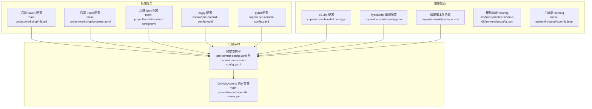
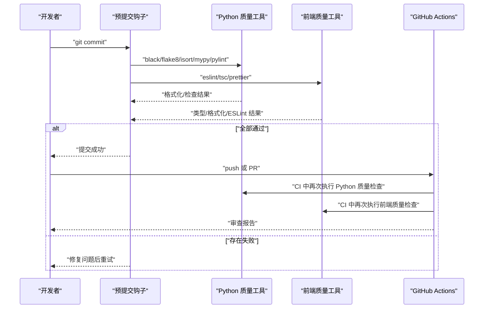
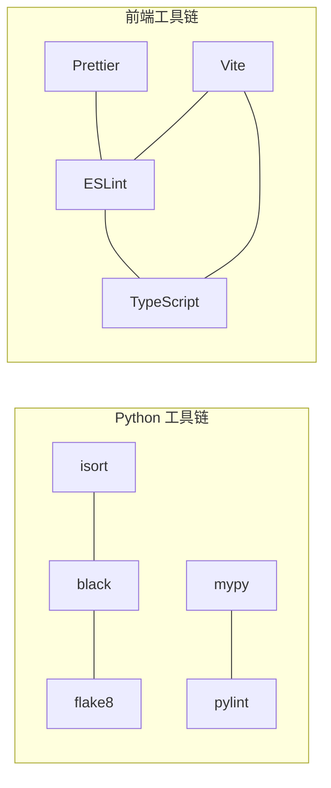

# 代码规范

<cite>
**本文档引用的文件**
- [.pre-commit-config.yaml](file://.pre-commit-config.yaml)
- [copaw/.pre-commit-config.yaml](file://copaw/.pre-commit-config.yaml)
- [copaw/.flake8](file://copaw/.flake8)
- [copaw/pyproject.toml](file://copaw/pyproject.toml)
- [copaw/console/eslint.config.js](file://copaw/console/eslint.config.js)
- [copaw/console/tsconfig.json](file://copaw/console/tsconfig.json)
- [copaw/console/package.json](file://copaw/console/package.json)
- [main-project/workshop/.flake8](file://main-project/workshop/.flake8)
- [main-project/workshop/pyproject.toml](file://main-project/workshop/pyproject.toml)
- [main-project/workshop/isort-config.toml](file://main-project/workshop/isort-config.toml)
- [main-project/workshop/code-review.yml](file://main-project/workshop/code-review.yml)
- [specs/copaw-repowiki/content/开发指南/代码规范.md](file://specs/copaw-repowiki/content/开发指南/代码规范.md)
- [modules-practice/module-05/frontend/tsconfig.json](file://modules-practice/module-05/frontend/tsconfig.json)
- [main-project/frontend/tsconfig.json](file://main-project/frontend/tsconfig.json)
</cite>

## 目录
1. [引言](#引言)
2. [项目结构](#项目结构)
3. [核心组件](#核心组件)
4. [架构总览](#架构总览)
5. [详细组件分析](#详细组件分析)
6. [依赖关系分析](#依赖关系分析)
7. [性能考虑](#性能考虑)
8. [故障排查指南](#故障排查指南)
9. [结论](#结论)
10. [附录](#附录)

## 引言
本文件面向开发者，提供统一的代码规范与最佳实践，覆盖以下方面：
- Python 代码风格与静态检查（PEP8、Black、flake8、isort、mypy、pylint）
- TypeScript/JavaScript 编码规范与 ESLint 配置
- React 组件开发规范与样式组织
- 命名约定、缩进规则、注释标准、导入组织
- 预提交钩子与 CI 代码质量检查流程
- 代码审查检查清单与常见问题解决方案
- 不同文件类型的特定规范与落地建议

## 项目结构
本仓库包含多个子项目与工作坊模板，其中与代码规范直接相关的关键位置如下：
- 顶层与各子项目均提供预提交配置与质量检查工作流
- Python 后端在多个工作坊提供了 flake8、black、isort、mypy、pylint 的配置
- 前端控制台（copaw/console）提供 ESLint、TypeScript、Prettier 的配置与脚本
- 各模块前端提供 tsconfig.json 作为编译与严格性的基础

图表来源
- [copaw/.pre-commit-config.yaml:1-121](file://copaw/.pre-commit-config.yaml#L1-L121)
- [.pre-commit-config.yaml:1-41](file://.pre-commit-config.yaml#L1-L41)
- [main-project/workshop/.flake8:1-30](file://main-project/workshop/.flake8#L1-L30)
- [main-project/workshop/pyproject.toml:1-28](file://main-project/workshop/pyproject.toml#L1-L28)
- [main-project/workshop/isort-config.toml:1-27](file://main-project/workshop/isort-config.toml#L1-L27)
- [copaw/console/eslint.config.js:1-29](file://copaw/console/eslint.config.js#L1-L29)
- [copaw/console/tsconfig.json:1-8](file://copaw/console/tsconfig.json#L1-L8)
- [copaw/console/package.json:1-60](file://copaw/console/package.json#L1-L60)
- [main-project/workshop/code-review.yml:1-159](file://main-project/workshop/code-review.yml#L1-L159)

章节来源
- [copaw/.pre-commit-config.yaml:1-121](file://copaw/.pre-commit-config.yaml#L1-L121)
- [.pre-commit-config.yaml:1-41](file://.pre-commit-config.yaml#L1-L41)
- [main-project/workshop/.flake8:1-30](file://main-project/workshop/.flake8#L1-L30)
- [main-project/workshop/pyproject.toml:1-28](file://main-project/workshop/pyproject.toml#L1-L28)
- [main-project/workshop/isort-config.toml:1-27](file://main-project/workshop/isort-config.toml#L1-L27)
- [copaw/console/eslint.config.js:1-29](file://copaw/console/eslint.config.js#L1-L29)
- [copaw/console/tsconfig.json:1-8](file://copaw/console/tsconfig.json#L1-L8)
- [copaw/console/package.json:1-60](file://copaw/console/package.json#L1-L60)
- [main-project/workshop/code-review.yml:1-159](file://main-project/workshop/code-review.yml#L1-L159)

## 核心组件
- Python 后端质量工具链
  - Black：统一格式化，行宽在不同项目中分别为 79 与 120
  - flake8：行宽与忽略规则在不同项目中存在差异
  - isort：使用 black 兼容配置，行宽 120，分组策略明确
  - mypy：忽略缺失导入与部分错误类别，启用 follow-imports=skip
  - pylint：禁用若干规则以降低噪音，保留关键问题提示
- 前端质量工具链
  - ESLint：基于 typescript-eslint 推荐配置，启用 React Hooks 与 react-refresh 插件
  - TypeScript：严格模式与 JSX 配置，支持 bundler 模式与路径别名
  - Prettier：通过脚本统一格式化检查
- 预提交与 CI
  - 预提交钩子：通用检查、mypy、black、flake8、pylint、prettier 等
  - CI 工作流：Python 与前端分别进行格式化、导入排序、ESLint、TypeScript 类型检查、Prettier 检查与安全扫描

章节来源
- [copaw/.pre-commit-config.yaml:54-120](file://copaw/.pre-commit-config.yaml#L54-L120)
- [copaw/.flake8:1-12](file://copaw/.flake8#L1-L12)
- [copaw/console/eslint.config.js:1-29](file://copaw/console/eslint.config.js#L1-L29)
- [copaw/console/tsconfig.json:1-8](file://copaw/console/tsconfig.json#L1-L8)
- [copaw/console/package.json:1-60](file://copaw/console/package.json#L1-L60)
- [main-project/workshop/.flake8:1-30](file://main-project/workshop/.flake8#L1-L30)
- [main-project/workshop/pyproject.toml:1-28](file://main-project/workshop/pyproject.toml#L1-L28)
- [main-project/workshop/isort-config.toml:1-27](file://main-project/workshop/isort-config.toml#L1-L27)
- [main-project/workshop/code-review.yml:1-159](file://main-project/workshop/code-review.yml#L1-L159)

## 架构总览
下图展示从“本地提交”到“CI 审查”的质量门禁流程，涵盖 Python 与前端两条主线。

图表来源
- [copaw/.pre-commit-config.yaml:1-121](file://copaw/.pre-commit-config.yaml#L1-L121)
- [main-project/workshop/code-review.yml:1-159](file://main-project/workshop/code-review.yml#L1-L159)

## 详细组件分析

### Python 代码风格与静态检查
- 命名约定
  - 模块与包：小写、下划线分隔；避免短名称，保持语义清晰
  - 函数与变量：小驼峰或下划线，优先可读性；常量全大写加下划线
  - 类：帕斯卡命名；异常类以 Error 结尾
  - 私有成员：以下划线前缀；公共接口避免单字母变量
- 导入顺序与组织
  - 标准库 → 第三方库 → 项目内部模块；每组之间空一行；同一组内按字母序
  - 避免相对导入，优先使用绝对导入；在包内跨模块引用时保持清晰路径
- 注释与文档字符串
  - 模块首行编码声明；函数/类/模块需有简洁文档字符串；复杂逻辑补充行内注释
  - TODO/FIXME 使用统一标记并在后续修复
- 静态检查与格式化
  - flake8：行宽在不同项目中分别为 79 与 120；忽略 F401/F403/W503/E731 等规则以适配现状
  - black：行宽 79 或 120；自动格式化 Python 文件
  - pylint：禁用若干规则以减少噪音；保留关键问题提示
  - mypy：忽略缺失导入与特定错误类别；启用 follow-imports=skip 与 explicit-package-bases
- 日志与运行时
  - 使用统一的日志命名空间与彩色终端输出；文件日志按平台策略处理
  - 应用生命周期中注入中间件与静态资源路由，确保控制台可用性

章节来源
- [specs/copaw-repowiki/content/开发指南/代码规范.md:151-208](file://specs/copaw-repowiki/content/开发指南/代码规范.md#L151-L208)
- [copaw/.flake8:1-12](file://copaw/.flake8#L1-L12)
- [copaw/.pre-commit-config.yaml:54-120](file://copaw/.pre-commit-config.yaml#L54-L120)
- [main-project/workshop/.flake8:1-30](file://main-project/workshop/.flake8#L1-L30)
- [main-project/workshop/pyproject.toml:1-28](file://main-project/workshop/pyproject.toml#L1-L28)
- [main-project/workshop/isort-config.toml:1-27](file://main-project/workshop/isort-config.toml#L1-L27)

### TypeScript/JavaScript 编码规范
- ESLint 配置
  - 使用 typescript-eslint 推荐配置；启用 React Hooks 与 react-refresh 插件
  - 仅允许常量导出组件的刷新规则，避免误报
- 代码格式化与检查
  - 通过 package.json 脚本统一入口：format/format:check/lint；建议在提交前执行
- 组件命名约定
  - 组件文件以帕斯卡命名（如 LanguageSwitcher.tsx）；样式文件与组件同名且以 .module.less 结尾
  - 页面组件与布局组件分离；路由映射集中管理，避免硬编码路径
- 依赖与版本
  - 前端依赖与开发依赖明确区分；版本锁定于 package.json；构建脚本统一由 Vite 执行
- TypeScript 编译配置
  - 严格模式开启；bundler 模式与路径别名；JSX 使用 react-jsx；noEmit 禁止输出

章节来源
- [copaw/console/eslint.config.js:1-29](file://copaw/console/eslint.config.js#L1-L29)
- [copaw/console/package.json:1-60](file://copaw/console/package.json#L1-L60)
- [copaw/console/tsconfig.json:1-8](file://copaw/console/tsconfig.json#L1-L8)
- [modules-practice/module-05/frontend/tsconfig.json:1-31](file://modules-practice/module-05/frontend/tsconfig.json#L1-L31)
- [main-project/frontend/tsconfig.json:1-16](file://main-project/frontend/tsconfig.json#L1-L16)

### React 组件开发规范
- 组件结构
  - 将页面组件与布局组件分离；路由映射集中管理，避免硬编码路径
  - 组件文件以帕斯卡命名；样式文件与组件同名且以 .module.less 结尾
- 状态与副作用
  - 使用 hooks 管理状态与副作用；避免在渲染期间产生副作用
- 类型约束
  - 使用 TypeScript 严格模式；对 props、状态与异步返回值进行显式类型标注
- 样式组织
  - 使用模块化样式（.module.less），避免全局污染
  - 通过主题上下文或设计系统统一风格

章节来源
- [specs/copaw-repowiki/content/开发指南/代码规范.md:180-208](file://specs/copaw-repowiki/content/开发指南/代码规范.md#L180-L208)
- [copaw/console/package.json:1-60](file://copaw/console/package.json#L1-L60)

### 预提交钩子与 CI 流程
- 预提交钩子
  - 通用检查：AST、JSON/YAML/XML、换行符、私钥检测等
  - Python：mypy、black、flake8、pylint、add-trailing-comma、prettier（Markdown/JSON/YAML）
  - 前端：ESLint、TypeScript 类型检查、Prettier
- CI 工作流
  - Python：black、isort、flake8、mypy
  - 前端：ESLint、TypeScript 类型检查、Prettier
  - 安全：Python 依赖漏洞扫描、npm 依赖审计
  - 复杂度：radon 进行圈复杂度与可维护性分析

章节来源
- [.pre-commit-config.yaml:1-41](file://.pre-commit-config.yaml#L1-L41)
- [copaw/.pre-commit-config.yaml:1-121](file://copaw/.pre-commit-config.yaml#L1-L121)
- [main-project/workshop/code-review.yml:1-159](file://main-project/workshop/code-review.yml#L1-L159)

## 依赖关系分析
- Python 工具链耦合
  - black 与 flake8 在行宽与换行符规则上存在潜在冲突，通过忽略规则与配置项进行协调
  - isort 与 black 协同，使用 black 兼容配置保证导入排序与格式化一致
  - mypy 与 pylint 在严格性与噪音控制上互补，分别负责静态类型与代码质量
- 前端工具链耦合
  - ESLint 与 Prettier 通过脚本统一入口协同；TypeScript 编译器与 ESLint 共同保障类型安全
  - Vite 作为构建与预览工具，与脚本命令形成闭环

图表来源
- [copaw/.pre-commit-config.yaml:54-120](file://copaw/.pre-commit-config.yaml#L54-L120)
- [copaw/console/eslint.config.js:1-29](file://copaw/console/eslint.config.js#L1-L29)
- [copaw/console/package.json:1-60](file://copaw/console/package.json#L1-L60)

章节来源
- [copaw/.pre-commit-config.yaml:54-120](file://copaw/.pre-commit-config.yaml#L54-L120)
- [copaw/console/eslint.config.js:1-29](file://copaw/console/eslint.config.js#L1-L29)
- [copaw/console/package.json:1-60](file://copaw/console/package.json#L1-L60)

## 性能考虑
- Python
  - 使用 mypy 的 follow-imports=skip 与 explicit-package-bases 降低类型检查开销
  - 在 CI 中使用 radon 分析圈复杂度与可维护性，指导重构
- 前端
  - 通过 ESLint 与 TypeScript 的严格模式减少运行时错误
  - 使用 Vite 的快速热更新与打包能力提升开发体验

章节来源
- [copaw/.pre-commit-config.yaml:31-53](file://copaw/.pre-commit-config.yaml#L31-L53)
- [main-project/workshop/code-review.yml:135-159](file://main-project/workshop/code-review.yml#L135-L159)

## 故障排查指南
- 预提交失败
  - Python：确认 black、flake8、isort、mypy、pylint 是否通过；根据输出修复格式、导入顺序、类型或规则问题
  - 前端：确认 ESLint、TypeScript、Prettier 是否通过；优先执行 format:check 与 lint 脚本
- CI 失败
  - 查看对应作业日志，定位 black/isort/flake8/mypy/ESLint/Prettier 的具体错误
  - 对照本地脚本与配置文件，确保本地与 CI 环境一致
- 常见问题
  - 行宽与换行符冲突：调整 flake8 忽略规则或 black 行宽
  - 导入顺序不一致：统一使用 isort，并与 black 配置保持一致
  - 类型检查失败：根据 mypy 输出修正类型标注或忽略策略

章节来源
- [main-project/workshop/code-review.yml:1-159](file://main-project/workshop/code-review.yml#L1-159)
- [copaw/.pre-commit-config.yaml:1-121](file://copaw/.pre-commit-config.yaml#L1-L121)

## 结论
本规范在不同项目中提供了统一的工具链与约定，兼顾开发效率与代码质量。建议团队在本地与 CI 中严格执行预提交与质量检查流程，持续优化工具链配置，逐步收敛噪音规则，提升整体可维护性与一致性。

## 附录
- 代码审查检查清单
  - Python：是否通过 black、isort、flake8、mypy、pylint
  - 前端：是否通过 ESLint、TypeScript 类型检查、Prettier
  - 安全：依赖漏洞扫描与 npm 审计是否通过
  - 复杂度：是否存在高圈复杂度函数或模块
- 提交规范与分支管理
  - 提交信息遵循 Conventional Commits；分支命名清晰；PR 描述完整

章节来源
- [specs/copaw-repowiki/content/开发指南/代码规范.md:200-208](file://specs/copaw-repowiki/content/开发指南/代码规范.md#L200-L208)
- [main-project/workshop/code-review.yml:1-159](file://main-project/workshop/code-review.yml#L1-L159)