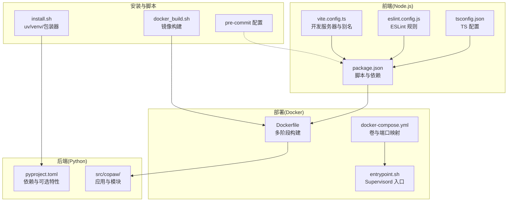
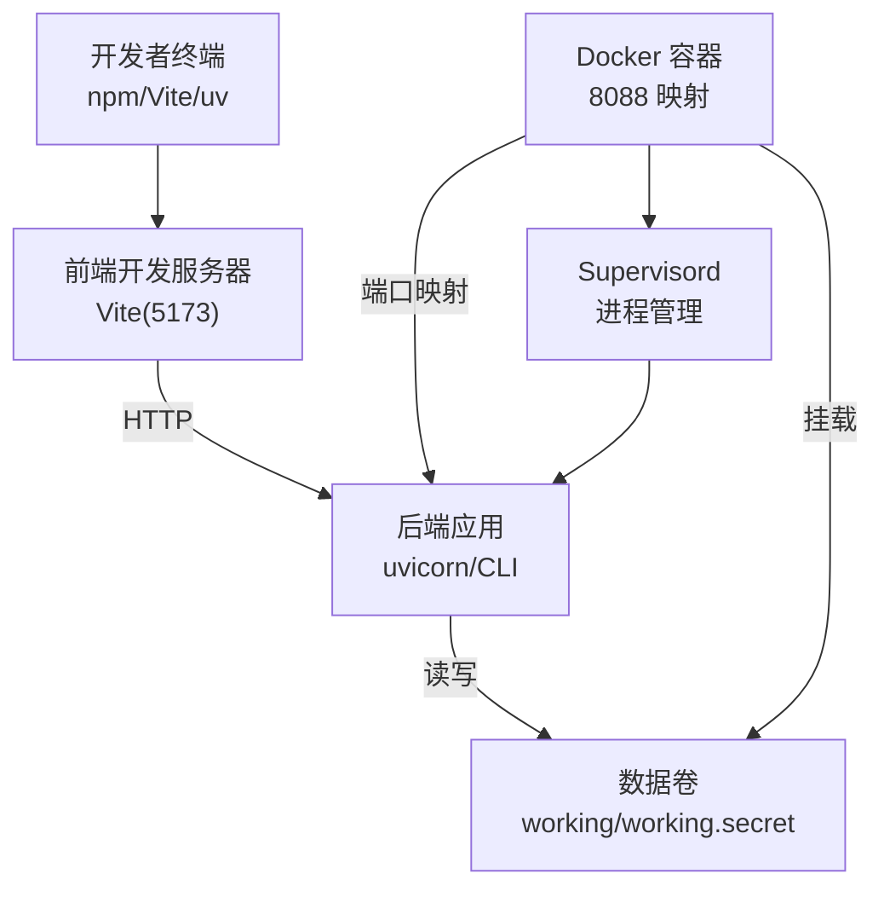
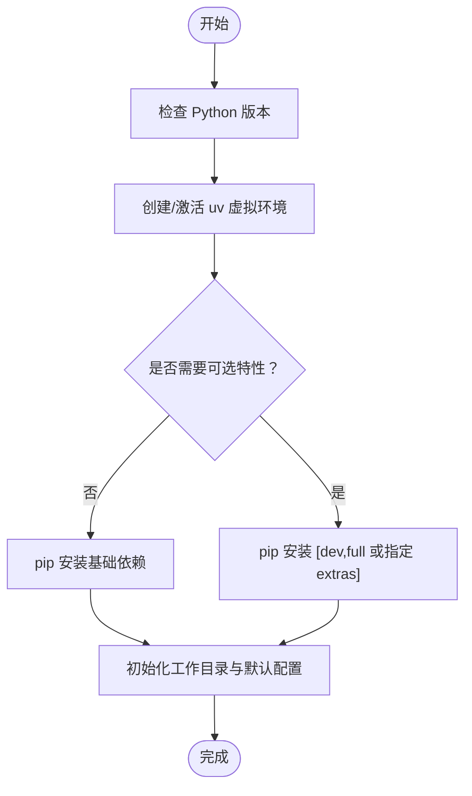
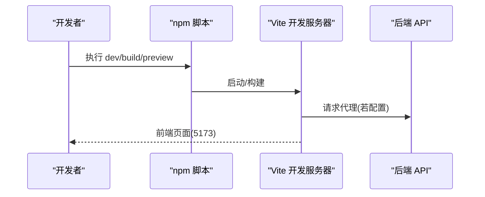
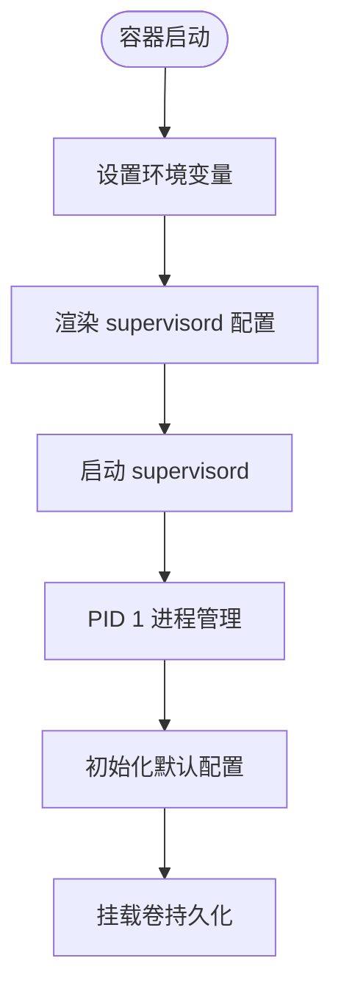
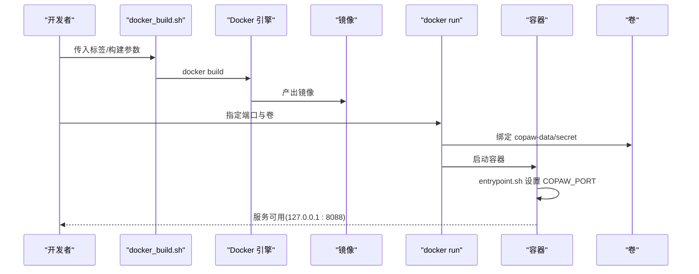
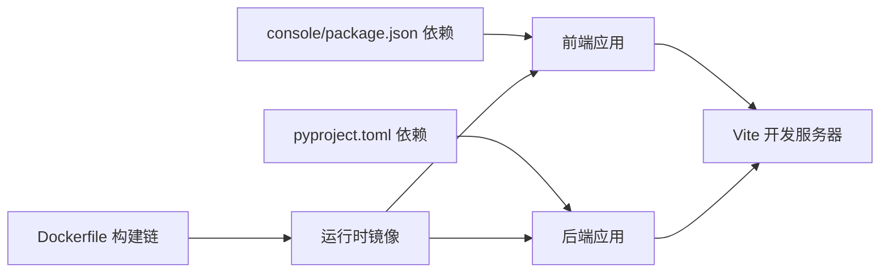

# 开发环境

<cite>
**本文引用的文件**
- [README.md](file://README.md)
- [pyproject.toml](file://copaw/pyproject.toml)
- [package.json](file://copaw/console/package.json)
- [vite.config.ts](file://copaw/console/vite.config.ts)
- [Dockerfile](file://copaw/deploy/Dockerfile)
- [docker-compose.yml](file://copaw/docker-compose.yml)
- [entrypoint.sh](file://copaw/deploy/entrypoint.sh)
- [install.sh](file://copaw/scripts/install.sh)
- [docker_build.sh](file://copaw/scripts/docker_build.sh)
- [.pre-commit-config.yaml](file://copaw/.pre-commit-config.yaml)
- [eslint.config.js](file://copaw/console/eslint.config.js)
- [tsconfig.json](file://copaw/console/tsconfig.json)
</cite>

## 目录
1. [简介](#简介)
2. [项目结构](#项目结构)
3. [核心组件](#核心组件)
4. [架构总览](#架构总览)
5. [详细组件分析](#详细组件分析)
6. [依赖分析](#依赖分析)
7. [性能考虑](#性能考虑)
8. [故障排查指南](#故障排查指南)
9. [结论](#结论)
10. [附录](#附录)

## 简介
本指南面向开发者，提供从零搭建 CoPaw 开发环境的完整流程，涵盖系统要求、依赖安装、Python 虚拟环境、Node.js 前端构建、Docker 开发环境、本地服务启动与调试、IDE 推荐配置以及常见问题排查。文档所有技术细节均来自仓库中的实际配置文件与脚本。

## 项目结构
CoPaw 采用前后端分离的典型工程化组织方式：
- 后端（Python）：位于 copaw/src/copaw 及其子模块，通过 pyproject.toml 管理依赖与可选特性。
- 前端（React + Vite）：位于 copaw/console，通过 package.json 管理依赖与脚本命令。
- 部署与容器：Dockerfile 多阶段构建前端并打包到后端包中；docker-compose 提供本地编排。
- 安装与脚本：install.sh 自动化安装与环境准备；docker_build.sh 构建镜像。
- 质量与规范：.pre-commit-config.yaml、eslint.config.js、tsconfig.json 等保障代码质量与类型安全。

图表来源
- [pyproject.toml:1-107](file://copaw/pyproject.toml#L1-L107)
- [package.json:1-60](file://copaw/console/package.json#L1-L60)
- [vite.config.ts:1-49](file://copaw/console/vite.config.ts#L1-L49)
- [Dockerfile:1-103](file://copaw/deploy/Dockerfile#L1-L103)
- [docker-compose.yml:1-23](file://copaw/docker-compose.yml#L1-L23)
- [entrypoint.sh:1-10](file://copaw/deploy/entrypoint.sh#L1-L10)
- [install.sh:1-340](file://copaw/scripts/install.sh#L1-L340)
- [.pre-commit-config.yaml:1-121](file://copaw/.pre-commit-config.yaml#L1-L121)

章节来源
- [README.md:438-460](file://README.md#L438-L460)
- [pyproject.toml:1-107](file://copaw/pyproject.toml#L1-L107)
- [package.json:1-60](file://copaw/console/package.json#L1-L60)
- [vite.config.ts:1-49](file://copaw/console/vite.config.ts#L1-L49)
- [Dockerfile:1-103](file://copaw/deploy/Dockerfile#L1-L103)
- [docker-compose.yml:1-23](file://copaw/docker-compose.yml#L1-L23)
- [entrypoint.sh:1-10](file://copaw/deploy/entrypoint.sh#L1-L10)
- [install.sh:1-340](file://copaw/scripts/install.sh#L1-L340)
- [.pre-commit-config.yaml:1-121](file://copaw/.pre-commit-config.yaml#L1-L121)

## 核心组件
- Python 运行时与包管理
  - Python 版本范围与核心依赖在 pyproject.toml 中定义；支持多种可选特性（如本地模型、Ollama、Whisper 等）。
- Node.js 前端工程
  - package.json 提供开发、构建、预览与格式化脚本；vite.config.ts 指定开发服务器主机与端口、CSS 预处理、路径别名等。
- Docker 容器化
  - Dockerfile 多阶段构建前端并注入到后端包；entrypoint.sh 注入环境变量并启动 supervisord；docker-compose 提供卷与端口映射。
- 安装与脚本
  - install.sh 使用 uv 创建隔离虚拟环境，自动选择镜像源，支持从源码或 PyPI 安装，并生成包装器脚本；docker_build.sh 支持自定义通道白/黑名单与构建参数。

章节来源
- [pyproject.toml:6-43](file://copaw/pyproject.toml#L6-L43)
- [package.json:6-17](file://copaw/console/package.json#L6-L17)
- [vite.config.ts:34-37](file://copaw/console/vite.config.ts#L34-L37)
- [Dockerfile:1-103](file://copaw/deploy/Dockerfile#L1-L103)
- [entrypoint.sh:1-10](file://copaw/deploy/entrypoint.sh#L1-L10)
- [install.sh:104-147](file://copaw/scripts/install.sh#L104-L147)
- [docker_build.sh:1-32](file://copaw/scripts/docker_build.sh#L1-L32)

## 架构总览
下图展示开发环境的关键交互：前端开发服务器、后端应用、容器入口与卷挂载、Supervisord 管理进程。

图表来源
- [vite.config.ts:34-37](file://copaw/console/vite.config.ts#L34-L37)
- [Dockerfile:94-102](file://copaw/deploy/Dockerfile#L94-L102)
- [docker-compose.yml:14-22](file://copaw/docker-compose.yml#L14-L22)
- [entrypoint.sh:5-9](file://copaw/deploy/entrypoint.sh#L5-L9)

## 详细组件分析

### Python 环境与依赖
- 版本与运行时
  - Python 版本要求：>=3.10,<3.14；推荐使用 uv 创建隔离虚拟环境，避免系统 Python 干扰。
- 依赖与可选特性
  - 核心依赖包括 HTTP 客户端、调度器、浏览器自动化、多渠道 SDK、模型推理库等；可选特性覆盖本地模型（llama.cpp、Ollama、Whisper）、MLX 等。
- 测试与质量
  - pytest 配置与标记；mypy、flake8、pylint、black、pre-commit 等工具链用于静态检查与格式化。

图表来源
- [pyproject.toml:6-43](file://copaw/pyproject.toml#L6-L43)
- [pyproject.toml:71-99](file://copaw/pyproject.toml#L71-L99)
- [install.sh:104-147](file://copaw/scripts/install.sh#L104-L147)
- [install.sh:233-241](file://copaw/scripts/install.sh#L233-L241)

章节来源
- [pyproject.toml:6-43](file://copaw/pyproject.toml#L6-L43)
- [pyproject.toml:71-99](file://copaw/pyproject.toml#L71-L99)
- [install.sh:104-147](file://copaw/scripts/install.sh#L104-L147)
- [install.sh:233-241](file://copaw/scripts/install.sh#L233-L241)

### Node.js 前端环境与构建
- 脚本与命令
  - 提供 dev/build/preview/format/lint 等脚本；开发服务器默认监听 0.0.0.0:5173。
- 配置与别名
  - Vite 配置包含 CSS Modules、Less、路径别名 @ 指向 src；可通过环境变量注入 API 基础地址。
- 类型与 ESLint
  - TypeScript 配置分 app/node 两份；ESLint 使用 TypeScript 插件与 React Hooks 规则。

图表来源
- [package.json:6-16](file://copaw/console/package.json#L6-L16)
- [vite.config.ts:34-37](file://copaw/console/vite.config.ts#L34-L37)
- [vite.config.ts:9-16](file://copaw/console/vite.config.ts#L9-L16)

章节来源
- [package.json:6-16](file://copaw/console/package.json#L6-L16)
- [vite.config.ts:1-49](file://copaw/console/vite.config.ts#L1-L49)
- [eslint.config.js:1-29](file://copaw/console/eslint.config.js#L1-L29)
- [tsconfig.json:1-8](file://copaw/console/tsconfig.json#L1-L8)

### 数据库与工作目录初始化
- 工作目录与默认配置
  - 容器镜像构建时执行初始化命令以生成默认配置与心跳文件；卷挂载保证持久化。
- 卷设计
  - working 与 working.secret 分离，便于权限控制与备份。

图表来源
- [Dockerfile:92-93](file://copaw/deploy/Dockerfile#L92-L93)
- [entrypoint.sh:5-9](file://copaw/deploy/entrypoint.sh#L5-L9)
- [docker-compose.yml:20-22](file://copaw/docker-compose.yml#L20-L22)

章节来源
- [Dockerfile:92-93](file://copaw/deploy/Dockerfile#L92-L93)
- [entrypoint.sh:1-10](file://copaw/deploy/entrypoint.sh#L1-L10)
- [docker-compose.yml:1-23](file://copaw/docker-compose.yml#L1-L23)

### Docker 开发环境与本地服务
- 镜像构建
  - 多阶段构建：先在 Node 基础镜像中构建前端，再复制到 Python 运行时镜像；注入 console 构建产物；安装后端包与可选特性。
- 运行与端口
  - 默认暴露 8088；通过 docker-compose 将宿主 127.0.0.1:8088:8088 映射到容器。
- 容器入口
  - entrypoint.sh 注入 COPAW_PORT 并启动 supervisord。

图表来源
- [docker_build.sh:1-32](file://copaw/scripts/docker_build.sh#L1-L32)
- [Dockerfile:1-103](file://copaw/deploy/Dockerfile#L1-L103)
- [docker-compose.yml:14-22](file://copaw/docker-compose.yml#L14-L22)
- [entrypoint.sh:5-9](file://copaw/deploy/entrypoint.sh#L5-L9)

章节来源
- [docker_build.sh:1-32](file://copaw/scripts/docker_build.sh#L1-L32)
- [Dockerfile:1-103](file://copaw/deploy/Dockerfile#L1-L103)
- [docker-compose.yml:1-23](file://copaw/docker-compose.yml#L1-L23)
- [entrypoint.sh:1-10](file://copaw/deploy/entrypoint.sh#L1-L10)

### 本地服务启动与调试
- 本地安装与启动
  - 使用 install.sh 自动创建虚拟环境并安装包；首次运行需初始化配置；随后启动应用。
- 前端开发
  - 在 copaw/console 目录执行开发脚本，访问 5173 端口；如需代理后端，可在 Vite 中配置代理或使用 Console 的 API 基础地址。
- 容器调试
  - 通过 docker-compose 挂载卷持久化；进入容器查看日志与状态；必要时调整 supervisord 配置。

章节来源
- [install.sh:233-241](file://copaw/scripts/install.sh#L233-L241)
- [vite.config.ts:34-37](file://copaw/console/vite.config.ts#L34-L37)
- [docker-compose.yml:14-22](file://copaw/docker-compose.yml#L14-L22)

### IDE 推荐设置与开发工具链
- 代码风格与静态检查
  - black、flake8、pylint、mypy、prettier、ESLint；建议在 IDE 中启用实时检查与保存时格式化。
- Git 钩子
  - pre-commit 配置包含语法检查、YAML/JSON/XML 校验、类型检查、代码格式化等，建议在本地启用。
- TypeScript 与 ESLint
  - 使用 tsconfig.json 的引用结构；ESLint 配置启用 React Hooks 与刷新规则。

章节来源
- [.pre-commit-config.yaml:1-121](file://copaw/.pre-commit-config.yaml#L1-L121)
- [eslint.config.js:1-29](file://copaw/console/eslint.config.js#L1-L29)
- [tsconfig.json:1-8](file://copaw/console/tsconfig.json#L1-L8)

## 依赖分析
- 后端依赖关系
  - 核心库：HTTP 客户端、调度器、浏览器自动化、多渠道 SDK、模型推理库；可选特性按平台与场景拆分。
- 前端依赖关系
  - React 生态、Ant Design、路由、Markdown 渲染、状态管理；开发工具链包括 Vite、TypeScript、ESLint、Prettier。
- 容器依赖关系
  - 前端构建依赖 Node 基础镜像；运行时依赖 Python venv 与系统 Chromium；Supervisord 管理进程生命周期。

图表来源
- [pyproject.toml:7-43](file://copaw/pyproject.toml#L7-L43)
- [package.json:18-57](file://copaw/console/package.json#L18-L57)
- [Dockerfile:1-103](file://copaw/deploy/Dockerfile#L1-L103)

章节来源
- [pyproject.toml:7-43](file://copaw/pyproject.toml#L7-L43)
- [package.json:18-57](file://copaw/console/package.json#L18-L57)
- [Dockerfile:1-103](file://copaw/deploy/Dockerfile#L1-L103)

## 性能考虑
- 前端开发性能
  - 使用 Vite 的快速冷启动与按需依赖优化；生产构建开启压缩与作用域样式。
- 容器性能
  - 多阶段构建减少镜像体积；Playwright 使用系统 Chromium，避免重复下载；无沙箱模式在容器内启用。
- Python 性能
  - 选择合适的本地模型后端（llama.cpp、Ollama）并合理配置并发与缓存策略。

## 故障排查指南
- 安装失败（uv 未找到）
  - install.sh 会尝试自动安装 uv；若失败，请手动安装并确保 PATH 包含 uv。
- 前端构建缺失
  - 若未提供 console/dist，install.sh 会尝试 npm ci && npm run build；若 npm 不可用，需先安装 Node.js。
- Docker 端口冲突
  - 修改 docker-compose 的 hostPort 或停止占用端口的服务。
- 容器内访问宿主服务
  - 使用 --add-host=host.docker.internal:host-gateway 或 Linux host 网络模式；在 Console 设置中将 Base URL 指向 host.docker.internal。
- 权限与卷
  - 确保 copaw-data 与 copaw-secrets 卷存在且有写权限；必要时重新创建命名卷。

章节来源
- [install.sh:104-132](file://copaw/scripts/install.sh#L104-L132)
- [install.sh:181-206](file://copaw/scripts/install.sh#L181-L206)
- [docker-compose.yml:14-22](file://copaw/docker-compose.yml#L14-L22)
- [README.md:251-274](file://README.md#L251-L274)

## 结论
通过本指南，开发者可以基于 uv 与 npm 的现代工具链快速搭建 CoPaw 开发环境，结合 Docker 实现一致的本地与生产运行体验。建议在本地启用 pre-commit 与 IDE 静态检查，确保代码质量与一致性。

## 附录
- 快速命令索引
  - 安装：curl -fsSL https://copaw.agentscope.io/install.sh | bash
  - 本地启动：copaw init --defaults && copaw app
  - 前端开发：cd copaw/console && npm run dev
  - 构建镜像：bash scripts/docker_build.sh copaw:latest
  - 启动容器：docker-compose up -d