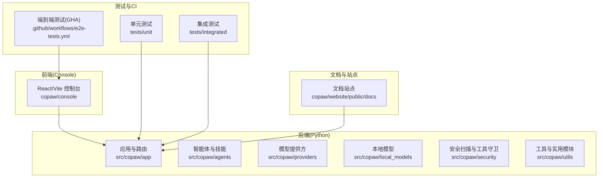
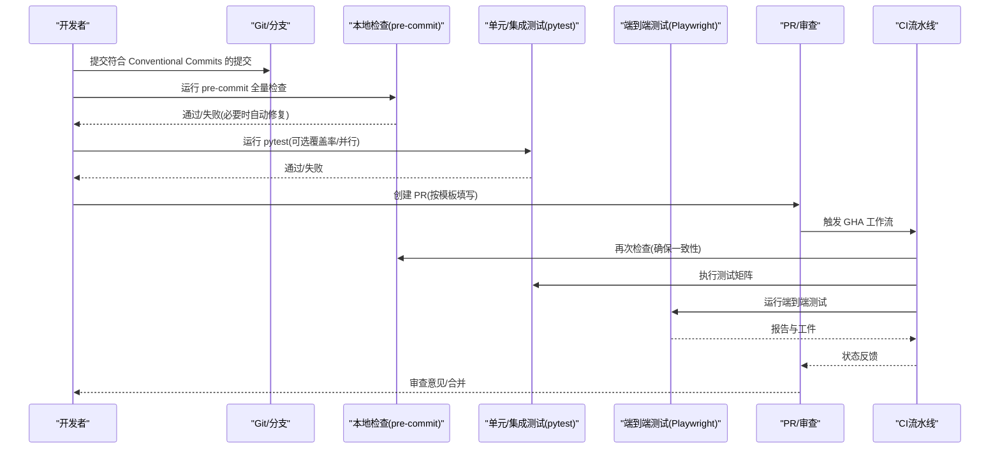
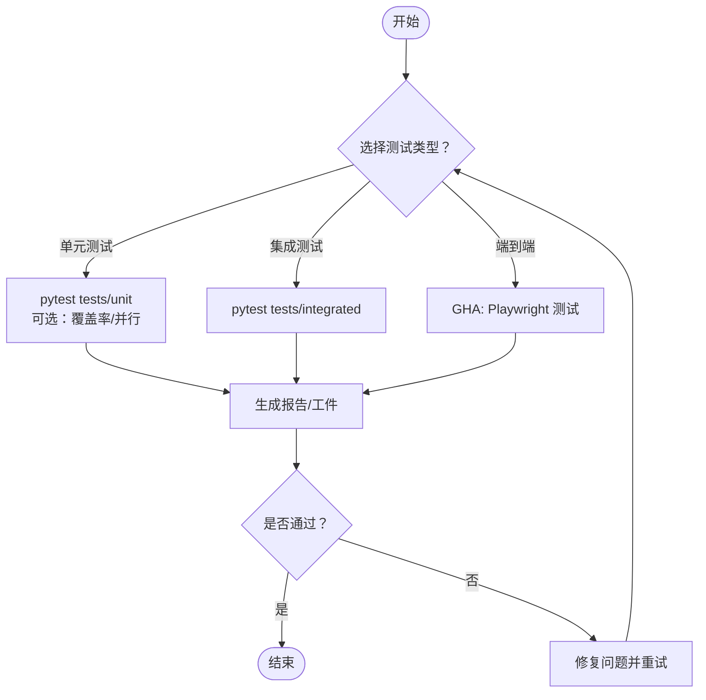
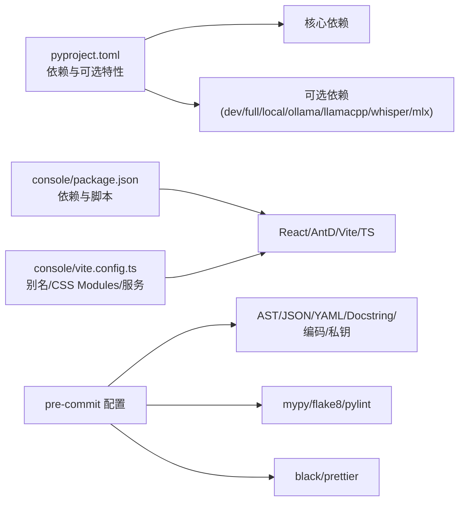

# 开发者指南

<cite>
**本文引用的文件**   
- [CONTRIBUTING.md](file://copaw/CONTRIBUTING.md)
- [README.md](file://copaw/README.md)
- [.pre-commit-config.yaml](file://copaw/.pre-commit-config.yaml)
- [.flake8](file://copaw/.flake8)
- [pyproject.toml](file://copaw/pyproject.toml)
- [eslint.config.js](file://copaw/console/eslint.config.js)
- [package.json](file://copaw/console/package.json)
- [vite.config.ts](file://copaw/console/vite.config.ts)
- [run_tests.py](file://copaw/scripts/run_tests.py)
- [test_app_startup.py](file://copaw/tests/integrated/test_app_startup.py)
- [e2e-tests.yml](file://.github/workflows/e2e-tests.yml)
- [PULL_REQUEST_TEMPLATE.md](file://copaw/.github/PULL_REQUEST_TEMPLATE.md)
- [contributing.zh.md](file://copaw/website/public/docs/contributing.zh.md)
- [__version__.py](file://copaw/src/copaw/__version__.py)
</cite>

## 目录
1. [简介](#简介)
2. [项目结构](#项目结构)
3. [核心组件](#核心组件)
4. [架构总览](#架构总览)
5. [详细组件分析](#详细组件分析)
6. [依赖关系分析](#依赖关系分析)
7. [性能考量](#性能考量)
8. [故障排查指南](#故障排查指南)
9. [结论](#结论)
10. [附录](#附录)

## 简介
本指南面向贡献者与维护者，系统性介绍代码规范、编程风格、测试策略、CI/CD 流程、Pull Request 审查与合并策略、文档与 API 注释规范、调试与性能分析方法，以及新贡献者的快速上手步骤。内容基于仓库中的贡献文档、测试脚本、构建与质量工具配置、前端工程配置与工作流文件整理而成。

## 项目结构
本仓库采用多模块组织方式：
- 后端 Python 包：src/copaw 下的主包，包含应用、通道、技能、提供方、本地模型、安全扫描与工具守卫等子系统。
- 前端控制台：console 子项目，使用 React + Vite，打包产物复制到后端包内供 Web UI 使用。
- 测试：tests/unit 与 tests/integrated，分别覆盖单元与集成测试；另有 GitHub Actions 端到端测试工作流。
- 文档与网站：website/public/docs 下的文档与站点资源。
- 脚本：scripts/ 下提供本地测试运行器与打包脚本等辅助工具。
- 配置：pyproject.toml、.pre-commit-config.yaml、eslint.config.js、vite.config.ts 等。

图表来源
- [pyproject.toml:1-107](file://copaw/pyproject.toml#L1-L107)
- [run_tests.py:1-282](file://copaw/scripts/run_tests.py#L1-L282)
- [e2e-tests.yml:1-80](file://.github/workflows/e2e-tests.yml#L1-L80)

章节来源
- [pyproject.toml:1-107](file://copaw/pyproject.toml#L1-L107)
- [run_tests.py:1-282](file://copaw/scripts/run_tests.py#L1-L282)
- [e2e-tests.yml:1-80](file://.github/workflows/e2e-tests.yml#L1-L80)

## 核心组件
- 质量门禁与本地检查：pre-commit 集成 AST/JSON/YAML/文档字符串校验、mypy 类型检查、black 与 flake8 代码风格、pylint 静态分析、prettier 前端格式化。
- 测试体系：pytest 驱动的单元与集成测试，支持覆盖率与并行执行；本地测试脚本提供便捷入口；GHA 端到端测试使用 Playwright。
- 构建与打包：Python 包含前端静态资源；Vite 构建前端并输出至后端包目录；脚本可一键安装与启动。
- 文档与国际化：贡献指南与文档站点双语支持；PR 模板与 Conventional Commits 规范统一。

章节来源
- [.pre-commit-config.yaml:1-121](file://copaw/.pre-commit-config.yaml#L1-L121)
- [pyproject.toml:101-107](file://copaw/pyproject.toml#L101-L107)
- [run_tests.py:148-173](file://copaw/scripts/run_tests.py#L148-L173)
- [e2e-tests.yml:1-80](file://.github/workflows/e2e-tests.yml#L1-L80)
- [CONTRIBUTING.md:23-86](file://copaw/CONTRIBUTING.md#L23-L86)

## 架构总览
从开发到发布的典型流程如下：

图表来源
- [CONTRIBUTING.md:23-86](file://copaw/CONTRIBUTING.md#L23-L86)
- [.pre-commit-config.yaml:1-121](file://copaw/.pre-commit-config.yaml#L1-L121)
- [run_tests.py:175-282](file://copaw/scripts/run_tests.py#L175-L282)
- [e2e-tests.yml:1-80](file://.github/workflows/e2e-tests.yml#L1-L80)

章节来源
- [CONTRIBUTING.md:23-86](file://copaw/CONTRIBUTING.md#L23-L86)
- [.pre-commit-config.yaml:1-121](file://copaw/.pre-commit-config.yaml#L1-L121)
- [run_tests.py:175-282](file://copaw/scripts/run_tests.py#L175-L282)
- [e2e-tests.yml:1-80](file://.github/workflows/e2e-tests.yml#L1-L80)

## 详细组件分析

### 代码规范与编程风格
- Python 风格
  - 使用 flake8 限制行宽与忽略特定规则；mypy 作为类型检查补充；pylint 用于静态分析，针对文档与快速开发场景放宽部分规则。
  - 推荐遵循 Black 代码风格，行宽 79。
- 前端风格
  - ESLint 配置基于 TypeScript/React Hooks/Refresh 规则；Prettier 统一格式化；Vite 别名与 CSS Modules 配置明确。
- 文档与提交
  - Conventional Commits 规范用于提交信息与 PR 标题；贡献指南提供中文与英文版本。

章节来源
- [.flake8:1-12](file://copaw/.flake8#L1-L12)
- [.pre-commit-config.yaml:54-121](file://copaw/.pre-commit-config.yaml#L54-L121)
- [eslint.config.js:1-29](file://copaw/console/eslint.config.js#L1-L29)
- [package.json:41-57](file://copaw/console/package.json#L41-L57)
- [vite.config.ts:1-49](file://copaw/console/vite.config.ts#L1-L49)
- [CONTRIBUTING.md:23-67](file://copaw/CONTRIBUTING.md#L23-L67)
- [contributing.zh.md:21-87](file://copaw/website/public/docs/contributing.zh.md#L21-L87)

### 开发流程与分支策略
- 分支建议
  - 基于 main/master 分支创建特性分支；功能完成后合并回主分支。
- 提交与 PR
  - 提交信息遵循 Conventional Commits；PR 模板要求列出受影响组件、测试方法与本地验证证据。
- 本地门禁
  - 安装开发依赖后，先运行 pre-commit 全量检查，再运行 pytest；若 pre-commit 自动修复文件需再次检查直至通过。

章节来源
- [CONTRIBUTING.md:15-22](file://copaw/CONTRIBUTING.md#L15-L22)
- [CONTRIBUTING.md:23-86](file://copaw/CONTRIBUTING.md#L23-L86)
- [PULL_REQUEST_TEMPLATE.md:1-54](file://copaw/.github/PULL_REQUEST_TEMPLATE.md#L1-L54)

### 版本管理与发布
- 版本号位置：后端包版本由 __version__.py 提供，pyproject.toml 动态读取。
- 发布建议：遵循语义化版本；在 PR/提交信息中体现变更类型；更新相关文档与发布说明。

章节来源
- [__version__.py:1-3](file://copaw/src/copaw/__version__.py#L1-L3)
- [pyproject.toml:45-46](file://copaw/pyproject.toml#L45-L46)

### 单元测试、集成测试与端到端测试
- 单元测试
  - pytest 配置与标记；本地测试脚本支持按子目录运行、覆盖率与并行执行。
- 集成测试
  - 示例：应用启动与控制台可用性测试，验证后端健康接口与前端 HTML 返回。
- 端到端测试
  - GHA 工作流：在 push/pr 时触发，安装 Node 与 Playwright 依赖，运行测试并上传报告工件。

图表来源
- [run_tests.py:175-282](file://copaw/scripts/run_tests.py#L175-L282)
- [test_app_startup.py:33-133](file://copaw/tests/integrated/test_app_startup.py#L33-L133)
- [e2e-tests.yml:40-80](file://.github/workflows/e2e-tests.yml#L40-L80)

章节来源
- [run_tests.py:175-282](file://copaw/scripts/run_tests.py#L175-L282)
- [test_app_startup.py:33-133](file://copaw/tests/integrated/test_app_startup.py#L33-L133)
- [e2e-tests.yml:1-80](file://.github/workflows/e2e-tests.yml#L1-L80)

### Pull Request 流程、代码审查与合并策略
- PR 模板
  - 明确描述、关联 Issue、安全注意事项、组件影响范围、检查清单、测试方法与本地验证证据。
- 审查要点
  - 代码风格与质量门禁必须通过；前后端变更需注意格式化与构建产物；文档同步更新。
- 合并策略
  - pre-commit 与测试失败的 PR 不得合并；审查通过后方可合并。

章节来源
- [PULL_REQUEST_TEMPLATE.md:1-54](file://copaw/.github/PULL_REQUEST_TEMPLATE.md#L1-L54)
- [CONTRIBUTING.md:79-86](file://copaw/CONTRIBUTING.md#L79-L86)

### 文档编写规范与 API 注释标准
- 文档位置与语言：贡献指南与文档站点双语；新增或变更用户行为需同步更新文档。
- API 注释
  - Python：推荐使用 Google/NumPy 风格的 docstring；保持简洁、准确、包含参数与返回值说明。
  - 前端：TypeScript 类型声明清晰；组件与 Hook 注释明确用途与调用约束。

章节来源
- [CONTRIBUTING.md:85](file://copaw/CONTRIBUTING.md#L85)
- [contributing.zh.md:86](file://copaw/website/public/docs/contributing.zh.md#L86)

### 调试技巧、性能分析与问题排查
- 调试
  - 应用启动测试包含日志采集与错误定位逻辑，便于发现依赖缺失或初始化异常。
  - 前端开发服务器默认监听所有地址，便于容器或跨机联调。
- 性能
  - 本地测试脚本支持并行执行；建议在 CI 中使用矩阵测试覆盖关键路径。
- 排查
  - GHA 端到端测试上传报告与结果工件，便于定位 UI/集成问题。
  - 前端构建别名与 CSS Modules 配置有助于定位样式与模块解析问题。

章节来源
- [test_app_startup.py:33-133](file://copaw/tests/integrated/test_app_startup.py#L33-L133)
- [vite.config.ts:34-41](file://copaw/console/vite.config.ts#L34-L41)
- [e2e-tests.yml:70-80](file://.github/workflows/e2e-tests.yml#L70-L80)

### 贡献流程、问题报告与功能请求
- 贡献流程
  - 查看 Issues 与路线图；无对应 Issue 时先开 Issue 讨论；遵循提交信息与 PR 模板规范。
- 问题报告
  - 提供最小复现、环境信息、日志片段与期望行为。
- 功能请求
  - 描述使用场景、收益与实现建议；优先选择“寻求贡献”的任务。

章节来源
- [CONTRIBUTING.md:15-22](file://copaw/CONTRIBUTING.md#L15-L22)
- [contributing.zh.md:9-20](file://copaw/website/public/docs/contributing.zh.md#L9-L20)

### 新贡献者快速上手
- 环境准备
  - 安装 Python 3.10–3.13；安装开发依赖与前端工具链。
- 本地运行
  - 构建前端控制台并复制到后端包；安装可编辑包；运行 copaw init 与 copaw app。
- 质量门禁
  - 安装并运行 pre-commit；确保通过；运行 pytest；必要时生成覆盖率报告。
- 提交与 PR
  - 使用 Conventional Commits；填写 PR 模板；附带本地验证证据与测试结果。

章节来源
- [README.md:438-460](file://copaw/README.md#L438-L460)
- [CONTRIBUTING.md:70-86](file://copaw/CONTRIBUTING.md#L70-L86)
- [run_tests.py:175-282](file://copaw/scripts/run_tests.py#L175-L282)

## 依赖关系分析
- Python 依赖与可选特性
  - 核心依赖包括 HTTP 客户端、调度器、浏览器自动化、SDK 等；可选依赖覆盖本地模型、Ollama、Whisper、MLX 等。
- 前端依赖
  - React 生态与 Ant Design 组件库；Vite 与 TypeScript；ESLint/Prettier 保障一致性。
- 质量工具
  - pre-commit 集成多类检查器，覆盖语法、类型、风格与私钥检测。

图表来源
- [pyproject.toml:1-107](file://copaw/pyproject.toml#L1-L107)
- [package.json:18-57](file://copaw/console/package.json#L18-L57)
- [vite.config.ts:1-49](file://copaw/console/vite.config.ts#L1-L49)
- [.pre-commit-config.yaml:1-121](file://copaw/.pre-commit-config.yaml#L1-L121)

章节来源
- [pyproject.toml:1-107](file://copaw/pyproject.toml#L1-L107)
- [package.json:18-57](file://copaw/console/package.json#L18-L57)
- [vite.config.ts:1-49](file://copaw/console/vite.config.ts#L1-L49)
- [.pre-commit-config.yaml:1-121](file://copaw/.pre-commit-config.yaml#L1-L121)

## 性能考量
- 测试并行化：本地测试脚本支持 pytest-xdist 并行执行，缩短回归时间。
- 构建优化：Vite 优化依赖与 CSS Modules 配置，减少打包体积与样式冲突。
- CI 矩阵：建议在 CI 中增加不同平台/Python 版本矩阵，提升稳定性与覆盖率。

章节来源
- [run_tests.py:165-167](file://copaw/scripts/run_tests.py#L165-L167)
- [vite.config.ts:38-41](file://copaw/console/vite.config.ts#L38-L41)

## 故障排查指南
- 启动失败
  - 关注应用启动测试中的日志采集与错误定位；检查依赖缺失与端口占用。
- 前端问题
  - 使用 Vite 开发服务器预览模式；检查别名与样式模块命名；确认构建产物复制正确。
- 测试失败
  - 本地先运行 pytest；若失败，结合覆盖率报告定位未覆盖路径；在 CI 中查看端到端测试报告工件。

章节来源
- [test_app_startup.py:33-133](file://copaw/tests/integrated/test_app_startup.py#L33-L133)
- [e2e-tests.yml:70-80](file://.github/workflows/e2e-tests.yml#L70-L80)

## 结论
本指南总结了从代码规范、测试策略到 CI/CD、文档与贡献流程的完整开发实践。建议团队在日常工作中坚持 pre-commit 与 pytest 的本地门禁，配合 GHA 端到端测试，确保高质量交付与可维护性。

## 附录
- 常用命令
  - 安装开发依赖与运行测试：参见贡献指南与本地测试脚本。
  - 前端格式化与构建：参见 console/package.json 脚本与 vite.config.ts。
- 质量工具配置
  - flake8、mypy、pylint、black、prettier、ESLint 规则详见各配置文件。

章节来源
- [CONTRIBUTING.md:70-86](file://copaw/CONTRIBUTING.md#L70-L86)
- [run_tests.py:175-282](file://copaw/scripts/run_tests.py#L175-L282)
- [package.json:6-16](file://copaw/console/package.json#L6-L16)
- [vite.config.ts:11-41](file://copaw/console/vite.config.ts#L11-L41)
- [.pre-commit-config.yaml:1-121](file://copaw/.pre-commit-config.yaml#L1-L121)