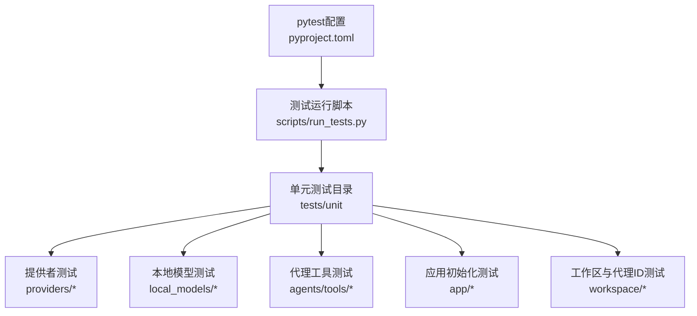
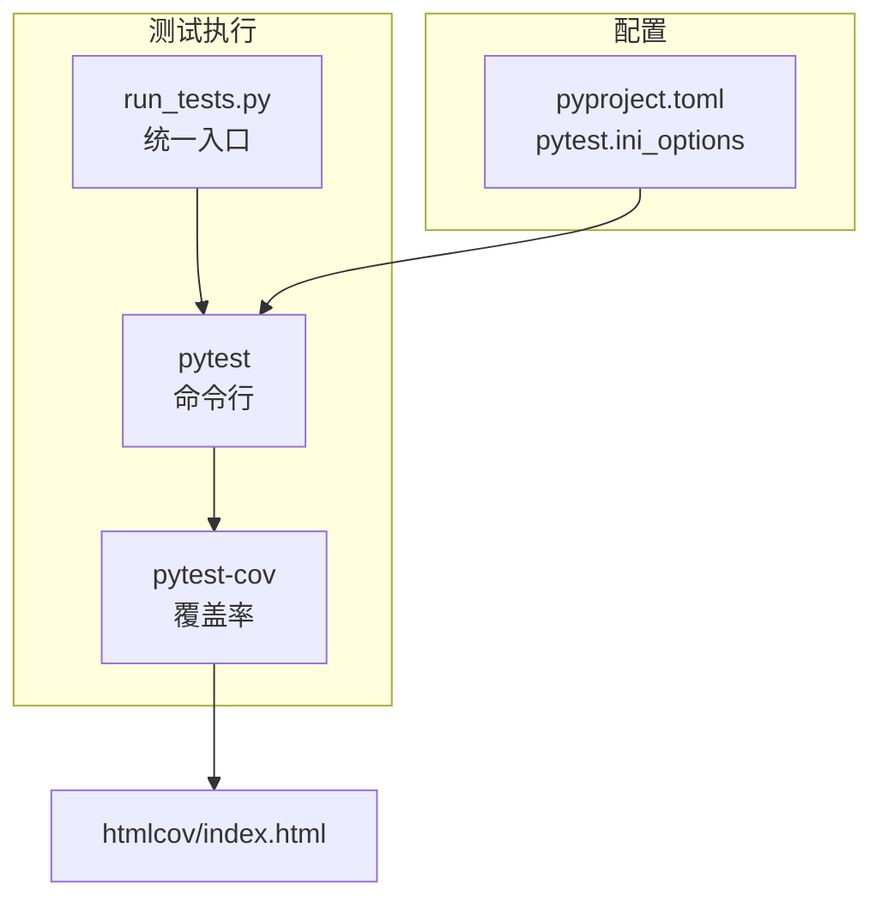
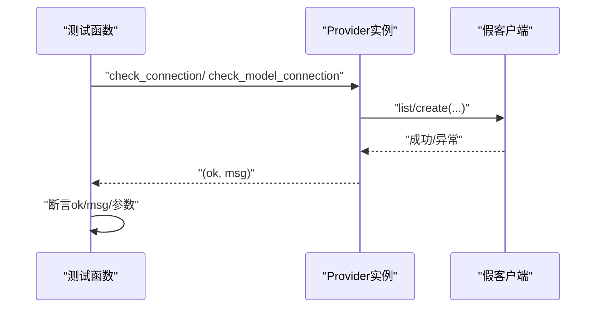
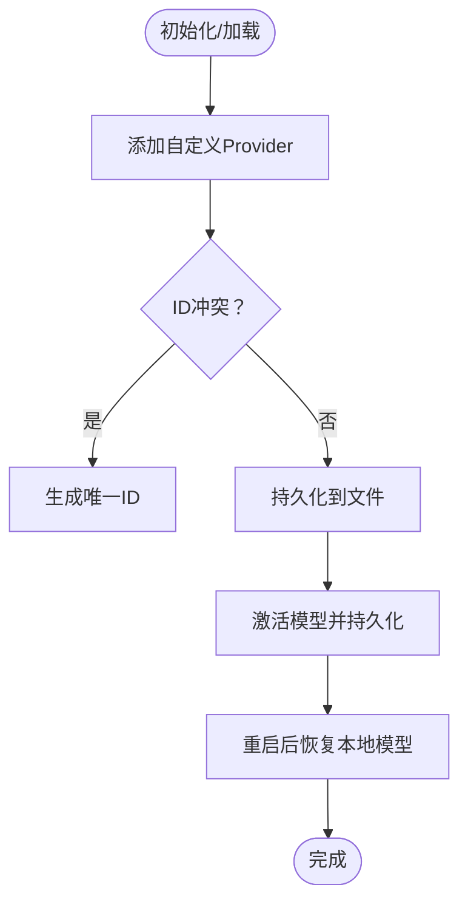
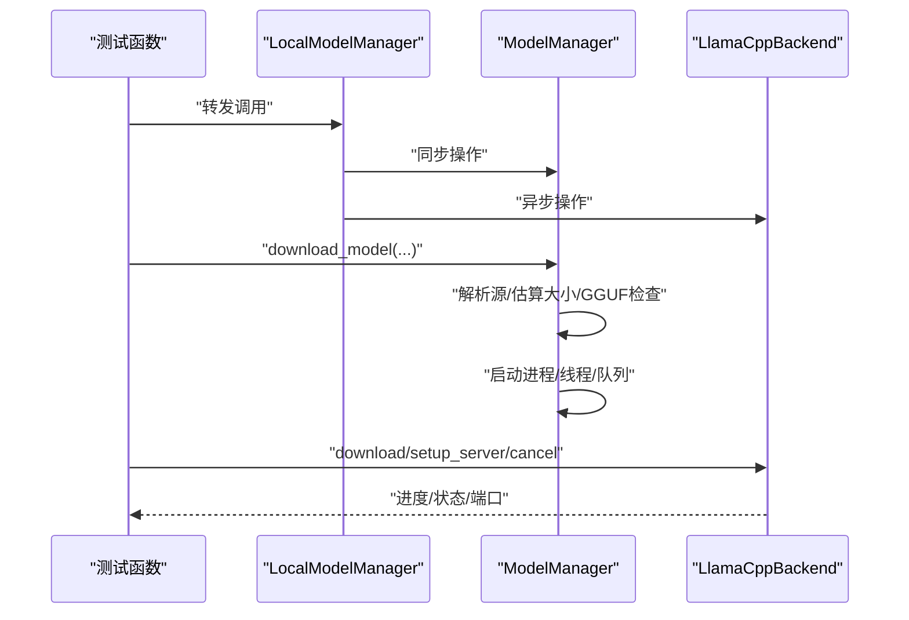
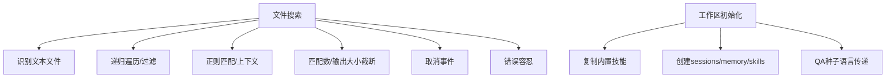
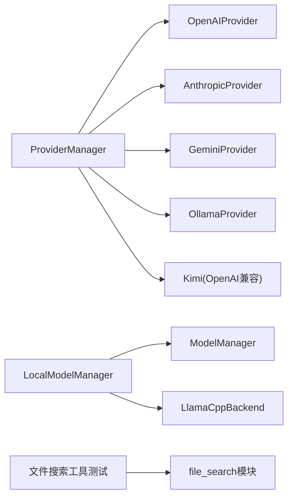

# 单元测试

<cite>
**本文引用的文件**
- [pyproject.toml](file://copaw/pyproject.toml)
- [run_tests.py](file://copaw/scripts/run_tests.py)
- [test_openai_provider.py](file://copaw/tests/unit/providers/test_openai_provider.py)
- [test_provider_manager.py](file://copaw/tests/unit/providers/test_provider_manager.py)
- [test_anthropic_provider.py](file://copaw/tests/unit/providers/test_anthropic_provider.py)
- [test_gemini_provider.py](file://copaw/tests/unit/providers/test_gemini_provider.py)
- [test_ollama_provider.py](file://copaw/tests/unit/providers/test_ollama_provider.py)
- [test_kimi_provider.py](file://copaw/tests/unit/providers/test_kimi_provider.py)
- [test_local_model_manager.py](file://copaw/tests/unit/local_models/test_local_model_manager.py)
- [test_model_manager.py](file://copaw/tests/unit/local_models/test_model_manager.py)
- [test_llamacpp_backend.py](file://copaw/tests/unit/local_models/test_llamacpp_backend.py)
- [test_file_search.py](file://copaw/tests/unit/agents/tools/test_file_search.py)
- [test_agents_workspace_initialization.py](file://copaw/tests/unit/app/test_agents_workspace_initialization.py)
- [test_agent_creation.py](file://copaw/tests/unit/workspace/test_agent_creation.py)
</cite>

## 目录
1. [简介](#简介)
2. [项目结构](#项目结构)
3. [核心组件](#核心组件)
4. [架构总览](#架构总览)
5. [详细组件分析](#详细组件分析)
6. [依赖分析](#依赖分析)
7. [性能考虑](#性能考虑)
8. [故障排查指南](#故障排查指南)
9. [结论](#结论)
10. [附录](#附录)

## 简介
本文件面向开发者，系统性介绍CoPaw项目的单元测试体系与最佳实践，涵盖以下要点：
- pytest框架基础：测试函数编写、参数化测试、fixture使用
- 核心组件测试方法：AI模型提供者（OpenAI、Anthropic、Gemini、Ollama、Kimi）、本地模型管理器、代理工具与工作区初始化
- mock对象与测试数据：如何通过monkeypatch、SimpleNamespace、临时目录与环境变量模拟外部依赖
- 测试覆盖率与代码质量：pytest-cov配置、标记与并行执行
- 实战示例：以具体测试文件为线索，给出可复用的测试模式与断言策略

## 项目结构
CoPaw的测试采用按功能域分层组织：
- tests/unit：按子模块划分（providers、local_models、agents、app、workspace等）
- tests/integrated：端到端集成测试（本文件不展开）
- 脚本：scripts/run_tests.py 提供统一测试入口，支持覆盖率、并行执行与子目录选择

图示来源
- [pyproject.toml:101-107](file://copaw/pyproject.toml#L101-L107)
- [run_tests.py:148-173](file://copaw/scripts/run_tests.py#L148-L173)

章节来源
- [pyproject.toml:101-107](file://copaw/pyproject.toml#L101-L107)
- [run_tests.py:175-282](file://copaw/scripts/run_tests.py#L175-L282)

## 核心组件
本节从测试视角总结关键组件及其实现要点，帮助快速定位相关测试文件与模式。

- AI模型提供者（Provider）
  - OpenAIProvider：连接检查、模型列表拉取、单模型连通性校验、配置更新与信息导出
  - AnthropicProvider：连接检查、模型列表拉取、消息流连通性校验、配置更新
  - GeminiProvider：异步客户端适配、模型列表与内容生成流连通性校验、异常处理
  - OllamaProvider：URL规范化、环境变量加载、客户端构造与聊天模型实例化
  - Kimi内置Provider：基于OpenAI兼容实现，注册到ProviderManager并可激活模型
- ProviderManager
  - 自定义Provider增删改查、持久化与冲突处理、激活模型持久化、遗留配置迁移、本地模型恢复
- 本地模型管理（Local Models）
  - LocalModelManager：转发同步/异步调用至底层实现（下载、进度、服务器生命周期）
  - ModelManager：下载流程（源解析、大小估算、GGUF存在性检查、队列/进程/线程调度、取消清理）
  - LlamaCppBackend：二进制下载与解压、进度轮询、取消、服务器启动/关闭、跨平台兼容
- 代理工具与工作区
  - 文件搜索工具：文本文件识别、递归grep、上下文行控制、匹配截断、取消事件、错误容忍
  - 工作区初始化：内置技能复制、目录结构校验、QA种子语言传递
  - 代理ID生成：短UUID生成、冲突重试、保留关键字

章节来源
- [test_openai_provider.py:1-269](file://copaw/tests/unit/providers/test_openai_provider.py#L1-L269)
- [test_provider_manager.py:1-474](file://copaw/tests/unit/providers/test_provider_manager.py#L1-L474)
- [test_anthropic_provider.py:1-189](file://copaw/tests/unit/providers/test_anthropic_provider.py#L1-L189)
- [test_gemini_provider.py:1-341](file://copaw/tests/unit/providers/test_gemini_provider.py#L1-L341)
- [test_ollama_provider.py:1-141](file://copaw/tests/unit/providers/test_ollama_provider.py#L1-L141)
- [test_kimi_provider.py:1-132](file://copaw/tests/unit/providers/test_kimi_provider.py#L1-L132)
- [test_local_model_manager.py:1-147](file://copaw/tests/unit/local_models/test_local_model_manager.py#L1-L147)
- [test_model_manager.py:1-366](file://copaw/tests/unit/local_models/test_model_manager.py#L1-L366)
- [test_llamacpp_backend.py:1-887](file://copaw/tests/unit/local_models/test_llamacpp_backend.py#L1-L887)
- [test_file_search.py:1-737](file://copaw/tests/unit/agents/tools/test_file_search.py#L1-L737)
- [test_agents_workspace_initialization.py:1-109](file://copaw/tests/unit/app/test_agents_workspace_initialization.py#L1-L109)
- [test_agent_creation.py:1-87](file://copaw/tests/unit/workspace/test_agent_creation.py#L1-L87)

## 架构总览
下图展示测试运行与覆盖率生成的关键路径，以及与pytest配置的关系。

图示来源
- [run_tests.py:148-173](file://copaw/scripts/run_tests.py#L148-L173)
- [pyproject.toml:101-107](file://copaw/pyproject.toml#L101-L107)

## 详细组件分析

### 提供者测试（Provider）模式
- 连接检查与异常处理
  - 使用monkeypatch注入假客户端，验证APIError与通用异常分支
  - 断言返回值布尔状态与消息内容
- 模型列表与去重
  - 输入包含重复/无效条目，断言输出被规范化与去重
- 单模型连通性
  - 断言请求参数（超时、最大token、流式等）与消息内容
- 配置更新
  - 非None字段更新，None字段跳过；自定义Provider允许更新chat_model等

图示来源
- [test_openai_provider.py:21-58](file://copaw/tests/unit/providers/test_openai_provider.py#L21-L58)
- [test_anthropic_provider.py:21-59](file://copaw/tests/unit/providers/test_anthropic_provider.py#L21-L59)
- [test_gemini_provider.py:41-77](file://copaw/tests/unit/providers/test_gemini_provider.py#L41-L77)

章节来源
- [test_openai_provider.py:1-269](file://copaw/tests/unit/providers/test_openai_provider.py#L1-L269)
- [test_anthropic_provider.py:1-189](file://copaw/tests/unit/providers/test_anthropic_provider.py#L1-L189)
- [test_gemini_provider.py:1-341](file://copaw/tests/unit/providers/test_gemini_provider.py#L1-L341)
- [test_ollama_provider.py:1-141](file://copaw/tests/unit/providers/test_ollama_provider.py#L1-L141)
- [test_kimi_provider.py:1-132](file://copaw/tests/unit/providers/test_kimi_provider.py#L1-L132)

### ProviderManager测试要点
- 自定义Provider增删改查与冲突处理
- 激活模型持久化与重载一致性
- 遗留配置迁移（providers.json）与新格式对比
- 本地模型恢复：安装状态、下载状态、服务器端口与URL更新
- 内置Provider（如Kimi）注册与可用模型校验

图示来源
- [test_provider_manager.py:86-125](file://copaw/tests/unit/providers/test_provider_manager.py#L86-L125)
- [test_provider_manager.py:127-157](file://copaw/tests/unit/providers/test_provider_manager.py#L127-L157)
- [test_provider_manager.py:159-206](file://copaw/tests/unit/providers/test_provider_manager.py#L159-L206)
- [test_kimi_provider.py:58-71](file://copaw/tests/unit/providers/test_kimi_provider.py#L58-L71)

章节来源
- [test_provider_manager.py:1-474](file://copaw/tests/unit/providers/test_provider_manager.py#L1-L474)
- [test_kimi_provider.py:1-132](file://copaw/tests/unit/providers/test_kimi_provider.py#L1-L132)

### 本地模型管理测试要点
- LocalModelManager
  - 同步/异步接口转发：安装检测、下载进度、服务器生命周期
- ModelManager
  - 下载源解析、大小估算、GGUF存在性检查、队列/进程/线程调度、取消清理
- LlamaCppBackend
  - 平台兼容性检查、下载与解压、进度轮询、取消与临时文件清理、服务器启动/关闭

图示来源
- [test_local_model_manager.py:83-147](file://copaw/tests/unit/local_models/test_local_model_manager.py#L83-L147)
- [test_model_manager.py:61-134](file://copaw/tests/unit/local_models/test_model_manager.py#L61-L134)
- [test_llamacpp_backend.py:397-424](file://copaw/tests/unit/local_models/test_llamacpp_backend.py#L397-L424)

章节来源
- [test_local_model_manager.py:1-147](file://copaw/tests/unit/local_models/test_local_model_manager.py#L1-L147)
- [test_model_manager.py:1-366](file://copaw/tests/unit/local_models/test_model_manager.py#L1-L366)
- [test_llamacpp_backend.py:1-887](file://copaw/tests/unit/local_models/test_llamacpp_backend.py#L1-L887)

### 代理工具与工作区测试要点
- 文件搜索工具
  - 文本文件识别、递归遍历、正则匹配、上下文行、匹配数与输出大小截断、取消事件、错误容忍
- 工作区初始化
  - 内置技能复制目标目录、运行时文件契约、QA种子语言优先级
- 代理ID生成
  - 短UUID长度与字符集约束、冲突重试、保留关键字

图示来源
- [test_file_search.py:57-341](file://copaw/tests/unit/agents/tools/test_file_search.py#L57-L341)
- [test_agents_workspace_initialization.py:18-73](file://copaw/tests/unit/app/test_agents_workspace_initialization.py#L18-L73)
- [test_agent_creation.py:11-87](file://copaw/tests/unit/workspace/test_agent_creation.py#L11-L87)

章节来源
- [test_file_search.py:1-737](file://copaw/tests/unit/agents/tools/test_file_search.py#L1-L737)
- [test_agents_workspace_initialization.py:1-109](file://copaw/tests/unit/app/test_agents_workspace_initialization.py#L1-L109)
- [test_agent_creation.py:1-87](file://copaw/tests/unit/workspace/test_agent_creation.py#L1-L87)

## 依赖分析
- 测试运行依赖
  - pytest、pytest-asyncio、pytest-cov、pytest-xdist（并行）
- 组件间耦合
  - ProviderManager与各Provider：注册、持久化、迁移
  - LocalModelManager与ModelManager/LlamaCppBackend：组合与委托
  - 工具测试依赖临时文件系统与正则表达式

图示来源
- [test_provider_manager.py:159-206](file://copaw/tests/unit/providers/test_provider_manager.py#L159-L206)
- [test_local_model_manager.py:83-147](file://copaw/tests/unit/local_models/test_local_model_manager.py#L83-L147)
- [test_file_search.py:13-18](file://copaw/tests/unit/agents/tools/test_file_search.py#L13-L18)

章节来源
- [test_provider_manager.py:1-474](file://copaw/tests/unit/providers/test_provider_manager.py#L1-L474)
- [test_local_model_manager.py:1-147](file://copaw/tests/unit/local_models/test_local_model_manager.py#L1-L147)
- [test_file_search.py:1-737](file://copaw/tests/unit/agents/tools/test_file_search.py#L1-L737)

## 性能考虑
- 异步测试
  - 使用pytest-asyncio与@asyncio标记，确保异步调用在测试中正确等待与断言
- 并行执行
  - 使用pytest-xdist进行并行测试，提升整体执行效率
- 覆盖率
  - 使用pytest-cov生成HTML与缺失行报告，指导重点覆盖区域

章节来源
- [pyproject.toml:72-85](file://copaw/pyproject.toml#L72-L85)
- [run_tests.py:148-173](file://copaw/scripts/run_tests.py#L148-L173)

## 故障排查指南
- 常见问题
  - 外部API异常：通过monkeypatch注入异常类或异常实例，验证错误消息与返回值
  - 资源清理：下载取消后确认进程、队列、临时目录清理与进度状态重置
  - 平台差异：macOS版本、CUDA映射、Windows不支持路径回退等
- 排查步骤
  - 缩小范围：定位具体测试文件与参数化用例
  - 逐步替换：以最小假实现替代真实依赖，确认行为
  - 覆盖率：查看htmlcov定位未覆盖路径

章节来源
- [test_llamacpp_backend.py:554-592](file://copaw/tests/unit/local_models/test_llamacpp_backend.py#L554-L592)
- [test_model_manager.py:194-235](file://copaw/tests/unit/local_models/test_model_manager.py#L194-L235)
- [test_anthropic_provider.py:40-59](file://copaw/tests/unit/providers/test_anthropic_provider.py#L40-L59)

## 结论
CoPaw的单元测试体系以pytest为核心，围绕Provider、ProviderManager与本地模型管理器构建了完善的测试矩阵。通过mock与fixture，测试能够稳定地覆盖网络异常、资源清理、平台差异与配置迁移等复杂场景。建议在新增功能时遵循既有模式：参数化用例、最小化假实现、明确断言边界，并结合覆盖率报告持续改进。

## 附录

### pytest基础与最佳实践
- 测试函数命名以test_开头，断言清晰明确
- 参数化测试：使用@pytest.mark.parametrize组织多组输入
- fixture：使用tmp_path、monkeypatch等，避免全局副作用
- 异步测试：使用pytest-asyncio与async def，配合await与超时断言

章节来源
- [pyproject.toml:101-107](file://copaw/pyproject.toml#L101-L107)
- [test_file_search.py:26-31](file://copaw/tests/unit/agents/tools/test_file_search.py#L26-L31)

### 测试运行与覆盖率
- 运行方式
  - 全量：python scripts/run_tests.py -a -c
  - 子目录：python scripts/run_tests.py -u providers -c
  - 并行：python scripts/run_tests.py -p
- 覆盖率
  - 输出htmlcov/index.html，term-missing显示缺失行

章节来源
- [run_tests.py:175-282](file://copaw/scripts/run_tests.py#L175-L282)
- [pyproject.toml:76-76](file://copaw/pyproject.toml#L76-L76)