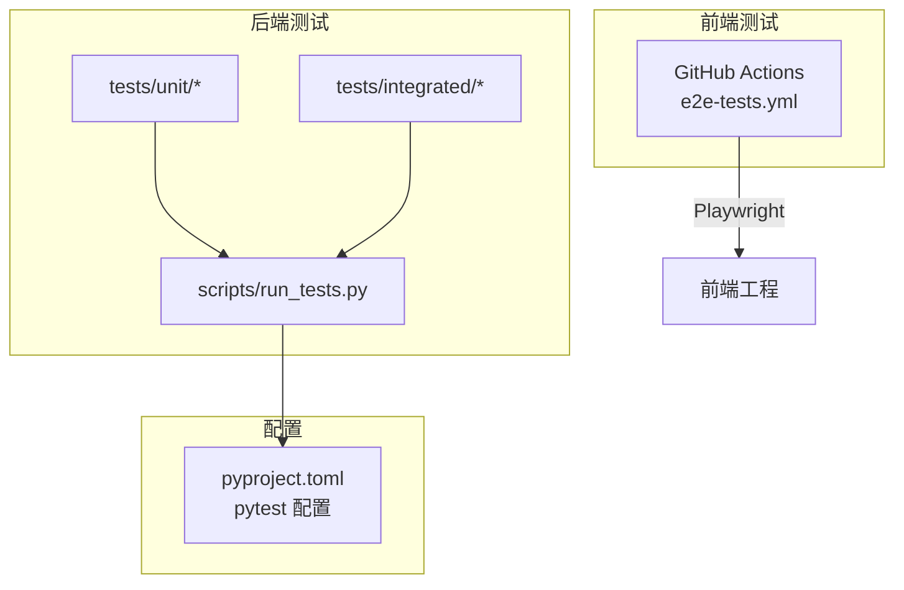
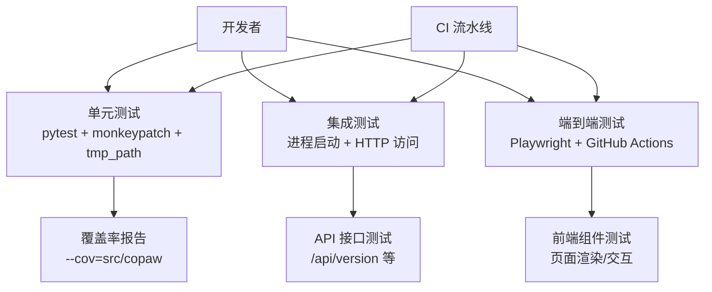
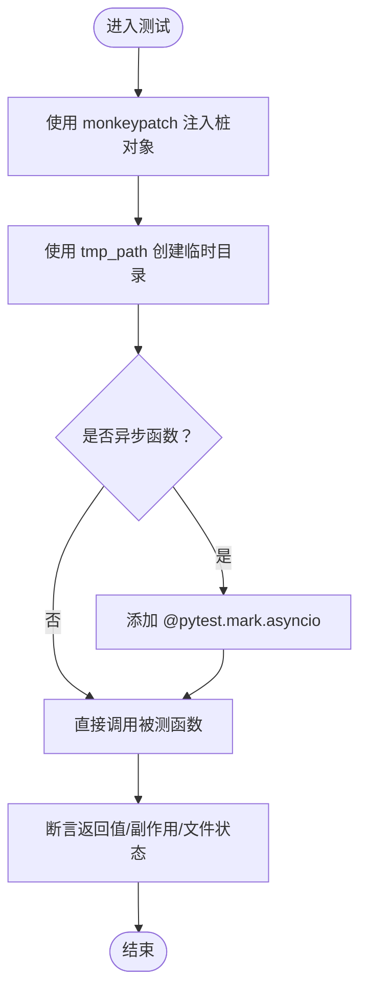
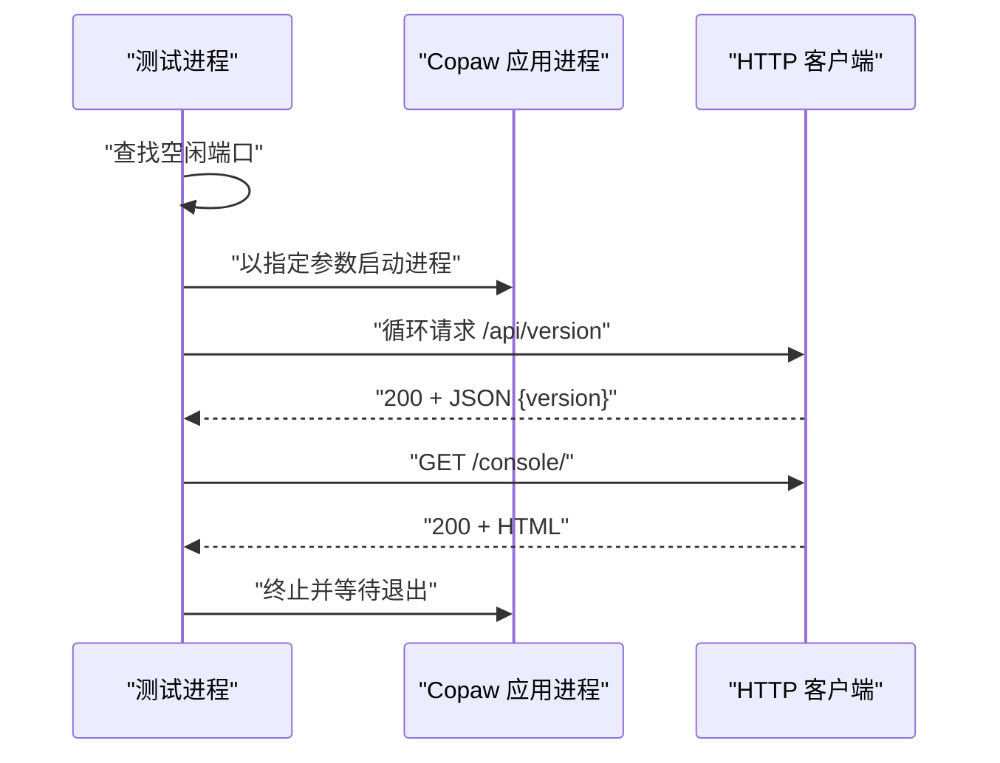
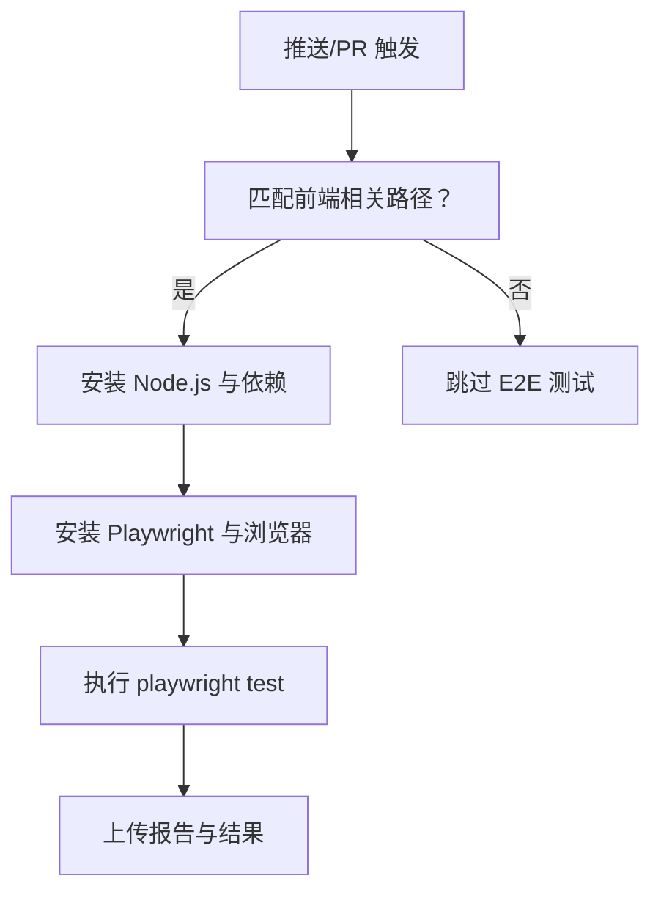
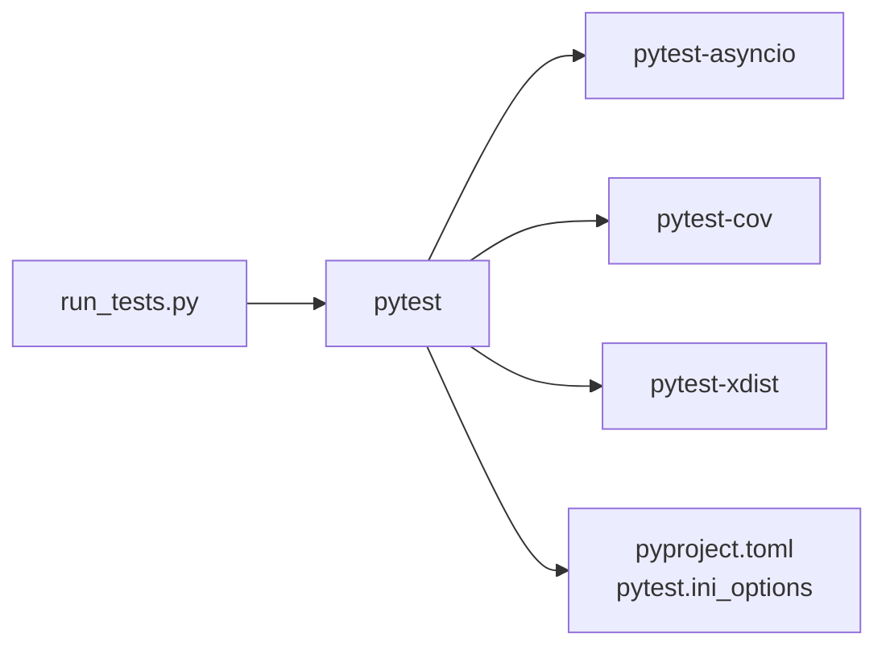

# 测试策略

<cite>
**本文引用的文件**
- [pyproject.toml](file://copaw/pyproject.toml)
- [run_tests.py](file://copaw/scripts/run_tests.py)
- [test_app_startup.py](file://copaw/tests/integrated/test_app_startup.py)
- [test_openai_provider.py](file://copaw/tests/unit/providers/test_openai_provider.py)
- [test_model_manager.py](file://copaw/tests/unit/local_models/test_model_manager.py)
- [test_workspace.py](file://copaw/tests/unit/workspace/test_workspace.py)
- [test_agents_workspace_initialization.py](file://copaw/tests/unit/app/test_agents_workspace_initialization.py)
- [e2e-tests.yml](file://.github/workflows/e2e-tests.yml)
</cite>

## 目录
1. [引言](#引言)
2. [项目结构](#项目结构)
3. [核心组件](#核心组件)
4. [架构总览](#架构总览)
5. [详细组件分析](#详细组件分析)
6. [依赖分析](#依赖分析)
7. [性能考虑](#性能考虑)
8. [故障排查指南](#故障排查指南)
9. [结论](#结论)
10. [附录](#附录)

## 引言
本测试策略面向开发者，系统化地定义了单元测试、集成测试与端到端测试的设计原则与实现方法，覆盖 pytest 框架使用、测试数据准备与模拟对象创建，以及前端组件测试、API 接口测试与数据库测试的实践要点。同时给出测试覆盖率要求、持续集成中的测试执行流程、测试自动化、性能测试与安全测试最佳实践，并提供测试环境配置与调试技巧。

## 项目结构
本仓库包含后端 Python 包与前端网站工程，测试体系主要集中在后端包 copaw 的 tests 目录中，分为 unit 与 integrated 两大类；另有 GitHub Actions 工作流负责端到端测试（Playwright）。

- 后端测试组织
  - 单元测试：tests/unit 下按功能域分层，如 providers、local_models、workspace、app、channels、cli、routers 等
  - 集成测试：tests/integrated，关注应用启动、控制台访问等端到端行为
- 前端测试组织
  - 仓库根目录存在 .github/workflows/e2e-tests.yml，采用 Playwright 执行端到端测试，触发范围限定在前端相关路径变更
- 测试执行工具
  - scripts/run_tests.py 提供统一本地测试入口，支持按子目录运行、覆盖率生成、并行执行等
  - pyproject.toml 中通过 pytest.ini_options 配置 asyncio 模式、默认 fixture loop 作用域与自定义标记

**图表来源**
- [run_tests.py:1-282](file://copaw/scripts/run_tests.py#L1-L282)
- [pyproject.toml:101-107](file://copaw/pyproject.toml#L101-L107)
- [.github/workflows/e2e-tests.yml:1-80](file://.github/workflows/e2e-tests.yml#L1-L80)

**章节来源**
- [run_tests.py:1-282](file://copaw/scripts/run_tests.py#L1-L282)
- [pyproject.toml:101-107](file://copaw/pyproject.toml#L101-L107)
- [.github/workflows/e2e-tests.yml:1-80](file://.github/workflows/e2e-tests.yml#L1-L80)

## 核心组件
- 测试运行器
  - 支持按子目录运行单元测试、运行集成测试、生成覆盖率报告、并行执行（需安装 pytest-xdist）
  - 自动检查 pytest 是否可用，缺失时提示安装开发依赖
- pytest 配置
  - asyncio_mode 与 asyncio_default_fixture_loop_scope 已在 pyproject.toml 中设置
  - 自定义标记 slow，便于选择性跳过耗时测试
- 端到端测试
  - 通过 GitHub Actions 使用 Playwright，仅在前端相关路径变更时触发

**章节来源**
- [run_tests.py:148-173](file://copaw/scripts/run_tests.py#L148-L173)
- [pyproject.toml:101-107](file://copaw/pyproject.toml#L101-L107)
- [.github/workflows/e2e-tests.yml:1-80](file://.github/workflows/e2e-tests.yml#L1-L80)

## 架构总览
下图展示测试策略在不同层次的职责与交互：

**图表来源**
- [run_tests.py:148-173](file://copaw/scripts/run_tests.py#L148-L173)
- [test_app_startup.py:33-133](file://copaw/tests/integrated/test_app_startup.py#L33-L133)
- [.github/workflows/e2e-tests.yml:40-80](file://.github/workflows/e2e-tests.yml#L40-L80)

## 详细组件分析

### 单元测试设计与实现
- 设计原则
  - 使用 monkeypatch 替换外部依赖或全局行为，隔离被测函数
  - 使用 tmp_path 临时目录进行文件系统相关测试，避免污染真实环境
  - 对异步函数使用 pytest.mark.asyncio，确保事件循环正确初始化
- 典型模式
  - Provider 连接性与模型列表测试：构造最小化客户端桩，断言参数传递与返回值
  - 模型下载管理：通过属性注入与上下文替换，验证下载流程、进度与取消逻辑
  - 工作空间初始化：断言目录结构、文件内容与语言参数传递顺序
- 覆盖率要求建议
  - 关键业务模块（providers、local_models、workspace、app）目标行覆盖率≥80%
  - 重要分支覆盖率≥70%，对异常路径与边界条件重点覆盖

**图表来源**
- [test_openai_provider.py:21-38](file://copaw/tests/unit/providers/test_openai_provider.py#L21-L38)
- [test_model_manager.py:61-134](file://copaw/tests/unit/local_models/test_model_manager.py#L61-L134)
- [test_workspace.py:8-24](file://copaw/tests/unit/workspace/test_workspace.py#L8-L24)

**章节来源**
- [test_openai_provider.py:1-269](file://copaw/tests/unit/providers/test_openai_provider.py#L1-L269)
- [test_model_manager.py:1-366](file://copaw/tests/unit/local_models/test_model_manager.py#L1-L366)
- [test_workspace.py:1-97](file://copaw/tests/unit/workspace/test_workspace.py#L1-L97)
- [test_agents_workspace_initialization.py:1-109](file://copaw/tests/unit/app/test_agents_workspace_initialization.py#L1-L109)

### 集成测试设计与实现
- 设计原则
  - 启动完整应用进程，通过 HTTP 客户端轮询健康检查端点，验证后台服务就绪
  - 访问控制台页面，断言响应状态码、内容类型与 HTML 结构
  - 对早期退出或导入错误进行诊断，输出最近日志片段
- 关键步骤
  - 动态寻找空闲端口，避免冲突
  - 子进程输出实时转储到标准输出，便于定位问题
  - 最大等待时间与超时控制，保证测试稳定性

**图表来源**
- [test_app_startup.py:33-133](file://copaw/tests/integrated/test_app_startup.py#L33-L133)

**章节来源**
- [test_app_startup.py:1-133](file://copaw/tests/integrated/test_app_startup.py#L1-L133)

### 端到端测试设计与实现
- 触发条件
  - 仅在前端相关路径发生变更时触发，减少不必要的执行
- 执行流程
  - 设置 Node.js 环境与缓存
  - 安装依赖与 Playwright 依赖的浏览器
  - 运行 Playwright 测试并上传报告与结果工件
- 建议
  - 将测试脚本与配置文件纳入版本控制，确保可重复执行
  - 对跨浏览器兼容性进行抽样验证，优先使用最新稳定版

**图表来源**
- [.github/workflows/e2e-tests.yml:11-80](file://.github/workflows/e2e-tests.yml#L11-L80)

**章节来源**
- [.github/workflows/e2e-tests.yml:1-80](file://.github/workflows/e2e-tests.yml#L1-L80)

### API 接口测试最佳实践
- 覆盖范围
  - 健康检查与版本查询：/api/version
  - 控制台页面：/console/ 返回 HTML
- 断言要点
  - 状态码与内容类型
  - 响应体结构与关键字段存在性
  - HTML 片段校验（如文档类型声明）

**章节来源**
- [test_app_startup.py:86-121](file://copaw/tests/integrated/test_app_startup.py#L86-L121)

### 数据库测试最佳实践
- 当前仓库未发现直接的数据库测试文件
- 建议
  - 使用临时数据库实例或内存数据库（如 SQLite 内存模式）进行隔离测试
  - 通过迁移脚本在测试前初始化 schema，在测试后回滚或重建
  - 对事务性操作进行快照对比，确保一致性

[本节为通用指导，不直接分析具体文件]

### 前端组件测试最佳实践
- 使用 Playwright 进行页面级测试，覆盖登录、导航、表单提交等关键路径
- 对动态内容与异步加载进行显式等待
- 截图对比与可访问性检查作为补充手段

**章节来源**
- [.github/workflows/e2e-tests.yml:62-68](file://.github/workflows/e2e-tests.yml#L62-L68)

## 依赖分析
- 测试框架与插件
  - pytest、pytest-asyncio、pytest-cov、pytest-xdist（并行）
- 项目内测试工具
  - run_tests.py 统一入口，支持子目录、覆盖率、并行
- 配置耦合
  - pytest 配置集中于 pyproject.toml，避免分散配置带来的维护成本

**图表来源**
- [run_tests.py:148-173](file://copaw/scripts/run_tests.py#L148-L173)
- [pyproject.toml:72-78](file://copaw/pyproject.toml#L72-L78)

**章节来源**
- [run_tests.py:148-173](file://copaw/scripts/run_tests.py#L148-L173)
- [pyproject.toml:72-78](file://copaw/pyproject.toml#L72-L78)

## 性能考虑
- 并行执行
  - 使用 pytest-xdist 的 -n auto 参数提升吞吐，注意共享资源竞争
- 覆盖率生成
  - --cov-report=html 与 --cov-report=term-missing 输出便于定位低覆盖区域
- 集成测试超时
  - 合理设置最大等待时间与连接超时，避免长时间阻塞流水线

**章节来源**
- [run_tests.py:154-166](file://copaw/scripts/run_tests.py#L154-L166)
- [test_app_startup.py:67-96](file://copaw/tests/integrated/test_app_startup.py#L67-L96)

## 故障排查指南
- pytest 未安装
  - 现象：提示安装 dev 依赖
  - 处理：pip install -e ".[dev,full]"
- 子进程提前退出
  - 现象：导入错误或模块缺失导致进程退出
  - 处理：查看最近日志片段，修复缺失依赖
- 端口占用
  - 现象：端口不可用导致启动失败
  - 处理：使用动态端口分配或清理占用进程
- 超时与不稳定
  - 现象：轮询超时或偶发失败
  - 处理：增加等待时间、重试策略、降低并发度

**章节来源**
- [run_tests.py:222-227](file://copaw/scripts/run_tests.py#L222-L227)
- [test_app_startup.py:76-84](file://copaw/tests/integrated/test_app_startup.py#L76-L84)
- [test_app_startup.py:98-104](file://copaw/tests/integrated/test_app_startup.py#L98-L104)

## 结论
本测试策略以 pytest 为核心，结合 run_tests.py 的统一入口与 pyproject.toml 的配置，形成从单元到集成再到端到端的完整测试金字塔。建议在 CI 中保留端到端测试，同时在 PR 与主干合并前强制执行单元与集成测试，并通过覆盖率指标持续改进质量。对于数据库与前端组件，建议引入专门的测试方案与工具链，确保系统整体稳定性与可维护性。

## 附录
- 测试覆盖率要求（建议）
  - 行覆盖率：≥80%（关键模块）
  - 分支覆盖率：≥70%（关键模块）
  - 工具：--cov=src/copaw 生成 HTML 报告
- 持续集成中的测试执行流程
  - 单元测试：pytest -v tests/unit
  - 集成测试：pytest -v tests/integrated
  - 端到端测试：GitHub Actions 使用 Playwright
- 测试环境配置
  - 安装开发依赖：pip install -e ".[dev,full]"
  - 并行执行：pytest -n auto
  - 调试技巧：使用 -s 输出日志，结合临时目录与桩对象隔离外部依赖

**章节来源**
- [run_tests.py:154-166](file://copaw/scripts/run_tests.py#L154-L166)
- [pyproject.toml:72-78](file://copaw/pyproject.toml#L72-L78)
- [.github/workflows/e2e-tests.yml:62-68](file://.github/workflows/e2e-tests.yml#L62-L68)