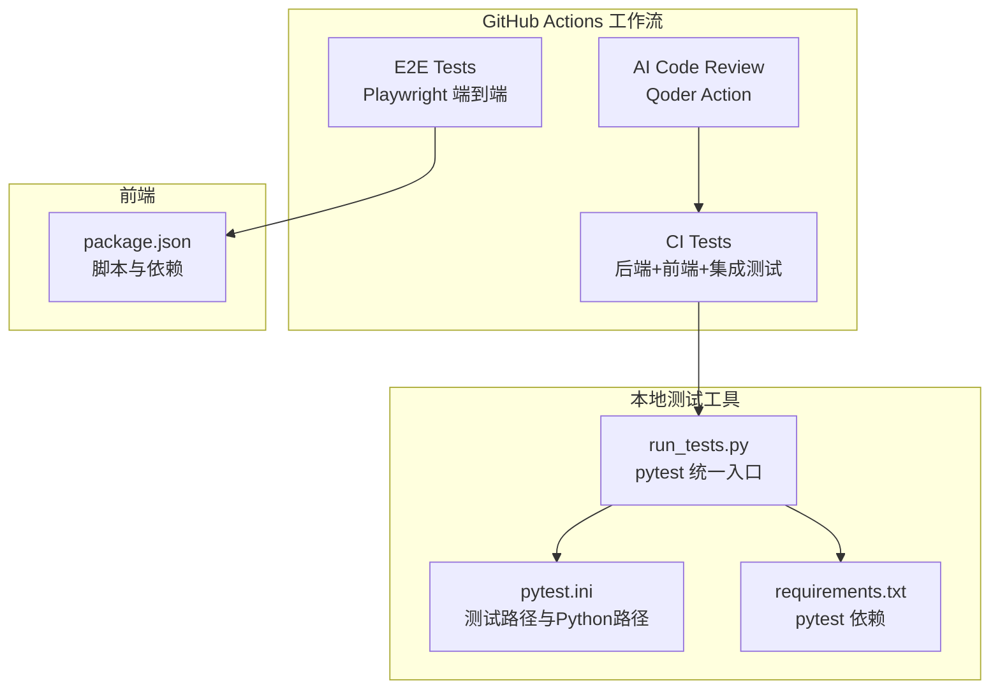
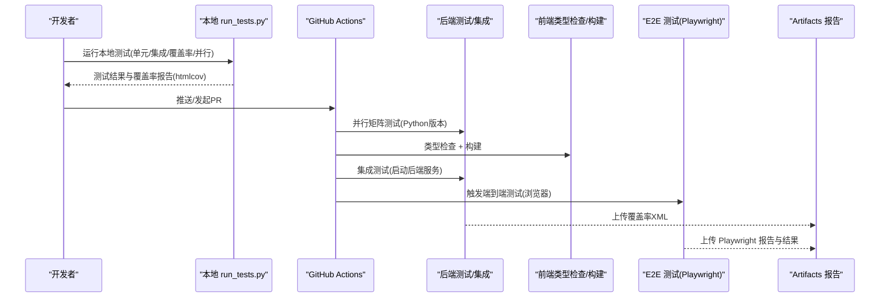
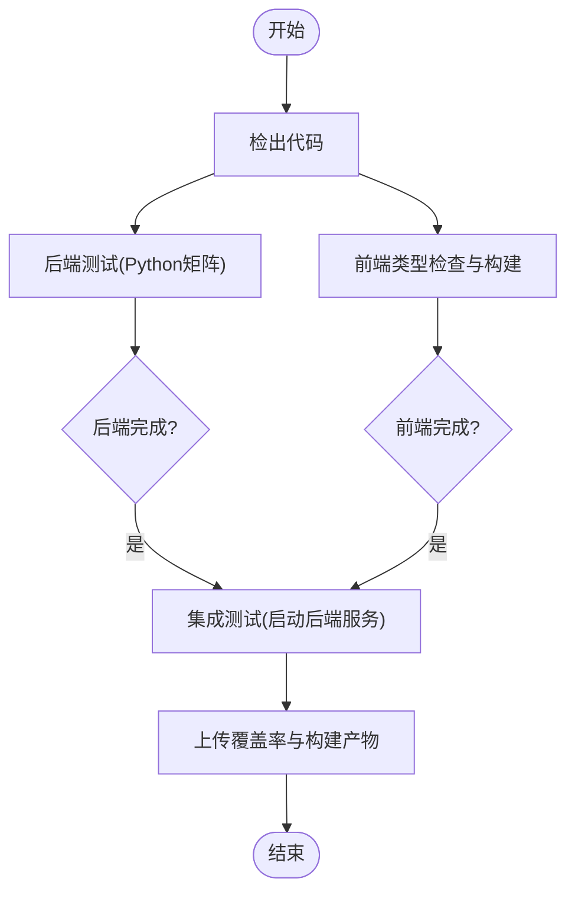
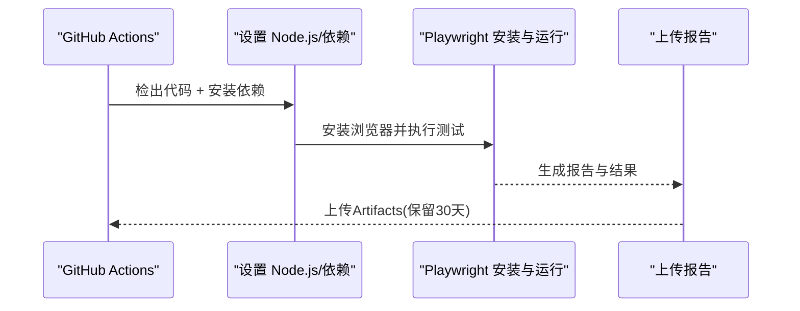
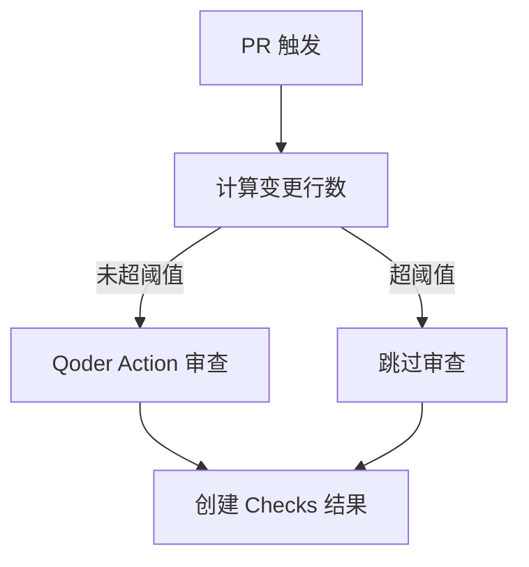
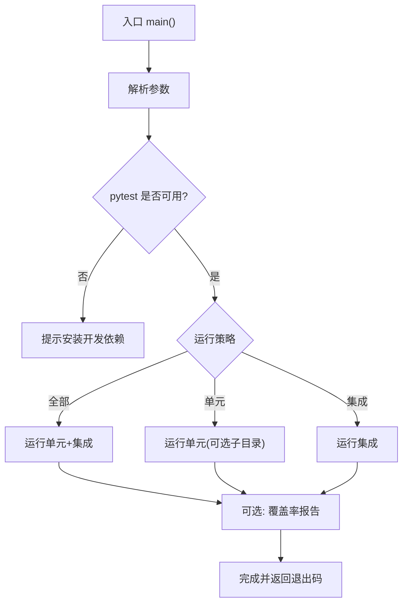
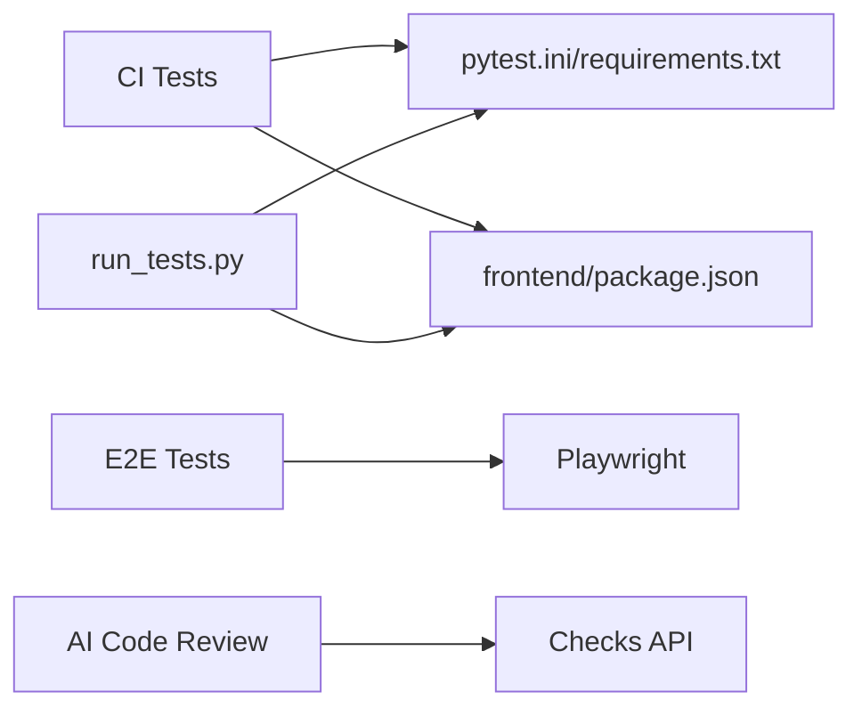

# 测试自动化

<cite>
**本文引用的文件**
- [.github/workflows/e2e-tests.yml](file://.github/workflows/e2e-tests.yml)
- [copaw/scripts/run_tests.py](file://copaw/scripts/run_tests.py)
- [copaw/pyproject.toml](file://copaw/pyproject.toml)
- [main-project/workshop/ci-tests.yml](file://main-project/workshop/ci-tests.yml)
- [main-project/backend/pytest.ini](file://main-project/backend/pytest.ini)
- [main-project/backend/requirements.txt](file://main-project/backend/requirements.txt)
- [main-project/frontend/package.json](file://main-project/frontend/package.json)
- [.github/workflows/ai-code-review.yml](file://.github/workflows/ai-code-review.yml)
</cite>

## 目录
1. [简介](#简介)
2. [项目结构](#项目结构)
3. [核心组件](#核心组件)
4. [架构总览](#架构总览)
5. [详细组件分析](#详细组件分析)
6. [依赖分析](#依赖分析)
7. [性能考虑](#性能考虑)
8. [故障排查指南](#故障排查指南)
9. [结论](#结论)
10. [附录](#附录)

## 简介
本文件面向开发者，系统化梳理仓库中的测试自动化体系，覆盖以下方面：
- 持续集成中的测试自动化流程：GitHub Actions 工作流配置、测试脚本与自动化执行
- 测试环境自动搭建、测试数据准备与测试结果自动报告生成
- 单元测试、集成测试与端到端测试的自动化配置示例
- 测试覆盖率统计、性能回归检测与安全漏洞扫描的自动化方法
- 测试报告生成、通知机制与问题跟踪的自动化流程

## 项目结构
本仓库包含多套测试与CI配置，分别覆盖后端Python服务、前端应用以及端到端测试：
- 后端与前端一体化CI：在单个工作流中并行执行后端测试矩阵、前端类型检查与构建，并进行集成测试
- 端到端测试：基于 Playwright 的浏览器自动化测试，按路径变更触发
- 本地测试脚本：统一的Python测试运行器，支持并行、覆盖率与子目录选择
- AI代码审查：PR触发的智能代码审查工作流

**图表来源**
- [main-project/workshop/ci-tests.yml:1-135](file://main-project/workshop/ci-tests.yml#L1-L135)
- [.github/workflows/e2e-tests.yml:1-80](file://.github/workflows/e2e-tests.yml#L1-L80)
- [.github/workflows/ai-code-review.yml:1-109](file://.github/workflows/ai-code-review.yml#L1-L109)
- [copaw/scripts/run_tests.py:1-282](file://copaw/scripts/run_tests.py#L1-L282)
- [main-project/backend/pytest.ini:1-4](file://main-project/backend/pytest.ini#L1-L4)
- [main-project/backend/requirements.txt:1-7](file://main-project/backend/requirements.txt#L1-L7)
- [main-project/frontend/package.json:1-25](file://main-project/frontend/package.json#L1-L25)

**章节来源**
- [main-project/workshop/ci-tests.yml:1-135](file://main-project/workshop/ci-tests.yml#L1-L135)
- [.github/workflows/e2e-tests.yml:1-80](file://.github/workflows/e2e-tests.yml#L1-L80)
- [.github/workflows/ai-code-review.yml:1-109](file://.github/workflows/ai-code-review.yml#L1-L109)
- [copaw/scripts/run_tests.py:1-282](file://copaw/scripts/run_tests.py#L1-L282)
- [main-project/backend/pytest.ini:1-4](file://main-project/backend/pytest.ini#L1-L4)
- [main-project/backend/requirements.txt:1-7](file://main-project/backend/requirements.txt#L1-L7)
- [main-project/frontend/package.json:1-25](file://main-project/frontend/package.json#L1-L25)

## 核心组件
- GitHub Actions 工作流
  - CI Tests：并行矩阵测试后端Python版本，前端类型检查与构建，最后进行集成测试
  - E2E Tests：基于 Playwright 的浏览器自动化测试，仅在前端或相关配置变更时触发
  - AI Code Review：PR触发的智能代码审查，支持大小阈值跳过与检查状态上报
- 本地测试脚本
  - run_tests.py：统一入口，支持运行单元/集成测试、覆盖率、并行执行与子目录筛选
- 测试配置
  - pytest.ini：指定测试路径与Python路径
  - requirements.txt：声明pytest与pytest-cov等测试依赖
  - pyproject.toml：pytest异步模式、标记与可选开发依赖
  - package.json：前端脚本与TypeScript类型检查

**章节来源**
- [main-project/workshop/ci-tests.yml:1-135](file://main-project/workshop/ci-tests.yml#L1-L135)
- [.github/workflows/e2e-tests.yml:1-80](file://.github/workflows/e2e-tests.yml#L1-L80)
- [.github/workflows/ai-code-review.yml:1-109](file://.github/workflows/ai-code-review.yml#L1-L109)
- [copaw/scripts/run_tests.py:1-282](file://copaw/scripts/run_tests.py#L1-L282)
- [main-project/backend/pytest.ini:1-4](file://main-project/backend/pytest.ini#L1-L4)
- [main-project/backend/requirements.txt:1-7](file://main-project/backend/requirements.txt#L1-L7)
- [copaw/pyproject.toml:101-107](file://copaw/pyproject.toml#L101-L107)
- [main-project/frontend/package.json:1-25](file://main-project/frontend/package.json#L1-L25)

## 架构总览
下图展示从代码提交到测试结果反馈的关键路径，包括本地测试脚本、GitHub Actions工作流与报告归档。

**图表来源**
- [copaw/scripts/run_tests.py:175-277](file://copaw/scripts/run_tests.py#L175-L277)
- [main-project/workshop/ci-tests.yml:12-135](file://main-project/workshop/ci-tests.yml#L12-L135)
- [.github/workflows/e2e-tests.yml:40-80](file://.github/workflows/e2e-tests.yml#L40-L80)

## 详细组件分析

### 组件A：CI Tests 工作流（后端+前端+集成）
- 触发条件：push/PR至主分支
- 关键步骤
  - 后端测试：Python版本矩阵（3.11/3.12），缓存依赖，安装pytest与pytest-cov，执行pytest并生成XML覆盖率
  - 前端测试与构建：设置Node.js，安装依赖，TypeScript类型检查，构建产物上传
  - 集成测试：并行作业依赖后端与前端完成后，启动后端服务，校验健康端点，执行相关API测试
- 覆盖率与产物
  - 后端：覆盖率XML上传为Artifacts
  - 前端：dist产物上传为Artifacts

**图表来源**
- [main-project/workshop/ci-tests.yml:12-135](file://main-project/workshop/ci-tests.yml#L12-L135)

**章节来源**
- [main-project/workshop/ci-tests.yml:1-135](file://main-project/workshop/ci-tests.yml#L1-L135)

### 组件B：E2E Tests 工作流（Playwright）
- 触发条件：push/PR至主分支，且仅当前端或相关配置发生变更
- 关键步骤
  - 设置Node.js 24，安装依赖与Playwright浏览器
  - 运行Playwright测试，无论成功与否均上传报告与测试结果作为Artifacts
- 报告归档：playwright-report 与 test-results

**图表来源**
- [.github/workflows/e2e-tests.yml:40-80](file://.github/workflows/e2e-tests.yml#L40-L80)

**章节来源**
- [.github/workflows/e2e-tests.yml:1-80](file://.github/workflows/e2e-tests.yml#L1-L80)

### 组件C：AI Code Review 工作流（Qoder Action）
- 触发条件：PR打开/同步/重开，且限定代码与工作流相关文件变更
- 关键步骤
  - 检出完整历史，计算变更行数，超过阈值则跳过审查
  - 使用Qoder Action执行审查，输出中文提示
  - 通过GitHub Checks API上报完成状态与摘要
- 权限：读取内容、写入PR评论与检查

**图表来源**
- [.github/workflows/ai-code-review.yml:12-109](file://.github/workflows/ai-code-review.yml#L12-L109)

**章节来源**
- [.github/workflows/ai-code-review.yml:1-109](file://.github/workflows/ai-code-review.yml#L1-L109)

### 组件D：本地测试运行器（run_tests.py）
- 功能特性
  - 支持运行全部测试、仅单元测试、仅集成测试
  - 子目录选择（如providers、local_models等）
  - 覆盖率生成（HTML与缺失行报告）
  - 并行执行（需pytest-xdist）
  - 终端彩色输出与错误处理
- 与pytest集成
  - 通过pytest命令行参数传递覆盖率与并行选项
  - 自动检测pytest是否安装，引导安装开发依赖

**图表来源**
- [copaw/scripts/run_tests.py:175-277](file://copaw/scripts/run_tests.py#L175-L277)

**章节来源**
- [copaw/scripts/run_tests.py:1-282](file://copaw/scripts/run_tests.py#L1-L282)

### 组件E：测试配置与依赖
- pytest.ini
  - 指定测试路径与Python路径，便于pytest自动发现测试
- requirements.txt
  - 声明pytest与pytest-cov等测试依赖，供CI使用
- pyproject.toml
  - 配置pytest异步模式与自定义标记（如slow），并提供可选开发依赖
- frontend/package.json
  - 提供TypeScript类型检查脚本，用于CI前端类型检查阶段

**章节来源**
- [main-project/backend/pytest.ini:1-4](file://main-project/backend/pytest.ini#L1-L4)
- [main-project/backend/requirements.txt:1-7](file://main-project/backend/requirements.txt#L1-L7)
- [copaw/pyproject.toml:101-107](file://copaw/pyproject.toml#L101-L107)
- [main-project/frontend/package.json:1-25](file://main-project/frontend/package.json#L1-L25)

## 依赖分析
- 组件耦合
  - CI Tests 依赖后端requirements与pytest配置；前端类型检查依赖package.json脚本
  - E2E Tests 依赖Playwright与Node.js环境；Artifacts用于报告归档
  - run_tests.py 依赖pytest与覆盖率工具；与pytest.ini/requirements配合
- 外部依赖
  - GitHub Actions Runner、Node.js 24、Python 3.11/3.12、Playwright、pytest与pytest-cov

**图表来源**
- [main-project/workshop/ci-tests.yml:12-135](file://main-project/workshop/ci-tests.yml#L12-L135)
- [.github/workflows/e2e-tests.yml:40-80](file://.github/workflows/e2e-tests.yml#L40-L80)
- [copaw/scripts/run_tests.py:175-277](file://copaw/scripts/run_tests.py#L175-L277)
- [.github/workflows/ai-code-review.yml:80-109](file://.github/workflows/ai-code-review.yml#L80-L109)

**章节来源**
- [main-project/workshop/ci-tests.yml:1-135](file://main-project/workshop/ci-tests.yml#L1-L135)
- [.github/workflows/e2e-tests.yml:1-80](file://.github/workflows/e2e-tests.yml#L1-L80)
- [copaw/scripts/run_tests.py:1-282](file://copaw/scripts/run_tests.py#L1-L282)
- [.github/workflows/ai-code-review.yml:1-109](file://.github/workflows/ai-code-review.yml#L1-L109)

## 性能考虑
- 并行执行
  - run_tests.py支持并行（需pytest-xdist），可显著缩短测试时间
  - CI Tests使用Python版本矩阵并行执行，提升稳定性验证效率
- 缓存优化
  - CI Tests对pip与npm依赖进行缓存，减少重复安装时间
- 资源隔离
  - E2E测试独立作业，避免与后端/前端任务竞争资源
- 前端类型检查
  - 通过TypeScript类型检查在早期发现潜在问题，降低运行期失败概率

[本节为通用建议，无需特定文件来源]

## 故障排查指南
- pytest未安装
  - 现象：本地运行run_tests.py提示未安装pytest
  - 处理：根据提示安装开发依赖，再重试
  - 参考：[copaw/scripts/run_tests.py:222-227](file://copaw/scripts/run_tests.py#L222-L227)
- 覆盖率报告为空或缺失
  - 现象：CI上传覆盖率XML为空或本地htmlcov未生成
  - 处理：确认pytest命令包含覆盖率参数；检查pytest.ini与requirements.txt
  - 参考：[main-project/workshop/ci-tests.yml:51-57](file://main-project/workshop/ci-tests.yml#L51-L57)、[copaw/scripts/run_tests.py:156-163](file://copaw/scripts/run_tests.py#L156-L163)
- Playwright测试失败或浏览器缺失
  - 现象：E2E测试报错或无法启动浏览器
  - 处理：确保安装Playwright浏览器依赖；检查Node.js版本与依赖缓存
  - 参考：[main-project/workshop/ci-tests.yml:71-73](file://main-project/workshop/ci-tests.yml#L71-L73)、[copaw/scripts/run_tests.py:63-73](file://copaw/scripts/run_tests.py#L63-L73)
- PR审查被跳过
  - 现象：AI Code Review直接跳过
  - 处理：检查变更行数阈值；必要时调整阈值或手动触发
  - 参考：[main-project/workshop/ci-tests.yml:61-67](file://main-project/workshop/ci-tests.yml#L61-L67)

**章节来源**
- [copaw/scripts/run_tests.py:222-227](file://copaw/scripts/run_tests.py#L222-L227)
- [main-project/workshop/ci-tests.yml:51-57](file://main-project/workshop/ci-tests.yml#L51-L57)
- [copaw/scripts/run_tests.py:156-163](file://copaw/scripts/run_tests.py#L156-L163)
- [main-project/workshop/ci-tests.yml:71-73](file://main-project/workshop/ci-tests.yml#L71-L73)
- [copaw/scripts/run_tests.py:63-73](file://copaw/scripts/run_tests.py#L63-L73)

## 结论
本仓库已形成较为完善的测试自动化体系：本地统一入口、CI并行矩阵、前端类型检查与构建、端到端浏览器测试、覆盖率与报告归档，以及PR驱动的智能代码审查。建议在现有基础上进一步完善：
- 将覆盖率阈值纳入CI失败条件，确保质量门槛
- 引入静态分析与安全扫描（如Bandit、Semgrep）作为CI步骤
- 对E2E测试增加失败截图与日志收集，提升可诊断性
- 将AI审查结果与PR评论模板结合，形成标准化反馈闭环

[本节为总结性内容，无需特定文件来源]

## 附录
- 自动化测试配置示例索引
  - 单元测试自动化：本地run_tests.py与CI Tests工作流
  - 集成测试自动化：CI Tests工作流中的集成测试阶段
  - 端到端测试自动化：E2E Tests工作流（Playwright）
- 测试覆盖率统计：CI Tests上传覆盖率XML；本地run_tests.py生成HTML报告
- 性能回归检测：可在CI中引入基准测试与对比工具（建议）
- 安全漏洞扫描：可在CI中加入静态分析与依赖扫描（建议）
- 测试报告生成与通知：Artifacts归档；AI Code Review通过Checks API通知

[本节为概览性内容，无需特定文件来源]