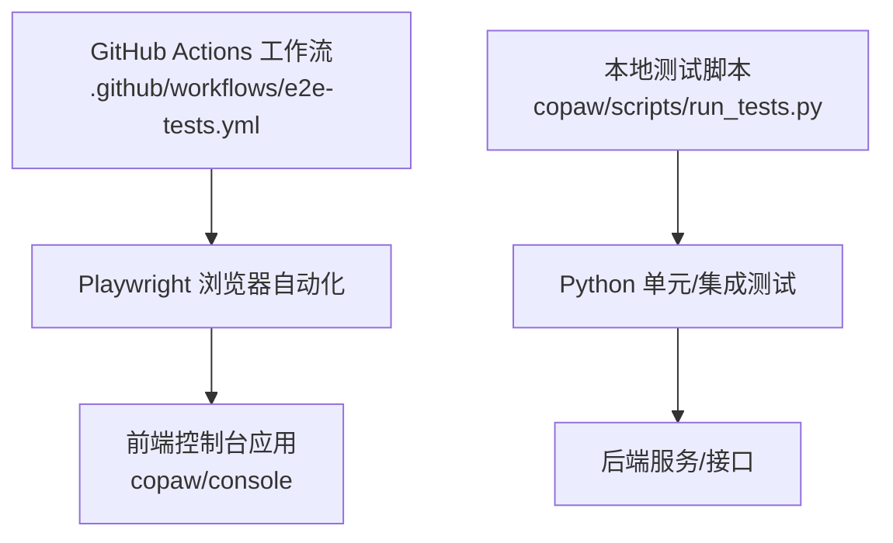
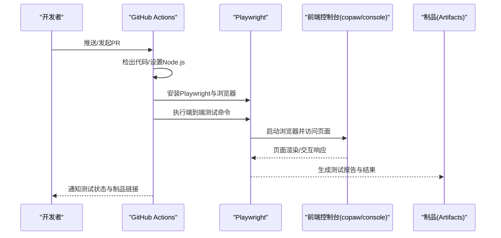
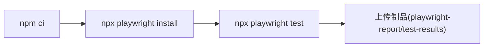

# 端到端测试

<cite>
**本文引用的文件**
- [.github/workflows/e2e-tests.yml](file://.github/workflows/e2e-tests.yml)
- [copaw/console/package.json](file://copaw/console/package.json)
- [copaw/scripts/run_tests.py](file://copaw/scripts/run_tests.py)
</cite>

## 目录
1. [引言](#引言)
2. [项目结构](#项目结构)
3. [核心组件](#核心组件)
4. [架构总览](#架构总览)
5. [详细组件分析](#详细组件分析)
6. [依赖分析](#依赖分析)
7. [性能考虑](#性能考虑)
8. [故障排查指南](#故障排查指南)
9. [结论](#结论)
10. [附录](#附录)

## 引言
本文件面向开发者，系统化阐述该仓库中 Web 应用的端到端测试策略与实践，覆盖用户界面测试、API 集成测试与用户体验测试三大维度。重点说明测试框架选择（Playwright）与配置要点、测试场景设计方法、页面对象模式与测试数据管理策略，并给出可落地的测试用例设计思路（如控制台登录、Agent 配置、聊天交互等）。同时，结合现有 GitHub Actions 工作流，提供测试环境部署、执行与结果分析方法，以及自动化测试流水线的构建与维护建议。

## 项目结构
围绕端到端测试的关键位置与职责如下：
- 前端控制台应用位于 copaw/console，采用 React/Vite 技术栈，提供用户界面与交互入口。
- 端到端测试框架与配置由 GitHub Actions 工作流驱动，使用 Playwright 执行浏览器自动化测试。
- Python 脚本用于本地运行后端/集成测试，便于在本地快速验证 API 层能力。

图表来源
- [.github/workflows/e2e-tests.yml:1-80](file://.github/workflows/e2e-tests.yml#L1-L80)
- [copaw/console/package.json:1-60](file://copaw/console/package.json#L1-L60)
- [copaw/scripts/run_tests.py:1-282](file://copaw/scripts/run_tests.py#L1-L282)

章节来源
- [.github/workflows/e2e-tests.yml:1-80](file://.github/workflows/e2e-tests.yml#L1-L80)
- [copaw/console/package.json:1-60](file://copaw/console/package.json#L1-L60)
- [copaw/scripts/run_tests.py:1-282](file://copaw/scripts/run_tests.py#L1-L282)

## 核心组件
- 测试框架与执行器
  - Playwright：用于浏览器自动化测试，支持多浏览器、跨平台与并行执行。
  - GitHub Actions：在 push/pr 触发下自动安装依赖、安装浏览器、执行测试并上传报告。
- 前端应用
  - 控制台前端 copaw/console 提供登录、Agent 管理、聊天等页面，是端到端测试的主要目标。
- 后端与 API
  - 通过 Python 脚本运行单元/集成测试，验证 API 的可用性与稳定性，为端到端测试提供基础保障。
- 测试数据与环境
  - 通过工作流中的缓存与依赖安装步骤确保环境一致性；测试报告以制品形式保存以便回溯。

章节来源
- [.github/workflows/e2e-tests.yml:1-80](file://.github/workflows/e2e-tests.yml#L1-L80)
- [copaw/console/package.json:1-60](file://copaw/console/package.json#L1-L60)
- [copaw/scripts/run_tests.py:1-282](file://copaw/scripts/run_tests.py#L1-L282)

## 架构总览
下图展示从触发到产出的端到端测试流水线，涵盖前端应用、Playwright 执行器与测试报告归档：

图表来源
- [.github/workflows/e2e-tests.yml:40-80](file://.github/workflows/e2e-tests.yml#L40-L80)

## 详细组件分析

### 测试框架与配置（Playwright）
- 触发与权限
  - 工作流在主分支推送与 PR 时触发，且仅对前端相关路径变更进行过滤，减少不必要执行。
  - 具备写入检查状态与读取内容的权限，便于报告与状态反馈。
- 环境准备
  - 使用 Node.js 24，启用 npm ci 安装依赖，确保依赖锁定与缓存命中。
  - 安装 Playwright 及其所需浏览器，保证跨平台一致性。
- 执行与报告
  - 执行 playwright test 命令，结束后无论成功与否均上传 playwright-report 与 test-results 制品，保留 30 天。
- 并行与超时
  - 默认单实例运行，可通过 Playwright 配置扩展并行；作业整体超时 60 分钟，适合较复杂的 UI 场景。

章节来源
- [.github/workflows/e2e-tests.yml:1-80](file://.github/workflows/e2e-tests.yml#L1-L80)

### 页面对象模式与测试场景设计
- 页面对象模式
  - 将页面元素定位与操作封装为对象方法，提升可维护性与复用性；建议按页面拆分对象，统一管理选择器与交互步骤。
- 场景设计原则
  - 用户路径优先：以真实用户任务为主线（如“登录—进入聊天—发送消息—查看回复”）。
  - 关键节点断言：登录成功、Agent 列表加载、消息发送成功、错误提示出现等。
  - 边界与异常：空输入、网络抖动、无权限、会话过期等。
- 数据驱动
  - 使用外部数据源（如 JSON/CSV）或环境变量注入测试数据，避免硬编码。
  - 对于需要持久化的数据，建议在测试前准备、测试后清理，避免污染后续用例。

### 测试用例示例（设计思路）
以下为典型端到端场景的设计思路，便于对照实现与扩展：
- 控制台登录测试
  - 前置：启动前端应用与后端服务，准备有效账号。
  - 步骤：打开登录页、输入凭据、点击登录、等待跳转。
  - 断言：跳转至仪表盘、显示用户名、加载关键模块。
- Agent 配置测试
  - 前置：已登录，进入 Agent 管理页。
  - 步骤：新建/编辑 Agent、填写参数、保存、刷新列表。
  - 断言：配置项正确保存、列表可见、状态正常。
- 聊天功能测试
  - 前置：已登录，选择 Agent。
  - 步骤：输入消息、发送、等待回复、滚动查看历史。
  - 断言：消息发送成功、收到回复、历史记录完整、格式正确。
- API 集成测试（补充）
  - 前置：后端服务就绪。
  - 步骤：调用接口（如获取 Agent 列表、发送消息），校验返回码与结构。
  - 断言：响应符合契约、鉴权与限流生效。

### 测试数据管理
- 准备阶段
  - 使用测试脚本或初始化接口准备必要的测试数据（如用户、Agent、会话）。
- 清洗阶段
  - 在测试结束或失败后清理数据，避免影响其他用例。
- 环境隔离
  - 通过环境变量切换测试数据库或沙箱环境，确保每次运行独立可控。

### 结果分析与报告
- 本地分析
  - Playwright 报告包含截图、视频与日志，便于定位问题；建议在 CI 中下载并归档。
- 回归与对比
  - 对比前后差异，关注性能回归与交互异常。
- 指标度量
  - 统计成功率、平均耗时、失败分布，持续优化测试矩阵。

## 依赖分析
- 前端依赖与脚本
  - copaw/console/package.json 描述了前端项目的依赖与脚本，其中包含开发、构建与预览命令，为本地调试与 CI 构建提供基础。
- 测试运行链路
  - GitHub Actions 通过 npm ci 安装依赖，随后安装 Playwright 与浏览器，最终执行 playwright test。
  - 本地可通过 Python 脚本运行后端/集成测试，作为端到端测试的前置条件与补充。

图表来源
- [.github/workflows/e2e-tests.yml:58-80](file://.github/workflows/e2e-tests.yml#L58-L80)

章节来源
- [copaw/console/package.json:1-60](file://copaw/console/package.json#L1-L60)
- [.github/workflows/e2e-tests.yml:58-80](file://.github/workflows/e2e-tests.yml#L58-L80)

## 性能考虑
- 浏览器与网络
  - 使用无头模式与最小化窗口提升执行效率；必要时开启视频录制以降低回溯成本。
- 并行执行
  - 在 CI 中按页面或功能域拆分用例并行执行，缩短总耗时。
- 缓存与重用
  - 利用 Actions 缓存 npm 依赖与 Playwright 二进制，减少重复安装时间。
- 截图与日志
  - 仅在失败时生成截图与日志，避免制品膨胀；必要时压缩归档。

## 故障排查指南
- 环境与依赖
  - 确认 Node.js 版本与依赖安装是否成功；若 Playwright 安装失败，检查网络与代理配置。
- 浏览器兼容性
  - 若特定浏览器失败，尝试更换浏览器或更新版本；确保安装了所有必要依赖。
- 页面元素与交互
  - 使用稳定的定位策略（如基于测试 ID 的选择器），避免脆弱选择器导致的不稳定。
- 报告与日志
  - 下载并分析制品中的报告与日志，定位失败原因；必要时在本地复现问题。
- 本地调试
  - 使用本地测试脚本运行后端/集成测试，确认 API 层稳定后再进行端到端测试。

章节来源
- [.github/workflows/e2e-tests.yml:58-80](file://.github/workflows/e2e-tests.yml#L58-L80)
- [copaw/scripts/run_tests.py:148-173](file://copaw/scripts/run_tests.py#L148-L173)

## 结论
本仓库已具备基于 Playwright 的端到端测试基础设施与 GitHub Actions 自动化流水线。建议在此基础上完善页面对象模式、丰富测试场景与数据驱动策略，并结合后端集成测试形成完整的质量闭环。通过持续优化执行效率与报告分析，可显著提升端到端测试的稳定性与可维护性。

## 附录
- 测试执行清单
  - 确保前端与后端服务可用
  - 安装依赖并安装 Playwright 浏览器
  - 执行 playwright test
  - 下载并分析制品
- 最佳实践
  - 用例设计遵循用户路径与边界场景
  - 使用页面对象与稳定选择器
  - 以数据驱动与环境隔离保障可重复性
  - 在 CI 中启用并行与缓存，提升效率