# 集成测试

<cite>
**本文引用的文件**
- [copaw/tests/integrated/test_app_startup.py](file://copaw/tests/integrated/test_app_startup.py)
- [copaw/tests/integrated/test_version.py](file://copaw/tests/integrated/test_version.py)
- [copaw/scripts/run_tests.py](file://copaw/scripts/run_tests.py)
- [copaw/pyproject.toml](file://copaw/pyproject.toml)
- [copaw/docker-compose.yml](file://copaw/docker-compose.yml)
- [demo/mock-api/app.py](file://demo/mock-api/app.py)
- [.github/workflows/e2e-tests.yml](file://.github/workflows/e2e-tests.yml)
- [copaw/src/copaw/app/routers/auth.py](file://copaw/src/copaw/app/routers/auth.py)
- [copaw/src/copaw/app/routers/console.py](file://copaw/src/copaw/app/routers/console.py)
- [copaw/src/copaw/app/routers/config.py](file://copaw/src/copaw/app/routers/config.py)
</cite>

## 目录
1. [简介](#简介)
2. [项目结构](#项目结构)
3. [核心组件](#核心组件)
4. [架构总览](#架构总览)
5. [详细组件分析](#详细组件分析)
6. [依赖分析](#依赖分析)
7. [性能考虑](#性能考虑)
8. [故障排查指南](#故障排查指南)
9. [结论](#结论)
10. [附录](#附录)

## 简介
本文件面向开发者，提供CoPaw项目的集成测试实践指南。内容覆盖API接口测试、数据库连接测试、第三方服务集成测试的完整方法论与实操步骤，包括测试环境搭建、测试数据准备与模拟服务创建；并给出认证登录、健康检查、数据注入等具体测试示例；同时阐述测试隔离策略、测试数据管理与测试结果验证方法，并说明在持续集成中如何执行集成测试及失败处理机制。

## 项目结构
CoPaw采用前后端分离的Python后端与前端控制台结合的架构。集成测试主要围绕后端FastAPI应用的HTTP接口展开，辅以本地或容器化的外部服务（如Mock API）进行端到端验证。测试运行器支持按子目录执行单元测试与集成测试，并可选生成覆盖率报告与并行执行。

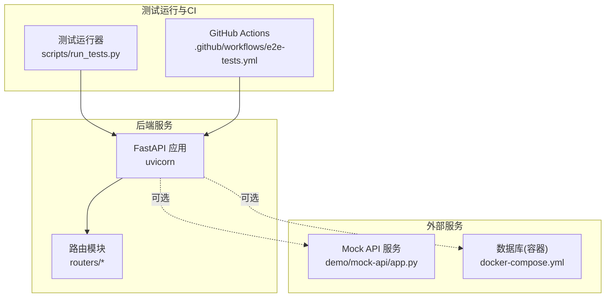

图表来源
- [copaw/scripts/run_tests.py:175-282](file://copaw/scripts/run_tests.py#L175-L282)
- [.github/workflows/e2e-tests.yml:1-80](file://.github/workflows/e2e-tests.yml#L1-L80)
- [copaw/docker-compose.yml:1-23](file://copaw/docker-compose.yml#L1-L23)
- [demo/mock-api/app.py:1-148](file://demo/mock-api/app.py#L1-L148)

章节来源
- [copaw/scripts/run_tests.py:175-282](file://copaw/scripts/run_tests.py#L175-L282)
- [.github/workflows/e2e-tests.yml:1-80](file://.github/workflows/e2e-tests.yml#L1-L80)
- [copaw/docker-compose.yml:1-23](file://copaw/docker-compose.yml#L1-L23)
- [demo/mock-api/app.py:1-148](file://demo/mock-api/app.py#L1-L148)

## 核心组件
- 测试运行器：提供统一入口，支持运行单元测试、集成测试、覆盖率与并行执行。
- 集成测试套件：验证应用启动、版本信息、控制台交互、认证与配置接口等。
- 外部服务：通过Mock API提供可控的第三方服务接口，便于断言与重放。
- 容器化环境：通过docker-compose挂载工作目录与密钥卷，便于数据库与持久化测试。

章节来源
- [copaw/scripts/run_tests.py:175-282](file://copaw/scripts/run_tests.py#L175-L282)
- [copaw/tests/integrated/test_app_startup.py:33-133](file://copaw/tests/integrated/test_app_startup.py#L33-L133)
- [copaw/tests/integrated/test_version.py:12-49](file://copaw/tests/integrated/test_version.py#L12-L49)
- [demo/mock-api/app.py:1-148](file://demo/mock-api/app.py#L1-L148)
- [copaw/docker-compose.yml:1-23](file://copaw/docker-compose.yml#L1-L23)

## 架构总览
下图展示了集成测试的关键交互路径：测试运行器启动后端应用，随后通过HTTP客户端访问后端路由；在需要时，测试会调用外部Mock API或容器内数据库服务，最终验证返回值与副作用。

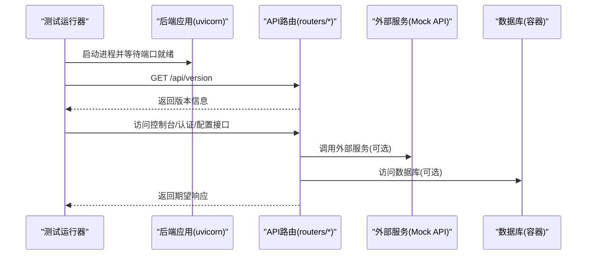

图表来源
- [copaw/tests/integrated/test_app_startup.py:33-133](file://copaw/tests/integrated/test_app_startup.py#L33-L133)
- [copaw/src/copaw/app/routers/auth.py:42-175](file://copaw/src/copaw/app/routers/auth.py#L42-L175)
- [copaw/src/copaw/app/routers/console.py:68-216](file://copaw/src/copaw/app/routers/console.py#L68-L216)
- [copaw/src/copaw/app/routers/config.py:62-701](file://copaw/src/copaw/app/routers/config.py#L62-L701)
- [demo/mock-api/app.py:35-125](file://demo/mock-api/app.py#L35-L125)

## 详细组件分析

### 组件A：应用启动与控制台可用性测试
该测试通过子进程启动后端应用，动态分配端口，轮询健康端点直至可用，随后访问控制台页面并校验HTML内容类型与基本结构。

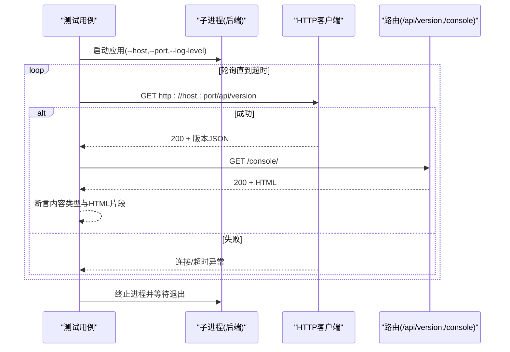

图表来源
- [copaw/tests/integrated/test_app_startup.py:33-133](file://copaw/tests/integrated/test_app_startup.py#L33-L133)

章节来源
- [copaw/tests/integrated/test_app_startup.py:33-133](file://copaw/tests/integrated/test_app_startup.py#L33-L133)

### 组件B：版本信息测试
该测试从不同入口验证版本字符串的有效性与PEP 440合规性，确保发布元数据与命令行输出一致。

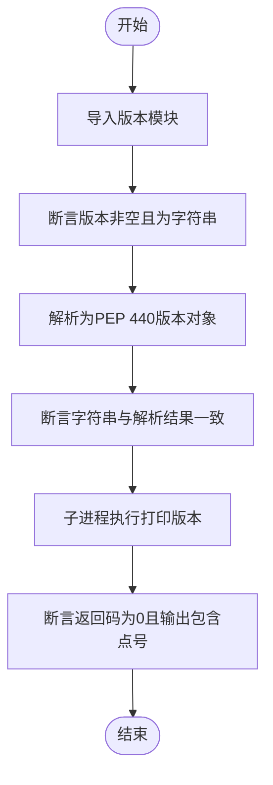

图表来源
- [copaw/tests/integrated/test_version.py:12-49](file://copaw/tests/integrated/test_version.py#L12-L49)

章节来源
- [copaw/tests/integrated/test_version.py:12-49](file://copaw/tests/integrated/test_version.py#L12-L49)

### 组件C：认证登录测试
该测试覆盖登录、注册、状态查询与令牌校验等接口，验证鉴权开关、用户存在性、凭据正确性与令牌有效性。

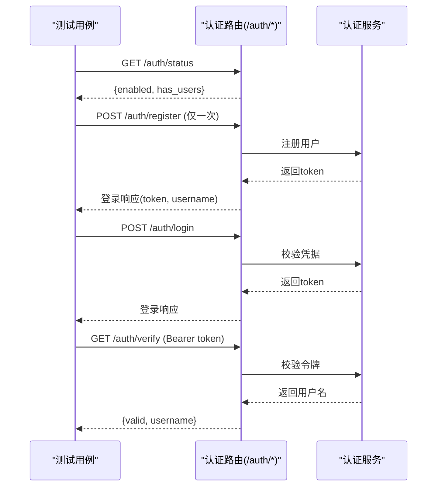

图表来源
- [copaw/src/copaw/app/routers/auth.py:42-175](file://copaw/src/copaw/app/routers/auth.py#L42-L175)

章节来源
- [copaw/src/copaw/app/routers/auth.py:42-175](file://copaw/src/copaw/app/routers/auth.py#L42-L175)

### 组件D：健康检查测试
该测试通过HTTP客户端访问后端健康端点，断言状态码与响应体字段，确保服务可用性。

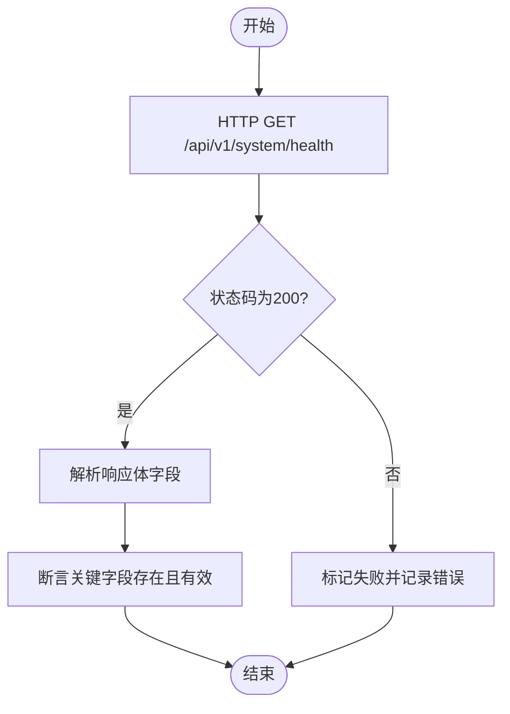

图表来源
- [copaw/src/copaw/app/routers/config.py:344-401](file://copaw/src/copaw/app/routers/config.py#L344-L401)

章节来源
- [copaw/src/copaw/app/routers/config.py:344-401](file://copaw/src/copaw/app/routers/config.py#L344-L401)

### 组件E：数据注入测试（控制台聊天与文件上传）
该测试覆盖控制台聊天流式响应与文件上传能力，验证会话建立、消息转发、流式事件与文件落盘。

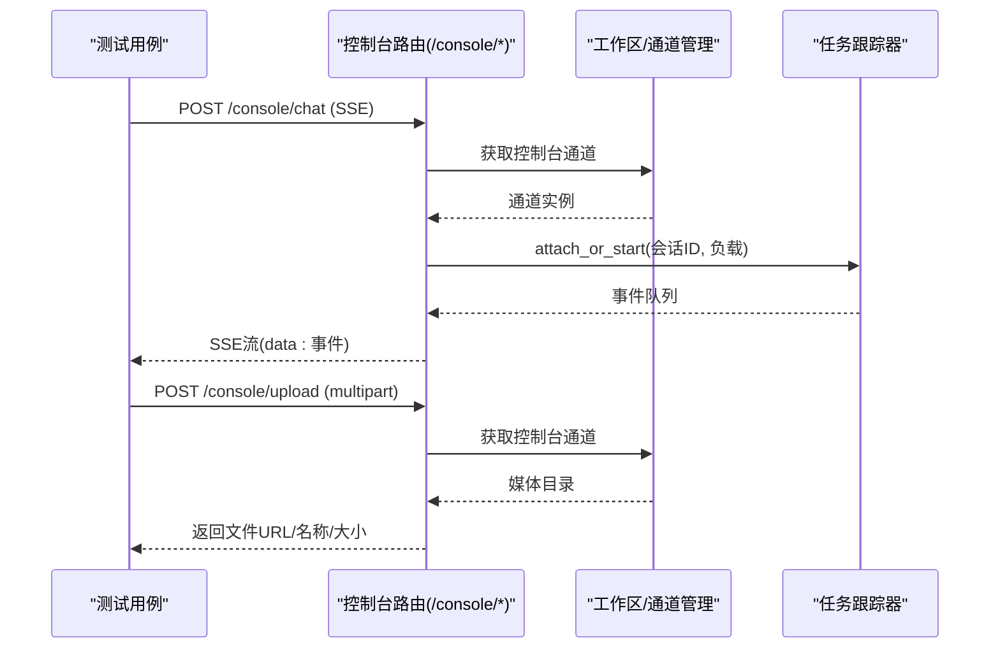

图表来源
- [copaw/src/copaw/app/routers/console.py:68-216](file://copaw/src/copaw/app/routers/console.py#L68-L216)

章节来源
- [copaw/src/copaw/app/routers/console.py:68-216](file://copaw/src/copaw/app/routers/console.py#L68-L216)

### 组件F：配置与安全策略测试
该测试覆盖通道配置读取/更新、心跳配置、工具守卫与技能扫描器等安全相关接口，验证热重载与规则生效。

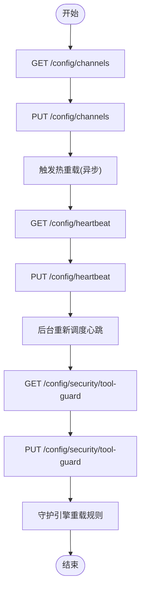

图表来源
- [copaw/src/copaw/app/routers/config.py:62-701](file://copaw/src/copaw/app/routers/config.py#L62-L701)

章节来源
- [copaw/src/copaw/app/routers/config.py:62-701](file://copaw/src/copaw/app/routers/config.py#L62-L701)

### 组件G：数据库连接测试
建议通过docker-compose启动数据库容器，使用独立测试数据库与专用连接串，避免与生产数据冲突。测试中应：
- 在测试前清理或回滚迁移；
- 使用事务包裹可回滚的写操作；
- 在测试结束后清理测试数据或回滚。

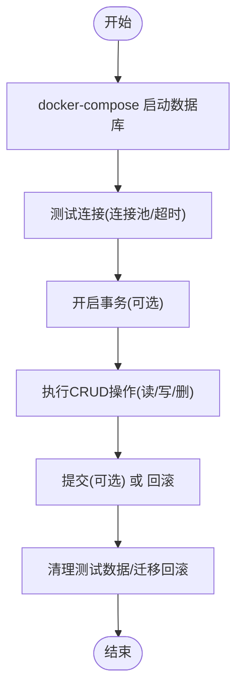

图表来源
- [copaw/docker-compose.yml:1-23](file://copaw/docker-compose.yml#L1-L23)

章节来源
- [copaw/docker-compose.yml:1-23](file://copaw/docker-compose.yml#L1-L23)

### 组件H：第三方服务集成测试
通过demo/mock-api提供可控的外部服务，便于断言响应格式、延迟与错误场景。

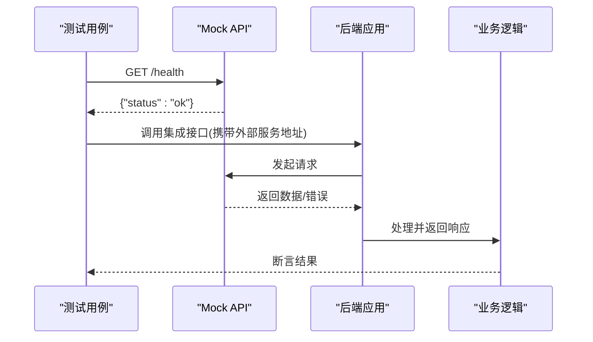

图表来源
- [demo/mock-api/app.py:35-125](file://demo/mock-api/app.py#L35-L125)

章节来源
- [demo/mock-api/app.py:1-148](file://demo/mock-api/app.py#L1-L148)

## 依赖分析
- 测试运行器依赖pytest及其插件（覆盖率、并行），并通过子进程调用pytest执行指定目录。
- 后端路由依赖认证、通道与配置模块，部分接口可能访问外部服务或数据库。
- 外部Mock API提供标准HTTP端点，便于集成测试断言。
- CI工作流使用Playwright进行端到端测试，与后端集成测试互补。

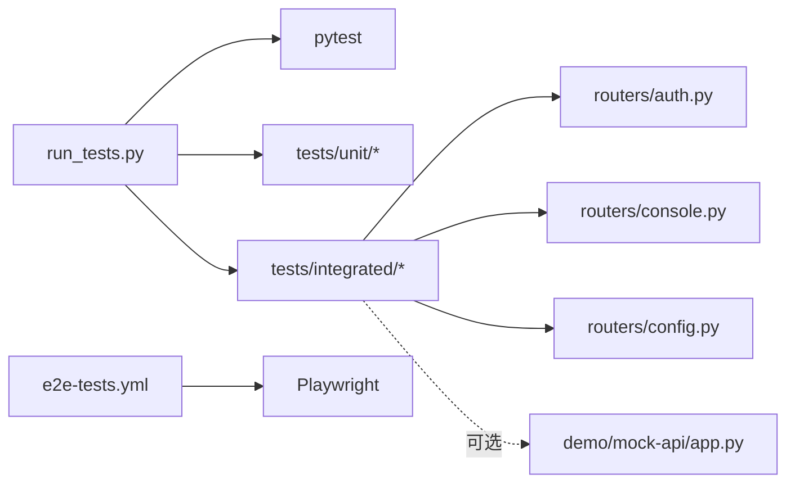

图表来源
- [copaw/scripts/run_tests.py:148-173](file://copaw/scripts/run_tests.py#L148-L173)
- [copaw/pyproject.toml:101-107](file://copaw/pyproject.toml#L101-L107)
- [.github/workflows/e2e-tests.yml:62-68](file://.github/workflows/e2e-tests.yml#L62-L68)

章节来源
- [copaw/scripts/run_tests.py:148-173](file://copaw/scripts/run_tests.py#L148-L173)
- [copaw/pyproject.toml:101-107](file://copaw/pyproject.toml#L101-L107)
- [.github/workflows/e2e-tests.yml:62-68](file://.github/workflows/e2e-tests.yml#L62-L68)

## 性能考虑
- 并行执行：使用pytest-xdist并行运行集成测试，缩短CI时间。
- 覆盖率：启用覆盖率报告，定位未覆盖的路由与分支。
- 超时与重试：对外部服务调用设置合理超时与指数退避重试。
- 资源复用：通过docker-compose共享数据库与缓存，减少冷启动开销。

## 故障排查指南
- 应用启动失败：检查日志中是否存在依赖缺失或端口占用；确认测试中对进程退出码与异常的断言。
- 控制台不可达：验证路由前缀与静态资源部署；断言Content-Type与HTML片段。
- 认证失败：核对鉴权开关、用户是否已注册、令牌是否过期；检查Authorization头格式。
- 健康检查失败：确认路由实现与端口映射；使用curl手动探测。
- 外部服务异常：检查Mock API端点与延迟参数；在网络层面验证连通性。
- 数据库问题：确认连接串、迁移状态与事务隔离级别；必要时回滚或重建测试库。

章节来源
- [copaw/tests/integrated/test_app_startup.py:73-104](file://copaw/tests/integrated/test_app_startup.py#L73-L104)
- [copaw/src/copaw/app/routers/auth.py:42-175](file://copaw/src/copaw/app/routers/auth.py#L42-L175)
- [copaw/src/copaw/app/routers/console.py:68-216](file://copaw/src/copaw/app/routers/console.py#L68-L216)
- [copaw/src/copaw/app/routers/config.py:344-401](file://copaw/src/copaw/app/routers/config.py#L344-L401)
- [demo/mock-api/app.py:35-125](file://demo/mock-api/app.py#L35-L125)

## 结论
通过统一的测试运行器、清晰的路由接口与可控的外部服务，CoPaw实现了可重复、可观测的集成测试体系。建议在CI中结合端到端测试与集成测试，配合覆盖率与失败重试策略，确保系统稳定性与交付质量。

## 附录

### 测试环境搭建清单
- 安装开发依赖（pytest、pytest-cov、pytest-xdist等）。
- 准备Mock API服务与数据库容器（可选）。
- 配置测试账户与鉴权开关（如需）。
- 在CI中启用Playwright端到端测试。

章节来源
- [copaw/pyproject.toml:71-99](file://copaw/pyproject.toml#L71-L99)
- [.github/workflows/e2e-tests.yml:58-68](file://.github/workflows/e2e-tests.yml#L58-L68)

### 测试数据准备与模拟服务
- 使用demo/mock-api提供标准化的健康检查、用户、产品与订单端点。
- 对于数据库测试，建议使用独立测试库与迁移脚本，测试前清理或回滚。
- 对于第三方服务，优先使用本地Mock，避免真实依赖。

章节来源
- [demo/mock-api/app.py:13-125](file://demo/mock-api/app.py#L13-L125)
- [copaw/docker-compose.yml:1-23](file://copaw/docker-compose.yml#L1-L23)

### 测试隔离策略与数据管理
- 使用独立测试账户与会话ID，避免跨用例污染。
- 对写操作使用事务并在断言后回滚。
- 使用随机端口与临时文件，测试结束后清理。
- 对外部服务使用固定基线数据与稳定响应。

章节来源
- [copaw/tests/integrated/test_app_startup.py:15-31](file://copaw/tests/integrated/test_app_startup.py#L15-L31)
- [copaw/src/copaw/app/routers/console.py:166-198](file://copaw/src/copaw/app/routers/console.py#L166-L198)

### 测试结果验证方法
- 对HTTP接口断言状态码、响应体字段与Content-Type。
- 对流式接口断言事件序列与错误兜底。
- 对鉴权接口断言令牌有效性与权限边界。
- 对配置接口断言热重载与规则生效。

章节来源
- [copaw/tests/integrated/test_app_startup.py:86-121](file://copaw/tests/integrated/test_app_startup.py#L86-L121)
- [copaw/src/copaw/app/routers/console.py:127-148](file://copaw/src/copaw/app/routers/console.py#L127-L148)
- [copaw/src/copaw/app/routers/auth.py:87-114](file://copaw/src/copaw/app/routers/auth.py#L87-L114)
- [copaw/src/copaw/app/routers/config.py:344-401](file://copaw/src/copaw/app/routers/config.py#L344-L401)

### 持续集成中的执行流程与失败处理
- CI中先运行端到端测试（Playwright），再运行集成测试（pytest）。
- 对失败工件（报告、日志）进行归档以便回溯。
- 对慢测试添加标记并在CI中选择性跳过。

章节来源
- [.github/workflows/e2e-tests.yml:40-80](file://.github/workflows/e2e-tests.yml#L40-L80)
- [copaw/pyproject.toml:104-107](file://copaw/pyproject.toml#L104-L107)