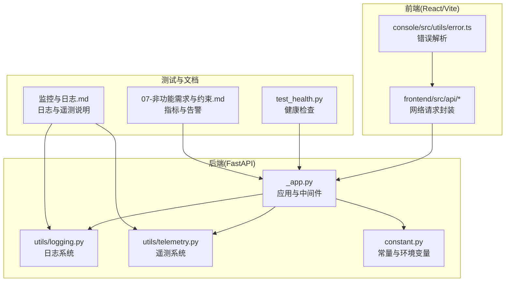
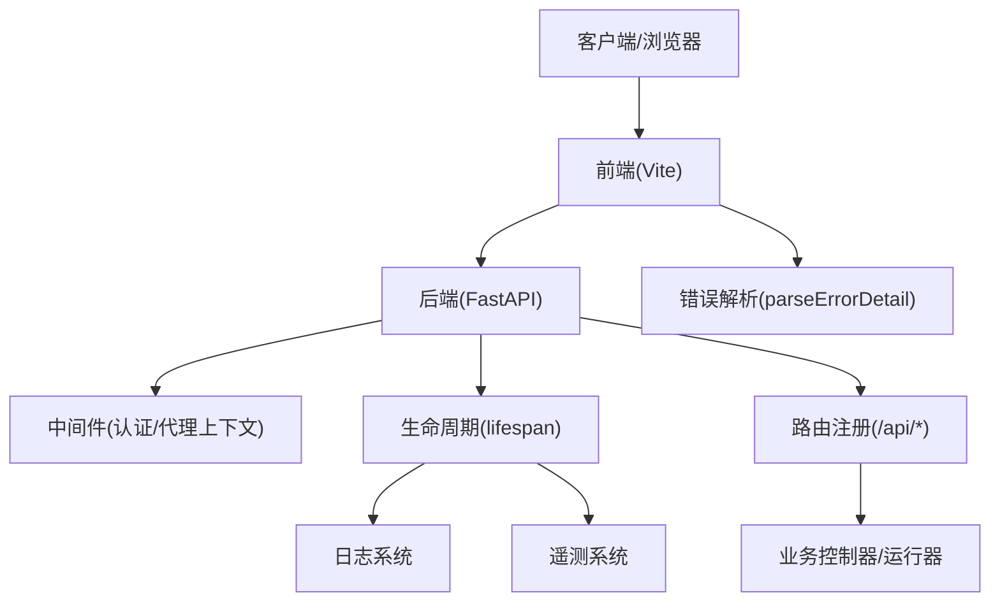
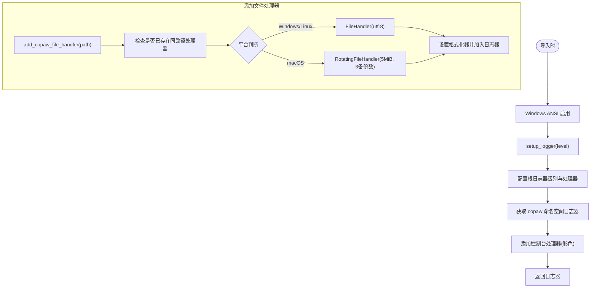
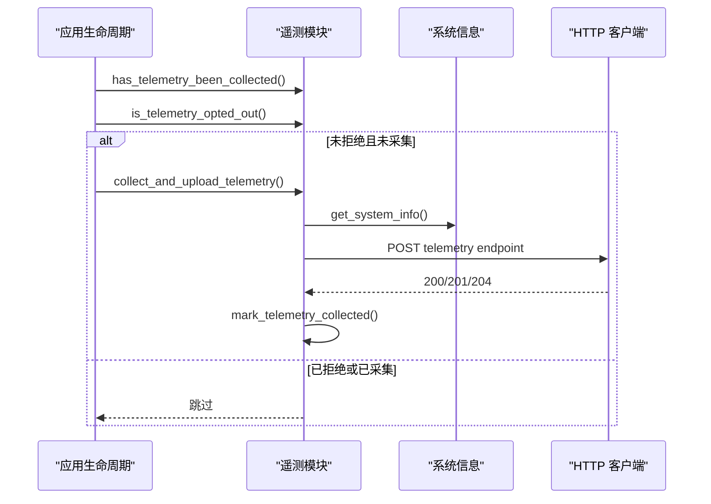
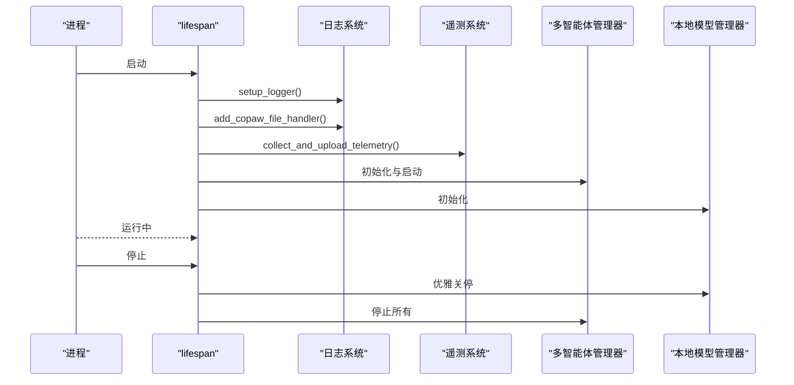
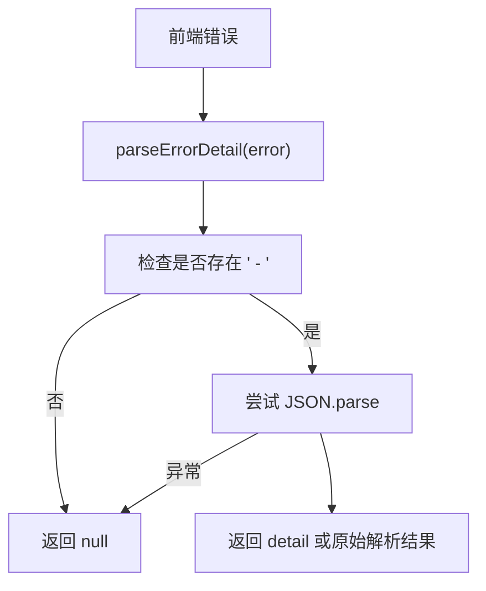
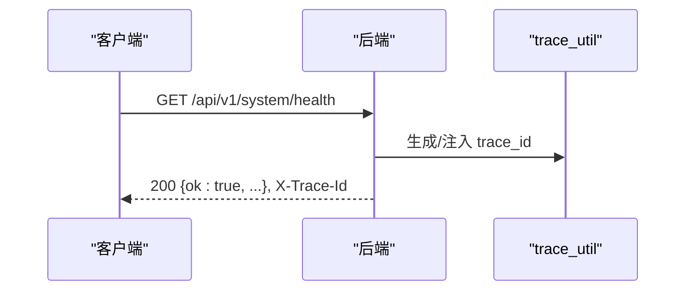
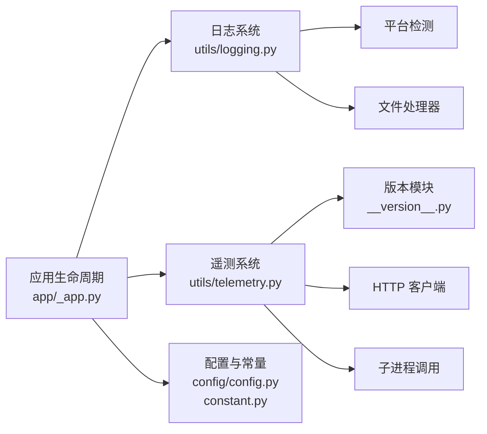

# 调试与性能分析

<cite>
**本文引用的文件**
- [src/copaw/utils/logging.py](file://src/copaw/utils/logging.py)
- [src/copaw/utils/telemetry.py](file://src/copaw/utils/telemetry.py)
- [src/copaw/app/_app.py](file://src/copaw/app/_app.py)
- [src/copaw/constant.py](file://src/copaw/constant.py)
- [src/copaw/console/src/utils/error.ts](file://src/copaw/console/src/utils/error.ts)
- [specs/copaw-repowiki/content/部署运维/监控与日志.md](file://specs/copaw-repowiki/content/部署运维/监控与日志.md)
- [specs/copaw-repowiki/content/开发指南/开发环境搭建.md](file://specs/copaw-repowiki/content/开发指南/开发环境搭建.md)
- [specs/workshop/module-05-multi-agent/docs/07-非功能需求与约束.md](file://specs/workshop/module-05-multi-agent/docs/07-非功能需求与约束.md)
- [main-project/backend/tests/test_health.py](file://main-project/backend/tests/test_health.py)
- [main-project/backend/app/errors.py](file://main-project/backend/app/errors.py)
- [main-project/backend/app/trace_util.py](file://main-project/backend/app/trace_util.py)
- [main-project/backend/app/openapi_spec.py](file://main-project/backend/app/openapi_spec.py)
- [main-project/backend/app/json_store.py](file://main-project/backend/app/json_store.py)
- [main-project/backend/pytest.ini](file://main-project/backend/pytest.ini)
- [main-project/backend/requirements.txt](file://main-project/backend/requirements.txt)
- [main-project/backend/wsgi.py](file://main-project/backend/wsgi.py)
- [main-project/backend/scripts/copaw_embedded_adapter_smoke.py](file://main-project/backend/scripts/copaw_embedded_adapter_smoke.py)
- [main-project/backend/scripts/copaw_source_smoke.py](file://main-project/backend/scripts/copaw_source_smoke.py)
- [main-project/frontend/src/pages/Compliance.tsx](file://main-project/frontend/src/pages/Compliance.tsx)
- [main-project/frontend/src/pages/Skills.tsx](file://main-project/frontend/src/pages/Skills.tsx)
- [main-project/frontend/package.json](file://main-project/frontend/package.json)
- [main-project/frontend/tsconfig.json](file://main-project/frontend/tsconfig.json)
- [main-project/frontend/vite.config.ts](file://main-project/frontend/vite.config.ts)
- [main-project/frontend/index.html](file://main-project/frontend/index.html)
- [main-project/frontend/src/App.tsx](file://main-project/frontend/src/App.tsx)
- [main-project/frontend/src/main.tsx](file://main-project/frontend/src/main.tsx)
- [main-project/frontend/src/vite-env.d.ts](file://main-project/frontend/src/vite-env.d.ts)
- [main-project/frontend/src/api/index.ts](file://main-project/frontend/src/api/index.ts)
- [main-project/frontend/src/api/request.ts](file://main-project/frontend/src/api/request.ts)
- [main-project/frontend/src/api/config.ts](file://main-project/frontend/src/api/config.ts)
- [main-project/frontend/src/api/types.ts](file://main-project/frontend/src/api/types.ts)
- [main-project/frontend/src/components/...](file://main-project/frontend/src/components/)
- [main-project/frontend/src/hooks/...](file://main-project/frontend/src/hooks/)
- [main-project/frontend/src/layouts/...](file://main-project/frontend/src/layouts/)
- [main-project/frontend/src/stores/...](file://main-project/frontend/src/stores/)
- [main-project/frontend/src/utils/...](file://main-project/frontend/src/utils/)
- [main-project/frontend/src/locales/...](file://main-project/frontend/src/locales/)
- [main-project/frontend/src/pages/...](file://main-project/frontend/src/pages/)
- [main-project/frontend/src/styles/...](file://main-project/frontend/src/styles/)
- [main-project/frontend/src/constants/...](file://main-project/frontend/src/constants/)
- [main-project/frontend/src/context/...](file://main-project/frontend/src/context/)
- [main-project/frontend/src/data/...](file://main-project/frontend/src/data/)
- [main-project/frontend/src/lib/...](file://main-project/frontend/src/lib/)
- [main-project/frontend/src/config/...](file://main-project/frontend/src/config/)
- [main-project/frontend/src/i18n/...](file://main-project/frontend/src/i18n/)
- [main-project/frontend/src/pages/Login/index.tsx](file://main-project/frontend/src/pages/Login/index.tsx)
- [main-project/frontend/src/pages/Login/LoginForm.tsx](file://main-project/frontend/src/pages/Login/LoginForm.tsx)
- [main-project/frontend/src/pages/Login/useLogin.ts](file://main-project/frontend/src/pages/Login/useLogin.ts)
- [main-project/frontend/src/pages/Login/api.ts](file://main-project/frontend/src/pages/Login/api.ts)
- [main-project/frontend/src/pages/Login/utils.ts](file://main-project/frontend/src/pages/Login/utils.ts)
- [main-project/frontend/src/pages/Login/store.ts](file://main-project/frontend/src/pages/Login/store.ts)
- [main-project/frontend/src/pages/Login/validation.ts](file://main-project/frontend/src/pages/Login/validation.ts)
- [main-project/frontend/src/pages/Login/locales/...](file://main-project/frontend/src/pages/Login/locales/)
- [main-project/frontend/src/pages/Login/styles/...](file://main-project/frontend/src/pages/Login/styles/)
- [main-project/frontend/src/pages/Login/components/...](file://main-project/frontend/src/pages/Login/components/)
- [main-project/frontend/src/pages/Login/hooks/...](file://main-project/frontend/src/pages/Login/hooks/)
- [main-project/frontend/src/pages/Login/context/...](file://main-project/frontend/src/pages/Login/context/)
- [main-project/frontend/src/pages/Login/data/...](file://main-project/frontend/src/pages/Login/data/)
- [main-project/frontend/src/pages/Login/lib/...](file://main-project/frontend/src/pages/Login/lib/)
- [main-project/frontend/src/pages/Login/config/...](file://main-project/frontend/src/pages/Login/config/)
- [main-project/frontend/src/pages/Login/i18n/...](file://main-project/frontend/src/pages/Login/i18n/)
- [main-project/frontend/src/pages/Login/constants/...](file://main-project/frontend/src/pages/Login/constants/)
- [main-project/frontend/src/pages/Login/utils.ts](file://main-project/frontend/src/pages/Login/utils.ts)
- [main-project/frontend/src/pages/Login/store.ts](file://main-project/frontend/src/pages/Login/store.ts)
- [main-project/frontend/src/pages/Login/validation.ts](file://main-project/frontend/src/pages/Login/validation.ts)
- [main-project/frontend/src/pages/Login/api.ts](file://main-project/frontend/src/pages/Login/api.ts)
- [main-project/frontend/src/pages/Login/useLogin.ts](file://main-project/frontend/src/pages/Login/useLogin.ts)
- [main-project/frontend/src/pages/Login/components/...](file://main-project/frontend/src/pages/Login/components/)
- [main-project/frontend/src/pages/Login/hooks/...](file://main-project/frontend/src/pages/Login/hooks/)
- [main-project/frontend/src/pages/Login/context/...](file://main-project/frontend/src/pages/Login/context/)
- [main-project/frontend/src/pages/Login/data/...](file://main-project/frontend/src/pages/Login/data/)
- [main-project/frontend/src/pages/Login/lib/...](file://main-project/frontend/src/pages/Login/lib/)
- [main-project/frontend/src/pages/Login/config/...](file://main-project/frontend/src/pages/Login/config/)
- [main-project/frontend/src/pages/Login/i18n/...](file://main-project/frontend/src/pages/Login/i18n/)
- [main-project/frontend/src/pages/Login/constants/...](file://main-project/frontend/src/pages/Login/constants/)
- [main-project/frontend/src/pages/Login/styles/...](file://main-project/frontend/src/pages/Login/styles/)
- [main-project/frontend/src/pages/Login/utils.ts](file://main-project/frontend/src/pages/Login/utils.ts)
- [main-project/frontend/src/pages/Login/store.ts](file://main-project/frontend/src/pages/Login/store.ts)
- [main-project/frontend/src/pages/Login/validation.ts](file://main-project/frontend/src/pages/Login/validation.ts)
- [main-project/frontend/src/pages/Login/api.ts](file://main-project/frontend/src/pages/Login/api.ts)
- [main-project/frontend/src/pages/Login/useLogin.ts](file://main-project/frontend/src/pages/Login/useLogin.ts)
- [main-project/frontend/src/pages/Login/components/...](file://main-project/frontend/src/pages/Login/components/)
- [main-project/frontend/src/pages/Login/hooks/...](file://main-project/frontend/src/pages/Login/hooks/)
- [main-project/frontend/src/pages/Login/context/...](file://main-project/frontend/src/pages/Login/context/)
- [main-project/frontend/src/pages/Login/data/...](file://main-project/frontend/src/pages/Login/data/)
- [main-project/frontend/src/pages/Login/lib/...](file://main-project/frontend/src/pages/Login/lib/)
- [main-project/frontend/src/pages/Login/config/...](file://main-project/frontend/src/pages/Login/config/)
- [main-project/frontend/src/pages/Login/i18n/...](file://main-project/frontend/src/pages/Login/i18n/)
- [main-project/frontend/src/pages/Login/constants/...](file://main-project/frontend/src/pages/Login/constants/)
- [main-project/frontend/src/pages/Login/styles/...](file://main-project/frontend/src/pages/Login/styles/)
- [main-project/frontend/src/pages/Login/utils.ts](file://main-project/frontend/src/pages/Login/utils.ts)
- [main-project/frontend/src/pages/Login/store.ts](file://main-project/frontend/src/pages/Login/store.ts)
- [main-project/frontend/src/pages/Login/validation.ts](file://main-project/frontend/src/pages/Login/validation.ts)
- [main-project/frontend/src/pages/Login/api.ts](file://main-project/frontend/src/pages/Login/api.ts)
- [main-project/frontend/src/pages/Login/useLogin.ts](file://main-project/frontend/src/pages/Login/useLogin.ts)
- [main-project/frontend/src/pages/Login/components/...](file://main-project/frontend/src/pages/Login/components/)
- [main-project/frontend/src/pages/Login/hooks/...](file://main-project/frontend/src/pages/Login/hooks/)
- [main-project/frontend/src/pages/Login/context/...](file://main-project/frontend/src/pages/Login/context/)
- [main-project/frontend/src/pages/Login/data/...](file://main-project/frontend/src/pages/Login/data/)
- [main-project/frontend/src/pages/Login/lib/...](file://main-project/frontend/src/pages/Login/lib/)
- [main-project/frontend/src/pages/Login/config/...](file://main-project/frontend/src/pages/Login/config/)
- [main-project/frontend/src/pages/Login/i18n/...](file://main-project/frontend/src/pages/Login/i18n/)
- [main-project/frontend/src/pages/Login/constants/...](file://main-project/frontend/src/pages/Login/constants/)
- [main-project/frontend/src/pages/Login/styles/...](file://main-project/frontend/src/pages/Login/styles/)
- [main-project/frontend/src/pages/Login/utils.ts](file://main-project/frontend/src/pages/Login/utils.ts)
- [main-project/frontend/src/pages/Login/store.ts](file://main-project/frontend/src/pages/Login/store.ts)
- [main-project/frontend/src/pages/Login/validation.ts](file://main-project/frontend/src/pages/Login/validation.ts)
- [main-project/frontend/src/pages/Login/api.ts](file://main-project/frontend/src/pages/Login/api.ts)
- [main-project/frontend/src/pages/Login/useLogin.ts](file://main-project/frontend/src/pages/Login/useLogin.ts)
- [main-project/frontend/src/pages/Login/components/...](file://main-project/frontend/src/pages/Login/components/)
- [main-project/frontend/src/pages/Login/hooks/...](file://main-project/frontend/src/pages/Login/hooks/)
- [main-project/frontend/src/pages/Login/context/...](file://main-project/frontend/src/pages/Login/context/)
- [main-project/frontend/src/pages/Login/data/...](file://main-project/frontend/src/pages/Login/data/)
- [main-project/frontend/src/pages/Login/lib/...](file://main-project/frontend/src/pages/Login/lib/)
- [main-project/frontend/src/pages/Login/config/...](file://main-project/frontend/src/pages/Login/config/)
- [main-project/frontend/src/pages/Login/i18n/...](file://main-project/frontend/src/pages/Login/i18n/)
- [main-project/frontend/src/pages/Login/constants/...](file://main-project/frontend/src/pages/Login/constants/)
- [main-project/frontend/src/pages/Login/styles/...](file://main-project/frontend/src/pages/Login/styles/)
- [main-project/frontend/src/pages/Login/utils.ts](file://main-project/frontend/src/pages/Login/utils.ts)
- [main-project/frontend/src/pages/Login/store.ts](file://main-project/frontend/src/pages/Login/store.ts)
- [main-project/frontend/src/pages/Login/validation.ts](file://main-project/frontend/src/pages/Login/validation.ts)
- [main-project/frontend/src/pages/Login/api.ts](file://main-project/frontend/src/pages/Login/api.ts)
- [main-project/frontend/src/pages/Login/useLogin.ts](file://main-project/frontend/src/pages/Login/useLogin.ts)
- [main-project/frontend/src/pages/Login/components/...](file://main-project/frontend/src/pages/Login/components/)
- [main-project/frontend/src/pages/Login/hooks/...](file://main-project/frontend/src/pages/Login/hooks/)
- [main-project/frontend/src/pages/Login/context/...](file://main-project/frontend/src/pages/Login/context/)
- [main-project/frontend/src/pages/Login/data/...](file://main-project/frontend/src/pages/Login/data/)
- [main-project/frontend/src/pages/Login/lib/...](file://main-project/frontend/src/pages/Login/lib/)
- [main-project/frontend/src/pages/Login/config/...](file://main-project/frontend/src/pages/Login/config/)
- [main-project/frontend/src/pages/Login/i18n/...](file://main-project/frontend/src/pages/Login/i18n/)
- [main-project/frontend/src/pages/Login/constants/...](file://main-project/frontend/src/pages/Login/constants/)
- [main-project/frontend/src/pages/Login/styles/...](file://main-project/frontend/src/pages/Login/styles/)
- [main-project/frontend/src/pages/Login/utils.ts](file://main-project/frontend/src/pages/Login/utils.ts)
- [main-project/frontend/src/pages/Login/store.ts](file://main-project/frontend/src/pages/Login/store.ts)
- [main-project/frontend/src/pages/Login/validation.ts](file://main-project/frontend/src/pages/Login/validation.ts)
- [main-project/frontend/src/pages/Login/api.ts](file://main-project/frontend/src/pages/Login/api.ts)
- [main-project/frontend/src/pages/Login/useLogin.ts](file://main-project/frontend/src/pages/Login/useLogin.ts)
- [main-project/frontend/src/pages/Login/components/...](file://main-project/frontend/src/pages/Login/components/)
- [main-project/frontend/src/pages/Login/hooks/...](file://main-project/frontend/src/pages/Login/hooks/)
- [main-project/frontend/src/pages/Login/context/...](file://main-project/frontend/src/pages/Login/context/)
- [main-project/frontend/src/pages/Login/data/...](file://main-project/frontend/src/pages/Login/data/)
- [main-project/frontend/src/pages/Login/lib/...](file://main-project/frontend/src/pages/Login/lib/)
- [main-project/frontend/src/pages/Login/config/...](file://main-project/frontend/src/pages/Login/config/)
- [main-project/frontend/src/pages/Login/i18n/...](file://main-project/frontend/src/pages/Login/i18n/)
- [main-project/frontend/src/pages/Login/constants/...](file://main-project/frontend/src/pages/Login/constants/)
- [main-project/frontend/src/pages/Login/styles/...](file://main-project/frontend/src/pages/Login/styles/)
- [main-project/frontend/src/pages/Login/utils.ts](file://main-project/frontend/src/pages/Login/utils.ts)
- [main-project/frontend/src/pages/Login/store.ts](file://main-project/frontend/src/pages/Login/store.ts)
- [main-project/frontend/src/pages/Login/validation.ts](file://main-project/frontend/src/pages/Login/validation.ts)
- [main-project/frontend/src/pages/Login/api.ts](file://main-project/frontend/src......)
</cite>

## 目录
1. [简介](#简介)
2. [项目结构](#项目结构)
3. [核心组件](#核心组件)
4. [架构总览](#架构总览)
5. [详细组件分析](#详细组件分析)
6. [依赖分析](#依赖分析)
7. [性能考量](#性能考量)
8. [故障排查指南](#故障排查指南)
9. [结论](#结论)
10. [附录](#附录)

## 简介
本指南面向开发者，聚焦于调试与性能分析实践，覆盖日志系统使用、调试工具配置、问题定位方法、Python调试器与前端调试技巧、网络请求分析、性能瓶颈识别、内存与CPU监控、生产环境问题排查、错误追踪与异常处理、常用调试命令与性能测试工具、监控指标解读以及常见问题的诊断思路与解决方案。

## 项目结构
本仓库包含后端（FastAPI）、前端（React/Vite）、CLI 工具、文档与示例工程。调试与性能分析涉及：
- 后端日志与遥测：日志格式、文件处理器、遥测采集与上传
- 应用生命周期：启动、中间件、静态资源、路由注册
- 前端错误解析与网络请求：错误消息解析、请求预览、响应摘要
- 测试与健康检查：单元测试、健康接口、跟踪头
- 监控指标与告警：建议指标命名与阈值

**图示来源**
- [src/copaw/app/_app.py:1-441](file://src/copaw/app/_app.py#L1-L441)
- [src/copaw/utils/logging.py:1-185](file://src/copaw/utils/logging.py#L1-L185)
- [src/copaw/utils/telemetry.py:1-311](file://src/copaw/utils/telemetry.py#L1-L311)
- [src/copaw/constant.py:1-271](file://src/copaw/constant.py#L1-L271)
- [src/copaw/console/src/utils/error.ts:1-12](file://src/copaw/console/src/utils/error.ts#L1-L12)
- [main-project/backend/tests/test_health.py:1-13](file://main-project/backend/tests/test_health.py#L1-L13)
- [specs/copaw-repowiki/content/部署运维/监控与日志.md:251-314](file://specs/copaw-repowiki/content/部署运维/监控与日志.md#L251-L314)
- [specs/workshop/module-05-multi-agent/docs/07-非功能需求与约束.md:77-100](file://specs/workshop/module-05-multi-agent/docs/07-非功能需求与约束.md#L77-L100)

**章节来源**
- [src/copaw/app/_app.py:1-441](file://src/copaw/app/_app.py#L1-L441)
- [src/copaw/utils/logging.py:1-185](file://src/copaw/utils/logging.py#L1-L185)
- [src/copaw/utils/telemetry.py:1-311](file://src/copaw/utils/telemetry.py#L1-L311)
- [src/copaw/constant.py:1-271](file://src/copaw/constant.py#L1-L271)
- [src/copaw/console/src/utils/error.ts:1-12](file://src/copaw/console/src/utils/error.ts#L1-L12)
- [main-project/backend/tests/test_health.py:1-13](file://main-project/backend/tests/test_health.py#L1-L13)
- [specs/copaw-repowiki/content/部署运维/监控与日志.md:251-314](file://specs/copaw-repowiki/content/部署运维/监控与日志.md#L251-L314)
- [specs/workshop/module-05-multi-agent/docs/07-非功能需求与约束.md:77-100](file://specs/workshop/module-05-multi-agent/docs/07-非功能需求与约束.md#L77-L100)

## 核心组件
- 日志系统：统一命名空间、彩色终端输出、可选文件处理器、访问日志过滤、平台差异化文件轮转
- 遥测系统：安装方式检测、系统信息采集、GPU检测、同步上传、幂等标记文件
- 应用生命周期：启动阶段注入日志与遥测、迁移与初始化、多智能体管理器、本地模型管理器、优雅关停
- 前端错误解析：从错误消息中提取结构化 detail 字段
- 健康检查与跟踪：健康接口返回 trace_id，便于端到端追踪

**章节来源**
- [src/copaw/utils/logging.py:104-185](file://src/copaw/utils/logging.py#L104-L185)
- [src/copaw/utils/telemetry.py:48-311](file://src/copaw/utils/telemetry.py#L48-L311)
- [src/copaw/app/_app.py:156-268](file://src/copaw/app/_app.py#L156-L268)
- [src/copaw/console/src/utils/error.ts:1-12](file://src/copaw/console/src/utils/error.ts#L1-L12)
- [main-project/backend/tests/test_health.py:1-13](file://main-project/backend/tests/test_health.py#L1-L13)

## 架构总览
后端通过 FastAPI 提供 API 与前端静态资源，中间件负责认证与代理上下文，应用生命周期负责多智能体与本地模型的初始化与关停。前端通过 API 封装发起请求，并在错误时解析 detail 信息辅助定位。

**图示来源**
- [src/copaw/app/_app.py:270-441](file://src/copaw/app/_app.py#L270-L441)
- [src/copaw/utils/logging.py:104-185](file://src/copaw/utils/logging.py#L104-L185)
- [src/copaw/utils/telemetry.py:292-311](file://src/copaw/utils/telemetry.py#L292-L311)
- [src/copaw/console/src/utils/error.ts:1-12](file://src/copaw/console/src/utils/error.ts#L1-L12)

## 详细组件分析

### 日志系统分析
- 统一日志命名空间与级别映射，仅输出 copaw 命名空间日志，避免第三方噪声
- 彩色终端输出，自动检测是否为 TTY，非 TTY 则禁用颜色
- 访问日志过滤：可抑制特定路径的 uvicorn 访问日志
- 文件处理器：Windows/Linux 使用简单文件处理器，macOS 使用轮转文件处理器，避免重复句柄与文件锁定
- 添加文件处理器为幂等操作，避免重复添加与描述符泄漏

**图示来源**
- [src/copaw/utils/logging.py:28-46](file://src/copaw/utils/logging.py#L28-L46)
- [src/copaw/utils/logging.py:104-139](file://src/copaw/utils/logging.py#L104-L139)
- [src/copaw/utils/logging.py:142-185](file://src/copaw/utils/logging.py#L142-L185)

**章节来源**
- [src/copaw/utils/logging.py:104-185](file://src/copaw/utils/logging.py#L104-L185)
- [specs/copaw-repowiki/content/部署运维/监控与日志.md:251-314](file://specs/copaw-repowiki/content/部署运维/监控与日志.md#L251-L314)

### 遥测系统分析
- 系统信息采集：安装方式、操作系统、架构、GPU 检测、版本信息
- GPU 检测：多平台后备策略（nvidia-smi、lspci、wmic、Apple Silicon）
- 上传：短超时同步上传，失败静默，不影响启动
- 标记文件：记录已采集版本列表，支持永久拒绝

**图示来源**
- [src/copaw/app/_app.py:168-183](file://src/copaw/app/_app.py#L168-L183)
- [src/copaw/utils/telemetry.py:48-311](file://src/copaw/utils/telemetry.py#L48-L311)

**章节来源**
- [src/copaw/utils/telemetry.py:48-311](file://src/copaw/utils/telemetry.py#L48-L311)
- [specs/copaw-repowiki/content/部署运维/监控与日志.md:251-314](file://specs/copaw-repowiki/content/部署运维/监控与日志.md#L251-L314)

### 应用生命周期与中间件
- 启动阶段：设置日志级别、加载环境变量、添加文件处理器、遥测采集、迁移与初始化、多智能体与本地模型管理器启动
- 关停阶段：优雅关闭本地模型服务、停止多智能体管理器
- 中间件：认证中间件、代理上下文中间件、CORS（开发模式）

**图示来源**
- [src/copaw/app/_app.py:156-268](file://src/copaw/app/_app.py#L156-L268)
- [src/copaw/utils/logging.py:104-185](file://src/copaw/utils/logging.py#L104-L185)
- [src/copaw/utils/telemetry.py:292-311](file://src/copaw/utils/telemetry.py#L292-L311)

**章节来源**
- [src/copaw/app/_app.py:156-268](file://src/copaw/app/_app.py#L156-L268)

### 前端错误解析与网络请求
- 错误解析：从错误消息中提取“ - ”后的 JSON，尝试解析 detail 字段
- 网络请求：统一的 API 封装，支持请求/响应预览，便于调试

**图示来源**
- [src/copaw/console/src/utils/error.ts:1-12](file://src/copaw/console/src/utils/error.ts#L1-L12)

**章节来源**
- [src/copaw/console/src/utils/error.ts:1-12](file://src/copaw/console/src/utils/error.ts#L1-L12)
- [main-project/frontend/src/pages/Skills.tsx:468-490](file://main-project/frontend/src/pages/Skills.tsx#L468-L490)

### 健康检查与跟踪
- 健康接口返回 ok 与 trace_id，便于端到端追踪
- 后端错误响应统一携带 trace_id 字段

**图示来源**
- [main-project/backend/tests/test_health.py:1-13](file://main-project/backend/tests/test_health.py#L1-L13)
- [main-project/backend/app/errors.py:4-9](file://main-project/backend/app/errors.py#L4-L9)

**章节来源**
- [main-project/backend/tests/test_health.py:1-13](file://main-project/backend/tests/test_health.py#L1-L13)
- [main-project/backend/app/errors.py:4-9](file://main-project/backend/app/errors.py#L4-L9)

## 依赖分析
- 日志系统依赖：平台检测、ANSI 支持、文件处理器（平台差异化）
- 遥测系统依赖：版本模块、HTTP 客户端、子进程调用、标记文件
- 应用生命周期依赖：常量模块（工作目录、日志级别）、配置模块（路径归一化、浏览器路径探测）

**图示来源**
- [src/copaw/utils/logging.py:28-46](file://src/copaw/utils/logging.py#L28-L46)
- [src/copaw/utils/logging.py:142-185](file://src/copaw/utils/logging.py#L142-L185)
- [src/copaw/utils/telemetry.py:172-182](file://src/copaw/utils/telemetry.py#L172-L182)
- [src/copaw/app/_app.py:148-200](file://src/copaw/app/_app.py#L148-L200)
- [src/copaw/constant.py:72-121](file://src/copaw/constant.py#L72-L121)

**章节来源**
- [specs/copaw-repowiki/content/部署运维/监控与日志.md:266-287](file://specs/copaw-repowiki/content/部署运维/监控与日志.md#L266-L287)

## 性能考量
- 日志性能：控制台输出启用颜色与相对路径解析，开销较低；macOS 使用轮转避免单文件过大；Windows/Linux 减少锁竞争
- 遥测性能：短超时同步上传，失败静默，不影响启动；GPU 检测多途径探测，失败即降级
- 进程与容器：进程快照回退策略避免阻塞；容器内优先使用系统浏览器路径减少下载成本

**章节来源**
- [specs/copaw-repowiki/content/部署运维/监控与日志.md:299-314](file://specs/copaw-repowiki/content/部署运维/监控与日志.md#L299-L314)

## 故障排查指南

### 日志与文件定位
- 设置日志级别：通过环境变量控制日志级别，确保启动阶段与子进程一致
- 查看应用日志：启动时会添加 copaw.log 文件处理器，定位工作目录下的日志文件
- 过滤访问日志：如需屏蔽特定路径的访问日志，可使用访问日志过滤器

**章节来源**
- [src/copaw/constant.py:126-127](file://src/copaw/constant.py#L126-L127)
- [src/copaw/app/_app.py:161-161](file://src/copaw/app/_app.py#L161-L161)
- [src/copaw/utils/logging.py:82-102](file://src/copaw/utils/logging.py#L82-L102)

### Python 调试器与断点
- 后端调试：在 IDE 中附加到 uvicorn 进程，在应用入口或 CLI 入口设置断点
- 前端调试：在浏览器控制台或 IDE 中打开前端页面，利用 Vite 的热重载与断点调试
- 热重载：前端 Vite HMR，后端结合 pre-commit 与测试命令快速验证

**章节来源**
- [specs/copaw-repowiki/content/开发指南/开发环境搭建.md:268-299](file://specs/copaw-repowiki/content/开发指南/开发环境搭建.md#L268-L299)

### 网络请求分析
- 前端错误解析：从错误消息中提取 detail，辅助定位后端返回的结构化错误
- 请求/响应预览：在技能页面展示请求与响应摘要，便于快速核对参数与返回
- 健康检查与跟踪：通过健康接口获取 trace_id，结合后端日志进行端到端追踪

**章节来源**
- [src/copaw/console/src/utils/error.ts:1-12](file://src/copaw/console/src/utils/error.ts#L1-L12)
- [main-project/frontend/src/pages/Skills.tsx:468-490](file://main-project/frontend/src/pages/Skills.tsx#L468-L490)
- [main-project/backend/tests/test_health.py:1-13](file://main-project/backend/tests/test_health.py#L1-L13)
- [main-project/backend/app/errors.py:4-9](file://main-project/backend/app/errors.py#L4-L9)

### 生产环境问题排查
- 遥测与版本：确认遥测是否被拒绝或已采集，避免重复提示；版本变更时重新触发采集
- 进程与容器：容器内优先使用系统浏览器路径，减少下载成本；进程快照回退策略避免阻塞
- 健康与可观测性：结合健康接口与 trace_id，定位请求链路；关注 5xx/429 占比与 P95

**章节来源**
- [src/copaw/utils/telemetry.py:194-241](file://src/copaw/utils/telemetry.py#L194-L241)
- [specs/workshop/module-05-multi-agent/docs/07-非功能需求与约束.md:88-100](file://specs/workshop/module-05-multi-agent/docs/07-非功能需求与约束.md#L88-L100)

### 错误追踪与异常处理
- 统一错误响应：后端错误响应携带错误码与 trace_id，便于前端与日志关联
- 前端错误解析：parseErrorDetail 提取 detail，辅助定位业务错误
- 健康接口：返回 trace_id，便于端到端追踪

**章节来源**
- [main-project/backend/app/errors.py:4-9](file://main-project/backend/app/errors.py#L4-L9)
- [src/copaw/console/src/utils/error.ts:1-12](file://src/copaw/console/src/utils/error.ts#L1-L12)
- [main-project/backend/tests/test_health.py:1-13](file://main-project/backend/tests/test_health.py#L1-L13)

### 性能瓶颈识别与监控
- 指标建议：HTTP 请求总量/耗时直方图、回合次数/耗时、工具调用次数/状态、模型错误计数
- 告警阈值：5xx 占比、POST /turn P95、模型错误增速、429 占比、403 突增
- 前端监控：在技能页面展示响应时间、成功率、QPS、超时率等指标

**章节来源**
- [specs/workshop/module-05-multi-agent/docs/07-非功能需求与约束.md:77-100](file://specs/workshop/module-05-multi-agent/docs/07-非功能需求与约束.md#L77-L100)
- [main-project/frontend/src/pages/Skills.tsx:410-431](file://main-project/frontend/src/pages/Skills.tsx#L410-L431)

### 常用调试命令与工具
- 后端：使用 uvicorn 启动，结合 IDE 断点；pytest 运行测试，观察健康接口与 trace_id
- 前端：Vite 开发服务器，热重载与断点调试；浏览器开发者工具 Network/Console
- 文档与脚本：参考开发环境搭建与监控日志文档，使用 smoke 测试脚本验证集成

**章节来源**
- [specs/copaw-repowiki/content/开发指南/开发环境搭建.md:268-299](file://specs/copaw-repowiki/content/开发指南/开发环境搭建.md#L268-L299)
- [main-project/backend/tests/test_health.py:1-13](file://main-project/backend/tests/test_health.py#L1-L13)
- [main-project/backend/scripts/copaw_embedded_adapter_smoke.py](file://main-project/backend/scripts/copaw_embedded_adapter_smoke.py)
- [main-project/backend/scripts/copaw_source_smoke.py](file://main-project/backend/scripts/copaw_source_smoke.py)

## 结论
通过统一的日志与遥测体系、清晰的应用生命周期、完善的错误与健康机制，以及前端的错误解析与网络请求预览，开发者可以高效地进行调试与性能分析。建议在生产环境中结合指标与告警，配合 trace_id 实现端到端追踪，并依据平台差异优化日志与遥测策略。

## 附录

### 常见问题诊断思路
- 启动慢：检查日志级别、文件处理器与轮转策略；确认容器内浏览器路径与下载成本
- 5xx/429：关注健康接口与 trace_id，结合告警阈值定位上游限流或错误
- 前端报错：使用 parseErrorDetail 提取 detail，查看请求/响应预览核对参数

**章节来源**
- [specs/workshop/module-05-multi-agent/docs/07-非功能需求与约束.md:88-100](file://specs/workshop/module-05-multi-agent/docs/07-非功能需求与约束.md#L88-L100)
- [src/copaw/console/src/utils/error.ts:1-12](file://src/copaw/console/src/utils/error.ts#L1-L12)
- [main-project/frontend/src/pages/Skills.tsx:468-490](file://main-project/frontend/src/pages/Skills.tsx#L468-L490)