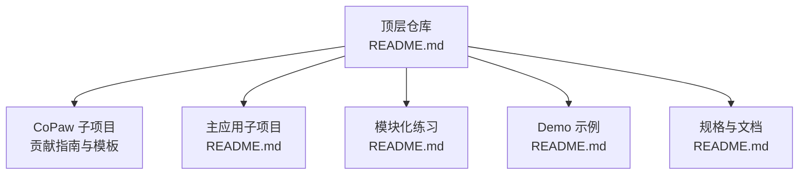
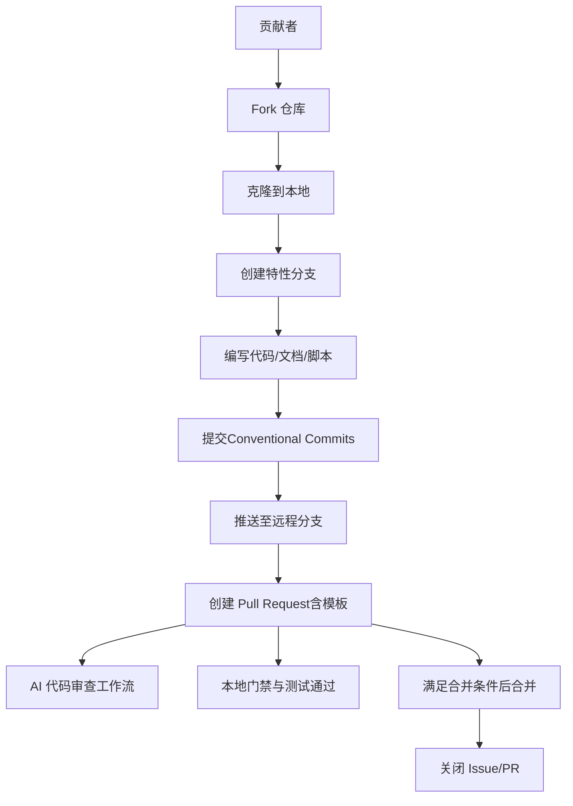
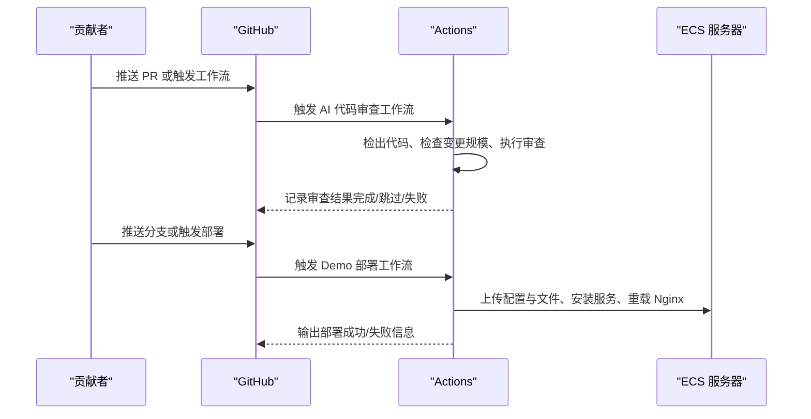
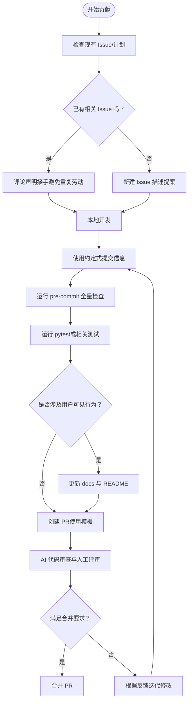
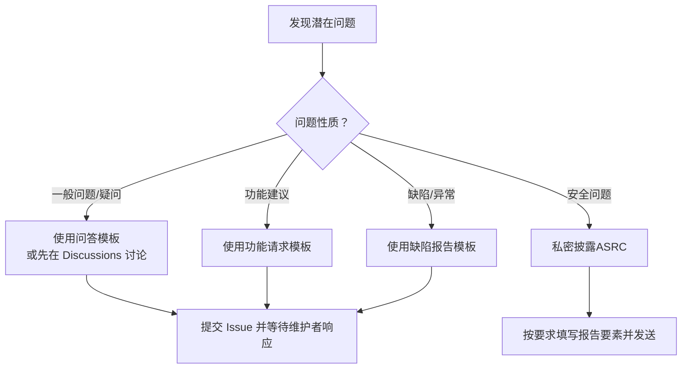
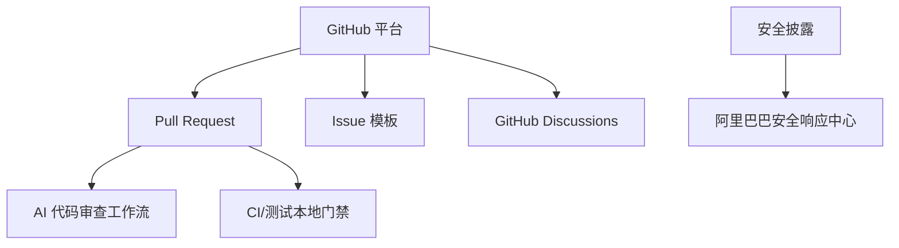

# 贡献流程

<cite>
**本文引用的文件**
- [README.md](file://README.md)
- [README.md](file://copaw/README.md)
- [CONTRIBUTING.md](file://copaw/CONTRIBUTING.md)
- [.github/PULL_REQUEST_TEMPLATE.md](file://copaw/.github/PULL_REQUEST_TEMPLATE.md)
- [.github/ISSUE_TEMPLATE/1-question.md](file://copaw/.github/ISSUE_TEMPLATE/1-question.md)
- [.github/ISSUE_TEMPLATE/2-feature_request.md](file://copaw/.github/ISSUE_TEMPLATE/2-feature_request.md)
- [.github/ISSUE_TEMPLATE/4-bug_report.md](file://copaw/.github/ISSUE_TEMPLATE/4-bug_report.md)
- [.github/ISSUE_TEMPLATE/config.yml](file://copaw/.github/ISSUE_TEMPLATE/config.yml)
- [SECURITY.md](file://copaw/SECURITY.md)
- [.github/workflows/ai-code-review.yml](file://.github/workflows/ai-code-review.yml)
- [.github/workflows/deploy-demo.yml](file://.github/workflows/deploy-demo.yml)
</cite>

## 目录
1. [简介](#简介)
2. [项目结构](#项目结构)
3. [核心组件](#核心组件)
4. [架构总览](#架构总览)
5. [详细组件分析](#详细组件分析)
6. [依赖分析](#依赖分析)
7. [性能考虑](#性能考虑)
8. [故障排查指南](#故障排查指南)
9. [结论](#结论)
10. [附录](#附录)

## 简介
本文件面向开发者，系统化说明本仓库的贡献流程、GitHub 工作流、分支策略与版本管理规范，并覆盖 Fork 流程、本地开发环境设置、Pull Request 创建步骤、代码审查流程、合并要求、冲突解决方法、Issue 报告模板与安全披露流程、社区行为准则与沟通规范、协作最佳实践，以及新贡献者的入门指导与常见问题解答。内容基于仓库内现有贡献指南、模板与工作流文件整理而成。

## 项目结构
本仓库采用 monorepo 结构，顶层包含主应用、CoPaw 底座、模块化练习、Demo 示例与规格文档等子项目。贡献流程主要围绕 CoPaw 子项目展开，同时其他子项目（如 main-project、modules-practice、demo 等）也遵循类似的协作方式。

**章节来源**
- [README.md:1-26](file://README.md#L1-L26)

## 核心组件
- 贡献指南与规范：定义提交信息格式、PR 标题格式、本地门禁检查、质量与文档更新要求。
- Issue 模板：问答、功能请求、缺陷报告、文档改进等模板，帮助标准化问题描述。
- Pull Request 模板：强制填写变更类型、影响范围、自测清单、测试方法等。
- 安全策略：私密漏洞披露流程、报告要素、信任模型与边界说明。
- GitHub Actions 工作流：AI 代码审查、Demo 部署等自动化流程。

**章节来源**
- [CONTRIBUTING.md:11-86](file://copaw/CONTRIBUTING.md#L11-L86)
- [.github/PULL_REQUEST_TEMPLATE.md:1-54](file://copaw/.github/PULL_REQUEST_TEMPLATE.md#L1-L54)
- [.github/ISSUE_TEMPLATE/1-question.md:1-24](file://copaw/.github/ISSUE_TEMPLATE/1-question.md#L1-L24)
- [.github/ISSUE_TEMPLATE/2-feature_request.md:1-44](file://copaw/.github/ISSUE_TEMPLATE/2-feature_request.md#L1-L44)
- [.github/ISSUE_TEMPLATE/4-bug_report.md:1-63](file://copaw/.github/ISSUE_TEMPLATE/4-bug_report.md#L1-L63)
- [SECURITY.md:1-158](file://copaw/SECURITY.md#L1-L158)

## 架构总览
下图展示贡献流程的关键参与者与自动化流程：

**图表来源**
- [CONTRIBUTING.md:23-86](file://copaw/CONTRIBUTING.md#L23-L86)
- [.github/workflows/ai-code-review.yml:1-109](file://.github/workflows/ai-code-review.yml#L1-L109)
- [.github/PULL_REQUEST_TEMPLATE.md:1-54](file://copaw/.github/PULL_REQUEST_TEMPLATE.md#L1-L54)

## 详细组件分析

### GitHub 工作流与自动化
- AI 代码审查工作流：在 PR 打开/同步/重新打开时触发，仅对代码与工作流相关文件触发，支持按行数阈值跳过以控制成本，并在完成后设置检查状态。
- Demo 部署工作流：支持手动触发与 push 到特定路径时触发，负责部署 Nginx 配置、上传 Demo 文件、安装并启动 Mock API 服务。

**图表来源**
- [.github/workflows/ai-code-review.yml:12-109](file://.github/workflows/ai-code-review.yml#L12-L109)
- [.github/workflows/deploy-demo.yml:6-179](file://.github/workflows/deploy-demo.yml#L6-L179)

**章节来源**
- [.github/workflows/ai-code-review.yml:1-109](file://.github/workflows/ai-code-review.yml#L1-L109)
- [.github/workflows/deploy-demo.yml:1-179](file://.github/workflows/deploy-demo.yml#L1-L179)

### 分支策略与版本管理
- 提交信息与 PR 标题遵循约定式提交规范，类型包括 feat、fix、docs、test、refactor、chore、perf、style、build、revert 等，确保历史清晰、便于工具解析。
- 本地门禁要求：安装开发依赖、安装并运行 pre-commit、运行 pytest，且 CI 对预提交检查失败的 PR 不予合并。
- 前端格式化：若涉及 console 或 website 目录，需在提交前运行前端格式化命令。
- 文档更新：新增或变更用户可见行为时，需同步更新 docs 与 README。

**图表来源**
- [CONTRIBUTING.md:15-86](file://copaw/CONTRIBUTING.md#L15-L86)
- [.github/PULL_REQUEST_TEMPLATE.md:1-54](file://copaw/.github/PULL_REQUEST_TEMPLATE.md#L1-L54)

**章节来源**
- [CONTRIBUTING.md:23-86](file://copaw/CONTRIBUTING.md#L23-L86)

### Fork 流程与本地开发环境设置
- Fork：在 GitHub 上 Fork 主仓库至个人空间。
- 克隆与安装：按照贡献指南中的“从源码安装”步骤，先构建前端，再安装 Python 包，最后初始化并运行应用。
- 本地门禁：安装开发依赖、安装并运行 pre-commit、运行 pytest，确保通过后再提交。
- 前端格式化：如涉及 console 或 website 目录，提交前运行对应格式化命令。

**章节来源**
- [CONTRIBUTING.md:68-86](file://copaw/CONTRIBUTING.md#L68-L86)
- [README.md:438-461](file://copaw/README.md#L438-L461)

### Pull Request 创建步骤与模板
- PR 标题：遵循约定式提交格式，包含类型与作用域。
- 模板字段：描述变更目的、关联 Issue、安全注意事项、变更类型、影响范围、自检清单、测试方法、附加说明等。
- 自检清单：本地运行 pre-commit 与测试、文档更新、确认准备就绪。

**章节来源**
- [CONTRIBUTING.md:51-67](file://copaw/CONTRIBUTING.md#L51-L67)
- [.github/PULL_REQUEST_TEMPLATE.md:1-54](file://copaw/.github/PULL_REQUEST_TEMPLATE.md#L1-L54)

### 代码审查流程与合并要求
- AI 代码审查：自动触发并生成审查意见，支持跳过超大规模 PR。
- 人工评审：保持尊重与建设性的沟通，遵循社区行为准则。
- 合并要求：本地门禁必须全部通过，CI 通过，PR 模板填写完整，无阻塞性冲突。

**章节来源**
- [.github/workflows/ai-code-review.yml:12-109](file://.github/workflows/ai-code-review.yml#L12-L109)
- [CONTRIBUTING.md:77-86](file://copaw/CONTRIBUTING.md#L77-L86)

### 冲突解决方法
- 频繁同步：在长周期开发中定期同步上游 main/master，减少后期合并冲突。
- 小步提交：将大改动拆分为多个小 PR，降低冲突概率与评审负担。
- 明确边界：严格遵守贡献指南中的类型与作用域规范，避免不必要的变更范围扩大。
- 优先处理阻塞性冲突：当出现阻塞性冲突时，优先与维护者沟通，明确修改边界与实现方案。

**章节来源**
- [CONTRIBUTING.md:208-226](file://copaw/CONTRIBUTING.md#L208-L226)

### Issue 报告模板与安全披露
- 问答模板：适用于提问或发起讨论，建议先在 Discussions 中搜索或讨论。
- 功能请求模板：描述动机、受影响组件、解决方案、替代方案与附加上下文。
- 缺陷报告模板：提供版本、描述、受影响组件、环境、复现步骤、实际/期望结果、日志截图与附加说明。
- 安全披露：通过阿里巴巴安全响应中心（ASRC）私密披露，报告需包含标题、严重性、影响、受影响组件、技术复现步骤、影响演示、环境、修复建议等；缺失关键要素可能导致无效或延迟处理。

**图表来源**
- [.github/ISSUE_TEMPLATE/1-question.md:1-24](file://copaw/.github/ISSUE_TEMPLATE/1-question.md#L1-L24)
- [.github/ISSUE_TEMPLATE/2-feature_request.md:1-44](file://copaw/.github/ISSUE_TEMPLATE/2-feature_request.md#L1-L44)
- [.github/ISSUE_TEMPLATE/4-bug_report.md:1-63](file://copaw/.github/ISSUE_TEMPLATE/4-bug_report.md#L1-L63)
- [SECURITY.md:5-63](file://copaw/SECURITY.md#L5-L63)

**章节来源**
- [.github/ISSUE_TEMPLATE/config.yml:1-13](file://copaw/.github/ISSUE_TEMPLATE/config.yml#L1-L13)
- [.github/ISSUE_TEMPLATE/1-question.md:1-24](file://copaw/.github/ISSUE_TEMPLATE/1-question.md#L1-L24)
- [.github/ISSUE_TEMPLATE/2-feature_request.md:1-44](file://copaw/.github/ISSUE_TEMPLATE/2-feature_request.md#L1-L44)
- [.github/ISSUE_TEMPLATE/4-bug_report.md:1-63](file://copaw/.github/ISSUE_TEMPLATE/4-bug_report.md#L1-L63)
- [SECURITY.md:5-63](file://copaw/SECURITY.md#L5-L63)

### 社区行为准则与沟通规范
- 尊重与建设性：鼓励积极、包容与专业的交流，遵守欢迎的社区行为准则。
- 沟通渠道：Issues 用于缺陷与功能请求，Discussions 用于开放话题与想法，文档与网站提供使用指南。
- 安全披露：敏感问题请私密披露，避免在公开渠道暴露细节。

**章节来源**
- [CONTRIBUTING.md:208-217](file://copaw/CONTRIBUTING.md#L208-L217)
- [CONTRIBUTING.md:229-236](file://copaw/CONTRIBUTING.md#L229-L236)
- [SECURITY.md:59-63](file://copaw/SECURITY.md#L59-L63)

### 协作最佳实践
- 从小处入手：优先提交小而聚焦的改动，降低评审与合并风险。
- 先讨论后实现：对较大或设计敏感的改动，先在 Issue 中讨论，达成一致后再实现。
- 保持一致性：遵循约定式提交、统一的 PR/Issue 模板与代码风格。
- 文档同步：任何用户可见的行为变更都应同步更新文档与 README。

**章节来源**
- [CONTRIBUTING.md:208-217](file://copaw/CONTRIBUTING.md#L208-L217)
- [CONTRIBUTING.md:85-86](file://copaw/CONTRIBUTING.md#L85-L86)

### 新贡献者入门指导
- 阅读顶层与子项目 README，了解项目定位与学习路径。
- 选择感兴趣的方向：横向扩展（新通道、模型提供商、技能、MCP）、既有功能增强与优化。
- 使用贡献指南进行本地开发与测试，确保通过本地门禁。
- 通过 Issue 模板提交问题或功能请求，或直接创建 PR。

**章节来源**
- [README.md:7-26](file://README.md#L7-L26)
- [README.md:463-471](file://copaw/README.md#L463-L471)
- [CONTRIBUTING.md:68-86](file://copaw/CONTRIBUTING.md#L68-L86)

## 依赖分析
贡献流程相关的主要外部依赖与集成点：
- GitHub Actions：AI 代码审查与 Demo 部署工作流。
- Issue 模板与 Discussions：问题分类与沟通渠道。
- 安全披露：ASRC 私密披露通道。

**图表来源**
- [.github/workflows/ai-code-review.yml:1-109](file://.github/workflows/ai-code-review.yml#L1-L109)
- [.github/ISSUE_TEMPLATE/config.yml:6-12](file://copaw/.github/ISSUE_TEMPLATE/config.yml#L6-L12)
- [SECURITY.md:7-10](file://copaw/SECURITY.md#L7-L10)

**章节来源**
- [.github/workflows/ai-code-review.yml:1-109](file://.github/workflows/ai-code-review.yml#L1-L109)
- [.github/ISSUE_TEMPLATE/config.yml:1-13](file://copaw/.github/ISSUE_TEMPLATE/config.yml#L1-L13)
- [SECURITY.md:1-158](file://copaw/SECURITY.md#L1-L158)

## 性能考虑
- 控制 PR 规模：AI 代码审查对超过一定行数的 PR 会跳过，建议拆分大改动以提升审查效率与成本控制。
- 本地门禁前置：在推送前完成 pre-commit 与测试，减少 CI 失败与反复迭代。
- 前端格式化：涉及前端目录时提前格式化，避免 CI 中因格式问题导致失败。

**章节来源**
- [.github/workflows/ai-code-review.yml:48-67](file://.github/workflows/ai-code-review.yml#L48-L67)
- [CONTRIBUTING.md:77-84](file://copaw/CONTRIBUTING.md#L77-L84)

## 故障排查指南
- 预提交检查失败：根据提示修复或由 pre-commit 自动修复后再次运行，直至通过。
- 测试失败：在本地运行相应测试套件，定位失败用例并修复。
- 文档未更新：若涉及用户可见行为变更，务必同步更新 docs 与 README。
- 安全问题：请勿在公开渠道披露，按安全策略通过私密渠道提交。

**章节来源**
- [CONTRIBUTING.md:77-86](file://copaw/CONTRIBUTING.md#L77-L86)
- [SECURITY.md:24-35](file://copaw/SECURITY.md#L24-L35)

## 结论
本贡献流程以约定式提交、严格的本地门禁与模板化协作为核心，辅以 AI 代码审查与文档同步机制，旨在提升代码质量、降低沟通成本并加速交付。建议新贡献者从 Issue 讨论与小改动入手，逐步深入参与更大范围的改进与扩展。

## 附录

### 常用链接与入口
- 贡献指南：[CONTRIBUTING.md](file://copaw/CONTRIBUTING.md)
- 顶层说明：[README.md](file://README.md)
- CoPaw 说明与安装：[README.md](file://copaw/README.md)
- 安全策略：[SECURITY.md](file://copaw/SECURITY.md)
- AI 代码审查工作流：[ai-code-review.yml](file://.github/workflows/ai-code-review.yml)
- Demo 部署工作流：[deploy-demo.yml](file://.github/workflows/deploy-demo.yml)