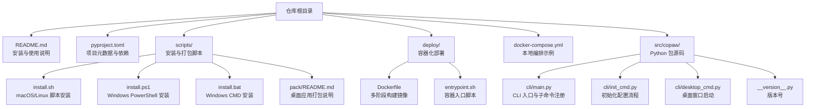
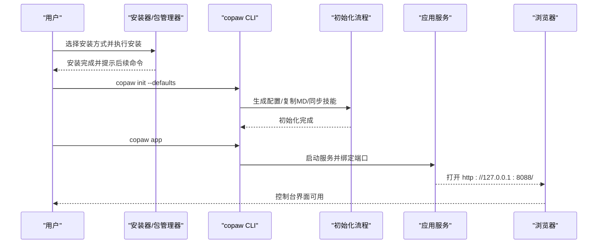
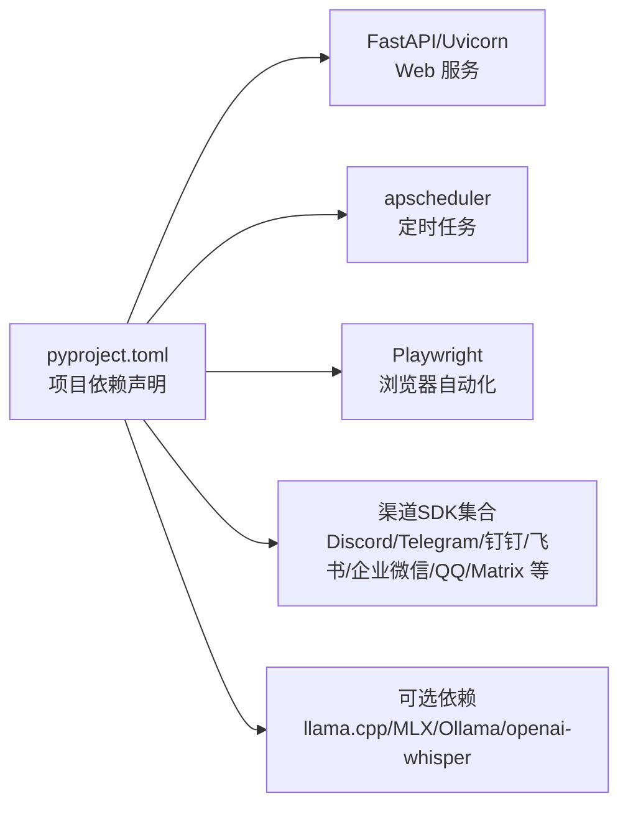

# 快速开始

<cite>
**本文引用的文件**
- [README.md](file://README.md)
- [specs/copaw-repowiki/content/快速开始.md](file://specs/copaw-repowiki/content/快速开始.md)
- [specs/copaw-repowiki/content/故障排除.md](file://specs/copaw-repowiki/content/故障排除.md)
- [pyproject.toml](file://pyproject.toml)
- [setup.py](file://setup.py)
- [scripts/install.sh](file://scripts/install.sh)
- [scripts/install.ps1](file://scripts/install.ps1)
- [scripts/install.bat](file://scripts/install.bat)
- [scripts/README.md](file://scripts/README.md)
- [deploy/Dockerfile](file://deploy/Dockerfile)
- [deploy/entrypoint.sh](file://deploy/entrypoint.sh)
- [docker-compose.yml](file://docker-compose.yml)
- [scripts/pack/README.md](file://scripts/pack/README.md)
- [src/copaw/__version__.py](file://src/copaw/__version__.py)
- [src/copaw/cli/main.py](file://src/copaw/cli/main.py)
- [src/copaw/cli/init_cmd.py](file://src/copaw/cli/init_cmd.py)
- [src/copaw/cli/desktop_cmd.py](file://src/copaw/cli/desktop_cmd.py)
</cite>

## 目录
1. [简介](#简介)
2. [项目结构](#项目结构)
3. [核心组件](#核心组件)
4. [架构总览](#架构总览)
5. [详细组件分析](#详细组件分析)
6. [依赖关系分析](#依赖关系分析)
7. [性能与资源建议](#性能与资源建议)
8. [故障排除指南](#故障排除指南)
9. [结论](#结论)
10. [附录](#附录)

## 简介
本指南面向首次接触 CoPaw 的用户，帮助你在最短时间内完成安装、配置与首次运行，并进行基本的聊天交互。文档覆盖多种安装方式：pip 安装、脚本安装（macOS/Linux/Windows）、桌面应用安装（Beta）、Docker 部署等；同时提供环境准备、依赖安装、首次配置流程、常见问题排查以及多操作系统下的注意事项。

## 项目结构
为便于理解安装与运行流程，以下图示展示与"快速开始"强相关的目录与文件：

图表来源
- [README.md](file://README.md)
- [pyproject.toml](file://pyproject.toml)
- [scripts/install.sh](file://scripts/install.sh)
- [scripts/install.ps1](file://scripts/install.ps1)
- [scripts/install.bat](file://scripts/install.bat)
- [scripts/pack/README.md](file://scripts/pack/README.md)
- [deploy/Dockerfile](file://deploy/Dockerfile)
- [deploy/entrypoint.sh](file://deploy/entrypoint.sh)
- [docker-compose.yml](file://docker-compose.yml)
- [src/copaw/cli/main.py](file://src/copaw/cli/main.py)
- [src/copaw/cli/init_cmd.py](file://src/copaw/cli/init_cmd.py)
- [src/copaw/cli/desktop_cmd.py](file://src/copaw/cli/desktop_cmd.py)
- [src/copaw/__version__.py](file://src/copaw/__version__.py)

章节来源
- [README.md](file://README.md)
- [pyproject.toml](file://pyproject.toml)
- [scripts/install.sh](file://scripts/install.sh)
- [scripts/install.ps1](file://scripts/install.ps1)
- [scripts/install.bat](file://scripts/install.bat)
- [scripts/pack/README.md](file://scripts/pack/README.md)
- [deploy/Dockerfile](file://deploy/Dockerfile)
- [deploy/entrypoint.sh](file://deploy/entrypoint.sh)
- [docker-compose.yml](file://docker-compose.yml)
- [src/copaw/cli/main.py](file://src/copaw/cli/main.py)
- [src/copaw/cli/init_cmd.py](file://src/copaw/cli/init_cmd.py)
- [src/copaw/cli/desktop_cmd.py](file://src/copaw/cli/desktop_cmd.py)
- [src/copaw/__version__.py](file://src/copaw/__version__.py)

## 核心组件
- CLI 入口与命令体系：通过命令行工具提供初始化、应用启动、频道配置、技能管理、模型管理、守护进程控制等功能。
- 初始化流程：引导用户创建工作目录、生成配置文件、设置心跳、选择语言、配置大模型提供商与 API Key、同步技能与 Markdown 文件、可选配置环境变量。
- 桌面应用：在本地以原生 WebView 窗口运行，自动寻找空闲端口并打开浏览器界面，适合不熟悉命令行的用户。
- 容器化部署：提供多阶段构建的 Dockerfile 与入口脚本，支持持久化工作目录与密钥目录，便于一键运行与扩展。

章节来源
- [src/copaw/cli/main.py](file://src/copaw/cli/main.py)
- [src/copaw/cli/init_cmd.py](file://src/copaw/cli/init_cmd.py)
- [src/copaw/cli/desktop_cmd.py](file://src/copaw/cli/desktop_cmd.py)
- [deploy/Dockerfile](file://deploy/Dockerfile)
- [deploy/entrypoint.sh](file://deploy/entrypoint.sh)

## 架构总览
下图展示了从安装到首次运行的关键流程与组件交互：

图表来源
- [README.md](file://README.md)
- [src/copaw/cli/main.py](file://src/copaw/cli/main.py)
- [src/copaw/cli/init_cmd.py](file://src/copaw/cli/init_cmd.py)
- [deploy/entrypoint.sh](file://deploy/entrypoint.sh)

## 详细组件分析

### 方式一：pip 安装（推荐）
- 适用场景：你已具备 Python 环境或希望自行管理依赖。
- 步骤概览：
  1) 安装：pip install copaw
  2) 初始化：copaw init --defaults 或交互式 copaw init
  3) 启动：copaw app
  4) 访问：浏览器打开 http://127.0.0.1:8088

章节来源
- [README.md](file://README.md)
- [src/copaw/cli/main.py](file://src/copaw/cli/main.py)
- [src/copaw/cli/init_cmd.py](file://src/copaw/cli/init_cmd.py)

### 方式二：脚本安装（macOS/Linux/Windows）
- macOS/Linux：curl -fsSL https://copaw.agentscope.io/install.sh | bash
- Windows（PowerShell）：irm https://copaw.agentscope.io/install.ps1 | iex
- Windows（CMD）：curl -fsSL https://copaw.agentscope.io/install.bat -o install.bat && install.bat
- 支持 extras：如 --extras ollama,llamacpp，或单独 --extras llamacpp、--extras mlx
- 特殊注意：Windows 企业版 LTSC 可能处于受限语言模式，导致无法自动更新 PATH 或下载 uv，需按说明手动配置。

章节来源
- [README.md](file://README.md)
- [scripts/install.sh](file://scripts/install.sh)
- [scripts/install.ps1](file://scripts/install.ps1)
- [scripts/install.bat](file://scripts/install.bat)

### 方式三：桌面应用安装（Beta）
- 适用场景：无需配置 Python 环境，双击即可运行。
- 下载地址：GitHub Releases（Windows .exe、macOS .app/zip）
- 首次启动：可能耗时 10–60 秒用于初始化 Python 环境与加载依赖，随后自动打开浏览器。
- macOS 安全提示：若出现"无法验证开发者"，可通过右键打开或系统设置中允许。

章节来源
- [README.md](file://README.md)
- [scripts/pack/README.md](file://scripts/pack/README.md)
- [src/copaw/cli/desktop_cmd.py](file://src/copaw/cli/desktop_cmd.py)

### 方式四：Docker 部署
- 拉取镜像：agentscope/copaw:latest（或 pre）
- 运行示例：映射端口 8088，挂载工作目录与密钥目录，必要时传入 API Key 环境变量
- 连接宿主机服务：容器内 localhost 指向容器自身，如需访问宿主机 Ollama/LM Studio，请使用 host.docker.internal 或 host 网络模式
- 编排示例：docker-compose.yml 提供了本地一键运行的参考

章节来源
- [README.md](file://README.md)
- [deploy/Dockerfile](file://deploy/Dockerfile)
- [deploy/entrypoint.sh](file://deploy/entrypoint.sh)
- [docker-compose.yml](file://docker-compose.yml)

### 首次配置流程（copaw init）
- 安全提示：首次运行会弹出安全警告，必须确认接受后才能继续
- 生成配置：创建工作目录、config.json、HEARTBEAT.md
- 心跳设置：间隔、目标、活跃时段（可选）
- 显示细节：是否在频道消息中显示工具调用/结果详情
- 语言选择：支持 zh/en/ru
- 音频模式：auto/native（需 ffmpeg）
- 转录提供方：disabled/whisper_api/local_whisper（需 ffmpeg + openai-whisper）
- 频道配置：可交互启用（iMessage/Discord/DingTalk/Feishu/QQ/Console）
- 大模型提供商与 API Key：必填项，可在 Console 设置或通过环境变量注入
- 技能同步：默认启用全部技能（可自定义）
- 环境变量：可选配置（如 TAVILY_API_KEY 等）
- Markdown 文件：根据语言复制默认模板文件

章节来源
- [src/copaw/cli/init_cmd.py](file://src/copaw/cli/init_cmd.py)
- [README.md](file://README.md)

### 应用启动与控制台访问（copaw app）
- 默认端口：8088（可通过 CLI 参数或环境变量覆盖）
- 启动后在浏览器打开 http://127.0.0.1:8088
- 在 Console 中进行聊天、配置代理、管理频道与技能等

章节来源
- [src/copaw/cli/main.py](file://src/copaw/cli/main.py)
- [README.md](file://README.md)

### 桌面窗口模式（copaw desktop）
- 自动寻找空闲端口并启动应用服务
- 使用原生 WebView 创建窗口加载该 URL
- 支持外部链接在系统默认浏览器打开
- 适用于希望独立桌面窗口的用户

章节来源
- [src/copaw/cli/desktop_cmd.py](file://src/copaw/cli/desktop_cmd.py)
- [README.md](file://README.md)

## 依赖关系分析
- Python 版本要求：>=3.10,<3.14
- 关键依赖：FastAPI/Uvicorn（Web 服务）、apscheduler（定时任务）、Playwright（浏览器自动化）、各类渠道 SDK（Discord、Telegram、钉钉、飞书、企业微信、QQ、Matrix 等）、语音转写（可选 openai-whisper）、本地模型后端（llama.cpp、MLX、Ollama 可选）
- 可选特性：通过 extras 安装（llamacpp、mlx、ollama、whisper、full）

图表来源
- [pyproject.toml](file://pyproject.toml)

章节来源
- [pyproject.toml](file://pyproject.toml)

## 性能与资源建议
- 首次启动时间：桌面应用与容器部署因需要初始化 Python 环境与前端资源，首开可能较慢（10–60 秒），属正常现象。
- 本地模型：若使用 llama.cpp/MLX/Ollama，建议在具备足够内存与存储的机器上运行，以获得更流畅的对话体验。
- 容器网络：容器内 localhost 指向容器自身，连接宿主机服务时请使用 host.docker.internal 或 host 网络模式。
- 端口占用：默认 8088，如被占用请调整或通过环境变量覆盖。

## 故障排除指南
- Windows LTSC 限制语言模式导致脚本无法写入 PATH 或下载 uv
  - 现象：脚本执行成功但无法自动更新 PATH；或 PowerShell 执行中断
  - 解决：手动将 uv 与 CoPaw bin 目录加入系统 PATH；重新打开终端后重试安装
- uv 未找到或安装失败
  - 现象：安装器提示 uv 未找到或安装失败
  - 解决：先手动安装 uv（见安装器提示），再重试；或使用 -UvPath 指定已安装的 uv.exe
- 容器内无法访问宿主机服务
  - 现象：容器内 localhost 无法访问宿主机 Ollama/LM Studio
  - 解决：使用 host.docker.internal 或 --add-host=host.docker.internal:host-gateway；或使用 host 网络模式（Linux）
- 端口冲突
  - 现象：端口 8088 已被占用
  - 解决：通过环境变量 COPAW_PORT 覆盖默认端口，或在 docker-compose 中修改映射
- 首次运行无界面
  - 现象：双击 macOS .app 无响应
  - 解决：查看 ~/.copaw/desktop.log；或通过终端运行以输出日志；确保授予"桌面/文件夹"访问权限
- 未配置 API Key 导致无法聊天
  - 现象：使用云模型时报错或无法回复
  - 解决：在 Console 的"设置/模型"中配置提供商与 API Key，或通过环境变量注入

章节来源
- [README.md](file://README.md)
- [scripts/install.ps1](file://scripts/install.ps1)
- [scripts/install.bat](file://scripts/install.bat)
- [deploy/Dockerfile](file://deploy/Dockerfile)
- [scripts/pack/README.md](file://scripts/pack/README.md)

## 结论
通过本指南，你可以根据自身环境与偏好选择任一种安装方式：pip、脚本安装、桌面应用或 Docker。完成安装与初始化后，只需在浏览器打开 http://127.0.0.1:8088 即可开始基本的聊天与配置。遇到问题时，可依据"故障排除指南"逐项排查。随着对 Console 的进一步使用，你将能够配置频道、技能与模型，逐步扩展 CoPaw 的能力。

## 附录

### 常用命令速查
- pip 安装：pip install copaw
- 初始化：copaw init --defaults 或 copaw init
- 启动应用：copaw app
- 桌面窗口：copaw desktop
- Docker 运行：docker run -p 127.0.0.1:8088:8088 -v copaw-data:/app/working -v copaw-secrets:/app/working.secret agentscope/copaw:latest

章节来源
- [README.md](file://README.md)
- [src/copaw/cli/main.py](file://src/copaw/cli/main.py)
- [src/copaw/cli/desktop_cmd.py](file://src/copaw/cli/desktop_cmd.py)
- [docker-compose.yml](file://docker-compose.yml)