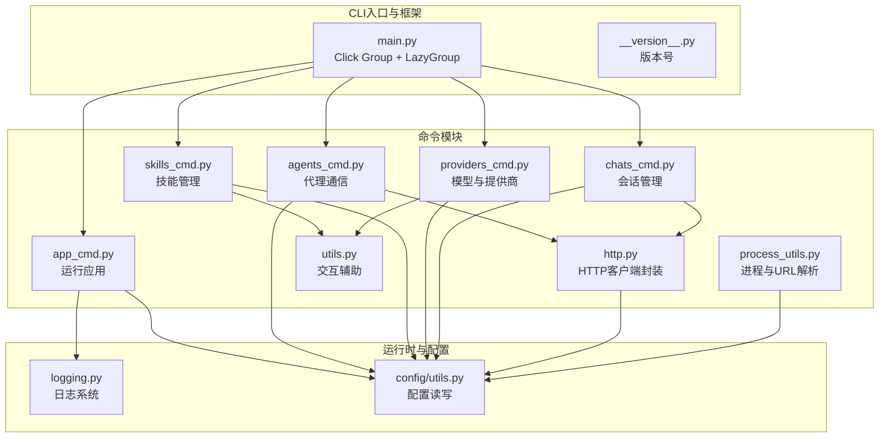
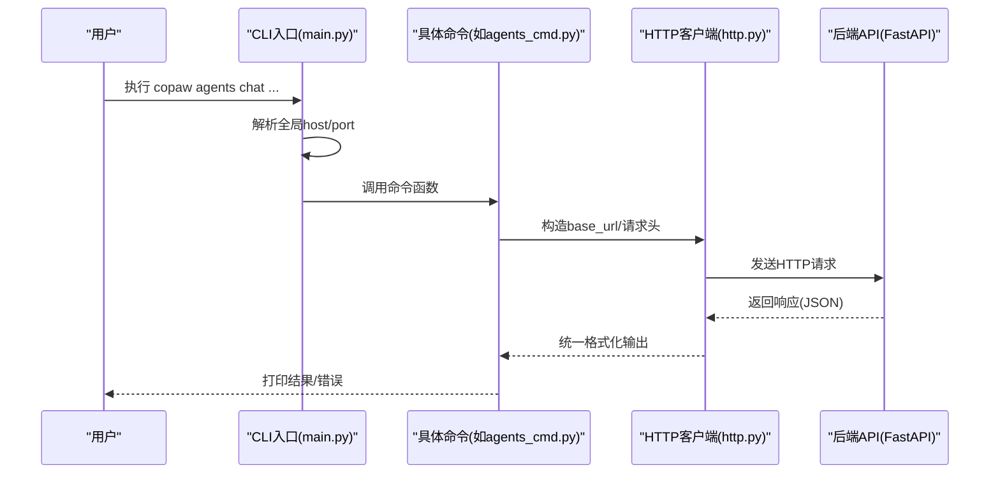
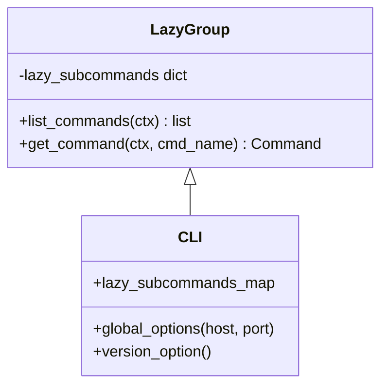
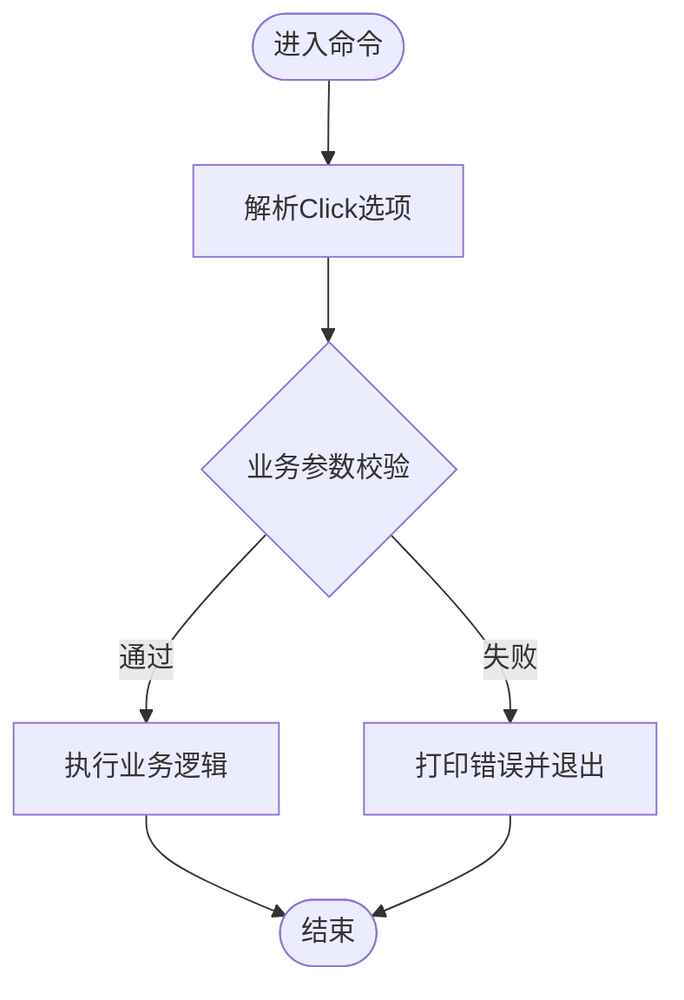
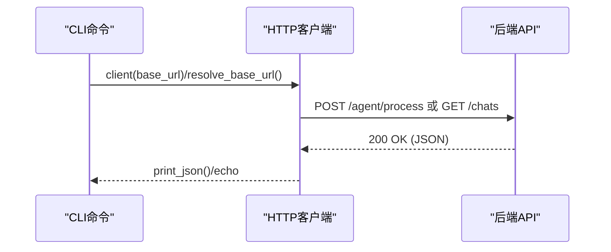
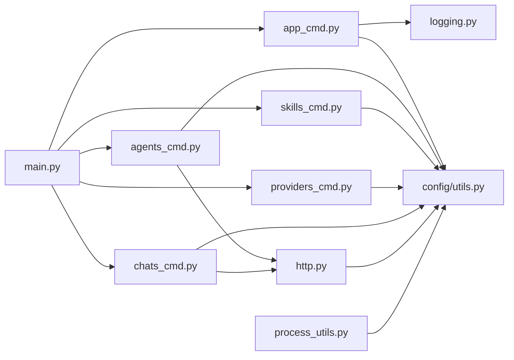

# CLI工具扩展

<cite>
**本文档引用的文件**
- [main.py](file://copaw/src/copaw/cli/main.py)
- [utils.py](file://copaw/src/copaw/cli/utils.py)
- [http.py](file://copaw/src/copaw/cli/http.py)
- [process_utils.py](file://copaw/src/copaw/cli/process_utils.py)
- [app_cmd.py](file://copaw/src/copaw/cli/app_cmd.py)
- [agents_cmd.py](file://copaw/src/copaw/cli/agents_cmd.py)
- [skills_cmd.py](file://copaw/src/copaw/cli/skills_cmd.py)
- [providers_cmd.py](file://copaw/src/copaw/cli/providers_cmd.py)
- [chats_cmd.py](file://copaw/src/copaw/cli/chats_cmd.py)
- [logging.py](file://copaw/src/copaw/utils/logging.py)
- [utils.py](file://copaw/src/copaw/config/utils.py)
- [__version__.py](file://copaw/src/copaw/__version__.py)
- [cli.en.md](file://copaw/website/public/docs/cli.en.md)
- [README.md](file://copaw/README.md)
</cite>

## 目录
1. [简介](#简介)
2. [项目结构](#项目结构)
3. [核心组件](#核心组件)
4. [架构总览](#架构总览)
5. [详细组件分析](#详细组件分析)
6. [依赖关系分析](#依赖关系分析)
7. [性能考虑](#性能考虑)
8. [故障排查指南](#故障排查指南)
9. [结论](#结论)
10. [附录](#附录)

## 简介
本指南面向需要为CLI工具添加新命令或扩展现有功能的开发者，系统讲解CLI框架的架构设计、命令注册机制、参数解析与校验、错误处理、帮助信息生成、CLI与后端服务的交互模式与数据传输格式、配置管理、日志记录与调试方法，并提供测试策略与发布流程建议。文档以仓库中的CLI实现为依据，结合官方文档与最佳实践，帮助你快速上手并高质量交付扩展。

## 项目结构
CLI子系统位于 copaw/src/copaw/cli 目录，采用Click框架构建，支持延迟加载（LazyGroup）以优化启动性能；HTTP客户端封装统一了API调用与输出格式；通用交互辅助函数集中于utils模块；日志系统独立于CLI，便于在命令中复用。

**图表来源**
- [main.py:1-162](file://copaw/src/copaw/cli/main.py#L1-L162)
- [app_cmd.py:1-112](file://copaw/src/copaw/cli/app_cmd.py#L1-L112)
- [agents_cmd.py:1-680](file://copaw/src/copaw/cli/agents_cmd.py#L1-L680)
- [skills_cmd.py:1-275](file://copaw/src/copaw/cli/skills_cmd.py#L1-L275)
- [providers_cmd.py:1-808](file://copaw/src/copaw/cli/providers_cmd.py#L1-L808)
- [chats_cmd.py:1-287](file://copaw/src/copaw/cli/chats_cmd.py#L1-L287)
- [http.py:1-44](file://copaw/src/copaw/cli/http.py#L1-L44)
- [utils.py:1-226](file://copaw/src/copaw/cli/utils.py#L1-L226)
- [process_utils.py:1-237](file://copaw/src/copaw/cli/process_utils.py#L1-L237)
- [logging.py:1-185](file://copaw/src/copaw/utils/logging.py#L1-L185)
- [utils.py:1-631](file://copaw/src/copaw/config/utils.py#L1-L631)
- [__version__.py:1-3](file://copaw/src/copaw/__version__.py#L1-L3)

**章节来源**
- [main.py:1-162](file://copaw/src/copaw/cli/main.py#L1-L162)
- [cli.en.md:1-631](file://copaw/website/public/docs/cli.en.md#L1-L631)

## 核心组件
- CLI入口与延迟加载：通过自定义LazyGroup按需导入子命令，减少启动时间，提升交互体验。
- 命令注册：在Click Group中声明所有可用子命令及其别名映射。
- 全局选项：支持全局host/port自动推断与覆盖，统一传递给各子命令。
- HTTP客户端：统一处理base_url拼接、超时、JSON输出等。
- 交互辅助：集中化用户确认、路径选择、单选/多选等交互逻辑。
- 日志系统：可配置级别、着色输出、访问日志过滤、文件落盘。
- 配置管理：持久化最近一次API地址、工作目录、心跳与会话等配置。

**章节来源**
- [main.py:55-162](file://copaw/src/copaw/cli/main.py#L55-L162)
- [http.py:14-44](file://copaw/src/copaw/cli/http.py#L14-L44)
- [utils.py:15-226](file://copaw/src/copaw/cli/utils.py#L15-L226)
- [logging.py:104-185](file://copaw/src/copaw/utils/logging.py#L104-L185)
- [utils.py:605-620](file://copaw/src/copaw/config/utils.py#L605-L620)

## 架构总览
CLI通过Click Group组织命令，使用LazyGroup延迟加载避免不必要的导入；每个命令通过HTTP客户端与后端FastAPI交互；日志系统在命令执行前初始化；配置通过config模块持久化到工作目录。

**图表来源**
- [main.py:137-162](file://copaw/src/copaw/cli/main.py#L137-L162)
- [agents_cmd.py:511-680](file://copaw/src/copaw/cli/agents_cmd.py#L511-L680)
- [http.py:14-44](file://copaw/src/copaw/cli/http.py#L14-L44)

## 详细组件分析

### CLI入口与命令注册机制
- 自定义LazyGroup：在list_commands/get_command阶段动态导入模块，缓存已加载命令，避免重复开销。
- 命令注册表：在Click Group中声明所有子命令及别名映射，支持app、channels、daemon、chats、clean、cron、env、init、models、skills、uninstall、desktop、update、shutdown、auth、agents等。
- 全局选项：--host/--port默认从上次运行记录读取，若未设置则回退到127.0.0.1:8088；通过ctx.obj传递给子命令。

**图表来源**
- [main.py:55-90](file://copaw/src/copaw/cli/main.py#L55-L90)
- [main.py:92-136](file://copaw/src/copaw/cli/main.py#L92-L136)

**章节来源**
- [main.py:55-162](file://copaw/src/copaw/cli/main.py#L55-L162)

### 参数解析与校验
- Click选项：每个命令通过@cli.option/@click.option声明参数，支持类型检查、默认值、可选/必填、枚举选择等。
- 参数组合校验：在命令内部进行业务规则校验（如agents chat的from-agent/to-agent/text与background/task-id互斥）。
- 交互式输入：通过utils模块的交互函数进行确认、路径选择、单选/多选等，增强用户体验。

**图表来源**
- [agents_cmd.py:222-270](file://copaw/src/copaw/cli/agents_cmd.py#L222-L270)
- [skills_cmd.py:120-211](file://copaw/src/copaw/cli/skills_cmd.py#L120-L211)

**章节来源**
- [agents_cmd.py:222-270](file://copaw/src/copaw/cli/agents_cmd.py#L222-L270)
- [skills_cmd.py:120-211](file://copaw/src/copaw/cli/skills_cmd.py#L120-L211)

### 帮助信息生成
- Click内置帮助：每个命令通过@help描述用途、参数说明与示例，支持--help/-h。
- 版本信息：通过@click.version_option显示版本号（来自__version__.py）。
- 全局帮助：CLI入口提供全局host/port帮助与别名说明。

**章节来源**
- [main.py:137-138](file://copaw/src/copaw/cli/main.py#L137-L138)
- [__version__.py:1-3](file://copaw/src/copaw/__version__.py#L1-L3)
- [cli.en.md:559-574](file://copaw/website/public/docs/cli.en.md#L559-L574)

### CLI与后端服务交互模式
- HTTP客户端封装：统一base_url构造（确保以/api结尾）、超时控制、JSON输出打印。
- 请求头：部分命令通过X-Agent-Id传递代理标识，便于后端路由与审计。
- 数据格式：请求体为JSON对象，响应体统一JSON格式，支持文本内容提取与SSE流式输出。

**图表来源**
- [http.py:14-44](file://copaw/src/copaw/cli/http.py#L14-L44)
- [agents_cmd.py:652-680](file://copaw/src/copaw/cli/agents_cmd.py#L652-L680)
- [chats_cmd.py:178-203](file://copaw/src/copaw/cli/chats_cmd.py#L178-L203)

**章节来源**
- [http.py:14-44](file://copaw/src/copaw/cli/http.py#L14-L44)
- [agents_cmd.py:652-680](file://copaw/src/copaw/cli/agents_cmd.py#L652-L680)
- [chats_cmd.py:178-203](file://copaw/src/copaw/cli/chats_cmd.py#L178-L203)

### 配置管理
- 最近API地址：写入/读取最近使用的host/port，供全局选项默认值使用。
- 工作目录与文件：配置文件、会话、心跳等路径均基于工作目录。
- 环境变量：通过环境变量控制渠道启用/禁用、容器运行检测等。

**章节来源**
- [utils.py:605-620](file://copaw/src/copaw/config/utils.py#L605-L620)
- [utils.py:386-389](file://copaw/src/copaw/config/utils.py#L386-L389)
- [utils.py:369-384](file://copaw/src/copaw/config/utils.py#L369-L384)

### 日志记录与调试
- 日志初始化：setup_logger根据级别设置着色输出、时间格式、命名空间过滤。
- 访问日志过滤：SuppressPathAccessLogFilter用于隐藏特定路径的uvicorn访问日志。
- 文件落盘：add_copaw_file_handler按平台差异选择FileHandler/RotatingFileHandler，避免重复句柄。
- 启动耗时：main.py记录导入耗时，app命令在debug/trace级别下输出详细初始化时间线。

**章节来源**
- [logging.py:104-185](file://copaw/src/copaw/utils/logging.py#L104-L185)
- [app_cmd.py:92-112](file://copaw/src/copaw/cli/app_cmd.py#L92-L112)
- [main.py:28-53](file://copaw/src/copaw/cli/main.py#L28-L53)

### 进程与URL解析辅助
- 进程快照：跨平台解析Windows/Wmic/ps输出，提取PID、父PID、名称、命令行。
- URL候选主机：针对0.0.0.0/::/localhost等特殊绑定生成候选主机列表，提升本地服务可达性。
- 端口解析：从命令行参数中提取--port，支持默认端口回退。

**章节来源**
- [process_utils.py:85-129](file://copaw/src/copaw/cli/process_utils.py#L85-L129)
- [process_utils.py:212-237](file://copaw/src/copaw/cli/process_utils.py#L212-L237)
- [process_utils.py:198-202](file://copaw/src/copaw/cli/process_utils.py#L198-L202)

### 现有命令实现示例与最佳实践

#### 应用命令(app)
- 功能：启动FastAPI应用，支持host/port、reload、log-level、隐藏访问路径等。
- 最佳实践：使用环境变量控制日志级别；在debug/trace模式下输出初始化耗时；隐藏敏感路径访问日志。

**章节来源**
- [app_cmd.py:15-112](file://copaw/src/copaw/cli/app_cmd.py#L15-L112)
- [main.py:92-96](file://copaw/src/copaw/cli/main.py#L92-L96)

#### 代理通信命令(agents)
- 功能：列出代理、与另一代理聊天（实时/流式/后台任务），支持会话复用与任务状态查询。
- 最佳实践：参数校验前置；SSE流式输出逐行打印；后台任务返回task_id与session_id；错误处理使用click.Abort。

**章节来源**
- [agents_cmd.py:374-680](file://copaw/src/copaw/cli/agents_cmd.py#L374-L680)

#### 技能管理命令(skills)
- 功能：列出技能、交互式启用/禁用技能，支持预览变更与确认应用。
- 最佳实践：使用utils的交互函数进行多选；变更预览后再确认；对安装/启用/禁用分别处理并反馈结果。

**章节来源**
- [skills_cmd.py:213-275](file://copaw/src/copaw/cli/skills_cmd.py#L213-L275)
- [utils.py:151-226](file://copaw/src/copaw/cli/utils.py#L151-L226)

#### 模型与提供商命令(models)
- 功能：列出/配置提供商、设置活跃模型、下载本地模型、增删自定义提供商与模型。
- 最佳实践：交互式配置API Key/Base URL；对Ollama等本地模型进行特殊处理；超时与取消处理。

**章节来源**
- [providers_cmd.py:465-808](file://copaw/src/copaw/cli/providers_cmd.py#L465-L808)

#### 会话管理命令(chats)
- 功能：列出/获取/创建/更新/删除会话，支持按用户ID/渠道过滤。
- 最佳实践：统一通过HTTP客户端封装；对404等错误进行友好提示；支持从文件或内联参数创建。

**章节来源**
- [chats_cmd.py:15-287](file://copaw/src/copaw/cli/chats_cmd.py#L15-L287)

## 依赖关系分析

**图表来源**
- [main.py:1-162](file://copaw/src/copaw/cli/main.py#L1-L162)
- [app_cmd.py:1-112](file://copaw/src/copaw/cli/app_cmd.py#L1-L112)
- [agents_cmd.py:1-680](file://copaw/src/copaw/cli/agents_cmd.py#L1-L680)
- [skills_cmd.py:1-275](file://copaw/src/copaw/cli/skills_cmd.py#L1-L275)
- [providers_cmd.py:1-808](file://copaw/src/copaw/cli/providers_cmd.py#L1-L808)
- [chats_cmd.py:1-287](file://copaw/src/copaw/cli/chats_cmd.py#L1-L287)
- [http.py:1-44](file://copaw/src/copaw/cli/http.py#L1-L44)
- [logging.py:1-185](file://copaw/src/copaw/utils/logging.py#L1-L185)
- [utils.py:1-631](file://copaw/src/copaw/config/utils.py#L1-L631)
- [process_utils.py:1-237](file://copaw/src/copaw/cli/process_utils.py#L1-L237)

**章节来源**
- [main.py:1-162](file://copaw/src/copaw/cli/main.py#L1-L162)

## 性能考虑
- 延迟加载：通过LazyGroup按需导入子命令，显著降低启动时间。
- 导入耗时追踪：main.py记录关键模块导入耗时，便于定位瓶颈。
- 日志级别：在debug/trace级别下输出初始化时间线，有助于诊断启动慢问题。
- HTTP超时：统一设置超时，避免阻塞；对长任务使用后台模式与任务状态轮询。

**章节来源**
- [main.py:28-53](file://copaw/src/copaw/cli/main.py#L28-L53)
- [app_cmd.py:92-96](file://copaw/src/copaw/cli/app_cmd.py#L92-L96)
- [http.py:20](file://copaw/src/copaw/cli/http.py#L20)

## 故障排查指南
- 参数错误：使用click.UsageError/ClickException抛出明确错误信息；在agents命令中对参数组合进行严格校验。
- 网络连接：检查resolve_base_url是否正确解析host/port；确认后端服务已启动且端口可达。
- 权限与路径：使用utils的路径确认函数处理不存在路径；在Windows环境下注意编码与权限。
- 日志定位：在debug/trace级别下查看初始化耗时；使用访问日志过滤隐藏敏感路径。
- 配置恢复：当配置文件损坏时，config模块会自动备份并回退默认配置。

**章节来源**
- [agents_cmd.py:222-270](file://copaw/src/copaw/cli/agents_cmd.py#L222-L270)
- [http.py:27-44](file://copaw/src/copaw/cli/http.py#L27-L44)
- [utils.py:431-449](file://copaw/src/copaw/config/utils.py#L431-L449)

## 结论
该CLI框架以Click为核心，结合延迟加载、统一HTTP封装、集中化交互与日志系统，提供了清晰、可扩展的命令体系。开发者在新增命令时应遵循参数校验前置、统一错误处理、一致的输出格式与帮助信息、以及完善的日志与配置管理原则，确保扩展的质量与一致性。

## 附录

### 新命令开发流程（模板步骤）
- 在copaw/src/copaw/cli目录新增命令模块（如xxx_cmd.py）。
- 在main.py的LazyGroup.lazy_subcommands中注册命令模块路径与属性名。
- 在模块中定义click命令组/命令，声明参数与帮助信息。
- 使用http.py提供的client/resolve_base_url统一HTTP交互。
- 在需要时使用utils.py的交互函数提升用户体验。
- 在app_cmd.py类似的日志初始化位置设置必要日志级别。
- 编写单元测试与集成测试，覆盖参数校验、错误分支与边界条件。
- 更新官方文档（cli.en.md）与README中的命令概览与示例。

**章节来源**
- [main.py:92-136](file://copaw/src/copaw/cli/main.py#L92-L136)
- [http.py:14-44](file://copaw/src/copaw/cli/http.py#L14-L44)
- [utils.py:15-226](file://copaw/src/copaw/cli/utils.py#L15-L226)
- [cli.en.md:605-631](file://copaw/website/public/docs/cli.en.md#L605-L631)

### 测试策略与发布流程建议
- 单元测试：针对参数解析、交互函数、HTTP客户端封装进行隔离测试。
- 集成测试：模拟CLI命令执行与后端API交互，覆盖成功与失败场景。
- 文档测试：在cli.en.md中补充命令示例与参数说明，保持与实现一致。
- 发布流程：更新版本号（__version__.py），构建前端（如适用），打包分发，更新网站文档。

**章节来源**
- [__version__.py:1-3](file://copaw/src/copaw/__version__.py#L1-L3)
- [README.md:438-460](file://copaw/README.md#L438-L460)
- [cli.en.md:1-631](file://copaw/website/public/docs/cli.en.md#L1-L631)