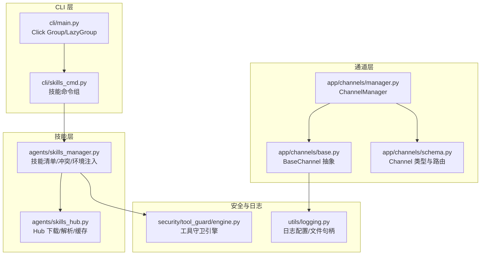
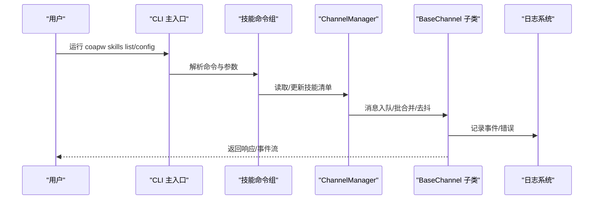
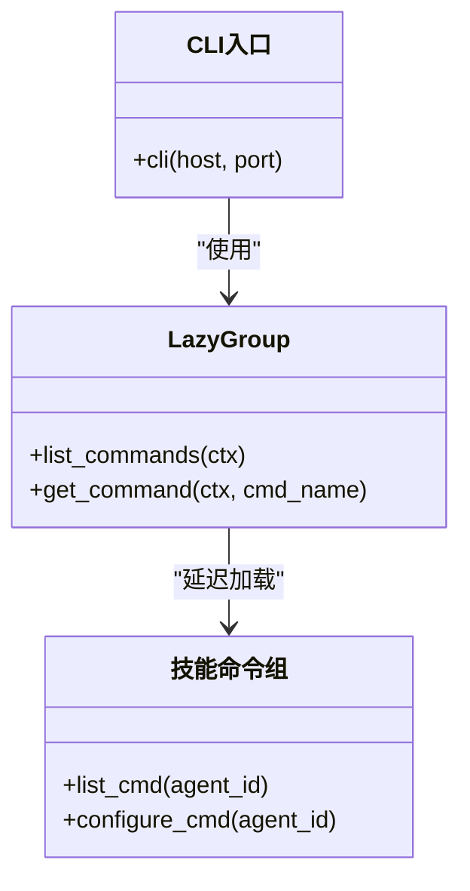
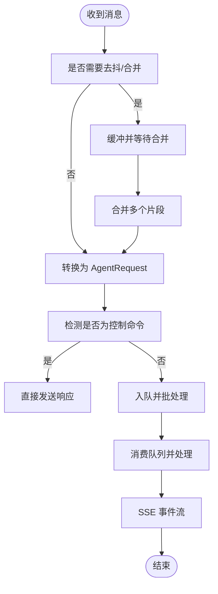
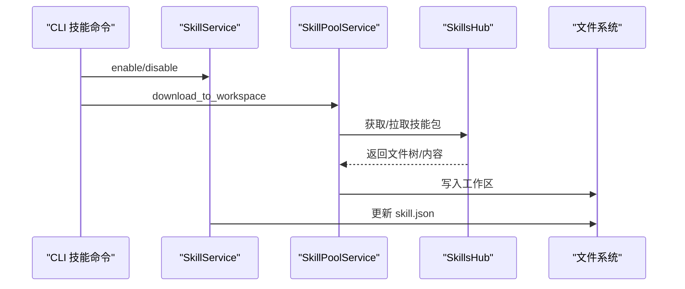
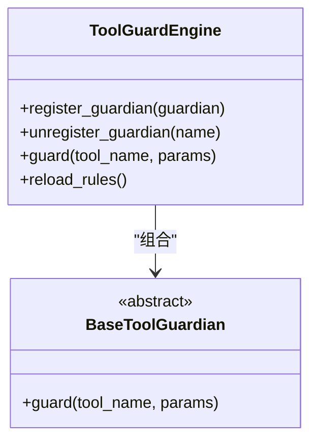
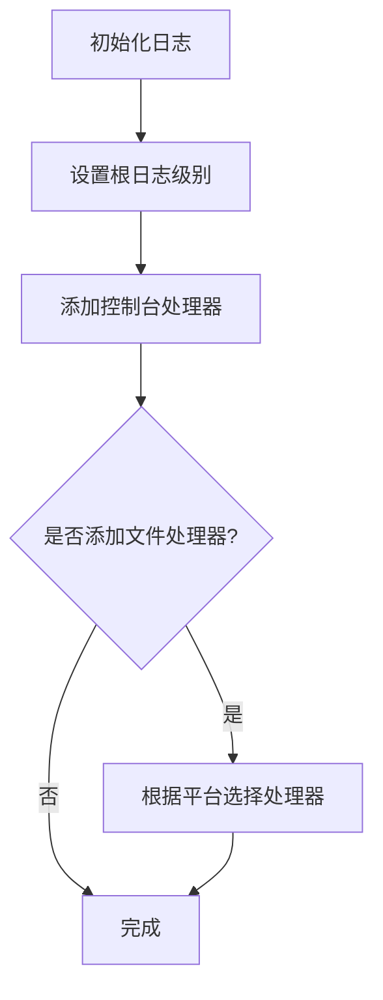
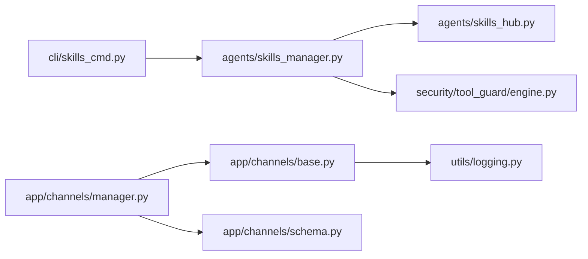

# 扩展开发

<cite>
**本文引用的文件**
- [copaw/src/copaw/cli/main.py](file://copaw/src/copaw/cli/main.py)
- [copaw/src/copaw/cli/skills_cmd.py](file://copaw/src/copaw/cli/skills_cmd.py)
- [copaw/src/copaw/app/channels/base.py](file://copaw/src/copaw/app/channels/base.py)
- [copaw/src/copaw/app/channels/manager.py](file://copaw/src/copaw/app/channels/manager.py)
- [copaw/src/copaw/app/channels/schema.py](file://copaw/src/copaw/app/channels/schema.py)
- [copaw/src/copaw/agents/skills_hub.py](file://copaw/src/copaw/agents/skills_hub.py)
- [copaw/src/copaw/agents/skills_manager.py](file://copaw/src/copaw/agents/skills_manager.py)
- [copaw/src/copaw/utils/logging.py](file://copaw/src/copaw/utils/logging.py)
- [copaw/src/copaw/security/tool_guard/engine.py](file://copaw/src/copaw/security/tool_guard/engine.py)
- [copaw/src/copaw/app/channels/discord_/__init__.py](file://copaw/src/copaw/app/channels/discord_/__init__.py)
- [copaw/src/copaw/app/channels/telegram/__init__.py](file://copaw/src/copaw/app/channels/telegram/__init__.py)
- [copaw/src/copaw/agents/tools/shell.py](file://copaw/src/copaw/agents/tools/shell.py)
- [copaw/src/copaw/agents/tools/file_io.py](file://copaw/src/copaw/agents/tools/file_io.py)
</cite>

## 目录
1. [简介](#简介)
2. [项目结构](#项目结构)
3. [核心组件](#核心组件)
4. [架构总览](#架构总览)
5. [详细组件分析](#详细组件分析)
6. [依赖分析](#依赖分析)
7. [性能考虑](#性能考虑)
8. [故障排查指南](#故障排查指南)
9. [结论](#结论)
10. [附录](#附录)

## 简介
本指南面向希望在 CoPaw 平台上进行扩展开发的工程师，涵盖以下主题：
- 自定义技能的开发流程与实现模板
- 新通道（Channel）集成的开发方法与消息格式规范
- CLI 工具的扩展机制与命令开发指南
- 插件系统的架构设计与开发最佳实践
- 参数验证、错误处理与日志记录的实现指导
- 扩展功能的测试方法与质量保证措施
- 性能优化与资源管理的开发建议
- 完整的开发工具链与调试支持

## 项目结构
CoPaw 的扩展能力主要分布在以下模块：
- CLI 扩展：通过 Click 分组与延迟加载机制，支持动态注册子命令
- 通道系统：统一的消息入队、合并、去抖与消费流程，支持内置与插件通道
- 技能系统：工作区技能清单、池化技能下载、冲突处理与安全扫描
- 安全与工具保护：工具调用前的安全守卫引擎
- 日志系统：统一命名空间的日志配置与彩色输出

图示来源
- [copaw/src/copaw/cli/main.py:92-136](file://copaw/src/copaw/cli/main.py#L92-L136)
- [copaw/src/copaw/cli/skills_cmd.py:213-275](file://copaw/src/copaw/cli/skills_cmd.py#L213-L275)
- [copaw/src/copaw/app/channels/base.py:70-127](file://copaw/src/copaw/app/channels/base.py#L70-L127)
- [copaw/src/copaw/app/channels/manager.py:68-113](file://copaw/src/copaw/app/channels/manager.py#L68-L113)
- [copaw/src/copaw/app/channels/schema.py:12-48](file://copaw/src/copaw/app/channels/schema.py#L12-L48)
- [copaw/src/copaw/agents/skills_hub.py:188-237](file://copaw/src/copaw/agents/skills_hub.py#L188-L237)
- [copaw/src/copaw/agents/skills_manager.py:116-166](file://copaw/src/copaw/agents/skills_manager.py#L116-L166)
- [copaw/src/copaw/utils/logging.py:104-139](file://copaw/src/copaw/utils/logging.py#L104-L139)
- [copaw/src/copaw/security/tool_guard/engine.py:53-102](file://copaw/src/copaw/security/tool_guard/engine.py#L53-L102)

章节来源
- [copaw/src/copaw/cli/main.py:92-162](file://copaw/src/copaw/cli/main.py#L92-L162)
- [copaw/src/copaw/app/channels/manager.py:68-113](file://copaw/src/copaw/app/channels/manager.py#L68-L113)

## 核心组件
- CLI 命令体系：基于 Click 的延迟加载分组，支持 app、channels、daemon、skills 等命令族
- 通道管理器：统一队列、批合并、优先级与会话键管理；按通道启动/停止
- 基础通道：抽象出消息构建、去抖、合并、控制命令检测、事件流等通用逻辑
- 技能管理：工作区技能清单、池化技能同步、冲突重命名、环境变量注入
- Hub 交互：HTTP 请求、重试退避、速率限制、取消检查、ZIP 安全校验
- 工具守卫：规则与路径类守卫组合，按配置启用/禁用
- 日志系统：命名空间过滤、彩色输出、可选文件轮转

章节来源
- [copaw/src/copaw/cli/main.py:55-90](file://copaw/src/copaw/cli/main.py#L55-L90)
- [copaw/src/copaw/app/channels/manager.py:39-66](file://copaw/src/copaw/app/channels/manager.py#L39-L66)
- [copaw/src/copaw/app/channels/base.py:537-556](file://copaw/src/copaw/app/channels/base.py#L537-L556)
- [copaw/src/copaw/agents/skills_manager.py:62-78](file://copaw/src/copaw/agents/skills_manager.py#L62-L78)
- [copaw/src/copaw/agents/skills_hub.py:283-394](file://copaw/src/copaw/agents/skills_hub.py#L283-L394)
- [copaw/src/copaw/security/tool_guard/engine.py:53-102](file://copaw/src/copaw/security/tool_guard/engine.py#L53-L102)
- [copaw/src/copaw/utils/logging.py:104-139](file://copaw/src/copaw/utils/logging.py#L104-L139)

## 架构总览
下图展示了从 CLI 到通道、再到技能与安全的整体调用链路。

图示来源
- [copaw/src/copaw/cli/main.py:92-162](file://copaw/src/copaw/cli/main.py#L92-L162)
- [copaw/src/copaw/cli/skills_cmd.py:213-275](file://copaw/src/copaw/cli/skills_cmd.py#L213-L275)
- [copaw/src/copaw/app/channels/manager.py:362-446](file://copaw/src/copaw/app/channels/manager.py#L362-L446)
- [copaw/src/copaw/app/channels/base.py:467-535](file://copaw/src/copaw/app/channels/base.py#L467-L535)
- [copaw/src/copaw/utils/logging.py:104-139](file://copaw/src/copaw/utils/logging.py#L104-L139)

## 详细组件分析

### CLI 扩展机制与命令开发指南
- 延迟加载：通过 LazyGroup 在首次访问时动态导入子命令模块，降低启动开销
- 命令注册：在 Click Group 中声明 lazy_subcommands 映射，指定模块路径、属性名与标签
- 上下文注入：在 CLI 入口设置 host/port 等上下文对象，供后续命令使用
- 技能命令组：skills_group 提供 list 与 config 两个子命令，支持交互式选择与批量应用变更

图示来源
- [copaw/src/copaw/cli/main.py:55-90](file://copaw/src/copaw/cli/main.py#L55-L90)
- [copaw/src/copaw/cli/main.py:137-162](file://copaw/src/copaw/cli/main.py#L137-L162)
- [copaw/src/copaw/cli/skills_cmd.py:213-275](file://copaw/src/copaw/cli/skills_cmd.py#L213-L275)

章节来源
- [copaw/src/copaw/cli/main.py:55-90](file://copaw/src/copaw/cli/main.py#L55-L90)
- [copaw/src/copaw/cli/skills_cmd.py:213-275](file://copaw/src/copaw/cli/skills_cmd.py#L213-L275)

### 通道系统：消息格式与集成规范
- 统一抽象：BaseChannel 定义了消息构建、去抖合并、控制命令检测、事件流等接口
- 会话键：通过 get_debounce_key/resolve_session_id 实现会话隔离与批合并
- 去抖策略：针对“无文本内容”进行缓冲合并，避免碎片化输入
- 控制命令：CommandRegistry 识别以提升优先级，绕过任务跟踪直接响应
- 发送路径：send_content_parts/send_event 将 AgentResponse 转换为通道原生消息

图示来源
- [copaw/src/copaw/app/channels/base.py:659-758](file://copaw/src/copaw/app/channels/base.py#L659-L758)
- [copaw/src/copaw/app/channels/base.py:759-800](file://copaw/src/copaw/app/channels/base.py#L759-L800)
- [copaw/src/copaw/app/channels/manager.py:39-66](file://copaw/src/copaw/app/channels/manager.py#L39-L66)

章节来源
- [copaw/src/copaw/app/channels/base.py:537-638](file://copaw/src/copaw/app/channels/base.py#L537-L638)
- [copaw/src/copaw/app/channels/manager.py:223-254](file://copaw/src/copaw/app/channels/manager.py#L223-L254)

### 技能系统：安装、冲突与环境注入
- 清单与池：工作区 skill.json 与共享池 skill.json 双轨管理，内置/定制区分
- 冲突处理：签名比对与时间戳后缀建议，避免覆盖冲突
- 环境注入：按需将技能配置映射为环境变量，支持受控释放
- Hub 交互：统一 HTTP 请求封装、重试退避、速率限制与取消检查
- ZIP 安全：解压前校验大小、路径合法性与符号链接

图示来源
- [copaw/src/copaw/cli/skills_cmd.py:64-116](file://copaw/src/copaw/cli/skills_cmd.py#L64-L116)
- [copaw/src/copaw/agents/skills_manager.py:116-166](file://copaw/src/copaw/agents/skills_manager.py#L116-L166)
- [copaw/src/copaw/agents/skills_hub.py:283-394](file://copaw/src/copaw/agents/skills_hub.py#L283-L394)

章节来源
- [copaw/src/copaw/agents/skills_manager.py:62-78](file://copaw/src/copaw/agents/skills_manager.py#L62-L78)
- [copaw/src/copaw/agents/skills_hub.py:188-237](file://copaw/src/copaw/agents/skills_hub.py#L188-L237)

### 工具守卫与安全扫描
- 守卫引擎：默认注册规则与路径两类守卫，支持按配置启用/禁用与热重载
- 工具范围：受守护工具集合与禁止工具集合由配置解析
- 结果聚合：收集各守卫发现并生成结果，记录耗时与失败守卫

图示来源
- [copaw/src/copaw/security/tool_guard/engine.py:53-102](file://copaw/src/copaw/security/tool_guard/engine.py#L53-L102)
- [copaw/src/copaw/security/tool_guard/engine.py:169-227](file://copaw/src/copaw/security/tool_guard/engine.py#L169-L227)

章节来源
- [copaw/src/copaw/security/tool_guard/engine.py:53-102](file://copaw/src/copaw/security/tool_guard/engine.py#L53-L102)

### 日志系统与调试支持
- 命名空间：仅输出 copaw.* 日志，避免第三方噪声
- 彩色输出：终端自动启用 ANSI，非终端自动降级
- 文件句柄：按平台选择 FileHandler 或 RotatingFileHandler，避免重复添加

图示来源
- [copaw/src/copaw/utils/logging.py:104-139](file://copaw/src/copaw/utils/logging.py#L104-L139)
- [copaw/src/copaw/utils/logging.py:142-185](file://copaw/src/copaw/utils/logging.py#L142-L185)

章节来源
- [copaw/src/copaw/utils/logging.py:104-185](file://copaw/src/copaw/utils/logging.py#L104-L185)

## 依赖分析
- CLI 与技能：skills_cmd 依赖 skills_manager 与配置加载，用于读取/写入工作区技能清单
- 通道与消息：ChannelManager 依赖 BaseChannel 抽与 CommandRegistry，负责统一队列与批处理
- Hub 与安全：skills_hub 与 skills_manager 协作，工具守卫独立于通道与技能，但参与工具调用前的安全检查
- 日志：通道与 Hub 均使用统一日志命名空间，确保一致的可观测性

图示来源
- [copaw/src/copaw/cli/skills_cmd.py:9-18](file://copaw/src/copaw/cli/skills_cmd.py#L9-L18)
- [copaw/src/copaw/agents/skills_manager.py:116-166](file://copaw/src/copaw/agents/skills_manager.py#L116-L166)
- [copaw/src/copaw/agents/skills_hub.py:188-237](file://copaw/src/copaw/agents/skills_hub.py#L188-L237)
- [copaw/src/copaw/app/channels/manager.py:68-113](file://copaw/src/copaw/app/channels/manager.py#L68-L113)
- [copaw/src/copaw/app/channels/base.py:70-127](file://copaw/src/copaw/app/channels/base.py#L70-L127)
- [copaw/src/copaw/security/tool_guard/engine.py:53-102](file://copaw/src/copaw/security/tool_guard/engine.py#L53-L102)
- [copaw/src/copaw/utils/logging.py:104-139](file://copaw/src/copaw/utils/logging.py#L104-L139)

章节来源
- [copaw/src/copaw/app/channels/manager.py:68-113](file://copaw/src/copaw/app/channels/manager.py#L68-L113)
- [copaw/src/copaw/app/channels/base.py:70-127](file://copaw/src/copaw/app/channels/base.py#L70-L127)

## 性能考虑
- 启动与导入：CLI 使用延迟加载减少初始导入成本，建议新命令同样采用延迟加载
- 队列与批处理：ChannelManager 对同会话消息进行批合并，降低下游压力；合理设置队列上限与超时
- 去抖与合并：BaseChannel 的去抖策略避免碎片化输入，提升用户体验；注意音频等独立输入的特殊处理
- Hub 请求：HTTP 重试与退避策略、速率限制与取消检查，避免阻塞与资源浪费
- 日志：仅输出 copaw.* 命名空间日志，避免第三方噪声；必要时启用文件轮转

## 故障排查指南
- CLI 命令未找到：确认 LazyGroup 的 lazy_subcommands 映射正确，模块路径与属性名匹配
- 通道无法启动：检查 ChannelManager.start_all 是否成功，通道 from_env/from_config 是否抛出异常
- 技能安装失败：查看 Hub HTTP 错误码与消息，关注 429/5xx 与 GitHub 限速提示
- 工具执行异常：检查工具守卫结果与拒绝列表，确认参数是否被拒绝或触发告警
- 日志缺失：确认日志级别与命名空间，确保已添加处理器且未被第三方日志覆盖

章节来源
- [copaw/src/copaw/cli/main.py:74-88](file://copaw/src/copaw/cli/main.py#L74-L88)
- [copaw/src/copaw/app/channels/manager.py:447-478](file://copaw/src/copaw/app/channels/manager.py#L447-L478)
- [copaw/src/copaw/agents/skills_hub.py:327-358](file://copaw/src/copaw/agents/skills_hub.py#L327-L358)
- [copaw/src/copaw/security/tool_guard/engine.py:194-226](file://copaw/src/copaw/security/tool_guard/engine.py#L194-L226)
- [copaw/src/copaw/utils/logging.py:104-139](file://copaw/src/copaw/utils/logging.py#L104-L139)

## 结论
本指南提供了 CoPaw 扩展开发的完整路径：从 CLI 命令扩展到通道集成，再到技能系统与安全守卫，辅以日志与性能优化建议。遵循本文的模板与最佳实践，可以快速、稳定地实现自定义扩展并融入现有生态。

## 附录

### 自定义技能开发流程与模板
- 创建技能目录与 SKILL.md，声明 name/description/metadata
- 在工作区 skills 目录中新增技能，或通过 Hub 下载至池后再启用
- 使用 apply_skill_config_env_overrides 注入受控环境变量
- 冲突处理：若名称冲突，使用 suggest_conflict_name 生成带时间戳的建议名
- 安全扫描：确保技能不包含不受信任的脚本或路径

章节来源
- [copaw/src/copaw/agents/skills_manager.py:62-78](file://copaw/src/copaw/agents/skills_manager.py#L62-L78)
- [copaw/src/copaw/agents/skills_manager.py:733-754](file://copaw/src/copaw/agents/skills_manager.py#L733-L754)
- [copaw/src/copaw/agents/skills_manager.py:651-696](file://copaw/src/copaw/agents/skills_manager.py#L651-L696)

### 新通道集成开发方法与消息格式规范
- 继承 BaseChannel，实现 from_env/from_config/build_agent_request_from_native/send_content_parts
- 会话键：通过 resolve_session_id/get_debounce_key 保证会话隔离
- 去抖与合并：复用 BaseChannel 的 _apply_no_text_debounce/_debounce_payload 与 merge_native_items
- 控制命令：利用 CommandRegistry.is_control_command 提升优先级
- 事件流：遵循 SSE 格式，事件对象包含 object/status 字段

章节来源
- [copaw/src/copaw/app/channels/base.py:537-638](file://copaw/src/copaw/app/channels/base.py#L537-L638)
- [copaw/src/copaw/app/channels/base.py:659-758](file://copaw/src/copaw/app/channels/base.py#L659-L758)
- [copaw/src/copaw/app/channels/manager.py:39-66](file://copaw/src/copaw/app/channels/manager.py#L39-L66)
- [copaw/src/copaw/app/channels/schema.py:12-48](file://copaw/src/copaw/app/channels/schema.py#L12-L48)

### CLI 工具扩展机制与命令开发指南
- 使用 @click.group 注册命令组，结合 LazyGroup 实现延迟加载
- 在 CLI 入口设置 host/port 等上下文，供子命令使用
- 技能命令组：list/config 子命令支持交互式选择与批量应用变更
- 交互式提示：prompt_checkbox/prompt_confirm 提供用户确认与多选

章节来源
- [copaw/src/copaw/cli/main.py:55-90](file://copaw/src/copaw/cli/main.py#L55-L90)
- [copaw/src/copaw/cli/skills_cmd.py:120-211](file://copaw/src/copaw/cli/skills_cmd.py#L120-L211)

### 插件系统架构设计与开发最佳实践
- 插件通道键：ChannelType 为 str，允许任意键值，内置通道使用预定义集合
- 动态注册：通过注册表与配置驱动通道实例化，支持 from_env/from_config
- 任务跟踪：通道内使用 TaskTracker 与 UnifiedQueueManager，支持取消与幂等
- 最佳实践：保持通道职责单一、消息格式标准化、错误与日志清晰

章节来源
- [copaw/src/copaw/app/channels/schema.py:30-48](file://copaw/src/copaw/app/channels/schema.py#L30-L48)
- [copaw/src/copaw/app/channels/manager.py:108-213](file://copaw/src/copaw/app/channels/manager.py#L108-L213)
- [copaw/src/copaw/app/channels/base.py:374-430](file://copaw/src/copaw/app/channels/base.py#L374-L430)

### 参数验证、错误处理与日志记录实现指导
- 参数验证：工具函数对输入类型与范围进行校验，返回 ToolResponse 包裹错误信息
- 错误处理：通道消费过程中捕获异常并上报 Internal error，同时记录详细上下文
- 日志记录：统一使用 copaw 命名空间，控制台彩色输出，必要时添加文件处理器

章节来源
- [copaw/src/copaw/agents/tools/file_io.py:66-200](file://copaw/src/copaw/agents/tools/file_io.py#L66-L200)
- [copaw/src/copaw/app/channels/base.py:524-535](file://copaw/src/copaw/app/channels/base.py#L524-L535)
- [copaw/src/copaw/utils/logging.py:104-185](file://copaw/src/copaw/utils/logging.py#L104-L185)

### 测试方法与质量保证措施
- 单元测试：围绕 CLI 命令、通道消费、技能清单与 Hub 交互编写测试
- 集成测试：模拟消息入队、批合并、去抖与控制命令路径
- 安全扫描：对技能目录进行扫描，确保无高危内容
- 性能测试：评估队列吞吐、批处理效率与 Hub 请求耗时

章节来源
- [copaw/src/copaw/agents/skills_hub.py:283-394](file://copaw/src/copaw/agents/skills_hub.py#L283-L394)
- [copaw/src/copaw/agents/skills_manager.py:116-166](file://copaw/src/copaw/agents/skills_manager.py#L116-L166)
- [copaw/src/copaw/security/tool_guard/engine.py:169-227](file://copaw/src/copaw/security/tool_guard/engine.py#L169-L227)

### 性能优化与资源管理开发建议
- 避免阻塞：HTTP 请求与子进程执行使用异步或线程池，防止阻塞事件循环
- 资源清理：文件句柄与临时文件及时关闭，ZIP 解压后删除临时目录
- 缓存与重试：对 Hub 接口使用 TTL 缓存与指数退避，降低外部依赖抖动
- 日志限流：生产环境适当提高日志级别，避免高频日志影响性能

章节来源
- [copaw/src/copaw/agents/skills_hub.py:94-125](file://copaw/src/copaw/agents/skills_hub.py#L94-L125)
- [copaw/src/copaw/agents/skills_hub.py:159-163](file://copaw/src/copaw/agents/skills_hub.py#L159-L163)
- [copaw/src/copaw/agents/tools/shell.py:90-200](file://copaw/src/copaw/agents/tools/shell.py#L90-L200)
- [copaw/src/copaw/utils/logging.py:142-185](file://copaw/src/copaw/utils/logging.py#L142-L185)

### 开发工具链与调试支持
- CLI：coapw skills list/config 支持交互式配置与批量应用
- 日志：setup_logger/add_copaw_file_handler 提供统一日志入口与文件落盘
- 工具守卫：可按需启用/禁用与热重载规则，便于调试工具调用安全性

章节来源
- [copaw/src/copaw/cli/skills_cmd.py:213-275](file://copaw/src/copaw/cli/skills_cmd.py#L213-L275)
- [copaw/src/copaw/utils/logging.py:104-185](file://copaw/src/copaw/utils/logging.py#L104-L185)
- [copaw/src/copaw/security/tool_guard/engine.py:148-154](file://copaw/src/copaw/security/tool_guard/engine.py#L148-L154)