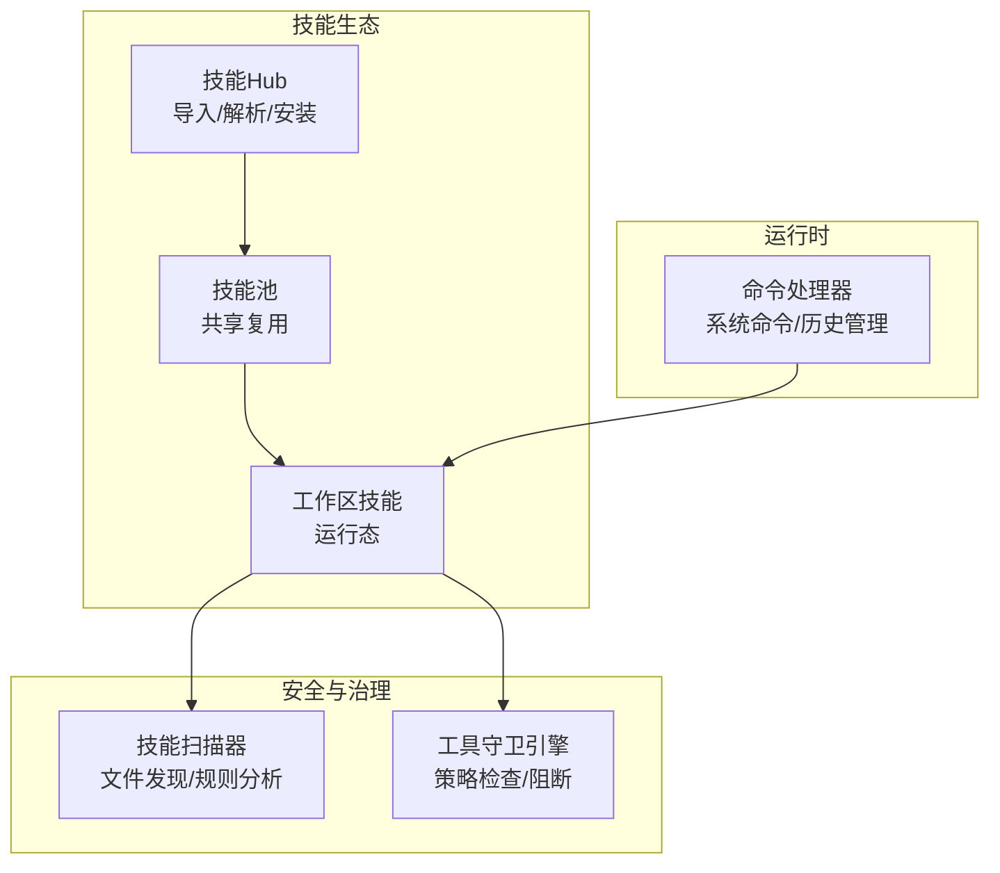
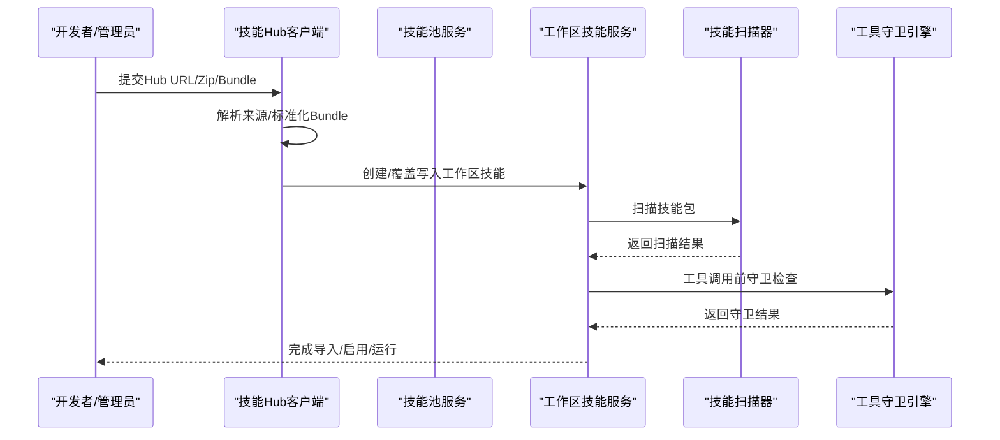
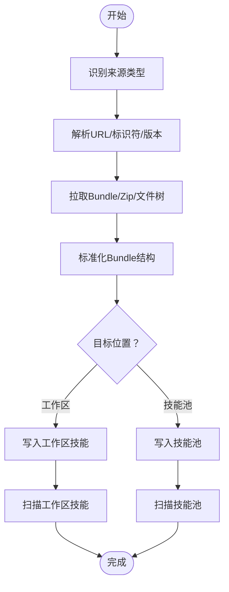
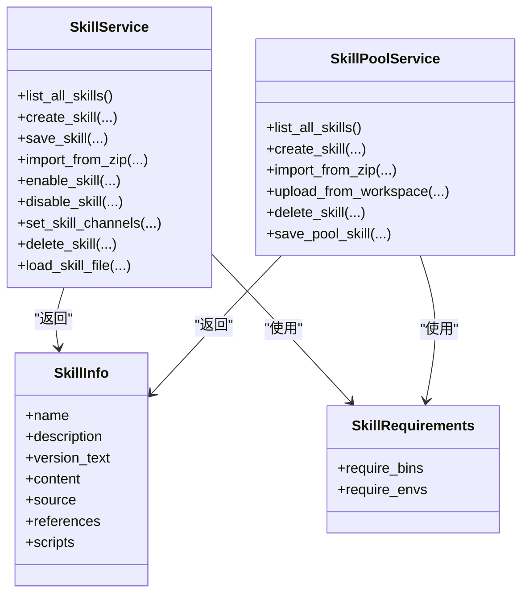
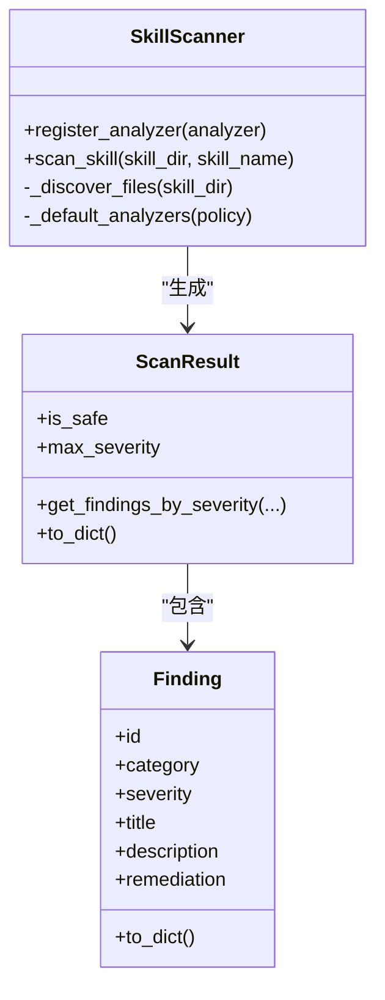
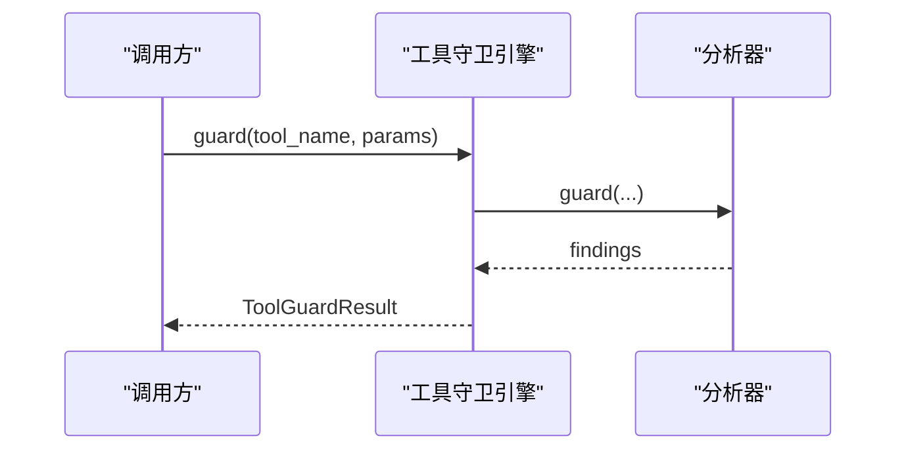
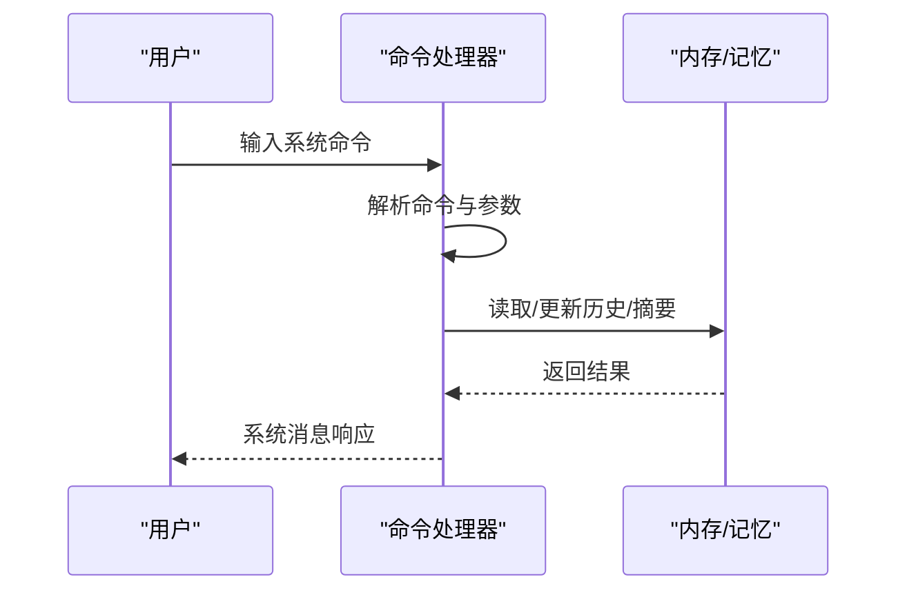
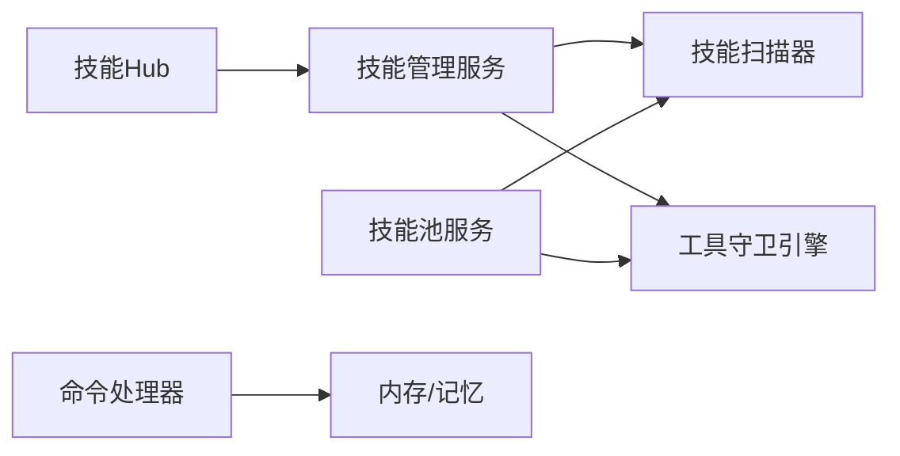

# 插件系统架构

<cite>
**本文档引用的文件**
- [skills_hub.py](file://copaw/src/copaw/agents/skills_hub.py)
- [skills_manager.py](file://copaw/src/copaw/agents/skills_manager.py)
- [scanner.py](file://copaw/src/copaw/security/skill_scanner/scanner.py)
- [engine.py](file://copaw/src/copaw/security/tool_guard/engine.py)
- [models.py](file://copaw/src/copaw/security/skill_scanner/models.py)
- [command_handler.py](file://copaw/src/copaw/agents/command_handler.py)
</cite>

## 目录
1. [引言](#引言)
2. [项目结构](#项目结构)
3. [核心组件](#核心组件)
4. [架构总览](#架构总览)
5. [详细组件分析](#详细组件分析)
6. [依赖关系分析](#依赖关系分析)
7. [性能考虑](#性能考虑)
8. [故障排查指南](#故障排查指南)
9. [结论](#结论)
10. [附录](#附录)

## 引言
本文件面向CoPaw插件化设计，系统性阐述其架构理念、核心机制与工程实践。CoPaw通过“技能（Skill）”作为插件的基本单元，构建了从本地工作区到共享技能池的分层管理体系，并配套安全扫描与工具调用守卫，形成可扩展、可审计、可治理的插件生态。

## 项目结构
CoPaw插件系统主要由以下模块构成：
- 技能仓库与安装：负责从Hub或外部来源导入技能包，解析标准化Bundle，写入工作区或共享池。
- 技能生命周期管理：在工作区与技能池之间进行创建、启用/禁用、重命名、删除等操作，并维护清单与签名校验。
- 安全扫描：对技能包进行文件发现、规则匹配与结果聚合，保障内容安全。
- 工具守卫：在工具调用前进行策略检查与阻断，降低风险面。
- 命令处理：为系统命令提供统一入口，支撑对话上下文管理与调试能力。

图示来源
- [skills_hub.py:1519-1672](file://copaw/src/copaw/agents/skills_hub.py#L1519-L1672)
- [skills_manager.py:1399-1520](file://copaw/src/copaw/agents/skills_manager.py#L1399-L1520)
- [scanner.py:148-242](file://copaw/src/copaw/security/skill_scanner/scanner.py#L148-L242)
- [engine.py:169-226](file://copaw/src/copaw/security/tool_guard/engine.py#L169-L226)
- [command_handler.py:498-527](file://copaw/src/copaw/agents/command_handler.py#L498-L527)

章节来源
- [skills_hub.py:1-200](file://copaw/src/copaw/agents/skills_hub.py#L1-L200)
- [skills_manager.py:1-120](file://copaw/src/copaw/agents/skills_manager.py#L1-L120)

## 核心组件
- 技能Hub客户端：统一解析多种来源（ClawHub、GitHub、LobeHub、ModelScope、skills.sh、skillsmp），标准化为Bundle后写入目标位置。
- 技能服务：工作区级生命周期管理，包括创建、编辑、启用/禁用、通道路由、配置持久化与清单同步。
- 技能池服务：共享技能池的创建、导入、上传/下载、冲突检测与内置版本管理。
- 技能扫描器：基于策略的文件发现与规则分析，输出聚合扫描结果。
- 工具守卫引擎：按策略执行多分析器组合检查，生成守卫结果。
- 命令处理器：系统命令入口，支持压缩、新建会话、清空历史、查看消息、导出/导入历史等。

章节来源
- [skills_hub.py:1573-1672](file://copaw/src/copaw/agents/skills_hub.py#L1573-L1672)
- [skills_manager.py:1399-2399](file://copaw/src/copaw/agents/skills_manager.py#L1399-L2399)
- [scanner.py:76-242](file://copaw/src/copaw/security/skill_scanner/scanner.py#L76-L242)
- [engine.py:53-238](file://copaw/src/copaw/security/tool_guard/engine.py#L53-L238)
- [command_handler.py:61-527](file://copaw/src/copaw/agents/command_handler.py#L61-L527)

## 架构总览
CoPaw采用“工作区-技能池-Hub”的三层结构：
- 工作区：用户可直接编辑的技能集合，运行时生效；清单记录启用状态、通道范围、配置与元信息。
- 技能池：跨工作区共享的技能库，用于内置技能同步、冲突检测与版本管理。
- Hub：外部生态来源，提供标准化Bundle导入与安装流程。

图示来源
- [skills_hub.py:1573-1672](file://copaw/src/copaw/agents/skills_hub.py#L1573-L1672)
- [skills_manager.py:1399-1520](file://copaw/src/copaw/agents/skills_manager.py#L1399-L1520)
- [scanner.py:148-242](file://copaw/src/copaw/security/skill_scanner/scanner.py#L148-L242)
- [engine.py:169-226](file://copaw/src/copaw/security/tool_guard/engine.py#L169-L226)

## 详细组件分析

### 组件A：技能Hub与安装流程
- 多源解析：支持ClawHub、GitHub、LobeHub、ModelScope、skills.sh、skillsmp等，自动识别URL并提取标识符/分支/路径。
- Bundle标准化：统一提取SKILL.md与相关文件树，生成标准化payload。
- 写入策略：根据目标（工作区/技能池）选择不同服务，执行创建、覆盖、重命名与冲突提示。
- 取消与容错：支持取消检查、超时/重试退避、速率限制与错误消息提取。

图示来源
- [skills_hub.py:1545-1672](file://copaw/src/copaw/agents/skills_hub.py#L1545-L1672)
- [skills_manager.py:1399-1520](file://copaw/src/copaw/agents/skills_manager.py#L1399-L1520)

章节来源
- [skills_hub.py:1519-1672](file://copaw/src/copaw/agents/skills_hub.py#L1519-L1672)

### 组件B：技能生命周期管理（工作区）
- 清单模型：SkillInfo、SkillRequirements等，承载名称、描述、版本、来源、引用与脚本树等信息。
- 文件系统一致性：严格路径校验、签名计算、忽略缓存与系统文件，确保跨平台一致性。
- 配置注入：按需将技能配置映射为环境变量，支持受控注入与释放。
- 渠道路由：按通道列表决定技能在特定渠道是否生效。
- 操作接口：创建、保存、导入Zip、启用/禁用、设置通道、删除、读取文件等。

图示来源
- [skills_manager.py:1399-2399](file://copaw/src/copaw/agents/skills_manager.py#L1399-L2399)

章节来源
- [skills_manager.py:1399-2399](file://copaw/src/copaw/agents/skills_manager.py#L1399-L2399)

### 组件C：技能扫描与安全策略
- 文件发现：递归遍历技能目录，跳过符号链接、隐藏文件与超大文件，支持策略化的跳过扩展名。
- 分析器组合：默认PatternAnalyzer，支持注册自定义分析器；聚合Findings并去重。
- 结果模型：Finding与ScanResult，包含严重级别、威胁类别、修复建议与时间戳等。
- 策略驱动：通过ScanPolicy控制文件上限、大小阈值与分类规则。

图示来源
- [scanner.py:76-242](file://copaw/src/copaw/security/skill_scanner/scanner.py#L76-L242)
- [models.py:168-235](file://copaw/src/copaw/security/skill_scanner/models.py#L168-L235)

章节来源
- [scanner.py:76-242](file://copaw/src/copaw/security/skill_scanner/scanner.py#L76-L242)
- [models.py:19-235](file://copaw/src/copaw/security/skill_scanner/models.py#L19-L235)

### 组件D：工具守卫与权限控制
- 守卫引擎：按策略启用/禁用，支持注册/注销守卫者；聚合各分析器结果，统计耗时。
- 路径与规则：默认包含文件路径与规则基分析器，支持动态重载规则集。
- 权限控制：支持“仅总是运行”模式，对非守卫范围内的工具仍执行必要检查。

图示来源
- [engine.py:169-226](file://copaw/src/copaw/security/tool_guard/engine.py#L169-L226)

章节来源
- [engine.py:53-238](file://copaw/src/copaw/security/tool_guard/engine.py#L53-L238)

### 组件E：命令处理与调试支持
- 系统命令：支持/compact、/new、/clear、/history、/compact_str、/await_summary、/message、/dump_history、/load_history、/long_term_memory等。
- 历史管理：导出/导入JSONL，支持截断与摘要标记，便于调试与复现。
- 运行时交互：与内存管理器协作，异步汇总任务与压缩摘要。

图示来源
- [command_handler.py:498-527](file://copaw/src/copaw/agents/command_handler.py#L498-L527)

章节来源
- [command_handler.py:61-527](file://copaw/src/copaw/agents/command_handler.py#L61-L527)

## 依赖关系分析
- 技能Hub依赖技能管理服务进行写入与冲突处理；同时依赖安全扫描器在写入前后进行扫描。
- 技能池服务与工作区服务共享清单模型与文件系统一致性策略，但职责分离：池负责共享与内置同步，工作区负责运行态启用与通道路由。
- 工具守卫引擎独立于技能管理，但在工具调用前被调用，形成前置风控。
- 命令处理器与内存/记忆模块耦合，用于调试与历史管理。

图示来源
- [skills_hub.py:1573-1672](file://copaw/src/copaw/agents/skills_hub.py#L1573-L1672)
- [skills_manager.py:1399-2399](file://copaw/src/copaw/agents/skills_manager.py#L1399-L2399)
- [scanner.py:148-242](file://copaw/src/copaw/security/skill_scanner/scanner.py#L148-L242)
- [engine.py:169-226](file://copaw/src/copaw/security/tool_guard/engine.py#L169-L226)
- [command_handler.py:498-527](file://copaw/src/copaw/agents/command_handler.py#L498-L527)

章节来源
- [skills_manager.py:1399-2399](file://copaw/src/copaw/agents/skills_manager.py#L1399-L2399)

## 性能考虑
- I/O与并发
  - Zip解压与文件树遍历采用流式读取与分块处理，避免一次性加载大文件。
  - 清单写入使用原子替换与临时文件，减少竞态与损坏风险。
- 缓存与重试
  - Hub请求支持TTL缓存与指数退避重试，缓解外部服务抖动。
  - GitHub API结果缓存，降低重复请求压力。
- 安全扫描
  - 文件上限与大小阈值可配置，防止扫描过程中的资源滥用。
  - 默认跳过常见二进制与归档文件，提升扫描效率。
- 环境注入
  - 技能配置注入采用受控键空间与计数释放，避免全局污染。

## 故障排查指南
- 导入失败
  - 检查Hub URL格式与可用性，确认Bundle中包含SKILL.md与必要文件。
  - 关注冲突提示与建议重命名，避免同名覆盖。
- 扫描不通过
  - 查看ScanResult中最高严重级别与具体Findings，按修复建议调整。
  - 调整策略文件或跳过扩展名，确保合规与性能平衡。
- 工具调用被阻断
  - 检查工具守卫策略与已注册分析器，必要时临时关闭或放宽规则。
  - 使用“仅总是运行”模式对特定场景放行。
- 历史与调试
  - 使用/compact、/dump_history、/load_history等命令辅助定位问题。
  - 对长历史进行截断查看，避免超长文本影响阅读。

章节来源
- [skills_hub.py:1519-1672](file://copaw/src/copaw/agents/skills_hub.py#L1519-L1672)
- [scanner.py:148-242](file://copaw/src/copaw/security/skill_scanner/scanner.py#L148-L242)
- [engine.py:169-226](file://copaw/src/copaw/security/tool_guard/engine.py#L169-L226)
- [command_handler.py:498-527](file://copaw/src/copaw/agents/command_handler.py#L498-L527)

## 结论
CoPaw插件系统以“技能”为核心，通过Hub导入、工作区与技能池双层管理、安全扫描与工具守卫，构建了可扩展、可审计、可治理的插件生态。其设计强调一致性（跨平台文件系统）、安全性（扫描与守卫）、可观测性（命令与日志），为插件开发者提供了清晰的开发范式与完善的运行时支持。

## 附录
- 开发规范要点
  - SKILL.md必须包含非空name与description，作为技能元信息基础。
  - 避免硬编码敏感信息，使用配置注入与环境变量。
  - 遵循通道路由约定，明确技能在不同渠道的生效范围。
- 接口约定
  - 技能包应保持最小化文件集合，避免无关缓存与系统文件。
  - 使用标准化Bundle结构，确保Hub导入与池/工作区一致性。
- 版本兼容
  - 通过版本文本与签名进行内置技能同步与冲突检测。
  - 升级策略优先内置版本，其次用户定制化修改。