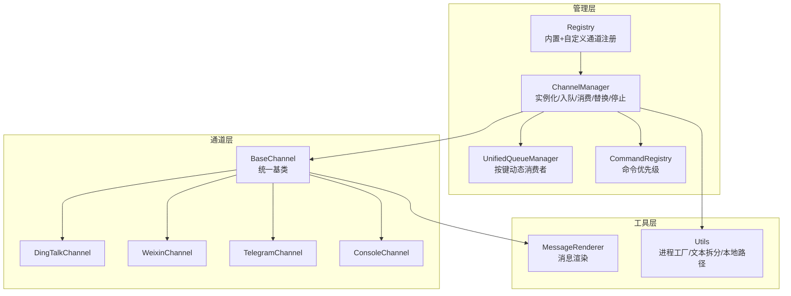
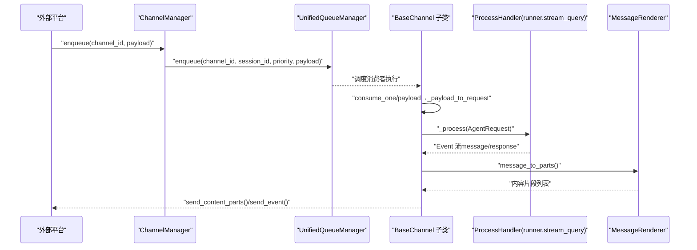
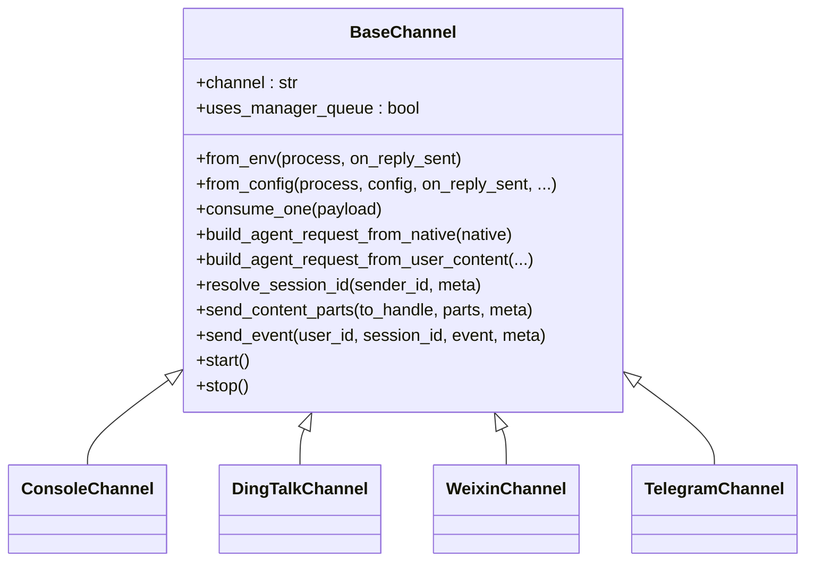
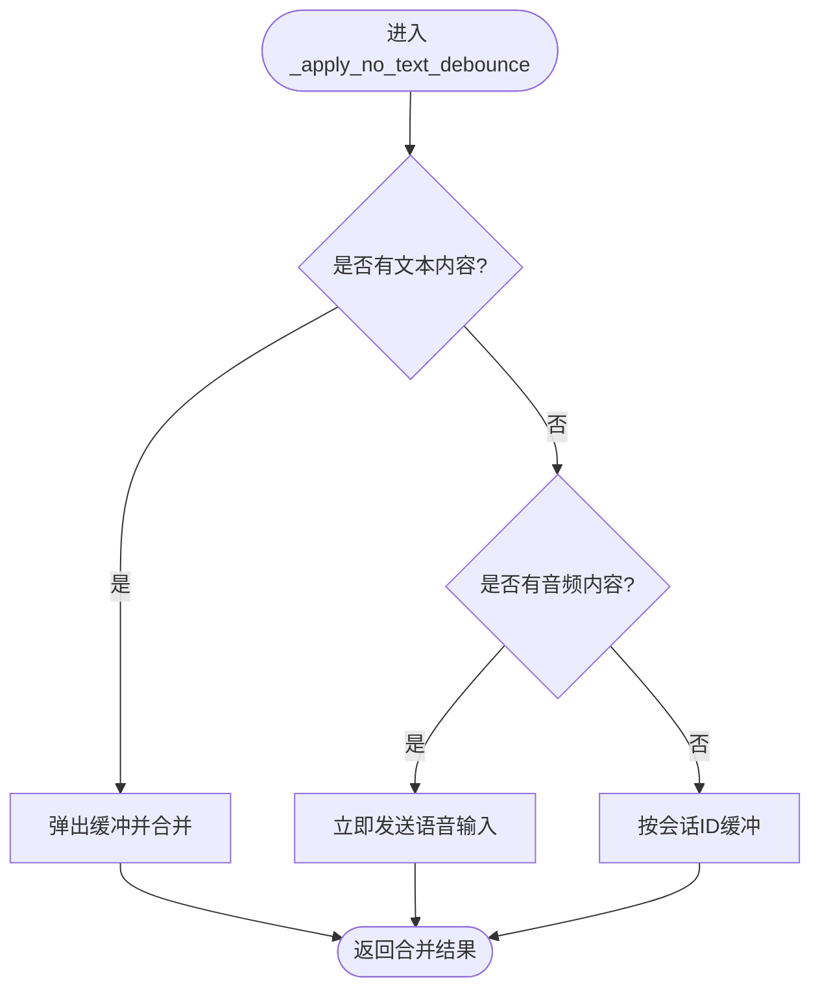
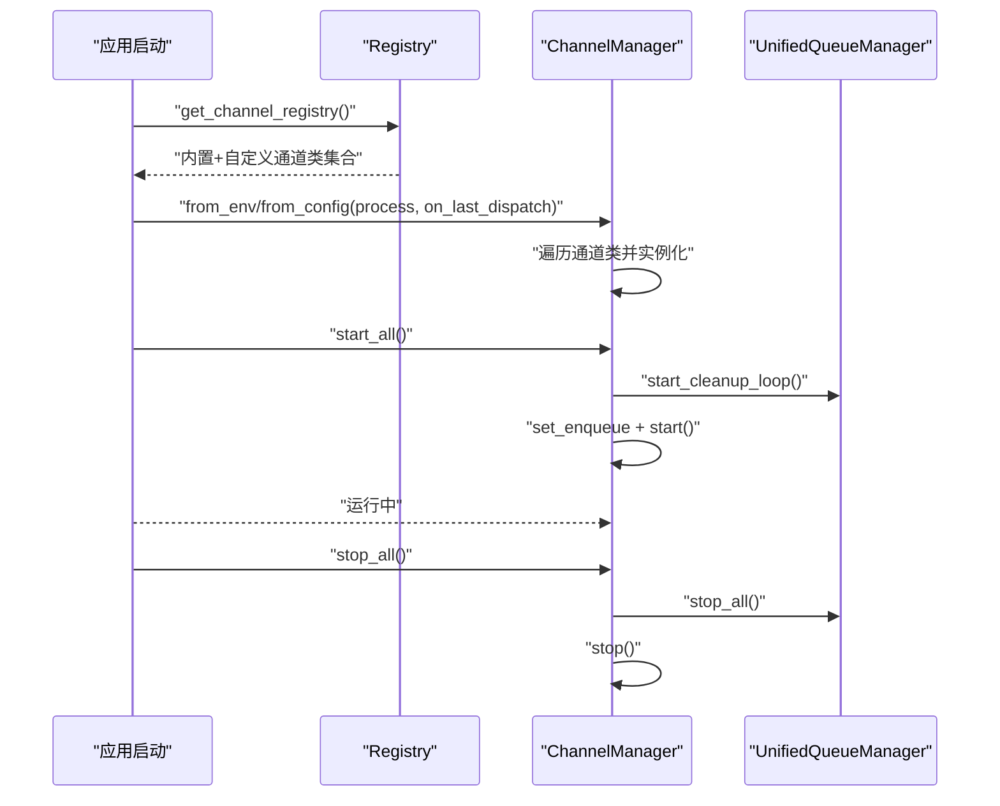
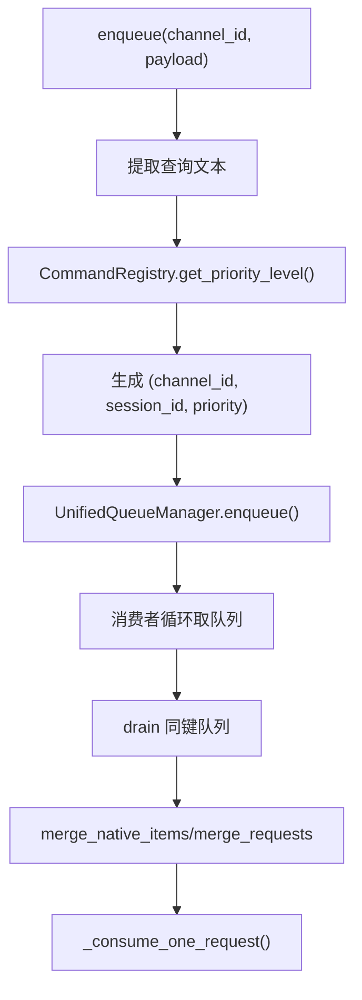
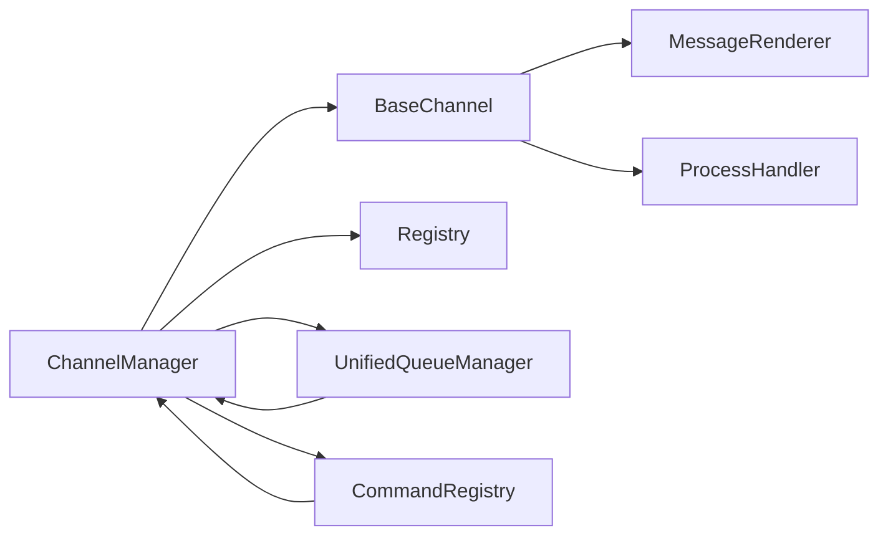

# 新通道集成

<cite>
**本文引用的文件**
- [base.py](file://copaw/src/copaw/app/channels/base.py)
- [manager.py](file://copaw/src/copaw/app/channels/manager.py)
- [registry.py](file://copaw/src/copaw/app/channels/registry.py)
- [schema.py](file://copaw/src/copaw/app/channels/schema.py)
- [unified_queue_manager.py](file://copaw/src/copaw/app/channels/unified_queue_manager.py)
- [command_registry.py](file://copaw/src/copaw/app/channels/command_registry.py)
- [utils.py](file://copaw/src/copaw/app/channels/utils.py)
- [renderer.py](file://copaw/src/copaw/app/channels/renderer.py)
- [console/channel.py](file://copaw/src/copaw/app/channels/console/channel.py)
- [dingtalk/channel.py](file://copaw/src/copaw/app/channels/dingtalk/channel.py)
- [weixin/channel.py](file://copaw/src/copaw/app/channels/weixin/channel.py)
- [telegram/channel.py](file://copaw/src/copaw/app/channels/telegram/channel.py)
</cite>

## 目录
1. [简介](#简介)
2. [项目结构](#项目结构)
3. [核心组件](#核心组件)
4. [架构总览](#架构总览)
5. [详细组件分析](#详细组件分析)
6. [依赖分析](#依赖分析)
7. [性能考虑](#性能考虑)
8. [故障排除指南](#故障排除指南)
9. [结论](#结论)
10. [附录：新平台集成开发框架与最佳实践](#附录新平台集成开发框架与最佳实践)

## 简介
本指南面向需要在现有通道系统中新增一个“新平台”的开发者，目标是帮助你以统一的通道抽象基类为基础，快速完成从消息格式规范、数据转换机制、通道注册与生命周期管理、消息路由与会话管理，到配置参数、认证与连接管理、测试与故障排除的完整闭环。文档同时提供钉钉、微信、Telegram 等已有通道的实现示例，作为参考。

## 项目结构
通道子系统位于 copaw/src/copaw/app/channels 下，采用“基类 + 多具体通道 + 管理器 + 注册表 + 统一队列 + 命令优先级”的分层设计。核心要点：
- 基类定义统一的消息处理契约、渲染风格、去抖与合并策略、会话解析与任务跟踪。
- 管理器负责通道实例化、统一入队与消费、替换与停止、事件/文本发送。
- 注册表负责内置通道与自定义通道的发现与加载。
- 统一队列管理器按（通道, 会话, 优先级）三元键动态创建消费者，支持自动清理与监控指标。
- 命令注册表提供控制命令与优先级映射，用于路由与批处理合并。
- 渲染器将运行时消息转换为可发送的内容片段，受样式与能力控制。

图表来源
- [base.py:70-127](file://copaw/src/copaw/app/channels/base.py#L70-L127)
- [manager.py:68-116](file://copaw/src/copaw/app/channels/manager.py#L68-L116)
- [registry.py:189-194](file://copaw/src/copaw/app/channels/registry.py#L189-L194)
- [unified_queue_manager.py:60-78](file://copaw/src/copaw/app/channels/unified_queue_manager.py#L60-L78)
- [command_registry.py:23-62](file://copaw/src/copaw/app/channels/command_registry.py#L23-L62)
- [renderer.py:78-86](file://copaw/src/copaw/app/channels/renderer.py#L78-L86)
- [utils.py:121-134](file://copaw/src/copaw/app/channels/utils.py#L121-L134)

章节来源
- [base.py:70-127](file://copaw/src/copaw/app/channels/base.py#L70-L127)
- [manager.py:68-116](file://copaw/src/copaw/app/channels/manager.py#L68-L116)
- [registry.py:189-194](file://copaw/src/copaw/app/channels/registry.py#L189-L194)

## 核心组件
- 通道抽象基类 BaseChannel
  - 定义统一的生命周期钩子（start/stop）、消息处理入口（consume_one/_consume_one_request/_stream_with_tracker）、请求构建（build_agent_request_from_native/build_agent_request_from_user_content）、会话解析（resolve_session_id）、去抖与合并（merge_native_items/merge_requests/_apply_no_text_debounce）、渲染（MessageRenderer/RenderStyle）、回调注入（set_enqueue/set_workspace）、事件发送（send_event/send_content_parts）等。
  - 提供默认实现与可覆盖点，确保各通道遵循一致的消息契约与行为。
- 通道管理器 ChannelManager
  - 负责从环境或配置创建通道实例、注入统一的 process 处理器、设置工作区与命令注册表、启动/停止通道、替换通道、发送事件/文本。
  - 通过统一队列管理器进行入队与消费，支持批处理合并与优先级路由。
- 通道注册表 Registry
  - 内置通道清单与加载逻辑；支持从自定义目录加载自定义通道类，统一暴露给管理器。
- 统一队列管理器 UnifiedQueueManager
  - 按（channel_id, session_id, priority_level）三元键维护队列与消费者，支持动态创建、空闲清理、监控指标与批量处理。
- 命令优先级注册表 CommandRegistry
  - 将命令前缀映射到优先级级别，支持“紧急/高/正常/低”等预设名称或自定义数值，用于消息路由与批处理。
- 渲染器 MessageRenderer
  - 将运行时消息内容转换为可发送的内容片段（文本/图片/音频/视频/文件/拒绝），受样式与过滤策略控制。
- 工具集 Utils
  - 提供文本拆分、文件 URL 解析、从 Runner 构造 ProcessHandler 的工厂方法等。

章节来源
- [base.py:70-127](file://copaw/src/copaw/app/channels/base.py#L70-L127)
- [manager.py:68-116](file://copaw/src/copaw/app/channels/manager.py#L68-L116)
- [registry.py:189-194](file://copaw/src/copaw/app/channels/registry.py#L189-L194)
- [unified_queue_manager.py:60-78](file://copaw/src/copaw/app/channels/unified_queue_manager.py#L60-L78)
- [command_registry.py:23-62](file://copaw/src/copaw/app/channels/command_registry.py#L23-L62)
- [renderer.py:78-86](file://copaw/src/copaw/app/channels/renderer.py#L78-L86)
- [utils.py:121-134](file://copaw/src/copaw/app/channels/utils.py#L121-L134)

## 架构总览
下图展示了从“外部平台消息”到“统一 Agent 请求”再到“通道输出”的端到端流程，以及统一队列与命令优先级在其中的作用。

图表来源
- [manager.py:350-361](file://copaw/src/copaw/app/channels/manager.py#L350-L361)
- [unified_queue_manager.py:119-164](file://copaw/src/copaw/app/channels/unified_queue_manager.py#L119-L164)
- [base.py:659-758](file://copaw/src/copaw/app/channels/base.py#L659-L758)
- [renderer.py:87-102](file://copaw/src/copaw/app/channels/renderer.py#L87-L102)

## 详细组件分析

### 通道抽象基类 BaseChannel 设计模式与接口规范
- 设计模式
  - 抽象工厂式：子类通过 from_env/from_config 构建，统一注入 process 与回调。
  - 模板方法：consume_one/_consume_one_request/_stream_with_tracker 提供标准流程，子类仅需实现 build_agent_request_from_native 与发送方法。
  - 策略组合：RenderStyle 控制渲染细节；去抖/合并策略可按通道定制。
- 关键接口
  - 生命周期：start/stop
  - 入口：consume_one（支持时间去抖与批合并）
  - 请求构建：build_agent_request_from_native/build_agent_request_from_user_content
  - 会话：resolve_session_id/get_debounce_key/merge_native_items/merge_requests
  - 发送：send_content_parts/send_event（由子类实现）
  - 回调：set_enqueue/set_workspace/on_reply_sent
- 数据结构与复杂度
  - 去抖缓冲：字典按 session_id 维护列表，合并操作为 O(n)。
  - 批处理合并：对同一键的队列消息进行合并，复杂度 O(n)。
  - 会话解析：O(1) 字典查找键生成。
- 错误处理
  - 统一异常捕获与日志记录；错误事件触发 _on_consume_error；支持取消任务（CancelledError）。
- 性能影响
  - 去抖与合并减少重复渲染与网络往返。
  - 任务跟踪与队列隔离避免阻塞与串扰。

图表来源
- [base.py:70-127](file://copaw/src/copaw/app/channels/base.py#L70-L127)
- [console/channel.py:63-75](file://copaw/src/copaw/app/channels/console/channel.py#L63-L75)
- [dingtalk/channel.py](file://copaw/src/copaw/app/channels/dingtalk/channel.py)
- [weixin/channel.py](file://copaw/src/copaw/app/channels/weixin/channel.py)
- [telegram/channel.py](file://copaw/src/copaw/app/channels/telegram/channel.py)

章节来源
- [base.py:70-127](file://copaw/src/copaw/app/channels/base.py#L70-L127)

### 消息格式规范与数据转换机制
- 运行时消息模型
  - 使用运行时 Message/Content 类型（文本、图片、音频、视频、文件、拒绝、数据块等），保证跨通道一致性。
- 内容片段渲染
  - Renderer 将不同类型的运行时内容转换为可发送片段，并根据 RenderStyle 控制是否显示工具详情、思考内容、代码围栏等。
- 去抖与合并
  - 对无文本内容进行缓冲，待出现文本后合并发送；对同一会话的多个原生负载进行合并（合并 content_parts 与 meta 字段）。
- 会话解析
  - 默认使用“通道名:用户ID”作为 session_id，子类可覆盖以适配平台特性（如飞书按会话ID）。

图表来源
- [base.py:249-281](file://copaw/src/copaw/app/channels/base.py#L249-L281)

章节来源
- [renderer.py:78-102](file://copaw/src/copaw/app/channels/renderer.py#L78-L102)
- [base.py:147-176](file://copaw/src/copaw/app/channels/base.py#L147-L176)
- [base.py:249-281](file://copaw/src/copaw/app/channels/base.py#L249-L281)

### 通道注册流程与生命周期管理
- 注册流程
  - Registry 加载内置通道清单，尝试导入对应模块与类；失败时按是否必需决定抛错或跳过。
  - 自定义通道扫描 CUSTOM_CHANNELS_DIR，动态导入模块并收集继承自 BaseChannel 的类。
- 生命周期
  - ChannelManager.from_env/from_config 创建通道实例，注入 process 与回调。
  - start_all 启动统一队列管理器与消费者循环，为每个通道设置入队回调。
  - stop_all 停止所有通道与队列，清理挂起任务。
  - replace_channel 支持热替换单个通道实例（先启动新实例，再锁内交换并停止旧实例）。

图表来源
- [registry.py:189-194](file://copaw/src/copaw/app/channels/registry.py#L189-L194)
- [manager.py:86-116](file://copaw/src/copaw/app/channels/manager.py#L86-L116)
- [manager.py:447-478](file://copaw/src/copaw/app/channels/manager.py#L447-L478)
- [unified_queue_manager.py:274-289](file://copaw/src/copaw/app/channels/unified_queue_manager.py#L274-L289)

章节来源
- [registry.py:189-194](file://copaw/src/copaw/app/channels/registry.py#L189-L194)
- [manager.py:447-478](file://copaw/src/copaw/app/channels/manager.py#L447-L478)

### 消息路由机制与会话管理策略
- 路由机制
  - ChannelManager 在入队时提取查询文本，通过 CommandRegistry 计算优先级，按（通道, 会话, 优先级）路由至统一队列。
  - 消费者循环对同键队列进行批处理合并（drain + merge），提升吞吐与稳定性。
- 会话管理
  - BaseChannel.resolve_session_id 默认使用“通道:用户ID”，子类可覆盖以适配平台会话语义。
  - 去抖与合并策略确保同一会话内的消息有序、完整地被处理。

图表来源
- [manager.py:282-300](file://copaw/src/copaw/app/channels/manager.py#L282-L300)
- [command_registry.py:175-218](file://copaw/src/copaw/app/channels/command_registry.py#L175-L218)
- [unified_queue_manager.py:119-164](file://copaw/src/copaw/app/channels/unified_queue_manager.py#L119-L164)
- [base.py:659-758](file://copaw/src/copaw/app/channels/base.py#L659-L758)

章节来源
- [manager.py:282-300](file://copaw/src/copaw/app/channels/manager.py#L282-L300)
- [command_registry.py:175-218](file://copaw/src/copaw/app/channels/command_registry.py#L175-L218)
- [unified_queue_manager.py:119-164](file://copaw/src/copaw/app/channels/unified_queue_manager.py#L119-L164)

### 通道配置参数、认证方式与连接管理
- 配置参数
  - BaseChannel 支持 show_tool_details、filter_tool_messages、filter_thinking 等渲染与过滤选项。
  - ConsoleChannel 示例展示 enabled、bot_prefix、media_dir 等通道特定参数。
- 认证与连接
  - 通道通过 from_env/from_config 获取凭据与连接信息；部分通道（如钉钉）可能需要轮询/长连接/WebHook 注册等。
  - 可选刷新：BaseChannel.refresh_webhook_or_token 用于定期刷新或在 401 时重试。
- 会话与目标
  - get_to_handle_from_request/get_on_reply_sent_args 决定回复目标与回调参数；某些平台按会话ID发送（如飞书）。

章节来源
- [base.py:80-127](file://copaw/src/copaw/app/channels/base.py#L80-L127)
- [console/channel.py:77-190](file://copaw/src/copaw/app/channels/console/channel.py#L77-L190)
- [base.py:639-651](file://copaw/src/copaw/app/channels/base.py#L639-L651)

### 现有通道实现示例

#### Console 通道（终端输出）
- 角色：轻量输出通道，将 Agent 输出打印到终端，支持媒体文件解析与推送前端存储。
- 关键点：resolve_session_id 支持显式 meta 中的 session_id；渲染媒体为本地路径；支持 send/send_content_parts。

章节来源
- [console/channel.py:63-190](file://copaw/src/copaw/app/channels/console/channel.py#L63-L190)
- [console/channel.py:255-276](file://copaw/src/copaw/app/channels/console/channel.py#L255-L276)
- [console/channel.py:427-431](file://copaw/src/copaw/app/channels/console/channel.py#L427-L431)

#### DingTalk 通道
- 角色：企业级 IM 通道，支持去抖、合并、WebHook、会话级路由与批处理。
- 关键点：管理器对钉钉通道有特殊批处理逻辑（合并 session_webhook）；支持时间去抖与批合并。

章节来源
- [manager.py:39-65](file://copaw/src/copaw/app/channels/manager.py#L39-L65)
- [dingtalk/channel.py](file://copaw/src/copaw/app/channels/dingtalk/channel.py)

#### Weixin（微信）通道
- 角色：微信生态通道，支持消息解析与 AgentRequest 构建。
- 关键点：实现 build_agent_request_from_native 并接入统一处理流程。

章节来源
- [weixin/channel.py](file://copaw/src/copaw/app/channels/weixin/channel.py)

#### Telegram 通道
- 角色：Telegram 通道，支持消息解析与发送。
- 关键点：实现 build_agent_request_from_native 并接入统一处理流程。

章节来源
- [telegram/channel.py](file://copaw/src/copaw/app/channels/telegram/channel.py)

## 依赖分析
- 组件耦合
  - BaseChannel 依赖渲染器与运行时消息类型；与 ChannelManager 通过 set_enqueue 回调耦合。
  - ChannelManager 依赖注册表、统一队列管理器与命令注册表；与各通道通过统一接口交互。
  - 统一队列管理器与命令注册表彼此独立，分别负责队列与优先级。
- 外部依赖
  - 运行时消息模型（agentscope_runtime.engine.schemas.agent_schemas）。
  - 异步队列与任务管理（asyncio）。
- 循环依赖
  - 未见循环依赖；模块职责清晰，接口边界明确。

图表来源
- [base.py:36-38](file://copaw/src/copaw/app/channels/base.py#L36-L38)
- [manager.py:21-25](file://copaw/src/copaw/app/channels/manager.py#L21-L25)
- [unified_queue_manager.py:35-38](file://copaw/src/copaw/app/channels/unified_queue_manager.py#L35-L38)
- [command_registry.py:18-20](file://copaw/src/copaw/app/channels/command_registry.py#L18-L20)

章节来源
- [base.py:36-38](file://copaw/src/copaw/app/channels/base.py#L36-L38)
- [manager.py:21-25](file://copaw/src/copaw/app/channels/manager.py#L21-L25)

## 性能考虑
- 队列与批处理
  - 统一队列管理器按键隔离并发，空闲超时自动清理，避免资源泄漏。
  - 批处理合并减少重复渲染与网络往返，提高吞吐。
- 去抖与合并
  - 文本去抖与音频直通策略降低无效渲染与网络开销。
- 渲染与过滤
  - 通过 RenderStyle 与过滤策略减少冗余内容传输。
- 监控与可观测性
  - 统一队列管理器提供指标查询接口，便于定位瓶颈。

## 故障排除指南
- 通道无法启动
  - 检查注册表是否正确加载内置/自定义通道；查看 from_env/from_config 参数与环境变量。
- 消息未到达或延迟
  - 检查 ChannelManager 的入队与消费者循环状态；确认 CommandRegistry 是否正确识别控制命令导致优先级异常。
- 去抖未生效
  - 确认通道是否启用去抖（_debounce_seconds > 0）；检查 _is_native_payload 与 get_debounce_key 的实现。
- 渲染异常或媒体无法显示
  - 检查 Renderer 的 RenderStyle 设置；确认媒体路径解析（file_url_to_local_path）与媒体目录配置。
- 会话错乱或重复
  - 检查 resolve_session_id 实现；确保同一会话的 session_id 一致。

章节来源
- [registry.py:62-76](file://copaw/src/copaw/app/channels/registry.py#L62-L76)
- [manager.py:447-526](file://copaw/src/copaw/app/channels/manager.py#L447-L526)
- [base.py:659-758](file://copaw/src/copaw/app/channels/base.py#L659-L758)
- [renderer.py:352-384](file://copaw/src/copaw/app/channels/renderer.py#L352-L384)
- [utils.py:78-118](file://copaw/src/copaw/app/channels/utils.py#L78-L118)

## 结论
通过统一的通道抽象基类与管理器、注册表、统一队列与命令优先级体系，新平台可以以最小成本接入系统。遵循本文提供的接口规范、消息格式与数据转换机制、注册与生命周期管理、路由与会话策略、配置与认证、测试与故障排除建议，即可高效完成新通道集成。

## 附录：新平台集成开发框架与最佳实践
- 开发步骤
  - 步骤1：创建通道类，继承 BaseChannel，实现 from_env/from_config 与 build_agent_request_from_native。
  - 步骤2：实现发送方法（send_content_parts/send_event），选择合适的 RenderStyle 与渲染策略。
  - 步骤3：在注册表中登记通道键名与类，或放置于自定义通道目录。
  - 步骤4：编写配置文件或环境变量，注入必要的认证与连接参数。
  - 步骤5：启动 ChannelManager，验证入队、批处理、去抖与合并、渲染与发送。
- 最佳实践
  - 明确会话语义：合理实现 resolve_session_id，确保跨消息稳定。
  - 控制渲染：根据平台能力调整 RenderStyle，避免过度渲染。
  - 优先级路由：为关键命令注册优先级，确保紧急命令快速响应。
  - 去抖策略：对输入法/语音等场景启用去抖，提升用户体验。
  - 错误处理：统一捕获异常并记录日志，必要时触发错误事件。
  - 监控指标：利用统一队列管理器的指标接口，持续观察队列积压与处理耗时。
  - 测试建议：编写单元测试覆盖消息解析、渲染、发送与错误分支；结合集成测试验证端到端流程。