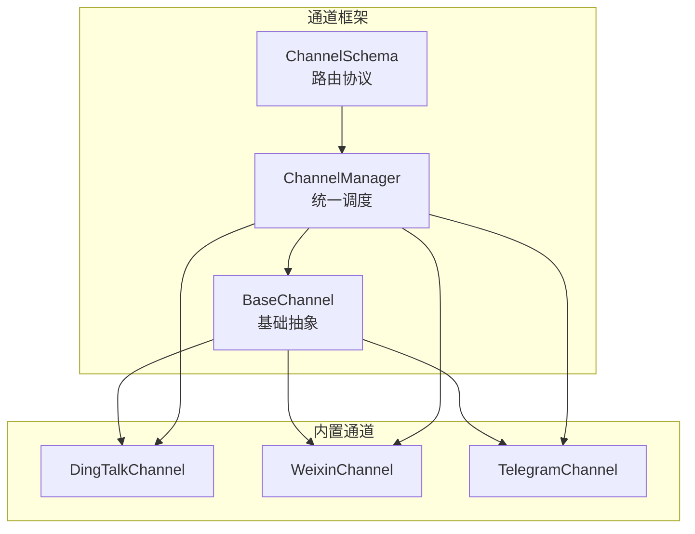
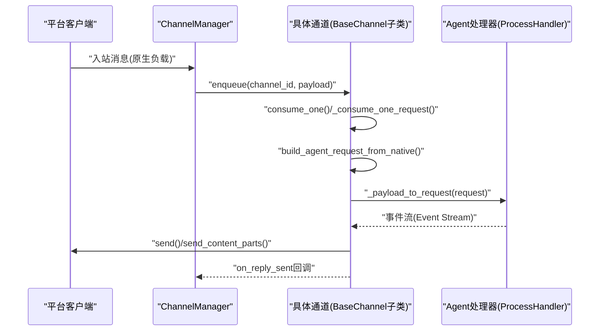
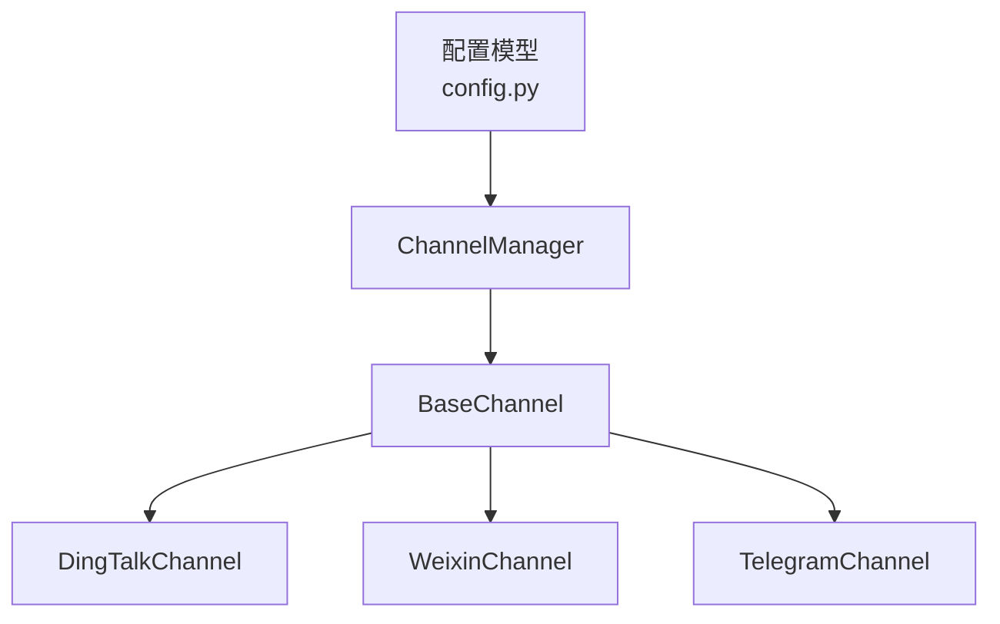

# 通道实现指南

<cite>
**本文档引用的文件**
- [base.py](file://copaw/src/copaw/app/channels/base.py)
- [dingtalk/channel.py](file://copaw/src/copaw/app/channels/dingtalk/channel.py)
- [weixin/channel.py](file://copaw/src/copaw/app/channels/weixin/channel.py)
- [telegram/channel.py](file://copaw/src/copaw/app/channels/telegram/channel.py)
- [manager.py](file://copaw/src/copaw/app/channels/manager.py)
- [schema.py](file://copaw/src/copaw/app/channels/schema.py)
- [config.py](file://copaw/src/copaw/config/config.py)
</cite>

## 目录
1. [简介](#简介)
2. [项目结构](#项目结构)
3. [核心组件](#核心组件)
4. [架构总览](#架构总览)
5. [详细组件分析](#详细组件分析)
6. [依赖关系分析](#依赖关系分析)
7. [性能考虑](#性能考虑)
8. [故障排查指南](#故障排查指南)
9. [结论](#结论)
10. [附录](#附录)

## 简介
本指南面向需要为新平台实现通道（Channel）的开发者，提供基于 BaseChannel 的完整实现模板与最佳实践。文档重点覆盖以下内容：
- 必须实现的关键方法：build_agent_request_from_native()、resolve_session_id()、get_to_handle_from_request()
- 消息格式转换步骤与数据结构映射
- 现有通道实现（钉钉、微信、Telegram）的代码示例分析
- 认证机制、API 调用与错误处理策略
- 通道初始化配置、环境变量设置与连接管理
- 完整开发流程与代码审查要点

## 项目结构
通道相关代码集中在 copaw/src/copaw/app/channels 目录下，核心文件包括：
- 基类与通用能力：base.py
- 通道管理器：manager.py
- 通道类型定义与路由协议：schema.py
- 具体平台通道实现：dingtalk、weixin、telegram 等
- 配置模型：config.py

图表来源
- [base.py](file://copaw/src/copaw/app/channels/base.py)
- [manager.py](file://copaw/src/copaw/app/channels/manager.py)
- [schema.py](file://copaw/src/copaw/app/channels/schema.py)

章节来源
- [base.py](file://copaw/src/copaw/app/channels/base.py)
- [manager.py](file://copaw/src/copaw/app/channels/manager.py)
- [schema.py](file://copaw/src/copaw/app/channels/schema.py)

## 核心组件
- BaseChannel：所有通道的抽象基类，定义了统一的消息生命周期、会话管理、去抖动、权限控制、渲染与发送等通用能力。
- ChannelManager：负责通道实例化、队列管理、批量合并、任务跟踪与统一消费循环。
- ChannelSchema：定义通道类型标识、路由地址（ChannelAddress）与消息转换协议。

关键职责与接口概览：
- 构建 AgentRequest：build_agent_request_from_native() 将平台原生消息转换为运行时消息对象。
- 会话解析：resolve_session_id() 将发送者与渠道元信息映射为会话标识。
- 发送目标解析：get_to_handle_from_request() 将请求映射为发送目标（如用户ID或会话ID）。
- 统一消费：consume_one()/ _consume_one_request() 处理入站消息，触发处理与回复。
- 渲染与发送：send_content_parts()/send() 将运行时内容转换为平台特定的回复。

章节来源
- [base.py](file://copaw/src/copaw/app/channels/base.py)
- [manager.py](file://copaw/src/copaw/app/channels/manager.py)
- [schema.py](file://copaw/src/copaw/app/channels/schema.py)

## 架构总览
通道从“入站”到“出站”的端到端流程如下：

图表来源
- [manager.py](file://copaw/src/copaw/app/channels/manager.py)
- [base.py](file://copaw/src/copaw/app/channels/base.py)

## 详细组件分析

### BaseChannel 抽象与生命周期
- 初始化参数：支持工具展示控制、过滤策略、允许/拒绝列表、提及策略等。
- 去抖动与合并：对无文本输入进行缓冲合并，避免重复处理；支持时间窗口内的原生负载合并。
- 权限与提及策略：通过 allowlist、群聊/私聊策略与 bot 提及检测，决定是否处理。
- 任务跟踪：与工作区 TaskTracker 集成，支持取消与幂等处理。
- 事件流：_stream_with_tracker 将事件序列化为 SSE 格式，便于前端或外部系统订阅。

关键方法与职责：
- build_agent_request_from_native(native_payload)：必须实现，将原生负载解析为运行时消息。
- resolve_session_id(sender_id, channel_meta)：默认使用 channel:sender_id，可按平台规则缩短会话ID。
- get_to_handle_from_request(request)：默认返回 user_id，部分平台需返回 session_id。
- get_on_reply_sent_args(request, to_handle)：用于回调参数打包。
- refresh_webhook_or_token()：可选，用于刷新令牌或 Webhook。

章节来源
- [base.py](file://copaw/src/copaw/app/channels/base.py)

### 钉钉通道（DingTalkChannel）
- 会话ID策略：优先使用 conversation_id 的短后缀，便于定时任务查找。
- 去抖动关闭：由于钉钉流式回调特性，禁用时间去抖动，由管理器在同会话内合并后再调用。
- Proactive 发送：存储 sessionWebhook，支持后续主动推送；过期时间安全边界处理。
- AI卡片与流式回复：支持 AI 卡片状态管理与早期 ACK，避免重试风暴。
- 幂等与去重：基于消息ID的去重集合，防止重复处理。

实现要点：
- build_agent_request_from_native()：解析原生 payload，提取 content_parts、meta，并设置可序列化的 channel_meta。
- resolve_session_id()：从 meta 中提取 conversation_id 并生成短会话ID。
- _before_consume_process()：保存 sessionWebhook 到内存与磁盘，支持重启后恢复。
- _route_from_handle()：支持多种发送目标形式（webhook、会话键等）。

章节来源
- [dingtalk/channel.py](file://copaw/src/copaw/app/channels/dingtalk/channel.py)
- [base.py](file://copaw/src/copaw/app/channels/base.py)

### 微信通道（WeixinChannel）
- 长轮询接收：后台线程中持续调用 getupdates，解析消息并去重。
- 会话ID策略：私聊使用 weixin:<from_user_id>，群聊使用 weixin:group:<group_id>。
- 媒体下载：支持图片、语音、视频、文件的解密与本地缓存。
- 令牌持久化：支持二维码登录与令牌文件持久化，上下文令牌用于主动发送。
- 去重与打字指示：维护 context_token 去重集与打字指示器。

实现要点：
- build_agent_request_from_native()：解析 item_list，构建 Text/Image/File/Video/Audio 内容块。
- resolve_session_id()：根据 meta 中的 weixin_group_id 判断群聊场景。
- _on_message()：统一入口，完成去重、内容解析、会话ID计算与入队。
- _download_media()：媒体文件下载与本地化存储。

章节来源
- [weixin/channel.py](file://copaw/src/copaw/app/channels/weixin/channel.py)
- [base.py](file://copaw/src/copaw/app/channels/base.py)

### Telegram 通道（TelegramChannel）
- 轮询接收：基于 python-telegram-bot Application，处理消息与编辑消息。
- 会话ID策略：telegram:<chat_id>。
- 媒体发送：支持图片、视频、音频、文件上传，自动分片与错误处理。
- 打字指示：可选显示打字指示，周期性发送 chat_action。
- 文本拆分：超过长度限制时按换行/空格拆分，保证可读性。

实现要点：
- _build_content_parts_from_message()：从 update 解析文本、实体与媒体。
- _message_meta()：提取 chat_id、user_id、用户名、消息ID、群组类型等。
- send()/send_media()：分别处理纯文本与媒体发送，含丰富的异常分支处理。
- _apply_no_text_debounce()：媒体-only 消息无需等待文本即可处理。

章节来源
- [telegram/channel.py](file://copaw/src/copaw/app/channels/telegram/channel.py)
- [base.py](file://copaw/src/copaw/app/channels/base.py)

### 通道管理器（ChannelManager）
- 统一队列：基于 UnifiedQueueManager 对同一会话的消息进行批合并与优先级调度。
- 工厂方法：from_env()/from_config() 依据环境变量或配置文件创建通道实例。
- 生命周期：start_all()/stop_all() 启停通道与队列清理循环。
- 事件发送：send_text()/send_event() 将事件或文本转为通道特定目标发送。

章节来源
- [manager.py](file://copaw/src/copaw/app/channels/manager.py)

### 消息格式转换与数据结构映射
- 原生负载 → AgentRequest：build_agent_request_from_native() 将平台字段映射为运行时 Message/Content 类型，填充 session_id、user_id、channel、channel_meta。
- 运行时内容 → 平台回复：send_content_parts()/send() 将 Text/Image/Video/Audio/File 等内容转换为平台 API 请求或 Webhook 调用。
- 会话ID映射：resolve_session_id() 将平台会话标识规范化，确保跨通道一致性。
- 发送目标映射：get_to_handle_from_request() 返回平台特定的发送目标（如用户ID或会话ID）。

章节来源
- [base.py](file://copaw/src/copaw/app/channels/base.py)
- [schema.py](file://copaw/src/copaw/app/channels/schema.py)

## 依赖关系分析
- 通道与管理器：ChannelManager 统一注入 enqueue 回调，通道通过 consume_one/_consume_one_request 接收消息。
- 通道与配置：各通道通过 from_env/from_config 读取环境变量或配置模型，支持动态启用/禁用与参数覆盖。
- 通道与渲染：BaseChannel 内置 MessageRenderer，支持工具详情、思考内容过滤与内部工具隐藏。
- 通道与工作区：set_workspace 注入 TaskTracker 与 ChatManager，支持任务取消与聊天上下文管理。

图表来源
- [config.py](file://copaw/src/copaw/config/config.py)
- [manager.py](file://copaw/src/copaw/app/channels/manager.py)
- [base.py](file://copaw/src/copaw/app/channels/base.py)

章节来源
- [config.py](file://copaw/src/copaw/config/config.py)
- [manager.py](file://copaw/src/copaw/app/channels/manager.py)
- [base.py](file://copaw/src/copaw/app/channels/base.py)

## 性能考虑
- 去抖动与合并：合理设置 _debounce_seconds 与 merge_native_items，减少重复渲染与网络请求。
- 批量处理：利用 ChannelManager 的批合并逻辑，降低通道处理频率。
- 媒体缓存：将下载的媒体文件缓存至本地目录，避免重复下载与带宽浪费。
- 异常快速失败：在发送阶段尽早捕获并记录错误，避免阻塞主流程。
- 速率限制：针对平台 API 限制（如 Telegram 文件大小、重试等待），在通道层做显式保护。

## 故障排查指南
常见问题与定位建议：
- 无法接收消息
  - 检查通道是否启用、令牌是否正确、轮询/回调是否正常。
  - 查看日志中的入站解析与去重记录。
- 无法发送消息
  - 检查发送目标（to_handle）是否正确，meta 中是否包含必要字段（如 chat_id/webhook）。
  - 关注平台错误码与异常分支（如 Telegram 的 BadRequest/Forbidden/TimedOut）。
- 会话错乱或重复
  - 核对 resolve_session_id 的实现，确保会话ID唯一且稳定。
  - 检查去重集合与消息ID是否正确更新。
- 性能瓶颈
  - 观察队列积压与批处理效果，调整去抖动与合并策略。
  - 分析媒体下载与本地化路径，避免磁盘 IO 抖动。

章节来源
- [base.py](file://copaw/src/copaw/app/channels/base.py)
- [dingtalk/channel.py](file://copaw/src/copaw/app/channels/dingtalk/channel.py)
- [weixin/channel.py](file://copaw/src/copaw/app/channels/weixin/channel.py)
- [telegram/channel.py](file://copaw/src/copaw/app/channels/telegram/channel.py)

## 结论
实现一个新的通道，应以 BaseChannel 为蓝本，重点关注三件事：
1) 消息转换：准确解析原生负载为运行时消息，并正确设置会话ID与元信息。
2) 发送策略：根据平台特性选择合适的发送方式（轮询、回调、Webhook、直接API），并做好错误与速率控制。
3) 生命周期管理：结合 ChannelManager 的队列与批处理能力，确保高吞吐与低延迟。

## 附录

### 必须实现的方法清单
- build_agent_request_from_native(native_payload)：解析原生负载，构建 AgentRequest。
- resolve_session_id(sender_id, channel_meta)：生成稳定的会话ID。
- get_to_handle_from_request(request)：返回平台特定的发送目标。

章节来源
- [base.py](file://copaw/src/copaw/app/channels/base.py)

### 通道初始化与配置
- 环境变量示例（以钉钉/微信/Telegram 为例）：
  - DINGTALK_CHANNEL_ENABLED、DINGTALK_CLIENT_ID、DINGTALK_CLIENT_SECRET、DINGTALK_MESSAGE_TYPE、DINGTALK_BOT_PREFIX、DINGTALK_ALLOW_FROM、DINGTALK_DENY_MESSAGE、DINGTALK_REQUIRE_MENTION、DINGTALK_CARD_AUTO_LAYOUT
  - WEIXIN_CHANNEL_ENABLED、WEIXIN_BOT_TOKEN、WEIXIN_BOT_TOKEN_FILE、WEIXIN_BASE_URL、WEIXIN_BOT_PREFIX、WEIXIN_ALLOW_FROM、WEIXIN_DENY_MESSAGE
  - TELEGRAM_CHANNEL_ENABLED、TELEGRAM_BOT_TOKEN、TELEGRAM_HTTP_PROXY、TELEGRAM_HTTP_PROXY_AUTH、TELEGRAM_BOT_PREFIX、TELEGRAM_ALLOW_FROM、TELEGRAM_DENY_MESSAGE、TELEGRAM_REQUIRE_MENTION、TELEGRAM_SHOW_TYPING
- 配置模型（Pydantic）：各通道均提供对应的配置类，支持 enabled、bot_prefix、过滤策略、策略与白名单等通用字段。

章节来源
- [dingtalk/channel.py](file://copaw/src/copaw/app/channels/dingtalk/channel.py)
- [weixin/channel.py](file://copaw/src/copaw/app/channels/weixin/channel.py)
- [telegram/channel.py](file://copaw/src/copaw/app/channels/telegram/channel.py)
- [config.py](file://copaw/src/copaw/config/config.py)

### 开发流程与代码审查要点
- 设计阶段
  - 明确原生负载结构与运行时消息映射关系。
  - 设计会话ID生成规则与发送目标映射。
  - 识别平台认证方式（令牌、签名、回调校验）与有效期管理。
- 实现阶段
  - 严格遵循 BaseChannel 的生命周期钩子与去抖动/合并策略。
  - 在通道内实现 from_env/from_config，支持灵活部署。
  - 编写单元测试与集成测试，覆盖正常路径与异常路径。
- 审查要点
  - 是否正确设置 channel_meta 与可序列化字段。
  - 是否处理了平台特有的媒体/文件/语音等类型。
  - 是否实现了权限控制、提及策略与去重逻辑。
  - 错误处理是否完善，是否记录足够上下文信息。
  - 是否考虑了性能与资源占用（队列、IO、网络）。