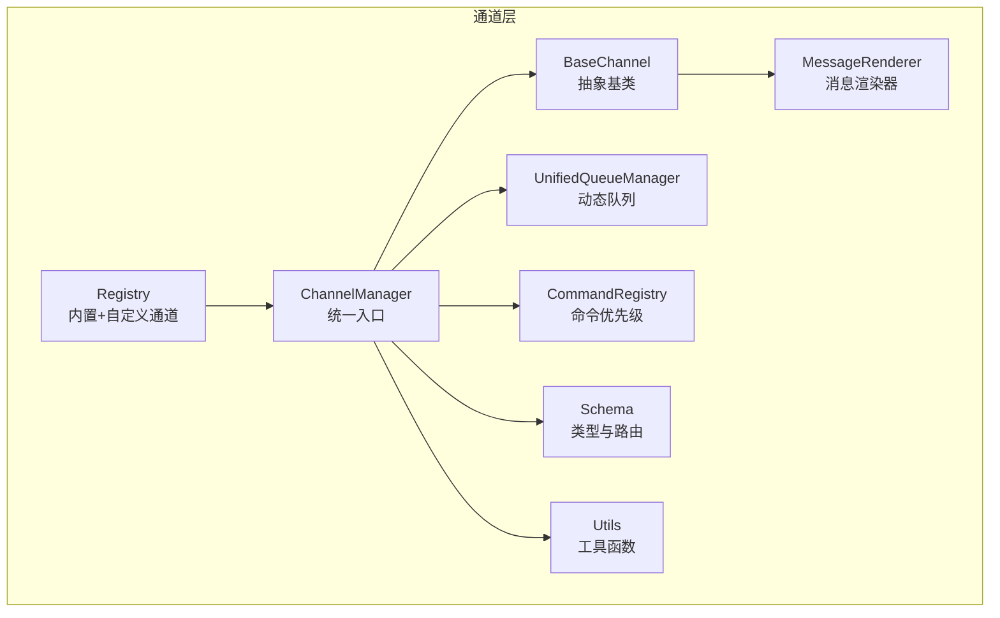
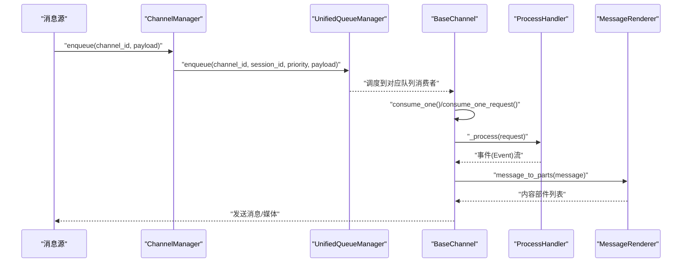
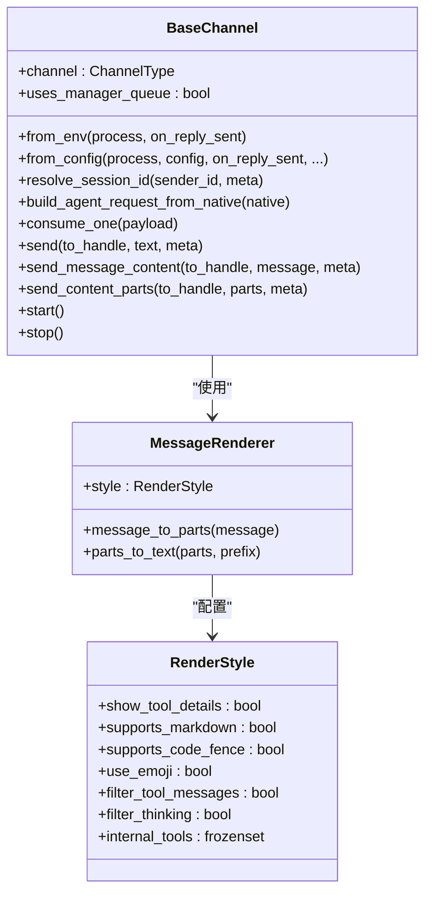
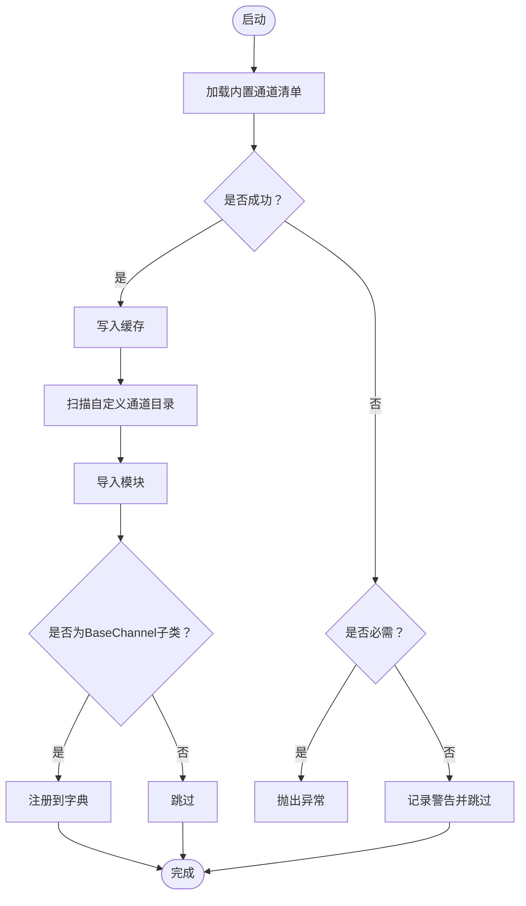
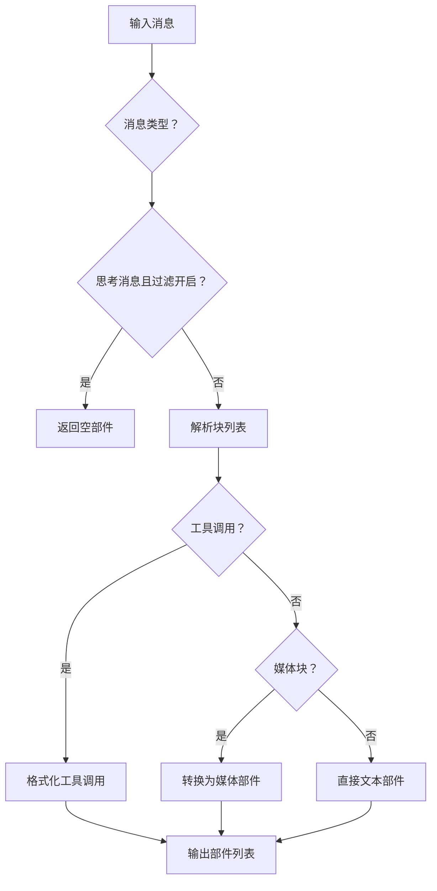
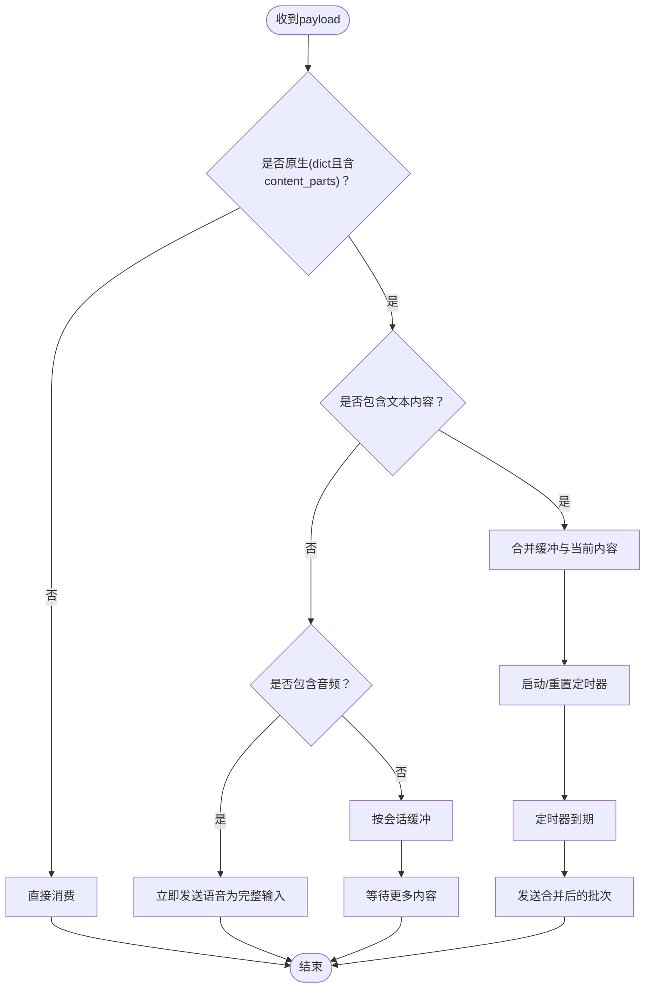
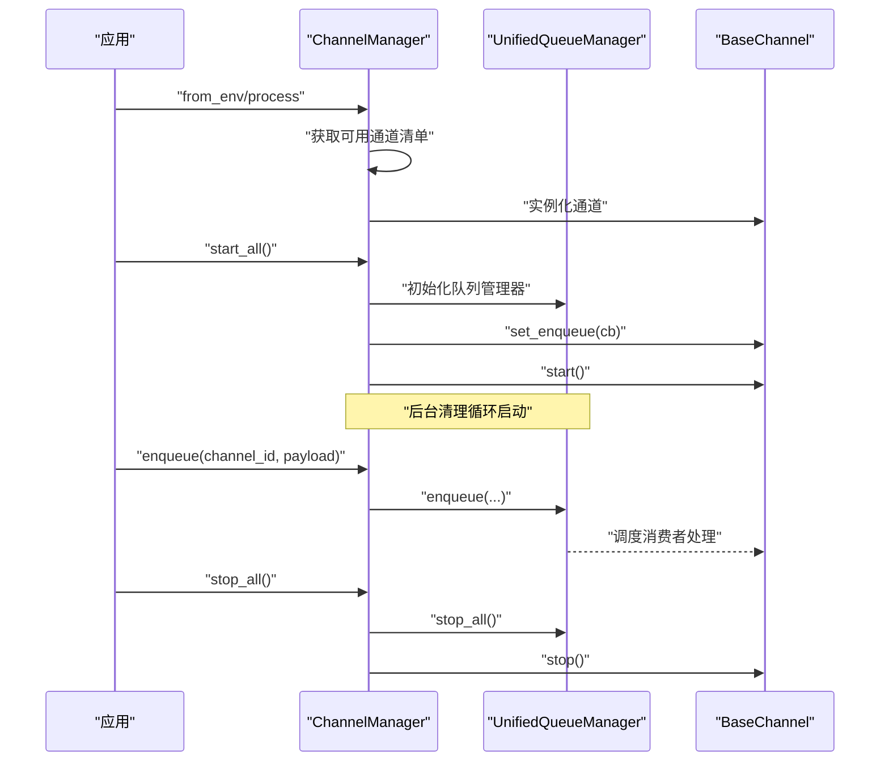
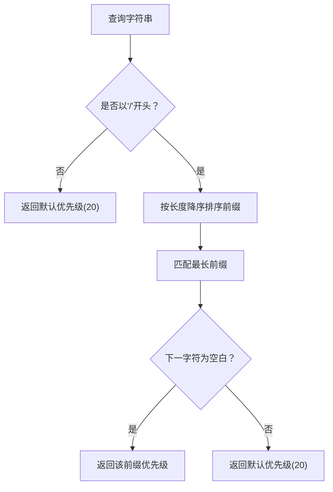
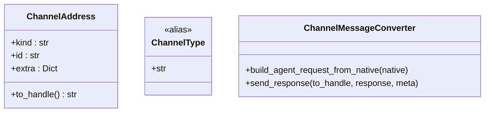
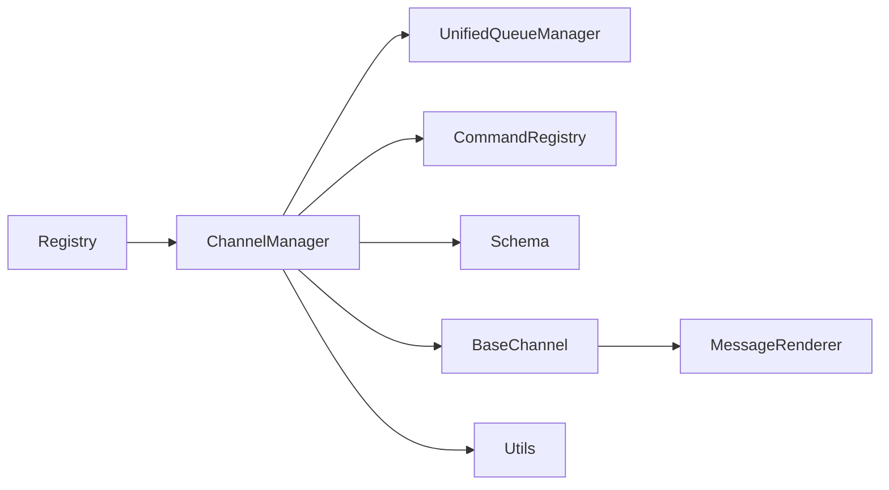

# 通道架构设计

<cite>
**本文引用的文件**
- [base.py](file://copaw/src/copaw/app/channels/base.py)
- [registry.py](file://copaw/src/copaw/app/channels/registry.py)
- [renderer.py](file://copaw/src/copaw/app/channels/renderer.py)
- [schema.py](file://copaw/src/copaw/app/channels/schema.py)
- [manager.py](file://copaw/src/copaw/app/channels/manager.py)
- [unified_queue_manager.py](file://copaw/src/copaw/app/channels/unified_queue_manager.py)
- [command_registry.py](file://copaw/src/copaw/app/channels/command_registry.py)
- [utils.py](file://copaw/src/copaw/app/channels/utils.py)
- [__init__.py](file://copaw/src/copaw/app/channels/__init__.py)
</cite>

## 目录
1. [引言](#引言)
2. [项目结构](#项目结构)
3. [核心组件](#核心组件)
4. [架构总览](#架构总览)
5. [详细组件分析](#详细组件分析)
6. [依赖关系分析](#依赖关系分析)
7. [性能考量](#性能考量)
8. [故障排查指南](#故障排查指南)
9. [结论](#结论)
10. [附录](#附录)

## 引言
本技术文档围绕通道（Channel）架构进行系统性梳理，重点阐释 BaseChannel 抽象基类的设计理念与核心接口规范，详解通道生命周期管理、消息处理流程与事件驱动机制；同时深入解析通道注册表（Registry）的插件化加载机制、消息渲染器（MessageRenderer）的渲染样式配置、会话管理与去抖动（Debounce）算法实现，并给出通道类型与消息内容类型定义及架构图示，帮助开发者快速理解并扩展通道系统。

## 项目结构
通道子系统位于应用层，采用“抽象基类 + 统一队列管理 + 插件化注册”的分层设计：
- 抽象基类：定义统一的消息转换、事件流式处理、渲染与发送等接口契约
- 注册表：内置通道清单与自定义通道发现，支持热插拔
- 队列管理：基于三元键（通道、会话、优先级）的动态队列与消费者模型
- 命令路由：命令前缀到优先级的映射，用于消息分流
- 渲染器：可配置的渲染风格，将运行时消息转换为可发送的内容部件
- 工具函数：文本切分、本地文件 URL 解析、进程处理器工厂等

**图表来源**
- [base.py](file://copaw/src/copaw/app/channels/base.py)
- [registry.py](file://copaw/src/copaw/app/channels/registry.py)
- [manager.py](file://copaw/src/copaw/app/channels/manager.py)
- [unified_queue_manager.py](file://copaw/src/copaw/app/channels/unified_queue_manager.py)
- [command_registry.py](file://copaw/src/copaw/app/channels/command_registry.py)
- [renderer.py](file://copaw/src/copaw/app/channels/renderer.py)
- [schema.py](file://copaw/src/copaw/app/channels/schema.py)
- [utils.py](file://copaw/src/copaw/app/channels/utils.py)

**章节来源**
- [base.py](file://copaw/src/copaw/app/channels/base.py)
- [registry.py](file://copaw/src/copaw/app/channels/registry.py)
- [manager.py](file://copaw/src/copaw/app/channels/manager.py)
- [unified_queue_manager.py](file://copaw/src/copaw/app/channels/unified_queue_manager.py)
- [command_registry.py](file://copaw/src/copaw/app/channels/command_registry.py)
- [renderer.py](file://copaw/src/copaw/app/channels/renderer.py)
- [schema.py](file://copaw/src/copaw/app/channels/schema.py)
- [utils.py](file://copaw/src/copaw/app/channels/utils.py)

## 核心组件
- BaseChannel：定义通道通用行为，包括请求构建、事件流式处理、消息渲染与发送、会话解析、去抖动与批量合并、工作区注入、控制命令检测等
- ChannelManager：负责通道实例化、统一入队与消费、生命周期管理、任务跟踪与错误处理
- UnifiedQueueManager：按（通道、会话、优先级）三元键动态创建队列与消费者，支持清理空闲队列、统计处理计数
- Registry：内置通道清单与自定义通道扫描，支持缓存与路由钩子注册
- MessageRenderer：根据渲染风格将运行时消息转换为可发送的内容部件，支持过滤与格式化
- CommandRegistry：命令前缀到优先级的映射，用于消息分流与批处理
- Schema：通道类型、地址路由与转换协议定义
- Utils：文本切分、本地文件 URL 解析、进程处理器工厂

**章节来源**
- [base.py](file://copaw/src/copaw/app/channels/base.py)
- [manager.py](file://copaw/src/copaw/app/channels/manager.py)
- [unified_queue_manager.py](file://copaw/src/copaw/app/channels/unified_queue_manager.py)
- [registry.py](file://copaw/src/copaw/app/channels/registry.py)
- [renderer.py](file://copaw/src/copaw/app/channels/renderer.py)
- [command_registry.py](file://copaw/src/copaw/app/channels/command_registry.py)
- [schema.py](file://copaw/src/copaw/app/channels/schema.py)
- [utils.py](file://copaw/src/copaw/app/channels/utils.py)

## 架构总览
通道系统采用“事件驱动 + 流式响应 + 动态队列”的架构模式：
- 入口由 ChannelManager 负责从注册表加载可用通道，注入统一的 AgentRequest 处理器（runner.stream_query）
- 每个通道通过统一队列管理器按（通道、会话、优先级）隔离并发，同键严格串行，不同键并发执行
- 消息进入后先进行命令识别与优先级判定，再进入通道消费循环
- 通道在消费过程中将运行时事件转换为消息部件并通过渲染器输出，最终调用具体通道的发送接口

**图表来源**
- [manager.py](file://copaw/src/copaw/app/channels/manager.py)
- [unified_queue_manager.py](file://copaw/src/copaw/app/channels/unified_queue_manager.py)
- [base.py](file://copaw/src/copaw/app/channels/base.py)
- [renderer.py](file://copaw/src/copaw/app/channels/renderer.py)

## 详细组件分析

### BaseChannel 抽象基类
设计理念：
- 将“消息原生格式”与“运行时请求/响应”解耦，通道仅需实现原生到请求的转换与发送逻辑
- 通过统一的事件流式处理与回调钩子，支持错误处理、完成回调、前置处理等扩展点
- 提供去抖动与批量合并能力，适配多端输入节奏差异

关键接口与职责：
- 生命周期：start/stop（由具体通道实现）
- 请求构建：build_agent_request_from_native/_payload_to_request
- 事件处理：_process（返回异步事件迭代器）、on_event_message_completed/on_event_response
- 渲染与发送：_message_to_content_parts/send_message_content/send_content_parts/send
- 会话与策略：resolve_session_id/get_to_handle_from_request/_check_allowlist/_check_group_mention
- 去抖动与批量：merge_native_items/merge_requests/_apply_no_text_debounce/_consume_one_request
- 工作区与追踪：set_workspace/_consume_with_tracker/_stream_with_tracker

**图表来源**
- [base.py](file://copaw/src/copaw/app/channels/base.py)
- [renderer.py](file://copaw/src/copaw/app/channels/renderer.py)

**章节来源**
- [base.py](file://copaw/src/copaw/app/channels/base.py)
- [renderer.py](file://copaw/src/copaw/app/channels/renderer.py)

### 通道注册表（Registry）
- 内置通道清单：通过模块名与类名映射内置通道，失败时按“必需/可选”策略处理
- 自定义通道发现：扫描自定义目录，导入模块并收集继承自 BaseChannel 的类
- 缓存与线程安全：全局缓存与锁保证进程内单次加载
- 路由钩子：允许自定义通道在启动时注册 HTTP 路由（必须以 /api/ 开头）

**图表来源**
- [registry.py](file://copaw/src/copaw/app/channels/registry.py)

**章节来源**
- [registry.py](file://copaw/src/copaw/app/channels/registry.py)

### 消息渲染器（MessageRenderer）
- 渲染风格（RenderStyle）：控制是否显示工具详情、是否支持 Markdown/代码围栏、是否使用 Emoji、是否过滤工具消息/思考内容、内部工具集合
- 渲染流程：将运行时消息（含文本、图片、音频、视频、文件、拒绝等）转换为内容部件列表；对工具调用与输出进行格式化
- 文本回退：将媒体内容转为文本占位符，便于不支持富媒体的通道

**图表来源**
- [renderer.py](file://copaw/src/copaw/app/channels/renderer.py)

**章节来源**
- [renderer.py](file://copaw/src/copaw/app/channels/renderer.py)

### 会话管理与去抖动（Debounce）算法
- 会话解析：默认以“通道:用户ID”作为会话标识，通道可覆盖 resolve_session_id 实现特定规则
- 去抖动（时间维度）：对原生负载（带 content_parts）按会话键定时合并，避免频繁小消息触发
- 无文本去抖动：若消息不含文本但含音频，则立即处理（语音为完整输入）；否则缓冲至出现文本后再合并发送
- 批量合并：同一会话内的多个原生负载或请求可合并，文本内容拼接，元信息保留

**图表来源**
- [base.py](file://copaw/src/copaw/app/channels/base.py)

**章节来源**
- [base.py](file://copaw/src/copaw/app/channels/base.py)

### ChannelManager 生命周期与消息处理
- 实例化：from_env/from_config 从注册表与配置生成通道实例，注入统一的 ProcessHandler
- 启动：初始化统一队列管理器，启动清理循环，为每个通道设置入队回调并启动
- 入队与消费：enqueue 接收任意线程调用，通过事件循环线程安全调度；消费者循环按队列键拉取消息并批处理
- 替换与停止：支持动态替换通道实例，优雅关闭所有消费者与队列

**图表来源**
- [manager.py](file://copaw/src/copaw/app/channels/manager.py)
- [unified_queue_manager.py](file://copaw/src/copaw/app/channels/unified_queue_manager.py)

**章节来源**
- [manager.py](file://copaw/src/copaw/app/channels/manager.py)
- [unified_queue_manager.py](file://copaw/src/copaw/app/channels/unified_queue_manager.py)

### 命令路由与优先级
- 命令注册：预设控制命令（如 /stop、/status 等），支持名称映射与数值优先级
- 优先级判定：按命令前缀匹配最长前缀，确定优先级（0/10/20/30 或自定义）
- 批处理：在队列中按优先级隔离，同会话内严格串行，不同优先级并发

**图表来源**
- [command_registry.py](file://copaw/src/copaw/app/channels/command_registry.py)

**章节来源**
- [command_registry.py](file://copaw/src/copaw/app/channels/command_registry.py)

### 类型与路由定义
- ChannelType：通道类型标识符（字符串，内置通道集合为常量）
- ChannelAddress：统一路由目标（kind/id/extra），替代分散的 meta 键
- ChannelMessageConverter 协议：定义原生消息到 AgentRequest 的转换与响应发送

**图表来源**
- [schema.py](file://copaw/src/copaw/app/channels/schema.py)

**章节来源**
- [schema.py](file://copaw/src/copaw/app/channels/schema.py)

### 工具函数
- 文本切分：按换行边界切分，保持代码围栏闭合，避免跨消息破坏格式
- 文件 URL 解析：支持 file:// 与本地路径，返回本地绝对路径或 None
- 进程处理器工厂：将 runner.stream_query 包装为通道可用的 ProcessHandler

**章节来源**
- [utils.py](file://copaw/src/copaw/app/channels/utils.py)

## 依赖关系分析
- BaseChannel 依赖 MessageRenderer 与 RenderStyle，以及运行时消息类型（来自外部引擎）
- ChannelManager 依赖 Registry、UnifiedQueueManager、CommandRegistry、Schema 与工具函数
- UnifiedQueueManager 依赖消费者函数签名与队列状态模型
- Registry 依赖自定义通道目录与模块导入
- CommandRegistry 为 ChannelManager 提供命令优先级映射

**图表来源**
- [registry.py](file://copaw/src/copaw/app/channels/registry.py)
- [manager.py](file://copaw/src/copaw/app/channels/manager.py)
- [unified_queue_manager.py](file://copaw/src/copaw/app/channels/unified_queue_manager.py)
- [command_registry.py](file://copaw/src/copaw/app/channels/command_registry.py)
- [schema.py](file://copaw/src/copaw/app/channels/schema.py)
- [base.py](file://copaw/src/copaw/app/channels/base.py)
- [renderer.py](file://copaw/src/copaw/app/channels/renderer.py)
- [utils.py](file://copaw/src/copaw/app/channels/utils.py)

**章节来源**
- [registry.py](file://copaw/src/copaw/app/channels/registry.py)
- [manager.py](file://copaw/src/copaw/app/channels/manager.py)
- [unified_queue_manager.py](file://copaw/src/copaw/app/channels/unified_queue_manager.py)
- [command_registry.py](file://copaw/src/copaw/app/channels/command_registry.py)
- [schema.py](file://copaw/src/copaw/app/channels/schema.py)
- [base.py](file://copaw/src/copaw/app/channels/base.py)
- [renderer.py](file://copaw/src/copaw/app/channels/renderer.py)
- [utils.py](file://copaw/src/copaw/app/channels/utils.py)

## 性能考量
- 动态队列与消费者：按需创建，避免固定线程池开销；空闲队列自动清理，降低内存占用
- 批量合并与去抖动：减少重复网络往返与渲染成本，提升吞吐
- 事件流式处理：边生成边发送，降低端到端延迟
- 优先级隔离：高优命令与普通消息分离，保障关键路径低延迟

## 故障排查指南
- 通道启动失败：检查注册表是否正确加载内置通道，必要时查看日志定位缺失依赖
- 入队超时：队列满或消费者阻塞，检查队列大小、消费者处理耗时与清理循环状态
- 控制命令未生效：确认命令前缀是否在注册表中，优先级是否正确
- 渲染异常：检查 RenderStyle 配置与消息类型，确保内容部件非空
- 会话错乱：核对 resolve_session_id 与 get_debounce_key 的实现一致性

**章节来源**
- [registry.py](file://copaw/src/copaw/app/channels/registry.py)
- [manager.py](file://copaw/src/copaw/app/channels/manager.py)
- [unified_queue_manager.py](file://copaw/src/copaw/app/channels/unified_queue_manager.py)
- [command_registry.py](file://copaw/src/copaw/app/channels/command_registry.py)
- [renderer.py](file://copaw/src/copaw/app/channels/renderer.py)
- [base.py](file://copaw/src/copaw/app/channels/base.py)

## 结论
通道架构通过抽象基类与统一队列管理实现了跨平台、可插拔的消息通道体系。BaseChannel 提供一致的生命周期与事件处理接口，Registry 支持内置与自定义通道的无缝集成，MessageRenderer 与 RenderStyle 则保证了消息在不同通道间的可移植性。配合 CommandRegistry 的优先级路由与去抖动/批量合并策略，系统在复杂场景下仍能保持高吞吐与低延迟。

## 附录
- 通道类型枚举：内置通道类型集合与默认通道标识
- 消息内容类型：文本、图片、音频、视频、文件、拒绝、数据等运行时内容部件
- 地址路由：统一的 ChannelAddress 表达式，简化发送目标解析

**章节来源**
- [schema.py](file://copaw/src/copaw/app/channels/schema.py)
- [base.py](file://copaw/src/copaw/app/channels/base.py)
- [renderer.py](file://copaw/src/copaw/app/channels/renderer.py)