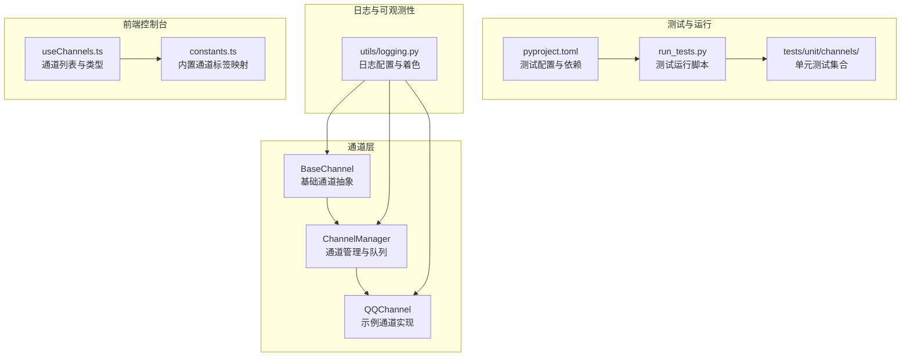
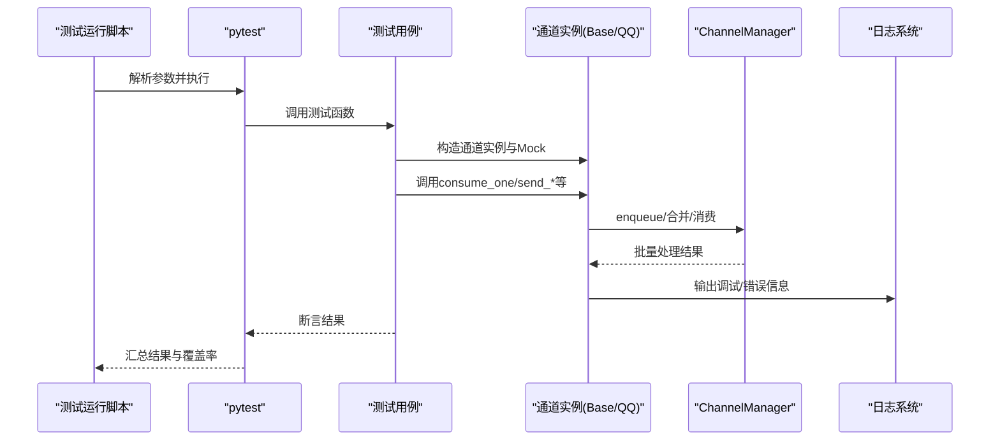
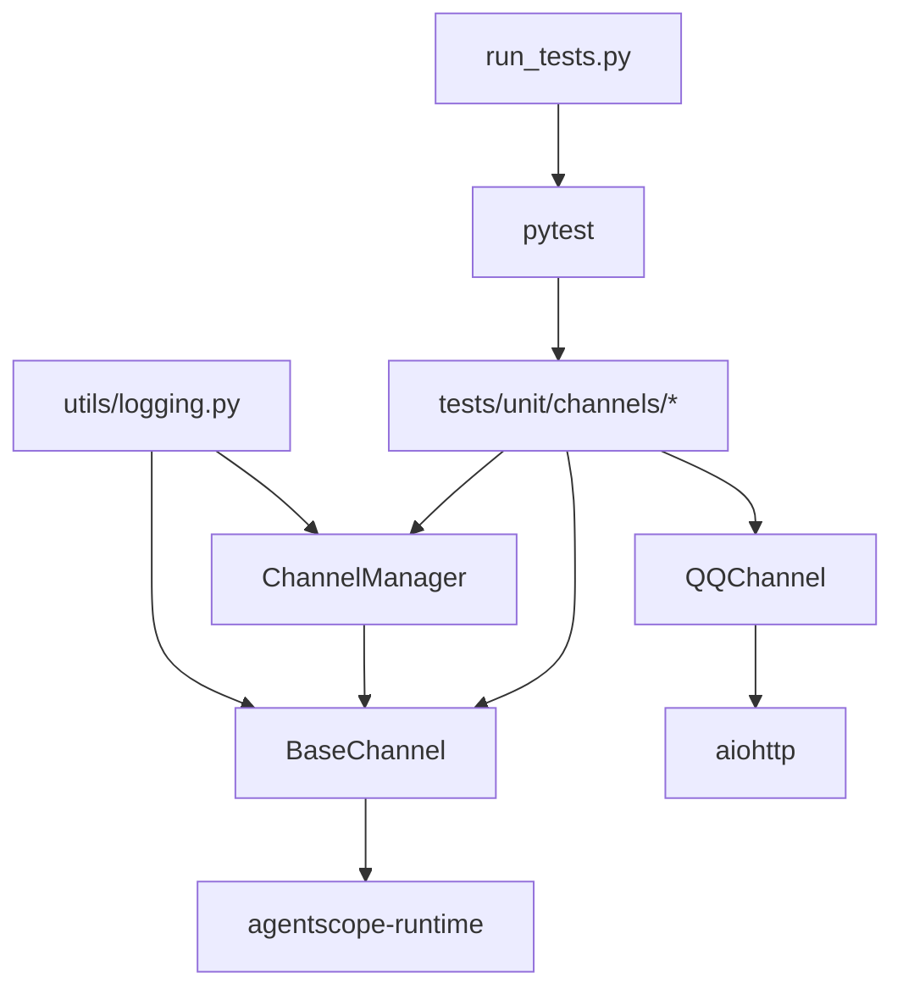

# 通道测试与调试

<cite>
**本文引用的文件**
- [base.py](file://copaw/src/copaw/app/channels/base.py)
- [manager.py](file://copaw/src/copaw/app/channels/manager.py)
- [logging.py](file://copaw/src/copaw/utils/logging.py)
- [run_tests.py](file://copaw/scripts/run_tests.py)
- [pyproject.toml](file://copaw/pyproject.toml)
- [test_qq_channel.py](file://copaw/tests/unit/channels/test_qq_channel.py)
- [channel.py](file://copaw/src/copaw/app/channels/qq/channel.py)
- [useChannels.ts](file://copaw/console/src/pages/Control/Channels/useChannels.ts)
- [constants.ts](file://copaw/console/src/pages/Control/Channels/components/constants.ts)
</cite>

## 目录
1. [简介](#简介)
2. [项目结构](#项目结构)
3. [核心组件](#核心组件)
4. [架构总览](#架构总览)
5. [详细组件分析](#详细组件分析)
6. [依赖分析](#依赖分析)
7. [性能考虑](#性能考虑)
8. [故障排查指南](#故障排查指南)
9. [结论](#结论)
10. [附录](#附录)

## 简介
本指南面向“通道测试与调试”，围绕通道系统的单元测试、模拟消息收发、状态监控与日志记录、性能与压力测试、调试工具与故障排除、测试数据与环境准备，以及集成与端到端测试的实施方案进行系统化说明。文档以仓库中的通道基类、通道管理器、日志工具、测试脚本与示例通道（QQ）为依据，结合前端控制台对通道的展示与排序逻辑，帮助读者快速建立可重复、可观测、可扩展的通道测试体系。

## 项目结构
通道测试与调试涉及的关键目录与文件：
- 通道基类与管理器：定义统一的消息处理流程、队列与消费模型
- 单元测试与测试运行脚本：提供测试执行入口与覆盖率生成
- 日志工具：统一日志格式与输出，便于问题定位
- 示例通道（QQ）：展示复杂通道的事件解析、重连与媒体处理等场景
- 控制台前端：通道列表与类型展示，辅助测试与验证

图表来源
- [base.py:70-127](file://copaw/src/copaw/app/channels/base.py#L70-L127)
- [manager.py:68-106](file://copaw/src/copaw/app/channels/manager.py#L68-L106)
- [channel.py:1-120](file://copaw/src/copaw/app/channels/qq/channel.py#L1-L120)
- [run_tests.py:76-173](file://copaw/scripts/run_tests.py#L76-L173)
- [pyproject.toml:101-107](file://copaw/pyproject.toml#L101-L107)
- [logging.py:104-185](file://copaw/src/copaw/utils/logging.py#L104-L185)
- [useChannels.ts:1-72](file://copaw/console/src/pages/Control/Channels/useChannels.ts#L1-L72)
- [constants.ts:1-38](file://copaw/console/src/pages/Control/Channels/components/constants.ts#L1-L38)

章节来源
- [base.py:70-127](file://copaw/src/copaw/app/channels/base.py#L70-L127)
- [manager.py:68-106](file://copaw/src/copaw/app/channels/manager.py#L68-L106)
- [run_tests.py:76-173](file://copaw/scripts/run_tests.py#L76-L173)
- [pyproject.toml:101-107](file://copaw/pyproject.toml#L101-L107)
- [logging.py:104-185](file://copaw/src/copaw/utils/logging.py#L104-L185)
- [useChannels.ts:1-72](file://copaw/console/src/pages/Control/Channels/useChannels.ts#L1-L72)
- [constants.ts:1-38](file://copaw/console/src/pages/Control/Channels/components/constants.ts#L1-L38)

## 核心组件
- 通道基类（BaseChannel）
  - 统一的消息构建、去抖与合并、会话解析、事件流式输出、错误处理与回调
  - 提供 consume_one、merge_native_items、merge_requests、resolve_session_id 等关键方法
- 通道管理器（ChannelManager）
  - 统一队列与消费者，支持批量合并、优先级与超时保护、任务跟踪与清理
  - 提供 enqueue、start_all、stop_all、send_text/send_event 等接口
- 日志工具（utils/logging.py）
  - 包装标准日志，支持着色、路径裁剪、文件轮转、第三方日志过滤
- 测试运行脚本（scripts/run_tests.py）
  - 支持按子目录运行单元测试、集成测试、并行执行与覆盖率生成
- 示例通道（QQChannel）
  - 展示 WebSocket 事件解析、心跳控制、重连策略、媒体附件处理与回退机制

章节来源
- [base.py:70-127](file://copaw/src/copaw/app/channels/base.py#L70-L127)
- [base.py:557-651](file://copaw/src/copaw/app/channels/base.py#L557-L651)
- [manager.py:39-66](file://copaw/src/copaw/app/channels/manager.py#L39-L66)
- [manager.py:447-526](file://copaw/src/copaw/app/channels/manager.py#L447-L526)
- [logging.py:104-185](file://copaw/src/copaw/utils/logging.py#L104-L185)
- [run_tests.py:76-173](file://copaw/scripts/run_tests.py#L76-L173)
- [channel.py:1-120](file://copaw/src/copaw/app/channels/qq/channel.py#L1-L120)

## 架构总览
通道测试与调试的总体流程：
- 测试运行脚本触发 pytest，按子目录或指定模块执行单元测试
- 测试通过 Mock 注入通道实例，调用 consume_one 或 send_* 方法，断言事件流与日志
- 通道管理器负责消息入队、批合并、消费者循环与超时保护
- 日志工具统一输出，便于定位问题

图表来源
- [run_tests.py:148-173](file://copaw/scripts/run_tests.py#L148-L173)
- [base.py:659-758](file://copaw/src/copaw/app/channels/base.py#L659-L758)
- [manager.py:39-66](file://copaw/src/copaw/app/channels/manager.py#L39-L66)
- [logging.py:104-185](file://copaw/src/copaw/utils/logging.py#L104-L185)

## 详细组件分析

### 通道基类（BaseChannel）测试要点
- 消息构建与去抖
  - 使用 build_agent_request_from_user_content 构造请求
  - 使用 merge_native_items 合并原生负载；使用 merge_requests 合并多个请求
  - 使用 _apply_no_text_debounce 处理无文本内容的缓冲与合并
- 会话与目标解析
  - resolve_session_id 用于会话键生成；get_to_handle_from_request 决定发送目标
  - get_on_reply_sent_args 提供 on_reply_sent 回调参数
- 事件流与错误处理
  - _stream_with_tracker 将事件序列化为 SSE；捕获异常并调用 _on_consume_error
  - _consume_with_tracker 与 TaskTracker 结合，支持取消与跟踪
- 工厂方法
  - from_env/from_config 由管理器注入统一 process 与回调

建议测试覆盖：
- 构造不同 content_parts 的消息，验证去抖与合并行为
- 模拟无文本消息与纯音频消息，验证缓冲与立即处理逻辑
- 断言事件流中 message.completed 与 response 的触发顺序
- 断言 on_reply_sent 回调参数与会话键一致性

章节来源
- [base.py:576-651](file://copaw/src/copaw/app/channels/base.py#L576-L651)
- [base.py:659-758](file://copaw/src/copaw/app/channels/base.py#L659-L758)
- [base.py:759-800](file://copaw/src/copaw/app/channels/base.py#L759-L800)

### 通道管理器（ChannelManager）测试要点
- 入队与批合并
  - _process_batch 对原生负载与请求分别进行合并处理
  - _enqueue_with_timeout 保护入队不阻塞主线程
- 消费者循环
  - _consume_queue 从队列取出批量消息，调用 _process_batch
  - 记录处理计数与日志，便于性能观测
- 生命周期管理
  - start_all 初始化队列管理器与消费者；stop_all 取消挂起任务并停止通道
- 发送接口
  - send_text/send_event 将消息转换为内容片段并调用通道发送

建议测试覆盖：
- 并发入队与批合并，断言 batch_size 与处理顺序
- 超时保护与异常分支，断言日志级别与返回值
- 替换通道流程（replace_channel），断言旧通道停止与新通道启动

章节来源
- [manager.py:39-66](file://copaw/src/copaw/app/channels/manager.py#L39-L66)
- [manager.py:302-348](file://copaw/src/copaw/app/channels/manager.py#L302-L348)
- [manager.py:362-446](file://copaw/src/copaw/app/channels/manager.py#L362-L446)
- [manager.py:447-526](file://copaw/src/copaw/app/channels/manager.py#L447-L526)
- [manager.py:630-711](file://copaw/src/copaw/app/channels/manager.py#L630-L711)

### 日志系统（utils/logging.py）最佳实践
- 仅输出 copaw 命名空间日志，避免第三方噪声
- 控制台彩色输出与文件轮转，跨平台兼容
- 过滤特定路径的访问日志，降低噪音
- 在通道与管理器关键路径增加 info/debug/warning/error 级别日志

建议在测试中：
- 设置较低日志级别，确保关键路径日志可被断言
- 使用文件处理器保存测试日志，便于离线分析

章节来源
- [logging.py:104-185](file://copaw/src/copaw/utils/logging.py#L104-L185)

### 测试运行脚本（scripts/run_tests.py）与配置（pyproject.toml）
- run_tests.py
  - 支持 -u/-i/-a/-c/-p 参数，自动发现子目录与文件
  - 覆盖率生成与并行执行（需 pytest-xdist）
- pyproject.toml
  - pytest 配置：异步模式、默认 fixture 循环范围、自定义标记 slow

建议在 CI 中：
- 使用 -p/--parallel 与 --cov 生成 HTML 报告
- 为慢测试添加 slow 标记，按需选择性跳过

章节来源
- [run_tests.py:76-173](file://copaw/scripts/run_tests.py#L76-L173)
- [pyproject.toml:101-107](file://copaw/pyproject.toml#L101-L107)

### 示例通道（QQChannel）测试要点
- WebSocket 事件解析
  - _MESSAGE_EVENT_SPECS 映射事件类型到元数据键；_handle_msg_event 将消息入队
- 心跳与重连
  - _HeartbeatController 管理心跳定时器；_compute_reconnect_delay 实现指数退避与限速
- 发送路径与回退
  - _resolve_send_path 根据消息类型选择 API 路径；_send_text_with_fallback 在校验错误时回退为纯文本
- 媒体与文本处理
  - _resolve_attachment_type 与 _make_content_part 处理图片/视频/音频/文件
  - _sanitize_qq_text 清理 URL；_IMAGE_TAG_PATTERN 提取图片链接

建议测试覆盖：
- 事件类型映射与元数据完整性
- 心跳启动/停止与定时器生命周期
- 重连延迟计算与令牌刷新标志
- 发送回退逻辑与媒体分离发送
- 空文本与前缀过滤等边界条件

章节来源
- [channel.py:93-122](file://copaw/src/copaw/app/channels/qq/channel.py#L93-L122)
- [channel.py:143-191](file://copaw/src/copaw/app/channels/qq/channel.py#L143-L191)
- [channel.py:598-608](file://copaw/src/copaw/app/channels/qq/channel.py#L598-L608)
- [channel.py:615-655](file://copaw/src/copaw/app/channels/qq/channel.py#L615-L655)
- [test_qq_channel.py:206-233](file://copaw/tests/unit/channels/test_qq_channel.py#L206-L233)
- [test_qq_channel.py:239-263](file://copaw/tests/unit/channels/test_qq_channel.py#L239-L263)
- [test_qq_channel.py:270-308](file://copaw/tests/unit/channels/test_qq_channel.py#L270-L308)
- [test_qq_channel.py:456-555](file://copaw/tests/unit/channels/test_qq_channel.py#L456-L555)
- [test_qq_channel.py:562-608](file://copaw/tests/unit/channels/test_qq_channel.py#L562-L608)
- [test_qq_channel.py:615-655](file://copaw/tests/unit/channels/test_qq_channel.py#L615-L655)
- [test_qq_channel.py:693-800](file://copaw/tests/unit/channels/test_qq_channel.py#L693-L800)

### 前端控制台与通道展示
- useChannels.ts 获取通道列表与类型，并按内置顺序排序
- constants.ts 提供内置通道标签映射，缺失键回退英文

建议在端到端测试中：
- 通过 API 获取通道类型与状态，验证前端渲染顺序与本地化标签

章节来源
- [useChannels.ts:1-72](file://copaw/console/src/pages/Control/Channels/useChannels.ts#L1-L72)
- [constants.ts:1-38](file://copaw/console/src/pages/Control/Channels/components/constants.ts#L1-L38)

## 依赖分析
通道测试与调试的依赖关系：
- 测试运行脚本依赖 pytest 与项目可发现的测试目录
- 通道基类与管理器依赖 agentscope-runtime 的消息与内容类型
- 日志工具独立于业务逻辑，提供统一输出
- 示例通道依赖 aiohttp 与第三方 SDK（如 QQ）

图表来源
- [run_tests.py:148-173](file://copaw/scripts/run_tests.py#L148-L173)
- [base.py:24-38](file://copaw/src/copaw/app/channels/base.py#L24-L38)
- [manager.py:21-25](file://copaw/src/copaw/app/channels/manager.py#L21-L25)
- [logging.py:104-185](file://copaw/src/copaw/utils/logging.py#L104-L185)
- [channel.py:25-46](file://copaw/src/copaw/app/channels/qq/channel.py#L25-L46)

章节来源
- [run_tests.py:148-173](file://copaw/scripts/run_tests.py#L148-L173)
- [base.py:24-38](file://copaw/src/copaw/app/channels/base.py#L24-L38)
- [manager.py:21-25](file://copaw/src/copaw/app/channels/manager.py#L21-L25)
- [logging.py:104-185](file://copaw/src/copaw/utils/logging.py#L104-L185)
- [channel.py:25-46](file://copaw/src/copaw/app/channels/qq/channel.py#L25-L46)

## 性能考虑
- 并发入队与批合并
  - 利用 ChannelManager 的统一队列与批处理，减少频繁调度开销
  - 在高并发场景下，合理设置队列上限与超时时间，避免内存膨胀
- 去抖与缓冲
  - BaseChannel 的去抖机制可减少无文本消息的多次处理，但需注意合并后一次性发送的成本
- 日志级别与输出
  - 在性能测试中使用较高日志级别，避免 IO 成为瓶颈
- 并行执行
  - 使用 run_tests.py 的并行参数加速测试集执行（需安装 pytest-xdist）

[本节为通用指导，无需列出章节来源]

## 故障排查指南
- 常见问题与定位
  - 通道未启动或队列为空：检查 start_all 是否调用，确认 on_reply_sent 回调是否正确注入
  - 消息未处理：检查 enqueue 路径与 session_id 解析，确认 _extract_session_id 与 get_debounce_key 行为
  - 发送失败：查看 QQChannel 的 _send_text_with_fallback 回退逻辑与 API 错误码
  - 日志缺失：确认日志级别与文件处理器是否添加，第三方访问日志是否被过滤
- 调试步骤
  - 提升日志级别至 debug，观察通道消费与批处理过程
  - 使用 run_tests.py 的 -c 生成覆盖率，定位未覆盖路径
  - 在示例通道中模拟网络异常与重连，验证 _compute_reconnect_delay 与心跳控制器
- 建议的断言点
  - 事件流中 message.completed 与 response 的出现顺序
  - on_reply_sent 回调参数与 session_id 一致性
  - 入队超时与异常分支的日志级别

章节来源
- [manager.py:302-348](file://copaw/src/copaw/app/channels/manager.py#L302-L348)
- [base.py:467-535](file://copaw/src/copaw/app/channels/base.py#L467-L535)
- [channel.py:740-750](file://copaw/src/copaw/app/channels/qq/channel.py#L740-L750)
- [logging.py:104-185](file://copaw/src/copaw/utils/logging.py#L104-L185)

## 结论
通过统一的通道基类与管理器、完善的日志系统、可复用的测试运行脚本与示例通道实现，可以构建一套可测试、可观测、可扩展的通道测试与调试体系。建议在日常开发中遵循本文的测试规范与最佳实践，结合覆盖率与日志分析，持续提升通道的稳定性与性能。

[本节为总结性内容，无需列出章节来源]

## 附录

### 单元测试框架与用例编写规范
- 测试组织
  - tests/unit/channels 下按通道类型分文件组织，每个文件聚焦单一通道的行为
  - 使用 pytest 异步模式，配合 asyncio 默认 fixture 循环范围
- Mock 与工厂
  - 使用 _make_channel 辅助函数构造通道实例，注入空进程与最小配置
  - 对外部依赖（如 HTTP/WS）使用 AsyncMock/MagicMock
- 断言策略
  - 断言事件流的 JSON 序列化与对象/状态字段
  - 断言日志级别与关键路径日志内容
  - 断言回调参数与 session_id 一致性

章节来源
- [pyproject.toml:101-107](file://copaw/pyproject.toml#L101-L107)
- [test_qq_channel.py:47-64](file://copaw/tests/unit/channels/test_qq_channel.py#L47-L64)
- [test_qq_channel.py:72-144](file://copaw/tests/unit/channels/test_qq_channel.py#L72-L144)

### 模拟消息发送与接收
- 接收侧
  - 通过 _handle_msg_event 将原生消息入队，随后由 ChannelManager 消费并调用通道的 consume_one
  - 断言入队后的 channel_meta 完整性与去抖行为
- 发送侧
  - send_text/send_event 将消息转换为内容片段并调用通道发送
  - 对于 QQChannel，验证 _resolve_send_path 与 _send_text_with_fallback 的回退逻辑

章节来源
- [manager.py:39-66](file://copaw/src/copaw/app/channels/manager.py#L39-L66)
- [base.py:659-758](file://copaw/src/copaw/app/channels/base.py#L659-L758)
- [channel.py:557-608](file://copaw/src/copaw/app/channels/qq/channel.py#L557-L608)
- [test_qq_channel.py:456-555](file://copaw/tests/unit/channels/test_qq_channel.py#L456-L555)
- [test_qq_channel.py:693-800](file://copaw/tests/unit/channels/test_qq_channel.py#L693-L800)

### 通道状态监控与日志记录最佳实践
- 关键监控点
  - 入队/出队计数、批大小分布、处理耗时、超时次数
  - 通道生命周期（start/stop）、替换流程、队列清理
- 日志策略
  - info：启动/停止、批处理开始/结束、会话键生成
  - debug：去抖缓冲、合并细节、回调参数
  - error：异常堆栈、API 错误、入队失败
- 前端联动
  - useChannels.ts 与 constants.ts 提供通道类型与标签，便于 UI 层展示与筛选

章节来源
- [manager.py:362-446](file://copaw/src/copaw/app/channels/manager.py#L362-L446)
- [manager.py:447-526](file://copaw/src/copaw/app/channels/manager.py#L447-L526)
- [logging.py:104-185](file://copaw/src/copaw/utils/logging.py#L104-L185)
- [useChannels.ts:1-72](file://copaw/console/src/pages/Control/Channels/useChannels.ts#L1-L72)
- [constants.ts:1-38](file://copaw/console/src/pages/Control/Channels/components/constants.ts#L1-L38)

### 性能测试与压力测试实施策略
- 场景设计
  - 高频小消息批合并：验证 _process_batch 与批大小
  - 去抖与缓冲：模拟无文本消息与音频消息混合
  - 并发入队：多线程/协程同时 enqueue，验证超时保护
- 指标采集
  - 处理吞吐、平均/尾延迟、队列积压、错误率
- 工具与脚本
  - 使用 run_tests.py 的 -p 与 --cov，结合 pytest 标记 slow 进行分层测试

章节来源
- [manager.py:302-348](file://copaw/src/copaw/app/channels/manager.py#L302-L348)
- [base.py:659-758](file://copaw/src/copaw/app/channels/base.py#L659-L758)
- [run_tests.py:148-173](file://copaw/scripts/run_tests.py#L148-L173)

### 调试工具使用指南与故障排除流程
- 调试工具
  - pytest：-v、-s、--tb=long；覆盖率：--cov=src/copaw
  - 并行：-n auto（需 pytest-xdist）
- 故障排除流程
  - 步骤1：确认日志级别与输出位置
  - 步骤2：缩小到具体通道与消息类型
  - 步骤3：模拟异常路径（网络、令牌、API 返回）
  - 步骤4：对比预期与实际事件流、回调参数与日志

章节来源
- [run_tests.py:76-173](file://copaw/scripts/run_tests.py#L76-L173)
- [logging.py:104-185](file://copaw/src/copaw/utils/logging.py#L104-L185)

### 测试数据准备与测试环境搭建
- 测试数据
  - 构造不同 content_parts 的消息体，覆盖文本、图片、音频、文件
  - 准备事件类型映射表与元数据键集合
- 环境要求
  - 安装 dev 依赖，启用 pytest 异步模式
  - 在 CI 中开启并行与覆盖率生成

章节来源
- [pyproject.toml:71-78](file://copaw/pyproject.toml#L71-L78)
- [test_qq_channel.py:206-233](file://copaw/tests/unit/channels/test_qq_channel.py#L206-L233)

### 集成测试与端到端测试实施方案
- 集成测试
  - 覆盖通道管理器与多个通道的交互，验证批处理与队列清理
- 端到端测试
  - 前端 useChannels.ts 与后端通道类型 API 协作，验证通道列表与标签渲染
  - 结合示例通道的 WebSocket 事件与发送路径，验证真实链路

章节来源
- [useChannels.ts:1-72](file://copaw/console/src/pages/Control/Channels/useChannels.ts#L1-L72)
- [constants.ts:1-38](file://copaw/console/src/pages/Control/Channels/components/constants.ts#L1-L38)
- [manager.py:447-526](file://copaw/src/copaw/app/channels/manager.py#L447-L526)