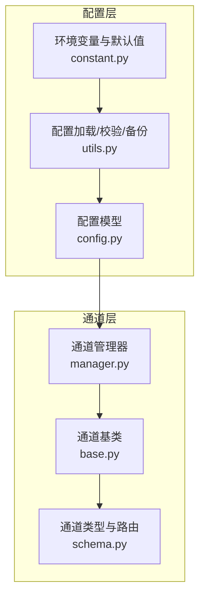
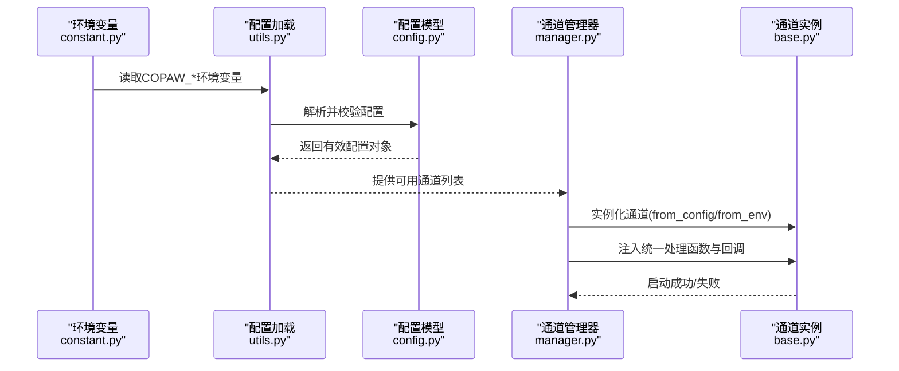
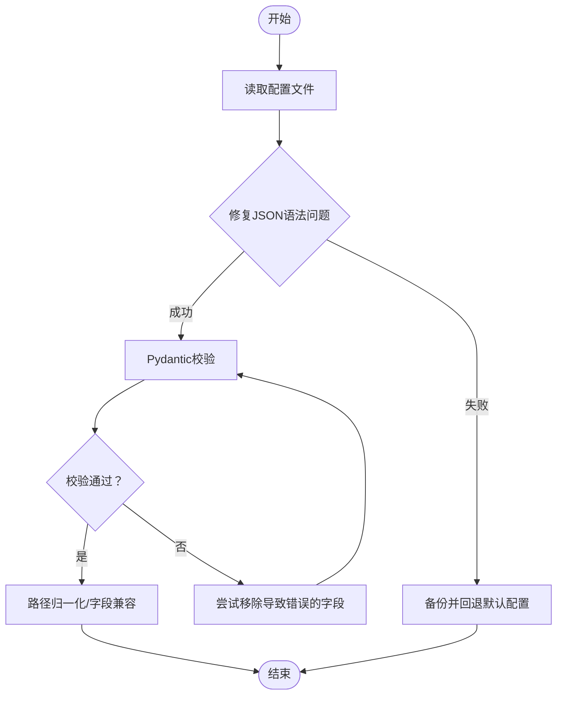
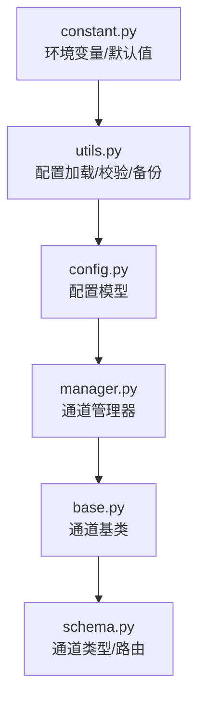

# 通道配置管理

<cite>
**本文引用的文件**
- [copaw/src/copaw/app/channels/base.py](file://copaw/src/copaw/app/channels/base.py)
- [copaw/src/copaw/app/channels/manager.py](file://copaw/src/copaw/app/channels/manager.py)
- [copaw/src/copaw/app/channels/schema.py](file://copaw/src/copaw/app/channels/schema.py)
- [copaw/src/copaw/config/config.py](file://copaw/src/copaw/config/config.py)
- [copaw/src/copaw/config/utils.py](file://copaw/src/copaw/config/utils.py)
- [copaw/src/copaw/constant.py](file://copaw/src/copaw/constant.py)
- [copaw/console/src/api/types/channel.ts](file://copaw/console/src/api/types/channel.ts)
- [copaw/console/src/pages/Control/Channels/components/constants.ts](file://copaw/console/src/pages/Control/Channels/components/constants.ts)
</cite>

## 目录
1. [简介](#简介)
2. [项目结构](#项目结构)
3. [核心组件](#核心组件)
4. [架构总览](#架构总览)
5. [详细组件分析](#详细组件分析)
6. [依赖分析](#依赖分析)
7. [性能考量](#性能考量)
8. [故障排查指南](#故障排查指南)
9. [结论](#结论)
10. [附录](#附录)

## 简介
本文件面向“通道配置管理”，系统化说明通道配置参数的结构、含义与来源，涵盖以下方面：
- 认证密钥、API端点、回调URL等关键参数
- 环境变量配置方式与配置文件格式
- 不同通道类型的配置示例与参数说明
- 动态配置更新与热重载机制
- 配置验证规则与错误处理策略
- 生产环境配置最佳实践与安全考虑
- 配置迁移指南与版本兼容性说明
- 配置优先级与覆盖规则

## 项目结构
通道配置管理由“配置模型（Pydantic）+ 加载工具 + 通道基类 + 管理器”构成，形成从配置到运行时通道实例的完整链路。

图表来源
- [copaw/src/copaw/config/config.py](file://copaw/src/copaw/config/config.py)
- [copaw/src/copaw/config/utils.py](file://copaw/src/copaw/config/utils.py)
- [copaw/src/copaw/constant.py](file://copaw/src/copaw/constant.py)
- [copaw/src/copaw/app/channels/base.py](file://copaw/src/copaw/app/channels/base.py)
- [copaw/src/copaw/app/channels/manager.py](file://copaw/src/copaw/app/channels/manager.py)
- [copaw/src/copaw/app/channels/schema.py](file://copaw/src/copaw/app/channels/schema.py)

章节来源
- [copaw/src/copaw/config/config.py](file://copaw/src/copaw/config/config.py)
- [copaw/src/copaw/config/utils.py](file://copaw/src/copaw/config/utils.py)
- [copaw/src/copaw/constant.py](file://copaw/src/copaw/constant.py)
- [copaw/src/copaw/app/channels/base.py](file://copaw/src/copaw/app/channels/base.py)
- [copaw/src/copaw/app/channels/manager.py](file://copaw/src/copaw/app/channels/manager.py)
- [copaw/src/copaw/app/channels/schema.py](file://copaw/src/copaw/app/channels/schema.py)

## 核心组件
- 配置模型：定义各通道的参数结构与默认值，支持启用开关、消息过滤、会话策略等通用字段。
- 配置加载工具：负责读取、修复、校验、回退与保存配置；支持路径归一化与字段兼容。
- 通道基类：统一消息处理流程、会话合并、去抖动、控制命令识别与渲染策略。
- 通道管理器：统一队列、批处理、优先级与替换流程，支持动态替换单通道实例。
- 通道类型与路由：定义内置通道类型标识、统一发送句柄转换协议。

章节来源
- [copaw/src/copaw/config/config.py](file://copaw/src/copaw/config/config.py)
- [copaw/src/copaw/config/utils.py](file://copaw/src/copaw/config/utils.py)
- [copaw/src/copaw/app/channels/base.py](file://copaw/src/copaw/app/channels/base.py)
- [copaw/src/copaw/app/channels/manager.py](file://copaw/src/copaw/app/channels/manager.py)
- [copaw/src/copaw/app/channels/schema.py](file://copaw/src/copaw/app/channels/schema.py)

## 架构总览
通道配置在启动阶段被加载并校验，随后由管理器按通道类型实例化具体通道，并注入统一的处理管线与队列系统。

图表来源
- [copaw/src/copaw/constant.py](file://copaw/src/copaw/constant.py)
- [copaw/src/copaw/config/utils.py](file://copaw/src/copaw/config/utils.py)
- [copaw/src/copaw/config/config.py](file://copaw/src/copaw/config/config.py)
- [copaw/src/copaw/app/channels/manager.py](file://copaw/src/copaw/app/channels/manager.py)
- [copaw/src/copaw/app/channels/base.py](file://copaw/src/copaw/app/channels/base.py)

## 详细组件分析

### 配置模型与参数结构
- 通用通道配置基类
  - enabled：是否启用该通道
  - bot_prefix：机器人前缀（影响消息发送）
  - filter_tool_messages/filter_thinking：过滤工具消息与思考内容
  - dm_policy/group_policy/allow_from/deny_message/require_mention：会话访问控制与提及要求
- 具体通道配置
  - Discord：bot_token、http_proxy、http_proxy_auth、accept_bot_messages
  - DingTalk：client_id、client_secret、message_type、card_template_id/key、robot_code、media_dir、card_auto_layout
  - Feishu/Lark：app_id、app_secret、encrypt_key、verification_token、media_dir、domain
  - QQ：app_id、client_secret、markdown_enabled、max_reconnect_attempts
  - Telegram：bot_token、http_proxy、http_proxy_auth、show_typing
  - MQTT：host、port、transport、clean_session、qos、username、password、subscribe_topic、publish_topic、tls_*相关
  - Mattermost：url、bot_token、media_dir、show_typing、thread_follow_without_mention
  - Console：enabled、media_dir
  - Matrix：homeserver、user_id、access_token
  - Voice（Twilio）：twilio_account_sid、twilio_auth_token、phone_number、phone_number_sid、tts_provider、tts_voice、stt_provider、language、welcome_greeting
  - WeCom：bot_id、secret、media_dir、welcome_text、max_reconnect_attempts
  - XiaoYi：ak、sk、agent_id、ws_url、task_timeout_ms
  - WeChat（iLink Bot）：bot_token、bot_token_file、base_url、media_dir

章节来源
- [copaw/src/copaw/config/config.py](file://copaw/src/copaw/config/config.py)

### 配置加载与校验
- 路径与默认值
  - 工作目录、配置文件名、心跳文件、聊天记录文件等通过环境变量与默认值确定。
- 文件读取与修复
  - 使用修复库自动修复常见JSON语法问题；对不可修复或校验失败的情况进行备份并回退默认配置。
- 字段兼容与归一化
  - 对旧版顶层字段进行兼容映射；对工作目录绑定的路径进行归一化处理。
- 通道可用性筛选
  - 支持通过环境变量白名单/黑名单限制启用的通道集合。

章节来源
- [copaw/src/copaw/constant.py](file://copaw/src/copaw/constant.py)
- [copaw/src/copaw/config/utils.py](file://copaw/src/copaw/config/utils.py)

### 通道基类与处理流程
- 统一消息处理
  - 将通道原生负载转换为统一请求，流式产出事件，支持SSE格式输出。
- 会话与去抖动
  - 基于会话ID合并快速消息；对纯媒体/语音输入进行去抖动合并。
- 控制命令与任务跟踪
  - 识别控制命令绕过队列直接响应；通过任务跟踪器支持取消与状态上报。
- 渲染与过滤
  - 根据配置决定是否显示工具细节、过滤思考内容、内部工具可见性等。

章节来源
- [copaw/src/copaw/app/channels/base.py](file://copaw/src/copaw/app/channels/base.py)

### 通道管理器与队列系统
- 实例化与注入
  - 从配置或环境变量创建通道实例；注入统一处理函数与回调。
- 统一队列与批处理
  - 按通道+会话+优先级路由；批量合并相同键的消息；超时保护与清理循环。
- 替换与停止
  - 支持动态替换单通道实例（新实例预启动后交换），保证平滑过渡。
- 发送接口
  - 提供按通道发送文本/事件的能力，并合并会话与用户ID等元信息。

章节来源
- [copaw/src/copaw/app/channels/manager.py](file://copaw/src/copaw/app/channels/manager.py)

### 通道类型与路由
- 内置通道类型标识集合
  - 包括 imessage、discord、dingtalk、feishu、qq、telegram、mqtt、console、voice、xiaoyi 等。
- 发送句柄转换协议
  - 定义统一的发送目标转换接口，便于跨通道一致化路由。

章节来源
- [copaw/src/copaw/app/channels/schema.py](file://copaw/src/copaw/app/channels/schema.py)

### 配置优先级与覆盖规则
- 环境变量优先
  - 工作目录、配置文件名、心跳文件、聊天记录文件、容器运行标记、CORS、LLM限流等均来自环境变量。
- 通道可用性控制
  - COPAW_ENABLED_CHANNELS 白名单优先；若设置则仅启用列出的通道；否则使用 COPAW_DISABLED_CHANNELS 黑名单排除。
- 通道配置覆盖
  - 管理器从配置中读取各通道配置，若为字典形式则以默认值为基础进行合并；最终以 enabled 字段决定是否实例化。

章节来源
- [copaw/src/copaw/constant.py](file://copaw/src/copaw/constant.py)
- [copaw/src/copaw/config/utils.py](file://copaw/src/copaw/config/utils.py)
- [copaw/src/copaw/app/channels/manager.py](file://copaw/src/copaw/app/channels/manager.py)

### 动态配置更新与热重载机制
- 管理器替换通道
  - 支持在运行时替换单个通道实例：先注入回调、预启动新实例，再在锁内交换并停止旧实例，避免中断服务。
- 队列与批处理
  - 通过统一队列管理器实现消息批处理与优先级调度，保障高吞吐场景下的稳定性。
- 配置回退
  - 配置损坏时自动备份并回退默认配置，降低停机风险。

章节来源
- [copaw/src/copaw/app/channels/manager.py](file://copaw/src/copaw/app/channels/manager.py)
- [copaw/src/copaw/config/utils.py](file://copaw/src/copaw/config/utils.py)

### 配置验证规则与错误处理策略
- 校验失败处理
  - 自动尝试移除导致错误的字段并再次校验；若仍失败则备份原始文件并回退默认配置。
- 编码与格式修复
  - 对非UTF-8编码与JSON语法问题进行修复；对顶层字段进行兼容映射。
- 运行期容错
  - 通道初始化失败时记录警告并跳过该通道，不影响其他通道启动。

章节来源
- [copaw/src/copaw/config/utils.py](file://copaw/src/copaw/config/utils.py)
- [copaw/src/copaw/app/channels/manager.py](file://copaw/src/copaw/app/channels/manager.py)

### 环境变量配置方式与配置文件格式
- 环境变量
  - 工作目录、配置文件名、心跳文件、聊天记录、日志级别、容器运行标记、CORS、LLM限流、内存压缩等。
- 配置文件
  - config.json 为主配置文件；通道配置位于根配置的 channels 字段下；支持额外键用于插件通道。
- 前端类型定义
  - 前端控制台对通道配置类型进行约束与展示，确保与后端模型保持一致。

章节来源
- [copaw/src/copaw/constant.py](file://copaw/src/copaw/constant.py)
- [copaw/src/copaw/config/config.py](file://copaw/src/copaw/config/config.py)
- [copaw/console/src/api/types/channel.ts](file://copaw/console/src/api/types/channel.ts)

### 不同通道类型的配置示例与参数说明
- Discord
  - 关键参数：bot_token、http_proxy、http_proxy_auth、accept_bot_messages
  - 用途：机器人令牌、HTTP代理、代理鉴权、是否接受机器人消息
- DingTalk
  - 关键参数：client_id、client_secret、message_type、card_template_id/key、robot_code、media_dir、card_auto_layout
  - 用途：应用凭证、卡片模板、机器人编码、媒体目录、自动布局
- Feishu/Lark
  - 关键参数：app_id、app_secret、encrypt_key、verification_token、media_dir、domain
  - 用途：应用凭证、加密密钥、验证令牌、媒体目录、域名选择
- QQ
  - 关键参数：app_id、client_secret、markdown_enabled、max_reconnect_attempts
  - 用途：应用凭证、Markdown支持、最大重连次数
- Telegram
  - 关键参数：bot_token、http_proxy、http_proxy_auth、show_typing
  - 用途：机器人令牌、HTTP代理、代理鉴权、输入状态显示
- MQTT
  - 关键参数：host、port、transport、clean_session、qos、username、password、subscribe_topic、publish_topic、tls_*相关
  - 用途：Broker地址、传输方式、会话清理、QoS、认证、订阅/发布主题、TLS证书
- Mattermost
  - 关键参数：url、bot_token、media_dir、show_typing、thread_follow_without_mention
  - 用途：服务地址、机器人令牌、媒体目录、输入状态、话题跟随策略
- Console
  - 关键参数：enabled、media_dir
  - 用途：启用控制台通道、媒体目录
- Matrix
  - 关键参数：homeserver、user_id、access_token
  - 用途： Homeserver地址、用户ID、访问令牌
- Voice（Twilio）
  - 关键参数：twilio_account_sid、twilio_auth_token、phone_number、phone_number_sid、tts_provider、tts_voice、stt_provider、language、welcome_greeting
  - 用途：Twilio账号、令牌、电话号码、TTS/STT提供商、语言、欢迎语
- WeCom
  - 关键参数：bot_id、secret、media_dir、welcome_text、max_reconnect_attempts
  - 用途：企业微信机器人ID、密钥、媒体目录、欢迎语、最大重连次数
- XiaoYi
  - 关键参数：ak、sk、agent_id、ws_url、task_timeout_ms
  - 用途：Access Key、Secret Key、平台Agent ID、WebSocket地址、任务超时
- WeChat（iLink Bot）
  - 关键参数：bot_token、bot_token_file、base_url、media_dir
  - 用途：Bearer令牌、令牌持久化文件、API基础URL、媒体目录

章节来源
- [copaw/src/copaw/config/config.py](file://copaw/src/copaw/config/config.py)

### 生产环境配置最佳实践与安全考虑
- 最小权限原则
  - 仅授予通道所需的最小权限；避免在配置中硬编码敏感信息。
- 密钥与令牌管理
  - 使用环境变量或密钥管理服务注入密钥；定期轮换；避免提交到版本库。
- 网络与代理
  - 明确HTTP代理与TLS配置；确保出口网络可达性与证书有效性。
- 会话与访问控制
  - 启用 allowlist 并设置 deny_message；群聊可要求提及；严格控制消息过滤策略。
- 可观测性与告警
  - 启用日志级别与必要的监控指标；对429/限流进行告警。
- 备份与回退
  - 配置损坏时自动备份并回退默认配置；保留历史备份以便审计。

章节来源
- [copaw/src/copaw/config/utils.py](file://copaw/src/copaw/config/utils.py)
- [copaw/src/copaw/constant.py](file://copaw/src/copaw/constant.py)

### 配置迁移指南与版本兼容性说明
- 字段兼容
  - 对顶层 last_api_host/port 进行向后兼容映射；对工作目录绑定路径进行归一化。
- 默认值与降级
  - 未设置字段采用默认值；校验失败自动回退默认配置并备份原始文件。
- 版本演进
  - 新增通道类型时，保持现有字段不变；通过 extra 键扩展插件通道配置。

章节来源
- [copaw/src/copaw/config/utils.py](file://copaw/src/copaw/config/utils.py)
- [copaw/src/copaw/config/config.py](file://copaw/src/copaw/config/config.py)

### 配置验证流程（算法）

图表来源
- [copaw/src/copaw/config/utils.py](file://copaw/src/copaw/config/utils.py)

## 依赖分析
通道配置管理的关键依赖关系如下：

图表来源
- [copaw/src/copaw/constant.py](file://copaw/src/copaw/constant.py)
- [copaw/src/copaw/config/utils.py](file://copaw/src/copaw/config/utils.py)
- [copaw/src/copaw/config/config.py](file://copaw/src/copaw/config/config.py)
- [copaw/src/copaw/app/channels/manager.py](file://copaw/src/copaw/app/channels/manager.py)
- [copaw/src/copaw/app/channels/base.py](file://copaw/src/copaw/app/channels/base.py)
- [copaw/src/copaw/app/channels/schema.py](file://copaw/src/copaw/app/channels/schema.py)

章节来源
- [copaw/src/copaw/constant.py](file://copaw/src/copaw/constant.py)
- [copaw/src/copaw/config/utils.py](file://copaw/src/copaw/config/utils.py)
- [copaw/src/copaw/config/config.py](file://copaw/src/copaw/config/config.py)
- [copaw/src/copaw/app/channels/manager.py](file://copaw/src/copaw/app/channels/manager.py)
- [copaw/src/copaw/app/channels/base.py](file://copaw/src/copaw/app/channels/base.py)
- [copaw/src/copaw/app/channels/schema.py](file://copaw/src/copaw/app/channels/schema.py)

## 性能考量
- 批量合并与去抖动
  - 通过统一队列与批处理减少重复请求；对纯媒体/语音输入进行去抖动合并，提升吞吐。
- 限流与并发
  - LLM全局并发、QPM与指数退避策略，防止上游限流与拥塞。
- 任务跟踪与取消
  - 通过任务跟踪器支持取消与状态上报，避免长时间阻塞。

章节来源
- [copaw/src/copaw/app/channels/base.py](file://copaw/src/copaw/app/channels/base.py)
- [copaw/src/copaw/app/channels/manager.py](file://copaw/src/copaw/app/channels/manager.py)
- [copaw/src/copaw/constant.py](file://copaw/src/copaw/constant.py)

## 故障排查指南
- 配置损坏
  - 观察日志中的“配置文件不可用/校验失败/修复失败”提示；检查备份文件定位问题。
- 通道无法启动
  - 查看通道初始化警告；确认凭证与网络连通性；检查白/黑名单设置。
- 限流与429
  - 调整 LLM_MAX_QPM、LLM_RATE_LIMIT_PAUSE 等环境变量；观察上游Retry-After头。
- 日志级别
  - 通过 COPAW_LOG_LEVEL 调整日志级别，便于定位问题。

章节来源
- [copaw/src/copaw/config/utils.py](file://copaw/src/copaw/config/utils.py)
- [copaw/src/copaw/app/channels/manager.py](file://copaw/src/copaw/app/channels/manager.py)
- [copaw/src/copaw/constant.py](file://copaw/src/copaw/constant.py)

## 结论
通道配置管理通过“强类型配置模型 + 健壮的加载与校验 + 统一的通道基类与管理器”，实现了对多通道的标准化接入与运行时治理。结合环境变量优先、白/黑名单控制、动态替换与自动回退机制，可在生产环境中实现高可靠与可维护性。

## 附录
- 前端通道类型定义与标签映射，确保控制台与后端配置一致。
  
章节来源
- [copaw/console/src/api/types/channel.ts](file://copaw/console/src/api/types/channel.ts)
- [copaw/console/src/pages/Control/Channels/components/constants.ts](file://copaw/console/src/pages/Control/Channels/components/constants.ts)