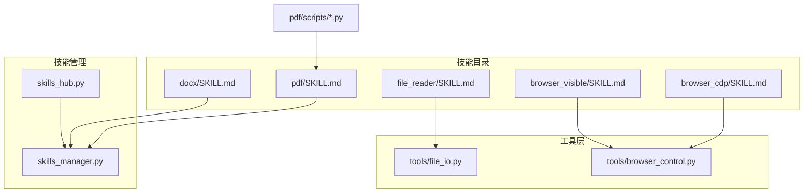
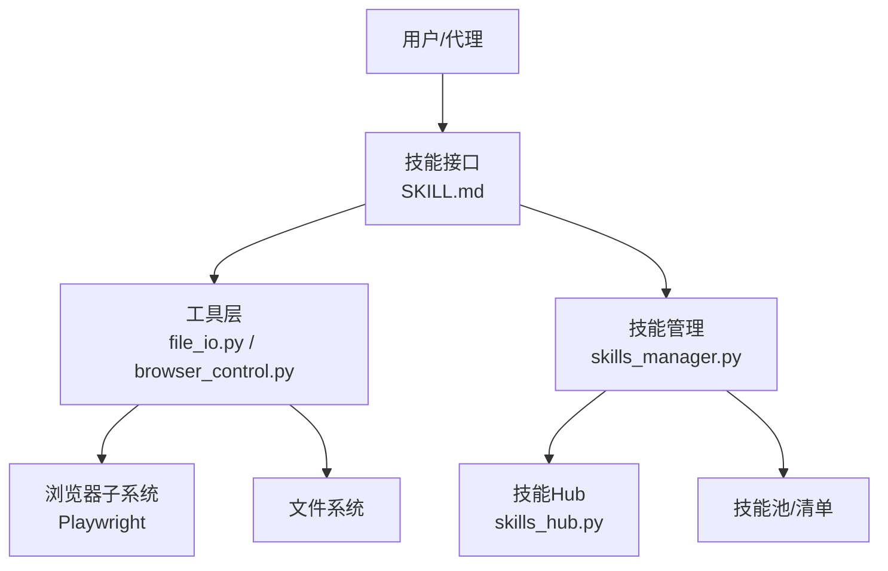
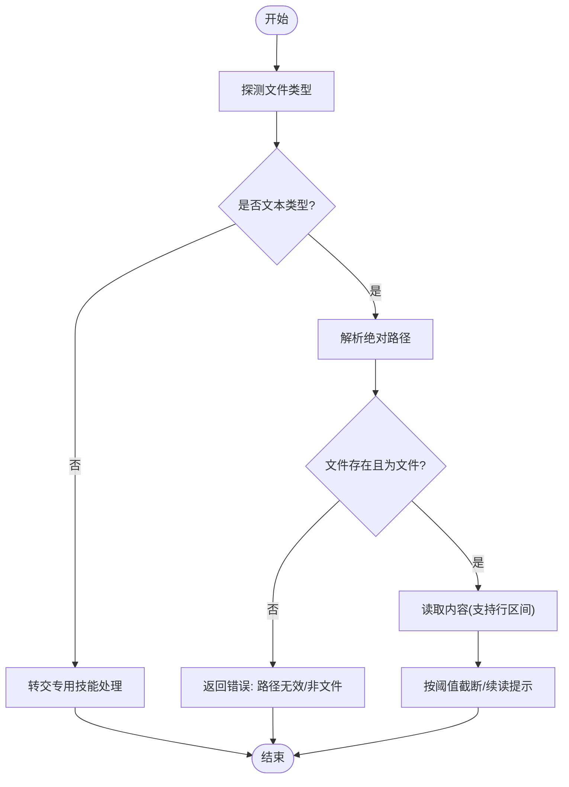
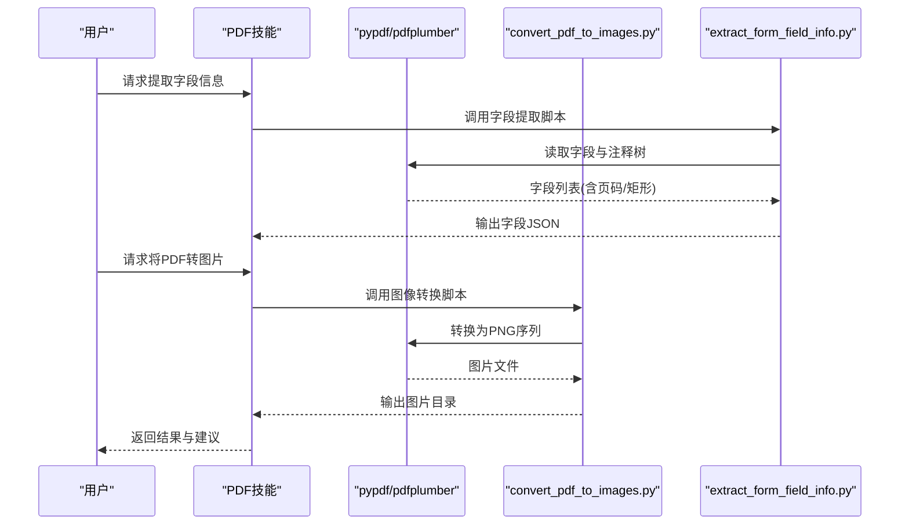
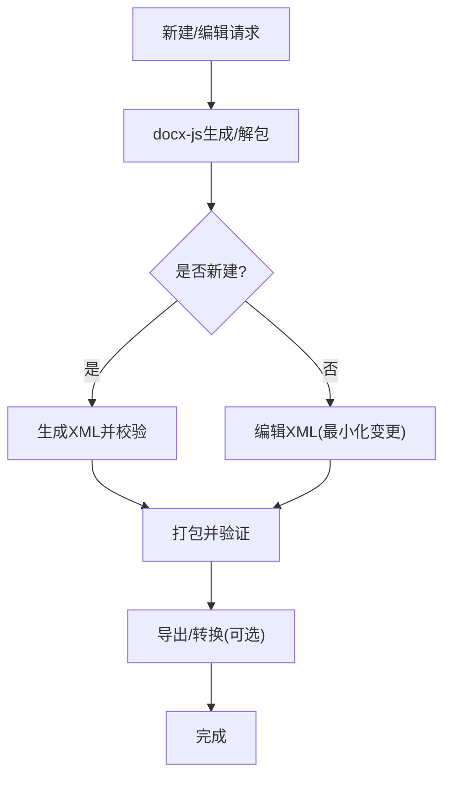
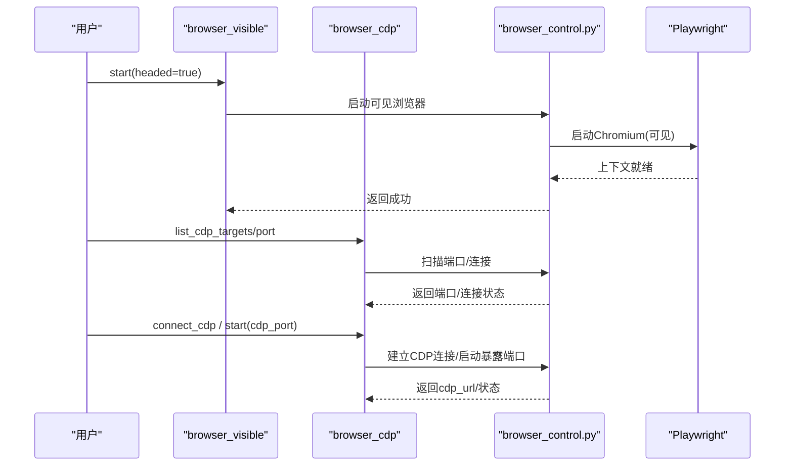
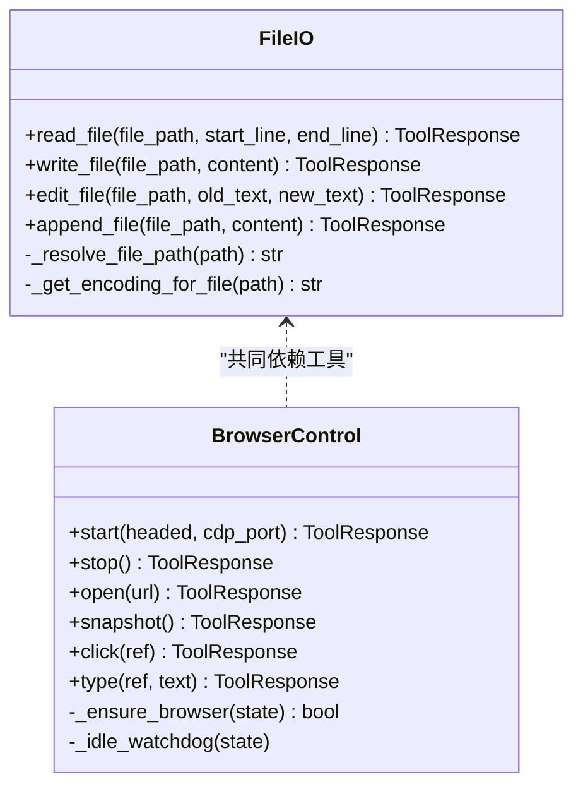
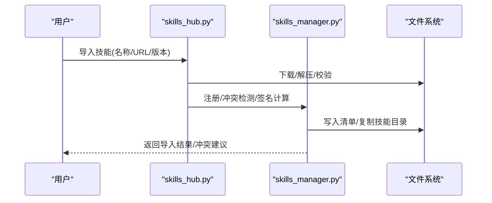
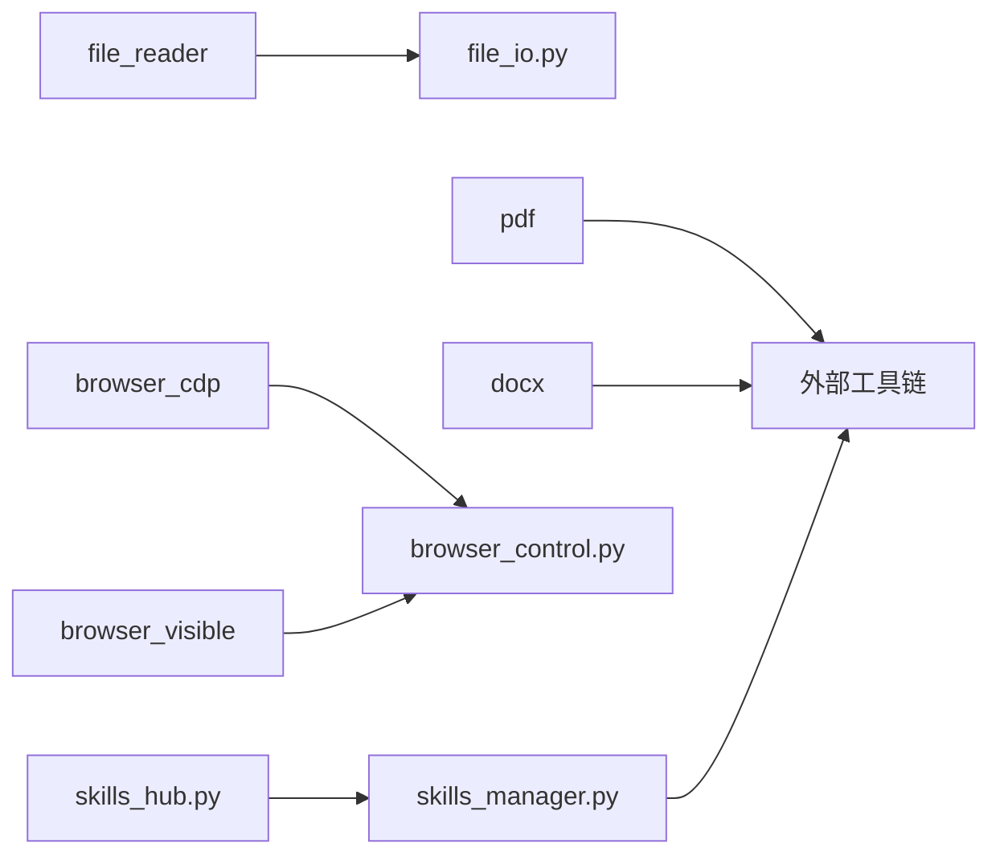

# 内置技能实现示例

<cite>
**本文引用的文件**
- [file_reader/SKILL.md](file://copaw/src/copaw/agents/skills/file_reader/SKILL.md)
- [pdf/SKILL.md](file://copaw/src/copaw/agents/skills/pdf/SKILL.md)
- [pdf/forms.md](file://copaw/src/copaw/agents/skills/pdf/forms.md)
- [pdf/reference.md](file://copaw/src/copaw/agents/skills/pdf/reference.md)
- [pdf/scripts/convert_pdf_to_images.py](file://copaw/src/copaw/agents/skills/pdf/scripts/convert_pdf_to_images.py)
- [pdf/scripts/extract_form_field_info.py](file://copaw/src/copaw/agents/skills/pdf/scripts/extract_form_field_info.py)
- [docx/SKILL.md](file://copaw/src/copaw/agents/skills/docx/SKILL.md)
- [browser_cdp/SKILL.md](file://copaw/src/copaw/agents/skills/browser_cdp/SKILL.md)
- [browser_visible/SKILL.md](file://copaw/src/copaw/agents/skills/browser_visible/SKILL.md)
- [file_io.py](file://copaw/src/copaw/agents/tools/file_io.py)
- [browser_control.py](file://copaw/src/copaw/agents/tools/browser_control.py)
- [skills_manager.py](file://copaw/src/copaw/agents/skills_manager.py)
- [skills_hub.py](file://copaw/src/copaw/agents/skills_hub.py)
</cite>

## 目录
1. [简介](#简介)
2. [项目结构](#项目结构)
3. [核心组件](#核心组件)
4. [架构总览](#架构总览)
5. [详细组件分析](#详细组件分析)
6. [依赖分析](#依赖分析)
7. [性能考虑](#性能考虑)
8. [故障排查指南](#故障排查指南)
9. [结论](#结论)
10. [附录](#附录)

## 简介
本文件面向CoPaw内置技能的实现与使用，聚焦于文件读取、PDF处理、文档解析、浏览器控制等核心能力。通过对技能文档、工具函数与浏览器自动化模块的深入分析，帮助读者理解技术实现细节、算法原理与性能优化策略，并提供参数配置、错误处理与边界条件处理的实践建议。同时，文档展示技能之间的依赖关系与协作模式，给出组合多个技能实现复杂功能的方法与扩展定制的最佳实践。

## 项目结构
CoPaw的内置技能主要位于agents/skills目录下，每个技能以独立目录组织，包含技能说明文档（SKILL.md）以及可选的脚本与参考材料。工具层位于agents/tools，提供通用能力（如文件I/O、浏览器控制）。技能管理与分发位于agents/skills_manager.py与agents/skills_hub.py，负责技能清单、签名校验、导入与冲突处理等。

图表来源
- [file_reader/SKILL.md:1-63](file://copaw/src/copaw/agents/skills/file_reader/SKILL.md#L1-L63)
- [pdf/SKILL.md:1-329](file://copaw/src/copaw/agents/skills/pdf/SKILL.md#L1-L329)
- [docx/SKILL.md:1-487](file://copaw/src/copaw/agents/skills/docx/SKILL.md#L1-L487)
- [browser_cdp/SKILL.md:1-186](file://copaw/src/copaw/agents/skills/browser_cdp/SKILL.md#L1-L186)
- [browser_visible/SKILL.md:1-53](file://copaw/src/copaw/agents/skills/browser_visible/SKILL.md#L1-L53)
- [file_io.py:1-396](file://copaw/src/copaw/agents/tools/file_io.py#L1-L396)
- [browser_control.py:1-800](file://copaw/src/copaw/agents/tools/browser_control.py#L1-L800)
- [skills_manager.py:1-800](file://copaw/src/copaw/agents/skills_manager.py#L1-L800)
- [skills_hub.py:1-800](file://copaw/src/copaw/agents/skills_hub.py#L1-L800)

章节来源
- [file_reader/SKILL.md:1-63](file://copaw/src/copaw/agents/skills/file_reader/SKILL.md#L1-L63)
- [pdf/SKILL.md:1-329](file://copaw/src/copaw/agents/skills/pdf/SKILL.md#L1-L329)
- [docx/SKILL.md:1-487](file://copaw/src/copaw/agents/skills/docx/SKILL.md#L1-L487)
- [browser_cdp/SKILL.md:1-186](file://copaw/src/copaw/agents/skills/browser_cdp/SKILL.md#L1-L186)
- [browser_visible/SKILL.md:1-53](file://copaw/src/copaw/agents/skills/browser_visible/SKILL.md#L1-L53)
- [file_io.py:1-396](file://copaw/src/copaw/agents/tools/file_io.py#L1-L396)
- [browser_control.py:1-800](file://copaw/src/copaw/agents/tools/browser_control.py#L1-L800)
- [skills_manager.py:1-800](file://copaw/src/copaw/agents/skills_manager.py#L1-L800)
- [skills_hub.py:1-800](file://copaw/src/copaw/agents/skills_hub.py#L1-L800)

## 核心组件
- 文件读取技能：面向文本类文件的安全读取与摘要，强调类型探测、大文件节流与最小必要输出。
- PDF处理技能：覆盖合并、拆分、旋转、提取文本/表格、创建PDF、命令行工具链、表单字段提取与注释填充等。
- 文档处理技能（docx）：基于docx-js与LibreOffice的文档生成、编辑、转换与验证流程。
- 浏览器控制技能：支持可见窗口、CDP连接、扫描端口、缓存清理与会话持久化。
- 工具层：统一的文件I/O封装（路径解析、编码策略、截断输出、行区间读取）、浏览器自动化（Playwright驱动、上下文监听、空闲回收、跨平台兼容）。
- 技能管理：内置技能签名、池化同步、冲突检测、环境变量注入、Hub导入与版本化分发。

章节来源
- [file_reader/SKILL.md:14-63](file://copaw/src/copaw/agents/skills/file_reader/SKILL.md#L14-L63)
- [pdf/SKILL.md:14-329](file://copaw/src/copaw/agents/skills/pdf/SKILL.md#L14-L329)
- [docx/SKILL.md:14-487](file://copaw/src/copaw/agents/skills/docx/SKILL.md#L14-L487)
- [browser_cdp/SKILL.md:15-186](file://copaw/src/copaw/agents/skills/browser_cdp/SKILL.md#L15-L186)
- [browser_visible/SKILL.md:15-53](file://copaw/src/copaw/agents/skills/browser_visible/SKILL.md#L15-L53)
- [file_io.py:66-396](file://copaw/src/copaw/agents/tools/file_io.py#L66-L396)
- [browser_control.py:487-800](file://copaw/src/copaw/agents/tools/browser_control.py#L487-L800)
- [skills_manager.py:116-800](file://copaw/src/copaw/agents/skills_manager.py#L116-L800)
- [skills_hub.py:25-800](file://copaw/src/copaw/agents/skills_hub.py#L25-L800)

## 架构总览
CoPaw内置技能通过“技能文档 + 工具函数 + 浏览器自动化 + 技能管理”的分层设计实现。技能文档定义行为边界与使用方式；工具层提供跨平台、跨格式的底层能力；浏览器控制模块抽象Playwright生态；技能管理负责签名、冲突与分发。

图表来源
- [file_io.py:1-396](file://copaw/src/copaw/agents/tools/file_io.py#L1-L396)
- [browser_control.py:1-800](file://copaw/src/copaw/agents/tools/browser_control.py#L1-L800)
- [skills_manager.py:1-800](file://copaw/src/copaw/agents/skills_manager.py#L1-L800)
- [skills_hub.py:1-800](file://copaw/src/copaw/agents/skills_hub.py#L1-L800)

## 详细组件分析

### 文件读取技能（file_reader）
- 设计目标：仅处理文本类文件，避免将非文本内容交由该技能处理；优先使用read_file；对大文件采用尾窗与摘要策略。
- 关键点
  - 类型探测：建议使用命令行工具进行MIME类型判断，避免误判。
  - 编码策略：针对CSV/TSV/TXT/LOG等文件采用带BOM的UTF-8以提升Windows兼容性；其他文件采用UTF-8。
  - 截断与续读：根据最大字节数阈值进行智能截断，并在消息压缩时保留起始行信息以便续读。
  - 错误处理：路径不存在、非文件、越界行号、异常读取均返回明确错误信息。
- 使用建议
  - 明确区分“文本文件”与“非文本文件”，非文本文件交由对应专用技能。
  - 对超大日志文件采用尾窗读取，结合摘要策略定位关键错误/警告。

图表来源
- [file_reader/SKILL.md:18-63](file://copaw/src/copaw/agents/skills/file_reader/SKILL.md#L18-L63)
- [file_io.py:23-206](file://copaw/src/copaw/agents/tools/file_io.py#L23-L206)

章节来源
- [file_reader/SKILL.md:14-63](file://copaw/src/copaw/agents/skills/file_reader/SKILL.md#L14-L63)
- [file_io.py:66-206](file://copaw/src/copaw/agents/tools/file_io.py#L66-L206)

### PDF处理技能（pdf）
- 能力矩阵
  - 基础操作：合并、拆分、元数据读取、页面旋转。
  - 文本与表格：pdfplumber提取文本与表格，支持布局与坐标信息。
  - 文档生成：reportlab创建PDF，Canvas/Platypus两种方式。
  - 命令行工具：pdftotext/qpdf/pdftoppm等，覆盖OCR、水印、加密/解密、图片提取等。
  - 表单处理：字段信息提取、注释填充、结构化坐标与可视化估计相结合的混合方案。
- 算法与实现要点
  - 字段识别：遍历字段树与注释树，构建字段ID链，定位页面与矩形框，排序后输出。
  - 图像转换：基于pdf2image，支持缩放与批量导出PNG。
  - 坐标一致性：结构化坐标与图像坐标之间进行换算，确保注释位置准确。
- 性能优化
  - 大文件分块处理、流式读取、命令行工具优先于纯Python库。
  - 使用低分辨率预览、高分辨率最终输出的策略降低内存压力。
- 使用建议
  - 先检查可填写字段，再决定使用结构化坐标还是注释填充。
  - 填充前务必校验边界框，避免重叠与过小导致的渲染问题。

图表来源
- [pdf/SKILL.md:14-329](file://copaw/src/copaw/agents/skills/pdf/SKILL.md#L14-L329)
- [pdf/forms.md:7-80](file://copaw/src/copaw/agents/skills/pdf/forms.md#L7-L80)
- [pdf/scripts/convert_pdf_to_images.py:9-34](file://copaw/src/copaw/agents/skills/pdf/scripts/convert_pdf_to_images.py#L9-L34)
- [pdf/scripts/extract_form_field_info.py:47-107](file://copaw/src/copaw/agents/skills/pdf/scripts/extract_form_field_info.py#L47-L107)

章节来源
- [pdf/SKILL.md:14-329](file://copaw/src/copaw/agents/skills/pdf/SKILL.md#L14-L329)
- [pdf/forms.md:1-299](file://copaw/src/copaw/agents/skills/pdf/forms.md#L1-L299)
- [pdf/reference.md:1-612](file://copaw/src/copaw/agents/skills/pdf/reference.md#L1-L612)
- [pdf/scripts/convert_pdf_to_images.py:1-34](file://copaw/src/copaw/agents/skills/pdf/scripts/convert_pdf_to_images.py#L1-L34)
- [pdf/scripts/extract_form_field_info.py:1-123](file://copaw/src/copaw/agents/skills/pdf/scripts/extract_form_field_info.py#L1-L123)

### 文档处理技能（docx）
- 能力矩阵
  - 新建文档：使用docx-js生成，完成后进行XML校验与打包。
  - 编辑现有文档：解包ZIP、编辑XML、修复与压缩、重新打包。
  - 转换与导出：pandoc提取文本、LibreOffice转换与PDF导出、pdftoppm图像化。
  - 注释与修订：comment.py辅助添加评论，遵循XML规范与最小化编辑原则。
- 关键规则
  - 页面尺寸与方向：显式设置宽度/高度与边距，避免默认A4带来的差异。
  - 列表与编号：使用标准编号配置，避免Unicode符号与百分比宽度。
  - 表格：同时设置表格宽度与单元格宽度，使用CLEAR着色避免黑底。
  - 图片：必须声明类型，提供替代文本，确保关系与内容类型正确。
- 使用建议
  - 先生成后校验，失败时解包修复再重打包。
  - TOC与标题样式严格使用HeadingLevel，避免自定义样式破坏目录结构。

图表来源
- [docx/SKILL.md:70-487](file://copaw/src/copaw/agents/skills/docx/SKILL.md#L70-L487)

章节来源
- [docx/SKILL.md:14-487](file://copaw/src/copaw/agents/skills/docx/SKILL.md#L14-L487)

### 浏览器控制技能（browser_cdp / browser_visible）
- 可见浏览器（browser_visible）
  - 通过headed参数启动真实窗口，便于演示与调试；与默认无头模式互斥。
  - 支持open/snapshot/click/type等常规操作，结束后可stop关闭。
- CDP连接（browser_cdp）
  - 支持扫描本地端口、连接已有Chrome、启动暴露CDP端口的浏览器。
  - 强调隐私风险：CDP模式会暴露历史、Cookies与页面内容，需用户知情同意。
  - 单实例限制：同一工作区同时只能运行或连接一个浏览器。
- 工具层能力
  - Playwright驱动：自动选择系统默认浏览器或容器内Chromium，支持持久化上下文与用户数据目录。
  - 空闲回收：超过阈值无活动自动停止，释放渲染进程。
  - 平台适配：Windows/Uvicorn热重载下的同步模式、macOS无Chromium时回退WebKit。

图表来源
- [browser_visible/SKILL.md:15-53](file://copaw/src/copaw/agents/skills/browser_visible/SKILL.md#L15-L53)
- [browser_cdp/SKILL.md:15-186](file://copaw/src/copaw/agents/skills/browser_cdp/SKILL.md#L15-L186)
- [browser_control.py:487-800](file://copaw/src/copaw/agents/tools/browser_control.py#L487-L800)

章节来源
- [browser_visible/SKILL.md:15-53](file://copaw/src/copaw/agents/skills/browser_visible/SKILL.md#L15-L53)
- [browser_cdp/SKILL.md:15-186](file://copaw/src/copaw/agents/skills/browser_cdp/SKILL.md#L15-L186)
- [browser_control.py:1-800](file://copaw/src/copaw/agents/tools/browser_control.py#L1-L800)

### 工具层：文件I/O与浏览器控制
- 文件I/O
  - 路径解析：优先使用当前工作区目录，支持相对路径与~展开。
  - 编码策略：按文件类型选择UTF-8或带BOM的UTF-8-BOM，提升跨平台兼容性。
  - 截断输出：根据最近最大字节数阈值进行截断，并在消息压缩时保留续读提示。
  - 行区间读取：支持start_line/end_line，自动校验越界与顺序。
- 浏览器控制
  - 状态管理：每工作区维护浏览器状态字典，支持headless/visible、CDP连接、上下文监听。
  - 空闲回收：定时任务检测空闲并停止，释放资源。
  - 平台适配：容器环境禁用沙箱、Windows热重载使用同步模式、macOS无Chromium回退WebKit。

图表来源
- [file_io.py:66-396](file://copaw/src/copaw/agents/tools/file_io.py#L66-L396)
- [browser_control.py:487-800](file://copaw/src/copaw/agents/tools/browser_control.py#L487-L800)

章节来源
- [file_io.py:1-396](file://copaw/src/copaw/agents/tools/file_io.py#L1-L396)
- [browser_control.py:1-800](file://copaw/src/copaw/agents/tools/browser_control.py#L1-L800)

### 技能管理与分发（skills_manager / skills_hub）
- 技能管理
  - 内置技能签名：对内置技能目录进行一次性签名缓存，用于冲突检测与池化同步。
  - 池化与清单：维护共享技能池与工作区技能清单，支持builtin/customized分类。
  - 环境注入：根据metadata.requires.env将配置映射为环境变量，支持作用域隔离。
- 技能Hub
  - 分布式导入：从ClawHub/Skills.sh等源拉取技能包，支持版本化与文件过滤。
  - 安全扫描：导入前对技能目录进行安全扫描，避免危险内容进入工作区。
  - 取消与重试：支持取消检查器与指数退避重试，提升网络不稳定场景的鲁棒性。

图表来源
- [skills_hub.py:283-629](file://copaw/src/copaw/agents/skills_hub.py#L283-L629)
- [skills_manager.py:116-400](file://copaw/src/copaw/agents/skills_manager.py#L116-L400)

章节来源
- [skills_hub.py:1-800](file://copaw/src/copaw/agents/skills_hub.py#L1-L800)
- [skills_manager.py:1-800](file://copaw/src/copaw/agents/skills_manager.py#L1-L800)

## 依赖分析
- 技能间耦合
  - file_reader与file_io：前者约束输入类型，后者提供安全读取与截断输出。
  - pdf与docx依赖外部工具链（pypdf/pdfplumber/reportlab/LibreOffice/pandoc等），形成强耦合但职责清晰。
  - browser_cdp/browser_visible依赖browser_control，后者封装Playwright生命周期与平台差异。
- 外部依赖
  - PDF：pypdf、pdfplumber、reportlab、poppler-utils、qpdf、pytesseract等。
  - 文档：docx-js、LibreOffice、pandoc、pdf2image。
  - 浏览器：Playwright（async/sync双栈）、系统默认浏览器回退。
- 循环依赖
  - 未发现循环依赖；技能与工具分层清晰，Hub与管理器通过清单与签名间接交互。

图表来源
- [file_io.py:1-396](file://copaw/src/copaw/agents/tools/file_io.py#L1-L396)
- [browser_control.py:1-800](file://copaw/src/copaw/agents/tools/browser_control.py#L1-L800)
- [skills_manager.py:1-800](file://copaw/src/copaw/agents/skills_manager.py#L1-L800)
- [skills_hub.py:1-800](file://copaw/src/copaw/agents/skills_hub.py#L1-L800)

章节来源
- [file_io.py:1-396](file://copaw/src/copaw/agents/tools/file_io.py#L1-L396)
- [browser_control.py:1-800](file://copaw/src/copaw/agents/tools/browser_control.py#L1-L800)
- [skills_manager.py:1-800](file://copaw/src/copaw/agents/skills_manager.py#L1-L800)
- [skills_hub.py:1-800](file://copaw/src/copaw/agents/skills_hub.py#L1-L800)

## 性能考虑
- 文件读取
  - 大文件采用行区间与截断输出，避免一次性加载；对日志文件使用尾窗策略。
  - 编码选择兼顾跨平台兼容与性能（BOM仅对特定类型必要）。
- PDF处理
  - 优先使用命令行工具（pdftotext/pdfimages/qpdf）进行快速提取与转换。
  - 结构化坐标优先于视觉估计，减少图像处理成本；图像坐标与PDF坐标换算时避免重复缩放。
  - 分块处理与流式写入，避免内存峰值。
- 文档处理
  - 新建阶段先生成再校验，失败时解包修复；避免多次打包/解包。
  - 表格与图片的宽度/边距设置一次到位，减少渲染重排。
- 浏览器控制
  - 空闲回收降低资源占用；容器环境禁用沙箱与共享内存限制。
  - Windows热重载场景使用同步模式，避免异步子进程问题。

## 故障排查指南
- 文件读取
  - 路径错误：检查相对路径解析与工作区目录；确认文件存在且为文件。
  - 行区间越界：start_line/end_line必须为整数且满足start<=end。
  - 截断提示：根据提示使用续读参数逐步获取全文。
- PDF处理
  - 字段缺失：确认PDF确实包含可填写字段；使用脚本提取字段信息核对。
  - 坐标不匹配：结构化坐标与图像坐标混用时进行正确换算；先校验边界框。
  - OCR失败：检查图像质量与tesseract安装；尝试更高分辨率。
- 文档处理
  - XML校验失败：解包后修复最小必要变更，重新打包；关注rsid、空白保留等细节。
  - 图片/表格显示异常：检查宽度/边距/着色类型；避免百分比宽度。
- 浏览器控制
  - CDP连接丢失：按提示重新connect_cdp；确认端口未被占用。
  - 可见窗口不可用：服务器缺少图形环境；改用无头模式或本地开发环境。
  - 空闲回收：若长时间无操作被停止，重新启动浏览器并重建上下文。

章节来源
- [file_reader/SKILL.md:58-63](file://copaw/src/copaw/agents/skills/file_reader/SKILL.md#L58-L63)
- [pdf/forms.md:274-299](file://copaw/src/copaw/agents/skills/pdf/forms.md#L274-L299)
- [docx/SKILL.md:354-487](file://copaw/src/copaw/agents/skills/docx/SKILL.md#L354-L487)
- [browser_cdp/SKILL.md:165-186](file://copaw/src/copaw/agents/skills/browser_cdp/SKILL.md#L165-L186)
- [browser_visible/SKILL.md:50-53](file://copaw/src/copaw/agents/skills/browser_visible/SKILL.md#L50-L53)

## 结论
CoPaw内置技能通过清晰的职责划分与强大的工具层支撑，实现了从文件读取、PDF/文档处理到浏览器控制的全栈能力。技能文档明确了边界与最佳实践，工具层提供了跨平台与性能优化的实现细节，技能管理与Hub保障了可扩展与安全性。通过合理组合这些技能，可以高效完成复杂任务；同时，遵循错误处理与边界条件策略，能够显著提升稳定性与用户体验。

## 附录
- 扩展与定制最佳实践
  - 保持单一职责：新增技能尽量围绕特定格式或任务，避免“万能技能”。
  - 文档先行：先完善SKILL.md，再实现工具与脚本，确保行为一致与可测试。
  - 依赖最小化：优先使用命令行工具与轻量库，减少Python生态复杂度。
  - 安全优先：对导入的第三方技能进行安全扫描，严格控制环境变量注入。
  - 可观测性：为关键步骤添加日志与指标，便于问题定位与性能分析。