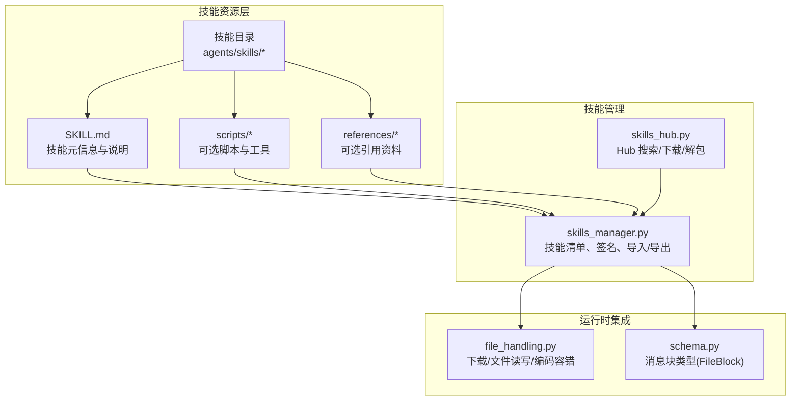
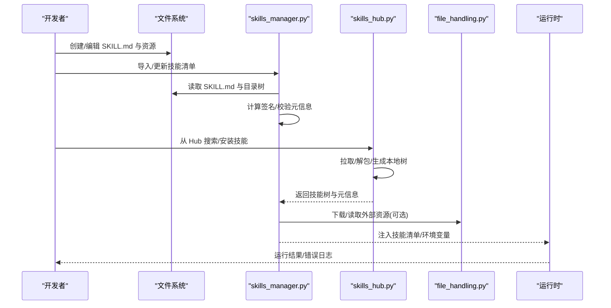
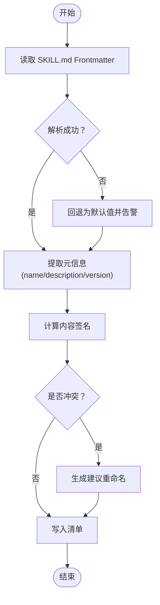
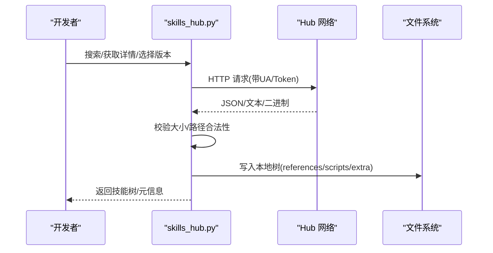
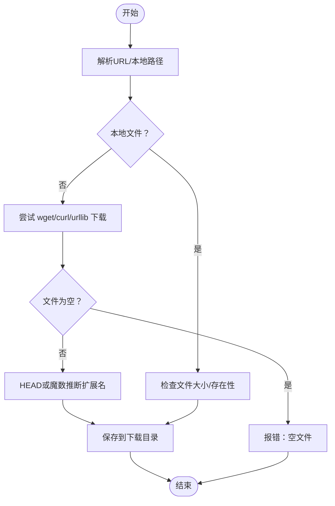
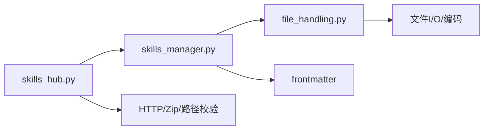

# 开发模板指南

<cite>
**本文引用的文件**
- [skills_hub.py](file://copaw/src/copaw/agents/skills_hub.py)
- [skills_manager.py](file://copaw/src/copaw/agents/skills_manager.py)
- [file_handling.py](file://copaw/src/copaw/agents/utils/file_handling.py)
- [schema.py](file://copaw/src/copaw/agents/schema.py)
- [copaw_source_index/SKILL.md](file://copaw/src/copaw/agents/skills/copaw_source_index/SKILL.md)
- [pdf/SKILL.md](file://copaw/src/copaw/agents/skills/pdf/SKILL.md)
- [docx/SKILL.md](file://copaw/src/copaw/agents/skills/docx/SKILL.md)
- [skill-template.md](file://samples/03-debug-refactor/skill-template.md)
</cite>

## 目录
1. [简介](#简介)
2. [项目结构](#项目结构)
3. [核心组件](#核心组件)
4. [架构总览](#架构总览)
5. [详细组件分析](#详细组件分析)
6. [依赖分析](#依赖分析)
7. [性能考虑](#性能考虑)
8. [故障排查指南](#故障排查指南)
9. [结论](#结论)
10. [附录](#附录)

## 简介
本指南面向“技能开发模板”的标准化落地，围绕 CoPaw 技能体系提供从目录结构、文件命名、模板样例到参数校验、输入输出规范、异常处理模式的完整开发流程。同时给出开发工具链配置建议（IDE、格式化、静态分析、测试）、环境搭建步骤、调试技巧与常见问题解决方案，帮助开发者快速构建高质量、可复用、可共享的技能。

## 项目结构
CoPaw 的技能开发主要位于 agents 子模块中，技能资源以“技能目录 + SKILL.md”为核心，配合技能池与 Hub 的导入/解析能力，形成“本地技能目录 → 技能清单 → 运行时注入”的闭环。

图示来源
- [skills_manager.py:116-145](file://copaw/src/copaw/agents/skills_manager.py#L116-L145)
- [skills_hub.py:546-691](file://copaw/src/copaw/agents/skills_hub.py#L546-L691)
- [file_handling.py:27-99](file://copaw/src/copaw/agents/utils/file_handling.py#L27-L99)
- [schema.py:11-22](file://copaw/src/copaw/agents/schema.py#L11-L22)

章节来源
- [skills_manager.py:116-145](file://copaw/src/copaw/agents/skills_manager.py#L116-L145)
- [skills_hub.py:546-691](file://copaw/src/copaw/agents/skills_hub.py#L546-L691)
- [file_handling.py:27-99](file://copaw/src/copaw/agents/utils/file_handling.py#L27-L99)
- [schema.py:11-22](file://copaw/src/copaw/agents/schema.py#L11-L22)

## 核心组件
- 技能清单与签名
  - 通过技能目录内的 SKILL.md 提取元信息，计算内容签名，用于冲突检测与同步一致性。
- 技能池与工作区
  - 统一管理技能清单（pool 与 workspace），支持内置技能槽位与自定义覆盖。
- Hub 导入与解包
  - 支持从 Hub 搜索、拉取版本、解压并生成本地技能树。
- 文件下载与编码容错
  - 跨平台编码兼容、多种下载方式回退、扩展名推断与安全路径校验。
- 消息块类型
  - 统一文件块类型定义，便于在消息中传递文件来源（URL/Base64）与文件名。

章节来源
- [skills_manager.py:62-78](file://copaw/src/copaw/agents/skills_manager.py#L62-L78)
- [skills_manager.py:270-287](file://copaw/src/copaw/agents/skills_manager.py#L270-L287)
- [skills_manager.py:121-145](file://copaw/src/copaw/agents/skills_manager.py#L121-L145)
- [skills_hub.py:546-691](file://copaw/src/copaw/agents/skills_hub.py#L546-L691)
- [file_handling.py:27-99](file://copaw/src/copaw/agents/utils/file_handling.py#L27-L99)
- [schema.py:11-22](file://copaw/src/copaw/agents/schema.py#L11-L22)

## 架构总览
技能开发与运行时的关键交互如下：

图示来源
- [skills_manager.py:203-243](file://copaw/src/copaw/agents/skills_manager.py#L203-L243)
- [skills_manager.py:270-287](file://copaw/src/copaw/agents/skills_manager.py#L270-L287)
- [skills_hub.py:546-691](file://copaw/src/copaw/agents/skills_hub.py#L546-L691)
- [file_handling.py:27-99](file://copaw/src/copaw/agents/utils/file_handling.py#L27-L99)

## 详细组件分析

### 技能清单与签名（skills_manager.py）
- 目录与清单
  - 工作区技能目录优先使用 skills，兼容旧版 skill；技能池目录固定为 skill_pool。
  - 清单 schema 版本与字段由默认清单函数统一维护。
- 元信息提取
  - 从 SKILL.md frontmatter 中读取 name/description/version 等，失败时回退并记录警告。
- 内容签名
  - 基于真实文件路径与内容的 SHA256，忽略缓存与系统无关文件，保证跨平台一致性。
- 冲突与重命名
  - 发生同名冲突时，基于时间戳生成建议名，避免覆盖。
- 环境变量注入
  - 将技能配置按需注入环境变量，支持受控并发与释放。

图示来源
- [skills_manager.py:203-243](file://copaw/src/copaw/agents/skills_manager.py#L203-L243)
- [skills_manager.py:270-287](file://copaw/src/copaw/agents/skills_manager.py#L270-L287)
- [skills_manager.py:733-754](file://copaw/src/copaw/agents/skills_manager.py#L733-L754)

章节来源
- [skills_manager.py:116-145](file://copaw/src/copaw/agents/skills_manager.py#L116-L145)
- [skills_manager.py:203-243](file://copaw/src/copaw/agents/skills_manager.py#L203-L243)
- [skills_manager.py:270-287](file://copaw/src/copaw/agents/skills_manager.py#L270-L287)
- [skills_manager.py:733-754](file://copaw/src/copaw/agents/skills_manager.py#L733-L754)

### Hub 导入与解包（skills_hub.py）
- 搜索/详情/版本/文件路径
  - 支持通过环境变量定制 Hub 基础地址与各接口路径。
- 请求与重试
  - 超时、重试次数、指数回退策略；对 403/429/5xx 等状态进行分类处理与用户提示。
- 取消检查
  - 通过上下文变量支持用户取消导入任务。
- 解包与树生成
  - 将 Hub 返回的文件列表转换为本地目录树，过滤非法路径，保留 references/scripts 与额外文件。
- 错误提取
  - 从响应体中提取错误消息，提升用户体验。

图示来源
- [skills_hub.py:188-217](file://copaw/src/copaw/agents/skills_hub.py#L188-L217)
- [skills_hub.py:283-393](file://copaw/src/copaw/agents/skills_hub.py#L283-L393)
- [skills_hub.py:475-506](file://copaw/src/copaw/agents/skills_hub.py#L475-L506)
- [skills_hub.py:631-691](file://copaw/src/copaw/agents/skills_hub.py#L631-L691)

章节来源
- [skills_hub.py:188-217](file://copaw/src/copaw/agents/skills_hub.py#L188-L217)
- [skills_hub.py:283-393](file://copaw/src/copaw/agents/skills_hub.py#L283-L393)
- [skills_hub.py:475-506](file://copaw/src/copaw/agents/skills_hub.py#L475-L506)
- [skills_hub.py:631-691](file://copaw/src/copaw/agents/skills_hub.py#L631-L691)

### 文件下载与编码容错（file_handling.py）
- 编码容错
  - 尝试 UTF-8-SIG、UTF-8、GBK、CP1252 等编码，最后以替换模式兜底。
- 下载回退
  - 优先 wget/curl，失败回退 urllib；超时与失败均记录日志并抛出异常。
- 本地路径解析
  - 支持 file:// 与绝对/相对路径，空文件与不存在文件均报错。
- 扩展名推断
  - HEAD 获取 Content-Type，或根据魔数推断 .pdf/.zip/.png 等扩展名。

图示来源
- [file_handling.py:107-137](file://copaw/src/copaw/agents/utils/file_handling.py#L107-L137)
- [file_handling.py:140-177](file://copaw/src/copaw/agents/utils/file_handling.py#L140-L177)
- [file_handling.py:180-227](file://copaw/src/copaw/agents/utils/file_handling.py#L180-L227)
- [file_handling.py:271-337](file://copaw/src/copaw/agents/utils/file_handling.py#L271-L337)

章节来源
- [file_handling.py:27-99](file://copaw/src/copaw/agents/utils/file_handling.py#L27-L99)
- [file_handling.py:107-137](file://copaw/src/copaw/agents/utils/file_handling.py#L107-L137)
- [file_handling.py:140-177](file://copaw/src/copaw/agents/utils/file_handling.py#L140-L177)
- [file_handling.py:180-227](file://copaw/src/copaw/agents/utils/file_handling.py#L180-L227)
- [file_handling.py:271-337](file://copaw/src/copaw/agents/utils/file_handling.py#L271-L337)

### 消息块类型（schema.py）
- FileBlock
  - 统一文件块类型，包含 type=file、source（Base64/URL）与可选 filename，便于在消息中传递文件。

章节来源
- [schema.py:11-22](file://copaw/src/copaw/agents/schema.py#L11-L22)

## 依赖分析
- 组件耦合
  - skills_manager.py 依赖 frontmatter 与文件处理工具，负责清单与签名；skills_hub.py 依赖 HTTP/Zip/路径校验；file_handling.py 作为通用工具被清单与 Hub 复用。
- 外部依赖
  - HTTP 请求、Zip 解压、路径安全校验、编码探测等均为标准库与第三方库组合，确保跨平台可用性。
- 潜在循环
  - 当前模块间为单向依赖（Hub → Manager，Manager → Utils），未见循环依赖迹象。

图示来源
- [skills_hub.py:22-30](file://copaw/src/copaw/agents/skills_hub.py#L22-L30)
- [skills_manager.py:24-26](file://copaw/src/copaw/agents/skills_manager.py#L24-L26)
- [file_handling.py:10-24](file://copaw/src/copaw/agents/utils/file_handling.py#L10-L24)

章节来源
- [skills_hub.py:22-30](file://copaw/src/copaw/agents/skills_hub.py#L22-L30)
- [skills_manager.py:24-26](file://copaw/src/copaw/agents/skills_manager.py#L24-L26)
- [file_handling.py:10-24](file://copaw/src/copaw/agents/utils/file_handling.py#L10-L24)

## 性能考虑
- 签名与同步
  - 对大型技能目录进行递归扫描与哈希计算，建议在变更频繁的环境中采用增量策略（仅对变更文件重新计算）。
- 下载与解压
  - 对 Hub 返回的压缩包进行大小与路径合法性校验，避免内存与磁盘压力；必要时限制并发下载。
- 缓存与重试
  - Hub 请求具备 TTL 与指数回退策略，合理设置超时与重试次数，避免阻塞主线程。

## 故障排查指南
- 技能导入冲突
  - 现象：同名技能导致导入失败。
  - 处理：使用建议重命名；确认 pool 与 workspace 清单中是否存在重复项。
- 签名不一致
  - 现象：内置技能被识别为自定义，或同步失败。
  - 处理：检查 SKILL.md 与目录内容是否被修改；确认忽略的缓存文件未影响签名。
- Hub 请求失败
  - 现象：403/429/5xx 或超时。
  - 处理：设置 GITHUB_TOKEN 提升配额；调整 COPAW_SKILLS_HUB_HTTP_* 环境变量；检查网络代理。
- 文件下载异常
  - 现象：空文件、扩展名错误、编码异常。
  - 处理：检查 URL HEAD 是否返回 Content-Type；确认魔数推断路径；使用编码容错读取。

章节来源
- [skills_manager.py:756-775](file://copaw/src/copaw/agents/skills_manager.py#L756-L775)
- [skills_hub.py:311-358](file://copaw/src/copaw/agents/skills_hub.py#L311-L358)
- [file_handling.py:180-227](file://copaw/src/copaw/agents/utils/file_handling.py#L180-L227)
- [file_handling.py:271-337](file://copaw/src/copaw/agents/utils/file_handling.py#L271-L337)

## 结论
通过标准化的技能目录结构、严格的元信息与签名机制、健壮的 Hub 导入流程与文件处理工具，以及统一的消息块类型，CoPaw 为技能开发提供了清晰的模板与可靠的运行时保障。遵循本文档的规范与最佳实践，可显著提升技能的可维护性、可移植性与可复用性。

## 附录

### 目录结构规范与文件命名约定
- 技能目录
  - 建议使用语义化英文命名，避免路径分隔符与特殊字符。
- SKILL.md
  - 必须包含 name/description/frontmatter 元信息；可选 metadata.requires 与 emoji。
- scripts/references
  - scripts 为可选脚本集合；references 为可选参考资料；其他文件按需放置。
- 示例参考
  - [copaw_source_index/SKILL.md:1-55](file://copaw/src/copaw/agents/skills/copaw_source_index/SKILL.md#L1-L55)
  - [pdf/SKILL.md:1-6](file://copaw/src/copaw/agents/skills/pdf/SKILL.md#L1-L6)
  - [docx/SKILL.md:1-6](file://copaw/src/copaw/agents/skills/docx/SKILL.md#L1-L6)

章节来源
- [skills_manager.py:485-498](file://copaw/src/copaw/agents/skills_manager.py#L485-L498)
- [copaw_source_index/SKILL.md:1-55](file://copaw/src/copaw/agents/skills/copaw_source_index/SKILL.md#L1-L55)
- [pdf/SKILL.md:1-6](file://copaw/src/copaw/agents/skills/pdf/SKILL.md#L1-L6)
- [docx/SKILL.md:1-6](file://copaw/src/copaw/agents/skills/docx/SKILL.md#L1-L6)

### 代码模板与参数校验
- 参数校验要点
  - 空值与非法字符检查；路径安全校验（禁止绝对路径与越界）；Zip 解压安全校验（大小、路径、符号链接）。
- 输入输出格式
  - 清单字段：name、description、version_text、content、source、references、scripts；签名与更新时间。
- 异常处理模式
  - 明确的错误类型（冲突、HTTP 错误、下载失败、编码异常）；统一的日志记录与用户提示。

章节来源
- [skills_manager.py:468-482](file://copaw/src/copaw/agents/skills_manager.py#L468-L482)
- [skills_manager.py:449-466](file://copaw/src/copaw/agents/skills_manager.py#L449-L466)
- [skills_manager.py:62-78](file://copaw/src/copaw/agents/skills_manager.py#L62-L78)
- [skills_hub.py:311-358](file://copaw/src/copaw/agents/skills_hub.py#L311-L358)
- [file_handling.py:140-177](file://copaw/src/copaw/agents/utils/file_handling.py#L140-L177)

### 开发工具链配置建议
- IDE 设置
  - Python：启用 Pylance/Pyright；启用导入排序与类型检查；配置断点与单元测试运行器。
  - 前端（Console）：VS Code ESLint/Prettier；TypeScript 严格模式。
- 代码格式化与静态分析
  - Python：black/isort/mypy；flake8（如需）。
  - JS/TS：ESLint(Prettier) + TypeScript 编译器严格模式。
- 自动测试
  - Python：pytest；按模块划分测试用例；Mock Hub/HTTP 与文件系统。
  - JS/TS：Vitest/Jest；组件与工具函数测试。
- 配置文件位置
  - Python：pyproject.toml、.flake8、.isort、mypy.ini。
  - JS/TS：eslint.config.js、tsconfig.*、vite.config.ts。

[本节为通用建议，不直接分析具体文件，故无章节来源]

### 开发环境搭建步骤
- 克隆仓库并安装依赖
  - Python：pip install -e .
  - JS/TS：pnpm install
- 配置工作区
  - 设置 WORKING_DIR；初始化 workspace/skills 与 skill_pool。
- 验证 Hub 连接
  - 可选：设置 GITHUB_TOKEN；测试搜索/安装流程。
- 运行测试
  - Python：pytest tests/unit/；JS/TS：vitest run。

[本节为通用步骤，不直接分析具体文件，故无章节来源]

### 调试技巧
- 日志级别
  - 将日志级别调至 DEBUG，观察清单解析、签名计算、HTTP 请求与文件下载过程。
- 断点调试
  - 在 skills_manager.py 的签名计算与 skills_hub.py 的解包流程设置断点。
- Mock 数据
  - 使用小型 SKILL.md 与本地 Zip 包进行最小化复现。

[本节为通用技巧，不直接分析具体文件，故无章节来源]

### 常见问题与解决方案
- 问：导入后技能名冲突怎么办？
  - 答：使用建议重命名；检查 pool 与 workspace 清单。
- 问：Hub 返回 429 怎么办？
  - 答：设置 GITHUB_TOKEN；降低并发；增大回退间隔。
- 问：下载的文件扩展名是 .file 如何处理？
  - 答：启用 HEAD 推断或魔数推断；必要时手动修正。
- 问：SKILL.md 编码乱码如何解决？
  - 答：使用编码容错读取；统一保存为 UTF-8。

章节来源
- [skills_manager.py:733-754](file://copaw/src/copaw/agents/skills_manager.py#L733-L754)
- [skills_hub.py:342-358](file://copaw/src/copaw/agents/skills_hub.py#L342-L358)
- [file_handling.py:180-227](file://copaw/src/copaw/agents/utils/file_handling.py#L180-L227)
- [file_handling.py:27-99](file://copaw/src/copaw/agents/utils/file_handling.py#L27-L99)

### 技能模板样例与脚手架
- 模板文件
  - 参考 [skill-template.md:1-63](file://samples/03-debug-refactor/skill-template.md#L1-L63) 的结构与字段组织方式。
- 建议字段
  - 触发词、角色定义、扫描目标、扫描规则、输出要求、约束。
- 脚手架建议
  - 自动生成 SKILL.md 模板与目录结构；内置基础 frontmatter 与 metadata.requires。

章节来源
- [skill-template.md:1-63](file://samples/03-debug-refactor/skill-template.md#L1-L63)