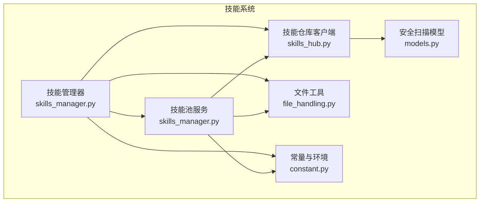
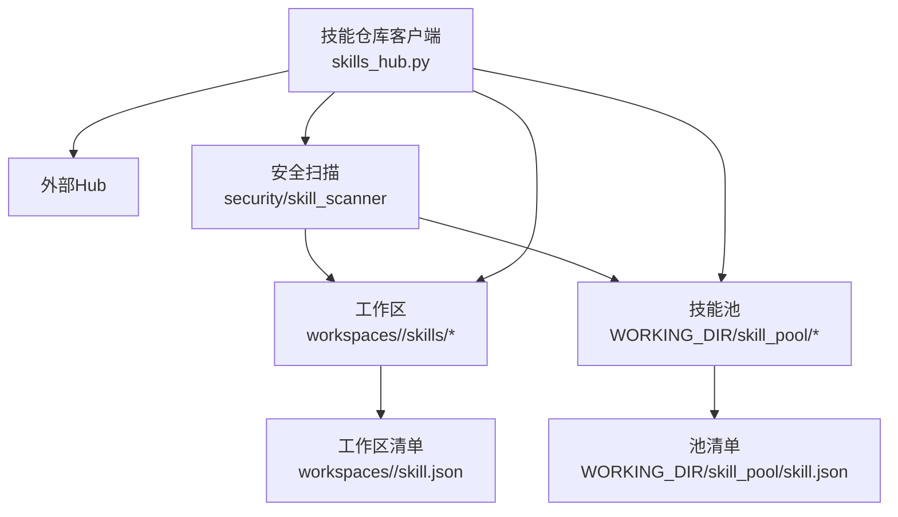
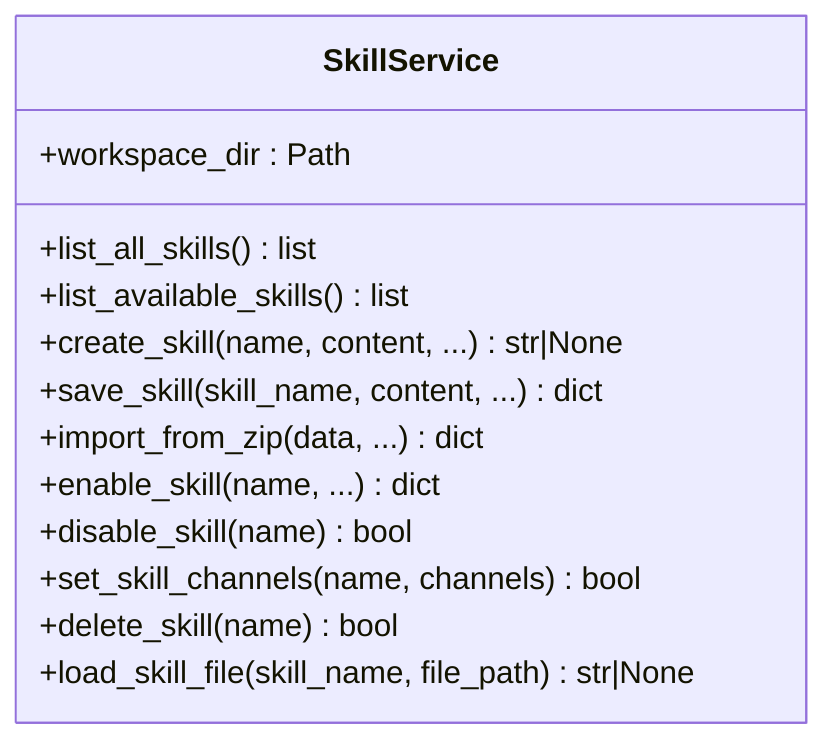
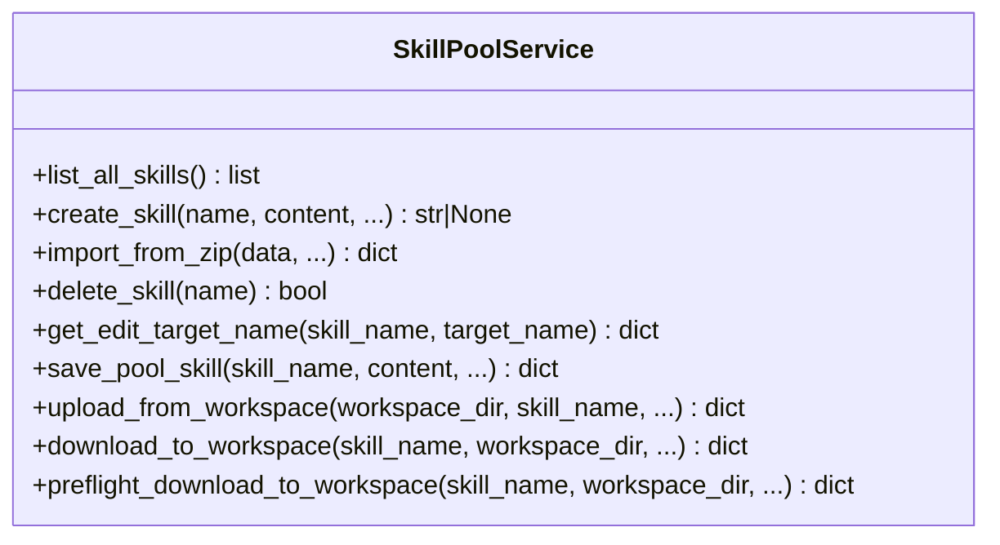
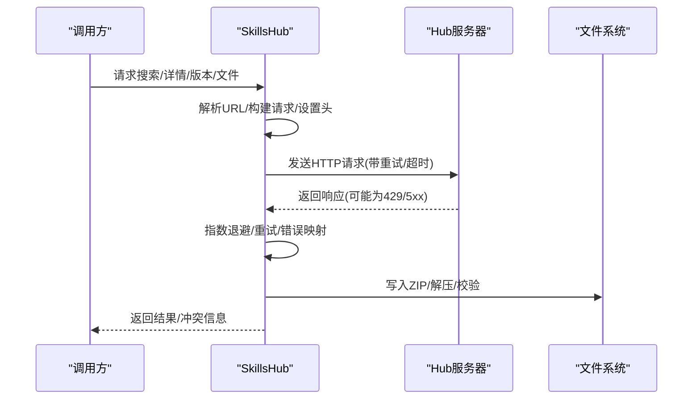
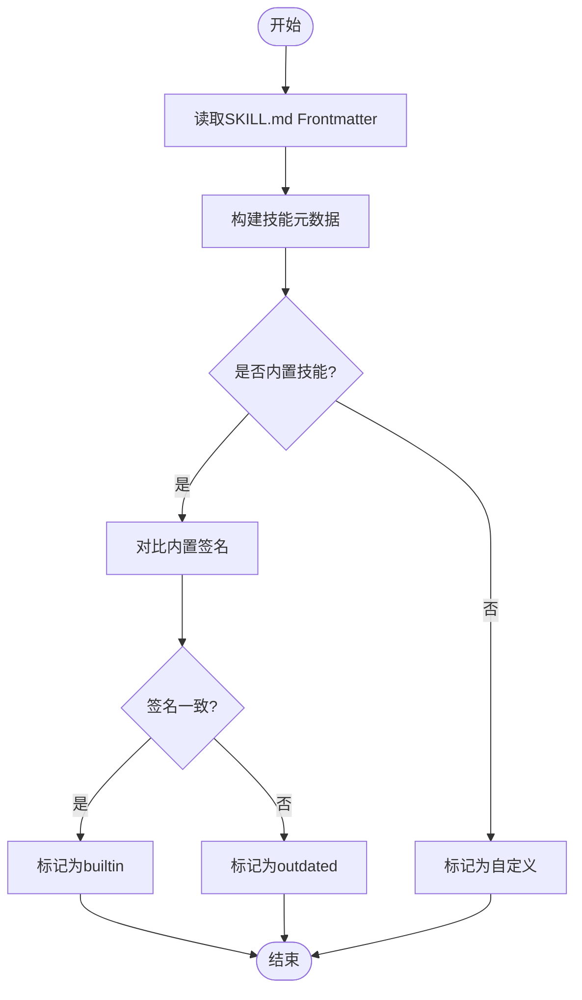
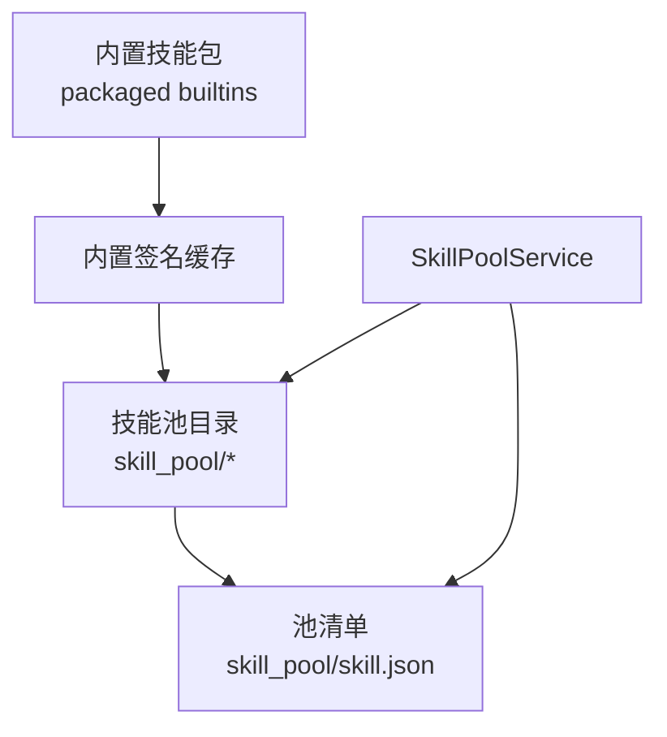
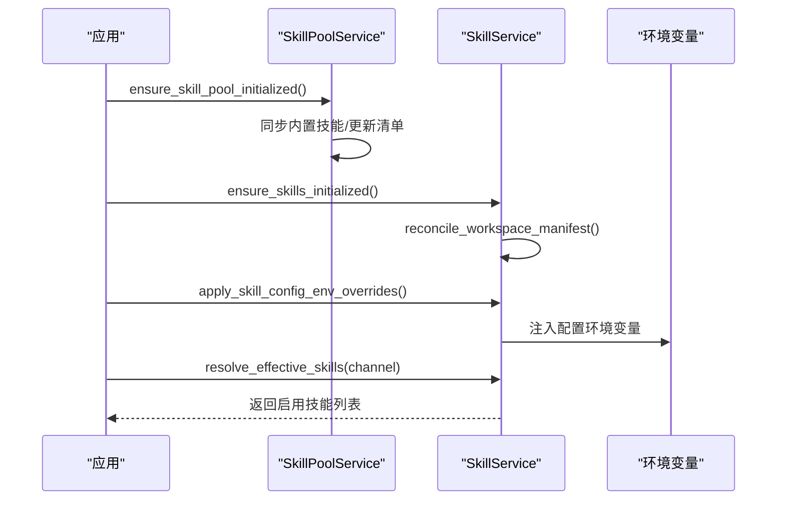
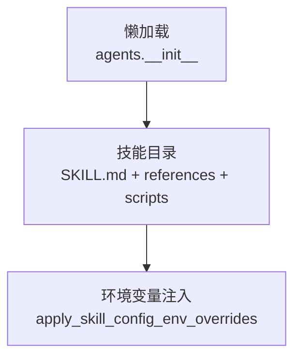
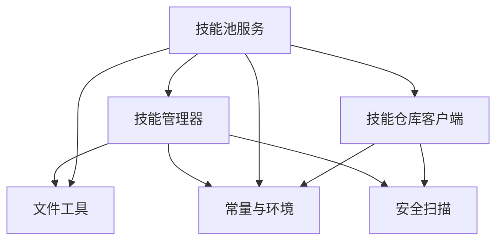

# 技能架构设计

<cite>
**本文引用的文件**
- [skills_manager.py](file://copaw/src/copaw/agents/skills_manager.py)
- [skills_hub.py](file://copaw/src/copaw/agents/skills_hub.py)
- [__init__.py](file://copaw/src/copaw/agents/__init__.py)
- [file_handling.py](file://copaw/src/copaw/agents/utils/file_handling.py)
- [constant.py](file://copaw/src/copaw/constant.py)
- [SKILL.md](file://copaw/src/copaw/agents/skills/guidance/SKILL.md)
- [models.py](file://copaw/src/copaw/security/skill_scanner/models.py)
</cite>

## 目录
1. [简介](#简介)
2. [项目结构](#项目结构)
3. [核心组件](#核心组件)
4. [架构总览](#架构总览)
5. [详细组件分析](#详细组件分析)
6. [依赖分析](#依赖分析)
7. [性能考虑](#性能考虑)
8. [故障排查指南](#故障排查指南)
9. [结论](#结论)
10. [附录](#附录)

## 简介
本技术文档面向CoPaw技能架构设计，系统性阐述技能注册机制、生命周期管理、插件化架构与依赖注入体系，以及技能元数据结构、配置管理、版本控制与冲突解决策略。文档重点解析技能池（SkillPool）的设计理念与实现原理，覆盖技能分类、权限控制与访问管理，同时给出技能加载流程、初始化过程与运行时状态管理的完整视图，并通过多种架构图与序列图帮助开发者快速理解内部工作机制。

## 项目结构
CoPaw技能系统主要由以下模块构成：
- 技能管理器：负责技能的创建、导入、启用/禁用、重命名、删除、扫描与清单同步等全生命周期管理。
- 技能池服务：统一管理共享技能池，支持内置技能同步、跨工作区下载/上传、冲突检测与版本对齐。
- 技能仓库客户端：提供从Hub拉取、安装、取消安装与重试机制，支持超时、重试与背压策略。
- 文件工具：提供跨平台编码兼容读取、URL/本地文件下载、扩展名猜测等能力。
- 常量与环境：集中定义工作目录、默认路径、日志级别、并发限制等系统级常量。
- 安全扫描模型：定义威胁等级、类别与扫描结果的数据模型，支撑技能安全扫描。

**图表来源**
- [skills_manager.py](file://copaw/src/copaw/agents/skills_manager.py)
- [skills_hub.py](file://copaw/src/copaw/agents/skills_hub.py)
- [file_handling.py](file://copaw/src/copaw/agents/utils/file_handling.py)
- [constant.py](file://copaw/src/copaw/constant.py)
- [models.py](file://copaw/src/copaw/security/skill_scanner/models.py)

**章节来源**
- [skills_manager.py](file://copaw/src/copaw/agents/skills_manager.py)
- [skills_hub.py](file://copaw/src/copaw/agents/skills_hub.py)
- [file_handling.py](file://copaw/src/copaw/agents/utils/file_handling.py)
- [constant.py](file://copaw/src/copaw/constant.py)
- [models.py](file://copaw/src/copaw/security/skill_scanner/models.py)

## 核心组件
- 技能管理器（SkillService）：工作区范围内的技能生命周期管理，负责清单读写、启用/禁用、通道路由、配置持久化与文件访问。
- 技能池服务（SkillPoolService）：共享技能池的生命周期管理，负责内置技能同步、导入导出、跨工作区下载/上传与冲突检测。
- 技能仓库客户端（SkillsHub）：提供Hub搜索、详情、版本、文件下载与批量导入能力，内置重试、超时与速率限制处理。
- 文件工具（file_handling）：提供跨平台文本读取、URL/本地文件下载、扩展名猜测与下载目录管理。
- 常量与环境（constant）：集中定义工作目录、媒体目录、本地模型目录、心跳文件、日志级别、并发限制等系统级常量。
- 安全扫描模型（models）：定义威胁等级、类别与扫描结果的数据模型，支撑技能安全扫描。

**章节来源**
- [skills_manager.py](file://copaw/src/copaw/agents/skills_manager.py)
- [skills_hub.py](file://copaw/src/copaw/agents/skills_hub.py)
- [file_handling.py](file://copaw/src/copaw/agents/utils/file_handling.py)
- [constant.py](file://copaw/src/copaw/constant.py)
- [models.py](file://copaw/src/copaw/security/skill_scanner/models.py)

## 架构总览
CoPaw技能系统采用“工作区+共享池”的双层架构：
- 工作区技能：位于工作目录下的skills目录，由SkillService管理，清单保存在skill.json中，支持按通道启用/禁用与配置注入。
- 共享技能池：位于WORKING_DIR/skill_pool，由SkillPoolService管理，内置技能签名缓存与版本对齐，支持跨工作区下载与上传。
- 技能仓库：通过SkillsHub与外部Hub交互，支持搜索、版本选择、文件下载与批量导入。
- 安全扫描：在导入/编辑/下载等关键操作前进行扫描，确保技能内容安全。

**图表来源**
- [skills_manager.py](file://copaw/src/copaw/agents/skills_manager.py)
- [skills_hub.py](file://copaw/src/copaw/agents/skills_hub.py)
- [models.py](file://copaw/src/copaw/security/skill_scanner/models.py)

## 详细组件分析

### 技能管理器（SkillService）
SkillService是工作区范围内的技能生命周期管理核心，职责包括：
- 清单读取与更新：读取/写入工作区skill.json，维护enabled、channels、source、metadata、requirements、updated_at等字段。
- 技能创建/编辑/重命名：校验frontmatter、写入文件树、扫描安全、更新清单。
- ZIP导入：解压校验、冲突检测、批量导入、自动启用。
- 启用/禁用/通道设置：通过原子写入保证并发安全。
- 文件访问：限制路径遍历，仅允许references/scripts子目录读取。

**图表来源**
- [skills_manager.py](file://copaw/src/copaw/agents/skills_manager.py)

**章节来源**
- [skills_manager.py](file://copaw/src/copaw/agents/skills_manager.py)

### 技能池服务（SkillPoolService）
SkillPoolService管理共享技能池，职责包括：
- 内置技能同步：扫描打包内置技能签名，与池内技能对比，支持导入/更新/删除。
- 池内技能创建/编辑/重命名：与工作区类似，但内置槽位受保护。
- ZIP导入：校验冲突、批量导入、更新清单。
- 下载到工作区：预检冲突、扫描、复制、更新工作区清单并启用。
- 从工作区上传：校验内置槽位、扫描、复制、更新池清单。

**图表来源**
- [skills_manager.py](file://copaw/src/copaw/agents/skills_manager.py)

**章节来源**
- [skills_manager.py](file://copaw/src/copaw/agents/skills_manager.py)

### 技能仓库客户端（SkillsHub）
SkillsHub提供Hub交互能力，包括：
- 搜索、详情、版本查询与文件下载。
- ZIP大小与条目数限制、路径遍历防护。
- 超时、重试、指数退避与速率限制处理。
- GitHub API令牌支持与缓存策略。
- 取消检查与上下文传播。

**图表来源**
- [skills_hub.py](file://copaw/src/copaw/agents/skills_hub.py)

**章节来源**
- [skills_hub.py](file://copaw/src/copaw/agents/skills_hub.py)

### 技能元数据结构与配置管理
- 元数据结构：SkillInfo、SkillRequirements、manifest条目包含name、description、version_text、commit_text、signature、source、protected、requirements、updated_at等。
- 配置注入：apply_skill_config_env_overrides在一次对话回合内将配置注入环境变量，支持按需声明require_envs。
- 版本控制：通过signature与builtin签名比对实现内置技能版本对齐与过期检测。
- 冲突解决：suggest_conflict_name生成时间戳后缀重命名建议，避免同名冲突。

**图表来源**
- [skills_manager.py](file://copaw/src/copaw/agents/skills_manager.py)

**章节来源**
- [skills_manager.py](file://copaw/src/copaw/agents/skills_manager.py)

### 技能池（SkillPool）设计理念与实现
- 设计理念：技能池作为共享复用中心，统一内置技能版本管理、冲突检测与跨工作区同步。
- 实现要点：内置签名缓存、清单原子写入、文件锁、跨平台编码兼容读取、安全扫描前置。
- 访问管理：内置槽位受保护，重命名/修改内置技能会触发冲突提示与建议名称。

**图表来源**
- [skills_manager.py](file://copaw/src/copaw/agents/skills_manager.py)

**章节来源**
- [skills_manager.py](file://copaw/src/copaw/agents/skills_manager.py)

### 技能加载流程与初始化
- 初始化：ensure_skill_pool_initialized确保池存在并同步内置技能；ensure_skills_initialized确保工作区清单存在。
- 加载：resolve_effective_skills按通道解析启用的技能列表；apply_skill_config_env_overrides注入配置环境变量。
- 运行时状态：通过manifest的enabled、channels、source、requirements等字段驱动运行时行为。

**图表来源**
- [skills_manager.py](file://copaw/src/copaw/agents/skills_manager.py)

**章节来源**
- [skills_manager.py](file://copaw/src/copaw/agents/skills_manager.py)

### 插件化架构与依赖注入
- 插件化：技能以目录形式存在，SKILL.md作为入口与元数据，references与scripts目录提供辅助资源与脚本。
- 依赖注入：通过apply_skill_config_env_overrides将配置注入环境变量，支持按需声明require_envs，实现最小暴露面。
- 懒加载：agents.__init__中对CoPawAgent采用延迟加载，避免CLI场景下不必要的重依赖。

**图表来源**
- [skills_manager.py](file://copaw/src/copaw/agents/skills_manager.py)
- [__init__.py](file://copaw/src/copaw/agents/__init__.py)

**章节来源**
- [skills_manager.py](file://copaw/src/copaw/agents/skills_manager.py)
- [__init__.py](file://copaw/src/copaw/agents/__init__.py)

## 依赖分析
- 技能管理器依赖：
  - 常量与环境：WORKING_DIR、日志级别、并发限制等。
  - 文件工具：跨平台编码兼容读取、下载目录管理。
  - 安全扫描：扫描技能目录，保障导入/编辑/下载安全。
- 技能池服务依赖：
  - 技能管理器：复用清单读写、原子写入、文件锁等能力。
  - 技能仓库客户端：从Hub批量导入内置技能。
- 技能仓库客户端依赖：
  - 环境变量：超时、重试、背压参数。
  - 安全扫描：导入前扫描。

**图表来源**
- [skills_manager.py](file://copaw/src/copaw/agents/skills_manager.py)
- [skills_hub.py](file://copaw/src/copaw/agents/skills_hub.py)
- [file_handling.py](file://copaw/src/copaw/agents/utils/file_handling.py)
- [constant.py](file://copaw/src/copaw/constant.py)
- [models.py](file://copaw/src/copaw/security/skill_scanner/models.py)

**章节来源**
- [skills_manager.py](file://copaw/src/copaw/agents/skills_manager.py)
- [skills_hub.py](file://copaw/src/copaw/agents/skills_hub.py)
- [file_handling.py](file://copaw/src/copaw/agents/utils/file_handling.py)
- [constant.py](file://copaw/src/copaw/constant.py)
- [models.py](file://copaw/src/copaw/security/skill_scanner/models.py)

## 性能考虑
- 并发安全：清单写入采用文件锁与原子替换，避免竞态与损坏。
- I/O优化：内置签名缓存减少重复计算；ZIP解压前进行大小与路径校验，防止异常输入导致内存压力。
- 扫描前置：导入/编辑/下载前统一进行安全扫描，降低运行时风险与回滚成本。
- 超时与重试：HTTP请求具备超时、重试与指数退避策略，提升网络波动下的稳定性。
- 编码兼容：跨平台文本读取采用多编码尝试，避免因编辑器差异导致的读取失败。

[本节为通用指导，无需特定文件引用]

## 故障排查指南
- 导入冲突：suggest_conflict_name返回建议名称，检查返回的conflicts字段并重试。
- 权限与路径：load_skill_file限制路径遍历，确保只访问references/scripts子目录。
- 环境变量注入失败：检查apply_skill_config_env_overrides中require_envs与配置是否匹配，确认未被占用。
- Hub连接问题：检查COPAW_SKILLS_HUB_HTTP_TIMEOUT、COPAW_SKILLS_HUB_HTTP_RETRIES、COPAW_SKILLS_HUB_HTTP_BACKOFF_BASE/CAP等环境变量。
- 安全扫描阻断：根据ScanResult中的findings与严重级别调整技能内容或修复规则。

**章节来源**
- [skills_manager.py](file://copaw/src/copaw/agents/skills_manager.py)
- [skills_hub.py](file://copaw/src/copaw/agents/skills_hub.py)
- [models.py](file://copaw/src/copaw/security/skill_scanner/models.py)

## 结论
CoPaw技能架构通过“工作区+共享池”双层设计实现了技能的高内聚、低耦合与强复用；借助清单原子写入、内置签名缓存与安全扫描，系统在一致性、安全性与可维护性方面达到平衡。SkillsHub提供了稳健的外部集成能力，结合环境变量注入与懒加载机制，满足多场景部署需求。建议在实际使用中遵循冲突解决与版本对齐策略，配合安全扫描与监控，持续提升系统稳定性与安全性。

[本节为总结性内容，无需特定文件引用]

## 附录
- 技能示例：guidance技能展示了标准流程、输出质量要求与元数据结构。
- 常量与环境：集中管理工作目录、日志级别、并发限制等系统级配置。

**章节来源**
- [SKILL.md](file://copaw/src/copaw/agents/skills/guidance/SKILL.md)
- [constant.py](file://copaw/src/copaw/constant.py)