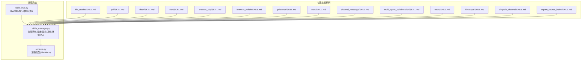
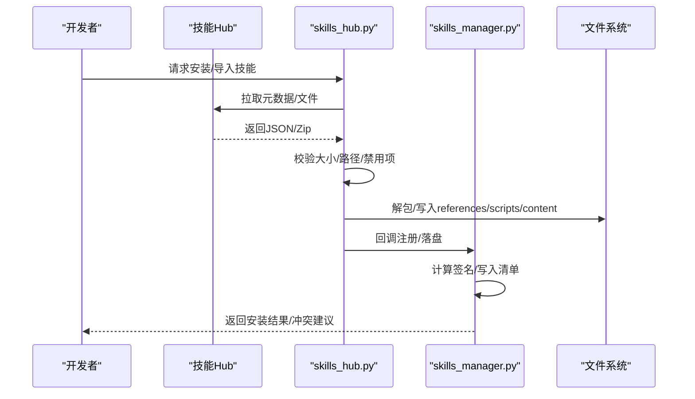
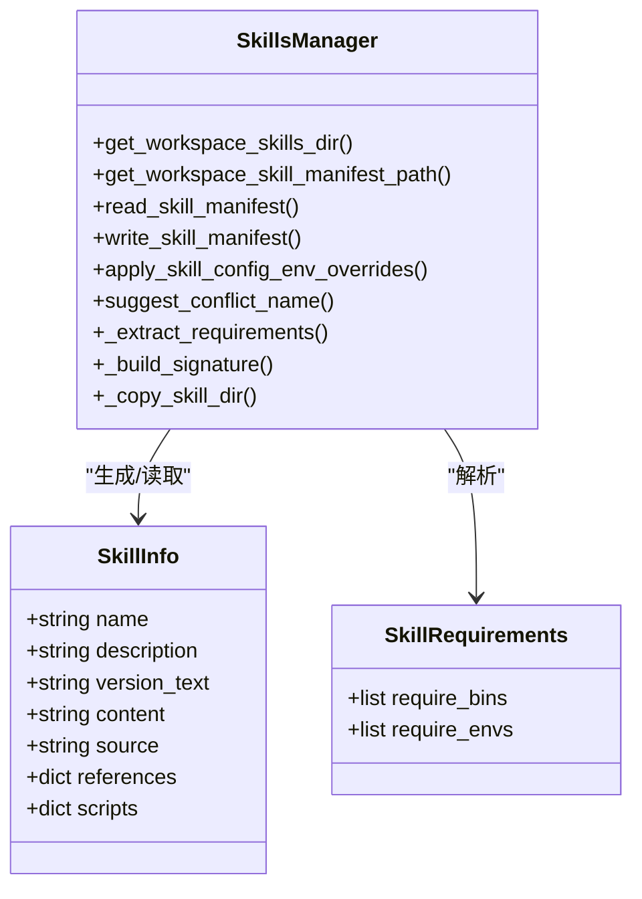
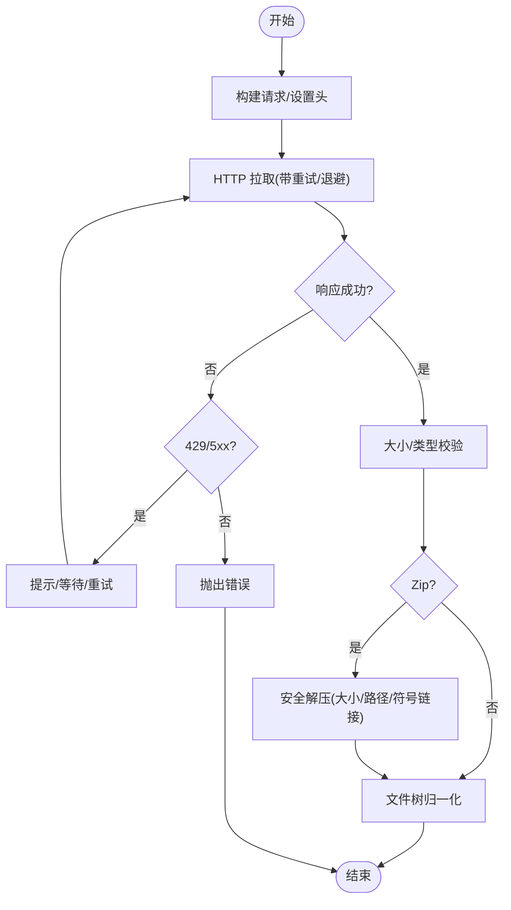
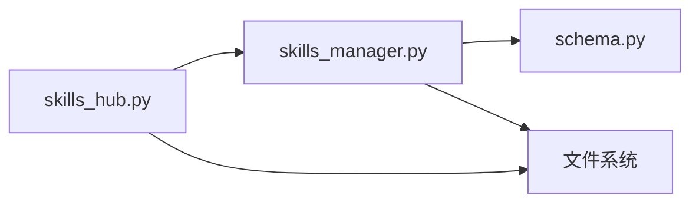

# 自定义技能开发

<cite>
**本文引用的文件**
- [skills_hub.py](file://copaw/src/copaw/agents/skills_hub.py)
- [skills_manager.py](file://copaw/src/copaw/agents/skills_manager.py)
- [schema.py](file://copaw/src/copaw/agents/schema.py)
- [file_reader/SKILL.md](file://copaw/src/copaw/agents/skills/file_reader/SKILL.md)
- [pdf/SKILL.md](file://copaw/src/copaw/agents/skills/pdf/SKILL.md)
- [docx/SKILL.md](file://copaw/src/copaw/agents/skills/docx/SKILL.md)
- [xlsx/SKILL.md](file://copaw/src/copaw/agents/skills/xlsx/SKILL.md)
- [browser_cdp/SKILL.md](file://copaw/src/copaw/agents/skills/browser_cdp/SKILL.md)
- [browser_visible/SKILL.md](file://copaw/src/copaw/agents/skills/browser_visible/SKILL.md)
- [guidance/SKILL.md](file://copaw/src/copaw/agents/skills/guidance/SKILL.md)
- [cron/SKILL.md](file://copaw/src/copaw/agents/skills/cron/SKILL.md)
- [channel_message/SKILL.md](file://copaw/src/copaw/agents/skills/channel_message/SKILL.md)
- [multi_agent_collaboration/SKILL.md](file://copaw/src/copaw/agents/skills/multi_agent_collaboration/SKILL.md)
- [news/SKILL.md](file://copaw/src/copaw/agents/skills/news/SKILL.md)
- [himalaya/SKILL.md](file://copaw/src/copaw/agents/skills/himalaya/SKILL.md)
- [dingtalk_channel/SKILL.md](file://copaw/src/copaw/agents/skills/dingtalk_channel/SKILL.md)
- [copaw_source_index/SKILL.md](file://copaw/src/copaw/agents/skills/copaw_source_index/SKILL.md)
</cite>

## 目录
1. [简介](#简介)
2. [项目结构](#项目结构)
3. [核心组件](#核心组件)
4. [架构总览](#架构总览)
5. [详细组件分析](#详细组件分析)
6. [依赖分析](#依赖分析)
7. [性能考虑](#性能考虑)
8. [故障排查指南](#故障排查指南)
9. [结论](#结论)
10. [附录](#附录)

## 简介
本指南面向希望在本项目中开发“自定义技能”的工程师与技术作者，系统性讲解技能系统的架构设计、插件化机制、开发模板与实现规范（参数校验、错误处理、返回值格式）、内置技能示例（文件读取、PDF 处理、文档解析等）、元数据配置与注册流程、生命周期管理与内存优化策略，并提供测试方法、调试技巧与性能优化建议，以及完整的开发工具链与最佳实践。

## 项目结构
技能系统围绕“技能目录 + 清单 + 注册中心 + 安装器”构建，核心位于 agents 子包内：
- 技能清单与注册：skills_manager.py 负责工作区与共享池的技能清单、签名、冲突检测、导入与安装、环境注入等。
- 技能仓库与安装：skills_hub.py 提供从外部 Hub 拉取、解包、校验与落盘的能力，支持取消检查、重试退避、速率限制与大小限制。
- 工具消息类型：schema.py 定义了向用户发送文件块的消息结构，用于技能返回二进制或远程资源。
- 内置技能：agents/skills 下包含多种内置技能的 SKILL.md 元数据与实现样例，可作为开发模板。

图表来源
- [skills_manager.py:1-2512](file://copaw/src/copaw/agents/skills_manager.py#L1-L2512)
- [skills_hub.py:1-1672](file://copaw/src/copaw/agents/skills_hub.py#L1-L1672)
- [schema.py:1-22](file://copaw/src/copaw/agents/schema.py#L1-L22)

章节来源
- [skills_manager.py:1-2512](file://copaw/src/copaw/agents/skills_manager.py#L1-L2512)
- [skills_hub.py:1-1672](file://copaw/src/copaw/agents/skills_hub.py#L1-L1672)
- [schema.py:1-22](file://copaw/src/copaw/agents/schema.py#L1-L22)

## 核心组件
- 技能清单与注册
  - 负责工作区与共享池的技能清单读写、原子更新、版本号递增、互斥锁保护。
  - 支持内置技能签名缓存、冲突检测与重命名建议、导入时的签名比对与保留“内置槽位”意图。
  - 提供运行时按通道生效的技能配置环境变量注入，确保技能在一次对话回合内获得所需配置。
- Hub 安装与下载
  - 提供 HTTP 拉取、带超时与重试退避、速率限制处理、响应体大小限制、取消检查。
  - 支持 Zip 解压安全校验（大小上限、路径穿越防护、禁止符号链接），并将文件树规范化为 references/scripts/content 结构。
- 消息类型
  - 定义文件块消息结构，便于技能返回二进制内容或远程 URL 资源给用户。

章节来源
- [skills_manager.py:1-2512](file://copaw/src/copaw/agents/skills_manager.py#L1-L2512)
- [skills_hub.py:1-1672](file://copaw/src/copaw/agents/skills_hub.py#L1-L1672)
- [schema.py:1-22](file://copaw/src/copaw/agents/schema.py#L1-L22)

## 架构总览
技能系统采用“声明式元数据 + 文件树 + 清单驱动”的插件化架构：
- 元数据：每个技能以 SKILL.md 声明名称、描述、版本、依赖等信息。
- 文件树：技能由一组文件组成，可包含 references/scripts 等子树，以及内容文件。
- 清单：工作区与共享池分别维护 skill.json，记录每个技能的来源、签名、保护状态、更新时间等。
- 安装/同步：从 Hub 或本地导入后，进行安全校验与签名计算，写入清单并落盘到工作区。

图表来源
- [skills_hub.py:283-424](file://copaw/src/copaw/agents/skills_hub.py#L283-L424)
- [skills_manager.py:290-308](file://copaw/src/copaw/agents/skills_manager.py#L290-L308)

## 详细组件分析

### 组件A：技能清单与注册（skills_manager.py）
- 关键职责
  - 工作区与共享池目录定位与迁移兼容。
  - 清单读写、原子更新、互斥锁、版本号自增。
  - 冲突检测与重命名建议；内置/定制化分类；签名缓存。
  - Zip 安全校验与解压；安全路径解析；文件树重建。
  - 运行时按通道生效的技能配置环境变量注入。
- 数据结构
  - SkillInfo：对外暴露的技能信息（含 name、description、version_text、content、source、references、scripts）。
  - SkillRequirements：系统要求（bin/env）。
- 生命周期
  - 导入/保存：计算签名、写入清单、落盘。
  - 运行：按通道解析有效技能集，注入配置环境变量，释放。
- 性能与安全
  - 使用互斥锁避免并发写冲突；签名缓存减少重复计算；Zip 解压限制与路径穿越校验降低风险。

图表来源
- [skills_manager.py:62-85](file://copaw/src/copaw/agents/skills_manager.py#L62-L85)
- [skills_manager.py:128-144](file://copaw/src/copaw/agents/skills_manager.py#L128-L144)
- [skills_manager.py:529-551](file://copaw/src/copaw/agents/skills_manager.py#L529-L551)

章节来源
- [skills_manager.py:1-2512](file://copaw/src/copaw/agents/skills_manager.py#L1-L2512)

### 组件B：Hub 安装与下载（skills_hub.py）
- 关键职责
  - HTTP 拉取：统一请求头、条件重试、退避策略、超时控制、取消检查。
  - 响应校验：大小限制、速率限制提示、错误消息提取。
  - Zip 安全：大小上限、路径穿越、符号链接拒绝。
  - 文件树归一化：references/scripts/content 三类树的提取与清洗。
- 错误处理
  - 429/5xx 分类处理与用户友好提示；GitHub 速率限制识别与 Token 设置提示。
  - 取消检查：通过上下文钩子中断长耗时任务。
- 性能特性
  - GitHub 缓存 TTL 可配置；分块读取避免大响应内存峰值。

图表来源
- [skills_hub.py:283-424](file://copaw/src/copaw/agents/skills_hub.py#L283-L424)
- [skills_hub.py:448-466](file://copaw/src/copaw/agents/skills_hub.py#L448-L466)

章节来源
- [skills_hub.py:1-1672](file://copaw/src/copaw/agents/skills_hub.py#L1-L1672)

### 组件C：消息类型（schema.py）
- FileBlock：用于向用户发送文件块，支持 Base64 或 URL 源，可选文件名。
- 用途：技能返回二进制内容或远程资源时使用该结构，确保消息格式一致。

章节来源
- [schema.py:1-22](file://copaw/src/copaw/agents/schema.py#L1-L22)

### 组件D：内置技能示例（SKILL.md）
以下内置技能提供了良好的开发模板，包含元数据声明与实现要点，可直接参考或复用：
- 文件读取：file_reader/SKILL.md
- PDF 处理：pdf/SKILL.md
- 文档解析（DOCX）：docx/SKILL.md
- 电子表格解析（XLSX）：xlsx/SKILL.md
- 浏览器自动化（CDP/可见模式）：browser_cdp/SKILL.md、browser_visible/SKILL.md
- 引导与提示：guidance/SKILL.md
- 定时任务：cron/SKILL.md
- 渠道消息：channel_message/SKILL.md
- 多智能体协作：multi_agent_collaboration/SKILL.md
- 新闻聚合：news/SKILL.md
- Himalaya 源索引：himalaya/SKILL.md
- 钉钉渠道：dingtalk_channel/SKILL.md
- Copaw 源索引：copaw_source_index/SKILL.md

章节来源
- [file_reader/SKILL.md](file://copaw/src/copaw/agents/skills/file_reader/SKILL.md)
- [pdf/SKILL.md](file://copaw/src/copaw/agents/skills/pdf/SKILL.md)
- [docx/SKILL.md](file://copaw/src/copaw/agents/skills/docx/SKILL.md)
- [xlsx/SKILL.md](file://copaw/src/copaw/agents/skills/xlsx/SKILL.md)
- [browser_cdp/SKILL.md](file://copaw/src/copaw/agents/skills/browser_cdp/SKILL.md)
- [browser_visible/SKILL.md](file://copaw/src/copaw/agents/skills/browser_visible/SKILL.md)
- [guidance/SKILL.md](file://copaw/src/copaw/agents/skills/guidance/SKILL.md)
- [cron/SKILL.md](file://copaw/src/copaw/agents/skills/cron/SKILL.md)
- [channel_message/SKILL.md](file://copaw/src/copaw/agents/skills/channel_message/SKILL.md)
- [multi_agent_collaboration/SKILL.md](file://copaw/src/copaw/agents/skills/multi_agent_collaboration/SKILL.md)
- [news/SKILL.md](file://copaw/src/copaw/agents/skills/news/SKILL.md)
- [himalaya/SKILL.md](file://copaw/src/copaw/agents/skills/himalaya/SKILL.md)
- [dingtalk_channel/SKILL.md](file://copaw/src/copaw/agents/skills/dingtalk_channel/SKILL.md)
- [copaw_source_index/SKILL.md](file://copaw/src/copaw/agents/skills/copaw_source_index/SKILL.md)

## 依赖分析
- 组件耦合
  - skills_hub.py 与 skills_manager.py 通过“安装回调 + 清单写入”弱耦合交互，Hub 负责下载与解包，Manager 负责落盘与签名。
  - schema.py 仅提供消息类型定义，低耦合。
- 外部依赖
  - HTTP 客户端、Zip 解压、frontmatter 解析、YAML 解析、文件系统操作、互斥锁平台适配（fcntl/msvcrt）。
- 循环依赖
  - 未见循环依赖迹象，模块边界清晰。

图表来源
- [skills_hub.py:1-1672](file://copaw/src/copaw/agents/skills_hub.py#L1-L1672)
- [skills_manager.py:1-2512](file://copaw/src/copaw/agents/skills_manager.py#L1-L2512)
- [schema.py:1-22](file://copaw/src/copaw/agents/schema.py#L1-L22)

章节来源
- [skills_hub.py:1-1672](file://copaw/src/copaw/agents/skills_hub.py#L1-L1672)
- [skills_manager.py:1-2512](file://copaw/src/copaw/agents/skills_manager.py#L1-L2512)
- [schema.py:1-22](file://copaw/src/copaw/agents/schema.py#L1-L22)

## 性能考虑
- I/O 与内存
  - 分块读取响应体，避免一次性加载大文件到内存。
  - Zip 解压前进行大小与路径校验，防止异常输入导致内存膨胀。
- 并发与锁
  - 清单写入使用互斥锁，避免并发写冲突；尽量缩短持有锁的时间。
- 缓存与签名
  - 内置技能签名缓存，首次访问后复用，减少重复计算。
- 网络与重试
  - 可配置超时、重试次数与退避基数/上限，平衡可靠性与延迟。
- 环境变量注入
  - 运行时按需注入，避免常驻污染；使用计数回收，确保释放。

## 故障排查指南
- Hub 安装失败
  - 429/5xx：检查网络与服务端状态，必要时增加重试或等待；对于 GitHub 源，设置认证令牌以提升配额。
  - 速率限制：根据提示设置 GITHUB_TOKEN 或 GH_TOKEN。
  - 取消检查：若长时间无响应，确认取消钩子是否触发。
- Zip 安全问题
  - 路径穿越/符号链接：确保输入来自可信源，或在导入前进行严格校验。
  - 超大压缩包：超过限制会报错，需拆分或清理无关文件。
- 清单写入异常
  - JSON 不可读：日志会提示重置为默认；检查权限与磁盘空间。
  - 并发写冲突：确认锁文件存在且未被其他进程占用。
- 冲突与重命名
  - 名称冲突：使用建议的新名称重试；或删除旧版本再导入。
- 运行时配置
  - 环境变量未生效：确认技能声明了 require_envs，且配置中提供了对应键；查看日志中的警告提示。

章节来源
- [skills_hub.py:311-358](file://copaw/src/copaw/agents/skills_hub.py#L311-L358)
- [skills_manager.py:334-384](file://copaw/src/copaw/agents/skills_manager.py#L334-L384)
- [skills_manager.py:651-696](file://copaw/src/copaw/agents/skills_manager.py#L651-L696)

## 结论
本技能系统以“声明式元数据 + 文件树 + 清单驱动”为核心，结合 Hub 安装、安全校验与运行时环境注入，形成一套可扩展、可审计、可复用的插件化能力。开发者可基于内置技能模板快速实现新技能，并遵循参数校验、错误处理与返回值格式规范，确保稳定性与一致性。

## 附录

### 开发模板与实现规范
- 元数据规范（SKILL.md）
  - 必填字段：name、description（建议）、version（可选）。
  - 可选字段：metadata.requires.bins/env（声明系统依赖）、metadata.requires.env（声明需要注入的环境变量键）。
  - 其他：tags、displayName、sourceUrl 等。
- 文件组织
  - references：引用资源（如外部脚本、配置片段）。
  - scripts：可执行脚本（如 Python/Shell）。
  - 其他内容文件：如模板、规则、数据字典等。
- 参数校验
  - 输入参数必须在技能入口处进行显式校验（类型、范围、必填项）。
  - 对外部资源（URL/文件路径）进行白名单与路径安全检查。
- 错误处理
  - 明确错误分类（参数错误、资源不可达、权限不足、网络异常）。
  - 返回统一的错误信息结构，必要时提供重试建议或替代方案。
- 返回值格式
  - 文本结果：字符串或富文本结构。
  - 文件结果：使用 FileBlock（source 支持 Base64 或 URL，filename 可选）。
  - 多媒体/二进制：优先使用 URL 指向已托管资源，避免超大 Base64。
- 注册与清单
  - 导入后由 Manager 计算签名、写入清单；避免修改已落盘文件以免签名不一致。
  - 冲突时使用建议名称重试，或保留“内置槽位”。

章节来源
- [skills_manager.py:698-727](file://copaw/src/copaw/agents/skills_manager.py#L698-L727)
- [skills_manager.py:529-551](file://copaw/src/copaw/agents/skills_manager.py#L529-L551)
- [schema.py:11-22](file://copaw/src/copaw/agents/schema.py#L11-L22)

### 内置技能实现示例
- 文件读取（file_reader/SKILL.md）
  - 典型用途：读取本地或远程文本文件，返回内容摘要或全文。
  - 关键点：路径安全检查、编码回退、大小限制、错误提示。
- PDF 处理（pdf/SKILL.md）
  - 典型用途：提取文本、页码统计、高亮关键词、转存为图片。
  - 关键点：流式读取、OCR 可选、水印/加密处理、输出格式标准化。
- 文档解析（docx/SKILL.md）
  - 典型用途：段落/表格抽取、样式保留、交叉引用解析。
  - 关键点：兼容不同版本格式、空段落过滤、图片/附件提取。
- 电子表格解析（xlsx/SKILL.md）
  - 典型用途：行列抽取、公式求值、多表合并、可视化建议。
  - 关键点：内存占用控制、缺失单元格处理、日期/数字格式转换。
- 浏览器自动化（browser_cdp/SKILL.md、browser_visible/SKILL.md）
  - 典型用途：网页截图、DOM 提取、表单填写、点击模拟。
  - 关键点：超时与重试、页面等待策略、反爬应对、资源压缩。
- 引导与提示（guidance/SKILL.md）
  - 典型用途：为复杂技能提供前置引导、参数提示、最佳实践。
  - 关键点：简洁明确、可点击跳转、与主流程解耦。
- 定时任务（cron/SKILL.md）
  - 典型用途：周期性扫描、数据备份、报表生成。
  - 关键点：时区处理、并发控制、失败重试、通知机制。
- 渠道消息（channel_message/SKILL.md）
  - 典型用途：跨渠道消息转发、模板渲染、富文本格式。
  - 关键点：渠道差异适配、Markdown/HTML 渲染、附件打包。
- 多智能体协作（multi_agent_collaboration/SKILL.md）
  - 典型用途：任务拆分、进度同步、结果汇总。
  - 关键点：通信协议、容错与回滚、状态持久化。
- 新闻聚合（news/SKILL.md）
  - 典型用途：RSS/搜索结果聚合、去重与排序、摘要生成。
  - 关键点：时效性与准确性、来源可信度、敏感词过滤。
- Himalaya 源索引（himalaya/SKILL.md）
  - 典型用途：播客/音频索引、播放列表生成。
  - 关键点：元数据解析、封面/音频链接提取、缓存策略。
- 钉钉渠道（dingtalk_channel/SKILL.md）
  - 典型用途：群聊/机器人消息、审批/回调处理。
  - 关键点：鉴权与签名、消息幂等、异步回调。
- Copaw 源索引（copaw_source_index/SKILL.md）
  - 典型用途：内部源索引、版本对比、变更追踪。
  - 关键点：增量更新、快照管理、差异计算。

章节来源
- [file_reader/SKILL.md](file://copaw/src/copaw/agents/skills/file_reader/SKILL.md)
- [pdf/SKILL.md](file://copaw/src/copaw/agents/skills/pdf/SKILL.md)
- [docx/SKILL.md](file://copaw/src/copaw/agents/skills/docx/SKILL.md)
- [xlsx/SKILL.md](file://copaw/src/copaw/agents/skills/xlsx/SKILL.md)
- [browser_cdp/SKILL.md](file://copaw/src/copaw/agents/skills/browser_cdp/SKILL.md)
- [browser_visible/SKILL.md](file://copaw/src/copaw/agents/skills/browser_visible/SKILL.md)
- [guidance/SKILL.md](file://copaw/src/copaw/agents/skills/guidance/SKILL.md)
- [cron/SKILL.md](file://copaw/src/copaw/agents/skills/cron/SKILL.md)
- [channel_message/SKILL.md](file://copaw/src/copaw/agents/skills/channel_message/SKILL.md)
- [multi_agent_collaboration/SKILL.md](file://copaw/src/copaw/agents/skills/multi_agent_collaboration/SKILL.md)
- [news/SKILL.md](file://copaw/src/copaw/agents/skills/news/SKILL.md)
- [himalaya/SKILL.md](file://copaw/src/copaw/agents/skills/himalaya/SKILL.md)
- [dingtalk_channel/SKILL.md](file://copaw/src/copaw/agents/skills/dingtalk_channel/SKILL.md)
- [copaw_source_index/SKILL.md](file://copaw/src/copaw/agents/skills/copaw_source_index/SKILL.md)

### 技能元数据配置与注册流程
- 元数据位置：每个技能目录下的 SKILL.md。
- 注册流程：
  1) Hub 拉取/本地导入后，归一化文件树（references/scripts/content）。
  2) 读取 frontmatter，提取 name/description/version/requirements 等。
  3) 计算签名，写入工作区/共享池清单。
  4) 运行时按通道解析有效技能集，注入配置环境变量。
- 冲突处理：若同名冲突，使用建议名称重命名后导入。

章节来源
- [skills_hub.py:631-691](file://copaw/src/copaw/agents/skills_hub.py#L631-L691)
- [skills_manager.py:698-727](file://copaw/src/copaw/agents/skills_manager.py#L698-L727)
- [skills_manager.py:733-754](file://copaw/src/copaw/agents/skills_manager.py#L733-L754)

### 技能生命周期管理与内存优化
- 生命周期
  - 导入：校验 → 解包 → 落盘 → 写清单 → 计算签名。
  - 运行：按通道解析有效技能 → 注入配置 → 执行 → 释放环境变量。
  - 卸载/更新：删除旧版本或替换后重新导入，保持清单一致性。
- 内存优化
  - 分块读取与流式处理；Zip 解压前严格校验；避免将大文件完整加载到内存。
  - 环境变量按回合注入与释放，避免长期占用。

章节来源
- [skills_hub.py:240-280](file://copaw/src/copaw/agents/skills_hub.py#L240-L280)
- [skills_manager.py:651-696](file://copaw/src/copaw/agents/skills_manager.py#L651-L696)

### 测试方法、调试技巧与性能优化建议
- 测试方法
  - 单元测试：针对参数校验、错误分支、清单读写、签名计算。
  - 集成测试：Hub 安装流程、Zip 安全校验、运行时环境注入。
  - 压力测试：大文件/大量并发导入/卸载，观察内存与 CPU。
- 调试技巧
  - 启用详细日志，关注清单写入、签名计算、HTTP 拉取与 Zip 校验。
  - 使用最小化 SKILL.md 与最小化输入，逐步定位问题。
  - 在 CI 中加入 Hub 可用性与速率限制测试。
- 性能优化建议
  - 配置合理的超时与重试；启用 GitHub 缓存；合理设置缓存 TTL。
  - 将大文件托管到远端，返回 URL 而非 Base64；必要时压缩资源。
  - 控制并发导入数量，避免磁盘与网络拥塞。