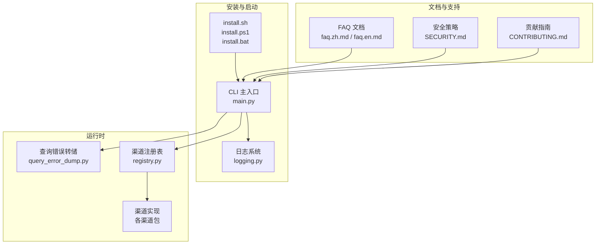
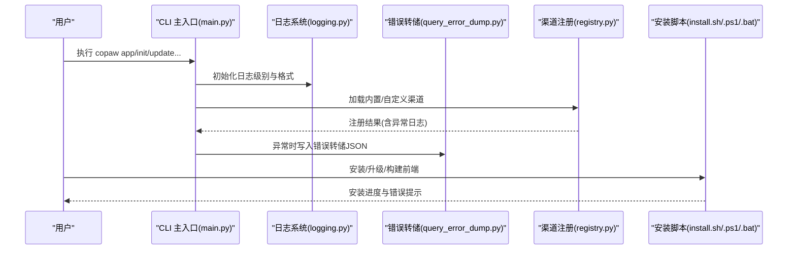
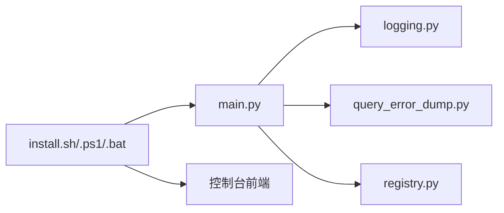
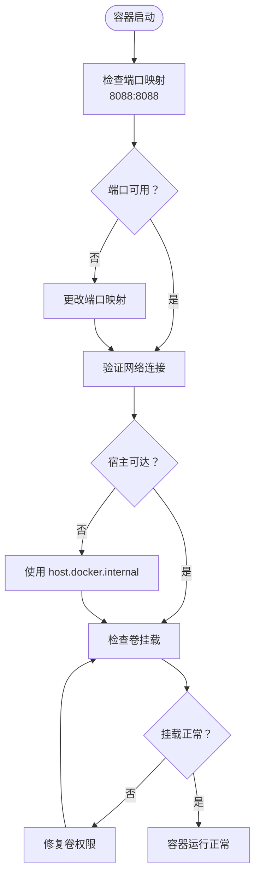

# 安装问题

<cite>
**本文引用的文件**
- [pyproject.toml](file://copaw/pyproject.toml)
- [setup.py](file://copaw/setup.py)
- [Dockerfile](file://copaw/deploy/Dockerfile)
- [docker-compose.yml](file://copaw/docker-compose.yml)
- [entrypoint.sh](file://copaw/deploy/entrypoint.sh)
- [supervisord.conf.template](file://copaw/deploy/config/supervisord.conf.template)
- [install.sh](file://copaw/scripts/install.sh)
- [install.ps1](file://copaw/scripts/install.ps1)
- [install.bat](file://copaw/scripts/install.bat)
- [scripts/README.md](file://copaw/scripts/README.md)
- [故障排除.md](file://specs/copaw-repowiki/content/故障排除.md)
- [README.md](file://copaw/README.md)
</cite>

## 目录
1. [简介](#简介)
2. [项目结构](#项目结构)
3. [核心组件](#核心组件)
4. [架构总览](#架构总览)
5. [详细组件分析](#详细组件分析)
6. [依赖分析](#依赖分析)
7. [性能考虑](#性能考虑)
8. [故障排除指南](#故障排除指南)
9. [结论](#结论)
10. [附录](#附录)

## 简介
本指南面向使用 CoPaw 的用户与运维人员，系统化梳理安装、配置、运行时与网络相关问题的诊断与修复流程，提供日志分析方法、性能诊断工具与错误排查步骤，并覆盖模型加载失败、渠道连接异常、桌面应用与容器部署等典型场景。同时给出用户反馈收集与问题报告模板、性能优化建议与资源监控要点，以及紧急情况处理与系统恢复指引。

## 项目结构
CoPaw 由 Python 后端、Web 控制台前端、CLI、渠道适配器、模型管理与安全扫描等模块组成。故障排除涉及安装脚本、日志系统、错误转储、渠道注册、CLI 初始化与启动流程等多个层面。

图示来源
- [install.sh](file://copaw/scripts/install.sh)
- [install.ps1](file://copaw/scripts/install.ps1)
- [install.bat](file://copaw/scripts/install.bat)
- [故障排除.md](file://specs/copaw-repowiki/content/故障排除.md)

章节来源
- [README.md](file://copaw/README.md)
- [故障排除.md](file://specs/copaw-repowiki/content/故障排除.md)

## 核心组件
- 日志系统：统一命名空间、彩色输出、文件轮转与访问日志过滤，便于定位问题。
- 查询错误转储：在异常发生时捕获请求上下文、异常堆栈与代理状态，生成临时 JSON 文件供提交与复现。
- 渠道注册表：内置与自定义渠道的动态发现与加载，异常时记录详细错误以便排查。
- CLI 启动与初始化：带计时与延迟日志，便于分析启动耗时与潜在阻塞点。
- 安装脚本：跨平台安装与前端构建流程，包含安全校验与错误提示。
- 文档与安全策略：FAQ 提供常见问题与修复步骤，安全策略明确报告流程与信任边界。

章节来源
- [故障排除.md](file://specs/copaw-repowiki/content/故障排除.md)

## 架构总览
下图展示故障排查关键路径：CLI 启动、日志与错误转储、渠道注册与加载、安装脚本与环境准备。

图示来源
- [故障排除.md](file://specs/copaw-repowiki/content/故障排除.md)

## 详细组件分析

### 组件A：日志系统与彩色输出
- 功能要点
  - 仅输出 copaw 命名空间日志，避免第三方噪声。
  - 彩色输出与时间戳格式化，支持 Windows ANSI 兼容。
  - 文件处理器按平台差异选择普通文件或轮转文件，避免锁冲突。
  - 访问日志过滤器可屏蔽特定路径，降低噪音。
- 故障排查用途
  - 将日志级别提升到调试，结合 CLI 启动计时，定位启动慢点。
  - 在渠道加载失败或模型请求异常时，查看转储文件路径与异常类型。

章节来源
- [故障排除.md](file://specs/copaw-repowiki/content/故障排除.md)

### 组件B：查询错误转储
- 功能要点
  - 捕获异常堆栈、请求上下文（会话、用户、渠道）、代理状态快照。
  - 生成临时 JSON 文件，包含 UTC 时间戳，便于跨环境复现。
- 故障排查用途
  - 控制台报错时，根据提示定位错误详情文件路径，附带到 Issue 中。
  - 结合日志与转储文件，快速还原问题现场。

章节来源
- [故障排除.md](file://specs/copaw-repowiki/content/故障排除.md)

### 组件C：渠道注册与加载
- 功能要点
  - 内置渠道通过规范映射加载，失败时区分必需与可选渠道。
  - 自定义渠道从工作目录动态发现，类继承校验与通道键校验。
- 故障排查用途
  - 渠道不可用时，检查注册日志与异常栈，确认依赖与类定义是否满足约束。
  - 必需渠道加载失败会抛出异常，优先修复该渠道。

章节来源
- [故障排除.md](file://specs/copaw-repowiki/content/故障排除.md)

### 组件D：CLI 启动与初始化
- 功能要点
  - 延迟导入与计时日志，便于分析模块加载耗时。
  - 默认主机与端口回退逻辑，支持从上次运行读取。
- 故障排查用途
  - 启动慢时查看调试日志中的模块加载耗时，定位瓶颈。
  - 端口占用或绑定失败时，检查主机/端口参数与回退逻辑。

章节来源
- [故障排除.md](file://specs/copaw-repowiki/content/故障排除.md)

### 组件E：安装脚本与前端构建
- 功能要点
  - 自动检测并复制预构建前端资产，否则尝试 npm 安装与构建。
  - Windows 批处理脚本包含输入白名单与安全校验，防止注入。
- 故障排查用途
  - 前端缺失导致控制台不可用时，检查 npm 是否可用与构建日志。
  - Windows 安装失败时，依据脚本提示修正环境变量与 uv 路径。

章节来源
- [install.sh](file://copaw/scripts/install.sh)
- [install.ps1](file://copaw/scripts/install.ps1)
- [install.bat](file://copaw/scripts/install.bat)
- [故障排除.md](file://specs/copaw-repowiki/content/故障排除.md)

## 依赖分析
- 组件耦合
  - CLI 依赖日志系统进行统一输出；异常时委托错误转储模块写入详情。
  - 渠道注册表负责渠道生命周期与发现，失败时通过日志暴露细节。
  - 安装脚本影响前端可用性，进而影响控制台访问。
- 外部依赖
  - uv、Node/npm、容器网络（Docker）、渠道平台 API（如钉钉、飞书等）。
- 循环依赖
  - 当前模块间为单向依赖，未见循环。

图示来源
- [故障排除.md](file://specs/copaw-repowiki/content/故障排除.md)

章节来源
- [故障排除.md](file://specs/copaw-repowiki/content/故障排除.md)

## 性能考虑
- 启动性能
  - 使用 CLI 的延迟导入与计时日志，识别耗时模块，优化依赖加载顺序。
- 日志性能
  - 文件处理器在不同平台采用合适策略，避免频繁轮转带来的 IO 压力。
- 模型与上下文
  - 使用本地模型时，确保上下文长度足够（建议至少 32K），避免因上下文不足导致的重复请求与性能抖动。
- 网络与容器
  - 容器内 localhost 指向容器自身，应通过 host.docker.internal 或 host 网络模式访问宿主服务，减少网络往返。

章节来源
- [故障排除.md](file://specs/copaw-repowiki/content/故障排除.md)

## 故障排除指南

### 一、Python 环境配置问题
- 症状
  - Python 版本不兼容（不在 3.10 ~ 3.14 范围内）
  - 虚拟环境创建失败或激活异常
  - 权限不足导致包安装失败
- 诊断步骤
  - 检查 Python 版本是否符合要求
  - 验证虚拟环境路径与权限
  - 确认 pip/uv 的可用性与版本
- 修复建议
  - 升级或降级 Python 到支持版本
  - 使用官方推荐的安装方式创建隔离环境
  - 以管理员权限运行或调整用户权限

章节来源
- [pyproject.toml](file://copaw/pyproject.toml)
- [install.sh](file://copaw/scripts/install.sh)
- [install.ps1](file://copaw/scripts/install.ps1)
- [install.bat](file://copaw/scripts/install.bat)

### 二、依赖包安装问题
- 症状
  - pip 安装过程中出现网络超时或证书错误
  - 依赖版本冲突导致安装失败
  - 本地模型相关依赖安装异常
- 诊断步骤
  - 检查网络连接与代理设置
  - 查看依赖树与版本约束
  - 验证本地模型服务的可用性
- 修复建议
  - 使用国内镜像源或代理服务器
  - 升级 pip/uv 到最新版本
  - 按需安装可选依赖（ollama、llamacpp 等）

章节来源
- [pyproject.toml](file://copaw/pyproject.toml)
- [install.sh](file://copaw/scripts/install.sh)
- [install.ps1](file://copaw/scripts/install.ps1)
- [install.bat](file://copaw/scripts/install.bat)

### 三、Docker 容器化部署问题
- 症状
  - 容器启动后无法访问控制台
  - 端口映射冲突或网络不通
  - 容器内 localhost 指向错误地址
- 诊断步骤
  - 检查容器日志与端口映射
  - 验证卷挂载与权限设置
  - 确认宿主服务可达性
- 修复建议
  - 使用 host.docker.internal 明确指向宿主服务
  - 更换端口或使用 host 网络模式
  - 检查防火墙与安全组规则

图示来源
- [Dockerfile](file://copaw/deploy/Dockerfile)
- [docker-compose.yml](file://copaw/docker-compose.yml)
- [entrypoint.sh](file://copaw/deploy/entrypoint.sh)
- [supervisord.conf.template](file://copaw/deploy/config/supervisord.conf.template)

章节来源
- [Dockerfile](file://copaw/deploy/Dockerfile)
- [docker-compose.yml](file://copaw/docker-compose.yml)
- [entrypoint.sh](file://copaw/deploy/entrypoint.sh)
- [supervisord.conf.template](file://copaw/deploy/config/supervisord.conf.template)

### 四、Windows 系统安装问题
- 症状
  - PowerShell 执行策略限制导致脚本中断
  - Constrained Language Mode 下无法自动配置环境
  - Windows LTSC 环境下 PATH 更新失败
- 诊断步骤
  - 检查 PowerShell 执行策略
  - 验证 Constrained Language Mode 状态
  - 确认 uv 与 Python 路径是否在 PATH 中
- 修复建议
  - 临时调整执行策略或手动安装 uv
  - 手动添加路径到系统环境变量
  - 使用 CMD 脚本作为替代方案

章节来源
- [install.ps1](file://copaw/scripts/install.ps1)
- [install.bat](file://copaw/scripts/install.bat)
- [README.md](file://copaw/README.md)

### 五、macOS 系统安装问题
- 症状
  - 首次启动卡顿或沙盒限制
  - 系统安全限制阻止应用运行
  - 权限不足导致依赖安装失败
- 诊断步骤
  - 检查 Gatekeeper 状态与安全设置
  - 验证系统完整性保护(SIP)影响
  - 确认用户权限与磁盘空间
- 修复建议
  - 使用右键打开方式绕过限制
  - 在系统设置中允许应用运行
  - 以管理员权限运行安装程序

章节来源
- [install.sh](file://copaw/scripts/install.sh)
- [README.md](file://copaw/README.md)

### 六、Linux 系统安装问题
- 症状
  - 权限不足导致系统级安装失败
  - 包管理器版本过旧导致依赖解析错误
  - 系统库缺失导致编译失败
- 诊断步骤
  - 检查 sudo 权限与用户组成员身份
  - 验证包管理器版本与仓库配置
  - 确认系统依赖库的完整性
- 修复建议
  - 使用用户级安装或 sudo 权限
  - 升级包管理器到支持版本
  - 安装缺失的系统依赖库

章节来源
- [install.sh](file://copaw/scripts/install.sh)
- [scripts/README.md](file://copaw/scripts/README.md)

### 七、网络连接问题
- 症状
  - GitHub API 抓取速率限制
  - 国内网络访问 PyPI 源失败
  - 代理服务器配置错误
- 诊断步骤
  - 测试网络连通性与 DNS 解析
  - 检查代理设置与认证信息
  - 验证防火墙与安全策略
- 修复建议
  - 使用国内镜像源或代理服务器
  - 配置企业级代理与认证
  - 调整超时与重试策略

章节来源
- [install.sh](file://copaw/scripts/install.sh)
- [install.ps1](file://copaw/scripts/install.ps1)
- [install.bat](file://copaw/scripts/install.bat)

### 八、依赖版本冲突问题
- 症状
  - 不同包对同一依赖的版本要求冲突
  - Python 版本与包兼容性问题
  - 本地与远程依赖版本不一致
- 诊断步骤
  - 使用 pip check 检查依赖一致性
  - 分析冲突包的版本范围
  - 验证虚拟环境隔离性
- 修复建议
  - 升级 pip/uv 到最新版本
  - 使用兼容性更好的依赖组合
  - 创建独立的虚拟环境

章节来源
- [pyproject.toml](file://copaw/pyproject.toml)
- [install.sh](file://copaw/scripts/install.sh)
- [install.ps1](file://copaw/scripts/install.ps1)
- [install.bat](file://copaw/scripts/install.bat)

### 九、安装验证与故障诊断
- 安装验证步骤
  - 检查 CLI 命令可用性与版本信息
  - 验证控制台前端资源完整性
  - 测试基本功能与配置初始化
- 故障诊断工具
  - 启用调试日志模式
  - 收集系统信息与环境变量
  - 生成错误转储文件用于问题报告

章节来源
- [故障排除.md](file://specs/copaw-repowiki/content/故障排除.md)

### 十、开发环境与生产环境差异
- 开发环境特点
  - 需要完整的开发工具链与测试框架
  - 支持热重载与调试功能
  - 包含额外的开发依赖与文档生成工具
- 生产环境特点
  - 注重稳定性与性能优化
  - 最小化依赖与资源占用
  - 强调安全配置与监控能力

章节来源
- [pyproject.toml](file://copaw/pyproject.toml)
- [scripts/README.md](file://copaw/scripts/README.md)

## 结论
通过统一的日志体系、完善的错误转储机制、渠道注册与加载流程、以及安装脚本与文档支持，CoPaw 提供了系统化的故障排除能力。建议在日常运维中定期检查日志、监控资源使用、验证渠道与模型配置，并按问题报告模板提交高质量问题，以加速修复与改进。

## 附录
- 常见问题索引
  - 安装与升级：参考 FAQ 中的安装与更新章节。
  - 模型配置：参考 FAQ 中的模型配置与上下文长度章节。
  - 定时任务：参考 FAQ 中的定时任务排查章节。
  - 安全报告：参考安全策略文档的报告流程与信任模型。

章节来源
- [故障排除.md](file://specs/copaw-repowiki/content/故障排除.md)
- [README.md](file://copaw/README.md)