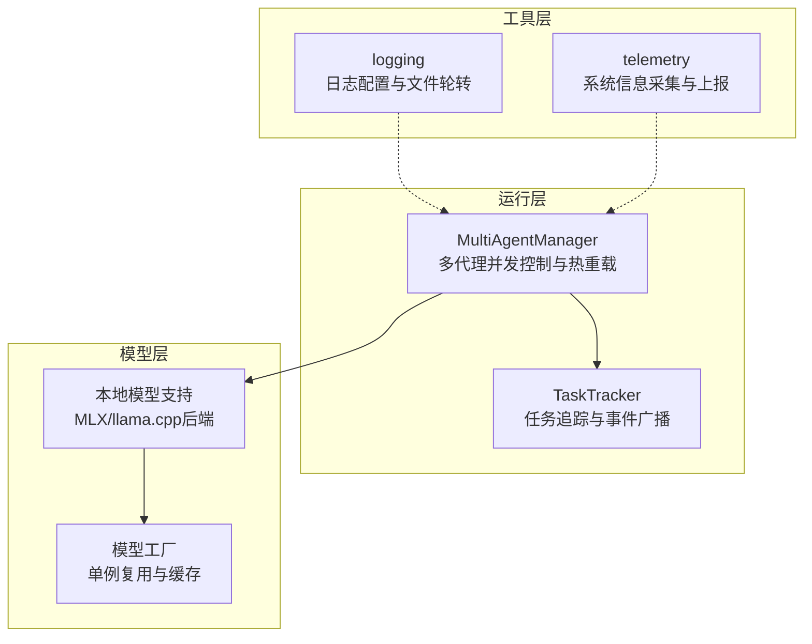
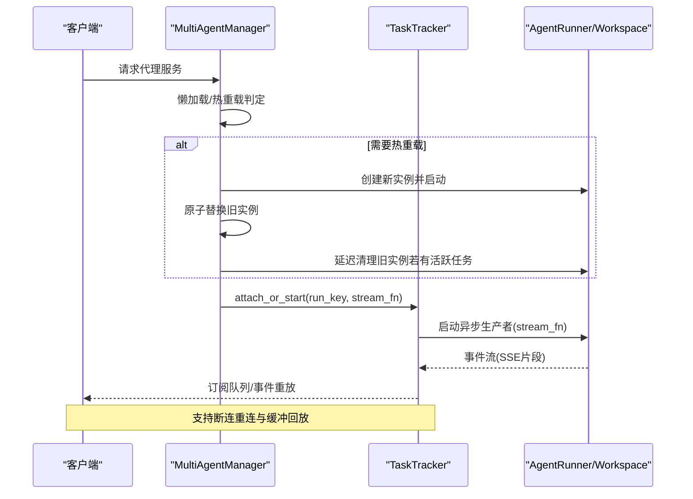
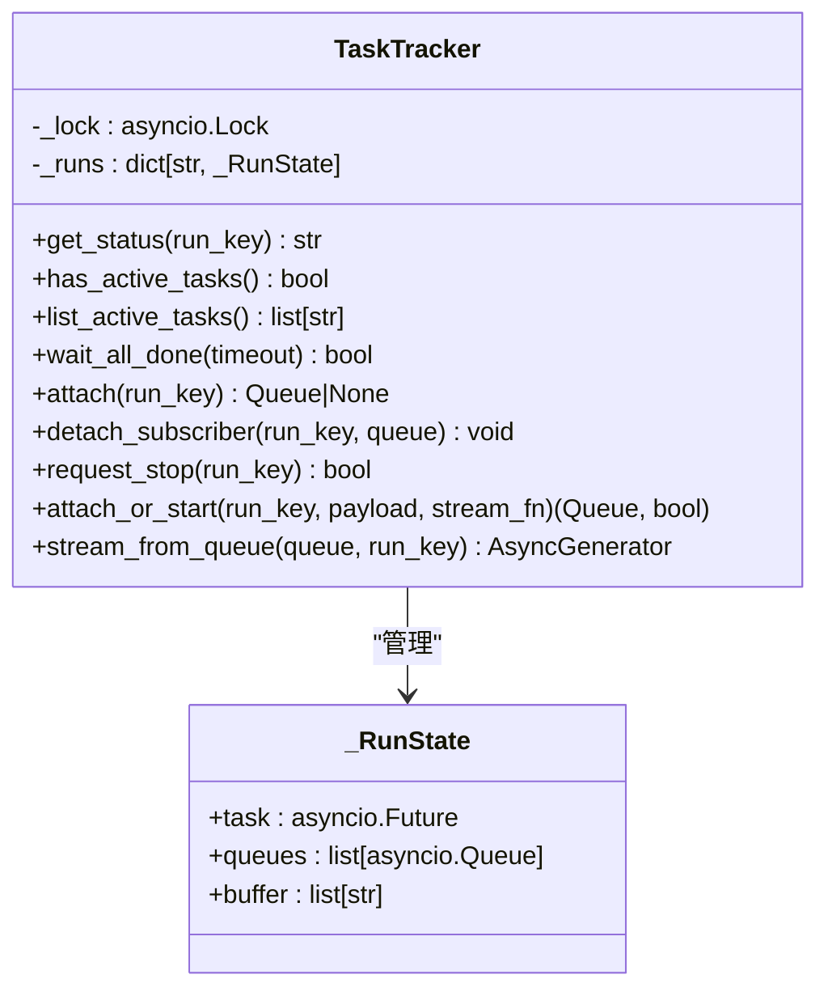
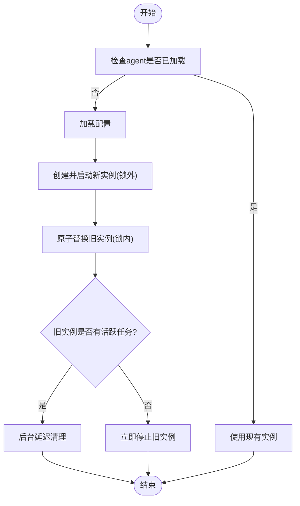
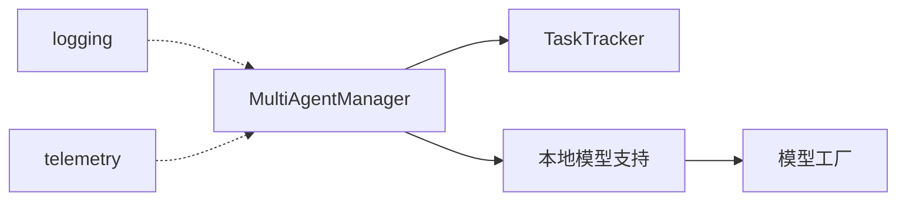

# 性能问题

<cite>
**本文引用的文件**
- [logging.py](file://copaw/src/copaw/utils/logging.py)
- [telemetry.py](file://copaw/src/copaw/utils/telemetry.py)
- [task_tracker.py](file://copaw/src/copaw/app/runner/task_tracker.py)
- [multi_agent_manager.py](file://copaw/src/copaw/app/multi_agent_manager.py)
- [本地模型支持.md](file://specs/copaw-repowiki/content/核心功能/模型管理系统/本地模型支持/本地模型支持.md)
- [MLX后端.md](file://specs/copaw-repowiki/content/核心功能/模型管理系统/本地模型支持/MLX后端.md)
- [模型工厂.md](file://specs/copaw-repowiki/content/项目概述/核心功能/本地模型支持/模型工厂.md)
- [代理并发控制机制.md](file://specs/copaw-repowiki/content/系统架构/多代理系统架构/代理并发控制机制.md)
- [通信技能.md](file://specs/copaw-repowiki/content/核心功能/技能扩展系统/内置技能/通信技能.md)
- [模型管理API.md](file://specs/copaw-repowiki/content/API参考/REST API/模型管理API.md)
- [测试指南.md](file://specs/copaw-repowiki/content/开发指南/测试指南.md)
</cite>

## 目录
1. [引言](#引言)
2. [项目结构](#项目结构)
3. [核心组件](#核心组件)
4. [架构总览](#架构总览)
5. [详细组件分析](#详细组件分析)
6. [依赖分析](#依赖分析)
7. [性能考量](#性能考量)
8. [故障排查指南](#故障排查指南)
9. [结论](#结论)
10. [附录](#附录)

## 引言
本指南聚焦于系统性能问题的诊断与优化，覆盖CPU使用率过高、内存泄漏、I/O阻塞、网络延迟等常见瓶颈。结合代码库中的并发控制、任务追踪、本地模型推理与监控工具，提供可落地的优化策略与排障路径。内容面向工程实践，既适合一线开发者快速定位问题，也便于团队建立标准化的性能基线与压测流程。

## 项目结构
围绕性能相关的关键模块分布在运行层、工作空间层与工具层：
- 运行层：TaskTracker（任务追踪与事件广播）、MultiAgentManager（多代理并发控制与零停机热重载）
- 工具层：日志与遥测（日志级别与文件轮转、系统信息采集与上报）
- 模型层：本地模型支持（MLX后端、llama.cpp后端、工厂与缓存复用）

**图表来源**
- [task_tracker.py:1-231](file://copaw/src/copaw/app/runner/task_tracker.py#L1-L231)
- [multi_agent_manager.py:1-462](file://copaw/src/copaw/app/multi_agent_manager.py#L1-L462)
- [logging.py:1-185](file://copaw/src/copaw/utils/logging.py#L1-L185)
- [telemetry.py:1-311](file://copaw/src/copaw/utils/telemetry.py#L1-L311)
- [本地模型支持.md:398-407](file://specs/copaw-repowiki/content/核心功能/模型管理系统/本地模型支持/本地模型支持.md#L398-L407)
- [模型工厂.md:328-339](file://specs/copaw-repowiki/content/项目概述/核心功能/本地模型支持/模型工厂.md#L328-L339)

**章节来源**
- [task_tracker.py:1-231](file://copaw/src/copaw/app/runner/task_tracker.py#L1-L231)
- [multi_agent_manager.py:1-462](file://copaw/src/copaw/app/multi_agent_manager.py#L1-L462)
- [logging.py:1-185](file://copaw/src/copaw/utils/logging.py#L1-L185)
- [telemetry.py:1-311](file://copaw/src/copaw/utils/telemetry.py#L1-L311)

## 核心组件
- TaskTracker：以异步锁保护的运行状态表，维护每个run_key的任务、队列与事件缓冲，支持订阅重放与清理回收。
- MultiAgentManager：多代理工作空间的懒加载、生命周期管理与零停机热重载，结合TaskTracker的活跃任务检测实现平滑切换。
- 日志与遥测：统一命名空间的日志输出、跨平台文件轮转与过滤；系统信息采集（版本、架构、GPU检测）与上报。
- 本地模型支持：MLX后端（Apple Silicon Metal加速）与llama.cpp后端（显存分层、采样参数），工厂单例避免重复加载。

**章节来源**
- [task_tracker.py:30-231](file://copaw/src/copaw/app/runner/task_tracker.py#L30-L231)
- [multi_agent_manager.py:17-462](file://copaw/src/copaw/app/multi_agent_manager.py#L17-L462)
- [logging.py:104-185](file://copaw/src/copaw/utils/logging.py#L104-L185)
- [telemetry.py:48-161](file://copaw/src/copaw/utils/telemetry.py#L48-L161)
- [本地模型支持.md:398-407](file://specs/copaw-repowiki/content/核心功能/模型管理系统/本地模型支持/本地模型支持.md#L398-L407)
- [MLX后端.md:256-264](file://specs/copaw-repowiki/content/核心功能/模型管理系统/本地模型支持/MLX后端.md#L256-L264)
- [模型工厂.md:328-339](file://specs/copaw-repowiki/content/项目概述/核心功能/本地模型支持/模型工厂.md#L328-L339)

## 架构总览
多Agent并发处理通过异步事件驱动与轻量锁协作，结合任务追踪与热重载实现高吞吐与低停机。本地模型推理采用工厂单例与后端缓存，减少重复初始化与上下文切换开销。

**图表来源**
- [multi_agent_manager.py:200-311](file://copaw/src/copaw/app/multi_agent_manager.py#L200-L311)
- [task_tracker.py:142-208](file://copaw/src/copaw/app/runner/task_tracker.py#L142-L208)

## 详细组件分析

### 组件A：TaskTracker（并发事件与任务追踪）
- 关键职责
  - 以run_key为维度维护任务、队列与事件缓冲，支持订阅重放与断连清理。
  - 提供活跃任务查询、等待全部完成与请求停止等能力，辅助热重载与优雅关停。
- 性能要点
  - 使用异步锁保护共享状态，最小化锁持有时间，避免阻塞事件循环。
  - 订阅端使用无界队列，断连自动移除，防止内存泄漏。
  - 事件缓冲支持重放，降低重连抖动。
- 优化建议
  - 控制事件缓冲上限，避免内存膨胀；对长时间无消费的订阅进行超时清理。
  - 将耗时计算移出锁外，仅在必要时写入缓冲与广播。

**图表来源**
- [task_tracker.py:30-231](file://copaw/src/copaw/app/runner/task_tracker.py#L30-L231)

**章节来源**
- [task_tracker.py:30-231](file://copaw/src/copaw/app/runner/task_tracker.py#L30-L231)

### 组件B：MultiAgentManager（多Agent并发与热重载）
- 关键职责
  - 多代理工作空间的懒加载、生命周期管理与零停机热重载。
  - 通过TaskTracker检测活跃任务，实现延迟清理与无缝切换。
- 性能要点
  - 热重载最小化锁持有时间，新实例在锁外启动，降低对其他代理的影响。
  - 可复用组件迁移减少初始化成本。
- 优化建议
  - 启动阶段并发初始化已启用代理，缩短冷启动时间。
  - 对失败的启动进行快速清理，避免悬挂实例。

**图表来源**
- [multi_agent_manager.py:200-311](file://copaw/src/copaw/app/multi_agent_manager.py#L200-L311)

**章节来源**
- [multi_agent_manager.py:17-462](file://copaw/src/copaw/app/multi_agent_manager.py#L17-L462)

### 组件C：日志与遥测（性能可观测性）
- 日志
  - 仅输出包命名空间日志，避免第三方噪声；支持彩色终端与文件轮转；可按路径过滤访问日志。
- 遥测
  - 采集安装方式、操作系统、架构、GPU可用性等信息，上报至遥测端点；带标记文件避免重复上报与支持退出选项。
- 优化建议
  - 在性能敏感路径降低日志级别或关闭冗余字段；对高频事件采用采样输出。
  - 上报使用短超时，失败静默以免影响主流程。

**章节来源**
- [logging.py:104-185](file://copaw/src/copaw/utils/logging.py#L104-L185)
- [telemetry.py:48-161](file://copaw/src/copaw/utils/telemetry.py#L48-L161)
- [telemetry.py:292-311](file://copaw/src/copaw/utils/telemetry.py#L292-L311)

### 组件D：本地模型推理（MLX/llama.cpp后端）
- MLX后端
  - Apple Silicon原生Metal加速，单例工厂避免重复加载，目录型模型与safetensors格式支持。
- llama.cpp后端
  - 采样参数映射、显存分层（n_gpu_layers）与工厂单例复用。
- 性能要点
  - 流式输出减少等待时间；缓存与复用显著提升多请求场景响应速度。
- 优化建议
  - 根据任务类型调整温度、Top-P等采样参数；在Apple设备上启用MLX后端；合理设置显存分层。

**章节来源**
- [MLX后端.md:256-264](file://specs/copaw-repowiki/content/核心功能/模型管理系统/本地模型支持/MLX后端.md#L256-L264)
- [本地模型支持.md:398-407](file://specs/copaw-repowiki/content/核心功能/模型管理系统/本地模型支持/本地模型支持.md#L398-L407)
- [模型工厂.md:328-339](file://specs/copaw-repowiki/content/项目概述/核心功能/本地模型支持/模型工厂.md#L328-L339)

## 依赖分析
- 运行层依赖
  - TaskTracker依赖asyncio锁与队列；MultiAgentManager依赖TaskTracker进行活跃任务检测与优雅关停。
- 工具层依赖
  - logging与telemetry均为纯Python实现，无外部依赖，便于在生产环境稳定运行。
- 模型层依赖
  - MLX后端依赖mlx-lm与可选依赖（macOS平台）；llama.cpp后端依赖本地推理库；工厂模式统一抽象。

**图表来源**
- [multi_agent_manager.py:17-462](file://copaw/src/copaw/app/multi_agent_manager.py#L17-L462)
- [task_tracker.py:30-231](file://copaw/src/copaw/app/runner/task_tracker.py#L30-L231)
- [logging.py:104-185](file://copaw/src/copaw/utils/logging.py#L104-L185)
- [telemetry.py:48-161](file://copaw/src/copaw/utils/telemetry.py#L48-L161)

**章节来源**
- [multi_agent_manager.py:17-462](file://copaw/src/copaw/app/multi_agent_manager.py#L17-L462)
- [task_tracker.py:30-231](file://copaw/src/copaw/app/runner/task_tracker.py#L30-L231)
- [logging.py:104-185](file://copaw/src/copaw/utils/logging.py#L104-L185)
- [telemetry.py:48-161](file://copaw/src/copaw/utils/telemetry.py#L48-L161)

## 性能考量
- 并发控制与资源竞争
  - 使用asyncio.Lock最小化锁持有时间，避免阻塞事件循环；订阅端无界队列需配合超时与清理策略。
  - 多Agent并发启动与懒加载，缩短冷启动时间；热重载原子替换与延迟清理，实现零停机。
- I/O与网络
  - 本地模型工厂单例复用，减少磁盘与内存抖动；提供者连接超时可调，平衡响应与稳定性。
  - 通信技能中媒体上传缓存Token、会话Webhook避免长轮询阻塞。
- 模型推理
  - 优先启用流式输出；采样参数按任务调整；MLX后端Metal加速；llama.cpp显存分层提升吞吐。
- 监控与可观测性
  - 日志按命名空间输出，文件轮转与过滤；遥测采集系统信息并上报，支持退出选项。

**章节来源**
- [代理并发控制机制.md:382-385](file://specs/copaw-repowiki/content/系统架构/多代理系统架构/代理并发控制机制.md#L382-L385)
- [通信技能.md:333-341](file://specs/copaw-repowiki/content/核心功能/技能扩展系统/内置技能/通信技能.md#L333-L341)
- [模型管理API.md:420-426](file://specs/copaw-repowiki/content/API参考/REST API/模型管理API.md#L420-L426)
- [本地模型支持.md:398-407](file://specs/copaw-repowiki/content/核心功能/模型管理系统/本地模型支持/本地模型支持.md#L398-L407)

## 故障排查指南
- CPU使用率过高
  - 检查是否存在长时间持有锁的路径；确认耗时计算是否在锁外执行；观察事件缓冲增长与订阅积压。
  - 使用TaskTracker列出活跃任务，定位卡顿作业；必要时请求停止并重试。
- 内存泄漏
  - 确认订阅断连后队列被移除；检查事件缓冲上限与清理策略；关注延迟清理任务是否完成。
- I/O阻塞
  - 检查同步阻塞操作是否出现在事件循环中；优先使用异步I/O；对磁盘写入采用内存任务存储减少抖动。
- 网络延迟
  - 调整提供者连接超时；检查上游API限流与重试策略；对高频请求采用缓存与复用。
- 本地模型推理慢
  - 启用流式输出；根据任务类型调整采样参数；在Apple设备上启用MLX后端；复用工厂单例。

**章节来源**
- [task_tracker.py:66-98](file://copaw/src/copaw/app/runner/task_tracker.py#L66-L98)
- [task_tracker.py:115-132](file://copaw/src/copaw/app/runner/task_tracker.py#L115-L132)
- [模型管理API.md:420-426](file://specs/copaw-repowiki/content/API参考/REST API/模型管理API.md#L420-L426)
- [MLX后端.md:256-264](file://specs/copaw-repowiki/content/核心功能/模型管理系统/本地模型支持/MLX后端.md#L256-L264)

## 结论
通过异步锁与事件驱动的并发控制、任务追踪与零停机热重载、工厂单例与后端缓存复用，以及日志与遥测的可观测性建设，系统在保证一致性的同时提升了吞吐与可用性。针对CPU、内存、I/O与网络瓶颈，建议从锁持有时间、队列与缓冲策略、异步I/O、超时与取消机制、流式输出与缓存复用等方面入手，形成可量化、可回归的性能优化闭环。

## 附录
- 性能监控与关键指标
  - 响应时间、成功率、QPS、超时率等；结合日志与遥测进行趋势分析。
- 基准测试与压力测试
  - 使用异步测试框架与并发去重策略；固定超时与指数退避等待；采集日志定位启动失败原因。
- 硬件配置调优
  - Apple Silicon设备优先启用MLX后端；Windows/Linux平台根据GPU检测结果选择后端；合理设置显存分层与采样参数。

**章节来源**
- [测试指南.md:171-174](file://specs/copaw-repowiki/content/开发指南/测试指南.md#L171-L174)
- [测试指南.md:181-195](file://specs/copaw-repowiki/content/开发指南/测试指南.md#L181-L195)
- [MLX后端.md:256-264](file://specs/copaw-repowiki/content/核心功能/模型管理系统/本地模型支持/MLX后端.md#L256-L264)