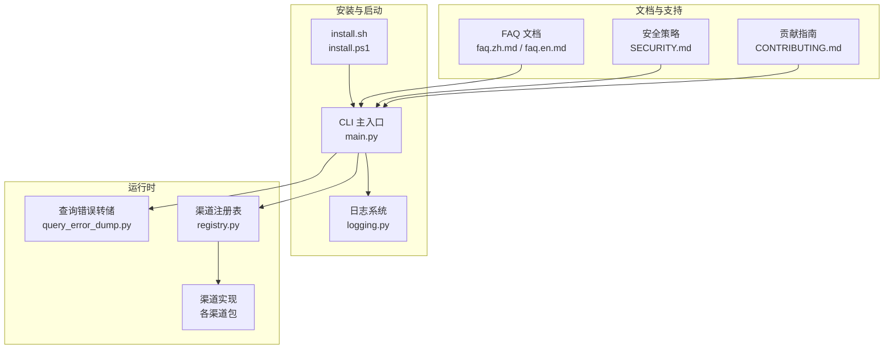
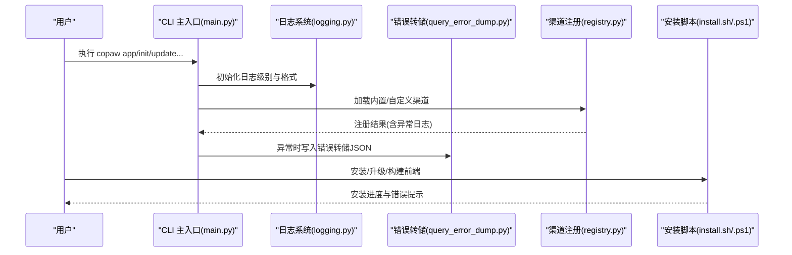
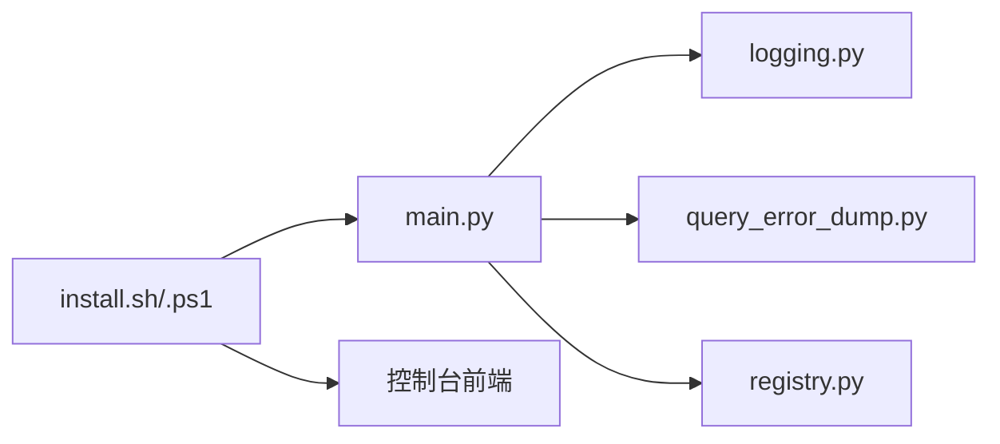

# 故障排除

<cite>
**本文引用的文件**
- [故障排除.md](file://specs/copaw-repowiki/content/故障排除.md)
- [logging.py](file://src/copaw/utils/logging.py)
- [query_error_dump.py](file://src/copaw/app/runner/query_error_dump.py)
- [registry.py](file://src/copaw/app/channels/registry.py)
- [main.py](file://src/copaw/cli/main.py)
- [install.sh](file://scripts/install.sh)
- [install.ps1](file://scripts/install.ps1)
- [test_app_startup.py](file://copaw/tests/integrated/test_app_startup.py)
- [run_tests.py](file://copaw/scripts/run_tests.py)
- [ENVIRONMENT_VARIABLES.md](file://specs/workshop/deploy-templates-ecs/env/ENVIRONMENT_VARIABLES.md)
- [error.ts](file://copaw/console/src/utils/error.ts)
- [query_error_dump.py](file://src/copaw/app/runner/query_error_dump.py)
</cite>

## 目录
1. [简介](#简介)
2. [项目结构](#项目结构)
3. [核心组件](#核心组件)
4. [架构总览](#架构总览)
5. [详细组件分析](#详细组件分析)
6. [依赖分析](#依赖分析)
7. [性能考虑](#性能考虑)
8. [故障排除指南](#故障排除指南)
9. [结论](#结论)
10. [附录](#附录)

## 简介
本指南面向使用 CoPaw 的用户与运维人员，系统化梳理安装、配置、运行时与网络相关问题的诊断与修复流程，提供日志分析方法、性能诊断工具与错误排查步骤，并覆盖模型加载失败、渠道连接异常、桌面应用与容器部署等典型场景。同时给出用户反馈收集与问题报告模板、性能优化建议与资源监控要点，以及紧急情况处理与系统恢复指引。

## 项目结构
CoPaw 由 Python 后端、Web 控制台前端、CLI、渠道适配器、模型管理与安全扫描等模块组成。故障排除涉及安装脚本、日志系统、错误转储、渠道注册、CLI 初始化与启动流程等多个层面。

图示来源
- [install.sh](file://scripts/install.sh)
- [install.ps1](file://scripts/install.ps1)
- [main.py](file://src/copaw/cli/main.py)
- [logging.py](file://src/copaw/utils/logging.py)
- [query_error_dump.py](file://src/copaw/app/runner/query_error_dump.py)
- [registry.py](file://src/copaw/app/channels/registry.py)

章节来源
- [故障排除.md](file://specs/copaw-repowiki/content/故障排除.md)

## 核心组件
- 日志系统：统一命名空间、彩色输出、文件轮转与访问日志过滤，便于定位问题。
- 查询错误转储：在异常发生时捕获请求上下文、异常堆栈与代理状态，生成临时 JSON 文件供提交与复现。
- 渠道注册表：内置与自定义渠道的动态发现与加载，异常时记录详细错误以便排查。
- CLI 启动与初始化：带计时与延迟日志，便于分析启动耗时与潜在阻塞点。
- 安装脚本：跨平台安装与前端构建流程，包含安全校验与错误提示。
- 文档与安全策略：FAQ 提供常见问题与修复步骤，安全策略明确报告流程与信任边界。

章节来源
- [logging.py](file://src/copaw/utils/logging.py)
- [query_error_dump.py](file://src/copaw/app/runner/query_error_dump.py)
- [registry.py](file://src/copaw/app/channels/registry.py)
- [main.py](file://src/copaw/cli/main.py)
- [install.sh](file://scripts/install.sh)
- [install.ps1](file://scripts/install.ps1)

## 架构总览
下图展示故障排查关键路径：CLI 启动、日志与错误转储、渠道注册与加载、安装脚本与环境准备。

图示来源
- [main.py](file://src/copaw/cli/main.py)
- [logging.py](file://src/copaw/utils/logging.py)
- [query_error_dump.py](file://src/copaw/app/runner/query_error_dump.py)
- [registry.py](file://src/copaw/app/channels/registry.py)
- [install.sh](file://scripts/install.sh)
- [install.ps1](file://scripts/install.ps1)

## 详细组件分析

### 组件A：日志系统与彩色输出
- 功能要点
  - 仅输出 copaw 命名空间日志，避免第三方噪声。
  - 彩色输出与时间戳格式化，支持 Windows ANSI 兼容。
  - 文件处理器按平台差异选择普通文件或轮转文件，避免锁冲突。
  - 访问日志过滤器可屏蔽特定路径，降低噪音。
- 故障排查用途
  - 将日志级别提升到调试，结合 CLI 启动计时，定位启动慢点。
  - 在渠道加载失败或模型请求异常时，查看转储文件路径与异常类型。

章节来源
- [logging.py](file://src/copaw/utils/logging.py)

### 组件B：查询错误转储
- 功能要点
  - 捕获异常堆栈、请求上下文（会话、用户、渠道）、代理状态快照。
  - 生成临时 JSON 文件，包含 UTC 时间戳，便于跨环境复现。
- 故障排查用途
  - 控制台报错时，根据提示定位错误详情文件路径，附带到 Issue 中。
  - 结合日志与转储文件，快速还原问题现场。

章节来源
- [query_error_dump.py](file://src/copaw/app/runner/query_error_dump.py)

### 组件C：渠道注册与加载
- 功能要点
  - 内置渠道通过规范映射加载，失败时区分必需与可选渠道。
  - 自定义渠道从工作目录动态发现，类继承校验与通道键校验。
- 故障排查用途
  - 渠道不可用时，检查注册日志与异常栈，确认依赖与类定义是否满足约束。
  - 必需渠道加载失败会抛出异常，优先修复该渠道。

章节来源
- [registry.py](file://src/copaw/app/channels/registry.py)

### 组件D：CLI 启动与初始化
- 功能要点
  - 延迟导入与计时日志，便于分析模块加载耗时。
  - 默认主机与端口回退逻辑，支持从上次运行读取。
- 故障排查用途
  - 启动慢时查看调试日志中的模块加载耗时，定位瓶颈。
  - 端口占用或绑定失败时，检查主机/端口参数与回退逻辑。

章节来源
- [main.py](file://src/copaw/cli/main.py)

### 组件E：安装脚本与前端构建
- 功能要点
  - 自动检测并复制预构建前端资产，否则尝试 npm 安装与构建。
  - Windows 批处理脚本包含输入白名单与安全校验，防止注入。
- 故障排查用途
  - 前端缺失导致控制台不可用时，检查 npm 是否可用与构建日志。
  - Windows 安装失败时，依据脚本提示修正环境变量与 uv 路径。

章节来源
- [install.sh](file://scripts/install.sh)
- [install.ps1](file://scripts/install.ps1)

## 依赖分析
- 组件耦合
  - CLI 依赖日志系统进行统一输出；异常时委托错误转储模块写入详情。
  - 渠道注册表负责渠道生命周期与发现，失败时通过日志暴露细节。
  - 安装脚本影响前端可用性，进而影响控制台访问。
- 外部依赖
  - uv、Node/npm、容器网络（Docker）、渠道平台 API（如钉钉、飞书等）。
- 循环依赖
  - 当前模块间为单向依赖，未见循环。

图示来源
- [main.py](file://src/copaw/cli/main.py)
- [logging.py](file://src/copaw/utils/logging.py)
- [query_error_dump.py](file://src/copaw/app/runner/query_error_dump.py)
- [registry.py](file://src/copaw/app/channels/registry.py)
- [install.sh](file://scripts/install.sh)
- [install.ps1](file://scripts/install.ps1)

章节来源
- [main.py](file://src/copaw/cli/main.py)
- [logging.py](file://src/copaw/utils/logging.py)
- [query_error_dump.py](file://src/copaw/app/runner/query_error_dump.py)
- [registry.py](file://src/copaw/app/channels/registry.py)
- [install.sh](file://scripts/install.sh)
- [install.ps1](file://scripts/install.ps1)

## 性能考虑
- 启动性能
  - 使用 CLI 的延迟导入与计时日志，识别耗时模块，优化依赖加载顺序。
- 日志性能
  - 文件处理器在不同平台采用合适策略，避免频繁轮转带来的 IO 压力。
- 模型与上下文
  - 使用本地模型时，确保上下文长度足够（建议至少 32K），避免因上下文不足导致的重复请求与性能抖动。
- 网络与容器
  - 容器内 localhost 指向容器自身，应通过 host.docker.internal 或 host 网络模式访问宿主服务，减少网络往返。

章节来源
- [故障排除.md](file://specs/copaw-repowiki/content/故障排除.md)
- [logging.py](file://src/copaw/utils/logging.py)
- [main.py](file://src/copaw/cli/main.py)

## 故障排除指南

### 一、安装与环境问题
- 症状
  - 一键安装脚本在受限语言模式下失败、无法写入 PATH。
  - Windows LTSC 环境下 PowerShell 无法自动下载 uv。
  - 前端构建失败，控制台页面缺失。
- 诊断步骤
  - 检查 uv 是否可用与路径是否加入系统 PATH。
  - 若脚本中断，按提示手动安装 uv 并重新运行安装脚本。
  - 检查 npm 是否可用，必要时手动执行前端构建。
- 修复建议
  - 按脚本提示补充环境变量，重新运行安装。
  - 在受限环境中，优先使用 pip 安装或离线包。
  - 前端缺失时，确保 Node.js 版本满足要求并执行构建。

章节来源
- [故障排除.md](file://specs/copaw-repowiki/content/故障排除.md)
- [install.sh](file://scripts/install.sh)
- [install.ps1](file://scripts/install.ps1)

### 二、配置问题
- 症状
  - 控制台提示未提供 API Key 或配置项不正确。
  - 模型 Provider 与模型名大小写不匹配。
- 诊断步骤
  - 在控制台 Settings → Models 中核对 Provider、Base URL、API Key 与模型名。
  - 检查环境变量与 .env 文件中的密钥是否完整无空格。
- 修复建议
  - 重新获取并粘贴正确的 API Key，确保大小写与平台一致。
  - 使用 copaw models 命令进行模型切换与验证。

章节来源
- [故障排除.md](file://specs/copaw-repowiki/content/故障排除.md)

### 三、运行时问题
- 症状
  - 服务启动后无法访问控制台或响应缓慢。
  - 渠道不可用或消息无法送达。
- 诊断步骤
  - 提升日志级别到调试，查看 CLI 启动计时与模块加载耗时。
  - 检查渠道注册日志，确认必需渠道是否加载成功。
  - 查看错误转储文件路径，结合异常类型与请求上下文定位问题。
- 修复建议
  - 优化依赖加载顺序，减少冷启动时间。
  - 修复渠道类定义或依赖缺失，确保自定义渠道符合基类约束。

章节来源
- [main.py](file://src/copaw/cli/main.py)
- [logging.py](file://src/copaw/utils/logging.py)
- [registry.py](file://src/copaw/app/channels/registry.py)
- [query_error_dump.py](file://src/copaw/app/runner/query_error_dump.py)

### 四、网络连接问题
- 症状
  - 容器内访问宿主模型服务失败（如 Ollama/LM Studio）。
  - GitHub API 抓取 Skills Hub 速率限制。
- 诊断步骤
  - 容器内 localhost 指向容器自身，需使用 host.docker.internal 或 host 网络模式。
  - 抓取失败时检查超时、重试次数与回退策略。
- 修复建议
  - 使用 host.docker.internal 明确指向宿主服务端口。
  - 设置 GITHUB_TOKEN 提高速率限制，或降低并发与重试频率。

章节来源
- [故障排除.md](file://specs/copaw-repowiki/content/故障排除.md)

### 五、模型加载失败
- 症状
  - 使用 Ollama/LM Studio 时，多轮对话不稳定、复杂工具调用丢失上下文、长任务偏离目标。
- 诊断步骤
  - 检查模型上下文长度配置是否过小。
  - 观察内存与显存占用是否过高导致性能下降。
- 修复建议
  - 将上下文长度设置为至少 32K，并根据任务复杂度适当提高。
  - 降低并发或分批处理长任务，确保硬件资源充足。

章节来源
- [故障排除.md](file://specs/copaw-repowiki/content/故障排除.md)

### 六、渠道连接异常
- 症状
  - 渠道不可用或消息无法发送。
- 诊断步骤
  - 检查渠道注册日志，确认类继承与通道键是否正确。
  - 核对渠道配置（如 webhook 地址、鉴权参数）。
- 修复建议
  - 修复自定义渠道类定义，确保继承 BaseChannel 且提供 channel 键。
  - 更新渠道配置并重启服务验证。

章节来源
- [registry.py](file://src/copaw/app/channels/registry.py)

### 七、桌面应用与容器部署
- 症状
  - 桌面应用首次启动卡顿或无法打开浏览器。
  - Docker 容器端口冲突或网络不通。
- 诊断步骤
  - 首次启动等待时间较长属正常，观察日志确认初始化完成。
  - 检查端口占用与映射，确认 host.docker.internal 可达。
- 修复建议
  - 使用非 root 用户运行容器，只读挂载与最小权限原则。
  - 更换端口或使用 host 网络模式（Linux）。

章节来源
- [故障排除.md](file://specs/copaw-repowiki/content/故障排除.md)

### 八、日志分析方法
- 步骤
  - 启动时提升日志级别到调试，查看模块加载耗时与关键路径。
  - 使用访问日志过滤器屏蔽无关路径，聚焦业务请求。
  - 在异常发生时，查看错误转储文件路径，提取异常类型、请求上下文与代理状态。
- 输出
  - 将日志片段、错误转储文件与环境信息一并提交到 Issue。

章节来源
- [logging.py](file://src/copaw/utils/logging.py)
- [query_error_dump.py](file://src/copaw/app/runner/query_error_dump.py)

### 九、性能诊断工具与监控
- 工具
  - CLI 启动计时与模块加载耗时日志。
  - 日志级别与文件处理器配置。
- 监控要点
  - 上下文长度与内存/显存占用的关系。
  - 容器网络往返与端口映射。
- 优化建议
  - 合理设置上下文长度，避免过度放大导致资源压力。
  - 使用 host 网络或 host.docker.internal 减少网络开销。

章节来源
- [main.py](file://src/copaw/cli/main.py)
- [logging.py](file://src/copaw/utils/logging.py)
- [故障排除.md](file://specs/copaw-repowiki/content/故障排除.md)

### 十、用户反馈与问题报告模板
- 模板字段
  - 标题、严重程度、影响范围、受影响组件、复现步骤、演示影响、环境信息、修复建议。
- 提交建议
  - 附带完整错误信息与错误详情文件（如 copaw_query_error_*.json）。
  - 提供当前模型提供商、模型名与 CoPaw 版本。

章节来源
- [故障排除.md](file://specs/copaw-repowiki/content/故障排除.md)
- [query_error_dump.py](file://src/copaw/app/runner/query_error_dump.py)

### 十一、紧急情况处理与系统恢复
- 紧急处理
  - 降级日志级别，快速定位异常来源。
  - 临时关闭问题渠道或禁用高风险技能。
- 系统恢复
  - 使用备份的工作目录与配置，逐步启用组件验证。
  - 在容器环境中，重建只读挂载与最小权限策略，避免敏感数据泄露。

章节来源
- [故障排除.md](file://specs/copaw-repowiki/content/故障排除.md)

## 结论
通过统一的日志体系、完善的错误转储机制、渠道注册与加载流程、以及安装脚本与文档支持，CoPaw 提供了系统化的故障排除能力。建议在日常运维中定期检查日志、监控资源使用、验证渠道与模型配置，并按问题报告模板提交高质量问题，以加速修复与改进。

## 附录
- 常见问题索引
  - 安装与升级：参考 FAQ 中的安装与更新章节。
  - 模型配置：参考 FAQ 中的模型配置与上下文长度章节。
  - 定时任务：参考 FAQ 中的定时任务排查章节。
  - 安全报告：参考安全策略文档的报告流程与信任模型。

章节来源
- [故障排除.md](file://specs/copaw-repowiki/content/故障排除.md)