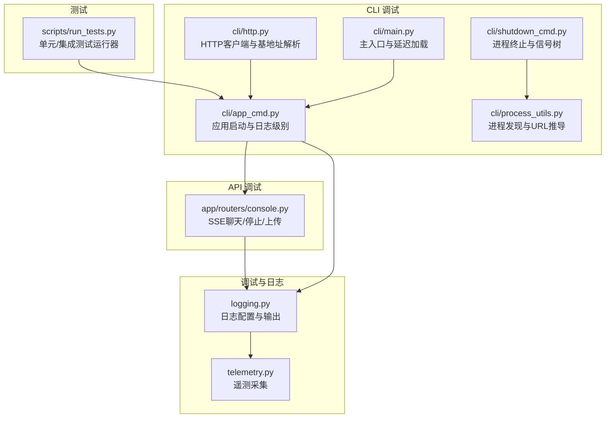
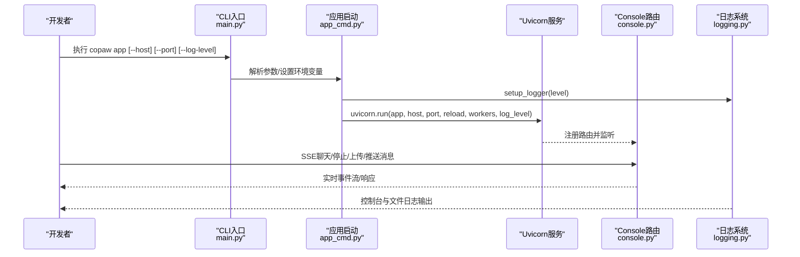
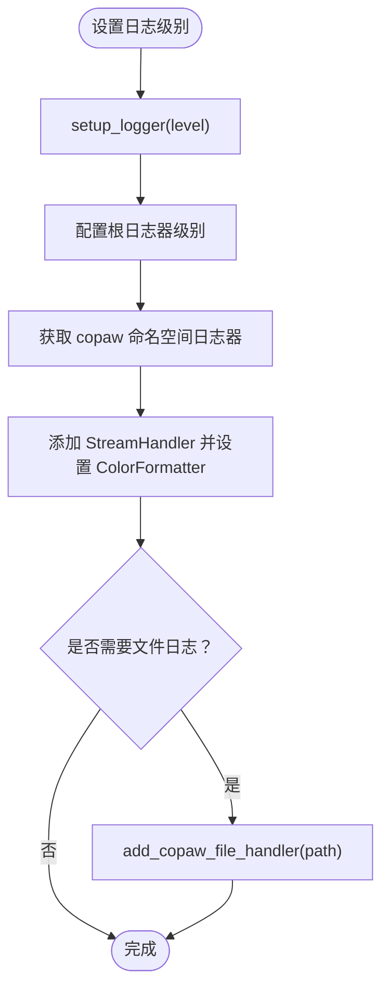
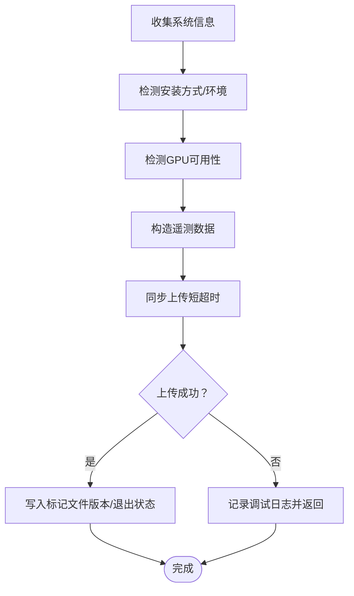
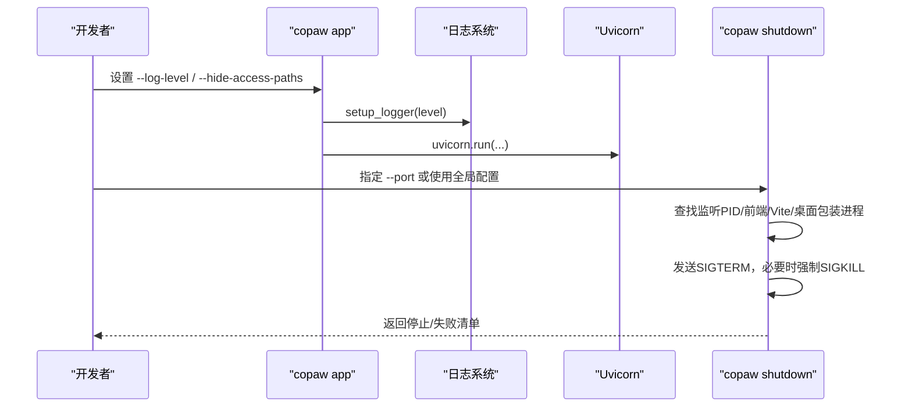
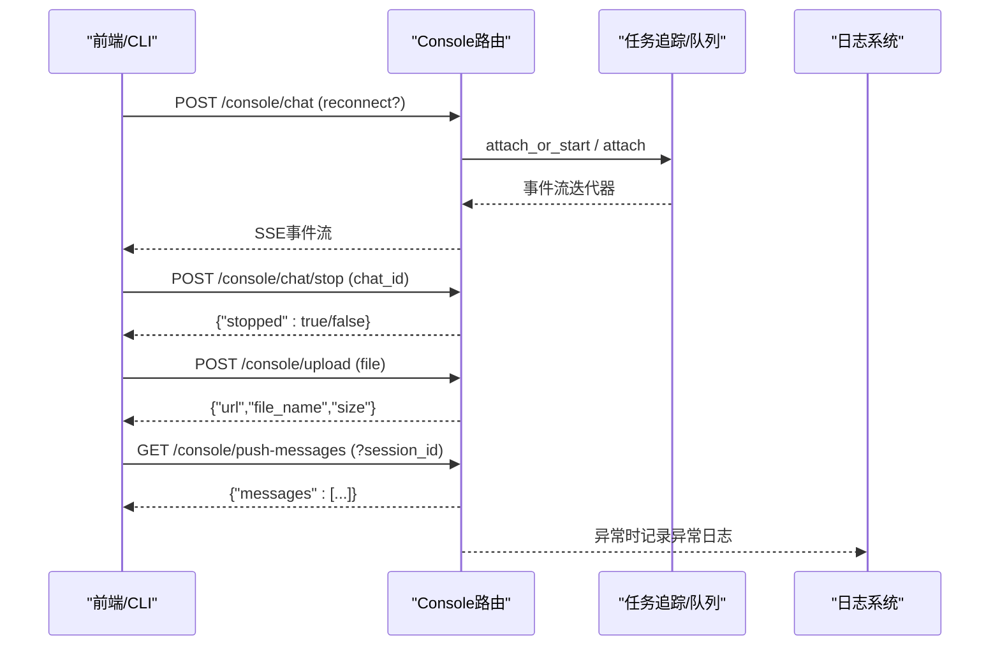
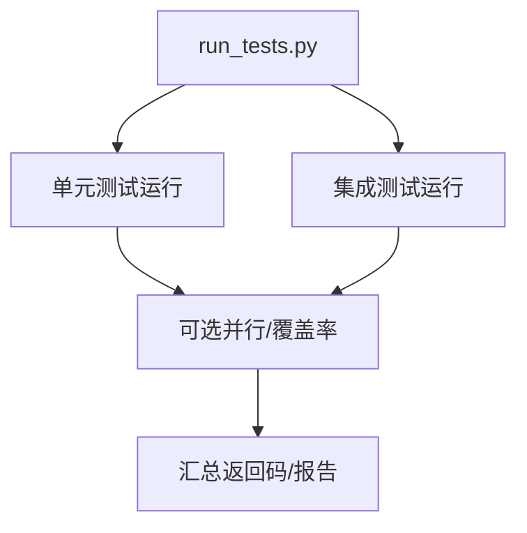
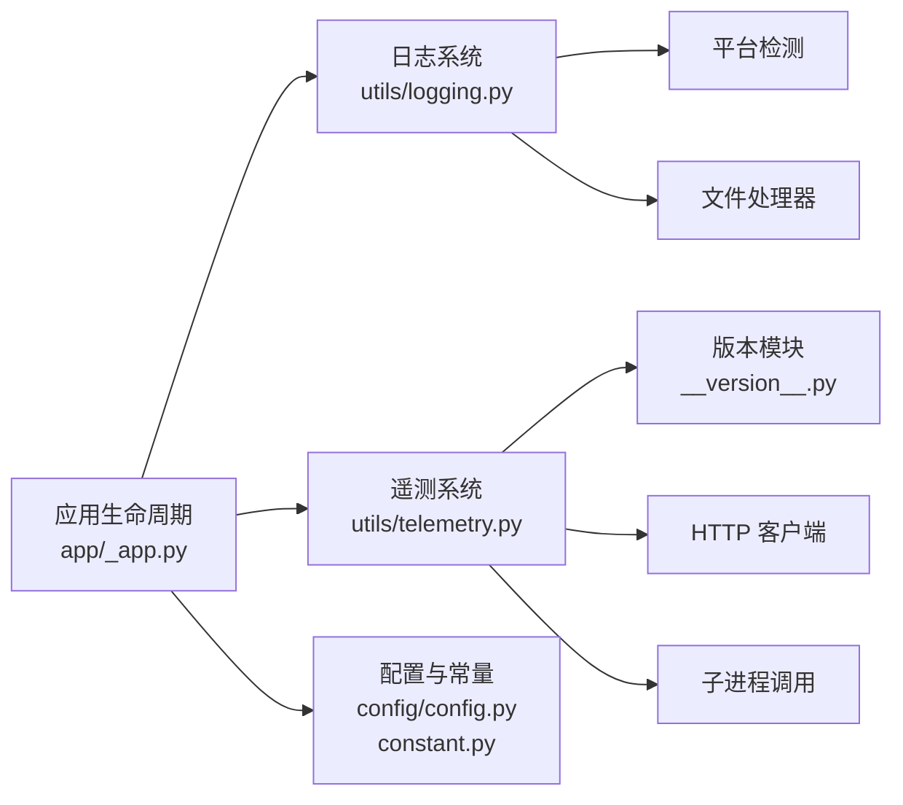

# 调试工具

<cite>
**本文引用的文件**
- [src/copaw/utils/logging.py](file://src/copaw/utils/logging.py)
- [specs/copaw-repowiki/content/开发指南/调试与故障排除.md](file://specs/copaw-repowiki/content/开发指南/调试与故障排除.md)
- [specs/copaw-repowiki/content/部署运维/监控与日志.md](file://specs/copaw-repowiki/content/部署运维/监控与日志.md)
- [specs/copaw-repowiki/content/开发指南/开发环境搭建.md](file://specs/copaw-repowiki/content/开发指南/开发环境搭建.md)
- [src/copaw/cli/main.py](file://src/copaw/cli/main.py)
- [src/copaw/cli/app_cmd.py](file://src/copaw/cli/app_cmd.py)
- [src/copaw/cli/http.py](file://src/copaw/cli/http.py)
- [src/copaw/cli/shutdown_cmd.py](file://src/copaw/cli/shutdown_cmd.py)
- [src/copaw/cli/process_utils.py](file://src/copaw/cli/process_utils.py)
- [src/copaw/app/routers/console.py](file://src/copaw/app/routers/console.py)
- [copaw/scripts/run_tests.py](file://copaw/scripts/run_tests.py)
- [src/copaw/utils/telemetry.py](file://src/copaw/utils/telemetry.py)
- [specs/copaw-repowiki/content/部署运维/备份与恢复.md](file://specs/copaw-repowiki/content/部署运维/备份与恢复.md)
</cite>

## 目录
1. [简介](#简介)
2. [项目结构](#项目结构)
3. [核心组件](#核心组件)
4. [架构总览](#架构总览)
5. [组件详解](#组件详解)
6. [依赖关系分析](#依赖关系分析)
7. [性能与日志特性](#性能与日志特性)
8. [故障排查指南](#故障排查指南)
9. [结论](#结论)
10. [附录](#附录)

## 简介
本指南面向开发者与运维人员，系统性介绍 CoPaw 内置调试能力与外部工具使用方法，覆盖日志系统配置与分析、断点调试、性能与内存分析、CLI 调试命令、API 调试接口、单元与集成测试编写与执行，以及远程与生产环境调试要点。文档基于仓库现有实现与文档，帮助你高效定位问题并提升排障效率。

## 项目结构
围绕调试主题的关键目录与文件：
- 日志与遥测：src/copaw/utils/logging.py、src/copaw/utils/telemetry.py
- CLI 调试命令：src/copaw/cli/main.py、src/copaw/cli/app_cmd.py、src/copaw/cli/shutdown_cmd.py、src/copaw/cli/process_utils.py、src/copaw/cli/http.py
- API 调试接口：src/copaw/app/routers/console.py
- 测试与覆盖率：copaw/scripts/run_tests.py
- 文档与流程图：specs/copaw-repowiki/content/开发指南/调试与故障排除.md、specs/copaw-repowiki/content/部署运维/监控与日志.md、specs/copaw-repowiki/content/部署运维/备份与恢复.md、specs/copaw-repowiki/content/开发指南/开发环境搭建.md

**图表来源**
- [src/copaw/utils/logging.py:104-185](file://src/copaw/utils/logging.py#L104-L185)
- [src/copaw/utils/telemetry.py:292-311](file://src/copaw/utils/telemetry.py#L292-L311)
- [src/copaw/cli/main.py:92-162](file://src/copaw/cli/main.py#L92-L162)
- [src/copaw/cli/app_cmd.py:55-112](file://src/copaw/cli/app_cmd.py#L55-L112)
- [src/copaw/cli/shutdown_cmd.py:303-383](file://src/copaw/cli/shutdown_cmd.py#L303-L383)
- [src/copaw/cli/process_utils.py:131-237](file://src/copaw/cli/process_utils.py#L131-L237)
- [src/copaw/cli/http.py:14-44](file://src/copaw/cli/http.py#L14-L44)
- [src/copaw/app/routers/console.py:68-216](file://src/copaw/app/routers/console.py#L68-L216)
- [copaw/scripts/run_tests.py:175-281](file://copaw/scripts/run_tests.py#L175-L281)

**章节来源**
- [src/copaw/utils/logging.py:104-185](file://src/copaw/utils/logging.py#L104-L185)
- [src/copaw/cli/main.py:92-162](file://src/copaw/cli/main.py#L92-L162)
- [src/copaw/cli/app_cmd.py:55-112](file://src/copaw/cli/app_cmd.py#L55-L112)
- [src/copaw/cli/shutdown_cmd.py:303-383](file://src/copaw/cli/shutdown_cmd.py#L303-L383)
- [src/copaw/cli/process_utils.py:131-237](file://src/copaw/cli/process_utils.py#L131-L237)
- [src/copaw/cli/http.py:14-44](file://src/copaw/cli/http.py#L14-L44)
- [src/copaw/app/routers/console.py:68-216](file://src/copaw/app/routers/console.py#L68-L216)
- [copaw/scripts/run_tests.py:175-281](file://copaw/scripts/run_tests.py#L175-L281)

## 核心组件
- 日志系统：统一命名空间、彩色控制台输出、可选文件处理器（平台差异化）、访问日志过滤、动态级别设置。
- 遥测系统：安装方式检测、系统信息聚合、同步上传、幂等标记文件。
- CLI 调试：应用启动、日志级别、访问日志过滤、优雅关闭、进程树管理。
- API 调试：SSE 聊天流、停止运行、文件上传、推送消息拉取。
- 测试框架：pytest 封装、覆盖率生成、并行执行、子目录分组运行。

**章节来源**
- [src/copaw/utils/logging.py:16-22](file://src/copaw/utils/logging.py#L16-L22)
- [src/copaw/utils/logging.py:104-185](file://src/copaw/utils/logging.py#L104-L185)
- [src/copaw/utils/telemetry.py:29-75](file://src/copaw/utils/telemetry.py#L29-L75)
- [src/copaw/cli/app_cmd.py:55-112](file://src/copaw/cli/app_cmd.py#L55-L112)
- [src/copaw/cli/shutdown_cmd.py:303-383](file://src/copaw/cli/shutdown_cmd.py#L303-L383)
- [src/copaw/app/routers/console.py:68-216](file://src/copaw/app/routers/console.py#L68-L216)
- [copaw/scripts/run_tests.py:175-281](file://copaw/scripts/run_tests.py#L175-L281)

## 架构总览
调试链路从 CLI 入口进入，经应用启动参数与日志初始化，绑定 FastAPI 应用并通过 SSE 提供交互式调试接口；同时提供进程管理与测试执行能力，形成“启动-运行-观测-终止”的闭环。

**图表来源**
- [src/copaw/cli/main.py:92-162](file://src/copaw/cli/main.py#L92-L162)
- [src/copaw/cli/app_cmd.py:55-112](file://src/copaw/cli/app_cmd.py#L55-L112)
- [src/copaw/app/routers/console.py:68-216](file://src/copaw/app/routers/console.py#L68-L216)
- [src/copaw/utils/logging.py:104-185](file://src/copaw/utils/logging.py#L104-L185)

## 组件详解

### 日志系统与配置
- 命名空间与级别
  - 仅输出 copaw.* 命名空间日志，避免第三方库噪声。
  - 支持字符串到数值级别的映射，动态设置根日志器与处理器级别。
- 输出格式
  - 控制台：彩色级别前缀、时间戳、源文件与行号、消息体。
  - 文件：Windows/Linux 使用简单文件处理器，macOS 使用轮转文件处理器（最大单文件 5MiB，保留 3 份）。
- 访问日志过滤
  - 可配置路径子串列表抑制 uvicorn access 日志，降低噪音。
- 初始化与文件处理器
  - 按平台差异化选择处理器，避免锁竞争；幂等添加，防止重复句柄。
- 关键日志点
  - 应用启动/停止、多代理管理初始化/停止、ProviderManager 获取实例、动态运行器查询与错误回传、配置变更与通道重载。

**图表来源**
- [src/copaw/utils/logging.py:104-185](file://src/copaw/utils/logging.py#L104-L185)

**章节来源**
- [src/copaw/utils/logging.py:16-22](file://src/copaw/utils/logging.py#L16-L22)
- [src/copaw/utils/logging.py:104-185](file://src/copaw/utils/logging.py#L104-L185)
- [specs/copaw-repowiki/content/开发指南/调试与故障排除.md:134-167](file://specs/copaw-repowiki/content/开发指南/调试与故障排除.md#L134-L167)
- [specs/copaw-repowiki/content/部署运维/监控与日志.md:138-175](file://specs/copaw-repowiki/content/部署运维/监控与日志.md#L138-L175)

### 遥测系统与分析
- 数据采集
  - 安装方式检测（容器/Docker/桌面/Pip），系统信息（OS、架构、Python 版本、GPU 检测）。
- 上传与幂等
  - 同步短超时上传，失败静默；使用标记文件记录已采集版本，支持永久退出选项。
- 性能影响
  - 短超时与失败降级，不影响启动；GPU 检测多策略回退，避免阻塞。

**图表来源**
- [src/copaw/utils/telemetry.py:29-75](file://src/copaw/utils/telemetry.py#L29-L75)
- [src/copaw/utils/telemetry.py:163-182](file://src/copaw/utils/telemetry.py#L163-L182)
- [src/copaw/utils/telemetry.py:194-290](file://src/copaw/utils/telemetry.py#L194-L290)

**章节来源**
- [src/copaw/utils/telemetry.py:29-75](file://src/copaw/utils/telemetry.py#L29-L75)
- [src/copaw/utils/telemetry.py:163-182](file://src/copaw/utils/telemetry.py#L163-L182)
- [src/copaw/utils/telemetry.py:194-290](file://src/copaw/utils/telemetry.py#L194-L290)
- [specs/copaw-repowiki/content/部署运维/监控与日志.md:251-314](file://specs/copaw-repowiki/content/部署运维/监控与日志.md#L251-L314)

### CLI 调试命令
- 应用启动（app）
  - 参数：host、port、reload、log-level、隐藏访问日志路径、workers（已弃用）。
  - 行为：持久化最近使用的 host/port；设置日志级别环境变量；在 debug/trace 下输出初始化耗时；可配置访问日志过滤；调用 uvicorn.run。
- 关闭应用（shutdown）
  - 行为：查找监听指定端口的后端 PID，识别前端 Vite 开发进程、桌面包装进程及 Windows 包装祖先进程；发送 SIGTERM，必要时强制 SIGKILL；等待退出或失败反馈。
- 进程工具（process_utils）
  - 行为：跨平台进程表、Windows 进程快照解析、命令行匹配、端口提取、主机候选推导。
- HTTP 工具（http）
  - 行为：统一基地址解析（优先命令行，其次全局 host/port），统一 JSON 输出。

**图表来源**
- [src/copaw/cli/app_cmd.py:55-112](file://src/copaw/cli/app_cmd.py#L55-L112)
- [src/copaw/utils/logging.py:104-185](file://src/copaw/utils/logging.py#L104-L185)
- [src/copaw/cli/shutdown_cmd.py:303-383](file://src/copaw/cli/shutdown_cmd.py#L303-L383)
- [src/copaw/cli/process_utils.py:131-237](file://src/copaw/cli/process_utils.py#L131-L237)
- [src/copaw/cli/http.py:27-44](file://src/copaw/cli/http.py#L27-L44)

**章节来源**
- [src/copaw/cli/app_cmd.py:55-112](file://src/copaw/cli/app_cmd.py#L55-L112)
- [src/copaw/cli/shutdown_cmd.py:303-383](file://src/copaw/cli/shutdown_cmd.py#L303-L383)
- [src/copaw/cli/process_utils.py:131-237](file://src/copaw/cli/process_utils.py#L131-L237)
- [src/copaw/cli/http.py:27-44](file://src/copaw/cli/http.py#L27-L44)
- [specs/copaw-repowiki/content/开发指南/开发环境搭建.md:286-299](file://specs/copaw-repowiki/content/开发指南/开发环境搭建.md#L286-L299)

### API 调试接口
- SSE 聊天流
  - POST /console/chat：流式返回事件，支持断连重连 reconnect=true；异常时返回错误事件。
- 停止运行
  - POST /console/chat/stop：按 chat_id 请求停止。
- 文件上传
  - POST /console/upload：限制最大 10MB，安全命名，保存至媒体目录并返回信息。
- 推送消息
  - GET /console/push-messages：按会话或最近消息拉取，便于前端观察后台事件。

**图表来源**
- [src/copaw/app/routers/console.py:68-216](file://src/copaw/app/routers/console.py#L68-L216)
- [src/copaw/utils/logging.py:104-185](file://src/copaw/utils/logging.py#L104-L185)

**章节来源**
- [src/copaw/app/routers/console.py:68-216](file://src/copaw/app/routers/console.py#L68-L216)

### 测试与覆盖率
- 运行器
  - 支持运行单元测试、集成测试、全部测试；可选覆盖率生成与并行执行（需 pytest-xdist）。
  - 单元测试按子目录分组运行，失败聚合返回码。
- 常用参数
  - -u/--unit [DIR]：运行指定子目录或全部单元测试。
  - -i/--integrated：运行集成测试。
  - -a/--all：默认行为，运行所有测试。
  - -c/--coverage：生成覆盖率报告（htmlcov/index.html）。
  - -p/--parallel：并行执行（需插件）。

**图表来源**
- [copaw/scripts/run_tests.py:175-281](file://copaw/scripts/run_tests.py#L175-L281)

**章节来源**
- [copaw/scripts/run_tests.py:175-281](file://copaw/scripts/run_tests.py#L175-L281)

## 依赖关系分析
- 日志系统依赖
  - 平台检测与 ANSI 支持、文件处理器按平台差异化。
- 遥测系统依赖
  - 版本模块、HTTP 客户端、子进程调用、标记文件幂等。
- 应用生命周期依赖
  - 常量模块提供日志级别环境变量、配置模块提供路径归一化与浏览器路径探测。

**图表来源**
- [src/copaw/utils/logging.py:28-46](file://src/copaw/utils/logging.py#L28-L46)
- [src/copaw/utils/logging.py:142-185](file://src/copaw/utils/logging.py#L142-L185)
- [src/copaw/utils/telemetry.py:172-182](file://src/copaw/utils/telemetry.py#L172-L182)
- [src/copaw/utils/telemetry.py:184-191](file://src/copaw/utils/telemetry.py#L184-L191)
- [src/copaw/app/_app.py:148-200](file://src/copaw/app/_app.py#L148-L200)
- [src/copaw/constant.py:72-121](file://src/copaw/constant.py#L72-L121)
- [src/copaw/config/config.py:1-120](file://src/copaw/config/config.py#L1-L120)
- [src/copaw/__version__.py:1-3](file://src/copaw/__version__.py#L1-L3)

**章节来源**
- [specs/copaw-repowiki/content/部署运维/监控与日志.md:266-314](file://specs/copaw-repowiki/content/部署运维/监控与日志.md#L266-L314)

## 性能与日志特性
- 日志性能
  - 控制台输出启用颜色与相对路径解析，开销较低；macOS 轮转避免单文件过大；Windows/Linux 简单文件处理器减少锁竞争。
- 遥测性能
  - 短超时同步上传，失败静默，不影响启动；GPU 检测多策略回退，避免阻塞。
- 进程与容器
  - 进程快照采用回退策略，避免阻塞；容器内优先使用系统浏览器路径，减少下载成本。

**章节来源**
- [src/copaw/utils/logging.py:171-176](file://src/copaw/utils/logging.py#L171-L176)
- [src/copaw/utils/telemetry.py:172-182](file://src/copaw/utils/telemetry.py#L172-L182)
- [src/copaw/cli/process_utils.py:85-129](file://src/copaw/cli/process_utils.py#L85-L129)

## 故障排查指南
- 启动与日志
  - 使用 --log-level 切换到 debug/trace，观察初始化耗时与关键日志点；通过 --hide-access-paths 抑制噪音。
  - 如需落盘，调用 add_copaw_file_handler 并确认平台差异处理（Windows/Linux 简单文件，macOS 轮转）。
- 进程与端口
  - 使用 copaw shutdown 指定 --port，自动查找后端监听 PID、前端 Vite 进程、桌面包装进程与 Windows 包装祖先进程；若失败，检查权限与进程存在性。
- API 调试
  - 通过 /console/chat 观察 SSE 事件流，断连后使用 reconnect=true 重连；使用 /console/chat/stop 停止运行；上传文件后检查媒体目录与大小限制。
- 测试与覆盖率
  - 使用 run_tests.py -u/-i/-a/-c/-p 执行测试与覆盖率；关注失败聚合返回码与 htmlcov 报告。
- 生产与远程
  - 使用日志轮转与文件落盘；结合外部日志收集（如 logrotate）与容器日志驱动；必要时通过 SSH/隧道连接远程服务，配合本地断点与日志分析。

**章节来源**
- [src/copaw/cli/app_cmd.py:55-112](file://src/copaw/cli/app_cmd.py#L55-L112)
- [src/copaw/utils/logging.py:142-185](file://src/copaw/utils/logging.py#L142-L185)
- [src/copaw/cli/shutdown_cmd.py:303-383](file://src/copaw/cli/shutdown_cmd.py#L303-L383)
- [src/copaw/app/routers/console.py:68-216](file://src/copaw/app/routers/console.py#L68-L216)
- [copaw/scripts/run_tests.py:175-281](file://copaw/scripts/run_tests.py#L175-L281)
- [specs/copaw-repowiki/content/部署运维/备份与恢复.md:172-213](file://specs/copaw-repowiki/content/部署运维/备份与恢复.md#L172-L213)

## 结论
通过统一的日志体系、完善的 CLI 调试命令、直观的 API 调试接口与可扩展的测试运行器，CoPaw 提供了从开发到生产的全链路调试能力。结合文档中的流程图与最佳实践，可在不同环境下快速定位问题并稳定交付。

## 附录
- IDE 调试建议
  - VSCode/PyCharm：指向虚拟环境 Python，后端附加 uvicorn 进程断点，前端使用 Vite 热重载。
- 远程调试要点
  - 使用 SSH 隧道或反向代理暴露服务；在 debug/trace 级别下收集日志；结合文件轮转与外部日志收集。

**章节来源**
- [specs/copaw-repowiki/content/开发指南/开发环境搭建.md:268-299](file://specs/copaw-repowiki/content/开发指南/开发环境搭建.md#L268-L299)