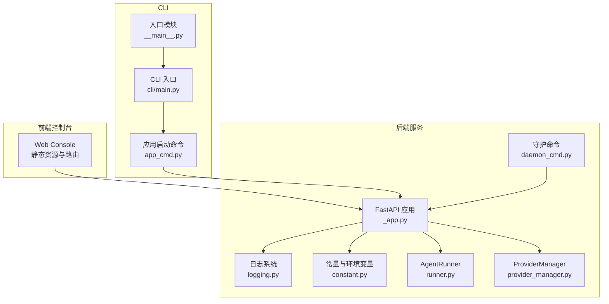
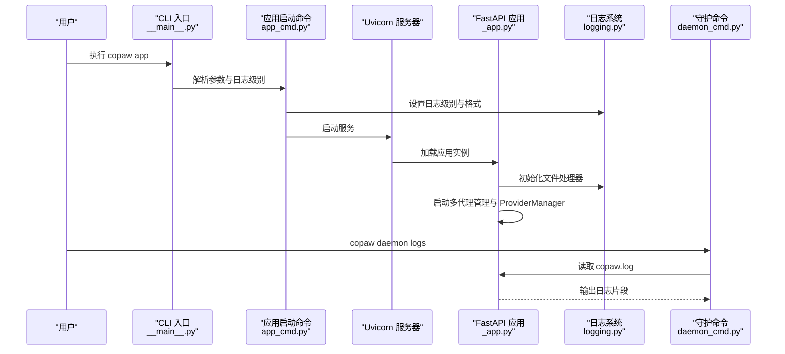
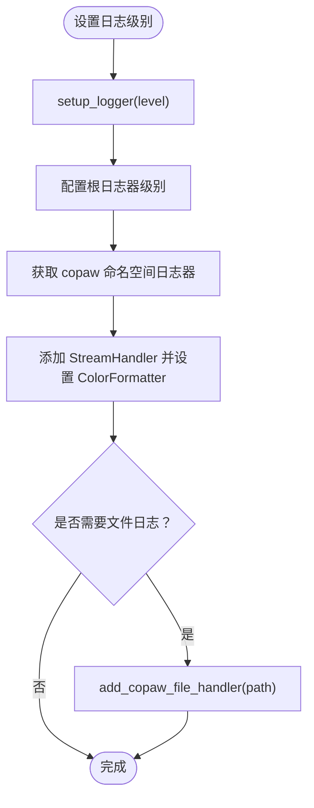
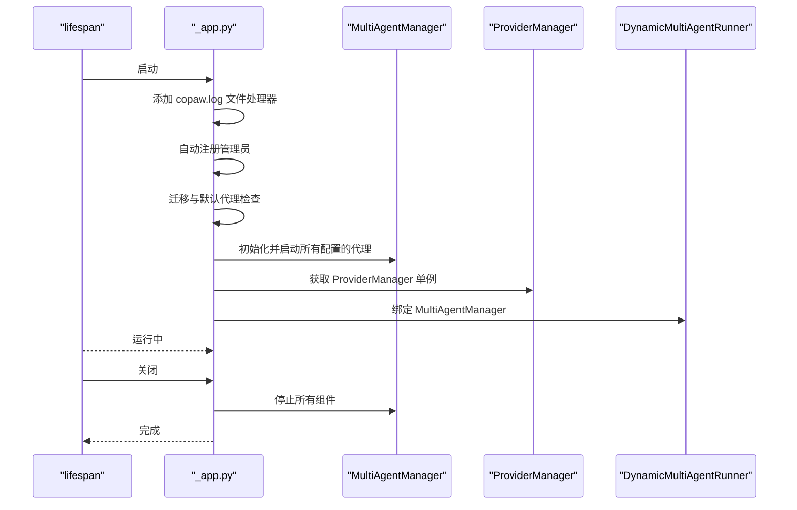
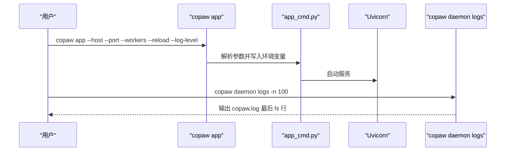
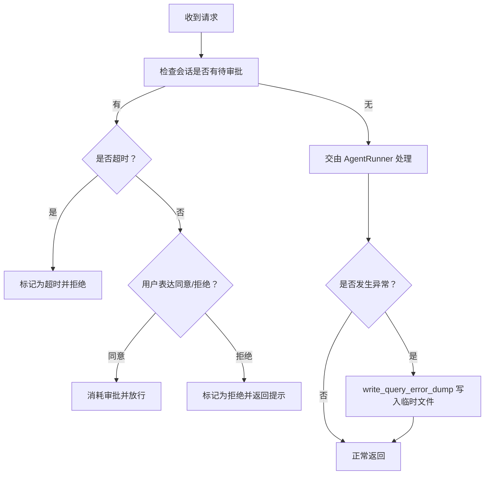
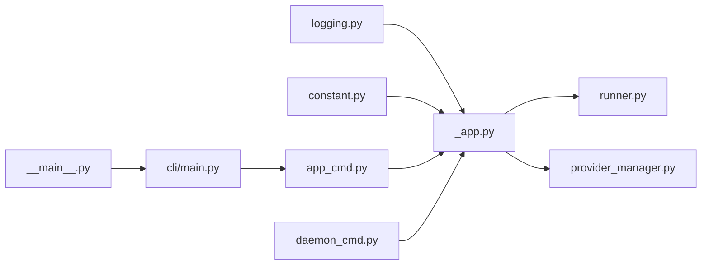

# 运行时错误

<cite>
**本文引用的文件**
- [调试与故障排除.md](file://specs/copaw-repowiki/content/开发指南/调试与故障排除.md)
- [query_error_dump.py](file://src/copaw/app/runner/query_error_dump.py)
- [react_agent.py](file://src/copaw/agents/react_agent.py)
- [error.ts](file://copaw/console/src/utils/error.ts)
- [scanError.ts](file://copaw/console/src/utils/scanError.ts)
- [useSkills.ts](file://copaw/console/src/pages/Agent/Skills/useSkills.ts)
- [代理并发控制机制.md](file://specs/copaw-repowiki/content/系统架构/多代理系统架构/代理并发控制机制.md)
- [懒加载机制.md](file://specs/copaw-repowiki/content/核心功能/多代理管理系统/懒加载机制.md)
- [零停机重载.md](file://specs/copaw-repowiki/content/核心功能/多代理管理系统/零停机重载.md)
- [多代理生命周期管理.md](file://specs/copaw-repowiki/content/系统架构/多代理系统架构/多代理生命周期管理.md)
- [本地模型支持.md](file://specs/copaw-repowiki/content/项目概述/核心功能/本地模型支持/本地模型支持.md)
- [llama.cpp后端.md](file://specs/copaw-repowiki/content/项目概述/核心功能/本地模型支持/llama.cpp后端.md)
- [插件化架构/提供者插件系统/本地模型支持.md](file://specs/copaw-repowiki/content/系统架构/插件化架构/提供者插件系统/本地模型支持.md)
- [内存管理系统.md](file://specs/copaw-repowiki/content/项目概述/核心功能/智能代理系统/内存管理系统.md)
- [QQ渠道集成.md](file://specs/copaw-repowiki/content/核心功能/聊天渠道系统/QQ渠道集成.md)
- [聊天渠道系统.md](file://specs/copaw-repowiki/content/核心功能/聊天渠道系统/聊天渠道系统.md)
- [技能管理API.md](file://specs/copaw-repowiki/content/API参考/REST API/技能管理API.md)
- [errors.py](file://main-project/backend/app/errors.py)
- [compliance.tsx](file://main-project/frontend/src/pages/Compliance.tsx)
</cite>

## 目录
1. [简介](#简介)
2. [项目结构](#项目结构)
3. [核心组件](#核心组件)
4. [架构总览](#架构总览)
5. [详细组件分析](#详细组件分析)
6. [依赖分析](#依赖分析)
7. [性能考虑](#性能考虑)
8. [故障排除指南](#故障排除指南)
9. [结论](#结论)
10. [附录](#附录)

## 简介
本指南聚焦于运行时错误的系统化故障排除，覆盖代理启动失败、技能执行错误、渠道连接问题、模型加载异常等常见场景，并提供多Agent协作中的并发问题、内存溢出与资源竞争排查方法。文档基于仓库中的实际实现与文档，强调可操作的诊断流程、日志分析、堆栈跟踪解读与错误代码定位，辅以调试工具与性能监控技巧。

## 项目结构
CoPaw 采用“Python 后端 + 前端控制台”的分层架构：后端通过 FastAPI 提供 API 与 Web Console；CLI 负责应用启动、守护进程命令与日志查看；日志系统统一由 Python 模块管理；运行期通过多工作区/多代理机制承载不同会话与能力。

图表来源
- [调试与故障排除.md:37-75](file://specs/copaw-repowiki/content/开发指南/调试与故障排除.md#L37-L75)

章节来源
- [调试与故障排除.md:34-84](file://specs/copaw-repowiki/content/开发指南/调试与故障排除.md#L34-L84)

## 核心组件
- 日志系统：统一命名空间、彩色终端输出、可选文件落盘、访问日志过滤。
- 应用生命周期：启动、迁移、多代理管理、关闭清理。
- CLI 与守护：应用启动、守护状态/重启/重载配置/版本/日志查看。
- 运行器：消息处理、工具调用审批、错误转储。
- 提供商管理：统一模型提供商注册与默认提供商定义。
- 常量与环境：工作目录、日志级别、CORS、LLM 重试等。

章节来源
- [调试与故障排除.md:86-101](file://specs/copaw-repowiki/content/开发指南/调试与故障排除.md#L86-L101)

## 架构总览
下图展示从 CLI 到后端服务、日志与守护命令的关键交互路径，帮助快速定位问题来源。

图表来源
- [调试与故障排除.md:106-133](file://specs/copaw-repowiki/content/开发指南/调试与故障排除.md#L106-L133)

## 详细组件分析

### 日志系统与使用方法
- 日志命名空间：仅输出 copaw.* 命名空间下的日志，避免第三方库噪声。
- 终端输出：彩色格式，包含时间戳、级别、源文件与行号；非终端输出自动去色。
- 文件落盘：按平台选择 FileHandler 或 RotatingFileHandler，最大 5MiB，保留 3 份备份；Windows/Linux 使用简单文件句柄以避免锁问题。
- 访问日志过滤：可按路径子串抑制 uvicorn access 日志，减少噪音。
- 日志级别：支持 critical/error/warning/info/debug/trace；trace 为更细粒度调试。
- 关键日志点：
  - 应用启动完成、停止完成
  - 多代理管理初始化与停止
  - ProviderManager 获取实例
  - 动态多代理运行器查询与错误回传
  - 配置变更与通道重载

图表来源
- [调试与故障排除.md:149-162](file://specs/copaw-repowiki/content/开发指南/调试与故障排除.md#L149-L162)

章节来源
- [调试与故障排除.md:136-167](file://specs/copaw-repowiki/content/开发指南/调试与故障排除.md#L136-L167)

### 应用生命周期与关键日志点
- 生命周期钩子：lifespan 在启动阶段注册管理员、初始化多代理管理器、ProviderManager，并在关闭时停止所有组件。
- 关键日志点：
  - 检查遗留配置迁移
  - 初始化 MultiAgentManager
  - ProviderManager 单例获取
  - 动态多代理运行器设置与查询
  - 应用启动/停止完成

图表来源
- [调试与故障排除.md:178-199](file://specs/copaw-repowiki/content/开发指南/调试与故障排除.md#L178-L199)

章节来源
- [调试与故障排除.md:169-202](file://specs/copaw-repowiki/content/开发指南/调试与故障排除.md#L169-L202)

### CLI 启动与守护命令
- 应用启动命令：解析 host/port、workers、reload、log-level；持久化最后使用的 API 地址；根据 log-level 决定是否输出初始化耗时；可隐藏特定访问日志路径。
- 守护命令：status/restart/reload-config/version/logs；logs 支持指定行数范围（1..2000）。

图表来源
- [调试与故障排除.md:208-225](file://specs/copaw-repowiki/content/开发指南/调试与故障排除.md#L208-L225)

章节来源
- [调试与故障排除.md:204-228](file://specs/copaw-repowiki/content/开发指南/调试与故障排除.md#L204-L228)

### 运行器与错误转储
- AgentRunner：处理消息、解析待审批工具调用、超时/批准/拒绝逻辑；对错误进行转储，包含请求上下文、异常类型/消息、堆栈与代理状态快照。
- 错误转储文件：临时文件，包含 UTC 时间戳、请求摘要、完整请求对象、代理状态序列化结果与堆栈字符串。

图表来源
- [调试与故障排除.md:234-251](file://specs/copaw-repowiki/content/开发指南/调试与故障排除.md#L234-L251)

章节来源
- [调试与故障排除.md:230-256](file://specs/copaw-repowiki/content/开发指南/调试与故障排除.md#L230-L256)

### 提供商管理与模型路由
- ProviderManager：集中管理内置与自定义提供商，提供统一接口；内置多种提供商与默认模型列表；支持本地模型后端。
- 关键点：默认提供商定义、模型槽位配置、连接检查与冻结 URL 等策略。

章节来源
- [调试与故障排除.md:257-262](file://specs/copaw-repowiki/content/开发指南/调试与故障排除.md#L257-L262)

### 配置变更监听与通道热重载
- AgentConfigWatcher：比较通道配置哈希，发现变化则逐个通道重载，记录日志便于追踪。

章节来源
- [调试与故障排除.md:264-268](file://specs/copaw-repowiki/content/开发指南/调试与故障排除.md#L264-L268)

## 依赖分析
- 日志系统依赖 Python 标准库 logging 与 handlers；在 Windows 上启用 ANSI 支持；按平台选择文件处理器。
- 应用依赖 FastAPI、CORSMiddleware、静态资源挂载；在启动时加载环境变量与配置。
- CLI 依赖 Click；守护命令依赖运行时上下文与工作目录。
- 运行器依赖 agentscope 的 Runner 接口与消息协议；错误转储依赖临时文件与 JSON 序列化。
- 提供商管理依赖 agentscope 的 ChatModelBase 与各提供商实现。

图表来源
- [调试与故障排除.md:277-298](file://specs/copaw-repowiki/content/开发指南/调试与故障排除.md#L277-L298)

章节来源
- [调试与故障排除.md:270-309](file://specs/copaw-repowiki/content/开发指南/调试与故障排除.md#L270-L309)

## 性能考虑
- 日志级别：生产环境建议 info；调试时使用 debug/trace，注意 trace 会产生大量日志。
- 访问日志过滤：通过 hide-access-paths 减少高频接口日志干扰。
- 多工作区与多代理：合理设置 workers 与内存阈值，避免并发过高导致抖动。
- 模型提供商：合理配置 LLM 重试次数与退避参数，避免瞬时错误放大。
- 静态资源：确保 MIME 类型正确，避免浏览器重复下载或缓存问题。

## 故障排除指南

### 通用诊断流程
- 确认日志级别与输出位置：使用 copaw app --log-level debug/trace，观察控制台与 copaw.log。
- 查看最近日志：copaw daemon logs -n 200，定位异常时间段。
- 检查工作目录与权限：确认 WORKING_DIR 可写，媒体与模型目录存在。
- 验证环境变量：COPAW_LOG_LEVEL、COPAW_CORS_ORIGINS、COPAW_LLM_MAX_RETRIES 等。

章节来源
- [调试与故障排除.md:320-329](file://specs/copaw-repowiki/content/开发指南/调试与故障排除.md#L320-L329)

### 代理无法启动
- 症状：应用启动后无响应或报错退出。
- 排查步骤：
  - 提升日志级别到 debug/trace，观察启动阶段日志（迁移、多代理初始化、ProviderManager 获取）。
  - 检查工作目录是否存在、权限是否足够。
  - 若使用容器，确认数据卷挂载与端口映射正确。
  - 关注应用生命周期日志点：启动完成、停止完成。
- 相关日志点
  - 启动阶段：迁移与默认代理检查、MultiAgentManager 初始化、ProviderManager 获取。
  - 停止阶段：停止 MultiAgentManager。

章节来源
- [调试与故障排除.md:331-341](file://specs/copaw-repowiki/content/开发指南/调试与故障排除.md#L331-L341)

### 渠道连接失败
- 症状：特定渠道无法接收/发送消息，或出现 HTTP 错误。
- 排查步骤：
  - 确认渠道配置（如 token、URL、代理）正确。
  - 查看渠道相关日志与错误转储文件（若产生）。
  - 对于 QQ 等渠道，关注 HTTP 请求与响应体截断信息。
- 相关日志点
  - 渠道配置变更与重载（AgentConfigWatcher）。
  - 运行器处理消息与工具调用审批。

章节来源
- [调试与故障排除.md:345-358](file://specs/copaw-repowiki/content/开发指南/调试与故障排除.md#L345-L358)

### 模型调用异常
- 症状：调用提供商失败、超时、返回空结果。
- 排查步骤：
  - 检查 API Key、Base URL、代理设置。
  - 调整 LLM 重试次数与退避参数。
  - 使用 ProviderManager 的连接检查能力（如可用）。
  - 观察运行器错误转储，提取请求上下文与堆栈。
- 相关日志点
  - ProviderManager 单例获取。
  - AgentRunner 查询处理与错误转储。

章节来源
- [调试与故障排除.md:359-374](file://specs/copaw-repowiki/content/开发指南/调试与故障排除.md#L359-L374)

### 技能执行错误
- 症状：技能启用/禁用失败、扫描阻断、上传 ZIP 失败。
- 排查步骤：
  - 检查技能清单与来源（builtin/customized）。
  - 查看安全扫描结果与阻断详情。
  - 确认 ZIP 类型与大小限制。
  - 关注运行器错误转储与堆栈。
- 相关日志点
  - 技能管理路由与状态变更。
  - 安全扫描与阻断处理。
  - AgentRunner 查询处理与错误转储。

章节来源
- [调试与故障排除.md:375-384](file://specs/copaw-repowiki/content/开发指南/调试与故障排除.md#L375-L384)

### 多Agent协作中的并发问题
- 症状：任务无法停止或超时、热重载后旧实例未停止、会话状态读写异常、聊天规范并发冲突、下载任务状态异常。
- 排查步骤：
  - 检查 TaskTracker.request_stop 是否被调用，以及 wait_all_done 的超时参数设置。
  - 若存在大量订阅队列且长时间未消费，可能导致队列满而被修剪，需检查客户端消费逻辑。
  - 确认 MultiAgentManager 是否检测到旧实例仍有活跃任务；若等待超时，系统会强制停止。
  - 查看延迟清理任务的回调日志，确认异常与取消状态。
  - SafeJSONSession 在文件不存在时可选择跳过加载；若需要严格校验，应允许 NotExist 行为或捕获异常。
  - ChatManager 的 CRUD 操作受 asyncio.Lock 保护；若出现阻塞，检查是否存在长时间持有锁的操作。
  - 仅对 PENDING/DOWNLOADING 状态的任务允许取消；对已完成任务的取消会被忽略。
- 相关日志点
  - TaskTracker 的任务状态与等待。
  - MultiAgentManager 的热重载与清理。
  - SafeJSONSession 的文件 I/O。
  - ChatManager 的并发控制。
  - 下载任务存储的状态管理。

章节来源
- [代理并发控制机制.md:347-367](file://specs/copaw-repowiki/content/系统架构/多代理系统架构/代理并发控制机制.md#L347-L367)

### 内存溢出与资源竞争
- 症状：ReMe 未启动、嵌入不可用或配置缺失、阈值设置过低、检索结果为空或质量差、MD 文件读写异常。
- 排查步骤：
  - 确认 MemoryManager 初始化成功且已启动。
  - 检查嵌入配置优先级与环境变量。
  - 适当降低 min_score，扩大候选倍数。
  - 确认文件存在与编码正确。
- 相关日志点
  - ReMeLightMemoryManager 的启动与关闭。
  - MemoryManager 的上下文检查与压缩。
  - AgentMdManager 的文件读写。

章节来源
- [内存管理系统.md:380-401](file://specs/copaw-repowiki/content/项目概述/核心功能/智能代理系统/内存管理系统.md#L380-L401)

### 本地模型加载异常
- 症状：依赖缺失、模型不完整（MLX）、下载任务异常、推理异常、资源释放问题。
- 排查步骤：
  - 安装可选依赖以启用 llamacpp/MLX 后端。
  - 确认模型文件为 GGUF 或 MLX 目录包含必需文件。
  - 检查下载任务 ID、取消状态与后台协程日志。
  - 若<think>或<tool_call>标签未闭合，解析器会保留部分文本，前端应正确处理“开放标签”场景。
  - 使用工厂的单例复用与卸载逻辑，避免重复加载导致的内存压力。
- 相关日志点
  - llama.cpp/MLX 后端的初始化与推理。
  - LocalModels 管理器的下载与状态。
  - LocalChatModel 的异步执行与线程池。

章节来源
- [本地模型支持.md:412-423](file://specs/copaw-repowiki/content/项目概述/核心功能/本地模型支持/本地模型支持.md#L412-L423)
- [llama.cpp后端.md:385-425](file://specs/copaw-repowiki/content/项目概述/核心功能/本地模型支持/llama.cpp后端.md#L385-L425)
- [插件化架构/提供者插件系统/本地模型支持.md:372-395](file://specs/copaw-repowiki/content/系统架构/插件化架构/提供者插件系统/本地模型支持.md#L372-L395)

### 渠道连接问题（QQ）
- 症状：WebSocket 连接不稳定、心跳异常、断线重连失败、令牌刷新。
- 排查步骤：
  - 检查 Hello 消息与 IDENTIFY/RESUME 流程。
  - 验证心跳间隔与定时器。
  - 查看重连延迟、指数退避与最大重连次数。
  - 当会话无效且不可恢复时，清除令牌缓存并重新获取。
- 相关日志点
  - QQ 渠道的连接管理与心跳控制。
  - 断线重连与令牌刷新逻辑。

章节来源
- [QQ渠道集成.md:257-286](file://specs/copaw-repowiki/content/核心功能/聊天渠道系统/QQ渠道集成.md#L257-L286)

### 错误信息解读与堆栈跟踪
- 错误转储：当运行器捕获异常时，会生成临时 JSON 文件，包含：
  - 异常类型与消息
  - 请求摘要（会话、用户、渠道）
  - 完整请求对象
  - 代理状态快照
  - UTC 时间戳与堆栈字符串
- 建议：在提交 Bug 报告前，附上对应时间段的日志与错误转储文件路径。

章节来源
- [调试与故障排除.md:392-402](file://specs/copaw-repowiki/content/开发指南/调试与故障排除.md#L392-L402)

### 如何收集诊断信息与提交有效 Bug 报告
- 必备信息
  - 版本号：copaw --version 或 /api/version
  - 日志级别与日志片段（至少 200 行）
  - 错误转储文件（如有）
  - 配置文件（脱敏敏感信息）
  - 操作系统与部署方式（本地/容器/桌面应用）
- 提交渠道
  - 参考项目文档中的贡献与问题反馈说明，按模板填写。

章节来源
- [调试与故障排除.md:404-416](file://specs/copaw-repowiki/content/开发指南/调试与故障排除.md#L404-L416)

## 结论
通过统一的日志体系、清晰的生命周期钩子、完善的 CLI 与守护命令、以及运行期错误转储机制，CoPaw 能够在复杂场景下提供可靠的调试与故障排除能力。建议在日常运维中固定使用 info 级别，按需开启 debug/trace，并配合守护命令与错误转储文件进行问题定位与报告。

## 附录
- 常用命令
  - 启动应用：copaw app --host --port --workers --reload --log-level
  - 查看日志：copaw daemon logs -n 200
  - 版本信息：copaw daemon version
  - 重载配置：copaw daemon reload-config
- 关键环境变量
  - COPAW_LOG_LEVEL：日志级别
  - COPAW_CORS_ORIGINS：允许的跨域来源
  - COPAW_LLM_MAX_RETRIES：LLM 最大重试次数
  - COPAW_WORKING_DIR：工作目录
  - PLAYWRIGHT_CHROMIUM_EXECUTABLE_PATH：Playwright 可执行路径（容器场景）

章节来源
- [调试与故障排除.md:420-437](file://specs/copaw-repowiki/content/开发指南/调试与故障排除.md#L420-L437)