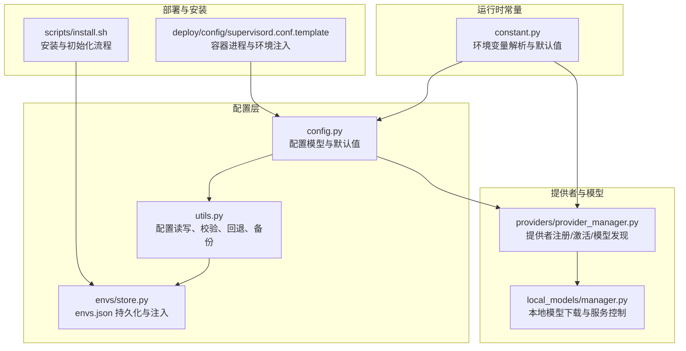
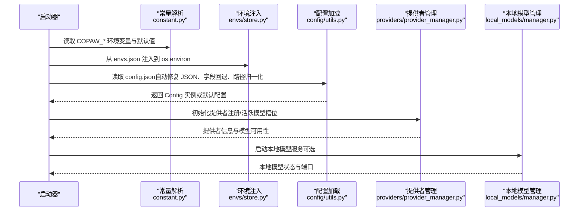
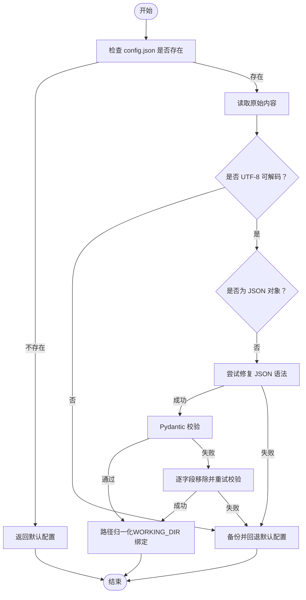
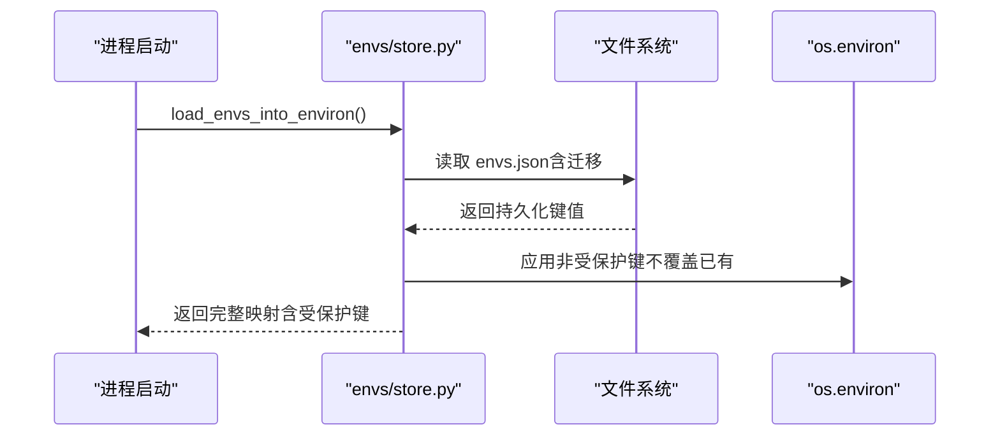
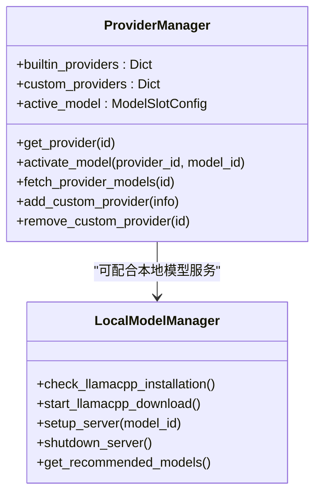
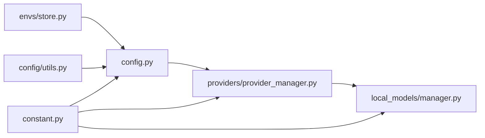

# 配置问题

<cite>
**本文引用的文件**   
- [config.py](file://copaw/src/copaw/config/config.py)
- [utils.py](file://copaw/src/copaw/config/utils.py)
- [store.py](file://copaw/src/copaw/envs/store.py)
- [provider_manager.py](file://copaw/src/copaw/providers/provider_manager.py)
- [manager.py](file://copaw/src/copaw/local_models/manager.py)
- [constant.py](file://copaw/src/copaw/constant.py)
- [supervisord.conf.template](file://copaw/deploy/config/supervisord.conf.template)
- [install.sh](file://copaw/scripts/install.sh)
</cite>

## 目录
1. [简介](#简介)
2. [项目结构](#项目结构)
3. [核心组件](#核心组件)
4. [架构总览](#架构总览)
5. [详细组件分析](#详细组件分析)
6. [依赖分析](#依赖分析)
7. [性能考虑](#性能考虑)
8. [故障排查指南](#故障排查指南)
9. [结论](#结论)
10. [附录](#附录)

## 简介
本指南聚焦于配置问题的排查与修复，覆盖以下方面：
- 环境变量配置：工作目录、密钥存储、容器运行、并发与限流、CORS、日志级别等
- 服务配置文件：config.json 的加载、校验、回退与备份、字段兼容处理
- 代理配置：通道层（如 Discord、Telegram）与浏览器自动化层（Playwright）的代理设置
- 模型提供者配置：内置与自定义提供者、活跃模型槽位、模型能力探测
- 配置热更新与回滚：配置文件变更后的安全回退与备份策略
- 配置模板与示例：安装脚本与部署模板中的关键环境变量与默认值
- 生产与开发环境差异：日志级别、文档开关、CORS、容器化运行等

## 项目结构
围绕配置的关键模块与文件如下：
- 配置模型与加载：config.py、utils.py
- 环境变量持久化与注入：envs/store.py
- 模型提供者与本地模型：providers/provider_manager.py、local_models/manager.py
- 常量与环境变量解析：constant.py
- 部署与容器：deploy/config/supervisord.conf.template
- 安装与初始化：scripts/install.sh

**图表来源**
- [config.py](file://copaw/src/copaw/config/config.py)
- [utils.py](file://copaw/src/copaw/config/utils.py)
- [store.py](file://copaw/src/copaw/envs/store.py)
- [provider_manager.py](file://copaw/src/copaw/providers/provider_manager.py)
- [manager.py](file://copaw/src/copaw/local_models/manager.py)
- [constant.py](file://copaw/src/copaw/constant.py)
- [supervisord.conf.template](file://copaw/deploy/config/supervisord.conf.template)
- [install.sh](file://copaw/scripts/install.sh)

**章节来源**
- [config.py](file://copaw/src/copaw/config/config.py)
- [utils.py](file://copaw/src/copaw/config/utils.py)
- [store.py](file://copaw/src/copaw/envs/store.py)
- [provider_manager.py](file://copaw/src/copaw/providers/provider_manager.py)
- [manager.py](file://copaw/src/copaw/local_models/manager.py)
- [constant.py](file://copaw/src/copaw/constant.py)
- [supervisord.conf.template](file://copaw/deploy/config/supervisord.conf.template)
- [install.sh](file://copaw/scripts/install.sh)

## 核心组件
- 配置模型与默认值：定义了通道配置、心跳、运行时行为、嵌入、上下文压缩、工具结果压缩、记忆摘要、代理运行配置、LLM 路由、代理档案与全局代理配置等
- 配置加载与校验：支持 JSON 修复、字段移除回退、路径归一化、工作目录绑定路径迁移
- 环境变量持久化与注入：envs.json 两层持久化策略（磁盘+进程），启动时安全注入，保护敏感键不注入进程
- 提供者管理：内置与自定义提供者注册、活跃模型槽位、模型能力探测、本地模型服务生命周期
- 运行时常量：统一解析 COPAW_* 环境变量，提供默认值与类型约束；容器检测、浏览器路径探测等

**章节来源**
- [config.py](file://copaw/src/copaw/config/config.py)
- [utils.py](file://copaw/src/copaw/config/utils.py)
- [store.py](file://copaw/src/copaw/envs/store.py)
- [provider_manager.py](file://copaw/src/copaw/providers/provider_manager.py)
- [manager.py](file://copaw/src/copaw/local_models/manager.py)
- [constant.py](file://copaw/src/copaw/constant.py)

## 架构总览
配置系统在启动时按顺序执行：
- 解析常量与环境变量（constant.py）
- 从 envs.json 注入到 os.environ（store.py）
- 读取 config.json 并进行 JSON 修复与校验（utils.py）
- 归一化工作目录绑定路径（utils.py）
- 加载并应用通道、提供者、本地模型配置（config.py + provider_manager.py + manager.py）

**图表来源**
- [constant.py](file://copaw/src/copaw/constant.py)
- [store.py](file://copaw/src/copaw/envs/store.py)
- [utils.py](file://copaw/src/copaw/config/utils.py)
- [config.py](file://copaw/src/copaw/config/config.py)
- [provider_manager.py](file://copaw/src/copaw/providers/provider_manager.py)
- [manager.py](file://copaw/src/copaw/local_models/manager.py)

## 详细组件分析

### 配置文件加载与校验（config.json）
- 文件位置：由常量决定，默认位于工作目录下的 config.json
- 自动修复：对常见 JSON 语法问题（尾随逗号、缺失引号、注释、BOM）进行修复
- 字段兼容：对旧字段（如 last_api_host/port）进行向后兼容映射
- 校验失败回退：若修复无效或仍校验失败，自动备份原文件并回退到默认配置
- 路径归一化：将旧的 ~/.copaw 绑定路径迁移到当前 WORKING_DIR

**图表来源**
- [utils.py](file://copaw/src/copaw/config/utils.py)

**章节来源**
- [utils.py](file://copaw/src/copaw/config/utils.py)
- [constant.py](file://copaw/src/copaw/constant.py)

### 环境变量持久化与注入（envs.json）
- 两层持久化：envs.json（安全目录）+ os.environ（进程）
- 启动注入：仅注入非受保护键，避免覆盖显式系统/运行时环境
- 安全权限：确保 envs.json 的父目录与文件权限最小化
- 迁移策略：从历史候选路径复制到安全目录一次

**图表来源**
- [store.py](file://copaw/src/copaw/envs/store.py)

**章节来源**
- [store.py](file://copaw/src/copaw/envs/store.py)

### 模型提供者与本地模型
- 提供者注册：内置提供者（OpenAI、Azure OpenAI、Anthropic、Gemini、Ollama、LM Studio 等）与自定义提供者
- 活跃模型槽位：通过 ProviderManager 激活 provider_id + model_id，并持久化
- 模型能力探测：对未知多模态能力的模型进行异步探测
- 本地模型：llama.cpp 二进制与模型下载、服务启动/停止、进度与状态查询

**图表来源**
- [provider_manager.py](file://copaw/src/copaw/providers/provider_manager.py)
- [manager.py](file://copaw/src/copaw/local_models/manager.py)

**章节来源**
- [provider_manager.py](file://copaw/src/copaw/providers/provider_manager.py)
- [manager.py](file://copaw/src/copaw/local_models/manager.py)

### 通道配置与代理
- 通道基类与各平台配置：Discord、Telegram、DingTalk、Feishu、QQ、WeCom、Weixin、MQTT、Console、Matrix、Voice、XiaoYi 等
- 代理设置：部分通道支持 http_proxy、http_proxy_auth；浏览器自动化层支持 PLAYWRIGHT_CHROMIUM_EXECUTABLE_PATH 环境变量
- 容器运行：COPAW_RUNNING_IN_CONTAINER 控制容器内行为（如浏览器路径探测）

**章节来源**
- [config.py](file://copaw/src/copaw/config/config.py)
- [constant.py](file://copaw/src/copaw/constant.py)

## 依赖分析
- 配置模型依赖 Pydantic 进行强类型校验与序列化
- 配置加载依赖 JSON 修复库以提升容错
- 环境变量持久化依赖安全权限与迁移逻辑
- 提供者管理依赖 SECRET_DIR 下的 providers 存储，区分内置与自定义
- 本地模型管理依赖 llama.cpp 二进制与模型仓库

**图表来源**
- [constant.py](file://copaw/src/copaw/constant.py)
- [config.py](file://copaw/src/copaw/config/config.py)
- [utils.py](file://copaw/src/copaw/config/utils.py)
- [store.py](file://copaw/src/copaw/envs/store.py)
- [provider_manager.py](file://copaw/src/copaw/providers/provider_manager.py)
- [manager.py](file://copaw/src/copaw/local_models/manager.py)

**章节来源**
- [constant.py](file://copaw/src/copaw/constant.py)
- [config.py](file://copaw/src/copaw/config/config.py)
- [utils.py](file://copaw/src/copaw/config/utils.py)
- [store.py](file://copaw/src/copaw/envs/store.py)
- [provider_manager.py](file://copaw/src/copaw/providers/provider_manager.py)
- [manager.py](file://copaw/src/copaw/local_models/manager.py)

## 性能考虑
- LLM 并发与限流：通过最大并发、每分钟请求数、指数退避与获取超时等参数平衡吞吐与稳定性
- 上下文压缩与工具结果压缩：减少内存占用与传输开销
- 本地模型服务：建议在资源充足的环境中启用，避免频繁启停造成延迟
- 浏览器自动化：优先使用系统已安装浏览器，减少 Playwright 下载带来的额外开销

[本节为通用指导，无需列出具体文件来源]

## 故障排查指南

### 环境变量配置问题
- 工作目录与密钥目录
  - 症状：找不到配置文件、媒体目录异常
  - 排查：确认 COPAW_WORKING_DIR 与 COPAW_SECRET_DIR 设置；检查权限与路径解析
  - 参考：常量解析与默认值
- 容器运行
  - 症状：浏览器无法启动、显示异常
  - 排查：设置 COPAW_RUNNING_IN_CONTAINER=1；在容器中指定 PLAYWRIGHT_CHROMIUM_EXECUTABLE_PATH
  - 参考：容器模板与常量
- CORS 与文档开关
  - 症状：跨域错误、开发模式下无法访问 OpenAPI 文档
  - 排查：设置 COPAW_CORS_ORIGINS；开发环境开启 COPAW_OPENAPI_DOCS
  - 参考：常量
- 日志级别
  - 症状：日志过多或过少
  - 排查：设置 COPAW_LOG_LEVEL
  - 参考：常量

**章节来源**
- [constant.py](file://copaw/src/copaw/constant.py)
- [supervisord.conf.template](file://copaw/deploy/config/supervisord.conf.template)

### 服务配置文件问题
- JSON 语法错误
  - 症状：启动时报 JSON 解析错误
  - 排查：使用 JSON 修复工具；检查尾随逗号、注释、BOM；查看自动修复日志
  - 处理：若修复失败，系统会备份原文件并回退默认配置
- 字段缺失或类型错误
  - 症状：配置加载失败或字段被移除
  - 排查：逐字段移除并重试校验；确认字段类型与范围
- 路径不一致
  - 症状：媒体目录或工作空间路径不生效
  - 排查：确认 WORKING_DIR 绑定路径已归一化

**章节来源**
- [utils.py](file://copaw/src/copaw/config/utils.py)

### 代理配置问题
- 通道代理
  - 症状：消息平台连接失败
  - 排查：检查 http_proxy、http_proxy_auth；确认网络连通性
- 浏览器自动化代理
  - 症状：网页加载缓慢或失败
  - 排查：在容器中设置 PLAYWRIGHT_CHROMIUM_EXECUTABLE_PATH；优先使用系统浏览器

**章节来源**
- [config.py](file://copaw/src/copaw/config/config.py)
- [constant.py](file://copaw/src/copaw/constant.py)

### 模型提供者配置问题
- 提供者未注册或不可用
  - 症状：选择提供者时报错
  - 排查：确认提供者 ID 正确；检查自定义提供者是否持久化成功
- 活跃模型槽位无效
  - 症状：激活模型报错
  - 排查：确认 provider_id 与 model_id 存在于提供者列表；查看模型发现结果
- 多模态能力未知
  - 症状：图片/视频输入不生效
  - 排查：等待异步探测完成或手动触发探测

**章节来源**
- [provider_manager.py](file://copaw/src/copaw/providers/provider_manager.py)

### 本地模型问题
- llama.cpp 无法安装/启动
  - 症状：本地模型服务不可用
  - 排查：检查下载进度与服务器状态；确认系统架构与二进制镜像可用
- 模型下载中断
  - 症状：模型未就绪
  - 排查：取消并重新开始下载；检查磁盘空间与网络

**章节来源**
- [manager.py](file://copaw/src/copaw/local_models/manager.py)

### 配置热更新、回滚与备份
- 热更新
  - 建议：通过 UI 或命令行修改配置后保存；重启或触发相关模块重新加载
- 回滚
  - 建议：保留系统自动备份的 .bak 文件；必要时直接替换 config.json
- 备份
  - 建议：定期手动备份 config.json；在大规模变更前先备份

**章节来源**
- [utils.py](file://copaw/src/copaw/config/utils.py)

### 配置模板与示例
- 安装脚本
  - 用途：初始化工作目录、创建虚拟环境、安装包与 CLI 包装器
  - 关键点：COPAW_HOME、EXTRAS、PyPI 镜像选择
- 容器部署模板
  - 用途：supervisord 管理应用、Xvfb、桌面环境
  - 关键点：COPAW_PORT、容器运行标记、DISPLAY、浏览器路径

**章节来源**
- [install.sh](file://copaw/scripts/install.sh)
- [supervisord.conf.template](file://copaw/deploy/config/supervisord.conf.template)

### 生产与开发环境配置策略
- 开发环境
  - 文档开关：开启 COPAW_OPENAPI_DOCS
  - CORS：设置 COPAW_CORS_ORIGINS
  - 日志级别：降低 COPAW_LOG_LEVEL
- 生产环境
  - 文档关闭：保持 COPAW_OPENAPI_DOCS 关闭
  - CORS：严格限制来源
  - 日志级别：提高 COPAW_LOG_LEVEL
  - 容器化：设置 COPAW_RUNNING_IN_CONTAINER=1，明确浏览器路径

**章节来源**
- [constant.py](file://copaw/src/copaw/constant.py)
- [supervisord.conf.template](file://copaw/deploy/config/supervisord.conf.template)

## 结论
本指南提供了从环境变量、配置文件、代理、提供者到热更新与回滚的全链路排查与修复方法。建议在生产环境遵循最小暴露面原则，在开发环境提升可观测性。遇到配置问题时，优先利用自动修复与备份回退机制，结合本指南的分步排查步骤定位根因。

[本节为总结，无需列出具体文件来源]

## 附录
- 常用环境变量清单（节选）
  - COPAW_WORKING_DIR：工作目录
  - COPAW_SECRET_DIR：密钥目录
  - COPAW_RUNNING_IN_CONTAINER：容器运行标记
  - PLAYWRIGHT_CHROMIUM_EXECUTABLE_PATH：浏览器路径
  - COPAW_CORS_ORIGINS：跨域来源
  - COPAW_OPENAPI_DOCS：开发文档开关
  - COPAW_LLM_MAX_RETRIES、COPAW_LLM_MAX_CONCURRENT、COPAW_LLM_MAX_QPM 等：LLM 限流与并发
- 关键文件路径
  - config.json：配置文件
  - envs.json：环境变量持久化文件
  - providers/：提供者持久化目录

[本节为概览，无需列出具体文件来源]