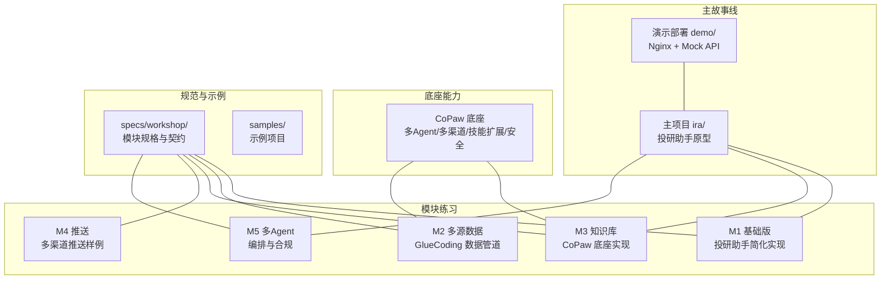
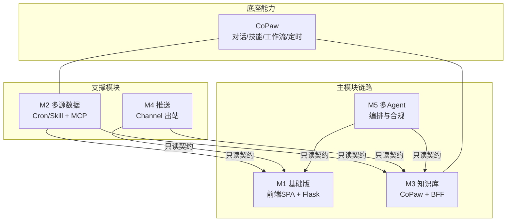
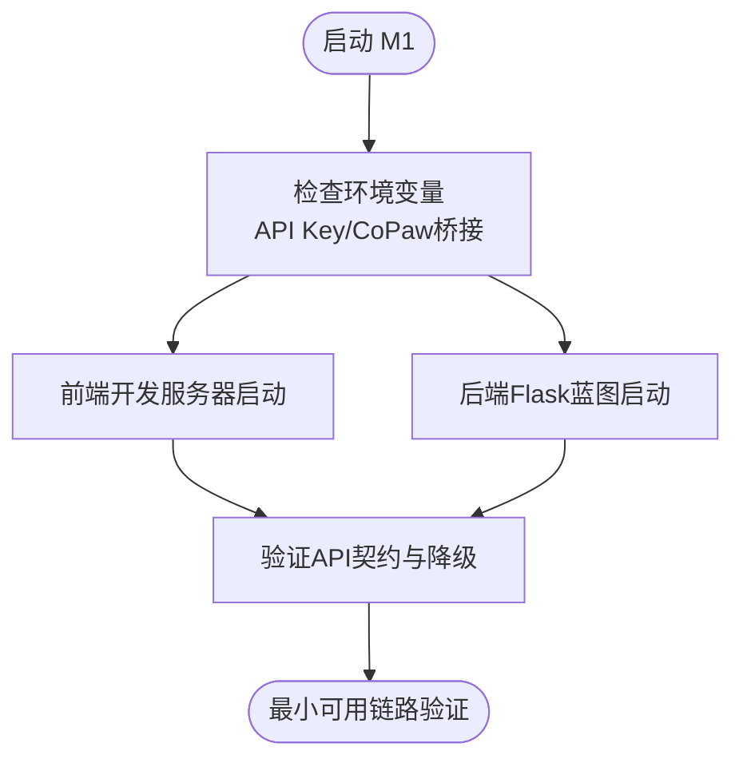
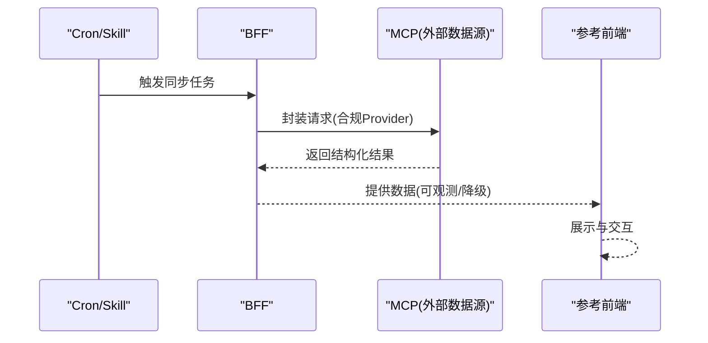
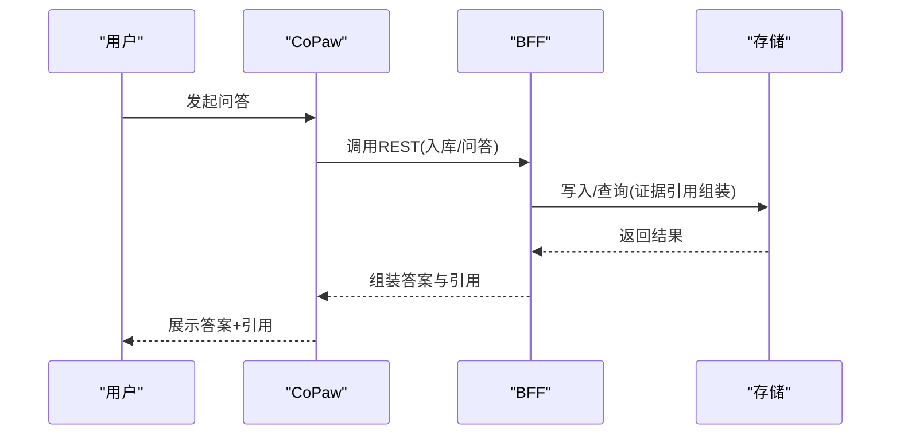
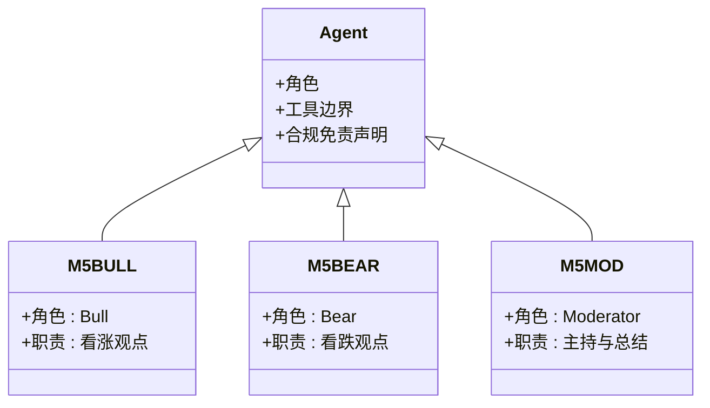
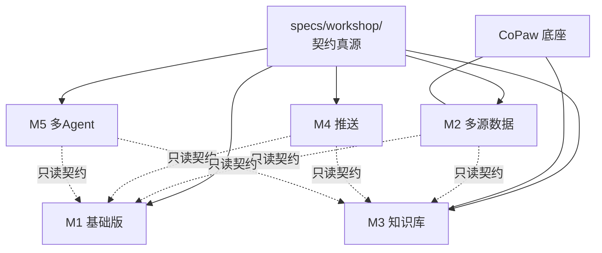

# 教学模块系统

<cite>
**本文引用的文件**
- [AGENTS.md](file://AGENTS.md)
- [modules-practice/README.md](file://modules-practice/README.md)
- [specs/workshop/README.md](file://specs/workshop/README.md)
- [specs/workshop/00-CoPaw与五模块对接指南.md](file://specs/workshop/00-CoPaw与五模块对接指南.md)
- [specs/workshop/module-01-investment-assistant/README.md](file://specs/workshop/module-01-investment-assistant/README.md)
- [specs/workshop/module-02-glue-multisource/README.md](file://specs/workshop/module-02-glue-multisource/README.md)
- [specs/workshop/module-03-knowledge-copaw/README.md](file://specs/workshop/module-03-knowledge-copaw/README.md)
- [specs/workshop/module-04-notify/README.md](file://specs/workshop/module-04-notify/README.md)
- [specs/workshop/module-05-multi-agent/README.md](file://specs/workshop/module-05-multi-agent/README.md)
- [specs/workshop/module-01-investment-assistant/docs/08-系统架构与技术选型.md](file://specs/workshop/module-01-investment-assistant/docs/08-系统架构与技术选型.md)
- [specs/workshop/module-03-knowledge-copaw/docs/00-Proposal-知识库-CoPaw底座.md](file://specs/workshop/module-03-knowledge-copaw/docs/00-Proposal-知识库-CoPaw底座.md)
- [specs/workshop/module-05-multi-agent/docs/03-立项提案与范围说明.md](file://specs/workshop/module-05-multi-agent/docs/03-立项提案与范围说明.md)
- [modules-practice/module-01-investment-assistant/README.md](file://modules-practice/module-01-investment-assistant/README.md)
- [modules-practice/module-02/README.md](file://modules-practice/module-02/README.md)
- [modules-practice/module-03/README.md](file://modules-practice/module-03/README.md)
- [modules-practice/module-05/README.md](file://modules-practice/module-05/README.md)
- [copaw/README.md](file://copaw/README.md)
</cite>

## 目录
1. [引言](#引言)
2. [项目结构](#项目结构)
3. [核心模块](#核心模块)
4. [架构总览](#架构总览)
5. [详细模块分析](#详细模块分析)
6. [依赖分析](#依赖分析)
7. [性能考虑](#性能考虑)
8. [故障排查指南](#故障排查指南)
9. [结论](#结论)
10. [附录](#附录)

## 引言
本教学模块系统围绕“五天五模块”的IRA Workshop展开，旨在通过模块化的学习单元，帮助不同层次的学习者循序渐进地掌握从基础投研助手到高级多Agent协作系统的完整能力谱系。系统以“规格驱动、契约冻结、实现可演进”的方式组织内容，确保教学与工程实践的一致性。

- 模块1（M1）：投研助手基础版，聚焦最小可用链路与规格对齐，强调“从Demo到平台”的对照学习。
- 模块2（M2）：GlueCoding多源数据，强调数据采集、清洗、调度与可观测，训练数据管道思维。
- 模块3（M3）：知识库与问答（CoPaw底座），以Proposal→Spec→TC为主线，演练“可演示端到端链路”。
- 模块4（M4）：多渠道推送，作为与工作台“触达/告警”叙事的专题实践。
- 模块5（M5）：多Agent投研，承接编排深度与子项目独立配置，强化多Agent协作与合规。

模块间通过统一的specs/workshop契约真源、CoPaw底座能力以及跨模块的端口与环境约定形成递进关系，既保证知识衔接，又提供足够的实践弹性。

## 项目结构
整体仓库由主项目、CoPaw底座、Demo部署、模块练习、示例项目与规格文档组成，形成“主故事线应用 + 底座能力 + 练习与规范”的协同结构。

**图表来源**
- [AGENTS.md](file://AGENTS.md)
- [specs/workshop/README.md](file://specs/workshop/README.md)

**章节来源**
- [AGENTS.md](file://AGENTS.md)
- [specs/workshop/README.md](file://specs/workshop/README.md)

## 核心模块
本节对五个模块的学习目标、主题与技能重点进行系统梳理，并给出模块间的递进关系与知识衔接。

- 模块1（M1）：基础投研对话与最小可用链路
  - 学习目标：理解前端SPA与后端Flask的最小集成、OpenAPI契约对齐、环境变量与降级策略。
  - 技能重点：React/Vite前端、Flask蓝图、JSON存储、API路由设计。
  - 与主项目关系：同命题不同体量，便于对照“从Demo到平台”。

- 模块2（M2）：GlueCoding多源数据集成
  - 学习目标：掌握多源采集、清洗、调度与可观测，理解失败降级与合规Provider封装。
  - 技能重点：数据管道、Cron/Skill触发、MCP封装、Mock服务与UI演示。
  - 与主项目关系：不替代主模块；讲授数据管道与合规Provider。

- 模块3（M3）：知识库与问答（CoPaw底座）
  - 学习目标：演练Proposal→Spec→TC三段式，实现“材料入库→可问答引用→溯源”。
  - 技能重点：CoPaw对话入口、Skill/Workflow编排、BFF REST与证据引用组装。
  - 与主项目关系：教“如何把能力接进类似 ira 的平台”。

- 模块4（M4）：多渠道推送
  - 学习目标：实现多渠道出站推送，结合BFF审计与合规。
  - 技能重点：Channel出站、消息队列/事件、审计与降级。
  - 与主项目关系：叙事上可接工作台“触达/告警”。

- 模块5（M5）：高级多Agent协作
  - 学习目标：多角色Agent辩论、工具白名单、纪要导出与合规免责声明。
  - 技能重点：Agent编排、角色职责与工具边界、合规与安全。
  - 与主项目关系：编排深度对照；子项目独立配置。

**章节来源**
- [modules-practice/README.md](file://modules-practice/README.md)
- [specs/workshop/module-01-investment-assistant/README.md](file://specs/workshop/module-01-investment-assistant/README.md)
- [specs/workshop/module-02-glue-multisource/README.md](file://specs/workshop/module-02-glue-multisource/README.md)
- [specs/workshop/module-03-knowledge-copaw/README.md](file://specs/workshop/module-03-knowledge-copaw/README.md)
- [specs/workshop/module-04-notify/README.md](file://specs/workshop/module-04-notify/README.md)
- [specs/workshop/module-05-multi-agent/README.md](file://specs/workshop/module-05-multi-agent/README.md)

## 架构总览
模块间的架构关系以“契约真源 + 底座能力 + 跨模块集成”为核心，M1/M3/M5与主项目存在直接的端到端链路，M2/M4作为数据/触达的支撑模块，通过REST/事件与主模块只读契约集成。

**图表来源**
- [specs/workshop/00-CoPaw与五模块对接指南.md](file://specs/workshop/00-CoPaw与五模块对接指南.md)
- [specs/workshop/module-01-investment-assistant/docs/08-系统架构与技术选型.md](file://specs/workshop/module-01-investment-assistant/docs/08-系统架构与技术选型.md)
- [specs/workshop/module-03-knowledge-copaw/docs/00-Proposal-知识库-CoPaw底座.md](file://specs/workshop/module-03-knowledge-copaw/docs/00-Proposal-知识库-CoPaw底座.md)
- [specs/workshop/module-05-multi-agent/docs/03-立项提案与范围说明.md](file://specs/workshop/module-05-multi-agent/docs/03-立项提案与范围说明.md)

## 详细模块分析

### 模块1：投研助手基础版（M1）
- 设计理念与学习目标
  - 以最小可用链路验证前端SPA与后端Flask的集成，强调OpenAPI契约对齐与降级策略。
  - 通过与主项目对照，帮助理解“从Demo到平台”的差异与取舍。
- 技术栈与架构
  - 前端：React + React Router
  - 后端：Flask蓝图（research_bp）
  - 存储：JSON文件（data/*.json）
  - 集成：与CoPaw可选桥接（环境变量控制）
- 实践任务与预期成果
  - 任务：启动前后端、验证API契约、配置降级与CoPaw桥接。
  - 成果：最小可用投研对话页，具备消息列表、搜索与标记已读能力。
- 最佳实践与常见陷阱
  - 最佳实践：统一后端端口（建议5000）、环境变量对齐、降级文案一致性。
  - 常见陷阱：密钥未配置导致的离线演示与在线演示混淆；端口冲突未标注。
- 适应性指导
  - 初学者：专注最小链路与契约理解；对照主项目观察差异。
  - 进阶者：尝试接入CoPaw桥接，理解只读调用与降级策略。

**图表来源**
- [modules-practice/module-01-investment-assistant/README.md](file://modules-practice/module-01-investment-assistant/README.md)
- [specs/workshop/module-01-investment-assistant/docs/08-系统架构与技术选型.md](file://specs/workshop/module-01-investment-assistant/docs/08-系统架构与技术选型.md)

**章节来源**
- [modules-practice/module-01-investment-assistant/README.md](file://modules-practice/module-01-investment-assistant/README.md)
- [specs/workshop/module-01-investment-assistant/README.md](file://specs/workshop/module-01-investment-assistant/README.md)
- [specs/workshop/module-01-investment-assistant/docs/08-系统架构与技术选型.md](file://specs/workshop/module-01-investment-assistant/docs/08-系统架构与技术选型.md)

### 模块2：GlueCoding多源数据（M2）
- 设计理念与学习目标
  - 通过多源采集、清洗、调度与可观测，训练数据管道思维与失败降级能力。
  - 强调Cron/Skill触发与MCP封装外部数据源，遵循合规Provider原则。
- 技术栈与架构
  - Cron/Skill触发同步任务 → HTTP调用本模块BFF → MCP封装外部数据源（合规Provider）。
  - 包含VIN Mock服务、生产参考实现、参考前端与UI演示。
- 实践任务与预期成果
  - 任务：启动Mock服务、BFF与参考前端，验证数据采集、清洗与调度链路。
  - 成果：可演示的数据管道，具备可观测性与失败降级。
- 最佳实践与常见陷阱
  - 最佳实践：统一后端端口（建议5000）、Mock端口规划（如8099）、前端端口按默认运行。
  - 常见陷阱：多进程端口冲突未标注；Cron/Skill触发与BFF契约不一致。
- 适应性指导
  - 初学者：聚焦数据采集与清洗链路；理解MCP封装与合规Provider。
  - 进阶者：加入可观测性与失败降级策略，探索调度优化。

**图表来源**
- [modules-practice/module-02/README.md](file://modules-practice/module-02/README.md)
- [specs/workshop/module-02-glue-multisource/README.md](file://specs/workshop/module-02-glue-multisource/README.md)

**章节来源**
- [modules-practice/module-02/README.md](file://modules-practice/module-02/README.md)
- [specs/workshop/module-02-glue-multisource/README.md](file://specs/workshop/module-02-glue-multisource/README.md)

### 模块3：知识库与问答（CoPaw底座）（M3）
- 设计理念与学习目标
  - 以Proposal→Spec→TC为主线，演练“材料入库→可问答引用→溯源”的端到端链路。
  - 明确CoPaw与BFF的分工：CoPaw负责对话入口、技能与工作流；BFF负责REST、入库与证据引用组装。
- 技术栈与架构
  - CoPaw：对话入口、Skill/Workflow、（可选）定时任务。
  - BFF：REST接口、入库落库、证据引用组装、与合规扫描接口对接。
- 实践任务与预期成果
  - 任务：根据Proposal与Spec冻结契约，完成入库、问答与证据引用组装。
  - 成果：可演示的端到端链路，具备trace_id与引用结构。
- 最佳实践与常见陷阱
  - 最佳实践：以冻结Spec为准进行开发与验收；明确CoPaw与BFF边界。
  - 常见陷阱：Spec冻结前变更导致的契约漂移；证据引用结构不一致。
- 适应性指导
  - 初学者：聚焦Proposal→Spec→TC的评审与冻结流程。
  - 进阶者：探索CoPaw技能与工作流编排，完善证据引用与溯源。

**图表来源**
- [specs/workshop/module-03-knowledge-copaw/docs/00-Proposal-知识库-CoPaw底座.md](file://specs/workshop/module-03-knowledge-copaw/docs/00-Proposal-知识库-CoPaw底座.md)
- [specs/workshop/00-CoPaw与五模块对接指南.md](file://specs/workshop/00-CoPaw与五模块对接指南.md)
- [modules-practice/module-03/README.md](file://modules-practice/module-03/README.md)

**章节来源**
- [modules-practice/module-03/README.md](file://modules-practice/module-03/README.md)
- [specs/workshop/module-03-knowledge-copaw/README.md](file://specs/workshop/module-03-knowledge-copaw/README.md)
- [specs/workshop/module-03-knowledge-copaw/docs/00-Proposal-知识库-CoPaw底座.md](file://specs/workshop/module-03-knowledge-copaw/docs/00-Proposal-知识库-CoPaw底座.md)

### 模块4：多渠道推送（M4）
- 设计理念与学习目标
  - 作为与工作台“触达/告警”叙事的专题实践，实现多渠道出站推送与审计。
- 技术栈与架构
  - Channel出站、消息队列/事件、审计与降级策略。
- 实践任务与预期成果
  - 任务：实现多渠道推送样例，验证出站与审计。
  - 成果：可演示的多渠道推送链路。
- 最佳实践与常见陷阱
  - 最佳实践：统一后端端口（建议5000）、通道配置与审计日志。
  - 常见陷阱：通道配置错误导致的推送失败；审计缺失。
- 适应性指导
  - 初学者：聚焦通道配置与基本推送流程。
  - 进阶者：完善审计与降级策略，探索事件驱动与异步处理。

**章节来源**
- [specs/workshop/module-04-notify/README.md](file://specs/workshop/module-04-notify/README.md)

### 模块5：高级多Agent协作（M5）
- 设计理念与学习目标
  - 多角色Agent辩论、工具白名单、纪要导出与合规免责声明，承接编排深度与子项目独立配置。
- 技术栈与架构
  - 多Agent编排、角色职责与工具边界、合规与安全。
- 实践任务与预期成果
  - 任务：定义固定三角色（M5-BULL/M5-BEAR/M5-MOD）+编排器，实现辩论与纪要导出。
  - 成果：可演示的多Agent协作链路与合规免责声明。
- 最佳实践与常见陷阱
  - 最佳实践：明确角色职责与工具边界；以Spec冻结版本为准进行开发。
  - 常见陷阱：角色职责不清导致的编排混乱；工具白名单缺失引发的安全风险。
- 适应性指导
  - 初学者：理解多Agent编排的基本概念与角色分工。
  - 进阶者：完善工具白名单与合规策略，探索复杂编排场景。

**图表来源**
- [specs/workshop/module-05-multi-agent/docs/03-立项提案与范围说明.md](file://specs/workshop/module-05-multi-agent/docs/03-立项提案与范围说明.md)
- [modules-practice/module-05/README.md](file://modules-practice/module-05/README.md)

**章节来源**
- [modules-practice/module-05/README.md](file://modules-practice/module-05/README.md)
- [specs/workshop/module-05-multi-agent/README.md](file://specs/workshop/module-05-multi-agent/README.md)
- [specs/workshop/module-05-multi-agent/docs/03-立项提案与范围说明.md](file://specs/workshop/module-05-multi-agent/docs/03-立项提案与范围说明.md)

## 依赖分析
模块间的耦合与协作以“契约真源 + 底座能力 + 跨模块集成”为原则，形成低耦合高内聚的结构。

**图表来源**
- [specs/workshop/README.md](file://specs/workshop/README.md)
- [specs/workshop/00-CoPaw与五模块对接指南.md](file://specs/workshop/00-CoPaw与五模块对接指南.md)
- [AGENTS.md](file://AGENTS.md)

**章节来源**
- [specs/workshop/README.md](file://specs/workshop/README.md)
- [specs/workshop/00-CoPaw与五模块对接指南.md](file://specs/workshop/00-CoPaw与五模块对接指南.md)
- [AGENTS.md](file://AGENTS.md)

## 性能考虑
- 数据管道（M2）：合理设置Cron频率与并发，避免外部数据源限流；引入可观测性指标（成功率、延迟、失败重试）。
- 知识库（M3）：BFF层缓存热点问答、批量入库与异步处理；CoPaw侧合理配置模型与速率限制。
- 多Agent（M5）：编排器与Agent间的消息队列与背压控制；工具调用的超时与重试策略。
- 前后端端口与资源：统一后端端口（建议5000）减少网络与代理配置成本；前端按默认端口运行，避免构建工具频繁改动。

## 故障排查指南
- 环境变量与密钥
  - 症状：离线演示与在线演示混用，API调用失败。
  - 排查：核对API Key与CoPaw桥接配置；确保环境变量一致。
- 端口冲突
  - 症状：本地启动失败或端口占用。
  - 排查：统一后端端口（建议5000）并在演示说明中标注临时端口。
- 契约漂移
  - 症状：实现与冻结Spec不一致。
  - 排查：以冻结Spec为准；变更需先更新specs再调整实现。
- CoPaw能力对照
  - 症状：模块能力与CoPaw分工不清晰。
  - 排查：参考对接指南，明确对话入口、技能、工作流与BFF边界。

**章节来源**
- [specs/workshop/00-CoPaw与五模块对接指南.md](file://specs/workshop/00-CoPaw与五模块对接指南.md)
- [copaw/README.md](file://copaw/README.md)

## 结论
本教学模块系统通过“规格驱动、契约冻结、实现可演进”的方式，构建了从基础投研助手到高级多Agent协作的完整学习路径。模块间以统一的契约真源与CoPaw底座能力为纽带，既保证知识衔接，又提供充分的实践弹性。建议学习者以“冻结Spec为纲”，结合各模块的实践任务与最佳实践，逐步深化对投研助手全栈能力的理解与应用。

## 附录
- 快速参考
  - 统一后端端口：建议5000，便于跨模块演示与代理配置复用。
  - 端口建议：M2常用外部源模拟端口8099；M3 BFF默认8000（可通过PORT覆盖）。
  - CoPaw控制台：http://127.0.0.1:8088/，用于Day 1扫描与后续按模块对照能力。
- 相关链接
  - CoPaw官方文档与安装指南：参见[CoPaw README](file://copaw/README.md)
  - 规模化部署与CI/CD：参见[AGENTS.md](file://AGENTS.md)中的部署与工作流说明