# CI/CD流水线

<cite>
**本文引用的文件**
- [.github/workflows/deploy-dev.yml](file://.github/workflows/deploy-dev.yml)
- [.github/workflows/deploy-prod.yml](file://.github/workflows/deploy-prod.yml)
- [.github/workflows/deploy-demo.yml](file://.github/workflows/deploy-demo.yml)
- [.github/workflows/e2e-tests.yml](file://.github/workflows/e2e-tests.yml)
- [.github/workflows/ai-code-review.yml](file://.github/workflows/ai-code-review.yml)
- [.github/workflows/deploy-pages.yml](file://.github/workflows/deploy-pages.yml)
- [copaw/scripts/docker_build.sh](file://copaw/scripts/docker_build.sh)
- [copaw/scripts/docker_sync_latest.sh](file://copaw/scripts/docker_sync_latest.sh)
- [copaw/deploy/Dockerfile](file://copaw/deploy/Dockerfile)
- [copaw/pyproject.toml](file://copaw/pyproject.toml)
- [main-project/backend/pytest.ini](file://main-project/backend/pytest.ini)
- [main-project/workshop/code-review.yml](file://main-project/workshop/code-review.yml)
- [scripts/workshop-checker.py](file://scripts/workshop-checker.py)
- [specs/workshop/module-04-notify/docs/13-测试策略与质量门禁.md](file://specs/workshop/module-04-notify/docs/13-测试策略与质量门禁.md)
</cite>

## 目录
1. [简介](#简介)
2. [项目结构](#项目结构)
3. [核心组件](#核心组件)
4. [架构总览](#架构总览)
5. [详细组件分析](#详细组件分析)
6. [依赖关系分析](#依赖关系分析)
7. [性能考虑](#性能考虑)
8. [故障排查指南](#故障排查指南)
9. [结论](#结论)
10. [附录](#附录)

## 简介
本指南面向CI/CD流水线的全面自动化部署，覆盖以下主题：
- GitHub Actions工作流配置与执行流程
- 代码质量检查、单元测试与集成测试的自动化
- 持续集成与持续部署策略与最佳实践
- Docker镜像构建、推送与版本管理
- 环境变量管理、密钥配置与安全策略
- 多环境部署（开发、测试、生产）的配置差异与切换机制
- 回滚策略、蓝绿部署与金丝雀发布指导

## 项目结构
该仓库包含多个子项目与工作流，其中与CI/CD直接相关的关键位置如下：
- .github/workflows：集中存放各类GitHub Actions工作流
- copaw：前端控制台与后端应用，包含Docker化部署脚本与Dockerfile
- main-project：后端微服务示例，包含测试与质量检查工作流
- scripts：通用脚本，如Workshop检查器
- specs：规范与模板，包含测试策略与质量门禁文档

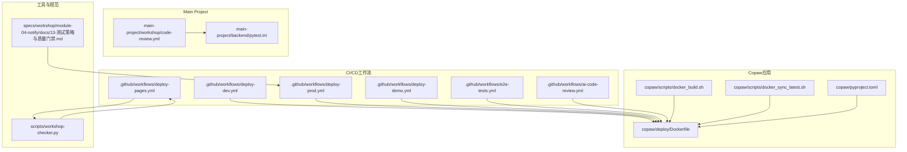

**图表来源**
- [.github/workflows/deploy-dev.yml:1-62](file://.github/workflows/deploy-dev.yml#L1-L62)
- [.github/workflows/deploy-prod.yml:1-89](file://.github/workflows/deploy-prod.yml#L1-L89)
- [.github/workflows/deploy-demo.yml:1-179](file://.github/workflows/deploy-demo.yml#L1-L179)
- [.github/workflows/e2e-tests.yml:1-80](file://.github/workflows/e2e-tests.yml#L1-L80)
- [.github/workflows/ai-code-review.yml:1-109](file://.github/workflows/ai-code-review.yml#L1-L109)
- [.github/workflows/deploy-pages.yml:1-102](file://.github/workflows/deploy-pages.yml#L1-L102)
- [copaw/deploy/Dockerfile:1-103](file://copaw/deploy/Dockerfile#L1-L103)
- [copaw/scripts/docker_build.sh:1-32](file://copaw/scripts/docker_build.sh#L1-L32)
- [copaw/scripts/docker_sync_latest.sh:1-77](file://copaw/scripts/docker_sync_latest.sh#L1-L77)
- [copaw/pyproject.toml:1-107](file://copaw/pyproject.toml#L1-L107)
- [main-project/backend/pytest.ini:1-4](file://main-project/backend/pytest.ini#L1-L4)
- [main-project/workshop/code-review.yml:49-95](file://main-project/workshop/code-review.yml#L49-L95)
- [scripts/workshop-checker.py:260-424](file://scripts/workshop-checker.py#L260-L424)
- [specs/workshop/module-04-notify/docs/13-测试策略与质量门禁.md:39-65](file://specs/workshop/module-04-notify/docs/13-测试策略与质量门禁.md#L39-L65)

**章节来源**
- [.github/workflows/deploy-dev.yml:1-62](file://.github/workflows/deploy-dev.yml#L1-L62)
- [.github/workflows/deploy-prod.yml:1-89](file://.github/workflows/deploy-prod.yml#L1-L89)
- [.github/workflows/deploy-demo.yml:1-179](file://.github/workflows/deploy-demo.yml#L1-L179)
- [.github/workflows/e2e-tests.yml:1-80](file://.github/workflows/e2e-tests.yml#L1-L80)
- [.github/workflows/ai-code-review.yml:1-109](file://.github/workflows/ai-code-review.yml#L1-L109)
- [.github/workflows/deploy-pages.yml:1-102](file://.github/workflows/deploy-pages.yml#L1-L102)

## 核心组件
- 自动化部署工作流
  - 开发环境自动部署：基于主分支变更触发，通过SSH远程执行部署脚本
  - 生产环境手动部署：通过工作流手动触发，支持分支选择与二次确认
  - Demo演示部署：自动部署Nginx配置、静态资源与Mock API服务
- 质量与测试工作流
  - AI代码审查：基于PR变更触发，限制大PR以控制成本
  - E2E测试：基于Playwright的浏览器自动化测试，支持PR与push触发
  - Workshop检查与Pages部署：对模块实践进行检查并部署到GitHub Pages
- Docker化与镜像管理
  - 多阶段Dockerfile：前端构建产物注入至运行镜像
  - 构建脚本：支持自定义标签与通道过滤参数
  - 镜像同步脚本：将预发布镜像同步为latest标签
- 测试与质量门禁
  - 后端pytest配置与前端代码质量检查
  - Workshop检查器：统计分数、输出报告并可继续部署
  - 质量门禁文档：定义阻塞项与回归触发规则

**章节来源**
- [.github/workflows/deploy-dev.yml:1-62](file://.github/workflows/deploy-dev.yml#L1-L62)
- [.github/workflows/deploy-prod.yml:1-89](file://.github/workflows/deploy-prod.yml#L1-L89)
- [.github/workflows/deploy-demo.yml:1-179](file://.github/workflows/deploy-demo.yml#L1-L179)
- [.github/workflows/e2e-tests.yml:1-80](file://.github/workflows/e2e-tests.yml#L1-L80)
- [.github/workflows/ai-code-review.yml:1-109](file://.github/workflows/ai-code-review.yml#L1-L109)
- [.github/workflows/deploy-pages.yml:1-102](file://.github/workflows/deploy-pages.yml#L1-L102)
- [copaw/deploy/Dockerfile:1-103](file://copaw/deploy/Dockerfile#L1-L103)
- [copaw/scripts/docker_build.sh:1-32](file://copaw/scripts/docker_build.sh#L1-L32)
- [copaw/scripts/docker_sync_latest.sh:1-77](file://copaw/scripts/docker_sync_latest.sh#L1-L77)
- [copaw/pyproject.toml:1-107](file://copaw/pyproject.toml#L1-L107)
- [main-project/backend/pytest.ini:1-4](file://main-project/backend/pytest.ini#L1-L4)
- [main-project/workshop/code-review.yml:49-95](file://main-project/workshop/code-review.yml#L49-L95)
- [scripts/workshop-checker.py:260-424](file://scripts/workshop-checker.py#L260-L424)
- [specs/workshop/module-04-notify/docs/13-测试策略与质量门禁.md:39-65](file://specs/workshop/module-04-notify/docs/13-测试策略与质量门禁.md#L39-L65)

## 架构总览
下图展示从代码提交到多环境部署的整体流程，包括质量门禁与测试环节。

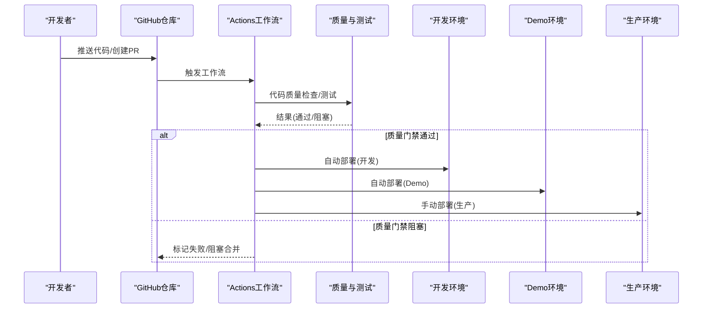

**图表来源**
- [.github/workflows/deploy-dev.yml:10-31](file://.github/workflows/deploy-dev.yml#L10-L31)
- [.github/workflows/deploy-demo.yml:6-31](file://.github/workflows/deploy-demo.yml#L6-L31)
- [.github/workflows/deploy-prod.yml:6-35](file://.github/workflows/deploy-prod.yml#L6-L35)
- [.github/workflows/ai-code-review.yml:12-34](file://.github/workflows/ai-code-review.yml#L12-L34)
- [.github/workflows/e2e-tests.yml:10-32](file://.github/workflows/e2e-tests.yml#L10-L32)
- [specs/workshop/module-04-notify/docs/13-测试策略与质量门禁.md:39-46](file://specs/workshop/module-04-notify/docs/13-测试策略与质量门禁.md#L39-L46)

## 详细组件分析

### 开发环境自动部署工作流
- 触发条件：推送到main分支且路径匹配指定目录
- 关键步骤：检出代码、通过SSH执行远程部署脚本、成功/失败通知
- 环境变量：FORCE_JAVASCRIPT_ACTIONS_TO_NODE24、ECS_*（主机、用户、密钥、应用路径、systemd服务）

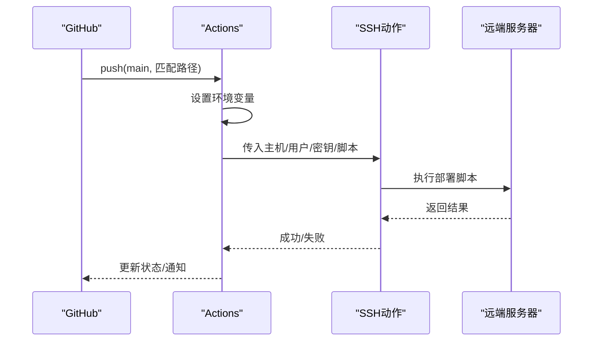

**图表来源**
- [.github/workflows/deploy-dev.yml:10-53](file://.github/workflows/deploy-dev.yml#L10-L53)

**章节来源**
- [.github/workflows/deploy-dev.yml:1-62](file://.github/workflows/deploy-dev.yml#L1-L62)

### 生产环境手动部署工作流
- 触发条件：workflow_dispatch，需输入目标分支与确认字符串
- 关键步骤：检出代码、部署前确认、通过SSH执行部署脚本、记录部署信息
- 安全要点：二次确认、环境保护（production）、权限最小化

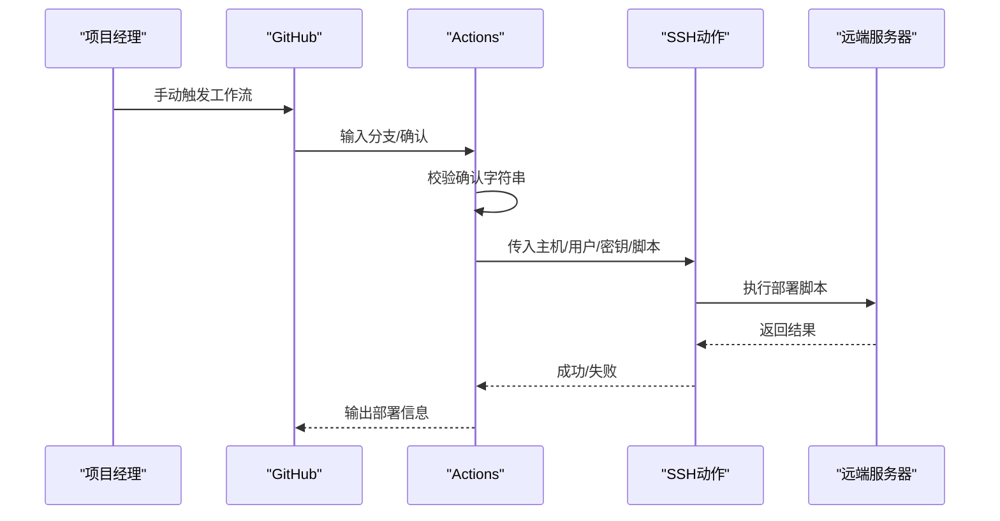

**图表来源**
- [.github/workflows/deploy-prod.yml:6-67](file://.github/workflows/deploy-prod.yml#L6-L67)

**章节来源**
- [.github/workflows/deploy-prod.yml:1-89](file://.github/workflows/deploy-prod.yml#L1-L89)

### Demo演示部署工作流
- 触发条件：workflow_dispatch确认或push到main且路径匹配demo目录
- 关键步骤：部署Nginx配置、上传静态资源、安装并启动Mock API服务
- 安全要点：使用密码或私钥登录，部署后验证Nginx配置

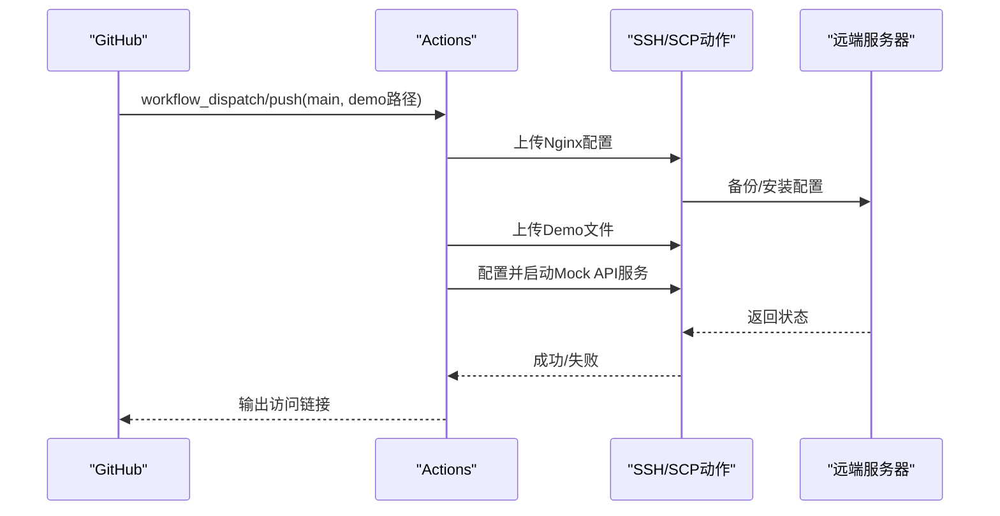

**图表来源**
- [.github/workflows/deploy-demo.yml:6-157](file://.github/workflows/deploy-demo.yml#L6-L157)

**章节来源**
- [.github/workflows/deploy-demo.yml:1-179](file://.github/workflows/deploy-demo.yml#L1-L179)

### AI代码审查工作流
- 触发条件：PR打开/同步/重新打开，且路径匹配代码与工作流文件
- 关键步骤：检出完整历史、检查PR规模、调用Qoder Action进行审查、更新检查状态
- 性能优化：超过阈值的PR跳过审查以节省成本

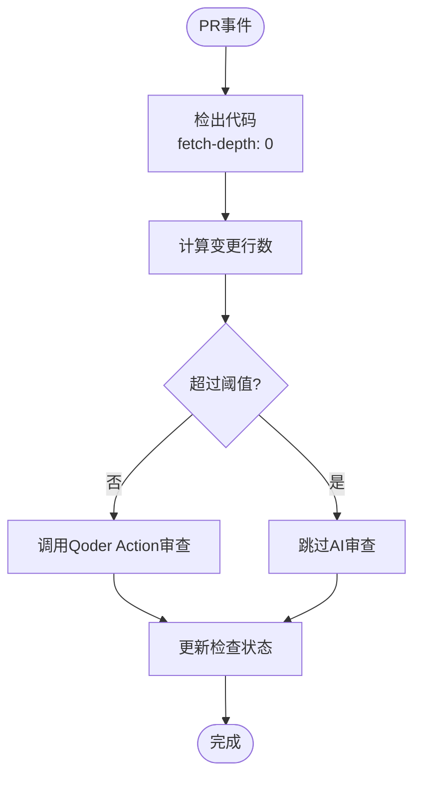

**图表来源**
- [.github/workflows/ai-code-review.yml:42-108](file://.github/workflows/ai-code-review.yml#L42-L108)

**章节来源**
- [.github/workflows/ai-code-review.yml:1-109](file://.github/workflows/ai-code-review.yml#L1-L109)

### E2E端到端测试工作流
- 触发条件：push/pull_request到main/master，且路径匹配前端/测试相关文件
- 关键步骤：设置Node.js、安装依赖、安装Playwright浏览器、运行测试、上传报告
- 并发与缓存：使用Node缓存、超时控制

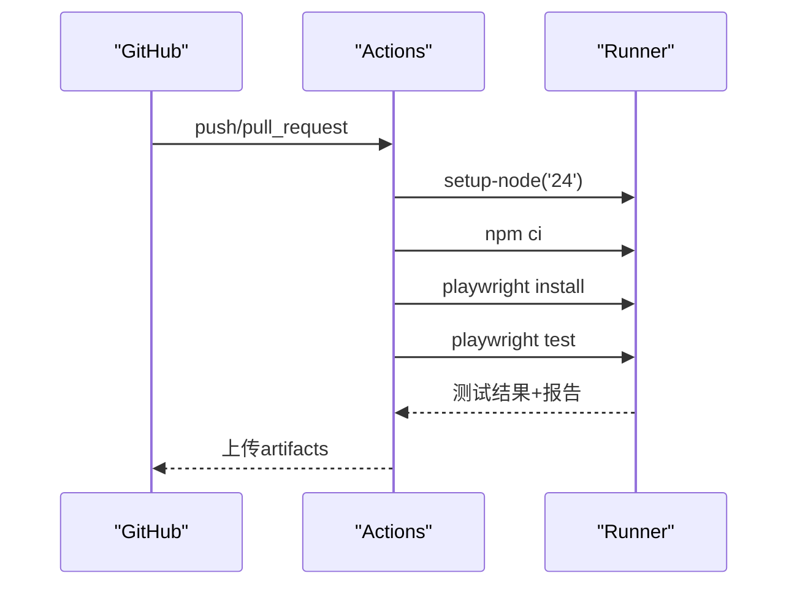

**图表来源**
- [.github/workflows/e2e-tests.yml:48-79](file://.github/workflows/e2e-tests.yml#L48-L79)

**章节来源**
- [.github/workflows/e2e-tests.yml:1-80](file://.github/workflows/e2e-tests.yml#L1-L80)

### Workshop检查与Pages部署工作流
- 触发条件：push到main且路径匹配模块实践/检查脚本/GitHub Pages
- 关键步骤：设置Python、安装依赖、运行检查脚本、组装站点目录、配置Pages、上传artifact、部署
- 并发控制：同一Pages组内并发仅保留最新一次

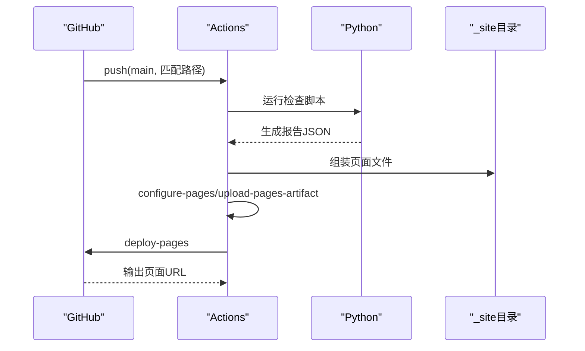

**图表来源**
- [.github/workflows/deploy-pages.yml:36-92](file://.github/workflows/deploy-pages.yml#L36-L92)

**章节来源**
- [.github/workflows/deploy-pages.yml:1-102](file://.github/workflows/deploy-pages.yml#L1-L102)

### Docker镜像构建与版本管理
- 多阶段构建：前端构建产物注入运行镜像，安装Chromium与Supervisor
- 构建脚本：支持自定义标签、通道白/黑名单参数、默认端口与运行建议
- 镜像同步：将预发布镜像同步为latest标签（阿里云容器镜像与Docker Hub）

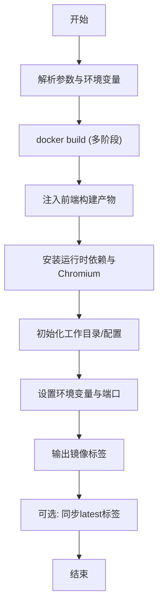

**图表来源**
- [copaw/deploy/Dockerfile:1-103](file://copaw/deploy/Dockerfile#L1-L103)
- [copaw/scripts/docker_build.sh:16-27](file://copaw/scripts/docker_build.sh#L16-L27)
- [copaw/scripts/docker_sync_latest.sh:62-74](file://copaw/scripts/docker_sync_latest.sh#L62-L74)

**章节来源**
- [copaw/deploy/Dockerfile:1-103](file://copaw/deploy/Dockerfile#L1-L103)
- [copaw/scripts/docker_build.sh:1-32](file://copaw/scripts/docker_build.sh#L1-L32)
- [copaw/scripts/docker_sync_latest.sh:1-77](file://copaw/scripts/docker_sync_latest.sh#L1-L77)

### 测试与质量门禁
- 后端pytest：统一测试入口与路径配置
- 前端质量检查：ESLint与TypeScript类型检查
- Workshop检查器：统计分数、输出报告、允许部分失败继续部署
- 质量门禁：定义阻塞项（如lint、集成测试、secret处理等），明确回归触发场景

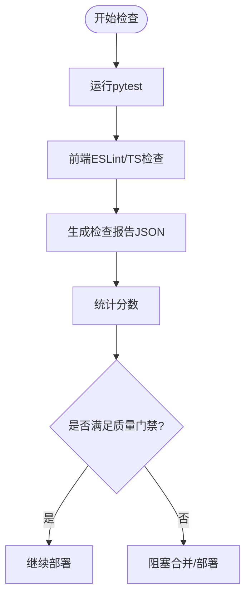

**图表来源**
- [main-project/backend/pytest.ini:1-4](file://main-project/backend/pytest.ini#L1-L4)
- [main-project/workshop/code-review.yml:49-95](file://main-project/workshop/code-review.yml#L49-L95)
- [scripts/workshop-checker.py:260-276](file://scripts/workshop-checker.py#L260-L276)
- [specs/workshop/module-04-notify/docs/13-测试策略与质量门禁.md:39-46](file://specs/workshop/module-04-notify/docs/13-测试策略与质量门禁.md#L39-L46)

**章节来源**
- [main-project/backend/pytest.ini:1-4](file://main-project/backend/pytest.ini#L1-L4)
- [main-project/workshop/code-review.yml:49-95](file://main-project/workshop/code-review.yml#L49-L95)
- [scripts/workshop-checker.py:260-424](file://scripts/workshop-checker.py#L260-L424)
- [specs/workshop/module-04-notify/docs/13-测试策略与质量门禁.md:39-65](file://specs/workshop/module-04-notify/docs/13-测试策略与质量门禁.md#L39-L65)

## 依赖关系分析
- 工作流之间的耦合
  - 开发/生产/演示部署工作流均依赖SSH动作与远端部署脚本
  - E2E测试与AI代码审查独立于部署，但受质量门禁影响
  - Pages部署依赖Workshop检查器与GitHub Pages能力
- 组件间依赖
  - Docker镜像作为部署目标，被各部署工作流消费
  - 测试与质量检查作为质量门禁，决定是否进入部署阶段

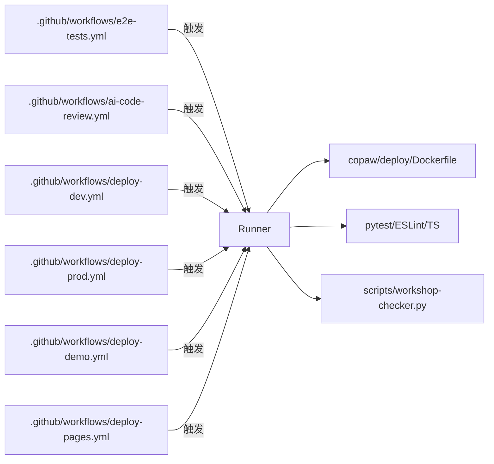

**图表来源**
- [.github/workflows/e2e-tests.yml:10-32](file://.github/workflows/e2e-tests.yml#L10-L32)
- [.github/workflows/ai-code-review.yml:12-34](file://.github/workflows/ai-code-review.yml#L12-L34)
- [.github/workflows/deploy-dev.yml:10-31](file://.github/workflows/deploy-dev.yml#L10-L31)
- [.github/workflows/deploy-prod.yml:6-35](file://.github/workflows/deploy-prod.yml#L6-L35)
- [.github/workflows/deploy-demo.yml:6-31](file://.github/workflows/deploy-demo.yml#L6-L31)
- [.github/workflows/deploy-pages.yml:8-34](file://.github/workflows/deploy-pages.yml#L8-L34)
- [copaw/deploy/Dockerfile:1-103](file://copaw/deploy/Dockerfile#L1-L103)
- [main-project/backend/pytest.ini:1-4](file://main-project/backend/pytest.ini#L1-L4)
- [main-project/workshop/code-review.yml:49-95](file://main-project/workshop/code-review.yml#L49-L95)
- [scripts/workshop-checker.py:260-424](file://scripts/workshop-checker.py#L260-L424)

**章节来源**
- [.github/workflows/e2e-tests.yml:1-80](file://.github/workflows/e2e-tests.yml#L1-L80)
- [.github/workflows/ai-code-review.yml:1-109](file://.github/workflows/ai-code-review.yml#L1-L109)
- [.github/workflows/deploy-dev.yml:1-62](file://.github/workflows/deploy-dev.yml#L1-L62)
- [.github/workflows/deploy-prod.yml:1-89](file://.github/workflows/deploy-prod.yml#L1-L89)
- [.github/workflows/deploy-demo.yml:1-179](file://.github/workflows/deploy-demo.yml#L1-L179)
- [.github/workflows/deploy-pages.yml:1-102](file://.github/workflows/deploy-pages.yml#L1-L102)
- [copaw/deploy/Dockerfile:1-103](file://copaw/deploy/Dockerfile#L1-L103)
- [main-project/backend/pytest.ini:1-4](file://main-project/backend/pytest.ini#L1-L4)
- [main-project/workshop/code-review.yml:49-95](file://main-project/workshop/code-review.yml#L49-L95)
- [scripts/workshop-checker.py:260-424](file://scripts/workshop-checker.py#L260-L424)

## 性能考虑
- 缓存与复用
  - Node.js缓存（npm）减少依赖安装时间
  - Playwright浏览器一次性安装，避免重复下载
- 并发与资源
  - Pages部署使用并发组控制，避免资源竞争
  - Docker构建使用多阶段，减少最终镜像体积
- 成本控制
  - AI代码审查对大PR跳过，降低外部服务成本
  - 测试超时控制与报告上传，避免长时间占用runner

[本节为通用建议，无需具体文件引用]

## 故障排查指南
- 密钥与连接问题
  - SSH动作失败：检查主机、用户、密钥/密码配置是否正确
  - ECS_*变量缺失：在仓库Settings/Secrets中补齐
- 部署脚本问题
  - 远端路径不存在：确认ECS_APP_PATH与systemd服务名
  - 权限不足：确保SSH用户具备sudo权限或对应目录权限
- 测试失败
  - E2E测试：查看Playwright报告Artifacts，确认浏览器安装与网络可达
  - pytest：检查后端依赖与pytest.ini配置
- Pages部署
  - 检查脚本输出与_artifact上传，确认Pages已启用
- 质量门禁
  - 若被阻塞，根据质量门禁文档逐项修复（lint、集成测试、secret处理）

**章节来源**
- [.github/workflows/deploy-dev.yml:37-53](file://.github/workflows/deploy-dev.yml#L37-L53)
- [.github/workflows/deploy-prod.yml:51-67](file://.github/workflows/deploy-prod.yml#L51-L67)
- [.github/workflows/deploy-demo.yml:47-157](file://.github/workflows/deploy-demo.yml#L47-L157)
- [.github/workflows/e2e-tests.yml:62-79](file://.github/workflows/e2e-tests.yml#L62-L79)
- [.github/workflows/deploy-pages.yml:82-92](file://.github/workflows/deploy-pages.yml#L82-L92)
- [specs/workshop/module-04-notify/docs/13-测试策略与质量门禁.md:39-46](file://specs/workshop/module-04-notify/docs/13-测试策略与质量门禁.md#L39-L46)

## 结论
本仓库提供了完善的CI/CD流水线实践：
- 通过多类工作流覆盖开发、测试、审查与部署全流程
- 采用质量门禁与多阶段Docker构建保障交付质量与效率
- 提供手动与自动部署选项，兼顾灵活性与安全性
- 建议在实际落地中结合团队规范补充凭证轮换、审计日志与监控告警

[本节为总结性内容，无需具体文件引用]

## 附录

### 多环境部署配置差异与切换机制
- 开发环境：自动触发，路径过滤，快速反馈
- 生产环境：手动触发，二次确认，环境保护
- Demo环境：自动部署静态资源与Mock API，便于演示
- 切换机制：通过工作流输入分支、环境名称与保护规则实现

**章节来源**
- [.github/workflows/deploy-dev.yml:10-31](file://.github/workflows/deploy-dev.yml#L10-L31)
- [.github/workflows/deploy-prod.yml:6-35](file://.github/workflows/deploy-prod.yml#L6-L35)
- [.github/workflows/deploy-demo.yml:6-31](file://.github/workflows/deploy-demo.yml#L6-L31)

### 回滚策略、蓝绿部署与金丝雀发布指导
- 回滚策略
  - 保留最近N个版本镜像与配置，必要时回退到上一稳定版本
  - 通过systemd服务回滚或容器编排工具回滚
- 蓝绿部署
  - 使用两套环境（蓝/绿），切换负载均衡或路由至新版本
  - 失败时立即切回旧版本，减少停机时间
- 金丝雀发布
  - 将少量流量导入新版本，观察指标（错误率、延迟、成功率）
  - 逐步扩大流量直至完全替换

[本节为概念性指导，无需具体文件引用]