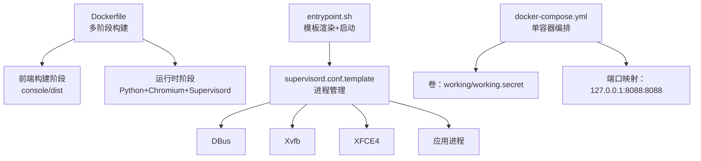
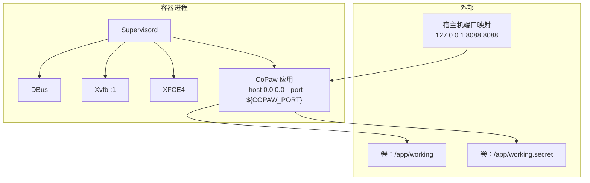
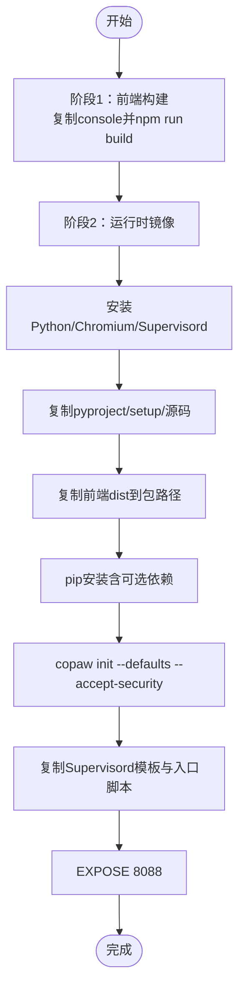
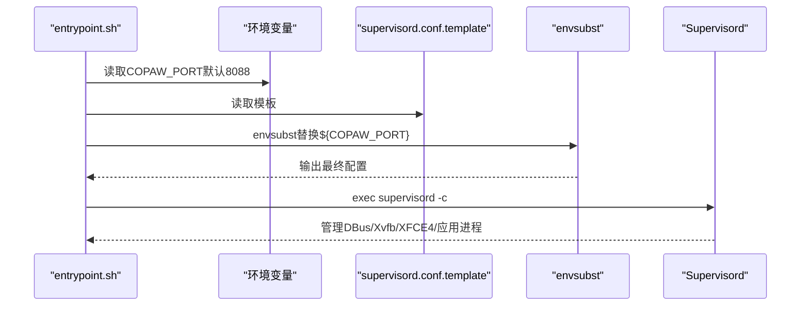
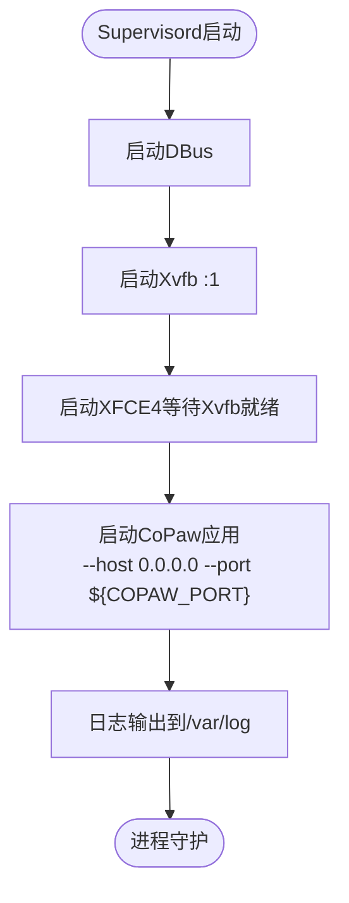
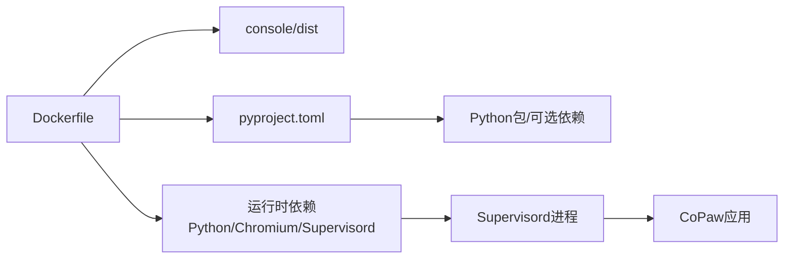

# Docker容器化部署

<cite>
**本文引用的文件**
- [Dockerfile](file://copaw/deploy/Dockerfile)
- [entrypoint.sh](file://copaw/deploy/entrypoint.sh)
- [supervisord.conf.template](file://copaw/deploy/config/supervisord.conf.template)
- [docker-compose.yml](file://copaw/docker-compose.yml)
- [.dockerignore](file://copaw/.dockerignore)
- [docker_build.sh](file://copaw/scripts/docker_build.sh)
- [pyproject.toml](file://copaw/pyproject.toml)
- [环境变量管理.md](file://specs/copaw-repowiki/content/配置管理/环境变量管理.md)
- [工作空间配置.md](file://specs/copaw-repowiki/content/配置管理/工作空间配置.md)
- [安全配置.md](file://specs/copaw-repowiki/content/配置管理/安全配置.md)
- [健康检查脚本](file://specs/workshop/deploy-templates-ecs/scripts/health-check.sh)
</cite>

## 目录
1. [简介](#简介)
2. [项目结构](#项目结构)
3. [核心组件](#核心组件)
4. [架构总览](#架构总览)
5. [详细组件分析](#详细组件分析)
6. [依赖关系分析](#依赖关系分析)
7. [性能与优化](#性能与优化)
8. [网络与数据卷配置](#网络与数据卷配置)
9. [容器编排与服务发现](#容器编排与服务发现)
10. [健康检查与可观测性](#健康检查与可观测性)
11. [资源限制与安全配置](#资源限制与安全配置)
12. [故障排查指南](#故障排查指南)
13. [结论](#结论)

## 简介
本指南面向Docker容器化部署，聚焦CoPaw项目的容器镜像构建、进程管理、网络与数据卷配置、编排与服务发现、健康检查、资源限制与安全策略。文档基于仓库中的实际配置文件与脚本，提供从镜像构建到生产运行的全流程实施建议。

## 项目结构
CoPaw的容器化相关文件集中在copaw/deploy与copaw根目录，主要包含：
- 多阶段Dockerfile：前端构建与运行时镜像分离
- 启动脚本entrypoint.sh：模板渲染与Supervisord启动
- Supervisord模板：DBus、Xvfb、XFCE4与应用进程管理
- docker-compose.yml：单容器编排示例
- .dockerignore：构建产物与缓存排除
- 构建脚本docker_build.sh：多阶段构建与参数传递
- pyproject.toml：Python包与可选依赖（含ollama）

**图表来源**
- [Dockerfile:1-103](file://copaw/deploy/Dockerfile#L1-L103)
- [entrypoint.sh:1-10](file://copaw/deploy/entrypoint.sh#L1-L10)
- [supervisord.conf.template:1-40](file://copaw/deploy/config/supervisord.conf.template#L1-L40)
- [docker-compose.yml:1-23](file://copaw/docker-compose.yml#L1-L23)

**章节来源**
- [Dockerfile:1-103](file://copaw/deploy/Dockerfile#L1-L103)
- [docker-compose.yml:1-23](file://copaw/docker-compose.yml#L1-L23)
- [.dockerignore:1-59](file://copaw/.dockerignore#L1-L59)

## 核心组件
- 多阶段Dockerfile
  - 阶段1：使用Node基础镜像构建前端dist，避免将构建产物提交至仓库
  - 阶段2：安装Python、Chromium、Supervisord等运行时依赖，复制前端dist，安装Python包，初始化工作目录
- 启动脚本entrypoint.sh
  - 通过环境变量COPAW_PORT渲染Supervisord模板，生成最终配置并启动Supervisord
- Supervisord模板
  - 管理DBus、Xvfb、XFCE4与应用进程，设置日志、重启策略与优先级
- docker-compose.yml
  - 定义卷与端口映射，设置重启策略，支持环境变量覆盖（注释示例）
- .dockerignore
  - 排除开发缓存、测试、Node模块与构建产物，仅保留必要的dist
- 构建脚本docker_build.sh
  - 支持传入镜像标签与构建参数，设置频道白/黑名单

**章节来源**
- [Dockerfile:1-103](file://copaw/deploy/Dockerfile#L1-L103)
- [entrypoint.sh:1-10](file://copaw/deploy/entrypoint.sh#L1-L10)
- [supervisord.conf.template:1-40](file://copaw/deploy/config/supervisord.conf.template#L1-L40)
- [docker-compose.yml:1-23](file://copaw/docker-compose.yml#L1-L23)
- [.dockerignore:1-59](file://copaw/.dockerignore#L1-L59)
- [docker_build.sh:1-32](file://copaw/scripts/docker_build.sh#L1-L32)

## 架构总览
容器内采用Supervisord统一管理多个进程：
- X虚拟显示栈：Xvfb提供无头显示，XFCE4提供桌面环境，DBus提供系统服务
- 应用进程：CoPaw应用监听指定端口，Playwright使用系统Chromium
- 数据与密钥：工作目录与密钥目录分别挂载为独立卷，确保持久化与安全

**图表来源**
- [supervisord.conf.template:1-40](file://copaw/deploy/config/supervisord.conf.template#L1-L40)
- [docker-compose.yml:1-23](file://copaw/docker-compose.yml#L1-L23)

## 详细组件分析

### Dockerfile构建流程与镜像优化
- 分层优化
  - 前端构建与运行时分离，避免将node_modules与构建缓存带入运行时镜像
  - 使用apt缓存清理与多阶段安装减少镜像体积
- 运行时依赖
  - 安装Python、pip、venv、build-essential、Chromium及其依赖
  - 安装Supervisord、Xvfb、XFCE4、DBus以支持无头桌面与浏览器自动化
- 环境变量与可配置项
  - 通过ARG与ENV设置频道白/黑名单、工作目录、端口等
  - 通过PLAYWRIGHT_*与COPAW_RUNNING_IN_CONTAINER指示容器运行环境
- 初始化与打包
  - 复制前端dist到Python包路径，安装可选依赖（如ollama），执行初始化命令生成默认配置

**图表来源**
- [Dockerfile:1-103](file://copaw/deploy/Dockerfile#L1-L103)

**章节来源**
- [Dockerfile:1-103](file://copaw/deploy/Dockerfile#L1-L103)
- [.dockerignore:1-59](file://copaw/.dockerignore#L1-L59)
- [pyproject.toml:71-99](file://copaw/pyproject.toml#L71-L99)

### 容器启动脚本entrypoint.sh
- 功能
  - 设置默认端口（COPAW_PORT=8088），允许通过环境变量覆盖
  - 使用envsubst渲染Supervisord模板，输出最终配置
  - 启动Supervisord并接管PID1
- 配置选项
  - 通过环境变量COPAW_PORT控制应用监听端口
  - 模板中${COPAW_PORT}会被替换为实际值

**图表来源**
- [entrypoint.sh:1-10](file://copaw/deploy/entrypoint.sh#L1-L10)
- [supervisord.conf.template:1-40](file://copaw/deploy/config/supervisord.conf.template#L1-L40)

**章节来源**
- [entrypoint.sh:1-10](file://copaw/deploy/entrypoint.sh#L1-L10)

### supervisord.conf.template进程管理
- 进程定义
  - dbus：系统总线服务，autostart/autorestart，日志文件
  - xvfb：无头显示服务，设置DISPLAY=:1
  - xfce4：桌面环境，等待Xvfb就绪后启动
  - app：CoPaw应用，绑定0.0.0.0与${COPAW_PORT}，设置容器运行环境变量
- 日志与优先级
  - 各进程均配置stderr/stdout日志文件
  - 优先级：xvfb(10) > xfce4(20) > app(30)，确保显示栈先于应用启动
- 环境变量
  - DISPLAY、PLAYWRIGHT_CHROMIUM_EXECUTABLE_PATH、COPAW_RUNNING_IN_CONTAINER

**图表来源**
- [supervisord.conf.template:1-40](file://copaw/deploy/config/supervisord.conf.template#L1-L40)

**章节来源**
- [supervisord.conf.template:1-40](file://copaw/deploy/config/supervisord.conf.template#L1-L40)

### docker-compose.yml配置示例
- 卷
  - copaw-data：/app/working（工作目录）
  - copaw-secrets：/app/working.secret（密钥目录）
- 端口映射
  - 127.0.0.1:8088:8088（仅本地访问）
- 环境变量（示例）
  - COPAW_AUTH_ENABLED、COPAW_AUTH_USERNAME、COPAW_AUTH_PASSWORD（注释示例）
- 重启策略
  - restart: always

**章节来源**
- [docker-compose.yml:1-23](file://copaw/docker-compose.yml#L1-L23)

## 依赖关系分析
- 构建阶段
  - Dockerfile依赖前端构建产物console/dist，该产物在镜像中被复制到Python包路径
  - Python依赖来自pyproject.toml，可选依赖包含ollama等
- 运行时依赖
  - Chromium与Xvfb/XFCE4用于无头桌面与浏览器自动化
  - Supervisord用于进程编排与自愈
- 镜像大小与安全
  - 通过.dockerignore排除开发与构建缓存，减少镜像体积
  - 使用只读密钥卷与严格权限（见安全配置）

**图表来源**
- [Dockerfile:1-103](file://copaw/deploy/Dockerfile#L1-L103)
- [pyproject.toml:1-107](file://copaw/pyproject.toml#L1-L107)

**章节来源**
- [Dockerfile:1-103](file://copaw/deploy/Dockerfile#L1-L103)
- [pyproject.toml:1-107](file://copaw/pyproject.toml#L1-L107)
- [.dockerignore:1-59](file://copaw/.dockerignore#L1-L59)

## 性能与优化
- 镜像体积
  - 多阶段构建与apt缓存清理降低镜像大小
  - .dockerignore排除不必要的文件与目录
- 启动性能
  - Supervisord按优先级启动，确保显示栈先于应用
  - Playwright使用系统Chromium，避免重复下载
- 运行时性能
  - 通过可选依赖（如ollama）按需启用本地推理能力
  - 工作目录与密钥目录分离，避免I/O争用

**章节来源**
- [Dockerfile:1-103](file://copaw/deploy/Dockerfile#L1-L103)
- [.dockerignore:1-59](file://copaw/.dockerignore#L1-L59)
- [pyproject.toml:71-99](file://copaw/pyproject.toml#L71-L99)

## 网络与数据卷配置
- 网络
  - 应用监听0.0.0.0与${COPAW_PORT}，compose中仅映射到127.0.0.1以限制外网访问
  - 如需外网访问，可在compose中调整端口映射策略
- 数据卷
  - /app/working：工作目录，持久化配置、会话、任务等
  - /app/working.secret：密钥目录，存放敏感环境变量与密钥
- 环境变量
  - 通过compose的environment或外部.env文件注入
  - 支持认证开关与凭据等敏感配置

**章节来源**
- [supervisord.conf.template:14-21](file://copaw/deploy/config/supervisord.conf.template#L14-L21)
- [docker-compose.yml:1-23](file://copaw/docker-compose.yml#L1-L23)
- [环境变量管理.md:99-185](file://specs/copaw-repowiki/content/配置管理/环境变量管理.md#L99-L185)

## 容器编排与服务发现
- 单容器编排
  - 当前提供单容器示例，适用于开发与演示
- 多容器编排
  - 可扩展为多服务：数据库、消息队列、反向代理等
  - 使用独立网络与服务名进行服务发现
- 服务发现
  - 在同一Docker网络内，容器可通过服务名访问其他服务
  - 反向代理（如Nginx）可集中暴露端口并提供TLS终止

[本节为概念性说明，不直接分析具体文件]

## 健康检查与可观测性
- 健康检查
  - 可参考健康检查脚本对应用健康端点进行轮询
  - 建议在Supervisord中增加应用健康检查（如HTTP探针）
- 日志
  - 各进程输出到/var/log下的独立文件，便于定位问题
- 监控
  - 结合Prometheus/Grafana收集应用指标与容器资源使用情况

**章节来源**
- [健康检查脚本:1-8](file://specs/workshop/deploy-templates-ecs/scripts/health-check.sh#L1-L8)
- [supervisord.conf.template:1-40](file://copaw/deploy/config/supervisord.conf.template#L1-L40)

## 资源限制与安全配置
- 资源限制
  - 在docker-compose中使用deploy.resources限制CPU与内存
  - 通过ulimit与cgroups进一步约束Chromium与应用进程
- 安全
  - 密钥目录使用只读卷挂载，避免容器内写入
  - 严格文件权限（0o700父目录，0o600文件）
  - 环境变量持久化与注入策略，避免覆盖系统变量
- 网络安全
  - 仅映射到127.0.0.1，必要时通过反向代理提供TLS与认证

**章节来源**
- [docker-compose.yml:1-23](file://copaw/docker-compose.yml#L1-L23)
- [环境变量管理.md:99-185](file://specs/copaw-repowiki/content/配置管理/环境变量管理.md#L99-L185)
- [安全配置.md:49-84](file://specs/copaw-repowiki/content/配置管理/安全配置.md#L49-L84)

## 故障排查指南
- 启动失败
  - 检查Supervisord日志与各进程stderr日志
  - 确认DISPLAY与Chromium路径配置正确
- 端口冲突
  - 修改COPAW_PORT或宿主机端口映射
- 权限问题
  - 确认密钥目录权限为0o600，父目录为0o700
- 环境变量未生效
  - 通过API/CLI/前端批量保存并确认已注入os.environ

**章节来源**
- [supervisord.conf.template:1-40](file://copaw/deploy/config/supervisord.conf.template#L1-L40)
- [环境变量管理.md:297-387](file://specs/copaw-repowiki/content/配置管理/环境变量管理.md#L297-L387)

## 结论
本指南基于仓库中的Dockerfile、entrypoint.sh、Supervisord模板与docker-compose.yml，提供了从镜像构建到容器运行的完整实施路径。通过多阶段构建、进程编排与严格的卷与权限管理，CoPaw能够在容器环境中稳定运行并满足生产部署的安全与性能要求。建议在生产中结合健康检查、资源限制与反向代理，形成完整的可观测与安全体系。