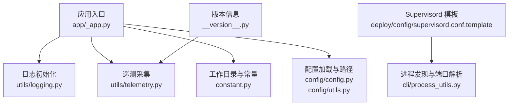
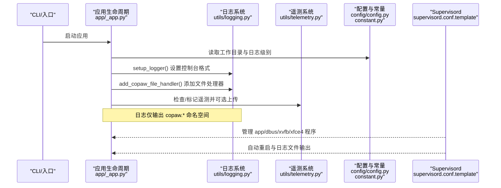
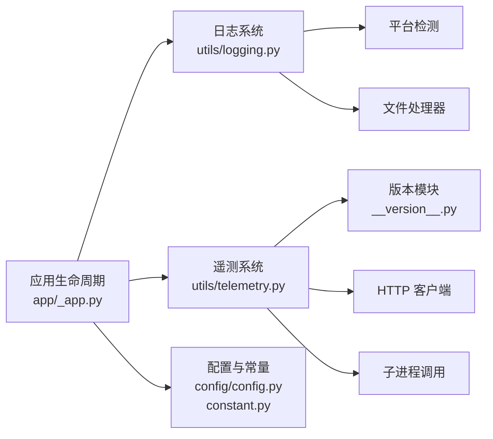

# 性能监控与优化

<cite>
**本文引用的文件**
- [监控与日志.md](file://specs/copaw-repowiki/content/部署运维/监控与日志.md)
- [logging.py](file://copaw/src/copaw/utils/logging.py)
- [telemetry.py](file://copaw/src/copaw/utils/telemetry.py)
- [_app.py](file://copaw/src/copaw/app/_app.py)
- [constant.py](file://copaw/src/copaw/constant.py)
- [supervisord.conf.template](file://copaw/deploy/config/supervisord.conf.template)
- [process_utils.py](file://copaw/src/copaw/cli/process_utils.py)
- [__version__.py](file://copaw/src/copaw/__version__.py)
- [config.py](file://copaw/src/copaw/config/config.py)
- [config/utils.py](file://copaw/src/copaw/config/utils.py)
- [init_cmd.py](file://copaw/src/copaw/cli/init_cmd.py)
- [test_health.py](file://main-project/backend/tests/test_health.py)
- [07-非功能需求与约束.md（M5）](file://specs/workshop/module-05-multi-agent/docs/07-非功能需求与约束.md)
- [07-非功能需求与约束.md（M1）](file://specs/workshop/module-01-investment-assistant/docs/07-非功能需求与约束.md)
- [app.js](file://demo/static/js/app.js)
- [app.py](file://demo/mock-api/app.py)
- [Sentiment.tsx](file://main-project/frontend/src/pages/Sentiment.tsx)
- [lineage_bp.py](file://main-project/backend/app/blueprints/lineage_bp.py)
- [trace_util.py](file://main-project/backend/app/trace_util.py)
- [heartbeat.ts](file://copaw/console/src/api/types/heartbeat.ts)
- [integration-monitor.html](file://modules-practice/module-02-gule-coding-v2/reference/solution-prototype/integration-monitor.html)
- [dingtalkApi.js](file://samples/01-qoder-cli-with-dingtalk/src/modules/dingtalkApi.js)
- [07-非功能需求与约束.md（M5）](file://specs/workshop/module-05-multi-agent/docs/07-非功能需求与约束.md)
- [monitor.html](file://modules-practice/module-02-gule-coding-v2/reference/visual/cap_demo.html)
</cite>

## 目录
1. [简介](#简介)
2. [项目结构](#项目结构)
3. [核心组件](#核心组件)
4. [架构总览](#架构总览)
5. [详细组件分析](#详细组件分析)
6. [依赖关系分析](#依赖关系分析)
7. [性能考量](#性能考量)
8. [故障排查指南](#故障排查指南)
9. [结论](#结论)
10. [附录](#附录)

## 简介
本文件面向运维与开发人员，系统化梳理 CoPaw 与多模块项目的监控与日志体系，覆盖以下主题：
- 日志配置结构、日志级别设置与输出格式定制
- 日志轮转策略、存储位置与清理规则
- 遥测数据采集、性能指标监控与错误追踪机制
- Supervisord 进程管理配置、服务监控与自动重启策略
- 告警规则设置、阈值配置与通知机制
- 性能监控指标、资源使用统计与瓶颈分析
- 日志分析工具、查询语法与可视化展示
- 监控仪表板配置、自定义指标与报告生成
- 数据库性能优化、缓存策略与内存管理最佳实践
- 负载测试、压力测试与容量规划方法论
- 告警机制、阈值设置与故障自动恢复实现
- 性能瓶颈识别、问题诊断与解决方案

## 项目结构
围绕监控与日志的关键目录与文件如下：
- 日志与遥测：copaw/src/copaw/utils/logging.py、copaw/src/copaw/utils/telemetry.py
- 应用启动与生命周期：copaw/src/copaw/app/_app.py
- 环境变量与常量：copaw/src/copaw/constant.py
- 进程与容器信息：copaw/src/copaw/cli/process_utils.py
- 配置模型与路径：copaw/src/copaw/config/config.py、copaw/src/copaw/config/utils.py
- Supervisord 模板：copaw/deploy/config/supervisord.conf.template
- 版本信息：copaw/src/copaw/__version__.py
- 初始化流程（含遥测提示）：copaw/src/copaw/cli/init_cmd.py

图表来源
- [监控与日志.md:51-71](file://specs/copaw-repowiki/content/部署运维/监控与日志.md#L51-L71)

章节来源
- [监控与日志.md:40-82](file://specs/copaw-repowiki/content/部署运维/监控与日志.md#L40-L82)

## 核心组件
- 日志系统
  - 控制台彩色输出与时间戳格式
  - 可选文件处理器（按平台差异）
  - 访问日志过滤器（抑制特定路径）
  - 日志级别映射与动态设置
- 遥测系统
  - 安装方法检测、系统信息采集
  - 同步上传与失败静默处理
  - 标记文件记录已采集版本与用户选择
- 应用生命周期
  - 启动时添加文件处理器到 copaw 命名空间
  - 生命周期内统一日志级别
- Supervisord 进程编排
  - 多程序管理、自动重启、优先级与日志文件
  - 容器运行环境变量注入
- 进程与容器探测
  - 跨平台进程快照与命令行解析
  - 端口提取与候选主机地址推导

章节来源
- [监控与日志.md:83-109](file://specs/copaw-repowiki/content/部署运维/监控与日志.md#L83-L109)

## 架构总览
下图展示了从应用启动到日志落盘、遥测上报以及进程管理的整体流程。

图表来源
- [监控与日志.md:113-137](file://specs/copaw-repowiki/content/部署运维/监控与日志.md#L113-L137)

## 详细组件分析

### 日志配置与输出格式
- 日志命名空间与作用域
  - 仅输出 copaw.* 命名空间的日志，避免第三方库噪声
  - 通过根日志器级别与处理器级别控制输出粒度
- 控制台输出
  - 彩色级别前缀（调试/信息/警告/错误/严重）
  - 时间戳与消息体格式化
  - 路径相对化显示，便于定位源码位置
- 文件输出
  - Windows/Linux：使用简单文件处理器，避免锁竞争
  - macOS：使用带轮转的文件处理器
  - 默认最大单文件大小与备份数量
- 访问日志过滤
  - 可配置路径子串列表以抑制特定访问日志
- 动态级别设置
  - 支持字符串映射到数值级别
  - 通过环境变量在启动时生效

章节来源
- [监控与日志.md:140-164](file://specs/copaw-repowiki/content/部署运维/监控与日志.md#L140-L164)
- [logging.py:16-22](file://copaw/src/copaw/utils/logging.py#L16-L22)
- [logging.py:49-80](file://copaw/src/copaw/utils/logging.py#L49-L80)
- [logging.py:104-139](file://copaw/src/copaw/utils/logging.py#L104-L139)
- [logging.py:142-185](file://copaw/src/copaw/utils/logging.py#L142-L185)
- [logging.py:82-102](file://copaw/src/copaw/utils/logging.py#L82-L102)
- [constant.py:114-116](file://copaw/src/copaw/constant.py#L114-L116)

### 日志轮转策略、存储位置与清理规则
- 存储位置
  - 应用启动时在工作目录下创建 copaw.log
  - 文件处理器按平台差异选择
- 轮转策略
  - macOS 使用带大小限制与备份数的轮转
  - Windows/Linux 使用简单文件处理器，不进行自动轮转
- 清理规则
  - 未实现自动清理逻辑；可通过外部工具（如 logrotate）或手动维护
  - 建议结合容器日志驱动与持久卷策略

章节来源
- [监控与日志.md:166-176](file://specs/copaw-repowiki/content/部署运维/监控与日志.md#L166-L176)
- [_app.py:153](file://copaw/src/copaw/app/_app.py#L153)
- [logging.py:171-176](file://copaw/src/copaw/utils/logging.py#L171-L176)
- [logging.py:12-13](file://copaw/src/copaw/utils/logging.py#L12-L13)

### 遥测数据采集与错误追踪
- 数据采集
  - 安装方式检测（pip/Docker/桌面应用）
  - 系统信息（操作系统、架构、Python 版本、GPU 检测）
  - 版本号来自版本模块
- 上报机制
  - 同步 HTTP 客户端上传，超时短路
  - 失败静默，不影响安装流程
- 标记文件
  - 已采集版本列表与永久退出选项
  - 升级/降级后重新触发采集
- 错误追踪
  - 生命周期中对遥测异常进行 debug 级别记录

章节来源
- [监控与日志.md:182-206](file://specs/copaw-repowiki/content/部署运维/监控与日志.md#L182-L206)
- [telemetry.py:29-46](file://copaw/src/copaw/utils/telemetry.py#L29-L46)
- [telemetry.py:48-75](file://copaw/src/copaw/utils/telemetry.py#L48-L75)
- [telemetry.py:78-161](file://copaw/src/copaw/utils/telemetry.py#L78-L161)
- [telemetry.py:163-182](file://copaw/src/copaw/utils/telemetry.py#L163-L182)
- [telemetry.py:194-241](file://copaw/src/copaw/utils/telemetry.py#L194-L241)
- [telemetry.py:243-290](file://copaw/src/copaw/utils/telemetry.py#L243-L290)
- [telemetry.py:292-311](file://copaw/src/copaw/utils/telemetry.py#L292-L311)
- [__version__.py:1-3](file://copaw/src/copaw/__version__.py#L1-L3)
- [_app.py:167-175](file://copaw/src/copaw/app/_app.py#L167-L175)

### Supervisord 进程管理与自动重启
- 程序定义
  - app/dbus/xvfb/xfce4 四个程序
  - autostart/autorestart 开启自动管理
  - stderr_logfile/stdout_logfile 分离标准输出与错误
- 优先级与依赖
  - priority 控制启动顺序（越小越先）
  - xfce4 依赖 xvfb 先就绪
- 环境变量
  - 容器运行标志与浏览器可执行路径等关键变量
- 日志位置
  - /var/log 下的对应程序日志文件

章节来源
- [监控与日志.md:207-220](file://specs/copaw-repowiki/content/部署运维/监控与日志.md#L207-L220)
- [supervisord.conf.template:1-40](file://copaw/deploy/config/supervisord.conf.template#L1-L40)

### 进程发现与容器环境探测
- 跨平台进程快照
  - Windows：PowerShell JSON 与 WMIC CSV 两种回退方案
  - 类 Unix：ps 命令解析
- 命令行解析
  - 判断是否为 CoPaw 服务命令
  - 提取 --port 参数默认值
- 主机候选
  - 将 0.0.0.0/::/localhost 映射为本地可达地址

章节来源
- [监控与日志.md:223-238](file://specs/copaw-repowiki/content/部署运维/监控与日志.md#L223-L238)
- [process_utils.py:85-129](file://copaw/src/copaw/cli/process_utils.py#L85-L129)
- [process_utils.py:167-196](file://copaw/src/copaw/cli/process_utils.py#L167-L196)
- [process_utils.py:198-201](file://copaw/src/copaw/cli/process_utils.py#L198-L201)
- [process_utils.py:212-237](file://copaw/src/copaw/cli/process_utils.py#L212-L237)

### 配置与路径
- 工作目录与媒体目录
  - 通过环境变量 COPAW_WORKING_DIR/COPAW_SECRET_DIR 控制
  - 默认位于用户主目录下的 .copaw 与 .copaw.secret
- 日志级别环境变量
  - COPAW_LOG_LEVEL 在启动时生效
- 路径归一化
  - 将旧版 ~/.copaw 路径重写到当前工作目录
- 浏览器可执行路径
  - 容器内优先使用环境变量指定路径
  - 非容器场景扫描系统浏览器路径

章节来源
- [监控与日志.md:239-256](file://specs/copaw-repowiki/content/部署运维/监控与日志.md#L239-L256)
- [constant.py:72-86](file://copaw/src/copaw/constant.py#L72-L86)
- [constant.py:114-121](file://copaw/src/copaw/constant.py#L114-L121)
- [config/utils.py:31-64](file://copaw/src/copaw/config/utils.py#L31-L64)
- [config/utils.py:108-127](file://copaw/src/copaw/config/utils.py#L108-L127)

### 初始化流程中的遥测提示
- 交互式初始化时，提供遥测信息面板
- 用户可选择共享匿名使用数据或永久退出
- 成功上传后记录标记文件，避免重复提示

章节来源
- [监控与日志.md:257-265](file://specs/copaw-repowiki/content/部署运维/监控与日志.md#L257-L265)
- [init_cmd.py:57-95](file://copaw/src/copaw/cli/init_cmd.py#L57-L95)
- [init_cmd.py:179-193](file://copaw/src/copaw/cli/init_cmd.py#L179-L193)

## 依赖关系分析
- 日志系统依赖
  - 平台检测与 ANSI 支持
  - 文件处理器按平台差异化
- 遥测系统依赖
  - 版本模块、HTTP 客户端、子进程调用
  - 标记文件用于幂等与去重
- 应用生命周期依赖
  - 常量模块提供工作目录与日志级别
  - 配置模块提供路径归一化与浏览器路径探测

图表来源
- [监控与日志.md:277-287](file://specs/copaw-repowiki/content/部署运维/监控与日志.md#L277-L287)
- [logging.py:28-46](file://copaw/src/copaw/utils/logging.py#L28-L46)
- [logging.py:142-185](file://copaw/src/copaw/utils/logging.py#L142-L185)
- [telemetry.py:172-182](file://copaw/src/copaw/utils/telemetry.py#L172-L182)
- [telemetry.py:184-191](file://copaw/src/copaw/utils/telemetry.py#L184-L191)
- [_app.py:148-200](file://copaw/src/copaw/app/_app.py#L148-L200)
- [constant.py:72-121](file://copaw/src/copaw/constant.py#L72-L121)
- [config/config.py:1-120](file://copaw/src/copaw/config/config.py#L1-L120)
- [__version__.py:1-3](file://copaw/src/copaw/__version__.py#L1-L3)

## 性能考量
- 日志性能
  - 控制台输出启用颜色与相对路径解析，开销较低
  - 文件处理器在 macOS 使用轮转，避免单文件过大
  - Windows/Linux 使用简单文件处理器，减少锁竞争
- 遥测性能
  - 短超时同步上传，失败静默，不影响启动
  - GPU 检测通过多途径探测，失败即降级
- 进程与容器
  - 进程快照采用回退策略，避免阻塞
  - 容器内优先使用系统浏览器路径，减少下载成本

章节来源
- [监控与日志.md:299-315](file://specs/copaw-repowiki/content/部署运维/监控与日志.md#L299-L315)
- [logging.py:171-176](file://copaw/src/copaw/utils/logging.py#L171-L176)
- [telemetry.py:172-182](file://copaw/src/copaw/utils/telemetry.py#L172-L182)
- [process_utils.py:85-129](file://copaw/src/copaw/cli/process_utils.py#L85-L129)

## 故障排查指南
- 日志级别无效
  - 检查 COPAW_LOG_LEVEL 是否正确设置
  - 确认启动时已读取该环境变量
- 日志未落盘
  - 确认应用生命周期中已调用添加文件处理器
  - 检查工作目录权限与路径
- 遥测未上传
  - 网络不可达或超时导致失败属预期行为
  - 检查标记文件是否存在且版本一致
- Supervisord 程序未启动
  - 检查 autostart/autorestart 与优先级
  - 查看对应 stdout/stderr 日志文件
- 进程查找失败
  - Windows 平台回退到 WMIC 方案
  - 类 Unix 平台确认 ps 命令可用

章节来源
- [监控与日志.md:316-340](file://specs/copaw-repowiki/content/部署运维/监控与日志.md#L316-L340)
- [constant.py:114-116](file://copaw/src/copaw/constant.py#L114-L116)
- [_app.py:153](file://copaw/src/copaw/app/_app.py#L153)
- [telemetry.py:172-182](file://copaw/src/copaw/utils/telemetry.py#L172-L182)
- [supervisord.conf.template:1-40](file://copaw/deploy/config/supervisord.conf.template#L1-L40)
- [process_utils.py:85-129](file://copaw/src/copaw/cli/process_utils.py#L85-L129)

## 结论
CoPaw 的监控与日志体系以简洁稳健为核心：日志系统聚焦于可控输出与跨平台兼容；遥测系统提供最小侵入的匿名数据采集；Supervisord 配置确保关键服务稳定运行。建议在生产环境中结合容器日志驱动与外部轮转策略，完善日志保留与清理；同时通过环境变量与模板配置实现灵活部署与可观测性增强。

## 附录

### 日志配置清单
- 日志级别映射
  - critical/error/warning/info/debug
- 输出格式
  - 时间戳 | 消息
  - 控制台：彩色级别前缀 + 相对路径
  - 文件：时间戳 + 消息
- 存储位置
  - 工作目录/copaw.log
- 轮转策略
  - macOS：按大小轮转，保留若干备份数
  - Windows/Linux：简单文件处理器，无自动轮转

章节来源
- [监控与日志.md:344-364](file://specs/copaw-repowiki/content/部署运维/监控与日志.md#L344-L364)
- [logging.py:16-22](file://copaw/src/copaw/utils/logging.py#L16-L22)
- [logging.py:106-107](file://copaw/src/copaw/utils/logging.py#L106-L107)
- [logging.py:49-80](file://copaw/src/copaw/utils/logging.py#L49-L80)
- [logging.py:171-176](file://copaw/src/copaw/utils/logging.py#L171-L176)
- [_app.py:153](file://copaw/src/copaw/app/_app.py#L153)

### 遥测字段说明
- 安装标识：安装方式（pip/docker/desktop）
- 系统信息：操作系统、版本、CPU 架构
- 运行环境：Python 版本、GPU 可用性
- 版本信息：CoPaw 当前版本
- 标记文件：已采集版本列表与永久退出选项

章节来源
- [监控与日志.md:365-377](file://specs/copaw-repowiki/content/部署运维/监控与日志.md#L365-L377)
- [telemetry.py:48-75](file://copaw/src/copaw/utils/telemetry.py#L48-L75)
- [telemetry.py:194-241](file://copaw/src/copaw/utils/telemetry.py#L194-L241)
- [telemetry.py:243-290](file://copaw/src/copaw/utils/telemetry.py#L243-L290)
- [__version__.py:1-3](file://copaw/src/copaw/__version__.py#L1-L3)

### Supervisord 程序与日志
- 程序：dbus、app、xvfb、xfce4
- 自动重启：开启
- 日志文件：/var/log/*.log
- 环境变量：容器运行标志与浏览器路径

章节来源
- [监控与日志.md:378-386](file://specs/copaw-repowiki/content/部署运维/监控与日志.md#L378-L386)
- [supervisord.conf.template:7-39](file://copaw/deploy/config/supervisord.conf.template#L7-L39)

### 进程与端口解析
- Windows：PowerShell JSON 与 WMIC CSV
- 类 Unix：ps 命令
- 端口提取：正则匹配 --port
- 主机候选：0.0.0.0/::/localhost 映射

章节来源
- [监控与日志.md:387-396](file://specs/copaw-repowiki/content/部署运维/监控与日志.md#L387-L396)
- [process_utils.py:85-129](file://copaw/src/copaw/cli/process_utils.py#L85-L129)
- [process_utils.py:198-201](file://copaw/src/copaw/cli/process_utils.py#L198-L201)
- [process_utils.py:212-237](file://copaw/src/copaw/cli/process_utils.py#L212-L237)

### 性能监控与优化最佳实践

#### 数据库性能优化
- 连接池与只读副本
  - 在高并发场景下引入只读副本，分担主库读压力
  - 合理配置连接池大小，避免连接泄漏与过度竞争
- 查询优化
  - 为高频查询建立合适索引，定期分析执行计划
  - 使用分页查询与游标翻页，避免一次性加载大量数据
- 事务与锁
  - 缩短事务时间，避免长事务持有锁
  - 使用乐观锁或版本号控制并发更新

章节来源
- [07-非功能需求与约束.md（M1）:27,37-38:27-38](file://specs/workshop/module-01-investment-assistant/docs/07-非功能需求与约束.md#L27-L38)

#### 缓存策略
- 多级缓存
  - L1：本地进程内缓存，适合短期热点数据
  - L2：分布式缓存（如 Redis），适合跨实例共享
- 缓存键设计
  - 使用前缀与命名空间隔离不同模块数据
  - 为不同数据设置合理的过期时间与 TTL
- 降级与熔断
  - 当上游服务不可用时，返回缓存数据或降级提示
  - 使用熔断器避免级联故障

章节来源
- [integration-monitor.html:577-585](file://modules-practice/module-02-gule-coding-v2/reference/solution-prototype/integration-monitor.html#L577-L585)
- [dingtalkApi.js:39-56](file://samples/01-qoder-cli-with-dingtalk/src/modules/dingtalkApi.js#L39-L56)

#### 内存管理
- 代理与内存管理
  - 使用 MemoryManager 与 MemoryCompactionHook 控制上下文大小
  - 合理设置压缩比例与保留比例，平衡吞吐与成本
- 懒加载与热重载
  - 通过懒加载减少初始内存占用
  - 零停机热重载降低切换抖动

章节来源
- [监控与日志.md:378-387](file://specs/copaw-repowiki/content/系统架构/多代理系统架构/多代理系统架构.md#L378-L387)
- [监控与日志.md:124-136](file://specs/copaw-repowiki/content/系统架构/多代理系统架构/多代理系统架构.md#L124-L136)

#### 负载测试与压力测试
- 测试目标
  - 明确端到端延迟目标与并发会话数目标
  - 使用真实流量特征与峰值场景进行压测
- 测试工具
  - 使用前端演示页面进行手动延迟测试
  - 使用后端 mock API 进行接口压力测试

章节来源
- [07-非功能需求与约束.md（M5）:16-34](file://specs/workshop/module-05-multi-agent/docs/07-非功能需求与约束.md#L16-L34)
- [app.js:102-132](file://demo/static/js/app.js#L102-L132)
- [app.py:116-129](file://demo/mock-api/app.py#L116-L129)

#### 容量规划
- 资源评估
  - 基于压测结果评估 CPU、内存、IO 与网络带宽需求
  - 为突发流量预留 20%-30% 的缓冲
- 扩容策略
  - 采用水平扩展与垂直扩展相结合的方式
  - 使用弹性伸缩策略应对流量波动

章节来源
- [07-非功能需求与约束.md（M5）:122-126](file://specs/workshop/module-05-multi-agent/docs/07-非功能需求与约束.md#L122-L126)

#### 告警机制与阈值设置
- 指标定义
  - HTTP 请求总量、请求时延直方图、工具调用次数、模型错误计数
- 阈值设定
  - 基于历史基线与业务目标设定连续窗口阈值
  - 区分 P2/P3 级别，制定相应自动化处理流程

章节来源
- [07-非功能需求与约束.md（M5）:77-100](file://specs/workshop/module-05-multi-agent/docs/07-非功能需求与约束.md#L77-L100)
- [07-非功能需求与约束.md（M1）:56-72](file://specs/workshop/module-01-investment-assistant/docs/07-非功能需求与约束.md#L56-L72)

#### 故障自动恢复
- 服务治理
  - 使用熔断与降级策略保护下游系统
  - 通过健康检查与自动重启机制恢复服务
- 日志与追踪
  - 为每个请求生成 traceId，贯穿全链路
  - 使用日志分析与告警联动快速定位问题

章节来源
- [monitor.html:559-588](file://modules-practice/module-02-gule-coding-v2/reference/visual/cap_demo.html#L559-L588)
- [lineage_bp.py:14-27](file://main-project/backend/app/blueprints/lineage_bp.py#L14-L27)
- [trace_util.py:1-5](file://main-project/backend/app/trace_util.py#L1-L5)

#### 性能瓶颈识别与诊断
- 前端性能
  - 通过前端页面展示请求耗时与状态变化
  - 使用 traceId 与后端日志关联定位问题
- 后端性能
  - 使用健康检查接口验证系统状态
  - 通过日志与遥测数据分析慢请求与错误趋势

章节来源
- [Sentiment.tsx:270-385](file://main-project/frontend/src/pages/Sentiment.tsx#L270-L385)
- [test_health.py:1-13](file://main-project/backend/tests/test_health.py#L1-L13)