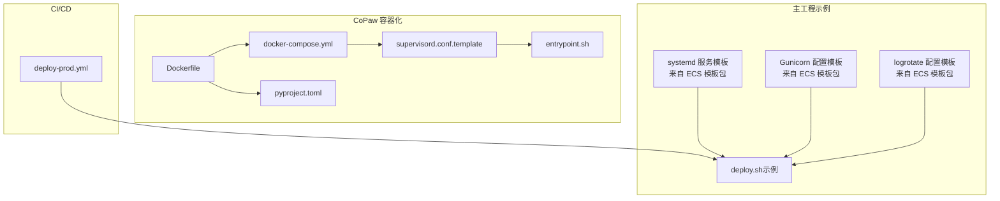
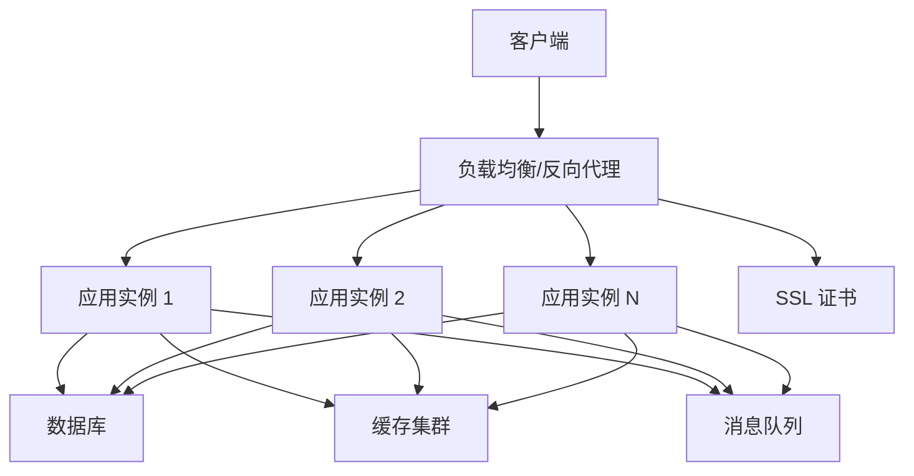
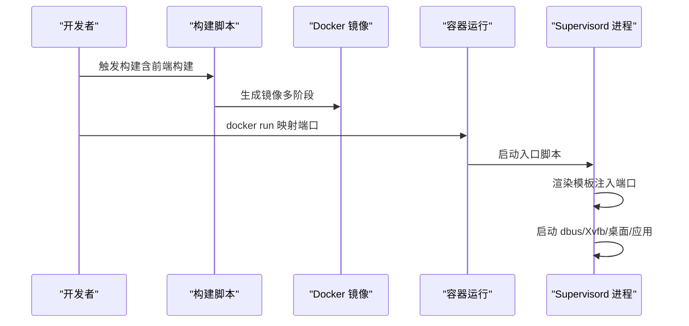
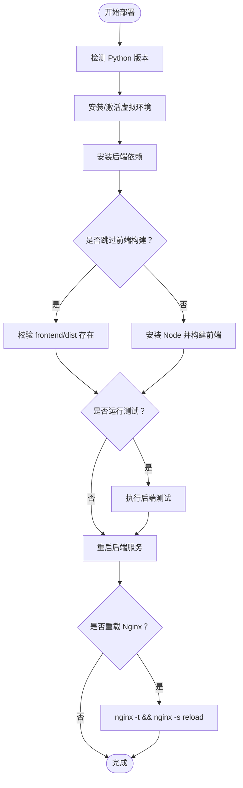
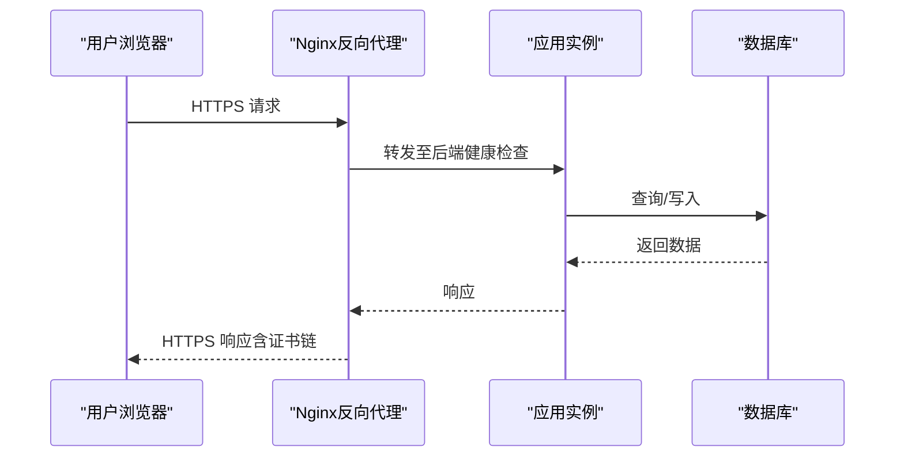
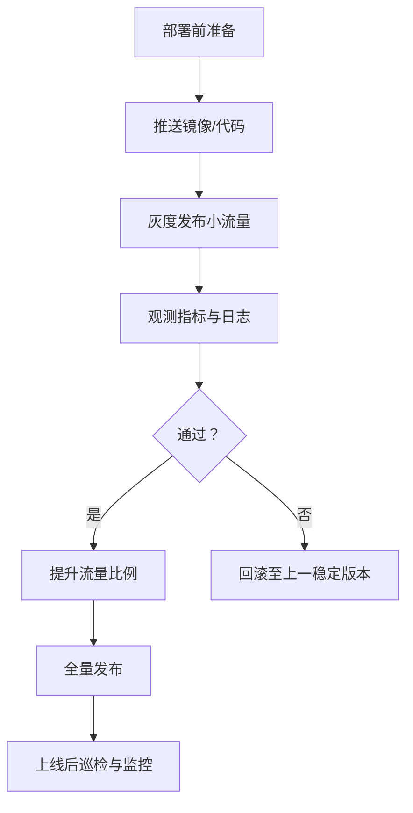
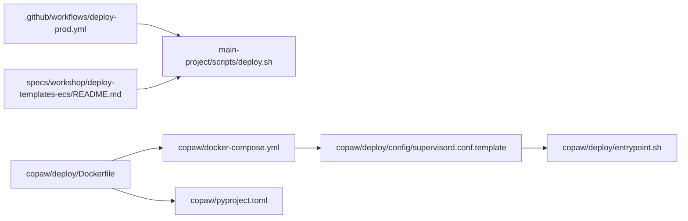

# 生产环境部署

<cite>
**本文引用的文件**
- [deploy-prod.yml](file://.github/workflows/deploy-prod.yml)
- [Dockerfile](file://copaw/deploy/Dockerfile)
- [docker-compose.yml](file://copaw/docker-compose.yml)
- [supervisord.conf.template](file://copaw/deploy/config/supervisord.conf.template)
- [entrypoint.sh](file://copaw/deploy/entrypoint.sh)
- [docker_build.sh](file://copaw/scripts/docker_build.sh)
- [pyproject.toml](file://copaw/pyproject.toml)
- [deploy.sh](file://main-project/scripts/deploy.sh)
- [README.md（ECS 部署模板包）](file://specs/workshop/deploy-templates-ecs/README.md)
- [ira-demo.conf](file://demo/nginx/ira-demo.conf)
- [deploy-demo.sh](file://demo/scripts/deploy-demo.sh)
- [nginx.conf.example（示例）](file://samples/01-qoder-cli-with-dingtalk/nginx.conf.example)
</cite>

## 目录
1. [简介](#简介)
2. [项目结构](#项目结构)
3. [核心组件](#核心组件)
4. [架构总览](#架构总览)
5. [详细组件分析](#详细组件分析)
6. [依赖关系分析](#依赖关系分析)
7. [性能考量](#性能考量)
8. [故障排查指南](#故障排查指南)
9. [结论](#结论)
10. [附录](#附录)

## 简介
本方案面向生产环境部署，覆盖硬件与基础设施要求、服务器环境准备、依赖安装与系统配置、负载均衡与反向代理、SSL 证书、数据库与缓存、消息队列、高可用与灾备、安全加固、访问控制与数据保护、部署验证与灰度回滚流程等。方案以仓库中现有的 GitHub Actions、Docker 容器化、Supervisord 进程管理、systemd 服务模板、Nginx 示例配置与 ECS 部署模板为基础，结合 CoPaw 应用的容器镜像与运行参数，给出可落地的生产级实践。

## 项目结构
- 应用主体分为两部分：
  - CoPaw（个人助理与多渠道能力）：容器化部署，使用 Supervisord 管理应用、Xvfb、桌面会话等进程，端口默认 8088。
  - 主工程（main-project）：Flask/Gunicorn 微服务示例，提供 systemd 服务模板、部署脚本与日志轮转模板，适合与 Nginx 配合对外提供服务。
- 部署自动化：
  - GitHub Actions 工作流负责远程拉取代码、执行部署脚本并输出结果。
  - ECS 部署模板包提供 systemd 服务、Gunicorn 配置、健康检查与回滚脚本等。

**图表来源**
- [Dockerfile:1-103](file://copaw/deploy/Dockerfile#L1-L103)
- [docker-compose.yml:1-23](file://copaw/docker-compose.yml#L1-L23)
- [supervisord.conf.template:1-40](file://copaw/deploy/config/supervisord.conf.template#L1-L40)
- [entrypoint.sh:1-10](file://copaw/deploy/entrypoint.sh#L1-L10)
- [pyproject.toml:1-107](file://copaw/pyproject.toml#L1-L107)
- [deploy.sh:1-113](file://main-project/scripts/deploy.sh#L1-L113)
- [README.md（ECS 部署模板包）:1-40](file://specs/workshop/deploy-templates-ecs/README.md#L1-L40)
- [deploy-prod.yml:1-89](file://.github/workflows/deploy-prod.yml#L1-L89)

**章节来源**
- [Dockerfile:1-103](file://copaw/deploy/Dockerfile#L1-L103)
- [docker-compose.yml:1-23](file://copaw/docker-compose.yml#L1-L23)
- [supervisord.conf.template:1-40](file://copaw/deploy/config/supervisord.conf.template#L1-L40)
- [entrypoint.sh:1-10](file://copaw/deploy/entrypoint.sh#L1-L10)
- [pyproject.toml:1-107](file://copaw/pyproject.toml#L1-L107)
- [deploy.sh:1-113](file://main-project/scripts/deploy.sh#L1-L113)
- [README.md（ECS 部署模板包）:1-40](file://specs/workshop/deploy-templates-ecs/README.md#L1-L40)
- [deploy-prod.yml:1-89](file://.github/workflows/deploy-prod.yml#L1-L89)

## 核心组件
- 容器镜像与运行时
  - 多阶段构建：前端构建与应用打包分离，最终镜像包含 Python、Chromium、Supervisord 等运行时依赖。
  - 环境变量：端口、工作目录、通道白/黑名单、容器运行标志等。
- 进程管理
  - Supervisord 管理 dbus、Xvfb、桌面会话与应用进程，统一输出日志。
  - 入口脚本负责将端口注入模板并启动 Supervisord。
- 部署与运维
  - GitHub Actions 工作流通过 SSH 远程执行部署脚本，支持手动触发与分支选择。
  - ECS 模板包提供 systemd 服务、Gunicorn 配置、健康检查与回滚脚本。
- 反向代理与静态资源
  - Nginx 示例配置演示静态站点、Mock API 代理与跨域头设置，可作为生产前置代理参考。

**章节来源**
- [Dockerfile:1-103](file://copaw/deploy/Dockerfile#L1-L103)
- [supervisord.conf.template:1-40](file://copaw/deploy/config/supervisord.conf.template#L1-L40)
- [entrypoint.sh:1-10](file://copaw/deploy/entrypoint.sh#L1-L10)
- [deploy-prod.yml:1-89](file://.github/workflows/deploy-prod.yml#L1-L89)
- [README.md（ECS 部署模板包）:1-40](file://specs/workshop/deploy-templates-ecs/README.md#L1-L40)
- [ira-demo.conf:1-47](file://demo/nginx/ira-demo.conf#L1-L47)

## 架构总览
生产环境推荐采用“反向代理 + 多实例 + 容器编排”的模式：
- 反向代理层：Nginx/HAProxy，负责 SSL 终止、静态资源、上游健康检查与流量转发。
- 应用层：容器化应用（CoPaw 或主工程示例），通过 systemd/Gunicorn + Supervisord 管理，支持水平扩展。
- 数据与中间件：数据库（PostgreSQL/MySQL）、缓存（Redis/Memcached）、消息队列（RabbitMQ/Redis Streams/Kafka）按需部署。
- 监控与日志：集中式日志与指标采集，配合健康检查与告警。

## 详细组件分析

### 容器化应用（CoPaw）
- 镜像构建
  - 多阶段构建前端产物并注入到应用包中，安装 Python、Chromium、Supervisord 等依赖。
  - 支持通过构建参数控制通道白/黑名单，便于裁剪运行环境。
- 运行与进程管理
  - 默认监听 8088 端口，可通过环境变量覆盖。
  - Supervisord 管理 dbus、Xvfb、桌面会话与应用进程，统一输出日志。
- 开发与本地调试
  - docker-compose 提供本地单容器运行方式，映射 127.0.0.1:8088:8088。

**图表来源**
- [docker_build.sh:1-32](file://copaw/scripts/docker_build.sh#L1-L32)
- [Dockerfile:1-103](file://copaw/deploy/Dockerfile#L1-L103)
- [entrypoint.sh:1-10](file://copaw/deploy/entrypoint.sh#L1-L10)
- [supervisord.conf.template:1-40](file://copaw/deploy/config/supervisord.conf.template#L1-L40)
- [docker-compose.yml:1-23](file://copaw/docker-compose.yml#L1-L23)

**章节来源**
- [docker_build.sh:1-32](file://copaw/scripts/docker_build.sh#L1-L32)
- [Dockerfile:1-103](file://copaw/deploy/Dockerfile#L1-L103)
- [entrypoint.sh:1-10](file://copaw/deploy/entrypoint.sh#L1-L10)
- [supervisord.conf.template:1-40](file://copaw/deploy/config/supervisord.conf.template#L1-L40)
- [docker-compose.yml:1-23](file://copaw/docker-compose.yml#L1-L23)

### 主工程（示例）与 systemd/Gunicorn
- systemd 服务模板
  - 提供后端与可选 worker 服务模板，需替换路径与运行用户后启用。
- Gunicorn 配置模板
  - 提供并发、绑定地址、超时等配置参考。
- 部署脚本
  - 自检 Python/Node 版本，拉取代码、安装依赖、前端构建（可跳过）、重启服务、可选重载 Nginx。
- 日志轮转
  - 提供 Nginx 与应用日志轮转配置模板，避免磁盘暴涨。

**图表来源**
- [deploy.sh:1-113](file://main-project/scripts/deploy.sh#L1-L113)
- [README.md（ECS 部署模板包）:1-40](file://specs/workshop/deploy-templates-ecs/README.md#L1-L40)

**章节来源**
- [deploy.sh:1-113](file://main-project/scripts/deploy.sh#L1-L113)
- [README.md（ECS 部署模板包）:1-40](file://specs/workshop/deploy-templates-ecs/README.md#L1-L40)

### 反向代理与 SSL 证书
- Nginx 示例
  - 演示静态资源目录映射、Mock API 代理、CORS 头设置与请求体大小限制。
  - 可作为生产前置代理的基础模板，结合真实域名与证书。
- SSL 证书
  - 建议使用 Let’s Encrypt 自动签发与续期，或企业 CA 证书。
  - 在反向代理层终止 TLS，后端服务可走内网明文或启用应用侧 TLS。
- 负载均衡
  - 使用 Nginx upstream 或 HAProxy，配置健康检查与故障转移。

**图表来源**
- [ira-demo.conf:1-47](file://demo/nginx/ira-demo.conf#L1-L47)
- [nginx.conf.example（示例）](file://samples/01-qoder-cli-with-dingtalk/nginx.conf.example)

**章节来源**
- [ira-demo.conf:1-47](file://demo/nginx/ira-demo.conf#L1-L47)
- [nginx.conf.example（示例）](file://samples/01-qoder-cli-with-dingtalk/nginx.conf.example)

### 数据库、缓存与消息队列（生产级配置要点）
- 数据库
  - 使用主从复制或高可用集群（如 PostgreSQL/MySQL 高可用方案），开启只读副本与自动故障转移。
  - 连接池与慢查询监控，定期备份与校验。
- 缓存
  - Redis 集群或哨兵模式，持久化策略（RDB/AOF），内存淘汰策略，监控命中率与延迟。
- 消息队列
  - 选择 RabbitMQ/Redis Streams/Kafka，配置分区/副本、ACK 与死信队列，幂等消费与重试策略。

[本节为通用实践说明，不直接分析具体文件，故无“章节来源”]

### 高可用、故障转移与灾备
- 多实例与健康检查
  - 反向代理对多实例进行健康检查，异常实例摘除，流量切换至健康节点。
- 自动故障转移
  - 使用数据库高可用与存储快照，结合自动化脚本进行切换。
- 灾难恢复
  - 制定 RTO/RPO 指标，定期演练恢复流程，验证备份数据可用性。

[本节为通用实践说明，不直接分析具体文件，故无“章节来源”]

### 安全加固、访问控制与数据保护
- 系统加固
  - 关闭不必要的服务与端口，最小权限原则，定期更新系统与依赖。
- 访问控制
  - 反向代理层启用 IP 白名单、速率限制与 WAF；应用层启用认证与授权。
- 数据保护
  - 传输加密（TLS）、静态加密、密钥管理（KMS/密钥管理服务），敏感信息脱敏与最小化收集。

[本节为通用实践说明，不直接分析具体文件，故无“章节来源”]

### 部署验证、灰度发布与回滚预案
- 部署验证
  - 健康检查脚本验证端口、进程与关键接口；日志轮转生效；Nginx 配置语法正确。
- 灰度发布
  - 逐步扩大流量比例，观察指标与告警，必要时快速回滚。
- 回滚预案
  - ECS 模板包提供回滚脚本模板，结合镜像标签与配置版本管理，确保可逆操作。

**图表来源**
- [README.md（ECS 部署模板包）:1-40](file://specs/workshop/deploy-templates-ecs/README.md#L1-L40)

**章节来源**
- [README.md（ECS 部署模板包）:1-40](file://specs/workshop/deploy-templates-ecs/README.md#L1-L40)

## 依赖关系分析
- CoPaw 容器化
  - Dockerfile 依赖前端构建产物与 Python 包清单；Supervisord 模板定义进程生命周期；入口脚本负责模板渲染与启动。
- 主工程示例
  - deploy.sh 依赖 systemd 服务与 Gunicorn 配置模板；日志轮转模板用于长期稳定性保障。
- CI/CD
  - deploy-prod.yml 通过 SSH 远程执行部署脚本，实现手动触发与分支选择。

**图表来源**
- [deploy-prod.yml:1-89](file://.github/workflows/deploy-prod.yml#L1-L89)
- [deploy.sh:1-113](file://main-project/scripts/deploy.sh#L1-L113)
- [Dockerfile:1-103](file://copaw/deploy/Dockerfile#L1-L103)
- [docker-compose.yml:1-23](file://copaw/docker-compose.yml#L1-L23)
- [supervisord.conf.template:1-40](file://copaw/deploy/config/supervisord.conf.template#L1-L40)
- [entrypoint.sh:1-10](file://copaw/deploy/entrypoint.sh#L1-L10)
- [pyproject.toml:1-107](file://copaw/pyproject.toml#L1-L107)
- [README.md（ECS 部署模板包）:1-40](file://specs/workshop/deploy-templates-ecs/README.md#L1-L40)

**章节来源**
- [deploy-prod.yml:1-89](file://.github/workflows/deploy-prod.yml#L1-L89)
- [deploy.sh:1-113](file://main-project/scripts/deploy.sh#L1-L113)
- [Dockerfile:1-103](file://copaw/deploy/Dockerfile#L1-L103)
- [docker-compose.yml:1-23](file://copaw/docker-compose.yml#L1-L23)
- [supervisord.conf.template:1-40](file://copaw/deploy/config/supervisord.conf.template#L1-L40)
- [entrypoint.sh:1-10](file://copaw/deploy/entrypoint.sh#L1-L10)
- [pyproject.toml:1-107](file://copaw/pyproject.toml#L1-L107)
- [README.md（ECS 部署模板包）:1-40](file://specs/workshop/deploy-templates-ecs/README.md#L1-L40)

## 性能考量
- 容器与进程
  - 合理设置 Supervisord 进程优先级与日志输出，避免 I/O 抖动。
- 反向代理
  - 启用 gzip/HTTP/2，合理设置连接数与超时，开启缓存静态资源。
- 应用层
  - 使用连接池与异步 I/O，监控响应时间与并发数，按需扩容实例。
- 数据层
  - 读写分离、索引优化、慢查询分析与定期维护。

[本节为通用实践说明，不直接分析具体文件，故无“章节来源”]

## 故障排查指南
- 容器与进程
  - 检查 Supervisord 日志与应用日志，确认端口占用与环境变量注入是否正确。
- 部署脚本
  - 使用健康检查脚本验证服务状态；如需回滚，参考 ECS 模板包中的回滚脚本模板。
- 反向代理
  - 使用 nginx -t 检查配置语法，查看 access/error 日志定位问题。

**章节来源**
- [supervisord.conf.template:1-40](file://copaw/deploy/config/supervisord.conf.template#L1-L40)
- [entrypoint.sh:1-10](file://copaw/deploy/entrypoint.sh#L1-L10)
- [deploy.sh:1-113](file://main-project/scripts/deploy.sh#L1-L113)
- [README.md（ECS 部署模板包）:1-40](file://specs/workshop/deploy-templates-ecs/README.md#L1-L40)
- [ira-demo.conf:1-47](file://demo/nginx/ira-demo.conf#L1-L47)

## 结论
本方案基于仓库现有容器化与部署模板，给出了生产环境的落地路径：以 Nginx 为反向代理与前置安全边界，容器化应用通过 Supervisord 管理进程，结合 systemd/Gunicorn 与健康检查实现高可用；辅以数据库、缓存与消息队列的生产级配置，配合灰度发布与回滚预案，确保变更可控、可观测、可恢复。

## 附录
- 关键文件路径与用途
  - GitHub Actions 工作流：触发生产部署与远程执行。
  - Dockerfile 与 docker-compose：容器化构建与本地运行。
  - Supervisord 模板与入口脚本：进程生命周期与日志管理。
  - ECS 部署模板包：systemd/Gunicorn/健康检查/回滚/日志轮转模板。
  - Nginx 示例配置：静态资源、代理与 CORS 参考。

**章节来源**
- [deploy-prod.yml:1-89](file://.github/workflows/deploy-prod.yml#L1-L89)
- [Dockerfile:1-103](file://copaw/deploy/Dockerfile#L1-L103)
- [docker-compose.yml:1-23](file://copaw/docker-compose.yml#L1-L23)
- [supervisord.conf.template:1-40](file://copaw/deploy/config/supervisord.conf.template#L1-L40)
- [entrypoint.sh:1-10](file://copaw/deploy/entrypoint.sh#L1-L10)
- [README.md（ECS 部署模板包）:1-40](file://specs/workshop/deploy-templates-ecs/README.md#L1-L40)
- [ira-demo.conf:1-47](file://demo/nginx/ira-demo.conf#L1-L47)